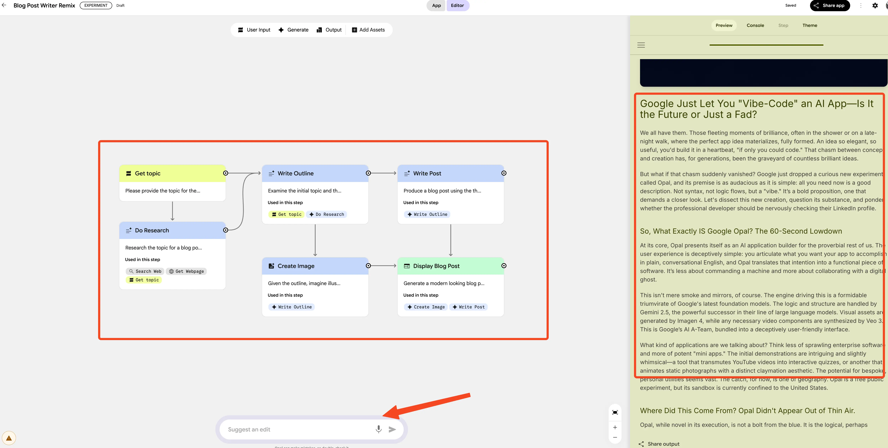

import Button from "@components/widgets/Button.astro";
import Notice from "@components/widgets/Notice.astro";
import ListCheck from "@components/widgets/ListCheck.astro";
import Accordion from "@components/widgets/Accordion.astro";

The **Google Opal AI app builder** launched as a US-only beta in July 2025. It's now available in 160+ countries, integrated into the Gemini web app, and (as of February 2026) ships with an Agent step that plans, picks tools, and routes dynamically without you specifying a model. Combined with Jules (now GA with structured pricing) and the new Antigravity CLI replacing Gemini CLI for consumers, Google's AI development stack has changed significantly.

This guide covers what Opal is today, how the Agent step works, the current model lineup, how it compares to alternatives like Lovable and n8n, and the operator reality: cost, lock-in, and when not to use it.

## What is Google Opal? The no-code AI mini-app builder

Google Opal is an experimental Google Labs no-code builder where natural language and visual editing create chainable multi-step AI mini-apps. The workflow uses three building blocks: **User Input**, **Generate**, and **Output**, chained into workflows that take user input, process it through AI model calls, and deliver results.



Apps are hosted by Google, shared via URL, and usable by anyone with a Google account. There's no code export, no self-hosting, and no database layer. The template gallery and remix culture remain the primary onboarding path. You start from a template or describe something from scratch.

### What makes Opal work

<ListCheck>

- **Natural Language Input**: Describe your app idea in plain English, no platform-specific terminology to learn
- **Visual Workflow Generation**: Opal automatically creates illustrated workflows showing each step, editable by anyone regardless of technical background
- **Agent Step + Multi-Model Integration**: Choose a specific model or let the Agent step auto-select tools and models based on your prompt
- **Real-Time Editing**: Modify workflows using conversational commands or the visual editor; reference step outputs with `@stepName.output`
- **Instant Sharing**: Deploy and share apps immediately via URL with anyone who has a Google account

</ListCheck>

<Notice type="info" title="Access and availability">

Opal is a free Google Labs experiment, available in 160+ countries (since November 2025) and inside the Gemini web app's Gems manager. No waitlist. Still no paid tier announced as of September 2026.

</Notice>

## The Agent step: how Opal's mini-apps work now

The most significant feature addition since Opal launched is the **Agent step** (February 24, 2026). Instead of selecting a specific model in the Generate step, you can now select "Agent." Opal's Agent step, powered by Gemini 3 Flash, will plan, pick tools and models automatically, and execute.

The Agent step does three things that fixed-step workflows can't:

<ListCheck>

- **Persistent memory**: The Agent can store and recall information across turns using Google Sheets as a backing store, useful for multi-session apps like research assistants or style profilers
- **Dynamic routing**: If-then paths based on user input or intermediate results. The Agent decides which tools to invoke (Web Search, Veo, Google Sheets) without you wiring explicit branches
- **Interactive multi-turn chat**: Users can have a back-and-forth conversation with the app, refining outputs iteratively rather than submitting a single prompt

</ListCheck>

### Official Agent examples to remix

Google ships several starter templates that demonstrate Agent step capabilities:

<Accordion label="Visual Storyteller" group="agent-examples">

Generates illustrated stories with branching narratives. Demonstrates dynamic routing. The Agent picks image generation (Nano Banana) or video (Veo) based on the story segment, and uses persistent memory to maintain character and plot consistency across turns.

</Accordion>

<Accordion label="Room Styler" group="agent-examples">

Upload a photo of a room and get redesign suggestions with generated visuals. Demonstrates multi-tool selection. The Agent analyzes the image, generates style options, and produces new renders, all without explicit model wiring in the workflow.

</Accordion>

<Accordion label="Executive Briefing" group="agent-examples">

Creates structured business briefings from a topic prompt. Demonstrates persistent memory and Web Search integration. The Agent researches a topic, stores key findings, and produces a formatted briefing that can be refined across multiple chat turns.

</Accordion>

<Accordion label="Video Hooks Brainstormer" group="agent-examples">

Generates short video hook concepts for social media. Demonstrates Veo integration and interactive chat. The Agent proposes hooks, generates preview clips, and iterates based on user feedback.

</Accordion>

<Notice type="warning" title="Verify on publish day">

The live model and tool list in the Agent step should be confirmed in Opal's UI on the day you build. Model rosters rotate fast. The capabilities described here are based on Google's February 2026 announcement and March 2026 reporting.

</Notice>

Support for [Model Context Protocol (MCP) integration](/mcp-introduction-beginners/) is reportedly being tested, which would let Opal apps connect to external tools beyond Google's built-in set. Worth watching.

## Opal's model lineup: Gemini 3 Flash, Nano Banana, Veo and Lyria 2

The Generate step in Opal now offers a significantly expanded roster compared to the original Gemini 2.5 / Veo 3 / Imagen 4 lineup:

| Model | Category | Capability | Use Cases |
|-------|----------|------------|-----------|
| **Gemini 3 Flash** | Text | Fast reasoning and generation | Blog posts, analysis, conversational interfaces, code generation |
| **Gemini 3.1 Pro** | Text | Deeper reasoning, longer context | Complex analysis, multi-step planning, detailed reports |
| **Nano Banana** | Image | High-quality image generation (successor to Imagen 4) | Illustrations, product mockups, visual assets |
| **Nano Banana Pro** | Image | Higher fidelity image generation | Detailed artwork, photorealistic renders |
| **AudioLM** | Audio | Text-to-speech and audio generation | Narration, podcast segments, audio summaries |
| **Veo** | Video | Video generation with audio | Marketing videos, educational clips, social media content |
| **Lyria 2** | Music | Music and audio generation | Background music, jingles, soundtracks |
| **Agent** | Auto | Gemini 3 Flash with planning, tool selection, memory, routing | Any workflow where you want the AI to decide which models and tools to use |

If you need these media models via API outside Opal's sandbox (remember: no code export), see our [Kie.ai review](https://go.bitdoze.com/kie-ai) for affordable image, video, and music generation APIs. For [free access to Gemini 3 models](/use-claude-sonnet-4-5-gpt-5-free/) through other interfaces, check our guide on using Gemini models for free.

## How Opal compares to no-code platforms and AI coding tools

Opal is not a code generator. It produces no exportable code, no self-hosting, no database layer. It's a prompt-to-mini-app tool. Here's how it stacks up:

| Feature | Google Opal | Lovable / Bolt / v0 | Replit | n8n / Zapier | Traditional No-Code (Bubble/Webflow) |
|---------|-------------|---------------------|--------|--------------|--------------------------------------|
| **Learning Curve** | Minimal (natural language) | Low-moderate (prompt + edit) | Moderate (code editor) | Moderate (node-based) | Moderate-high (platform-specific) |
| **AI Integration** | Native multi-modal + Agent | Code generation from prompts | AI-assisted coding | External AI triggers | Limited or external |
| **Code Export** | None | Yes (full codebase) | Yes | N/A (workflow tool) | Limited |
| **Hosting** | Google-hosted only | Deploy anywhere | Replit or export | Self-hosted or SaaS | Platform-dependent |
| **Database** | None | Yes (Supabase, etc.) | Yes (built-in) | External connectors | Built-in |
| **Best For** | Quick AI mini-prototypes, demos | Production web apps | Full-stack development | Deep automation workflows | Complex web applications |

<Notice type="success" title="Opal's competitive edge">

Opal is the fastest path from idea to shareable AI mini-app — but it's not a code generator or a production platform. For a free full-stack AI app builder with code export and no API keys needed, see [Freebuff](https://go.bitdoze.com/freebuff). For the full landscape, check our [best AI coding tools and agents in 2026](/ai-coading-tools/) roundup.

</Notice>

### Where Opal wins

1. **Speed to shareable prototype**: Describe, generate, share URL — minutes, not hours
2. **Zero infrastructure**: No servers, no deployment pipelines, no hosting bills
3. **Multi-modal by default**: Text, image, video, audio, and music without configuring external services
4. **Agent step flexibility**: The AI decides which tools to use — you don't need to wire explicit model calls

### Where Opal loses

No code export means vendor lock-in. No database means stateless apps (unless you abuse Sheets as a backing store). No custom domains. No offline mode. Apps break if Google changes or discontinues the experiment.

## Google's AI development ecosystem: Opal, Jules, Antigravity and Gemini CLI

Opal doesn't exist in isolation. Google's AI development stack now has four main components, each serving a different audience.

### Jules: the autonomous coding agent (GA)

Jules left beta on August 6, 2025, and now has structured paid tiers. It's an asynchronous coding agent that works directly with GitHub repositories — analyzing full codebases, writing tests, building features, fixing bugs, and updating dependencies in cloud VMs while you work on other things.

| Tier | Price | Tasks/Day | Concurrent | Model |
|------|-------|-----------|------------|-------|
| **Jules (free)** | $0 | 15 | 3 | Gemini 2.5 Pro |
| **Jules in AI Pro** | $19.99/mo | 100 | 15 | Gemini 3 Pro |
| **Jules in AI Ultra** | $100 or $200/mo | 300 | 60 | Gemini 3 Pro (priority) |

<ListCheck>

- **Async execution**: Works in cloud VMs while you focus on other tasks
- **Full codebase analysis**: Understands entire repositories, not just individual files
- **GitHub integration**: Works directly within your existing workflow via issue labels
- **Jules Tools CLI**: Terminal commands (`/new`, `/remote`) for task management (October 2025)
- **Jules API**: Early preview for Slack-triggered tasks and CI/CD wiring (October 2025)
- **Per-repo memory**: Remembers preferences and context across sessions

</ListCheck>

**Important for GitLab users**: Jules is GitHub-only. No GitLab support announced. If you run GitLab CI, Jules won't integrate with your workflow.

For a detailed breakdown of [Google AI Pro and AI Ultra subscriptions across AI tools](/vibeproxy-ai-subscriptions-guide/), see our subscription math guide.

### Antigravity: Google's agentic IDE and CLI

Antigravity launched in November 2025 as a VS Code fork with Gemini 3 integration. At I/O in May 2026, Google announced **Antigravity 2.0**, the **Antigravity CLI**, and an **SDK**. This is now Google's primary consumer/developer CLI — not Gemini CLI.

The Antigravity CLI is Go-based, shares the Antigravity 2.0 agent harness, and keeps Gemini CLI's Agent Skills, Hooks, Subagents, and Extensions-as-plugins architecture. Migration guides are available at antigravity.google.

For Google's developer-facing agent stack alongside Antigravity, see our guide to the [Google Agent Development Kit (ADK)](/google-adk-start/).

<Notice type="info" title="Gemini CLI consumer sunset">

Gemini CLI is being sunset for consumer tiers. Consumer access (free, AI Pro, AI Ultra) stopped being served on June 18, 2026. Enterprise (Code Assist Standard/Enterprise) and paid Gemini API keys remain available. New users should start with Antigravity CLI. If you need unified access to multiple AI coding CLIs (Claude Code, OpenAI Codex, Gemini CLI), [Agent Router](https://go.bitdoze.com/agentrouter) provides a single interface. For [open-source terminal coding agents](/opencode-setup-guide/), see our setup guide — [OpenCode Go](https://go.bitdoze.com/opencode-go) is a solid alternative.

</Notice>

### Gemini CLI: now transitional

Gemini CLI is open-source (Apache-2.0), has ~107k GitHub stars, and is still shipping (v0.57.0 as of August 2026). But for consumers, it's effectively replaced by Antigravity CLI. The examples below still work if you have enterprise access or a paid API key:

**Codebase exploration:**
```bash
gemini
> Describe the main pieces of this system's architecture
> What security mechanisms are in place?
> Generate a README section for the authentication module
```

**Workflow automation:**
```bash
> Make me a slide deck showing git history from the last 7 days
> Create a wall display app for our most active GitHub issues
> Convert all images in this directory to PNG with EXIF date naming
```

For new consumer projects, start with Antigravity CLI instead.

## Getting started with Google Opal: build your first AI mini-app

### Prerequisites and setup

<ListCheck>

- **Location**: 160+ countries (no geo-restriction for most readers)
- **Account**: Google account required
- **Access**: No waitlist — immediate access
- **Cost**: Free (no paid tier announced)
- **Browser**: Modern web browser with JavaScript enabled

</ListCheck>

**Two entry points:**
1. **Direct**: Visit [opal.google](https://opal.google) — sign in with your Google account
2. **Gemini app**: Open the Gemini web app → Gems manager → build or reuse "experimental Gems" (added December 2025)

### Step-by-step quick start

1. **Visit Opal**: Navigate to [opal.google](https://opal.google)
2. **Sign In**: Use your Google account credentials (the consent step may ask to "Select all" for access scopes)
3. **Explore Templates**: Browse the template gallery for inspiration — games, video ads, education tools, productivity apps
4. **Create Your First App**: Click "Create New" and describe your idea in plain English
5. **Customize Workflow**: Use the visual editor to refine steps; reference outputs with `@stepName.output`
6. **Test and Debug**: Use the debug panel to step through your workflow and catch issues
7. **Share**: Click the share button to generate a URL — anyone with a Google account can use your app

### Workflow-building tips

<Accordion label="Tips for better Opal workflows" group="opal-tips">

- **Name steps clearly**: Descriptive step names make `@stepName.output` references easier to manage
- **Reference outputs explicitly**: Use `@stepName.output` to chain data between steps
- **Avoid circular dependencies**: Don't have Step A depend on Step B's output if Step B already depends on Step A
- **Use the debug panel**: Step through your workflow to see intermediate outputs and catch prompt issues early
- **Keep prompts self-contained**: Each Generate step should have enough context to work independently — don't assume the model remembers earlier steps unless you pass the data explicitly
- **Start with templates**: Remix a gallery template before building from scratch — you'll learn the workflow patterns faster

</Accordion>

## Real-world applications and use cases

These use cases match Google's own promoted examples and the template gallery. The Agent step makes several of them significantly more capable than the original fixed-step approach.

<Accordion label="Business and marketing" group="use-cases">

**Scenario**: A small business owner wants personalized video ads for different customer segments.

**Opal approach**: Describe the app — "generate personalized video ads based on customer demographics and product interests." With the Agent step, the app can dynamically route between Veo (video generation) and Nano Banana (static visuals) based on the segment, and use persistent memory to maintain brand consistency across generated assets.

**Traditional approach**: Hire a video production team, create multiple versions manually, weeks of production time.

</Accordion>

<Accordion label="Education and training" group="use-cases">

**Scenario**: A teacher needs interactive learning modules for different learning styles.

**Opal solution**:
- Input: Learning objectives and student preferences
- Process: Generate visual explanations (Nano Banana), audio summaries (AudioLM), and interactive quizzes (Gemini 3 Flash)
- Output: Personalized learning experiences for each student

The Agent step can adapt the content format based on the student's stated preference without explicit routing logic.

</Accordion>

<Accordion label="Content creation" group="use-cases">

**Scenario**: A content creator wants to maintain consistent publishing across multiple platforms.

**Opal workflow**:
1. Input article topic and target audience
2. Agent generates blog post, social media variants, and accompanying visuals
3. Output optimized content for each platform — text for the blog, short-form for social, visuals sized per platform

</Accordion>

<Accordion label="Internal tools and automation" group="use-cases">

**Scenario**: A startup needs custom tools for project management and reporting.

**Opal advantage**: Create specialized mini-apps for specific workflows without hiring developers or purchasing expensive software licenses. The Agent step can integrate with Google Sheets for data persistence, making these tools more useful than pure stateless prototypes.

</Accordion>

## Cost, limits and lock-in: the operator's take

Here's the honest operator perspective on Opal and Google's AI development tools.

**Opal is free today** — but it's a Labs experiment. No SLA, no code export, no self-hosting, no database layer. Apps live on Google-hosted links and outputs may be SynthID watermarked. For side projects and demos, that's fine. For production, it's not.

<Notice type="warning" title="Lock-in reality">

Opal is a Labs experiment with no SLA. Apps can't be exported, self-hosted, or connected to external databases. If Google changes or discontinues the experiment, your apps are gone. For production workloads, look at [self-hosted n8n workflow automation](/n8n-self-host-workflow-automation/) or code-generation builders.

</Notice>

**Jules has structured tiers** that matter if you're doing real development work:

| Plan | Price | Storage | Jules Limits | GCP Credits |
|------|-------|---------|--------------|-------------|
| **AI Plus** | $4.99/mo | 400 GB | Base limits | — |
| **AI Pro** | $19.99/mo | 5 TB | 100 tasks/day, 15 concurrent | $10/mo |
| **AI Ultra** | $100/mo | 20 TB | 300 tasks/day, 60 concurrent | $40/mo |
| **AI Ultra (top)** | $200/mo | 30 TB | 300 tasks/day, 60 concurrent (priority) | $100/mo |

Google moved from daily prompt counts to compute-based quotas with 5-hour refresh and pay-as-you-go AI credits for overage (announced I/O 2026). For a detailed breakdown of [Google AI Pro and AI Ultra subscriptions across AI tools](/vibeproxy-ai-subscriptions-guide/), see our subscription math guide.

**What you can't do with Opal:**
- Export code or self-host apps
- Connect to external databases (Sheets is the only persistence option)
- Use custom domains
- Run apps offline
- Use it for anything that needs to survive a Google product reorg

## When NOT to use Opal — and what to use instead

Opal is great for quick prototypes, internal demos, educational tools, and content generation one-offs. It's not the right tool for everything.

| Use Case | Better Tool | Why |
|----------|-------------|-----|
| Production web app | Lovable / Bolt / v0 | Exportable code, deploy anywhere, real databases |
| Deep automation workflows | [Self-hosted n8n](/n8n-self-host-workflow-automation/) or Zapier | Complex triggers, external integrations, production reliability |
| Async coding tasks | Jules | GitHub integration, full codebase analysis, structured tiers |
| Developer CLI | Antigravity CLI | Full agent harness, Agent Skills, Hooks, Extensions |
| Free full-stack builder with code export | [Freebuff](https://go.bitdoze.com/freebuff) | No subscription, no API keys, full-stack with code export |

For the full landscape of code-generation tools, see our [best AI coding tools and agents in 2026](/ai-coading-tools/) roundup.

**Common failure modes with Opal:**
- Long or underspecified prompts produce inconsistent results
- Templates sometimes stall on external steps (e.g., Web Search timeouts)
- Outputs vary run-to-run — not deterministic, not production-grade
- Complex business logic requires workarounds (multiple connected apps, Sheets as a database)

## What's coming next for Opal

Google hasn't published a public roadmap for Opal. Here's what's known or rumored:

<ListCheck>

- **MCP tool connectivity**: Support for [Model Context Protocol (MCP) integration](/mcp-introduction-beginners/) is reportedly being tested — would let Opal apps connect to external tools beyond Google's built-in set
- **Pricing and Labs graduation**: Will Opal eventually have a paid tier? No announcement yet, but Google's compute-based quota model (AI credits) suggests a monetization path exists
- **Deeper Workspace integration**: Current Workspace connectivity is read-only outputs (Docs/Slides/Sheets) — deeper write-back and bidirectional sync would make Opal more useful for internal tools
- **Agent autonomy expansion**: More tools, more models, multi-step planning — the Agent step is clearly the direction Google is investing in
- **Multi-language support**: Currently English-primary; broader language support would unlock the 160+ country audience

</ListCheck>

Google's I/O 2026 messaging emphasized "citizen builders" — the idea that non-developers should be able to build with AI. Opal is the clearest expression of that vision. Whether it graduates from Labs into a permanent product remains to be seen.

## Conclusion: the dawn of conversational development

Google Opal has matured from a US-only experiment into a genuinely capable no-code AI app builder available worldwide. The Agent step is the real differentiator — it makes Opal mini-apps feel more like autonomous agents than static workflows. Combined with Jules for serious async coding tasks and Antigravity CLI for terminal-first development, Google now has a coherent AI development stack at every level of abstraction.

For operators: Opal is excellent for prototyping, demos, and educational tools. It's not a production platform. No code export, no database, no SLA. If your app needs to survive a Google product reorg, build it with something that gives you exportable code.

**Ready to start building?**

<Button text="Try Google Opal" link="https://opal.google" size="lg" color="blue" variant="solid" icon="arrow-right" />

<Button text="Explore Jules" link="https://jules.google" size="lg" color="green" variant="solid" icon="arrow-right" />

<Button text="Get Antigravity CLI" link="https://antigravity.google" size="lg" color="purple" variant="solid" icon="arrow-right" />

<Notice type="info" title="Stay updated">

Google's AI development tools are evolving fast. Follow Google Labs and the Gemini developer community for the latest updates. This article was last updated September 2026.

</Notice>
