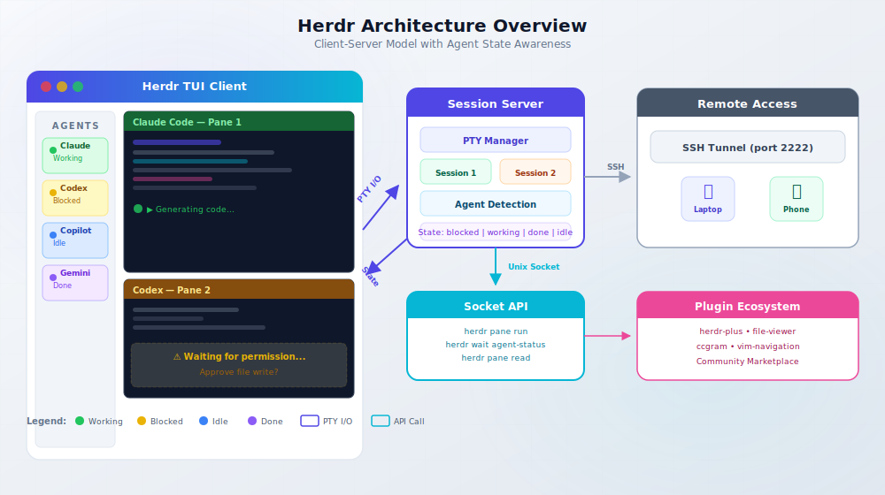
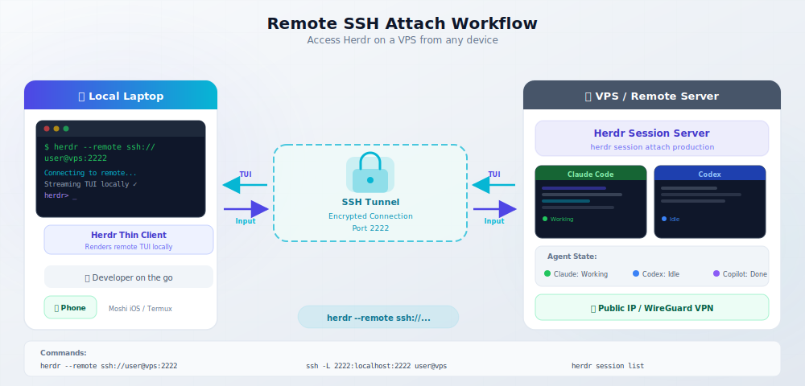
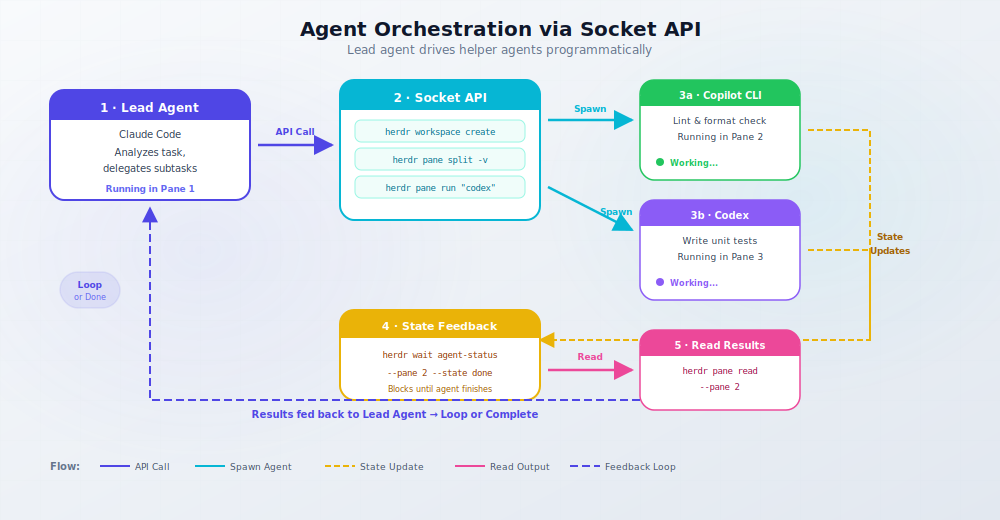

import Button from "@components/widgets/Button.astro";
import Notice from "@components/widgets/Notice.astro";
import ListCheck from "@components/widgets/ListCheck.astro";
import Accordion from "@components/widgets/Accordion.astro";
import Tabs from "@components/widgets/Tabs.astro";
import Tab from "@components/widgets/Tab.astro";


If you're running three, five, maybe ten AI coding agents at the same time — Claude Code in one terminal, [Codex](/codex-app-any-model/) in another, Copilot CLI in a third — you already know the pain. You have terminal sessions scattered everywhere and zero visibility into which agent needs your attention right now.

Herdr is a free, open-source agent multiplexer built in Rust that solves exactly this problem. It runs inside your existing terminal (iTerm2, Kitty, Alacritty, WezTerm, Ghostty — whatever you already use) and adds a sidebar that shows real-time agent state: blocked, working, done, idle. Think of it as tmux that actually understands AI coding agents.

The project is about 105 days old, has nearly 15,000 GitHub stars, hit #1 on GitHub Trending on June 30, 2026, and is built by a single full-time developer. That kind of traction usually means the tool solves a real problem.

<Notice type="info" title="What You'll Learn">
This review covers what Herdr is, how it compares to tmux and Zellij, how to install and configure it, and whether it actually delivers on its promise of terminal-native agent multiplexing. If you're exploring [AI coding tools and assistants](/ai-coding-tools/), this will help you decide if Herdr fits your workflow.
</Notice>

---

## What is Herdr?

<YouTubeEmbed
  url="https://www.youtube.com/embed/NKppWN1atkQ"
  label="Herdr: The Terminal Multiplexer That Actually Works"
/>


Herdr positions itself as "one terminal for the whole herd." At its core, it's a terminal-native agent runtime and multiplexer that combines tmux-style session persistence with first-class awareness of AI coding agents.

It runs inside your existing terminal — it doesn't replace it. You launch Herdr and get a mouse-friendly TUI where you can split panes, manage named sessions, and see which agents are active. The key difference from tmux: Herdr detects AI agents running in its panes and displays their state in a sidebar.

Here's what that looks like in practice:



The architecture is client-server: a background session server manages PTY sessions (they survive laptop sleep, WiFi drops, SSH disconnects), and a thin client renders the TUI. Communication happens over a local Unix socket, or through an SSH tunnel for remote access.

Herdr is a single Rust binary — about 10–11 MB. No Electron, no accounts, no telemetry, no cloud dependency.

<ListCheck>

**What Herdr gives you:**
- tmux-style persistent sessions with detach/reattach
- Real-time agent state sidebar (blocked/working/done/idle)
- Mouse-native TUI with click, drag, split, and right-click menus
- CLI and Socket API for agent-driven orchestration
- Remote SSH attach for headless servers
- Plugin system with community marketplace
- 14+ AI coding agent support out of the box
- Zero telemetry, no account required

</ListCheck>

If you've looked at tools like [FreeBuff](/freebuff-free-ai-coding-agent/) or [Zcode](/zcode-ai-review/) as AI coding environments, Herdr sits in a different category. Those are agent wrappers. Herdr is the terminal layer underneath — it manages the panes and sessions where agents run, and adds orchestration capabilities on top.

---

## Why terminal-native agent multiplexing matters

The multi-agent workflow is no longer niche. In 2026, a typical developer might run Claude Code for architecture decisions, Codex for implementation, Copilot CLI for quick edits, and Gemini CLI for research — all in parallel. Each agent runs in its own terminal session, and you're constantly context-switching between them.

The pain points are real and consistent across the community:

1. **No visibility.** You have 10+ agent sessions open and no idea which one is blocked waiting for your input, which is still working, and which finished an hour ago.
2. **GUI wrappers are limiting.** Most are Mac-only, Electron-based, or replace your terminal entirely. If you work on a Linux VPS or want to access your agents from your phone over SSH, you're out of luck.
3. **Remote access is an afterthought.** Running agents on a headless server and managing them from your laptop shouldn't require a full desktop environment.
4. **Agents can't orchestrate.** In tmux, agents are isolated in their panes. There's no way for one agent to spin up another, wait for results, or read output from a sibling pane.

Terminal-native matters for the self-hosting and VPS crowd because it means zero overhead. No Electron, no desktop dependency, no GPU requirements. You can run Herdr on a $5 Hetzner VPS and access it from your phone via SSH. If you're interested in [SSH port forwarding](/ssh-tunneling-linux/) workflows, Herdr's remote attach mode fits right in.

---

## Herdr key features

### Agent state tracking

This is the feature that makes Herdr more than just another terminal multiplexer.

Herdr detects agents using process-name matching plus terminal output heuristics. For most of the 14+ supported agents, detection is zero-config — launch the agent in a pane and Herdr picks it up automatically. It tracks four semantic states:

- **Working** — the agent is actively generating or processing
- **Blocked** — the agent is waiting for user input (a prompt, permission, etc.)
- **Done** — the agent finished its task
- **Idle** — a pane exists but no agent activity detected

For richer state reporting, you can install agent-specific integrations:

```bash
herdr integration install claude
herdr integration install codex
herdr integration install copilot
```

Integrations add hooks that report state more accurately than heuristics alone. For example, the Claude Code integration uses its `SessionStart` hook to report initialization, task progress, and completion states.

<Notice type="success" title="14+ Agents Supported">
Herdr supports Claude Code, Codex, Copilot CLI, Cursor Agent, Pi, Droid, Amp, OpenCode, Grok CLI, Gemini CLI, Antigravity CLI, Kimi Code CLI, [Hermes Agent](/hermes-agent-setup-guide/), QoderCLI, Kiro CLI, and more. If your agent isn't listed, the generic process detection usually works — it just won't report as much detail.
</Notice>

### Persistent sessions and detach/reattach

Like tmux, Herdr runs a background session server that manages PTY sessions. Your agent sessions survive laptop sleep, WiFi drops, and SSH disconnects.

Named sessions make it easy to organize:

```bash
# Start or attach to a named session
herdr session attach work
herdr session attach side-project

# List active sessions
herdr session list

# Kill a session
herdr session kill side-project
```

Detach from a session (default prefix is `Ctrl+B`, then `D`), and reattach later with `herdr session attach`. Your agents keep running in the background the whole time.

### Mouse-native TUI

If you've bounced off tmux because everything requires keyboard shortcuts, Herdr might change your mind. The TUI is fully mouse-aware:

- Click to select panes
- Drag pane borders to resize
- Right-click for context menus (split, close, rename)
- Touch support works over SSH — you can manage agents from your phone

The layout adapts to narrow terminal widths, so it works reasonably well even on small screens.

### Remote SSH attach

This is where Herdr gets interesting for the VPS and self-hosting crowd. You can run Herdr on a remote server and attach to it from your local machine:



<Tabs>
<Tab name="Direct SSH">
```bash
# SSH into the server and launch Herdr directly
ssh user@your-server
herdr
```
This works but renders the full TUI over SSH — fine on good connections, laggy on slow ones.
</Tab>
<Tab name="Thin client (--remote)">
```bash
# Stream the remote TUI to your local terminal
herdr --remote ssh://user@your-server:2222

# With SSH config aliases
herdr --remote ssh://myserver
```
The thin client mode streams only the rendering data, which is more responsive than raw SSH on slow connections.
</Tab>
<Tab name="SSH config aliases">
Add to your `~/.ssh/config`:
```
Host myserver
    HostName your-server
    User user
    Port 2222
    IdentityFile ~/.ssh/id_ed25519
```
Then use: `herdr --remote ssh://myserver`
</Tab>
</Tabs>

The Moshi iOS terminal app has native Herdr support, which means you can manage your agent fleet from an iPhone or iPad over SSH.

---

## How to install Herdr

Herdr is a single Rust binary with no runtime dependencies. Installation takes under a minute.

<Tabs>
<Tab name="curl (Linux/macOS)">
```bash
curl -fsSL https://herdr.dev/install.sh | sh
```
This downloads the latest binary and places it in `/usr/local/bin/`.
</Tab>
<Tab name="Homebrew">
```bash
brew install herdr
```
Available in Homebrew core (v0.7.3 at time of writing). Installs on both Intel and Apple Silicon Macs.
</Tab>
<Tab name="Nix">
```bash
nix profile install github:ogulcancelik/herdr
```
Works with Nix flakes. Check the repo for the latest flake.nix if you prefer pinning.
</Tab>
<Tab name="Cargo (from source)">
```bash
git clone https://github.com/ogulcancelik/herdr
cd herdr
cargo build --release
```
Requires Rust toolchain. Build produces a single binary at `target/release/herdr`.
</Tab>
<Tab name="Windows (beta)">
```powershell
# PowerShell one-liner
iwr -useb https://herdr.dev/install.ps1 | iex
```
</Tab>
</Tabs>

<Notice type="warning" title="Windows Beta">
Windows support is functional but still in beta. Linux and macOS are the primary platforms. If you're on Windows, expect occasional rough edges.
</Notice>

The binary is about 10–11 MB. After installation, verify it works:

```bash
herdr --version
```

---

## Getting started with Herdr

<Notice type="info" title="Before You Start">
You need a terminal emulator (iTerm2, Kitty, Alacritty, WezTerm, Ghostty, or any modern terminal), Herdr installed, and at least one AI coding agent installed (Claude Code, Codex, Copilot CLI, etc.).
</Notice>

### Your first workspace

Launch Herdr by running:

```bash
herdr
```

You'll see the TUI with a single pane. Key keybindings use a prefix model (default `Ctrl+B`), similar to tmux:

- `Ctrl+B`, then `V` — split vertically
- `Ctrl+B`, then `-` — split horizontally
- `Ctrl+B`, then arrow keys — navigate between panes
- `Ctrl+B`, then `D` — detach from session
- `Ctrl+B`, then `X` — close current pane

You can also do all of this with the mouse — click to select panes, drag borders to resize, right-click for the context menu.

Create a named session from the start:

```bash
herdr session attach my-workspace
```

### Running multiple coding agents

Here's where Herdr earns its keep. Open multiple panes and launch different agents in each:

```bash
# Pane 1: Claude Code for architecture
claude

# Pane 2: Codex for implementation
codex

# Pane 3: Copilot CLI for quick edits
copilot
```

The agent state sidebar on the right shows what each agent is doing in real time. When Claude Code is waiting for your input, its state flips to "blocked" with an indicator. When Codex is generating code, it shows "working." You can glance at the sidebar and immediately know which pane needs your attention.

This is especially useful when you're running a lead agent plus helper agents. The lead handles the main task while helpers run in parallel on subtasks — and you see all their states at once.

### Installing agent integrations

For better state detection, install integrations for your agents:

```bash
herdr integration install claude
herdr integration install codex
herdr integration install copilot
herdr integration install gemini
herdr integration install grok
```

Integrations add hooks that report richer state information. Without integrations, Herdr uses process-name matching and terminal output heuristics — which work, but integrations give you more granular status (e.g., "generating code" vs "waiting for tool approval" vs "idle").

---

## Herdr socket API and agent orchestration

This is the feature that differentiates Herdr from every other terminal multiplexer. Agents can drive the terminal programmatically through a socket API.



Instead of just running inside panes, agents can:

- **Create new panes** — spin up helper agents on demand
- **Run commands** — execute shell commands in any pane
- **Read output** — capture stdout from other panes
- **Wait on state** — block until another agent reaches a specific state (done, idle, etc.)
- **Split and attach** — manage workspace layout programmatically

Here's what orchestration looks like from the CLI:

```bash
# Create a new pane in the current workspace
herdr pane split --vertical

# Run a command in the active pane
herdr pane run "claude --prompt 'Fix the authentication bug'"

# Read the last 50 lines of output from pane 2
herdr pane read --pane 2 --lines 50

# Wait until pane 2's agent reaches "done" state
herdr wait --pane 2 --state done

# Create a named workspace for a specific task
herdr workspace create feature-branch
```

<Notice type="info" title="Agent-Driven Orchestration">
No other terminal multiplexer offers this. tmux has scripting capabilities, and Zellij has a plugin API, but neither understands agent states. Herdr's socket API lets agents coordinate with each other — a lead agent can spin up helpers, wait for results, and proceed. If you're interested in [building your own AI agent](/build-ai-agent-mastra/) that could integrate with this API, it opens up real orchestration workflows.
</Notice>

Practical use cases:

- **Lead agent + helpers:** One agent runs the main task, spawns helper agents for subtasks (linting, testing, documentation), and waits for them to finish.
- **Automated test-and-fix loops:** An agent runs tests, reads the output, fixes failures, and repeats — all through the socket API.
- **Multi-repo workflows:** Different agents work on different repositories in parallel, coordinated by a lead agent.

---

## Herdr vs tmux vs Zellij

This is the comparison most people want to see. Here's an honest breakdown:

| Feature | Herdr | tmux | Zellij |
|---------|-------|------|--------|
| Agent state awareness | Yes (blocked/working/done/idle) | No | No |
| Mouse-native UI | Yes | Partial (needs config) | Yes |
| Agent-shaped API | Yes (read, send, wait, split) | Terminal scripting | Plugin scripting |
| SSH attach | Yes | Yes | Yes |
| Plugin ecosystem maturity | Young (~105 days) | Very mature (18 years) | Growing |
| Session resurrection | Not yet | Yes (via plugins like tmux-resurrect) | Built-in |
| Status bar widgets | Agent-focused | Battery, CPU, weather, etc. | Built-in tabs |
| Built-in sandboxing | No | No | Yes |
| Configuration complexity | Low | High | Medium |

<Tabs>
<Tab name="Herdr strengths">
- Agent state sidebar — the killer feature tmux and Zellij can't match
- Socket API for agent orchestration — genuinely novel
- Mouse-first design — no config needed
- Single binary, zero dependencies
- Remote thin client mode
- Works with your existing terminal (doesn't replace it)
</Tab>
<Tab name="tmux strengths">
- 18 years of battle-tested stability
- Massive plugin ecosystem (tmux-resurrect, tmux-continuum, tmuxinator)
- Status bar widgets for everything (battery, CPU, network, weather)
- Session resurrection and auto-save
- Available on every Unix system by default or package manager
- Deep customization with `.tmux.conf`
</Tab>
<Tab name="Zellij strengths">
- Built-in floating panes and session management
- Layout system with YAML files
- Built-in sandboxing for plugins
- Session resurrection out of the box
- Growing plugin ecosystem with web technologies
- More intuitive default keybindings (no prefix mode)
</Tab>
</Tabs>

**When tmux is still the better choice:** If you have a deeply customized `.tmux.conf`, rely on specific tmux plugins, or have 18 years of muscle memory around tmux keybindings, switching to Herdr has real costs. tmux is also the safer bet for production server management where stability matters more than features.

**When Herdr wins:** If you run multiple AI coding agents and want real-time visibility into what they're doing, there's no alternative. The agent state sidebar alone justifies the switch for multi-agent workflows. The socket API is a bonus that opens up orchestration patterns tmux simply can't support.

---

## Herdr plugins and community ecosystem

The plugin ecosystem is young but growing fast. There are already 83+ public repositories tagged "herdr" on GitHub.

Notable community plugins:

- **herdr-plus** — Adds Quick Actions (predefined command templates) and a Projects view for organizing workspaces
- **herdr-file-viewer** — A git-aware file viewer TUI (64 GitHub stars). Browse files, see diffs, and navigate your project without leaving Herdr
- **herdr-reviewr** — Code review sidebar (44 stars). Review pull requests directly in Herdr
- **ccgram** — Telegram bridge for Herdr (202 stars). Get notifications on Telegram when agents finish, block, or error
- **vim-herdr-navigation** — Vim/Neovim integration for pane navigation
- **pi-bellwether** — Package manager integration for Herdr management

Third-party tools are also emerging:

- **Moshi** — An iOS terminal app with native Herdr support. Manage your agent panes from an iPhone.
- **Agentchute** — Intra-agent communication layer that works with Herdr's socket API

The ecosystem is roughly where tmux was in its first year. The plugin count is growing fast (from zero to 83 repos in ~105 days), and the quality of the top plugins is already decent. Expect this to mature quickly given the project's growth trajectory.

---

## Who should (and shouldn't) use Herdr

<Accordion label="Herdr is great if..." group="fit" expanded="true">

- You run 3+ AI coding agents simultaneously and lose track of which ones need attention
- You work on remote servers via SSH and want a terminal-native tool (not Electron, not a web UI)
- You're on Linux or macOS and prefer tools that run inside your existing terminal
- You want zero telemetry, no accounts, and a single binary with no dependencies
- You're interested in agent orchestration — having agents coordinate through a socket API
- You manage VPS infrastructure and want SSH-first tooling — if you're running [self-hosted server panels](/best-self-hosted-panels/), Herdr fits that philosophy

</Accordion>

<Accordion label="Consider alternatives if..." group="fit">

- You're a tmux power user with a deeply customized config and 18 years of plugin dependencies. The migration cost is real.
- You're on Windows only. Support is beta and still has rough edges.
- You need production-grade stability for critical workflows. Herdr is 105 days old and pre-1.0.
- You need built-in sandboxing or process isolation. Herdr doesn't sandbox agents.
- You prefer a GUI that replaces your terminal (Warp, cmux, Conductor). Herdr is terminal-native by design.
- You're cost-conscious and want to pair Herdr with [affordable AI models](/best-cheap-models-hermes-agent/) — this works, but the cost savings come from the models, not from Herdr itself.

</Accordion>

---

## Licensing and pricing

Herdr is licensed under **AGPL-3.0-or-later** — free for personal and commercial use. You can download, run, and modify it without paying anything.

<Notice type="info" title="Licensing Note">
AGPL means that if you modify Herdr and distribute it (or run it as a network service), you must share your modifications under the same license. For typical use — running it locally to manage your agents — this has no practical impact. It's free, it works, you don't owe anyone anything.

If your organization can't comply with AGPL (some enterprise policies prohibit it), a commercial license is available. Contact hey@herdr.dev for pricing. No public pricing page exists.
</Notice>

Key licensing details:

- **Zero telemetry** — no phone-home, no analytics, no usage tracking
- **No account required** — download and run. No cloud dependency.
- **No vendor lock-in** — it's a standard Rust binary. If you stop using it, your terminal and agents are unaffected.

For context on the broader open-source AI ecosystem, see our guide to [open source LLMs for coding](/best-open-source-llms-claude-alternative/) — running open-source models with an open-source terminal multiplexer is about as vendor-neutral as you can get.

---

## Risks and things to know

<Notice type="warning" title="Pre-1.0 Software">
Herdr is approximately 105 days old (as of July 2026). It's moving fast, which means features ship quickly but breaking changes are possible. Pin an update date and revisit.
</Notice>

Honest caveats:

1. **Young project.** Pre-1.0, ~105 days old. APIs and features may change. If you build workflows around the socket API, expect some adaptation as the project evolves.
2. **Solo developer.** Bus factor is 1. Ogulcan Celik is full-time on this, but there's no team backing it. The community (nearly 15,000 stars) helps, but core development depends on one person.
3. **Missing tmux features.** No battery/CPU status bar widgets. No session resurrection equivalent to tmux-resurrect. No tmuxinator-style project templates (yet).
4. **Performance on large setups.** Some users on Hacker News reported text rendering delay with many panes open. Your mileage may vary with 10+ panes.
5. **No built-in sandboxing.** Agents run with your user permissions. If an agent does something destructive, Herdr won't stop it.
6. **No public commercial pricing.** Organizations need to email for a quote — no self-serve option.
7. **Keybinding learning curve.** The prefix-based model is familiar to tmux users, but the specific bindings differ. Expect a few days of adjustment.

The rapid community growth (15,000+ stars, 83+ repos, active Discord) mitigates some of these risks. Tools that solve real problems tend to attract contributors and survive.

---

## Verdict

Herdr is the first terminal multiplexer that actually understands AI coding agents. If you're running multiple agents and losing track of which ones need you, the agent state sidebar alone is worth the switch.

It's not a tmux replacement yet — not for power users with deep customization needs. tmux has 18 years of ecosystem maturity, and Herdr has 105 days. But for the specific use case of multi-agent terminal workflows, nothing else comes close.

The socket API is novel. No other terminal multiplexer lets agents coordinate programmatically — creating panes, reading output, waiting on state. This opens up orchestration workflows that aren't possible with tmux or Zellij.

The honest recommendation: try it for your next multi-agent session. Run Herdr for a day with three or four agents, watch the state sidebar, and see if it changes how you work. If it doesn't, tmux is still there. If it does, you'll probably stick with it.

<Button text="Try Herdr on GitHub" link="https://github.com/ogulcancelik/herdr" variant="solid" color="blue" size="lg" icon="arrow-right" />
<Button text="Visit herdr.dev" link="https://herdr.dev/" variant="outline" color="blue" size="md" />

If you're also exploring [affordable AI models](/best-cheap-models-hermes-agent/) to pair with Herdr, or looking at [AI coding tools and assistants](/ai-coding-tools/) more broadly, we have guides for both.

---

## FAQ

<Accordion label="Is Herdr free to use?" group="faq" expanded="true">
Yes. Herdr is licensed under AGPL-3.0-or-later — free for personal and commercial use. No account, no subscription, no cloud dependency. A commercial license is available for organizations that can't comply with AGPL (contact hey@herdr.dev).
</Accordion>

<Accordion label="Does Herdr replace tmux?" group="faq">
Not yet for power users. Herdr adds agent awareness and orchestration that tmux lacks, but tmux has 18 years of plugins, configuration options, and battle-tested stability. Herdr is better for multi-agent workflows; tmux is better for established, heavily customized setups. Many developers run both — tmux for general server management, Herdr for agent sessions.
</Accordion>

<Accordion label="What AI coding agents does Herdr support?" group="faq">
14+ agents out of the box, including Claude Code, Codex, Copilot CLI, Gemini CLI, Grok CLI, Cursor Agent, Pi, Droid, Amp, OpenCode, Antigravity CLI, Kimi Code CLI, [Hermes Agent](/hermes-agent-setup-guide/), QoderCLI, Kiro CLI, and more. If your agent isn't listed, generic process detection usually works — you just won't get granular state reporting without an integration.
</Accordion>

<Accordion label="Can I use Herdr over SSH on a remote server?" group="faq">
Yes. Two options: (1) Install Herdr on the server and SSH in normally — the TUI renders over SSH. (2) Use `herdr --remote ssh://user@server` for thin client mode, which streams rendering data and is more responsive on slow connections. The Moshi iOS terminal app also has native Herdr support for mobile access.
</Accordion>

<Accordion label="Does Herdr work on Windows?" group="faq">
Windows support is currently in beta. Linux and macOS are the primary platforms and fully supported. If you're Windows-only, expect occasional rough edges. The beta is functional enough for basic use but not yet at feature parity with the Unix builds.
</Accordion>

<Accordion label="How does Herdr detect agent states?" group="faq">
Two layers. First, process-name matching — Herdr recognizes the binary names of supported agents (claude, codex, copilot, etc.) and infers basic state from terminal output patterns. Second, agent integrations (`herdr integration install <agent>`) install hooks that report richer state information directly. Integrations give you more granular status (e.g., "waiting for tool approval" vs "generating code") compared to heuristics alone.
</Accordion>
