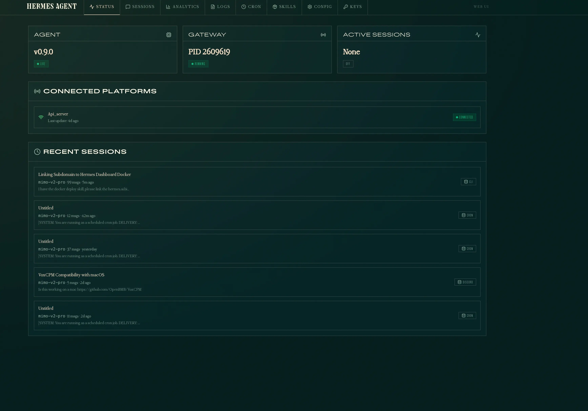
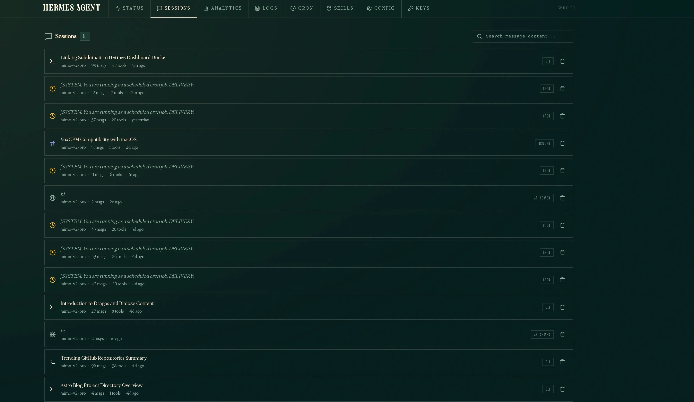
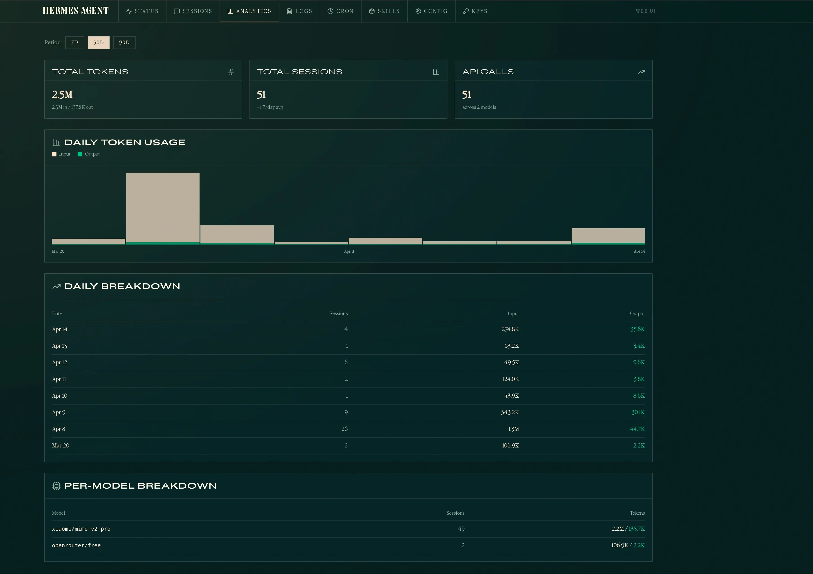
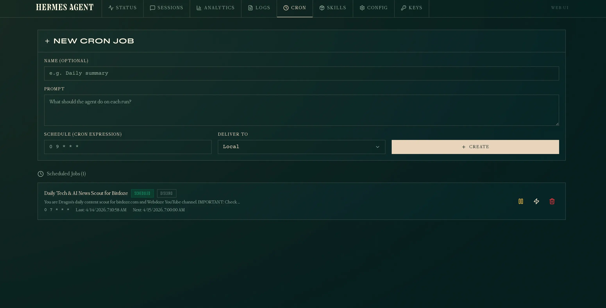
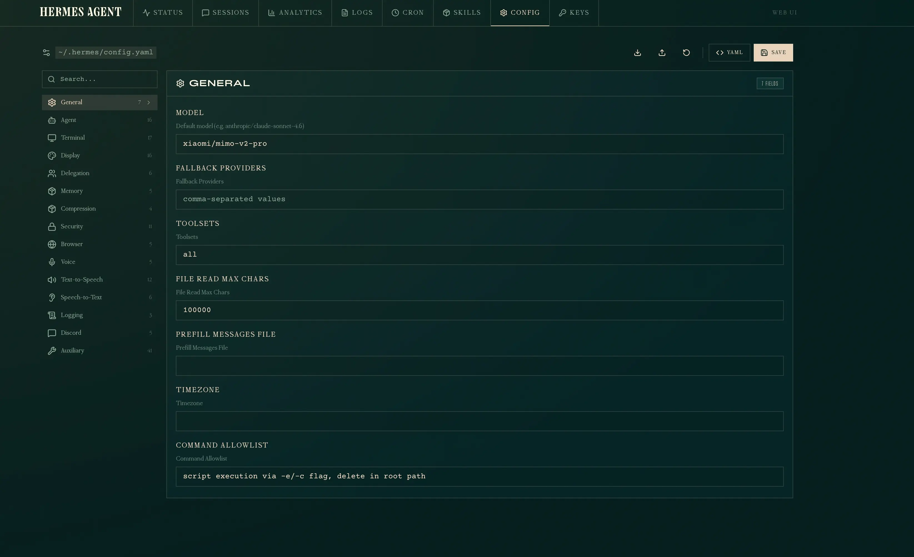
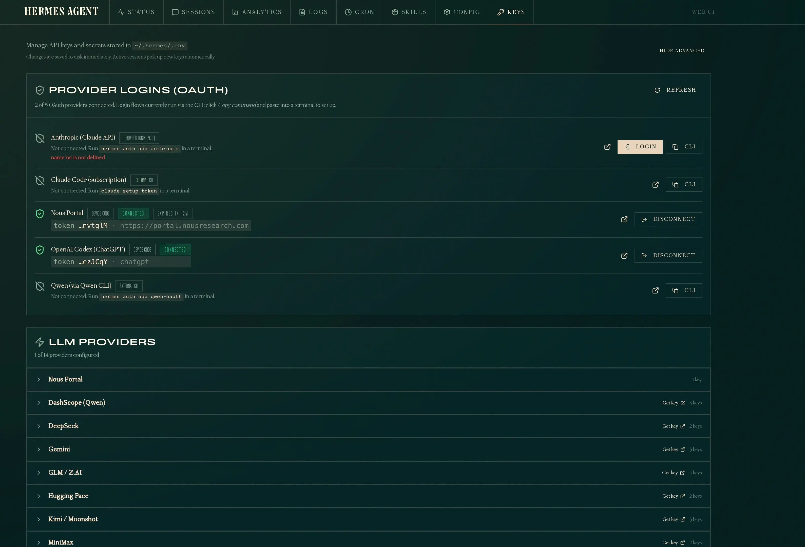

import YouTubeEmbed from "@components/widgets/YouTubeEmbed.astro";
import Button from "@components/widgets/Button.astro";
import Notice from "@components/widgets/Notice.astro";
import ListCheck from "@components/widgets/ListCheck.astro";
import Accordion from "@components/widgets/Accordion.astro";
import Tabs from "@components/widgets/Tabs.astro";
import Tab from "@components/widgets/Tab.astro";

If you are running [Hermes Agent](/hermes-agent-setup-guide/) on a VPS and want a browser-based way to manage sessions, API keys, memory, and configuration, the built-in dashboard does exactly that. It is a single command away — but the default setup only listens on localhost. This guide covers how to run it locally, access it remotely via SSH tunnel or through a Caddy reverse proxy with password protection, deploy it in Docker, and keep it running permanently with systemd.

<Button text="Hermes Agent GitHub" link="https://github.com/NousResearch/hermes-agent" variant="solid" color="blue" size="md" icon="github" />

<Notice type="info" title="What this guide covers">
<ListCheck>
<ul>
<li>Starting the Hermes dashboard locally and on a remote server</li>
<li>Remote access via SSH port forwarding (simplest and safest)</li>
<li>Exposing it externally with Caddy reverse proxy</li>
<li>Adding Basic Auth with a username and password</li>
<li>Running it permanently with systemd or Docker</li>
<li>Security risks you should know about</li>
</ul>
</ListCheck>
</Notice>

## What the Hermes dashboard does

The dashboard gives you a browser interface for managing your Hermes Agent instance. From it you can:

- View and manage active chat sessions
- Browse and edit agent memory files
- Configure API keys and model settings
- Monitor token usage and costs
- Manage skills and tool configurations

It connects to the existing Hermes gateway process that is already running on your server — it does not start a second agent.

## Dashboard tour

Once the dashboard is running, the top navigation bar gives you access to several tabs. Here is what each one shows.

### Status

The Status tab is the landing page. It shows whether the agent and gateway are running, connected platforms, and a list of recent sessions with message counts and previews.



### Sessions

The Sessions tab lists all past and active sessions. Each entry shows the model used, message count, tools called, and when it was last active. You can search message content across all sessions and delete old ones.



### Analytics

The Analytics tab tracks token usage, session counts, and API calls over time. It shows daily breakdowns and per-model stats so you can see exactly how much your agent is costing.



### Cron

The Cron tab lets you create and manage scheduled tasks. You define a prompt, set a cron expression, and choose where results are delivered (local, Discord, etc.). You can pause, manually trigger, or delete jobs from here.



### Config

The Config tab gives you a structured editor for `~/.hermes/config.yaml`. It is organized by sections — General, Agent, Terminal, Display, Memory, Security, and more — each with labeled fields. You can edit values directly or toggle to raw YAML mode.



### Keys

The Keys tab manages API keys and OAuth logins stored in `~/.hermes/.env`. It shows which LLM providers are configured, handles OAuth flows (Nous Portal, OpenAI Codex), and lets you add or disconnect credentials without touching the command line.



## Starting the dashboard

The simplest way to start:

```bash
hermes dashboard
```

This builds the web UI (first run only), then starts a server on `http://127.0.0.1:9119`. It will also open a browser tab if you are running it locally.

### Available flags

| Flag | Default | Description |
|---|---|---|
| `--host` | `127.0.0.1` | Interface to bind to |
| `--port` | `9119` | Port to listen on |
| `--no-open` | off | Skip automatic browser launch |

The default `127.0.0.1` binding means only your machine can reach the dashboard. That is the safe default — if you need remote access, keep reading.

## Remote access via SSH port forwarding

If you just want to open the dashboard from your laptop while it runs on a VPS, SSH port forwarding is the simplest option. No reverse proxy, no DNS, no open ports on the server — everything goes through your existing SSH connection.

```bash
ssh -L 9119:127.0.0.1:9119 user@your-vps-ip
```

Then open `http://127.0.0.1:9119` in your browser on your laptop. The `-L` flag forwards your local port 9119 to the VPS's localhost:9119 through the SSH tunnel. The dashboard sees it as a local connection.

This is the safest way to access the dashboard remotely because:

- The dashboard stays bound to `127.0.0.1` — nothing else on the internet can reach it
- Traffic is encrypted inside SSH — no extra TLS setup needed
- You already have SSH access, so there is nothing new to secure
- No open ports on the VPS beyond SSH

<Notice type="info" title="When to use SSH forwarding">
Use this if you are the only person accessing the dashboard and you always connect from a machine with SSH access. Skip the Caddy and systemd sections entirely — just keep <code>hermes dashboard</code> running in a tmux or screen session.
</Notice>

### Background SSH tunnel

If you want the tunnel to stay open in the background:

```bash
ssh -f -N -L 9119:127.0.0.1:9119 user@your-vps-ip
```

- `-f` — forks to background after authentication
- `-N` — no remote command, just the tunnel

To kill it later:

```bash
# Find the process
ps aux | grep "ssh -f -N -L 9119"

# Kill it
kill <PID>
```

### Keep the dashboard running on the VPS

With SSH forwarding, the dashboard still needs to be running on the VPS. Use tmux or screen so it survives SSH disconnections:

```bash
# On the VPS
tmux new -s hermes
hermes dashboard
# Ctrl+B then D to detach

# Later, reattach with
tmux attach -t hermes
```

If you want it running permanently even without SSH, use the systemd service described further below.

## Exposing the dashboard externally

To access the dashboard from another machine (your phone, your laptop, or a teammate), you need two things: bind to all interfaces and put a reverse proxy in front.

### Step 1: Bind to 0.0.0.0

```bash
hermes dashboard --host 0.0.0.0
```

This makes the server listen on all network interfaces. On its own, this means anyone who can reach your server's IP can access the dashboard — do not stop here.

### Step 2: Reverse proxy with Caddy

If you are already running [Caddy as a reverse proxy](/caddy-docker/) on your server, add a block like this to your Caddyfile:

```caddyfile
hermes.yourdomain.com {
    reverse_proxy your-server-ip:9119
    encode gzip
    header {
        Strict-Transport-Security "max-age=31536000; includeSubDomains; preload"
        X-Content-Type-Options nosniff
        X-Frame-Options SAMEORIGIN
        X-XSS-Protection "1; mode=block"
    }
}
```

If your Caddy instance runs inside Docker and the dashboard runs on the host, use `host.docker.internal` instead of the IP address:

```caddyfile
hermes.yourdomain.com {
    reverse_proxy host.docker.internal:9119
}
```

<Notice type="warning" title="Host networking requirement">
If the dashboard binds to 127.0.0.1 (the default), Docker containers cannot reach it through <code>host.docker.internal</code>. You must either use <code>--host 0.0.0.0</code> or run Caddy on the host directly (not in Docker).
</Notice>

Then reload Caddy:

```bash
sudo docker exec caddy caddy reload --config /etc/caddy/Caddyfile
```

Or if Caddy runs on the host:

```bash
sudo systemctl reload caddy
```

## Adding password protection

The Hermes dashboard itself does not have a built-in password feature. But since it sits behind Caddy, you can use HTTP Basic Auth at the proxy level. This adds a browser login prompt before anyone reaches the dashboard.

### Generate a password hash

Caddy stores passwords as bcrypt hashes. Generate one:

```bash
caddy hash-password --plaintext 'your-password-here'
```

Or inside a Dockerized Caddy:

```bash
sudo docker exec caddy caddy hash-password --plaintext 'your-password-here'
```

This outputs a hash string starting with `$2a$...`.

### Update the Caddyfile

Add a `basic_auth` directive inside the site block:

```caddyfile
hermes.yourdomain.com {
    basic_auth {
        yourusername $2a$14$...your-hash-here...
    }
    reverse_proxy host.docker.internal:9119
    encode gzip
    header {
        Strict-Transport-Security "max-age=31536000; includeSubDomains; preload"
        X-Content-Type-Options nosniff
        X-Frame-Options SAMEORIGIN
        X-XSS-Protection "1; mode=block"
    }
}
```

Replace `yourusername` and the hash with your own. You can add multiple username-hash pairs for different users.

### Verify it works

Without credentials — expect 401:

```bash
curl -sk -o /dev/null -w "%{http_code}" https://hermes.yourdomain.com/
# 401
```

With credentials — expect 200:

```bash
curl -sk -o /dev/null -w "%{http_code}" -u yourusername:your-password-here https://hermes.yourdomain.com/
# 200
```

When you open the URL in a browser, you will see a login popup before the dashboard loads.

## Running permanently with systemd

The `hermes dashboard` command runs in the foreground. If you close your terminal, it stops. To keep it running permanently, create a systemd service.

### Create the service file

```bash
sudo tee /etc/systemd/system/hermes-dashboard.service << 'EOF'
[Unit]
Description=Hermes Agent Dashboard
After=network.target

[Service]
Type=simple
User=dragos
ExecStart=/home/dragos/.hermes/hermes-agent/venv/bin/python -m hermes_cli.main dashboard --host 0.0.0.0 --port 9119 --no-open
Restart=on-failure
RestartSec=5
Environment=HOME=/home/dragos

[Install]
WantedBy=multi-user.target
EOF
```

Adjust `User` and the Python path to match your setup. You can find the exact path with:

```bash
which hermes
# or
readlink -f $(which hermes)
```

### Enable and start

```bash
sudo systemctl daemon-reload
sudo systemctl enable hermes-dashboard
sudo systemctl start hermes-dashboard
sudo systemctl status hermes-dashboard
```

### Check logs

```bash
sudo journalctl -u hermes-dashboard -f
```

## Running in Docker

If you prefer running the dashboard in a Docker container (consistent with how you deploy other services on the VPS), you can containerize it. The key constraint is that the dashboard needs to reach the Hermes gateway at `127.0.0.1:8642`, so the container must use host networking.

### Dockerfile

```dockerfile
FROM python:3.12-slim

RUN pip install hermes-agent[web]

EXPOSE 9119

CMD ["python", "-m", "hermes_cli.main", "dashboard", "--host", "0.0.0.0", "--port", "9119", "--no-open"]
```

### docker-compose.yml

```yaml
services:
  hermes-dashboard:
    build: .
    container_name: hermes-dashboard
    network_mode: host
    restart: unless-stopped
```

`network_mode: host` is required because the gateway binds to `127.0.0.1:8642` — without it, the container cannot reach the gateway even with `host.docker.internal`.

### With Caddy in the same stack

If you are running Caddy in Docker already (typical setup with a `web` external network), the dashboard container using `network_mode: host` is reachable from Caddy at `host.docker.internal:9119`. Add the Caddy block as described in the [Caddy reverse proxy section](#step-2-reverse-proxy-with-caddy) above — no changes needed.

### Build and run

```bash
docker compose up -d --build
```

### Check it is running

```bash
sudo docker ps --filter name=hermes-dashboard
curl -sk -o /dev/null -w "%{http_code}" http://127.0.0.1:9119/
```

<Notice type="warning" title="Host networking and security">
<code>network_mode: host</code> means the container shares the host's network stack directly. The dashboard port is accessible on all interfaces — make sure Caddy or a firewall is in front if you expose it publicly.
</Notice>

## Security risks

Exposing an AI agent dashboard to the internet is not the same as exposing a static website. Here is what you need to understand.

### The dashboard is a control plane

Anyone with access to the dashboard can view sessions, read memory files, modify API keys, and change configuration. It is not just a read-only status page — it is full administrative access to your AI agent.

### Basic Auth sends credentials in base64

HTTP Basic Auth encodes your username and password in base64 inside every request header. Without HTTPS, anyone sniffing your network can decode them instantly. Caddy provides automatic HTTPS with Let's Encrypt, which solves this — but only if you use a real domain name, not a raw IP address.

<Notice type="error" title="Never expose without HTTPS">
Do not run the dashboard on port 9119 with <code>--host 0.0.0.0</code> without a TLS-terminating reverse proxy in front. Basic Auth over plain HTTP is essentially no auth at all.
</Notice>

### Browser credential storage

Once you log in through Basic Auth, most browsers cache the credentials and send them automatically on every request to that domain. If someone gains access to your browser session (shared computer, browser exploit), they have free access to the dashboard.

### No rate limiting by default

Neither the dashboard nor Basic Auth includes brute-force protection. An attacker can try thousands of passwords per minute. Consider adding fail2ban rules for your reverse proxy logs, or using Caddy's `forward_auth` with a more robust auth provider if you need this.

### IP allowlisting helps

If you always access the dashboard from the same IP (office, home), add firewall rules to restrict access:

```bash
# Allow only your IP
sudo ufw allow from YOUR_IP_ADDRESS to any port 443
sudo ufw deny 443
```

Or in Caddy, use a `@blocked` matcher:

```caddyfile
hermes.yourdomain.com {
    @blocked not remote_ip YOUR_IP_ADDRESS/32
    respond @blocked "Forbidden" 403

    basic_auth {
        yourusername $2a$14$...
    }
    reverse_proxy host.docker.internal:9119
}
```

### The dashboard talks to the gateway

The dashboard communicates with the Hermes gateway API at `127.0.0.1:8642`. If someone compromises the dashboard, they also have indirect access to the gateway — which controls the agent that can execute terminal commands on your server. Treat the dashboard as a privileged surface, not a convenience feature.

### Summary of risks

| Risk | Severity | Mitigation |
|---|---|---|
| Dashboard exposed without HTTPS | Critical | Always use Caddy with TLS |
| Weak or reused password | High | Generate a strong random password |
| No brute-force protection | Medium | Add fail2ban or IP allowlisting |
| Browser caches credentials | Medium | Use private browsing on shared machines |
| Dashboard gives gateway access | High | IP restrict + strong auth + monitor logs |

## Quick reference

```bash
# Local only (safe default)
hermes dashboard

# SSH tunnel (remote access, safest)
ssh -L 9119:127.0.0.1:9119 user@your-vps-ip
# Then open http://127.0.0.1:9119 on your laptop

# Remote access (bind to all interfaces)
hermes dashboard --host 0.0.0.0

# Custom port
hermes dashboard --host 0.0.0.0 --port 3000

# With systemd (permanent)
sudo systemctl start hermes-dashboard

# With Docker
docker compose up -d --build

# Check it is running
curl -sk -o /dev/null -w "%{http_code}" https://hermes.yourdomain.com/
```

For more on Hermes Agent setup, messaging integration, and skills, see the [Hermes Agent setup guide](/hermes-agent-setup-guide/) and the [MIMO V2 Pro integration guide](/hermes-agent-mimo-v2-pro/).

<Button text="More AI tool guides" link="/category/ai/" variant="solid" color="blue" size="md" icon="arrow-right" iconPosition="right" />
