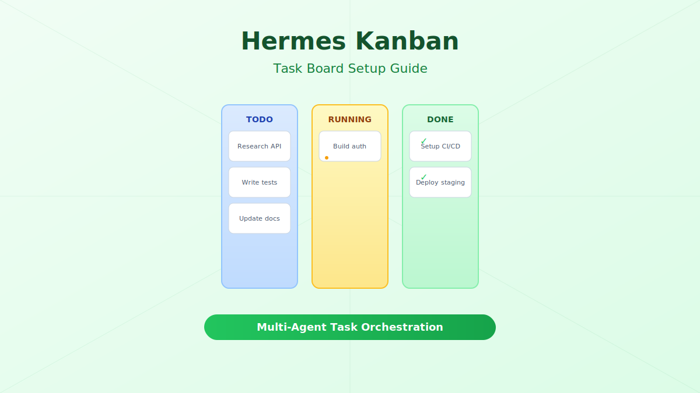

import Button from '@components/widgets/Button.astro';
import Notice from '@components/widgets/Notice.astro';
import Accordion from '@components/widgets/Accordion.astro';
import Tabs from '@components/widgets/Tabs.astro';
import Tab from '@components/widgets/Tab.astro';
import ListCheck from '@components/widgets/ListCheck.astro';
import YouTubeEmbed from '@components/widgets/YouTubeEmbed.astro';

Hermes Kanban is a board system built into [Hermes Agent](/hermes-agent-setup-guide/) that lets you visually manage tasks, track progress across multiple AI agents, and coordinate complex multi-step workflows. Instead of sending everything through chat, Kanban gives you a structured way to plan, assign, and monitor work — with a visual board you can view from the built-in [dashboard](/hermes-dashboard-guide/) or third-party [Hermes dashboards](/best-hermes-dashboards/).

This guide covers setup, daily usage patterns, the Kanban vs delegate_task decision, and practical multi-agent workflows.



## What Is Hermes Kanban?

Hermes Kanban is a **SQLite-backed task management system** that runs alongside the Hermes gateway. It provides:

- **Visual task boards** with columns for different states (backlog, todo, in progress, review, done)
- **Multi-agent task handoffs** — assign tasks to specific agents or let them pick from a queue
- **Progress tracking** — see which agent is working on what, and how long tasks take
- **Persistent history** — all task state changes are logged with timestamps and agent IDs
- **Dashboard integration** — view and manage boards from Hermes WebUI, Scarf, ClawdBoard, and others

Think of it as Jira or Trello, but designed for AI agents working together.

<Notice type="info" title="Hermes v0.1.2+">
Kanban was introduced in Hermes Agent v0.1.2. Make sure you're running a recent version. Check with `hermes --version`.
</Notice>

## Kanban vs delegate_task: When to Use Which

<Accordion label="Quick comparison" group="comparison" expanded="true">

| Feature | Kanban Board | delegate_task |
|---|---|---|
| **Best for** | Multi-step projects, team coordination | Single tasks, quick delegation |
| **Visibility** | Visual board, full history | Chat-based, ephemeral |
| **Task tracking** | Persistent, stateful | Inline, lost after session |
| **Multi-agent** | Built-in coordination | Manual coordination |
| **Overhead** | Higher (board setup) | Lower (one command) |
| **Use when** | 3+ related tasks, need oversight | One-off task, simple delegation |

</Accordion>

**Use Kanban when:**

- You have a project with multiple related tasks (e.g., "build a REST API" with auth, endpoints, tests, docs)
- Multiple agents need to coordinate (one writes code, another reviews, another tests)
- You want to track progress over time and see what got done
- Tasks have dependencies (can't deploy until tests pass)

**Use delegate_task when:**

- You need a quick answer or single piece of work
- The task is self-contained with no follow-up needed
- You're in a conversation and want to keep momentum

<Notice type="info" title="They work together">
You can use delegate_task to hand off a Kanban task to a specific agent. Kanban is the planning layer; delegate_task is the execution mechanism.
</Notice>

## Prerequisites

Before setting up Kanban, make sure you have:

<ListCheck>
<ul>
<li>Hermes Agent v0.1.2 or later installed</li>
<li>Hermes gateway running (`hermes gateway start`)</li>
<li>A dashboard installed (optional but recommended) — see [Hermes Dashboard Guide](/hermes-dashboard-guide/)</li>
<li>A free model configured if you want to avoid costs — see [Best Cheap Models for Hermes Agent](/best-cheap-models-hermes-agent/)</li>
</ul>
</ListCheck>

## Step 1: Enable Kanban in Gateway Config

Kanban is enabled by default in recent Hermes versions. Verify it's active:

```bash
# Check if Kanban is enabled
hermes kanban status
```

If it's not enabled, add it to your gateway config:

```yaml
# ~/.hermes/gateway.yaml
kanban:
  enabled: true
  default_board: "main"
  auto_archive: true
  archive_after_days: 30
```

Restart the gateway to apply:

```bash
hermes gateway restart
```

## Step 2: Create Your First Board

```bash
# Create a new board
hermes kanban create-board "My Project"

# List all boards
hermes kanban boards

# Set default board
hermes kanban set-default "My Project"
```

Each board has columns that represent task states. The default columns are:

| Column | Purpose |
|---|---|
| **Backlog** | Tasks not yet scheduled |
| **Todo** | Tasks ready to be worked on |
| **In Progress** | Currently being worked on |
| **Review** | Waiting for review or testing |
| **Done** | Completed tasks |

## Step 3: Add Tasks

```bash
# Add a task to the default board
hermes kanban add "Implement user authentication"

# Add with priority and assignee
hermes kanban add "Write API tests" --priority high --assignee "test-agent"

# Add to a specific column
hermes kanban add "Update README" --column backlog

# Add with description
hermes kanban add "Set up CI/CD pipeline" \
  --description "Configure GitHub Actions for automated testing and deployment" \
  --priority medium
```

### Task Properties

Each task supports these properties:

- **title** — what needs to be done
- **description** — detailed requirements
- **priority** — low, medium, high, critical
- **assignee** — which agent (or person) should work on it
- **column** — which board column it starts in
- **tags** — labels for filtering (e.g., `backend`, `frontend`, `docs`)
- **due_date** — when the task should be completed
- **depends_on** — task IDs that must complete first

## Step 4: Move Tasks Through the Board

```bash
# Move a task to a different column
hermes kanban move "Implement user authentication" --to "In Progress"

# Move by task ID
hermes kanban move #12 --to "Review"

# Bulk move all tasks with a tag
hermes kanban move --tag backend --to "Done"
```

### Automatic State Transitions

Hermes Kanban can automatically move tasks when agents perform actions:

- When an agent starts working on a task → moves to **In Progress**
- When an agent submits code for review → moves to **Review**
- When a reviewer approves → moves to **Done**
- When a reviewer requests changes → moves back to **In Progress**

This is configured in the agent's profile:

```yaml
# ~/.hermes/agents/coder.yaml
kanban:
  auto_move: true
  pick_from: "Todo"
  move_to_on_start: "In Progress"
  move_to_on_complete: "Review"
```

## Step 5: View the Board

### CLI View

```bash
# Show the board in terminal
hermes kanban show

# Show a specific board
hermes kanban show "My Project"

# Show only high-priority tasks
hermes kanban show --priority high

# Show tasks assigned to a specific agent
hermes kanban show --assignee "test-agent"
```

### Dashboard View

The Kanban board is also available in the [Hermes dashboard](/hermes-dashboard-guide/). Open your dashboard and navigate to the Kanban tab to see:

- Drag-and-drop task management
- Real-time updates as agents move tasks
- Task details with full history
- Filter by agent, priority, or tag

For the best visual experience, [Hermes WebUI (EKKO)](/best-hermes-dashboards/) and [Hermes WebUI (nesquena)](/best-hermes-dashboards/) both have excellent Kanban views with drag-and-drop support.

## Multi-Agent Task Workflows

Here are practical patterns for coordinating multiple agents.

### Pattern 1: Code → Review → Deploy Pipeline

Set up three agents with different roles:

```yaml
# ~/.hermes/agents/coder.yaml
name: "Coder"
role: "Writes code based on task descriptions"
kanban:
  pick_from: "Todo"
  move_to_on_complete: "Review"

# ~/.hermes/agents/reviewer.yaml
name: "Reviewer"
role: "Reviews code quality and correctness"
kanban:
  pick_from: "Review"
  move_to_on_approve: "Ready to Deploy"
  move_to_on_reject: "Todo"

# ~/.hermes/agents/devops.yaml
name: "DevOps"
role: "Handles deployment and infrastructure"
kanban:
  pick_from: "Ready to Deploy"
  move_to_on_complete: "Done"
```

Add tasks to the board and let agents pick them up:

```bash
hermes kanban add "Build login endpoint" --priority high
hermes kanban add "Build user profile endpoint" --priority medium
hermes kanban add "Add rate limiting" --priority high

# Agents automatically pick up and process tasks
hermes kanban watch  # Monitor progress in real-time
```

### Pattern 2: Parallel Research with Aggregation

When you need multiple agents to research different aspects of a problem:

```bash
# Create research tasks
hermes kanban add "Research authentication best practices" --assignee "researcher-1" --tag research
hermes kanban add "Research database scaling patterns" --assignee "researcher-2" --tag research
hermes kanban add "Research caching strategies" --assignee "researcher-3" --tag research

# Create an aggregation task that depends on all research
hermes kanban add "Write technical design document" \
  --assignee "architect" \
  --depends-on "Research authentication best practices,Research database scaling patterns,Research caching strategies" \
  --priority high
```

The architect agent won't pick up its task until all three research tasks are marked as done.

### Pattern 3: Iterative Development Cycle

For tasks that need multiple rounds of refinement:

```yaml
# ~/.hermes/agents/fullstack.yaml
kanban:
  pick_from: "Todo"
  move_to_on_complete: "Testing"
  max_iterations: 3
  on_test_failure: "Todo"
```

This creates a loop: Todo → Testing → (if tests fail) → Todo, up to 3 times. After 3 failures, the task moves to a "Blocked" column for human intervention.

## Advanced Features

### Task Dependencies

Tasks can depend on other tasks. A dependent task won't be assignable until its dependencies are complete:

```bash
# Create a task with dependencies
hermes kanban add "Deploy to production" \
  --depends-on "Write tests,Code review pass,Security audit"

# View dependency graph
hermes kanban dependencies "Deploy to production"
```

### Filtering and Views

```bash
# Filter by multiple criteria
hermes kanban show --priority high --assignee coder --tag backend

# Show only blocked tasks
hermes kanban show --status blocked

# Show tasks due this week
hermes kanban show --due-before "2026-05-10"

# Export board as JSON
hermes kanban export --format json > board.json
```

### Board Templates

For recurring project types, create board templates:

```bash
# Save current board as template
hermes kanban save-template "web-app" --board "My Project"

# Create new board from template
hermes kanban create-board "New App" --template "web-app"
```

Common templates include:
- **web-app**: Auth, API, Frontend, Tests, Deploy
- **data-pipeline**: Extract, Transform, Validate, Load, Monitor
- **bug-fix**: Reproduce, Diagnose, Fix, Test, Verify

### Notifications

Get notified when tasks change state:

```yaml
# ~/.hermes/gateway.yaml
kanban:
  notifications:
    on_task_complete: true
    on_task_blocked: true
    on_task_overdue: true
    channel: "slack"  # or "discord", "email"
```

## Real-World Example: Building a REST API

Here's a complete workflow for building a REST API with Kanban:

```bash
# 1. Create the board
hermes kanban create-board "REST API Project"

# 2. Add all tasks
hermes kanban add "Design database schema" --priority high --tag design
hermes kanban add "Set up project structure" --priority high --tag setup
hermes kanban add "Implement user model" --priority high --tag backend --depends-on "Design database schema"
hermes kanban add "Implement auth endpoints" --priority high --tag backend --depends-on "Implement user model"
hermes kanban add "Implement CRUD endpoints" --priority medium --tag backend --depends-on "Implement user model"
hermes kanban add "Write unit tests" --priority medium --tag testing --depends-on "Implement auth endpoints,Implement CRUD endpoints"
hermes kanban add "Write integration tests" --priority medium --tag testing --depends-on "Implement auth endpoints,Implement CRUD endpoints"
hermes kanban add "Set up CI/CD" --priority low --tag devops
hermes kanban add "Write API documentation" --priority low --tag docs --depends-on "Implement CRUD endpoints"
hermes kanban add "Deploy to staging" --priority medium --tag devops --depends-on "Write unit tests,Write integration tests"

# 3. Assign agents
hermes kanban assign "backend" --tag backend
hermes kanban assign "tester" --tag testing
hermes kanban assign "devops" --tag devops

# 4. Watch progress
hermes kanban watch
```

Each agent picks up tasks in dependency order, works on them, and moves them forward. You can check progress at any time with `hermes kanban show` or through the dashboard.

## Tips for Effective Kanban Usage

<ListCheck>
<ul>
<li>**Keep tasks small** — if a task takes more than 30 minutes of agent time, break it down</li>
<li>**Use dependencies wisely** — don't over-constrain; let independent tasks run in parallel</li>
<li>**Set up auto-archive** — keep the board clean by archiving completed tasks automatically</li>
<li>**Use tags consistently** — create a tag taxonomy and stick to it</li>
<li>**Monitor blocked tasks** — check `hermes kanban show --status blocked` regularly</li>
<li>**Use the dashboard** — the visual board makes it much easier to spot bottlenecks than CLI output</li>
<li>**Start with templates** — don't build boards from scratch every time</li>
</ul>
</ListCheck>

## Troubleshooting

<Accordion label="Kanban commands not found" group="faq">
Make sure you're running Hermes Agent v0.1.5 or later. Update with:

```bash
hermes update
hermes --version
```

If Kanban still isn't available, check that it's enabled in your gateway config (`~/.hermes/gateway.yaml`).
</Accordion>

<Accordion label="Tasks not being picked up by agents" group="faq">
Verify that:
1. The agent is running and connected to the gateway
2. The agent's `pick_from` column matches where tasks are
3. The agent's Kanban config has `auto_pick: true`
4. Task dependencies are satisfied

Check agent status with:
```bash
hermes agents status
hermes kanban show --column "Todo"
```
</Accordion>

<Accordion label="Board not showing in dashboard" group="faq">
Refresh the dashboard page. If the Kanban tab still doesn't appear:
1. Make sure you're running a dashboard that supports Kanban (Hermes WebUI v0.3+, Scarf v1.2+)
2. Check that the gateway is running: `hermes gateway status`
3. Try restarting the dashboard service
</Accordion>

<Accordion label="How do I delete a board?" group="faq">

```bash
# Archive a board (recommended — preserves history)
hermes kanban archive-board "My Project"

# Delete a board permanently
hermes kanban delete-board "My Project" --confirm
```

Archiving is better than deleting — you can always restore an archived board later.
</Accordion>

## What's Next

Once you have Kanban set up, explore these related guides:

- [Hermes Agent Setup Guide](/hermes-agent-setup-guide/) — if you haven't installed Hermes yet, start here
- [Hermes Dashboard Guide](/hermes-dashboard-guide/) — configure the built-in dashboard to view your Kanban boards visually
- [Best Hermes Dashboards](/best-hermes-dashboards/) — third-party dashboards with Kanban support (Hermes WebUI, Scarf, etc.)
- [Best Cheap Models for Hermes Agent](/best-cheap-models-hermes-agent/) — free and affordable models to power your agents without breaking the bank

Once you get past the initial board setup, Kanban handles most of the coordination on its own. Start simple — a board with a few tasks — and expand from there as you get comfortable with how agents pick up and move work.

<Button text="More AI tool guides" link="/category/ai/" variant="solid" color="blue" size="md" icon="arrow-right" iconPosition="right" />
