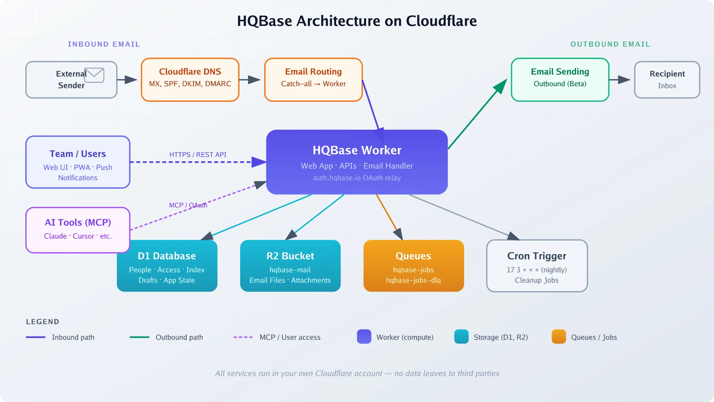
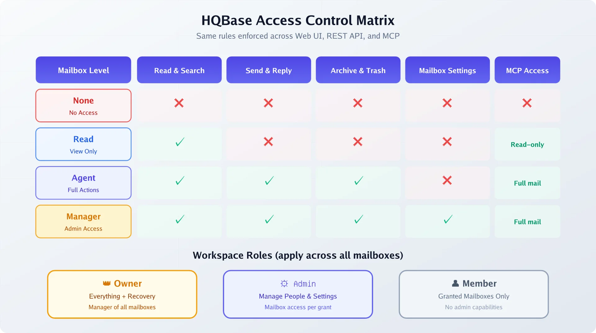

import Button from "@components/widgets/Button.astro";
import Notice from "@components/widgets/Notice.astro";
import ListCheck from "@components/widgets/ListCheck.astro";
import Accordion from "@components/widgets/Accordion.astro";

HQBase is a free, open-source, self-hosted shared email workspace that deploys entirely into your own Cloudflare account. No VPS. No mail server. No per-seat pricing. It gives your team shared mailboxes like `support@yourdomain.com` and `sales@yourdomain.com`, with per-mailbox access control, MCP integration for AI tools, and a PWA with push notifications. All of it runs on Cloudflare's serverless platform for roughly $5/month. This article covers what HQBase is, how the Cloudflare architecture works, real cost math compared to Google Workspace and alternatives, step-by-step setup, and the honest caveats you should know before relying on it.

## What is HQBase? A self-hosted shared inbox on Cloudflare

HQBase is an AGPL-3.0 licensed, TypeScript-based shared inbox that runs in **your** Cloudflare account, not a SaaS operated by someone else. It gives you:

- **Shared mailboxes**: `support@`, `sales@`, `hello@` across multiple domains
- **Per-mailbox team access control**: Read, Agent, Manager roles per mailbox
- **Drafts, audit history, and trash auto-deletion** (30 days)
- **PWA with self-hosted push notifications** (VAPID/Web Push)
- **OAuth-protected MCP server** so AI tools can search, draft, and send mail
- **Multiple domain support** in a single workspace

The main difference: mail, data, and Cloudflare credentials never leave your account. There's no HQBase-operated middleman. The OAuth relay at `auth.hqbase.io` only returns a short-lived authorization code to your Worker. It never sees your access tokens or email content.

As of August 2026, HQBase is at v1.0.1, about five days old. That's young, but the project ships with signed releases (Ed25519 + SHA-256 verification), e2e tests with Playwright, architecture tests, and a proper rollback story. For a brand-new project, that's more process than most. If you've been [configuring Postfix to send email via an external SMTP relay](https://www.bitdoze.com/postfix-external-smtp/) for your self-hosted tools, HQBase offers a simpler path: no mail server at all.

For teams exploring [self-hosted alternatives](https://www.bitdoze.com/self-hosted-airtable-alternatives/) to SaaS tools, HQBase fits the same philosophy: own your data, run it yourself, but with far fewer moving parts than traditional self-hosted email.

## How HQBase works: Cloudflare Workers, D1, R2 and Queues

HQBase decomposes into Cloudflare services you probably already know:

| Cloudflare service | Role in HQBase |
|---|---|
| **Workers** | Serves the web app, APIs, receives inbound email, performs approved actions |
| **D1** | Stores people, mailbox access, searchable email index, drafts, app state |
| **R2** | Stores original email files and attachments |
| **Queues** | Background and maintenance jobs; failed jobs go to a dead-letter queue |
| **Email Routing** | Inbound delivery (catch-all rule forwards to the Worker) |
| **Email Sending** | Outbound send from shared mailboxes |

When deployed, HQBase creates these resources in your account: a Worker named `hqbase`, a D1 database `hqbase`, an R2 bucket `hqbase-mail`, a Queue `hqbase-jobs`, a dead-letter queue `hqbase-jobs-dlq`, and a nightly cron trigger (`17 3 * * *`) for cleanup. It also generates a `BETTER_AUTH_SECRET` and VAPID keypair for push notifications.

There's no separate mail server, no IMAP, no Postfix, no Docker containers. Cloudflare handles email delivery and receipt at the edge. If you've [deployed apps on Cloudflare Workers with a D1 database](https://www.bitdoze.com/sink-install/) before, the deployment pattern is the same, just with more bindings. The same applies if you're familiar with [running apps on Cloudflare](https://www.bitdoze.com/migrate-astro-bun/) from other projects.



<Notice type="info" title="No VPS required">
HQBase runs entirely on Cloudflare's serverless platform. There's no server to patch, no Docker containers to manage, and no IMAP/SMTP daemons to babysit.
</Notice>

## HQBase pricing: the real cost of a Cloudflare shared inbox

This is where HQBase gets interesting. The software itself is free (AGPL-3.0). Your only cost is the Cloudflare infrastructure it runs on.

### Cloudflare cost breakdown

| Cloudflare service | Free tier | Paid / overage |
|---|---|---|
| **Workers Paid** (required) | — | **$5/mo** minimum per account; 10M requests/mo included, +$0.30/M after |
| **Email Routing** (inbound) | **Free, unlimited** | — |
| **Email Sending** (outbound, beta) | **3,000 emails/mo** included | $0.35 per 1,000 after that |
| **D1** (database) | 5M rows-read/day, 100K rows-written/day, 5 GB storage | +$0.001/M reads, +$1.00/M writes, +$0.75/GB-mo |
| **R2** (attachments) | 10 GB storage, 1M Class A ops/mo | $0.015/GB-month, egress free |
| **Queues** | 1M ops/mo included (Paid plan) | +$0.40/M ops |

A domain costs roughly $10 to $15/year on top of that, but you probably already have one.

### Realistic scenario

Three mailboxes (`support@`, `sales@`, `hello@`), five team members, 500 inbound + 200 outbound emails/month, under 10 GB of attachments in R2:

- Workers Paid: **$5/mo** (base)
- Email Routing: **$0** (free, unlimited inbound)
- Email Sending: **$0** (under 3,000/mo free tier)
- D1: **$0** (well within free tier)
- R2: **$0** (under 10 GB free tier)
- Queues: **$0** (under 1M ops)

**Total: ~$5/month. Flat. For unlimited seats and unlimited mailboxes.**

### How that compares

| Solution | Monthly cost (3 users, 3 mailboxes) | VPS/server needed? | MCP/AI integration? |
|---|---|---|---|
| **HQBase** | ~$5/mo flat | No | Built-in, scoped OAuth |
| **Google Workspace** | ~$21/mo ($7/user × 3, annual billing) | No | None native |
| **Zoho Mail** | ~$3 to $12/mo ($1 to $4/user × 3) | No | None native |
| **Front** | ~$57/mo ($19/seat × 3) | No | Limited integrations |
| **FreeScout** | ~$5/mo VPS + maintenance | Yes | None (add-ons only) |

HQBase's cost advantage is clearest against per-seat SaaS tools. Google Workspace charges per user: scale to 10 people and you're at $70/mo on annual billing. HQBase stays at $5. FreeScout is also cheap, but you're running a VPS, PHP, a database, and a mail relay. More moving parts. If you want that VPS path, an [affordable Hetzner VPS](https://go.bitdoze.com/hetzner) is a solid choice, but you'll be doing more ops work.

<Notice type="warning" title="Cloudflare Email Sending is still in beta">
Email Sending is in public beta as of August 2026. Pricing and limits may change. Monitor deliverability over the first few weeks and keep an eye on Cloudflare announcements.
</Notice>

## How to set up HQBase step by step

### Prerequisites

<ListCheck>
<ul>
<li>Cloudflare account with a domain using Cloudflare DNS (nameservers pointed to Cloudflare)</li>
<li>Cloudflare Workers Paid plan ($5/mo, activate in your Cloudflare dashboard)</li>
<li>R2 subscription activated (even though it has a free tier, you must complete the R2 checkout in the dashboard)</li>
<li>Node.js 20+ and pnpm 11+ installed locally</li>
<li>Wrangler CLI authenticated (<code>wrangler login</code>)</li>
<li>An email address <strong>not on any domain connected to the workspace</strong> for the owner/recovery account</li>
</ul>
</ListCheck>

<Notice type="error" title="Owner email must be on a different domain">
The owner's login email must NOT be on a domain you plan to connect to HQBase. If HQBase goes down, you need recovery access via an external email. Use a Gmail, Outlook, or another personal address as the owner account. This is enforced by design.
</Notice>

For [Cloudflare DNS](https://www.bitdoze.com/traefik-wildcard-certificate/) setup, if your domain's nameservers aren't pointing to Cloudflare yet, you'll need to update them at your registrar and wait for the status to show "Active." This is typically the slowest step (can take hours).

### Deploy HQBase

You can use the "Deploy to Cloudflare" button from the repo or deploy manually via Wrangler.

**Option A: One-click deploy**

Click the deploy button on the [HQBase GitHub repo](https://github.com/HQBase/hqbase). It'll prompt you to authenticate with Cloudflare and create the required resources.

**Option B: Manual deploy via CLI**

```sh
git clone https://github.com/HQBase/hqbase.git
cd hqbase
pnpm install
wrangler login
pnpm run deploy
```

The installer creates all resources (Worker, D1 database, R2 bucket, Queues), applies database migrations, verifies the signed release, and saves a non-secret deployment record. It installs the current signed stable release and refuses to overwrite a non-empty Worker unless it can verify a valid HQBase release.

**Verify deployment:** After the command completes, visit the Worker URL shown in the output. You should see the HQBase setup wizard.

**What failure looks like:** If you haven't activated Workers Paid or R2, the deploy will fail with binding errors. If your domain isn't on Cloudflare DNS, email routing setup will fail later.

### Configure email routing and domains

The HQBase setup wizard walks you through adding your email domains. During this step, HQBase creates the required DNS records automatically:

- **MX records** — point to Cloudflare's email receiving infrastructure
- **SPF** — authorizes Cloudflare to send on your behalf
- **DKIM** — signing key for outbound email authentication
- **DMARC** — policy record for email authentication alignment

HQBase also enables Email Routing with a catch-all rule that forwards all inbound mail to the Worker.

<Notice type="info" title="DNS records are auto-created">
HQBase's setup wizard creates MX, SPF, DKIM, and DMARC records automatically during domain configuration. After setup, verify them in your Cloudflare DNS dashboard under your domain's DNS settings.
</Notice>

**Verify:** Check your Cloudflare dashboard → your domain → DNS records. You should see MX, SPF, DKIM, and DMARC entries. Cloudflare will show Email Routing as "Enabled" for the domain.

**What failure looks like:** If Cloudflare shows "Authentication error" for Email Routing DNS, re-approve the Zone Settings / Edit permission in your Cloudflare API token settings.

### Create mailboxes and invite teammates

Once domains are configured:

1. Create shared mailboxes (`support@yourdomain.com`, `sales@yourdomain.com`, etc.)
2. Set access levels for each mailbox (None / Read / Agent / Manager)
3. Invite teammates — they'll receive a password-setup link (fixed in v1.0.1 to properly reach the `/set-password` form)

**Verify:** Send a test email to `support@yourdomain.com` from an external address (Gmail, etc.). It should land in the HQBase inbox within seconds. This validates the full inbound path: Email Routing catch-all → Worker → D1 index → R2 storage.

## HQBase access control: mailbox roles and workspace permissions

This is one of HQBase's strongest features. The access model has two layers:

### Workspace roles

| Role | Can do |
|---|---|
| **Owner** | Everything. Recovery account. Manager of every mailbox by default. Login email must be on a domain NOT in the workspace. |
| **Admin** | Manage people, settings, and access — but cannot read a mailbox unless explicitly granted access. |
| **Member** | Can only access mailboxes where they've been granted a role. |

### Mailbox access levels

| Level | Capabilities |
|---|---|
| **None** | No access to the mailbox |
| **Read** | Read, search, download messages |
| **Agent** | Read + send, reply, mark read, star, archive, trash |
| **Manager** | Agent + mailbox settings and deletion rules |

The critical point: **the same access rules are enforced across the web app, REST API, and MCP server.** If a team member can't read `finance@`, their AI agent connected via MCP can't read it either. You can give an MCP connection fewer abilities than its user, but never more.

This matters when thinking about [MCP servers vs native agent tools](https://www.bitdoze.com/mastra-tools-vs-mcp/). With HQBase, the permission boundary is enforced at the data layer, not bolted on as an afterthought in the AI integration.



<Notice type="success" title="Unified permissions">
The same access rules apply everywhere — web UI, REST API, and MCP. If a user can't read a mailbox, their AI agent can't either. This is a meaningful security improvement over tools with separate AI integration layers.
</Notice>

Additional safety: audit history records sensitive actions (without exposing email content, passwords, or tokens). Trash is auto-deleted after 30 days. Messages are otherwise kept indefinitely by default.

## Connect AI tools to HQBase over MCP

HQBase ships an OAuth-protected MCP server, so [AI coding tools like Claude Code and Cursor](https://www.bitdoze.com/best-ai-coding-tools/) can search, read, draft, and send email on your behalf.

### MCP profiles

| Profile | Endpoint | Capabilities |
|---|---|---|
| **Read-only** | `/mcp` | `list_mailboxes`, `search_messages`, `list_conversations`, `get_message`, `get_thread`, `get_attachment` |
| **Mail actions** | `/mcp/full` | Everything above + `send_email`, `reply_to_message`, `forward_message`, draft CRUD, `update_message`, `update_conversation` |

Switching from read-only to mail actions requires a new OAuth connection and approval. Scopes: `mail:read`, `mail:write`, `mail:send`, `offline_access`.

### OAuth flow

HQBase uses Streamable HTTP with OAuth 2.0 discovery, dynamic client registration, authorization code flow with PKCE, and user consent. The OAuth relay at `auth.hqbase.io` only returns a short-lived authorization code to your Worker. It never exchanges the code or sees your access token or mail content.

For organizations that block public OAuth apps, you can register a private Cloudflare OAuth client (Authorization Code + PKCE, no client secret required).

### Connecting a client

Add HQBase as an MCP server in your client configuration. For Claude Code, add to your MCP settings:

```json
{
  "mcpServers": {
    "hqbase": {
      "url": "https://your-worker.your-subdomain.workers.dev/mcp",
      "oauth": true
    }
  }
}
```

For the full mail-actions profile, use `/mcp/full` instead of `/mcp`.

<Notice type="warning" title="MCP double-send risk">
HQBase docs explicitly warn that send/reply/forward can send more than once if an MCP client retries. Start with read-only mode and test thoroughly before enabling mail actions for production workflows. Do not blindly retry failed sends.
</Notice>

**Other MCP limitations to know:**

- Attachments via MCP are capped at **10 MiB**
- No live push/streaming of new mail: you must poll via search or list
- MCP cannot manage people, mailboxes, domains, setup, updates, audit, sessions, or secrets
- HQBase does **not** ship a built-in LLM. It exposes mail to external AI tools via MCP (unlike Cloudflare Agentic Inbox, which has a built-in AI agent)

## HQBase ops: updates, backups, rollback and doctor

HQBase treats operations seriously — signed releases, verification, backup, and rollback are all first-class CLI features.

### Updates

The updater downloads the release, verifies the `stable.json` manifest (Ed25519 signature + SHA-256 digest), checks product/channel/version and database compatibility, then deploys. If an update fails, the updater prints exact recovery commands.

Never skip the verification step. The signed manifest is what protects you from deploying a tampered or incompatible release.

### Backups

```sh
pnpm hqbase -- backup
```

**Critical caveat:** this records D1 bookmarks, the active Worker version, and an R2 inventory. It does **not** download email or attachments to your local machine. It's a deployment snapshot, not an offline mail export. For offline copies, you'd need to export from R2 separately.

Always run `backup` before any manual change.

### Rollback

```sh
pnpm hqbase -- restore
```

Worker rollback and D1 restore are deliberately separate operations. D1 restore is **destructive** — it discards all mail received after the restore point. Never restore D1 casually. The recommended sequence:

1. Run `backup` first
2. Roll back the Worker
3. Only if necessary, restore D1 (understanding you'll lose newer messages)

### The doctor command

```sh
pnpm hqbase -- doctor            # diagnostics (read-only)
pnpm hqbase -- doctor --repair --yes   # fix detected issues
```

`doctor` checks version, database, Worker health, storage, queues, email domains, and update channel. Run it before and after any manual change.

<Notice type="error" title="D1 restore is destructive">
Restoring D1 discards all mail received after the restore point. Worker rollback and D1 restore are separate operations — never restore D1 without understanding you'll lose newer messages. Always back up first.
</Notice>

Unlike VPS-based self-hosted email where you need [self-hosted monitoring tools](https://www.bitdoze.com/sever-monitoring/) to watch your mail server, HQBase removes the server entirely — Cloudflare handles the infrastructure health. You're monitoring bindings and configuration, not CPU and disk.

## HQBase vs Cloudflare Agentic Inbox vs FreeScout

There are three main paths to "AI-aware shared email." They solve different problems.

| Feature | HQBase | Cloudflare Agentic Inbox | FreeScout | Google Workspace |
|---|---|---|---|---|
| **Hosting** | Your Cloudflare account | Cloudflare-managed | Your VPS | Google SaaS |
| **Cost (3 users, 3 mailboxes)** | ~$5/mo | TBD (beta/preview) | ~$5/mo VPS + your time | ~$21.60/mo |
| **Mailbox-level RBAC** | Yes (None/Read/Agent/Manager) | No — single trust boundary | Basic roles | Yes |
| **MCP / AI integration** | Built-in, scoped OAuth | Native (Cloudflare AI + built-in agent) | None (add-ons only) | None native |
| **Data ownership** | Full (your Cloudflare account) | Cloudflare-managed | Full (your VPS) | Google |
| **Open source** | Yes (AGPL-3.0) | Yes (Apache-2.0) | Yes (GPL-3.0) | No |
| **Maturity** | Days old | Public preview, no releases | Years, established | Enterprise-grade |
| **Mail server ops needed** | None | None | Yes (Postfix/relay + DB) | None |

### The sharpest difference: HQBase vs Agentic Inbox

Agentic Inbox's README states directly: "Any user who passes the shared Cloudflare Access policy can access all mailboxes... There is no per-mailbox authorization." That single trust boundary is fine for a personal AI experiment, but it's a non-starter for teams. You can't give an AI agent access to `support@` while blocking it from `finance@`.

HQBase solves this with proper per-mailbox RBAC, enforced consistently across web, API, and MCP. It also ships signed releases, rollback tooling, backup commands, and audit history — none of which Agentic Inbox provides.

Agentic Inbox's advantage: it has a built-in AI agent (using Workers AI / kimi-k2.5) with auto-drafting. HQBase takes the opposite approach — no built-in LLM, but full MCP support so you bring your own AI tools.

### HQBase vs FreeScout

FreeScout is the battle-tested self-hosted option (PHP, GPL-3.0, years of production use). But you're running a VPS, a database, and an SMTP relay. That's more moving parts, more things to patch, and more things to break. HQBase eliminates all of that by running on Cloudflare's serverless stack.

If you're already invested in VPS-based self-hosting and want the full control, FreeScout makes sense. If you want fewer moving parts and a flat $5/month bill with no server maintenance, HQBase is the simpler path.

## HQBase limitations and caveats before you rely on it

Be honest about the trade-offs:

1. **Brand-new project.** Well-architected and tested, but no production track record yet. Small team, fast-moving. Re-check the GitHub repo before adopting for anything critical.

2. **Cloudflare lock-in.** Requires Cloudflare DNS, Workers Paid, Email Routing, and Email Sending. You cannot run this on AWS, GCP, or a VPS. If you leave Cloudflare, you leave HQBase.

3. **Email Sending is beta.** Pricing, limits, and deliverability may change. Cloudflare auto-configures SPF/DKIM/DMARC, but the service is young. Monitor deliverability over the first few weeks.

4. **AGPL-3.0 license.** If you modify HQBase and offer it as a service, you must release your changes under AGPL. Fine for internal use — understand the implications for commercial products.

5. **"Backup" is not offline mail export.** The backup command snapshots deployment state (D1 bookmarks, Worker version, R2 inventory). It does not download email to your machine. Plan separately for compliance or data portability needs.

6. **No IMAP/POP.** All access is via the web UI, REST API, or MCP. No traditional email clients like Thunderbird or Apple Mail.

7. **MCP limitations.** 10 MiB attachment cap, no live push notifications for new mail (must poll), and double-send risk on retries.

## Verification checklist: is your inbox working?

Run through this after setup and after any manual change:

<ListCheck>
<ul>
<li>Send a test email to <code>support@yourdomain.com</code> → confirm it lands in the HQBase inbox (validates Email Routing catch-all + D1 + R2)</li>
<li>Reply from the shared mailbox → check received headers for passing SPF/DKIM/DMARC (look for "signed-by" in Gmail, or test at mail-tester.com)</li>
<li>Run <code>pnpm hqbase -- doctor</code> and confirm all checks pass</li>
<li>Run <code>pnpm hqbase -- backup</code> and note the Worker version + D1 bookmark</li>
<li>Connect an MCP client in read-only mode → confirm <code>list_mailboxes</code> and <code>search_messages</code> return expected data</li>
<li>(Optional) Re-connect MCP with Mail actions → draft and send a test reply</li>
<li>Check Cloudflare dashboard: Worker analytics, D1 metrics, R2 bucket, Queue health</li>
<li>Confirm Email Sending is enabled and check the first outbound emails for deliverability</li>
</ul>
</ListCheck>

## FAQ

<Accordion label="Does HQBase cost anything beyond the $5/month Cloudflare Workers plan?" group="faq">
The base HQBase software is free (AGPL-3.0). Your only cost is Cloudflare Workers Paid ($5/mo) plus any overage from Email Sending (first 3,000 emails/month are free, then $0.35/1,000). For most small teams with 3 mailboxes and a few hundred emails, the total stays at ~$5/month. Optional paid setup or support may be offered separately but doesn't gate any product features.
</Accordion>

<Accordion label="Can I use HQBase with Google Workspace or Microsoft 365 domains?" group="faq">
No. HQBase requires Cloudflare to manage DNS for your email domains (for Email Routing and Sending). If your domain's nameservers point to Google or Microsoft, you'd need to migrate DNS to Cloudflare first. The owner/recovery email must also be on a domain NOT connected to the workspace.
</Accordion>

<Accordion label="Is my email data encrypted at rest?" group="faq">
Email files and attachments are stored in Cloudflare R2, and the searchable index lives in Cloudflare D1. Cloudflare encrypts data at rest by default. However, HQBase itself doesn't add a separate application-level encryption layer. Your data's security depends on your Cloudflare account security — enable 2FA and use API tokens with minimal scopes.
</Accordion>

<Accordion label="How does HQBase compare to Cloudflare Agentic Inbox?" group="faq">
HQBase gives you per-mailbox RBAC (Read/Agent/Manager), so you can give an AI agent access to support@ but not finance@. Cloudflare's Agentic Inbox uses a single trust boundary — all mail is accessible or none is. HQBase is also fully open source (AGPL-3.0) and self-hosted in your account, while Agentic Inbox is a Cloudflare-managed service. If you need granular team permissions and data ownership, HQBase is the stronger choice. If you want a built-in AI agent with auto-drafting and don't need per-mailbox control, Agentic Inbox might be simpler.
</Accordion>

<Accordion label="Can I export my email if I decide to leave HQBase?" group="faq">
HQBase's `backup` command records deployment state (D1 bookmarks, Worker version, R2 inventory) but does not download email to your local machine. To export mail, you'd need to access the R2 bucket directly and copy the raw email files. There's no built-in one-click export to MBOX or EML format as of v1.0.1. Plan for this if compliance or data portability matters to your team.
</Accordion>

## Updates

| Date | Change |
|---|---|
| **2026-08-13** | Article published. HQBase v1.0.1. Cloudflare Email Sending in public beta. |

## Wrapping up

HQBase is a genuinely different approach to shared team email. Serverless, open-source, with real per-mailbox access control and MCP integration — all for about $5/month with unlimited seats and mailboxes. The trade-off is hard Cloudflare platform lock-in and a brand-new project with no production track record.

For teams already on Cloudflare who want to eliminate mail-server ops and flatten per-seat email costs, it's worth evaluating. Start with read-only MCP, run `doctor` regularly, and back up before every change.

The cost math is hard to argue with: $5/month flat vs $7+/user/month on Google Workspace, with better AI integration and full data ownership. Just understand what you're signing up for — Cloudflare is the platform, Email Sending is beta, and the project is days old.

<Button text="View HQBase on GitHub" link="https://github.com/HQBase/hqbase" variant="solid" color="blue" size="md" icon="arrow-right" />
