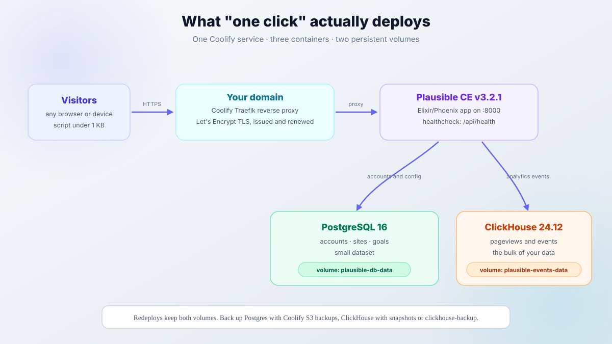

import Button from "@components/widgets/Button.astro";
import Notice from "@components/widgets/Notice.astro";
import ListCheck from "@components/widgets/ListCheck.astro";
import Accordion from "@components/widgets/Accordion.astro";
import Tabs from "@components/widgets/Tabs.astro";
import Tab from "@components/widgets/Tab.astro";
import YouTubeEmbed from "@components/widgets/YouTubeEmbed.astro";
import { Picture } from "astro:assets";
import img1 from "../../assets/images/23/03/01createservice.png";
import img2 from "../../assets/images/23/03/choose_plausible_analytics.jpeg";
import img3 from "../../assets/images/23/03/plausible-configs.png";
import img4 from "../../assets/images/23/03/plausible-secrets.jpeg";

[Plausible Analytics](https://plausible.io/) is a privacy-first, open-source alternative to Google Analytics. It sets no cookies, collects no personal data, and the tracking script is under 1 KB. Plausible says it is 54x smaller than Google Analytics and saves each visitor around 135 KB of JavaScript.

In this guide, you'll **install Plausible Analytics** on your own VPS using [Coolify](https://coolify.io/), a self-hosted PaaS. One predefined Docker Compose app stands up the whole stack: the analytics app, PostgreSQL for accounts, ClickHouse for events, plus SSL and a reverse proxy.

Plausible CE v3.2.1 (May 2026) is the current release. It is also a security fix worth taking (details in the update section), so pin that tag and not an older one.

## What you get with self-hosted Plausible Analytics

<ListCheck>
<ul>
<li>**No pageview limits.** Plausible Cloud is tiered now: Starter at $9/month for 10k monthly pageviews on one site, Growth at $14/month for 3 sites, Business at $19/month for 10 sites. Self-hosted CE has no limits.</li>
<li>**Full data ownership.** Events live on your server in ClickHouse. No third party in the path.</li>
<li>**No consent banner.** No cookies, no IP logging, no personal data collection. Under GDPR you are not running a cookie banner for this.</li>
<li>**Tiny script.** Under 1 KB versus roughly 135 KB for Google Analytics.</li>
<li>**Three containers.** Plausible (Elixir/Phoenix), PostgreSQL 16 for accounts and site config, ClickHouse 24.12 for events.</li>
</ul>
</ListCheck>

<Notice type="info" title="Cost math">
A 4 GB VPS shared with Coolify and a few other services runs on the order of €5-8/month on Hetzner-class hardware. Plausible Cloud costs $9/month for a single site at 10k pageviews and goes up from there. Self-hosting pays for the box by itself once you run more than one site or more than trivial traffic.
</Notice>

What v3.x gives you on top of older releases: teams and permissions, scroll depth and engagement time (v3.0.0), the new configurable tracking script (v3.1.0), and "Limit to segment" on shared links (v3.2.0). Site segmentation itself shipped earlier, in the v2.1 line.



## Prerequisites

<ListCheck>
<ul>
<li>A VPS with 2 CPU cores and at least 2 GB RAM. Plausible's own README recommends ">= 2 GB RAM recommended for running ClickHouse and Plausible without fear of OOMs". I'd take 4 GB if the box also runs Coolify and other services.</li>
<li>A CPU that supports SSE4.2 (x86-64) or NEON (ARM). ClickHouse will not run without it.</li>
<li>A domain or subdomain for the dashboard, like `analytics.yourdomain.com`.</li>
<li>Ports 80 and 443 reachable on the server. Port 8000 only matters while you set up Coolify.</li>
<li>A DNS A record for that hostname pointing at the server IP.</li>
<li>Coolify installed on the server (Step 2 covers this).</li>
</ul>
</ListCheck>

<Notice type="warning" title="ClickHouse needs SSE4.2 or NEON">
Some cheap or old VPS plans run on CPUs without SSE4.2 and the events database crash-loops. If `grep -o 'sse4_2' /proc/cpuinfo | head -1` prints nothing on your box, change plans or providers before you deploy.
</Notice>

## Video walkthrough

<YouTubeEmbed
  url="https://www.youtube.com/embed/RNnuXCUhHF4"
  label="How to Install Plausible Analytics With One Click (2026)"
/>

The video shows the older Service-catalog flow in Coolify. Plausible now ships as a predefined Docker Compose app, so use the text steps below as the current path (they match the Coolify v4.3.x templates as of September 2026).

## Step 1: Set up a VPS server

You need a VPS to host Plausible. [Hetzner](https://go.bitdoze.com/hetzner) is the price-to-performance pick I'd default to; see the [Hetzner Cloud review](/hetzner-cloud-review/) for details. [DigitalOcean](https://go.bitdoze.com/do), [Vultr](https://go.bitdoze.com/vultr), and [Hostinger](https://go.bitdoze.com/hostinger-vps) all work fine too. Numbers here: [DigitalOcean vs Vultr vs Hetzner VPS comparison](/digitalocean-vs-vultr-vs-hetzner/).

_VPS prices jumped across the board in 2026. If you're rethinking a rented box, see [what changed and when a mini PC wins](/vps-price-increases/)._

For Plausible alongside Coolify and a few other services, a 4 GB RAM / 2-core VPS is the right starting point. That class of box runs about €5-8/month on Hetzner.

<Button link="https://go.bitdoze.com/do" text="DigitalOcean $100 Free" />
<Button link="https://go.bitdoze.com/vultr" text="Vultr $100 Free" />
<Button link="https://go.bitdoze.com/hetzner" text="Hetzner €20 Free" />
<Button link="https://go.bitdoze.com/hostinger-vps" text="Hostinger VPS" />

## Step 2: Install Coolify

SSH into your VPS as root and run:

```bash
curl -fsSL https://cdn.coollabs.io/coolify/install.sh | sudo bash
```

The script installs Docker Engine, the dependencies, and Coolify itself (currently the v4.x line, v4.3.23 as of September 2026). Open `http://your-server-ip:8000` and create the admin account right away. This is a self-hosted PaaS you fully control; see [our Coolify v5 review](/coolify-v5-self-hosted-paas-review/) for what it looks like in daily use.

**Verify:** `curl -I http://your-server-ip:8000` returns 200 or 302 and the dashboard loads. If the page hangs, check `ss -tlnp | grep 8000` and `docker ps` to confirm Coolify started.

For the full setup including SSL and domain configuration, see the [Coolify install guide](/coolify-install-heroku-alternative/).

## Step 3: Point a domain to the server

Add an A record in your DNS pointing the Plausible hostname at the VPS IP. For example, `analytics.yourdomain.com` → `your-server-ip`.

If you use Cloudflare, leave the proxy disabled (gray cloud). Coolify's Traefik reverse proxy handles SSL via Let's Encrypt automatically.

**Verify:** `dig +short analytics.yourdomain.com` returns your server IP before you deploy. If it does not, wait out the TTL and try again. Certificate issuance fails on an unresolvable hostname, and Coolify will just show you a broken proxy target.

## Step 4: Deploy Plausible Analytics with Coolify

This is where things changed in 2026. Plausible used to live in Coolify's service-template catalog. It now ships as a **predefined Docker Compose app** (updated to v3.2.1 in September 2026), so the click path is different from older tutorials and videos. The template pulls three containers:

- **plausible**: `ghcr.io/plausible/community-edition:v3.2.1`, healthcheck on `/api/health`
- **plausible-db**: `postgres:16-alpine`, healthcheck on `pg_isready`
- **plausible-events-db**: `clickhouse/clickhouse-server:24.12-alpine`, healthcheck on `:8123/ping`, with a low-resources config inlined

### 4.1 Create a new Docker Compose resource

<Tabs>
<Tab name="Predefined app (recommended)">
In Coolify, go to **New Resource** → **Docker Compose** → **Load from Predefined Apps**. Search for "Plausible" (category: Analytics) and select it. Coolify fills in the compose file, the healthchecks, and the environment placeholders the app needs.

<Picture formats={["webp"]} fallbackFormat="webp"
  src={img1}
  alt="Coolify dashboard showing New Resource and Docker Compose option"
/>
<Picture formats={["webp"]} fallbackFormat="webp"
  src={img2}
  alt="Selecting Plausible from Coolify predefined Docker Compose apps"
/>

_Screenshots predate the move to predefined Docker Compose apps, so some labels differ from the current UI. Follow the text steps above if the two disagree._
</Tab>
<Tab name="Paste the official compose file">
This works on any Coolify version and keeps you independent of Coolify's template list.

1. **New Resource** → **Docker Compose** (empty).
2. Paste the official `compose.yml` from the [Plausible community-edition repo](https://github.com/plausible/community-edition).
3. Set at least `BASE_URL` and `SECRET_KEY_BASE` in the environment settings:

```bash
BASE_URL=https://analytics.yourdomain.com
SECRET_KEY_BASE=<output of the command below>
```

```bash
openssl rand -base64 48
```

If you go this route, update the community-edition files yourself when Plausible releases fixes, not just the app image.
</Tab>
</Tabs>

Do not look for Plausible under the old Service catalog. It is no longer listed there in current Coolify versions.

### 4.2 Configure the service

Set these in the service configuration:

- **Name**: anything recognizable, like `plausible-analytics`
- **Image tag**: `v3.2.1` (the template default as of September 2026)
- **URL (FQDN)**: `https://analytics.yourdomain.com`. This populates `BASE_URL` automatically via `SERVICE_URL_PLAUSIBLE`.

Coolify also generates the secrets for you: `SECRET_KEY_BASE` from `SERVICE_BASE64_64_PLAUSIBLE` and `TOTP_VAULT_KEY` from `SERVICE_REALBASE64_32_TOTP`. You do not need to invent them.

<Picture formats={["webp"]} fallbackFormat="webp"
  src={img3}
  alt="Coolify Plausible service configuration with domain and version settings"
/>

Save the configuration.

### 4.3 Environment variables

**Required:**

- `BASE_URL`: your Plausible URL, e.g. `https://analytics.yourdomain.com`. Set automatically if you filled in the FQDN above.
- `SECRET_KEY_BASE`: a 64+ character random string for session encryption. Coolify generates it; if you pasted the compose file yourself, use `openssl rand -base64 48`. Plausible CE also reads Docker secrets from `/run/secrets/SECRET_KEY_BASE`, which overrides the env var; see [Docker Compose secrets](/docker-compose-secrets/) for wiring those up.

**Optional:**

- `TOTP_VAULT_KEY`: encrypts two-factor authentication secrets. Plausible derives it from `SECRET_KEY_BASE` (PBKDF2) when it is unset, so you only set it if you want it independent. Coolify's template sets it anyway.

**Registration:**

- `DISABLE_REGISTRATION`: defaults to `invite_only`, so only users you invite can create accounts. After your admin account exists, leave it there. Set `true` to lock it down completely.

**SMTP (optional, for email reports and password resets):**

<Notice type="warning" title="Emails are not sent by default">
Coolify's template sets `MAILER_ADAPTER=Bamboo.LocalAdapter`, which writes emails to a local file instead of delivering them. Password resets and scheduled reports will never arrive until you configure SMTP below. Direct outbound mail needs port 25 open plus SPF and DKIM on your domain, and most VPS providers block 25. A relay or transactional SMTP provider is the realistic path.
</Notice>

```bash
MAILER_EMAIL=analytics@yourdomain.com
SMTP_HOST_ADDR=smtp.yourdomain.com
SMTP_HOST_PORT=587
SMTP_USER_NAME=analytics@yourdomain.com
SMTP_USER_PWD=your_smtp_password
SMTP_HOST_SSL_ENABLED=true
```

Without SMTP, Plausible works fine. You just get no email reports and no email-based password resets.

**Google Search Console integration (optional):**

```bash
GOOGLE_CLIENT_ID=your_client_id
GOOGLE_CLIENT_SECRET=your_client_secret
```

This lets Plausible import search query data from Google Search Console. You configure it in Plausible's site settings after deployment.

**City-level geolocation (optional):**

```bash
IP_GEOLOCATION_DB=MaxMindCity
MAXMIND_LICENSE_KEY=your_maxmind_license
MAXMIND_EDITION=GeoLite2-City
```

Without a MaxMind license key you get country-level location at best. The GeoLite2 license is free; sign up at MaxMind and paste the key in.

<Picture formats={["webp"]} fallbackFormat="webp"
  src={img4}
  widths={[200, 400, 900]}
  sizes="(max-width: 900px) 100vw, 900px"
  alt="Plausible environment variables BASE_URL and SECRET_KEY_BASE in Coolify"
/>

For the full list of configuration options, see the [Plausible CE Configuration wiki](https://github.com/plausible/community-edition/wiki/Configuration). If you are not using Coolify and want Plausible to handle its own certificates, set `HTTP_PORT=80` and `HTTPS_PORT=443` and it will issue and renew Let's Encrypt certs itself.

Hit **Deploy**. The first run takes a few minutes while the images pull and `db createdb && db migrate && run` runs on boot.

### 4.4 Verify the deployment

Run these from the server or any machine that can reach the domain:

```bash
# 1. health endpoint should return healthy
curl -fsSL https://analytics.yourdomain.com/api/health

# 2. confirm you are running v3.2.1
docker ps --format '{{.Image}}' | grep plausible
# expect: ghcr.io/plausible/community-edition:v3.2.1

# 3. CVE check: /storybook must NOT return 200 on v3.2.1
curl -sSI https://analytics.yourdomain.com/storybook
```

Then open `https://analytics.yourdomain.com` in a browser. The registration page should appear. Create your admin account immediately: with `DISABLE_REGISTRATION=invite_only`, every later user needs an invite from you.

<Notice type="success" title="You are live">
If the health check returns 200, the image tag is v3.2.1, `/storybook` is gone, and the registration page loads, the deploy is good. Add your first site next.
</Notice>

## Step 5: Add your first site

In the Plausible dashboard, click **Add a website** and enter your site's domain. Open **Site Installation** in the site settings. Plausible generates a unique snippet for that site:

```html
<script defer data-domain="yourdomain.com"
  src="https://analytics.yourdomain.com/js/script.js">
</script>
```

Add it to the `<head>` of every page on your website. Custom events and revenue tracking are enabled by default in the new script. Because the script loads from your own domain rather than a third-party server, ad blockers are far less likely to block it than a cloud analytics host.

<Notice type="info" title="Adblockers and proxies">
First-party hosting cuts down blocking a lot, but it is not immune to aggressive filter lists. If you need the counts to survive those, run the script through a proxy path on your own domain. Plausible documents this in their [proxy guide](https://plausible.io/docs/proxy), and there is a full walkthrough here: [Plausible Analytics with Cloudflare Workers proxy](/astro-plausible-cloudflare-workers/).
</Notice>

**Verify:** load your site in a browser, then refresh the Plausible dashboard. A pageview should show up within a minute. For local testing before DNS is live, add `captureOnLocalhost: true` to the init options below.

### Tracking script options

Since the October 2025 script update (shipped in Plausible CE v3.1.0), optional features are toggles and `plausible.init()` options, not filename extensions. The per-site snippet from Site Installation already has your choices baked in. If you need to set them manually:

```html
<script defer data-domain="yourdomain.com"
  src="https://analytics.yourdomain.com/js/script.js"></script>
<script>
  plausible.init({
    hashBasedRouting: true,
    fileDownloads: {
      fileExtensions: ["pdf", "xlsx", "docx", "zip"]
    },
    captureOnLocalhost: true,
    autoCapturePageviews: true
  })
</script>
```

The options you will use most:

- `hashBasedRouting: true`: for single-page apps with hash-based routes. Replaces the old `script.hash.js`.
- `fileDownloads: { fileExtensions: [...] }`: download tracking. Out of the box it watches common types (pdf, xlsx, docx, txt, csv, zip, 7z, rar, mp4, mp3 and friends); pass your own list to narrow or extend it.
- `customProperties: {...}`: attach static properties to every pageview.
- `endpoint: "https://..."`: send events to a custom endpoint, for example when you proxy the script. Replaces the old `data-api` attribute.
- `autoCapturePageviews: false`: fire pageviews manually in an SPA.
- `captureOnLocalhost: true`: needed for any testing from `localhost`.

Form submission tracking is a toggle in Site Installation. Two things the new script dropped: `data-exclude`/`data-include` and multi-domain support in a single snippet. Full details in the [script update guide](https://plausible.io/docs/script-update-guide).

### Legacy script variants

The old extension scripts still work if you already run them: `script.hash.js`, `script.outbound-links.js`, `script.file-downloads.js`, `script.tagged-events.js`, and combined forms like `script.tagged-events.outbound-links.file-downloads.js`. Existing sites can stay on them. For new sites, use the per-site snippet above. It is the path Plausible is actively developing.

## Data persistence and backups

Plausible stores data in two places:

- **PostgreSQL**: user accounts, site configuration, goals. Small dataset.
- **ClickHouse**: analytics events. This is the bulk of your data.

Both run in containers with persistent volumes managed by Coolify. A redeploy keeps your data.

<Notice type="warning" title="Coolify S3 backups do not cover ClickHouse">
Coolify's scheduled S3 backups target Postgres. ClickHouse, which holds every event, is not included. For a single-node setup the practical options are a weekly VPS snapshot, a stop-and-rsync of the `plausible-events-data` volume, or [clickhouse-backup](https://github.com/Altinity/clickhouse-backup) for native backups. Do not rely on naive file copies of a running ClickHouse data directory.
</Notice>

A simple schedule that works: Coolify S3 backups for Postgres plus weekly VPS snapshots for the events volume. If you ever restore from a snapshot, restore both volumes from the same point in time.

One upgrade note: moving from Plausible v2.x to v3.x required a ClickHouse image bump (the template now uses 24.12). If you are upgrading a very old deployment, snapshot the volumes first.

## Updating Plausible

<Notice type="error" title="Security: CVE-2026-8467 (CVSS 9.5)">
All Plausible CE releases from v3.0.0 through v3.2.0 ship a vulnerable `phoenix_storybook` dependency. The exposed `/storybook` endpoint allows unauthenticated remote code execution as the app user (CVE-2026-8467, GHSA-55hg-8qxv-qj4p, CVSS 9.5, published May 2026). v3.2.1 removes the endpoint entirely. If you cannot update right now, block `/storybook` at the reverse proxy. After any deploy, run the `/storybook` check from step 4.4. For hardening your Docker host more broadly, see [how we secured a Docker server against real-world attacks](/bsi-security-report-docker-ufw/).
</Notice>

The update flow itself is short: change the image tag in the Coolify service settings (for example from `v3.2.0` to `v3.2.1`) and redeploy. Migrations run on startup via `db createdb && db migrate && run`.

**Verify after updating:** rerun the three checks from step 4.4. You want `/api/health` returning 200, the new image tag in `docker ps`, and `/storybook` not returning 200.

One v3.2.0 gotcha if you pasted the official compose file: ClickHouse low-memory settings only became effective in v3.2.0 (they were silently ignored before). Update the community-edition repo files, not just the app image.

Watch the [Plausible CE releases](https://github.com/plausible/analytics/releases) for security patches. v3.2.1 is a security-only release; there is no reason to stay behind it.

## Troubleshooting common failures

<Accordion label="ClickHouse container keeps restarting" group="faq" expanded="true">
The most common cause is a CPU without SSE4.2 (x86-64) or NEON (ARM). ClickHouse will not run on those. Check with `grep -o 'sse4_2' /proc/cpuinfo | head -1` on the host. If it prints nothing, move to a newer plan or provider. Second cause: not enough RAM. Check `docker stats` and `dmesg -T | grep -i oom` for kill events.
</Accordion>

<Accordion label="Containers get killed or the dashboard is sluggish" group="faq">
2 GB RAM is the floor, and that is for Plausible alone. With Coolify and anything else on the box, take 4 GB. If `docker stats` shows memory climbing to the limit or `dmesg` shows the OOM killer, either upsize the VPS or move your other services elsewhere.
</Accordion>

<Accordion label="Emails never arrive" group="faq">
Coolify's template defaults `MAILER_ADAPTER` to `Bamboo.LocalAdapter`, which writes emails to a file instead of sending them. Set the `MAILER_EMAIL`, `SMTP_HOST_ADDR`, `SMTP_HOST_PORT`, `SMTP_USER_NAME`, `SMTP_USER_PWD`, and `SMTP_HOST_SSL_ENABLED` variables from step 4.3 and redeploy. Test by triggering a password reset after the change.
</Accordion>

<Accordion label="curl /api/health fails or the domain serves 502" group="faq">
Almost always DNS or TLS. Run `dig +short analytics.yourdomain.com` and confirm it returns the server IP. Then give Traefik a couple of minutes to issue the Let's Encrypt certificate. Also check the Coolify deployment logs for proxy errors. If the hostname is behind a Cloudflare proxy (orange cloud), turn it off for this record.
</Accordion>

<Accordion label="Upgrading from Plausible v2.x" group="faq">
v3.x required a ClickHouse upgrade, and the template now pins `clickhouse/clickhouse-server:24.12-alpine`. Snapshot both volumes before you change images. The exact volume migration behavior for old Coolify deployments is not something I would trust without a backup first. If anything goes sideways, restore the snapshot and pin the old images.
</Accordion>

<Accordion label="/storybook returns 200 on my instance" group="faq">
You are running v3.2.0 or older with a critical unauthenticated RCE exposed (CVE-2026-8467). Update to v3.2.1 now. If you cannot update immediately, block the `/storybook` path at your reverse proxy and schedule the update. Then rerun the verification commands from step 4.4.
</Accordion>

## More Coolify tutorials

- [Coolify install guide](/coolify-install-heroku-alternative/)
- [Deploy Uptime Kuma with one click on Coolify](/deploy-uptime-kuma/)
- [Coolify vs Dokploy vs Kamal 2](/coolify-vs-dokploy-vs-kamal-2/)

If Plausible is not the right fit for your stack, you can also [install Umami Analytics on Docker](/umami-analytics-install/).

## Conclusion

Self-hosted Plausible on Coolify gets you privacy-first, cookie-free analytics with no pageview limits and no recurring bill. The one-click Docker Compose template handles the hard parts (ClickHouse, PostgreSQL, networking, SSL). You set the domain, deploy, run the health check, and start tracking.

A 4 GB VPS runs about €5-8/month and hosts Coolify plus several other services. Plausible Cloud starts at $9/month for one site at 10k pageviews. The script loads from your own domain, so ad blockers are far less likely to block it than a cloud host, and visitors never see a cookie consent banner. For stubborn filter lists, the proxy option exists.

Install Plausible Analytics once, verify it, and it runs.

<Button link="https://go.bitdoze.com/do" text="DigitalOcean $100 Free" />
<Button link="https://go.bitdoze.com/vultr" text="Vultr $100 Free" />
<Button link="https://go.bitdoze.com/hetzner" text="Hetzner €20 Free" />
<Button link="https://go.bitdoze.com/hostinger-vps" text="Hostinger VPS" />
