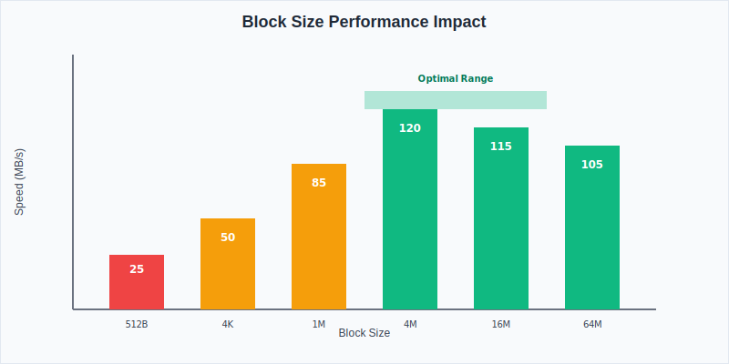

The `dd` command is a powerful but dangerous tool in Linux. Called "disk duplicator" or "data destroyer" because it can overwrite data, `dd` handles disk imaging, cloning, and low-level data operations.

I use `dd` on my home server for creating system backups, cloning drives before upgrades, and preparing bootable media. Whether managing a [home server](https://www.bitdoze.com/why-need-home-server/) or enterprise systems, understanding `dd` helps with data management and disaster recovery.

This guide covers using `dd` safely.

## Understanding the dd Command

<Notice type="info" title="What is dd?">
The `dd` command (disk duplicator) is a low-level utility that copies and converts files at the byte level. It can copy entire disks, partitions, or create files with specific patterns.

### Why Use dd?

<ListCheck>

- **Bit-perfect copies**: Creates exact replicas

- **Sector-level operations**: Works at the lowest level, copying everything including boot sectors
- **Versatile functionality**: Can create images, clone disks, wipe data, and generate test files
- **Bootable media creation**: Perfect for creating bootable USB drives and installation media
- **Forensic applications**: Preserves disk state for analysis

</ListCheck>
</Notice>

The fundamental syntax of `dd` is straightforward:

```bash
dd if=input_file of=output_file [options]
```

#### Essential Parameters

| Parameter | Description | Example |
|-----------|-------------|---------|
| `if=` | Input file (source) | `if=/dev/sda` |
| `of=` | Output file (destination) | `of=/home/backup.img` |
| `bs=` | Block size | `bs=4M` (4 megabytes) |
| `count=` | Number of blocks to copy | `count=1000` |
| `skip=` | Skip blocks at start of input | `skip=100` |
| `seek=` | Skip blocks at start of output | `seek=50` |
| `conv=` | Conversion options | `conv=sync,noerror` |
| `status=` | Progress display | `status=progress` |
<Notice type="error" title="Danger: Data Destruction Risk">

The dd command can permanently destroy data if used incorrectly. Always double-check your `if=` (input) and `of=` (output) parameters. There is no "undo" operation.

</Notice>

**Safety checklist:**

<ListCheck>

- **Verify device names** with `lsblk` or `fdisk -l`
- **Unmount target devices** before operations
- **Have recent backups** of important data
- **Test commands** on non-critical systems first
- **Use `--dry-run` when available** (though not supported by dd itself)
</ListCheck>

## Disk Imaging Operations

### Creating Complete Disk Images

Disk imaging creates a file with an exact copy:

```bash
# Create image of entire disk
sudo dd if=/dev/sda of=/backup/disk-image.img bs=4M status=progress

# Create image of specific partition
sudo dd if=/dev/sda1 of=/backup/partition-image.img bs=4M status=progress

# Compress image during creation (saves space)
sudo dd if=/dev/sda bs=4M status=progress | gzip > /backup/disk-image.img.gz
```

### Advanced Imaging with Error Handling

For disks with bad sectors:

```bash
# Copy with error resilience
sudo dd if=/dev/sda of=/backup/disk-image.img bs=4M conv=sync,noerror status=progress

# Skip bad sectors and continue
sudo ddrescue /dev/sda /backup/disk-image.img /backup/rescue.log
```

### Restoring from Images

```bash
# Restore complete disk from image
sudo dd if=/backup/disk-image.img of=/dev/sda bs=4M status=progress

# Restore from compressed image
gunzip -c /backup/disk-image.img.gz | sudo dd of=/dev/sda bs=4M status=progress

# Restore specific partition
sudo dd if=/backup/partition-image.img of=/dev/sda1 bs=4M status=progress
```

## Disk Cloning Operations

### Direct Disk-to-Disk Cloning

Clone disks directly without creating intermediate files:

```bash
# Clone entire disk
sudo dd if=/dev/sda of=/dev/sdb bs=4M status=progress

# Clone with better performance (larger block size)
sudo dd if=/dev/sda of=/dev/sdb bs=16M status=progress

# Clone with verification
sudo dd if=/dev/sda of=/dev/sdb bs=4M status=progress && sync
```

### Partition-Level Cloning

```bash
# Clone specific partitions
sudo dd if=/dev/sda1 of=/dev/sdb1 bs=4M status=progress

# Clone partition table only
sudo dd if=/dev/sda of=/dev/sdb bs=512 count=1
```

### Performance Optimization for Cloning




Optimal block sizes for different scenarios:

| Use Case | Recommended Block Size | Reasoning |
|----------|----------------------|-----------|
| **SSD to SSD** | `bs=16M` | Takes advantage of high sequential speeds |
| **HDD to HDD** | `bs=4M` | Balances speed with system responsiveness |
| **Network storage** | `bs=1M` | Reduces network overhead |
| **USB drives** | `bs=4M` | Good balance for varying USB speeds |
| **System partition** | `bs=4M` | Safe choice for critical data |

## Specialized dd Operations

### Master Boot Record (MBR) Management

```bash
# Backup MBR (first 512 bytes containing partition table)
sudo dd if=/dev/sda of=/backup/mbr-backup.img bs=512 count=1

# Restore MBR
sudo dd if=/backup/mbr-backup.img of=/dev/sda bs=512 count=1

# Backup extended boot record (first 1024 bytes)
sudo dd if=/dev/sda of=/backup/boot-backup.img bs=1024 count=1
```

### Creating Bootable Media

```bash
# Create bootable USB from ISO
sudo dd if=/path/to/linux.iso of=/dev/sdX bs=4M status=progress && sync

# Create Windows installation USB (requires additional tools)
sudo dd if=/path/to/windows.iso of=/dev/sdX bs=4M status=progress

# Verify bootable media creation
sudo dd if=/dev/sdX bs=4M count=1 | md5sum
sudo dd if=/path/to/linux.iso bs=4M count=1 | md5sum
```

<Notice type="warning" title="Data Destruction Warning">

These operations destroy data permanently. Have backups and target the correct device.

</Notice>

```bash
# Simple zero-fill wipe
sudo dd if=/dev/zero of=/dev/sda bs=4M status=progress

# Random data wipe (more secure)
sudo dd if=/dev/urandom of=/dev/sda bs=4M status=progress

# DoD 5220.22-M compliant wipe (3-pass)
sudo dd if=/dev/zero of=/dev/sda bs=4M status=progress     # Pass 1: zeros
sudo dd if=/dev/urandom of=/dev/sda bs=4M status=progress  # Pass 2: random
sudo dd if=/dev/zero of=/dev/sda bs=4M status=progress     # Pass 3: zeros

# Wipe specific number of blocks
sudo dd if=/dev/zero of=/dev/sda bs=4M count=1000 status=progress
```

### Creating Test Files and Benchmarking

```bash
# Create file with random data for testing
dd if=/dev/urandom of=/tmp/test-1gb.dat bs=1M count=1024

# Create file with zeros (faster, compressible)
dd if=/dev/zero of=/tmp/test-1gb-zeros.dat bs=1M count=1024

# Create sparse file (doesn't use actual disk space)
dd if=/dev/zero of=/tmp/sparse.dat bs=1M count=1024 seek=1024

# Benchmark disk write speed
dd if=/dev/zero of=/tmp/benchmark bs=1M count=1024 oflag=direct
```

## Advanced dd Techniques

### Using dd with Pipes and Compression

```bash
# Create compressed image on-the-fly
sudo dd if=/dev/sda bs=4M status=progress | gzip -c > /backup/compressed-image.img.gz

# Decompress and restore simultaneously
gunzip -c /backup/compressed-image.img.gz | sudo dd of=/dev/sda bs=4M status=progress

# Create image with progress and compression
sudo dd if=/dev/sda bs=4M status=progress | pv | gzip > /backup/image.img.gz

# Network transfer with compression
sudo dd if=/dev/sda bs=4M status=progress | gzip | ssh user@remote 'cat > /backup/remote-image.img.gz'
```

### Error Recovery and Resilient Copying

```bash
# Continue copying despite read errors
sudo dd if=/dev/sda of=/backup/image.img bs=4M conv=sync,noerror status=progress

# Skip to different position and continue
sudo dd if=/dev/sda of=/backup/image.img bs=4M skip=1000 seek=1000 status=progress

# Use ddrescue for better error handling
sudo ddrescue -d -r3 /dev/sda /backup/image.img /backup/rescue.log
```

### Integration with Home Server Workflows

I use `dd` in automated backup routines on my home server:

```bash
#!/bin/bash
# automated-disk-backup.sh
# Integration with home server backup strategy

DATE=$(date +%Y%m%d_%H%M%S)
BACKUP_DIR="/srv/backups/disk-images"
LOG_FILE="/var/log/disk-backup.log"

# Create backup directory
mkdir -p "$BACKUP_DIR"

# Backup system drive
echo "$(date): Starting system drive backup" >> "$LOG_FILE"
sudo dd if=/dev/sda of="$BACKUP_DIR/system-backup-$DATE.img" bs=4M status=progress 2>> "$LOG_FILE"

# Verify backup integrity
if [ $? -eq 0 ]; then
    echo "$(date): Backup completed successfully" >> "$LOG_FILE"

    # Compress older backups
    find "$BACKUP_DIR" -name "*.img" -mtime +1 -exec gzip {} \;

    # Clean up old backups (keep 7 days)
    find "$BACKUP_DIR" -name "*.img.gz" -mtime +7 -delete
else
    echo "$(date): Backup failed!" >> "$LOG_FILE"
    exit 1
fi
```

This integrates well with [LVM setups](https://www.bitdoze.com/add-new-drive-lvm/) and complements other backup strategies.

## Monitoring and Progress Display

### Built-in Progress Monitoring

```bash
# Basic progress display
sudo dd if=/dev/sda of=/backup/image.img bs=4M status=progress

# Send progress signals manually
sudo dd if=/dev/sda of=/backup/image.img bs=4M &
# In another terminal, send USR1 signal for progress
sudo kill -USR1 $(pidof dd)
```

### Enhanced Monitoring with External Tools

```bash
# Using pv (pipe viewer) for better progress display
sudo dd if=/dev/sda bs=4M | pv -s $(sudo blockdev --getsize64 /dev/sda) | dd of=/backup/image.img bs=4M

# Monitor with iostat during operation
iostat -x 1 /dev/sda

# Watch dd process in real-time
watch -n 1 'sudo kill -USR1 $(pidof dd) 2>/dev/null'
```

## Troubleshooting Common Issues

### Input/Output Errors

<Notice type="error" title="Common Error: Input/output error">
This typically indicates bad sectors on the source drive or hardware issues.
</Notice>

**Solutions:**

<ListCheck>
- **Use conv=noerror,sync**: Continues copying despite errors
- **Check drive health**: Run `smartctl -a /dev/sda` to check SMART status
- **Try ddrescue**: Better error recovery than standard dd
- **Reduce block size**: Smaller blocks may skip over bad sectors
</ListCheck>

```bash
# Check drive health
sudo smartctl -a /dev/sda

# Use error-tolerant copying
sudo dd if=/dev/sda of=/backup/image.img bs=4M conv=noerror,sync status=progress

# Alternative with ddrescue
sudo ddrescue --force --no-scrape /dev/sda /backup/image.img /backup/rescue.log
```

### Permission and Access Issues

```bash
# Ensure proper permissions
sudo chmod +r /dev/sda  # Read access
sudo chmod +w /dev/sdb  # Write access

# Check if device is mounted
lsblk | grep sda
mount | grep sda

# Unmount if necessary
sudo umount /dev/sda1
```

### Performance Problems

```bash
# Optimize for your hardware
# For SSDs
sudo dd if=/dev/sda of=/dev/sdb bs=16M oflag=direct status=progress

# For HDDs
sudo dd if=/dev/sda of=/dev/sdb bs=4M status=progress

# Check system load during operation
iostat -x 1
```

### Verification and Integrity Checking

```bash
# Verify copied data integrity
sudo md5sum /dev/sda > source.md5
sudo md5sum /backup/image.img > backup.md5
diff source.md5 backup.md5

# Compare disks directly
sudo cmp /dev/sda /dev/sdb

# Verify specific partitions
sudo dd if=/dev/sda1 bs=4M | md5sum
sudo dd if=/backup/partition.img bs=4M | md5sum
```

## Best Practices and Safety Guidelines

### Pre-Operation Checklist

<ListCheck>
- **Identify devices correctly** using `lsblk`, `fdisk -l`, or `blkid`
- **Unmount all partitions** on target devices
- **Check available disk space** for image files
- **Test on non-critical data** first
- **Have backups** of important data
- **Document the procedure** for repeatability
</ListCheck>

### Performance Best Practices

| Scenario | Recommended Settings | Notes |
|----------|---------------------|-------|
| **Large disk cloning** | `bs=16M`, `oflag=direct` | Bypasses system cache |
| **Network operations** | `bs=1M`, use compression | Reduces bandwidth usage |
| **System backups** | `bs=4M`, `status=progress` | Good balance of speed/safety |
| **Forensic imaging** | `bs=512`, `conv=noerror,sync` | Preserves exact structure |
| **Bootable media** | `bs=4M`, verify with `sync` | Ensures complete write |

### Security Considerations

```bash
# Secure deletion patterns
# Single pass (fast)
sudo dd if=/dev/zero of=/dev/sda bs=4M status=progress

# Three-pass DoD standard
for pass in zero random zero; do
    case $pass in
        zero) source="/dev/zero" ;;
        random) source="/dev/urandom" ;;
    esac
    sudo dd if=$source of=/dev/sda bs=4M status=progress
done

# Verify secure deletion
sudo hexdump -C /dev/sda | head -20
```

## Real-World Use Cases

### Home Server Maintenance

For home server administrators managing systems like my N100 setup:

```bash
# Pre-upgrade system backup
sudo dd if=/dev/sda of=/backup/pre-upgrade-$(date +%Y%m%d).img bs=4M status=progress

# Create bootable recovery media
sudo dd if=/path/to/rescue.iso of=/dev/sdX bs=4M status=progress

# Clone drive before hardware migration
sudo dd if=/dev/sda of=/dev/sdb bs=4M status=progress
```

### Development and Testing

```bash
# Create identical test environments
sudo dd if=/dev/source-system of=/dev/test-system bs=4M status=progress

# Generate test data files
dd if=/dev/urandom of=/tmp/test-data.bin bs=1M count=100

# Create disk image for virtual machines
sudo dd if=/dev/sda of=/vm-images/template.img bs=4M status=progress
```

### Disaster Recovery

```bash
# Emergency system recovery
sudo dd if=/backup/system-backup.img of=/dev/sda bs=4M status=progress

# Restore from network backup
ssh backup-server 'cat /backup/system.img' | sudo dd of=/dev/sda bs=4M status=progress

# Quick MBR repair
sudo dd if=/backup/mbr-backup.img of=/dev/sda bs=512 count=1
```

## Alternative Tools and When to Use Them

While `dd` is powerful, sometimes other tools are more appropriate:

| Tool | Best For | Advantages |
|------|----------|------------|
| **rsync** | File-level synchronization | Incremental, network-aware |
| **cp** | Simple file copying | Preserves permissions, faster for files |
| **tar** | Archive creation | Compression, selective restore |
| **ddrescue** | Damaged drives | Superior error recovery |
| **clonezilla** | GUI disk cloning | User-friendly, compression |
| **partclone** | Partition-aware cloning | Only copies used sectors |

## Conclusion

The `dd` command is an indispensable tool for Linux system administrators and home server enthusiasts. Its ability to create bit-perfect copies, handle low-level disk operations, and integrate into automated workflows makes it essential for data backup, system migration, and disaster recovery.

While its power comes with responsibility—the potential for data destruction is real—following proper safety procedures and understanding its capabilities will make you a more effective system administrator. Whether you're managing a [home server](https://www.bitdoze.com/why-need-home-server/) setup or enterprise infrastructure, mastering `dd` is a valuable skill that will serve you well.

Remember: with great power comes great responsibility. Always double-check your commands, test on non-critical data first, and maintain current backups of important information.

<Button text="Master Your dd Skills" size="lg" color="blue" variant="solid" />
