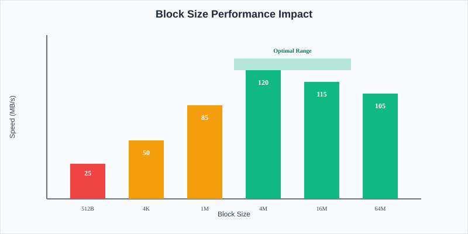

import Button from "@components/widgets/Button.astro";
import Notice from "@components/widgets/Notice.astro";
import ListCheck from "@components/widgets/ListCheck.astro";
import Accordion from "@components/widgets/Accordion.astro";

The `dd` command is a powerful but dangerous tool in Linux. Called "disk duplicator" or "data destroyer" because it can overwrite entire disks with no undo, `dd` handles disk imaging, cloning, and low-level data operations.

I use `dd` on my home server for creating exact disk images before upgrades, cloning drives, and preparing bootable media. Whether managing a [home server](https://www.bitdoze.com/why-need-home-server/) or enterprise systems, understanding `dd` helps with data management and disaster recovery.

One important positioning note: `dd` is for exact block-level copies, rescue imaging, and forensic work. It is not the right tool for routine file backups or live filesystems without snapshots. This guide covers when and how to use it safely.

## When to use dd (and when not to)

Before diving into commands, pick the right tool for the job. Here's the quick decision:

<ListCheck>

**Use dd when you need:**
- Exact disk or partition clones (byte-for-byte)
- Rescue imaging from failing drives (with ddrescue)
- Forensic disk copies that preserve every sector
- Bootable Linux USB drives from hybrid ISOs
- MBR/GPT partition table backup
- VM template images from bare metal
- Bare-metal migration between physical drives

</ListCheck>

<ListCheck>

**Use something else when you need:**
- Routine file backups (use restic, borg, or rsync)
- Live filesystem imaging (use LVM snapshots + dd, or provider snapshots)
- Bootable Windows USB (use Ventoy or WoeUSB, dd does not work)
- Cloud/VPS volume backups (use provider snapshots)
- Used-sector-only copies of mostly-empty partitions (use partclone)
- Fast verified flashing with hash checking (use bmaptool)

</ListCheck>

<Accordion label="Why not dd for daily backups?" group="faq">
Full raw images are disk-size even when 90% empty. A 500 GB disk with 50 GB of data still produces a 500 GB image (unless you use `conv=sparse`, which helps but doesn't deduplicate). Tools like restic and borg offer incremental backups, deduplication, encryption, and granular file restore. dd gives you none of that. It gives you an exact block-level copy, which is what you want for cloning and rescue, but overkill for daily backups.
</Accordion>

On [Hetzner Cloud](https://go.bitdoze.com/hetzner) or similar providers, snapshot backups are cheaper and more consistent than dd-ing inside the VM. Save dd for bare-metal, USB/SD cards, and rescue.

_VPS prices jumped across the board in 2026 — if you're rethinking a rented box, see [what changed and when a mini PC wins](/vps-price-increases/)._

## Prerequisites and safety setup

### Tools you need

- `dd` (GNU coreutils 9.x)
- `lsblk`, `fdisk -l`, `blkid` for device identification
- Optional but recommended: `ddrescue` (1.30), `pv` (1.11.0), `bmaptool`, `sgdisk`/`sfdisk`, `smartctl`, `zstd`

### Verify your dd

<Notice type="warning" title="Verify your dd: uutils risk">
Ubuntu 25.10 ships rust-coreutils (uutils) as the default, including a `dd` implementation that has reported `bs=`/`ibs=` divergence from GNU dd. On Ubuntu 25.10+, always verify you're running GNU coreutils:

```bash
dd --version
# Should show: "dd (coreutils) 9.x"
# If it shows "dd (uutils)" or similar, you have the Rust version

dpkg -l coreutils
```

If you're on uutils-dd and hit unexpected behavior, try passing `ibs=` explicitly, or reinstall GNU coreutils: `sudo apt install coreutils`.
</Notice>

### Pre-flight checklist

<ListCheck>

- **Identify devices with persistent names**: `lsblk -o NAME,SIZE,MODEL,SERIAL,MOUNTPOINT`. Prefer `/dev/disk/by-id/...` over `/dev/sda`. Device letters change between boots
- **Unmount target devices**: `mount | grep /dev/sdX`. Never dd to a mounted device
- **Check drive health**: `sudo smartctl -a /dev/sdX` for SMART status before reading from a suspect drive
- **Have backups** of any data you can't afford to lose
- **Test commands** on non-critical systems or loopback files first
- **Verify free space**: make sure the destination (for images) has enough room

</ListCheck>

This pairs well with [LVM setups](https://www.bitdoze.com/add-new-drive-lvm/) where you can use snapshots for consistent backups of running systems.

## Essential dd parameters

### Parameter reference table

| Parameter | Description | Example |
|-----------|-------------|---------|
| `if=` | Input file (source) | `if=/dev/sda` |
| `of=` | Output file (destination) | `of=/backup/disk.img` |
| `bs=` | Block size | `bs=4M` (4 megabytes) |
| `count=` | Number of blocks to copy | `count=1000` |
| `skip=` | Skip blocks at start of input | `skip=100` |
| `seek=` | Skip blocks at start of output | `seek=50` |
| `conv=` | Conversion options | `conv=sync,noerror` |
| `status=` | Progress display | `status=progress` |
| `iflag=` | Input flags | `iflag=fullblock,direct` |
| `oflag=` | Output flags | `oflag=direct,nocache` |

<Notice type="error" title="Danger: data destruction risk">
The dd command can permanently destroy data if used incorrectly. Always double-check your `if=` (input) and `of=` (output) parameters. There is no undo. Use `/dev/disk/by-id/...` persistent names to avoid targeting the wrong device.
</Notice>

### Choosing block size

<Notice type="info" title="Block size myth">
The GNU coreutils manual says block sizes above a few MB are "generally wasteful." The optimal size depends on your actual hardware, not a table you read on the internet. Start with `bs=4M` as a safe default, then benchmark:

```bash
for bs in 1M 4M 8M 16M 64M; do
  echo "== bs=$bs =="
  dd if=/dev/zero of=/tmp/bench bs=$bs count=512 oflag=direct 2>&1 | tail -1
  rm /tmp/bench
done
```

`oflag=direct` bypasses the page cache so you measure actual disk throughput, not cached writes. The winner depends on your drive, controller, and kernel I/O scheduler.
</Notice>



*Illustrative. Your results will vary by hardware. Always benchmark locally before assuming bigger = faster.*

## Disk imaging (create, compress, restore)

### Creating disk images

```bash
# Create image of entire disk
sudo dd if=/dev/sda of=/backup/disk.img bs=4M status=progress

# Create image of specific partition
sudo dd if=/dev/sda1 of=/backup/part.img bs=4M status=progress

# Create sparse image (skips zero-filled blocks, huge space saver on mostly-empty disks)
sudo dd if=/dev/sda of=/backup/disk.img bs=4M conv=sparse status=progress
```

<Notice type="info" title="Sparse images">
`conv=sparse` tells dd to seek over zero-filled blocks instead of writing them to the output file. A 500 GB disk that's 90% empty might produce a 60 GB image instead of 500 GB. Do NOT use `conv=sparse` when restoring. You need every zero written back to the device for the filesystem to be correct.
</Notice>

### Compressing images

```bash
# gzip (widely available)
sudo dd if=/dev/sda bs=4M status=progress | gzip > /backup/disk.img.gz

# zstd (better ratio, ~60% faster decompression than pigz, use this)
sudo dd if=/dev/sda bs=4M status=progress | zstd -T0 > /backup/disk.img.zst
```

zstd with `-T0` uses all available CPU threads. The decompression speed advantage is significant for restore operations where you're waiting on the pipe.

### Restoring from images

```bash
# Restore complete disk from image
sudo dd if=/backup/disk.img of=/dev/sda bs=4M status=progress

# Restore from gzip-compressed image
gunzip -c /backup/disk.img.gz | sudo dd of=/dev/sda bs=4M iflag=fullblock conv=fsync status=progress

# Restore from zstd-compressed image
zstdcat /backup/disk.img.zst | sudo dd of=/dev/sda bs=4M iflag=fullblock conv=fsync status=progress

# Restore specific partition
sudo dd if=/backup/part.img of=/dev/sda1 bs=4M iflag=fullblock conv=fsync status=progress
```

Notice the `iflag=fullblock` and `conv=fsync` flags on the restore-from-pipe commands. `iflag=fullblock` prevents short reads from the pipe (which corrupts the output). `conv=fsync` ensures data is physically flushed to disk before dd exits, better than a trailing `sync` that you might forget.

### Time estimates

Plan maintenance windows for large operations. Rough numbers:

| Source | Size | Speed | Time |
|--------|------|-------|------|
| HDD | 2 TB | ~150 MB/s | ~3.7 hours |
| NVMe | 1 TB | ~1 GB/s | ~33 min |
| SSD | 500 GB | ~500 MB/s | ~17 min |

Use `status=progress` to monitor throughput and estimate remaining time. Compression adds CPU time but saves storage and network transfer time for the image.

## Disk cloning

### Direct disk-to-disk cloning

```bash
# Clone entire disk
sudo dd if=/dev/sda of=/dev/sdb bs=4M status=progress

# Clone with persistent device names (safer, /dev/sdX can change between boots)
sudo dd if=/dev/disk/by-id/ata-Samsung_SSD_860_EVO_500GB_S3Z9NB0K of=/dev/disk/by-id/ata-WDC_WD10EZEX_WD-WMC1T0123456 bs=4M status=progress

# Verify clone (reads entire disk twice, slow but correct)
sudo cmp /dev/sda /dev/sdb
```

After a clone, run `sync` to flush pending writes, then verify with `cmp` if the data is critical. `cmp` reads both disks completely, so expect it to take as long as the clone itself.

### Partition table backup and restore

<Notice type="warning" title="MBR vs GPT">
`dd if=/dev/sda of=/dev/sdb bs=512 count=1` only copies LBA 0, the MBR. If your disk uses GPT (most modern disks do), the partition table spans LBA 1-33 plus a backup at the end of the disk. Copying only the first 512 bytes gives you a broken protective MBR with none of the actual GPT data.
</Notice>

**MBR partition table (legacy):**

```bash
# Backup MBR (first 512 bytes)
sudo dd if=/dev/sda of=/backup/mbr.img bs=512 count=1

# Restore MBR
sudo dd if=/backup/mbr.img of=/dev/sda bs=512 count=1
```

**GPT partition table (use this for modern disks):**

```bash
# Backup GPT with sgdisk (binary format, includes backup GPT)
sudo sgdisk --backup=/backup/gpt-sda.bin /dev/sda

# Restore GPT to a different disk
sudo sgdisk --load-backup=/backup/gpt-sda.bin /dev/sdb

# Alternative: text dump with sfdisk (human-readable, editable)
sudo sfdisk -d /dev/sda > /backup/sda.parts

# Restore to another disk
sudo sfdisk /dev/sdb < /backup/sda.parts
```

### Consistent backups of running systems

<Notice type="error" title="Never dd a live mounted filesystem">
dd'ing a mounted, active disk produces inconsistent images. Files, journal, and metadata are read at different times and can disagree. Running `sync` before dd does NOT fix this. dd reads through the page cache, not a frozen snapshot. The result may be unbootable, corrupt, or subtly broken in ways you won't notice until you try to restore.
</Notice>

**LVM snapshot approach** (the correct way — see [Add a New Drive with LVM](https://www.bitdoze.com/add-new-drive-lvm/) for LVM setup):

```bash
# Create a snapshot (size the COW area vs. expected write rate during backup)
lvcreate -L 20G -s -n root-snap /dev/vg0/root

# Image the frozen snapshot (not the live volume)
sudo dd if=/dev/vg0/root-snap of=/srv/backups/root-$(date +%F).img bs=4M status=progress

# Clean up the snapshot
lvremove -f /dev/vg0/root-snap
```

**Important**: size the snapshot COW area relative to expected writes during the backup window. If the COW area fills, the snapshot is silently destroyed ([SystemRescue LVM guide](https://www.system-rescue.org/lvm-guide-en/Making-consistent-backups-with-LVM/)). For a 20 GB snapshot on a quiet server, this is rarely an issue. For a busy database server, size up.

**`fsfreeze` approach** for non-LVM setups (short quiesce window):

```bash
# Freeze the filesystem (blocks all writes)
sudo fsfreeze -f /mnt/data

# Image while frozen
sudo dd if=/dev/sda1 of=/srv/backups/data-$(date +%F).img bs=4M status=progress

# Unfreeze immediately after dd finishes
sudo fsfreeze -u /mnt/data
```

For databases running on the box (PostgreSQL, MySQL, etc.), block-level dd is still not application-consistent. Pair with app-level dumps (`pg_dump`, `pg_basebackup`, `mysqldump`) for reliable restores.

## Creating bootable media

### Linux ISO to USB

```bash
# Create bootable USB from Linux ISO
sudo dd if=/path/to/linux.iso of=/dev/sdX bs=4M status=progress && sync
```

Linux ISOs are hybrid images — they work as both optical media and USB boot. `dd` handles this correctly.

### Windows ISO to USB

<Notice type="error" title="dd does not work for Windows ISOs">
Windows 10/11 ISOs are not hybrid images. dd-ing them to USB typically produces a stick that boots into the installer but then "can't find any drives" (missing partition table/boot code). Additionally, `install.wim` is often > 4 GB, which breaks FAT32 boot media. Use one of these instead:
</Notice>

```bash
# Ventoy — install once, then just copy ISOs to the USB stick
sudo ventoy -i /dev/sdX
# Then copy any ISOs: cp /path/to/Win11.iso /dev/sdX1/

# WoeUSB — creates a proper Windows bootable USB
sudo woeusb --target-filesystem NTFS --device /path/to/Win11.iso /dev/sdX

# Rufus (from Windows or another OS) also works well
```

### Bootable media verification

The old trick of `dd if=/dev/sdX bs=4M count=1 | md5sum` only checks the first 4 MiB of the USB — it verifies nothing meaningful about the rest of the image. Here's how to verify properly:

```bash
# Full-image hash comparison (correct but slow — reads entire disk)
sha256sum /path/to/linux.iso
sudo dd if=/dev/sdX bs=4M status=progress | sha256sum

# Or use bmaptool which verifies SHA256 while flashing (see alternatives section)
bmaptool create disk.img -o disk.img.bmap
sudo bmaptool copy /backup/disk.img.gz /dev/sdX
```

## Secure erasure

### HDD erasure (NIST 800-88 "Clear")

A single-pass zero fill is sufficient per NIST SP 800-88 Rev. 1 for modern hard drives:

```bash
# Single-pass zero fill (NIST "Clear" — sufficient for modern HDDs)
sudo dd if=/dev/zero of=/dev/sda bs=4M status=progress conv=fsync

# Verify
sudo hexdump -C /dev/sda | head -20
```

### SSD and NVMe erasure

<Notice type="warning" title="Do not use dd on SSDs">
Overwriting SSDs with dd is ineffective and harmful. Wear leveling and over-provisioning mean dd writes don't reliably reach all cells. You add unnecessary write wear without actually erasing the data. Use firmware-level erase commands instead.
</Notice>

```bash
# SATA SSD — secure discard
sudo blkdiscard -s /dev/sda

# NVMe — user data erase
sudo nvme format --ses=1 /dev/nvme0n1

# ATA Secure Erase (SATA drives)
sudo hdparm --user-master u --security-set-pass p /dev/sdX
sudo hdparm --security-erase p /dev/sdX
```

### LUKS crypto-erase (instant)

If the drive is LUKS-encrypted, deleting the key is instant and is a legitimate NIST 800-88 Purge method:

```bash
# Destroy all key slots — data is permanently inaccessible
sudo cryptsetup luksErase /dev/sda2
```

This is much faster and more reliable than overwriting for encrypted drives. The data is still physically on disk but cryptographically irretrievable.

<Accordion label="Why not the DoD 5220.22-M 3-pass wipe?" group="faq">
The DoD 5220.22-M standard is deprecated. It was written for 1990s magnetic media and has no relevance to modern drives. Multiple overwrite passes on modern HDDs add wear without adding security (a single pass with verification is sufficient per NIST 800-88). On SSDs, overwrites don't reliably reach all cells regardless of how many passes you run. Current standards are NIST SP 800-88 Rev. 1 and IEEE 2883 — use those instead.
</Accordion>

## Advanced dd techniques

### Modern dd flags

These flags are all documented in the [GNU coreutils 9.11 manual](https://www.gnu.org/software/coreutils/manual/html_node/dd-invocation.html):

```bash
# conv=sparse — skip zero-filled blocks on output (saves space on mostly-empty disks)
sudo dd if=/dev/sda of=/backup/disk.img bs=4M conv=sparse status=progress
# Do NOT use conv=sparse when restoring to a device

# iflag=fullblock — fill incomplete reads to full block size (critical for pipes)
# Used automatically when reading from pipes with count=
gunzip -c /backup/disk.img.gz | sudo dd of=/dev/sdb bs=4M iflag=fullblock

# conv=fsync — fsync output before dd exits (ensures data hits physical disk)
sudo dd if=/backup/disk.img of=/dev/sda bs=4M conv=fsync status=progress

# oflag=direct — bypass page cache (useful for benchmarking and raw device writes)
dd if=/dev/zero of=/tmp/benchmark bs=4M count=1024 oflag=direct

# oflag=nocache — drop page cache after writing (coreutils 9.7+ improved detection)
sudo dd if=/dev/sda of=/backup/disk.img bs=4M oflag=nocache status=progress
```

<Notice type="info" title="SIGUSR1 progress signal">
On Linux, GNU dd responds to `SIGUSR1` to print current progress:

```bash
sudo dd if=/dev/sda of=/backup/disk.img bs=4M &
# In another terminal:
sudo kill -USR1 $(pidof dd)
```

Caveat: if `POSIXLY_CORRECT` is set, dd expects `SIGINFO` instead of `SIGUSR1`. On most Linux systems `SIGUSR1` works fine. When sending signals during a pipe-based operation, use `iflag=fullblock` to avoid short reads.
</Notice>

### Pipes and compression

```bash
# Compressed image on-the-fly with zstd
sudo dd if=/dev/sda bs=4M status=progress | zstd -T0 > /backup/disk.img.zst

# Compressed image on-the-fly with gzip
sudo dd if=/dev/sda bs=4M status=progress | gzip -c > /backup/disk.img.gz

# Network transfer with compression
sudo dd if=/dev/sda bs=4M status=progress | zstd -T0 | ssh user@remote 'cat > /backup/remote.img.zst'

# With progress monitoring via pv (pipe viewer v1.11.0)
sudo dd if=/dev/sda bs=4M | pv -s $(sudo blockdev --getsize64 /dev/sda) | zstd -T0 > /backup/disk.img.zst
```

### Error recovery

```bash
# Continue copying despite read errors
sudo dd conv=noerror,sync iflag=fullblock if=/dev/sda1 of=/backup/rescue.img

# Use ddrescue for better error handling (almost always the right choice for failing drives)
sudo ddrescue -d -r3 /dev/sda /backup/image.img /backup/rescue.log
```

### Creating test files and benchmarking

```bash
# Create file with random data for testing
dd if=/dev/urandom of=/tmp/test-1gb.dat bs=1M count=1024

# Create file with zeros (faster, compressible)
dd if=/dev/zero of=/tmp/test-1gb-zeros.dat bs=1M count=1024

# Create sparse file (doesn't use actual disk space)
dd if=/dev/zero of=/tmp/sparse.dat bs=1M count=1024 seek=1024

# Benchmark disk write speed
dd if=/dev/zero of=/tmp/benchmark bs=1M count=1024 oflag=direct
rm /tmp/benchmark
```

## Monitoring and progress

### Built-in progress

```bash
# status=progress shows throughput and bytes transferred
sudo dd if=/dev/sda of=/backup/image.img bs=4M status=progress

# Manual signal for progress (background dd)
sudo dd if=/dev/sda of=/backup/image.img bs=4M &
# In another terminal:
sudo kill -USR1 $(pidof dd)

# Continuous monitoring with watch
watch -n 1 'sudo kill -USR1 $(pidof dd) 2>/dev/null'
```

### Enhanced monitoring with pv and iostat

```bash
# Using pv (pipe viewer) for better progress display
sudo dd if=/dev/sda bs=4M | pv -s $(sudo blockdev --getsize64 /dev/sda) | dd of=/backup/image.img bs=4M

# Monitor disk I/O during operation
iostat -x 1 /dev/sda
```

### Estimating remaining time

`status=progress` shows bytes transferred and throughput. To estimate remaining time:

```
remaining_time = (total_bytes - bytes_transferred) / current_speed
```

Get total disk size with `sudo blockdev --getsize64 /dev/sda`. For large operations (multi-TB), plan maintenance windows and consider whether compression helps (saves disk and network time but adds CPU time).

## Troubleshooting

### Input/output errors

<Notice type="error" title="Common error: Input/output error">
This typically indicates bad sectors on the source drive or hardware issues (bad cable, failing controller).
</Notice>

**Solutions:**

<ListCheck>

- **Use `conv=noerror,sync` with `iflag=fullblock`**: Continues copying despite errors, fills failed blocks with zeros
- **Check drive health**: Run `sudo smartctl -a /dev/sda` to check SMART status and reallocated sector count
- **Use ddrescue**: Better error recovery than standard dd — it maps, retries, and rescues in a structured way
- **Reduce block size**: Smaller blocks may skip over bad sectors more gracefully
</ListCheck>

```bash
# Check drive health
sudo smartctl -a /dev/sda

# Error-tolerant copying with dd
sudo dd if=/dev/sda of=/backup/image.img bs=4M conv=noerror,sync iflag=fullblock status=progress

# Better error recovery with ddrescue (1.30)
sudo ddrescue -d -r3 /dev/sda /backup/image.img /backup/rescue.log
```

### Permission and access issues

```bash
# Check if device is mounted
lsblk | grep sda
mount | grep sda

# Unmount if necessary
sudo umount /dev/sda1

# Ensure proper permissions (usually requires root)
sudo dd if=/dev/sda of=/backup/image.img bs=4M status=progress
```

### Inconsistent or unbootable restored images

**Cause**: dd'ed a live mounted filesystem — journal, metadata, and file data disagree.

**Fix**: Use LVM snapshots or `fsfreeze` before dd (see the consistent backups section above).

**Cause**: Partition table mismatch (MBR image restored to GPT disk, or vice versa).

**Fix**: Verify with `fdisk -l` or `gdisk -l` before and after the operation. Use `sgdisk`/`sfdisk` to restore partition tables correctly.

### uutils-dd divergence

On Ubuntu 25.10+, if dd behaves unexpectedly (wrong block sizes, surprising errors), check your version:

```bash
dd --version
# If it shows uutils, install GNU coreutils:
sudo apt install coreutils
```

## Alternative tools and when to use them

| Tool | Best For | Advantages |
|------|----------|------------|
| **rsync** | File-level sync | Incremental, network-aware, preserves permissions |
| **cp / tar** | Simple copy / archives | Preserves permissions; compression and selective restore |
| **ddrescue** | Damaged drives | Superior error recovery, dead-head recovery (v1.30) |
| **bmaptool** | Fast verified flashing | 5-7x faster than dd, SHA256 on write, refuses mounted targets |
| **Clonezilla** | GUI disk cloning | User-friendly, compression (v3.3.3-15) |
| **partclone** | Partition-aware cloning | Only copies used sectors — much smaller images |
| **Ventoy / WoeUSB** | Multi-ISO / Windows USB | dd fails for Windows ISOs |
| **restic / borg** | Routine file backups | Dedup + encryption; not block-level |
| **Provider snapshots** | Cloud/VPS volumes | Consistent, no local storage needed, cheap |

### ddrescue deep dive

Install: `sudo apt install gddrescue` (note: this is GNU ddrescue, not `dd_rescue` — Kurt Garloff's different tool).

```bash
# Basic rescue operation
sudo ddrescue -d -r3 /dev/sda /backup/image.img /backup/rescue.log

# New in ddrescue 1.29.1: treat known garbage as read errors
# (for drives that return fake data instead of erroring)
sudo ddrescue --bad-sector-data=/tmp/garbage.bin /dev/sda /backup/image.img /backup/rescue.log

# New in ddrescue 1.30: dead-head recovery is orders of magnitude better
# (283 errors vs 3,782,794 in testing with a 4-head drive and one dead head)
# Also: --no-sweep, --size=output for --force overwrite, underscore numbers in args
sudo ddrescue -d -r3 --no-sweep /dev/sda /backup/image.img /backup/rescue.log
```

ddrescue 1.30 (2026-01-04) added a pass-5 sweeping phase and dramatically improved dead-head recovery. If you're rescuing failing drives, upgrade to 1.30.

### bmaptool deep dive

bmaptool from the Yocto project only writes mapped blocks and verifies SHA256 during the write. It's 5-7x faster than dd for sparse images:

```bash
# Create a block map from your image
bmaptool create disk.img -o disk.img.bmap

# Flash with verification (refuses to write to mounted devices)
sudo bmaptool copy /backup/disk.img.gz /dev/sdX
```

### Cloud/VPS provider snapshots

On virtual block storage, prefer provider snapshots over dd-ing inside the VM. Most cloud providers like [Hetzner](https://go.bitdoze.com/hetzner), [DigitalOcean](https://go.bitdoze.com/do), and Vultr offer built-in snapshot functionality that's more reliable than dd. Snapshots are consistent (quiesced), don't require local storage, and don't double-bill storage.

dd remains right for: bare-metal clones, USB/SD cards, VM template images, and rescue operations.

## Best practices summary

### Pre-operation checklist

<ListCheck>

- **Identify devices correctly** using `lsblk -o NAME,SIZE,MODEL,SERIAL,MOUNTPOINT`
- **Use persistent names** `/dev/disk/by-id/...` instead of `/dev/sda`
- **Unmount all partitions** on target devices
- **Check available disk space** for image files
- **Check drive health** with `smartctl` on suspect drives
- **Test on non-critical data** first
- **Document the procedure** for repeatability

</ListCheck>

### Performance tips

| Scenario | Recommended Settings | Notes |
|----------|---------------------|-------|
| **General default** | `bs=4M`, `status=progress` | Safe starting point for most operations |
| **Raw device writes** | `oflag=direct` | Bypasses page cache for true throughput measurement |
| **Restore from image** | `conv=fsync`, `iflag=fullblock` | Ensures data hits disk; prevents short reads from pipes |
| **Forensic imaging** | `bs=512`, `conv=noerror,sync` | Preserves exact structure, sector-by-sector |
| **Benchmark** | `oflag=direct`, varying `bs` | Test different block sizes on your actual hardware |

### Security summary

- **HDD**: Single-pass zero fill per NIST 800-88 "Clear"
- **SSD/NVMe**: Firmware erase (`blkdiscard`, `nvme format`, ATA Secure Erase) — never dd
- **LUKS**: Crypto-erase (`cryptsetup luksErase`) — instant and reliable

See the [secure erasure section](#secure-erasure) for specific commands.

## Real-world use cases

### Home server backup script

This version uses LVM snapshots for consistency (unlike dd'ing a live mounted disk):

```bash
#!/bin/bash
# lvm-snapshot-backup.sh — consistent backup via LVM snapshot
DATE=$(date +%Y%m%d_%H%M%S)
BACKUP_DIR="/srv/backups/disk-images"
LOG_FILE="/var/log/disk-backup.log"
SNAP_SIZE="20G"
SNAP_NAME="root-snap"

mkdir -p "$BACKUP_DIR"

echo "$(date): Creating LVM snapshot" >> "$LOG_FILE"
lvcreate -L "$SNAP_SIZE" -s -n "$SNAP_NAME" /dev/vg0/root >> "$LOG_FILE" 2>&1

if [ $? -eq 0 ]; then
    echo "$(date): Starting snapshot backup" >> "$LOG_FILE"
    sudo dd if="/dev/vg0/$SNAP_NAME" of="$BACKUP_DIR/system-backup-$DATE.img" bs=4M iflag=fullblock conv=fsync status=progress 2>> "$LOG_FILE"

    if [ $? -eq 0 ]; then
        echo "$(date): Backup completed, compressing with zstd" >> "$LOG_FILE"
        zstd --rm "$BACKUP_DIR/system-backup-$DATE.img"
    else
        echo "$(date): Backup failed!" >> "$LOG_FILE"
    fi

    # Clean up snapshot
    lvremove -f "/dev/vg0/$SNAP_NAME" >> "$LOG_FILE" 2>&1

    # Retention: keep 7 days of compressed backups
    find "$BACKUP_DIR" -name "*.img.zst" -mtime +7 -delete
else
    echo "$(date): Snapshot creation failed!" >> "$LOG_FILE"
    exit 1
fi
```

This pairs well with [LVM setups](https://www.bitdoze.com/add-new-drive-lvm/).

### Disaster recovery

```bash
# Emergency system restore from image
sudo dd if=/backup/system-backup.img of=/dev/sda bs=4M iflag=fullblock conv=fsync status=progress

# Restore from network (zstd-compressed)
ssh backup-server 'cat /backup/system.img.zst' | zstdcat | sudo dd of=/dev/sda bs=4M iflag=fullblock conv=fsync status=progress

# Quick MBR repair from backup
sudo dd if=/backup/mbr.img of=/dev/sda bs=512 count=1

# GPT repair from backup
sudo sgdisk --load-backup=/backup/gpt-sda.bin /dev/sda
```

### VM template creation

```bash
# Create base image for VM templates
sudo dd if=/dev/sda of=/vm-images/template.img bs=4M status=progress

# Compress for storage
zstd /vm-images/template.img
```

For cloud VMs on [Hetzner](https://go.bitdoze.com/hetzner) or similar providers, consider using provider snapshot APIs instead of dd-based templates — they're faster and don't require local storage.

## FAQ

<Accordion label="Can I use dd to clone a running system?" group="faq">
No, not safely. dd'ing a live mounted filesystem produces inconsistent images because files, journal, and metadata are read at different times. Use LVM snapshots (create snapshot → dd the snapshot → remove snapshot) or `fsfreeze` to quiesce the filesystem first. See the consistent backups section for commands.
</Accordion>

<Accordion label="What block size should I use?" group="faq">
Start with `bs=4M` as a safe default. The GNU coreutils manual says sizes above a few MB are "generally wasteful." The optimal size depends on your actual hardware. Benchmark with the loop in the block size section — don't trust generic tables.
</Accordion>

<Accordion label="Is dd secure enough for wiping SSDs?" group="faq">
No. Overwrites on SSDs don't reliably reach all cells due to wear leveling and over-provisioning. Use firmware-level erase: `blkdiscard -s` for SATA SSDs, `nvme format --ses=1` for NVMe, or ATA Secure Erase via `hdparm`. If the drive is LUKS-encrypted, `cryptsetup luksErase` is instant and cryptographically sufficient.
</Accordion>

<Accordion label="dd vs rsync — which should I use?" group="faq">
dd for exact block copies: cloning, rescue, forensic images, bootable media. rsync for file-level sync, incremental backups, and network transfers where you want to copy only changed files. They solve different problems. For daily backups, rsync (or restic/borg) is almost always the right choice.
</Accordion>

<Accordion label="How do I verify a dd image is correct?" group="faq">
Compare `sha256sum` of the source device against the image file. Or use `cmp` to compare two block devices directly. Note: `cmp` and full-disk hashing both read the entire device, so expect it to take as long as the copy. `sync` after dd is a flush, not a verification. For USB flashing, bmaptool verifies SHA256 while writing — much better than dd + post-hoc check.
</Accordion>

<Accordion label="Why does my dd-created Windows USB not work?" group="faq">
Windows ISOs are not hybrid images like Linux ISOs. dd produces a USB that boots into the installer but can't find drives (missing partition table/boot code), and `install.wim` often exceeds 4 GB, breaking FAT32. Use Ventoy (install once, drop ISOs on) or WoeUSB instead.
</Accordion>

## Conclusion

`dd` is an essential tool for the operator who needs exact block-level copies — disk cloning, rescue imaging, forensic work, bootable media, and partition table backups. It's not a Swiss Army knife for every data task.

The operator who knows when NOT to use dd (routine backups, live systems, SSD erasure, Windows USB) is more effective than one who uses it for everything. Use persistent device names (`/dev/disk/by-id/...`), verify device identities before every operation, and use snapshots for consistent backups of running systems.

For more Linux administration guides, explore the rest of the site:

<Button text="Explore More Linux Guides" link="/linux/" size="lg" color="blue" variant="solid" />
