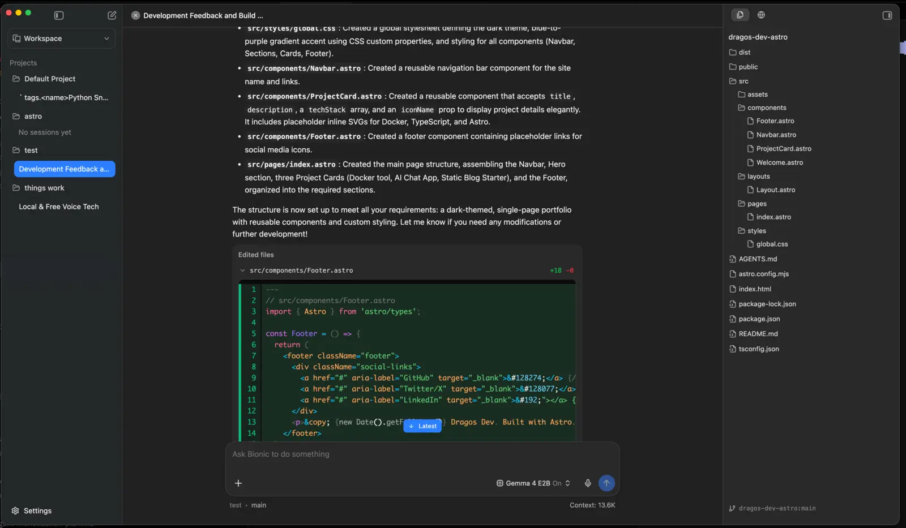

import YouTubeEmbed from "@components/widgets/YouTubeEmbed.astro";
import Button from "@components/widgets/Button.astro";
import Notice from "@components/widgets/Notice.astro";
import ListCheck from "@components/widgets/ListCheck.astro";
import Accordion from "@components/widgets/Accordion.astro";

[LM Studio](https://lmstudio.ai/) just shipped **Bionic**, a separate desktop app built as an AI agent for open models. Think Codex-style coding agent and cloud co-work tools, but aimed at local LLMs first, with optional Secure Cloud models when you need more power.

I tested it on an **M4 Pro Mac Mini with 24 GB RAM**, using small MLX models for speed, plus vision, file analysis, and Voxtral voice. This is an early product. The idea is strong. Real coding quality still depends almost entirely on which model you load.

<YouTubeEmbed url="https://youtu.be/9Pm_DnTRJZM" label="LM Studio Bionic hands-on on M4 Pro Mac Mini" />

Official announcement: [Introducing LM Studio Bionic](https://lmstudio.ai/blog/introducing-lm-studio-bionic).

If you already use terminal agents, compare this with the [OpenCode setup guide](/opencode-setup-guide/), [Codex app with any model](/codex-app-any-model/), and the [GitHub Copilot alternatives](/github-copilot-alternatives-2026/) roundup.

## What is LM Studio Bionic?

Bionic is not a redesign of the classic LM Studio chat UI. It is a **new app** for agent work:

- **Code projects** for repo-aware coding, file edits, shell commands, and review
- **Work projects** for docs, PDFs, notes, image understanding, and general tasks
- **Local models** through the LM Studio runtime (GGUF, MLX on Apple Silicon)
- **Secure Cloud** frontier open models with zero data retention by default
- **Voice input** with local transcription (Voxtral by Mistral at launch)
- **MCP / connected apps** (Notion and other servers) for tools beyond the filesystem

LM Studio still exists for low-level model management. Bionic is the agent layer on top.

<Notice type="info" title="Privacy pitch">
LM Studio says Bionic has zero data retention and does not train on your data. Local inference never leaves your machine. Cloud calls are processed transiently. Web search and some cloud features require their plan.
</Notice>

## Platforms and install

Bionic is available for **macOS, Windows, and Linux**. Download from [lmstudio.ai](https://lmstudio.ai/).

On Mac, install is a normal app download. After launch you get:

1. Workspaces / projects list
2. Model library and loaded instances
3. Settings (general, updates, web search, appearance, voice, linked devices)
4. Code vs Work project creation flow

Linked devices were waitlisted at the time of testing.

## Code vs Work workspaces

This split matters.

### Code workspace

Create a Code project, name it, pick a model, then attach a local folder (for example an Astro site).

In the Code UI you typically get:

- Chat / agent timeline with reasoning
- File tree on the side
- In-app browser / previews
- Context usage meter
- Activity / tool call view while the agent writes and runs commands

Officially, Bionic is meant to inspect repos, edit code, show diffs, and search the codebase. In practice, polish still lags mature tools like the [Codex app](/codex-app-any-model/) or [OpenCode](/opencode-setup-guide/).

### Work workspace

Work projects skip the "open a coding folder" requirement. You can attach external files and folders later.

Good fits:

- Image Q&A
- Transcripts and notes
- PDFs and docs
- Lightweight research with local files
- Voice-first chat

This is closer to a private co-worker than a full IDE agent.

## Hands-on: M4 Pro Mac Mini, 24 GB RAM

### Hardware and model choice

I used **MLX models** on Apple Silicon and started with a small, fast model:

| Setting | Value |
| --- | --- |
| Machine | Mac Mini M4 Pro, 24 GB unified memory |
| Format | MLX |
| Test model | Gemma 4 E2B (~4 GB, tools + vision + reasoning) |
| Context | Maxed for the small model |
| Voice model | Voxtral (~3 GB) |
| Peak memory observed | ~20 GB while agent + recording + model loaded |

Why a tiny model first? On 24 GB, big coding models plus long context fill RAM fast. A 2B-class model answers the real product question: is Bionic usable, or only impressive with huge cloud weights?

### Coding test: portfolio site in Astro

I created a Code workspace pointed at an Astro project and asked for a multi-section portfolio with components and SVGs.

What worked:

- Agent loop started, reasoned, and created files
- Context meter was visible (for example ~8K used of a large max window)
- Tool/activity view showed what it was doing
- Build commands could be attempted from the agent

What did not work well with the small model:

- Incomplete Astro component wiring (missing imports / page composition)
- Weak framework knowledge (Astro specifics)
- No clear modified-file highlighting like a mature IDE agent
- Limited editor experience (view more than edit)
- Some shell/file write attempts failed or fell back to dumping full file content in chat
- Speed was slower than expected for a 2B model on M4 Pro once thinking and tools kicked in

When I asked it to fall back to a static `index.html`, it still struggled with clean file creation and speed. The output was "chat-usable," not "ship-this-site."

<Notice type="warning" title="Model quality is the bottleneck">
Bionic can orchestrate tools, but a 2B local model is not a Codex replacement for multi-file web frameworks. For serious local coding, use a stronger model tier (see recommendations below). For Astro work specifically, terminal agents with better models still win today.
</Notice>

### Work test: vision and files

In a Work workspace, the same small vision-capable model:

- Described an uploaded image quickly and accurately
- Could attach external files and folders for context
- Read a video transcript once the path was available to the agent

That side felt more practical on limited hardware. Document and image tasks need less multi-step code correctness than repo edits.

### Voice with Voxtral

Voice is one of the strongest early features. Bionic ships local transcription with **Voxtral** (Mistral). Plan for roughly **3 GB** extra model weight.

In testing:

- Listening / transcription felt fast after the model loaded
- Useful for dictating prompts without leaving the app
- Memory pressure rises again when voice + main LLM are both resident

If you mainly want system-wide Mac dictation rather than an agent keyboard, also look at [FluidVoice](/fluidvoice-mac-dictation/).

### MCP and connected apps

Under connected apps you can wire external tools and **MCP servers** (for example Notion). That is the right direction for a desktop agent: local model + tools + your data sources.

If MCP is new to you, start with the [MCP beginners guide](/mcp-introduction-beginners/).

## Settings worth knowing

| Area | Notes |
| --- | --- |
| Model library | Download local models, prefer MLX on Apple Silicon |
| Context size | Increase carefully; RAM fills with context + model + tools |
| Temperature / system prompt | Per-model knobs still matter for agents |
| Web search | Cloud-plan feature in the current build |
| Voice | Enable Voxtral when you need dictation |
| Linked devices | Waitlist during early release |
| Loaded instances | Shows RAM use (for example ~4.3 GB for a small tools+vision model) |

## Model recommendations for Bionic (2026)

Bionic is only as good as the model. Use recent open models, not year-old 7B chat fine-tunes.

### Local on ~24 GB Mac (MLX)

| Goal | Model direction | Why |
| --- | --- | --- |
| Fast UI testing | Small Gemma 4 / similar ~2B–4B tools model | Instant feel-check of Bionic itself |
| Better local coding | [Qwen 3.6 35B-A3B](/qwen36-ai-coding-agents/) or Qwen 3.6 27B | Strong coding for the size; MoE A3B is friendlier on unified memory |
| Vision + light agent | Gemma 4 class multimodal MLX builds | Image + tools without cloud |
| Voice | Voxtral (built-in path) | Local transcription |

On 24 GB, leave headroom for OS, browser, recording, and agent overhead. A "usable" coding model is often more valuable than the biggest model that barely loads.

### Stronger coding (local if you have RAM/VRAM, else cloud)

For agent coding quality closer to daily Codex/Claude work, use the current open coding stack covered in [best open source Claude alternatives](/best-open-source-llms-claude-alternative/):

- **GLM-5.2** — strongest overall open coding flagship right now
- **Qwen 3.6 Plus / Max** — excellent agent coding via API or OpenCode Go
- **MiniMax M3** — cheap long sessions
- **MiMo V2.5 Pro** — solid coding agent model
- **Kimi K2 / K2.x Code** — long context and coding (see [Kimi K2](/kimi-k2-ai-model/)); official Bionic materials also call out Kimi K2.7 Code for agent work

Bionic's Secure Cloud is useful when your laptop cannot host those weights. For API-style multi-model routing outside Bionic, [OpenCode Go](/opencode-go-plan/) and the [Codex any-model config](/codex-app-any-model/) remain strong options.

### Local stack alternatives

If you want pure local inference without Bionic's agent UI:

- [Ollama Docker install](/ollama-docker-install/) for a simple local server
- [OpenClaw + Ollama](/openclaw-ollama-local-models/) for a messaging/assistant workflow on local models
- [AI programming beginners guide](/ai-programming-beginners-guide/) if you are still choosing between chat apps, IDEs, and agents

## Bionic vs Codex vs OpenCode

| Feature | LM Studio Bionic | Codex app | OpenCode |
| --- | --- | --- | --- |
| Focus | Local-first open model agent | Polished coding agent UI | Open-source terminal agent |
| Local models | First-class | Possible via custom providers | Via Ollama / local endpoints |
| Cloud open models | Secure Cloud + optional plan features | ChatGPT plan + any OpenAI-compatible | Many providers + Go plan |
| Best today | Private local agent + docs/voice | Highest polish coding UX | Flexible CLI workflows |
| Weak today | Early UI, small-model coding quality | Local is not the default story | Less "desktop product" feel |

Honest take after the Mac Mini session: **Bionic is the right product shape for private open-model agents**, but it is early. For production coding this week, I still reach for Codex or OpenCode with a strong model. For private chat, vision, notes, and local experimentation, Bionic is already interesting.

## Pros and cons

### Pros

<ListCheck>
<ul>
<li>True local-first agent path for open models</li>
<li>Clear Code vs Work project split</li>
<li>MLX path on Apple Silicon</li>
<li>Local voice with Voxtral</li>
<li>MCP / connected apps direction</li>
<li>Optional Secure Cloud with zero data retention claim</li>
<li>Available on Mac, Windows, and Linux</li>
</ul>
</ListCheck>

### Cons

<ListCheck>
<ul>
<li>Early UX: file change visibility and editing still thin</li>
<li>Small local models struggle with real multi-file frameworks</li>
<li>RAM pressure is real on 24 GB once model + voice + agent run</li>
<li>Web search and some power features lean on cloud plan</li>
<li>Not yet as polished as Codex for day-to-day coding</li>
</ul>
</ListCheck>

## Who should try Bionic now?

**Try it if you:**

- Want a desktop agent that prefers local open models
- Care about privacy for notes, docs, and light coding
- Already run MLX/GGUF models and want an agent shell around them
- Need local voice dictation inside an AI workspace

**Wait or use something else if you:**

- Need reliable multi-file production coding today
- Only have 8–16 GB RAM and expect large coding models
- Prefer a mature terminal agent ([OpenCode](/opencode-setup-guide/)) or Codex UI ([any-model setup](/codex-app-any-model/))

## Getting started checklist

1. Download Bionic from [lmstudio.ai](https://lmstudio.ai/)
2. Install a model that fits your RAM (MLX on Mac)
3. Create a **Code** project for a simple folder first, not your monorepo
4. Create a **Work** project for docs/images
5. Optionally enable **Voxtral** voice if you have spare RAM
6. Add MCP apps only after basic chat/tools feel stable
7. For hard coding tasks, switch to a stronger local or Secure Cloud model

## FAQ

<Accordion label="Is LM Studio Bionic free?" group="faq" expanded="true">
Local models run on your machine. The app is free to download. Cloud models, web search, and plan-tied features can require an LM Studio account and billing. Always check current pricing on the official site.
</Accordion>

<Accordion label="Is Bionic the same as LM Studio?" group="faq">
No. Bionic is a separate agent app. Classic LM Studio remains useful for lower-level model management and chat. You can use both.
</Accordion>

<Accordion label="Can it replace Codex or Claude Code?" group="faq">
Not yet for serious multi-file work, especially with small local models. With stronger open coding models (GLM-5.2, Qwen 3.6, Kimi Code class), it becomes a realistic private alternative for many tasks. For max polish today, Codex/OpenCode still lead.
</Accordion>

<Accordion label="What Mac RAM do you need?" group="faq">
16 GB is the practical floor for light models. 24 GB worked for a small tools+vision model plus agent overhead, but memory sat near the top during testing. 32 GB+ is more comfortable if you want better coding models and voice at the same time.
</Accordion>

<Accordion label="Does it support MCP?" group="faq">
Yes. Connected apps / MCP servers are part of the product direction, so you can attach tools like Notion-style integrations. See our [MCP intro](/mcp-introduction-beginners/) for the protocol basics.
</Accordion>

## Final verdict

LM Studio Bionic is the biggest product step LM Studio has taken toward **doing work**, not only chatting with local models. Code and Work workspaces, local voice, MCP hooks, and optional Secure Cloud form a coherent local-first agent story.

On an M4 Pro 24 GB machine, the app itself is usable. A tiny Gemma-class model is fine for demos, vision, and light Work tasks, but not for shipping real Astro/React projects. Pair Bionic with a modern coding model (or Secure Cloud) and it becomes much more interesting.

Watch the full walkthrough here:

<YouTubeEmbed url="https://youtu.be/9Pm_DnTRJZM" label="LM Studio Bionic full video walkthrough" />

Next reads if you are building a local AI stack:

- [Best open source LLMs for coding](/best-open-source-llms-claude-alternative/)
- [Qwen 3.6 for coding agents](/qwen36-ai-coding-agents/)
- [OpenCode setup](/opencode-setup-guide/)
- [Codex app with any model](/codex-app-any-model/)
- [Ollama Docker install](/ollama-docker-install/)
- [FluidVoice Mac dictation](/fluidvoice-mac-dictation/)
