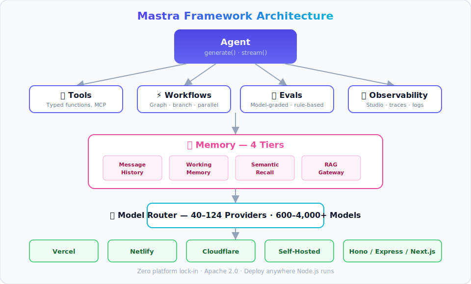
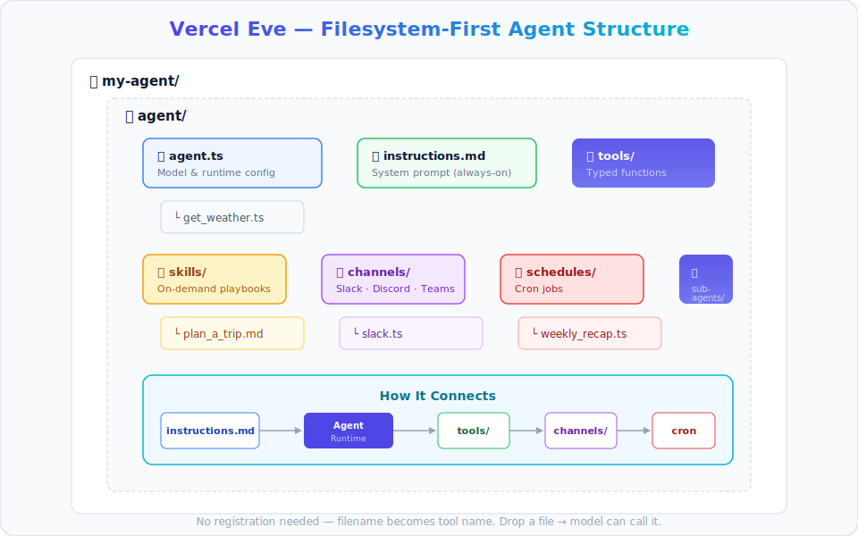

import Button from "@components/widgets/Button.astro";
import Notice from "@components/widgets/Notice.astro";
import ListCheck from "@components/widgets/ListCheck.astro";
import Accordion from "@components/widgets/Accordion.astro";
import Tabs from "@components/widgets/Tabs.astro";
import Tab from "@components/widgets/Tab.astro";

If you're building AI agents in TypeScript, two frameworks own the conversation in mid-2026: **Mastra** and **Vercel Eve**.

I already ship real work on Mastra. I built a full assistant with file tools, shell, web search, browser automation, and persistent memory, and wrote a [step-by-step Mastra guide](/build-ai-agent-mastra/) with the [code on GitHub](https://github.com/bitdoze/mastra-assistant). So this comparison is not theoretical on the Mastra side. Eve is the new option I wanted to evaluate honestly against that experience.

Mastra is the mature option. v1.0 shipped in January 2026, it has 26K+ GitHub stars, ~1.1M weekly NPM downloads, and runs in production at Replit (96% task success rate), PayPal, and Marsh McLennan. It's code-based, portable, and deploys anywhere Node.js runs.

Eve is the new contender from Vercel. Launched June 17, 2026 at the Vercel Ship conference, it takes a filesystem-first approach: your agent is a directory. Vercel runs 100+ agents internally on Eve, including a data-analysis agent handling 30K+ Slack queries per month.

The decision is mostly: **maximum portability, or maximum convenience on Vercel?**

This is a head-to-head on pricing, lock-in, maturity, and DX. If you already know Mastra from the [build guide](/build-ai-agent-mastra/), skip to the [head-to-head comparison](#mastra-vs-eve-head-to-head-on-key-decision-factors).

<Notice type="info" title="Who This Guide Is For">
TypeScript developers evaluating AI agent frameworks. Both Mastra and Eve are TypeScript-only. If you need Python, look at LangGraph, CrewAI, or Pydantic AI.
</Notice>

<Button text="Build a Mastra Agent (Tutorial)" link="/build-ai-agent-mastra/" variant="solid" color="purple" size="md" icon="arrow-right" />
<Button text="View My Mastra Assistant on GitHub" link="https://github.com/bitdoze/mastra-assistant" variant="outline" color="purple" size="md" icon="github" />

## At a glance: Mastra vs Eve comparison table

| Dimension | Mastra | Eve |
|---|---|---|
| **GitHub Stars** | ~26,197 | ~250 |
| **Maturity** | v1.0 (Jan 2026), 18+ months | v0.11.4 beta (Jun 2026), &lt;1 month |
| **Deployment** | Any Node.js host (Vercel, Netlify, Cloudflare, self-hosted) | Vercel only (adapter pattern exists but not frictionless) |
| **Lock-in** | Zero platform lock-in | Strong Vercel coupling |
| **Agent Definition** | `new Agent({ id, instructions, model, tools, memory })` | Directory: `instructions.md` + `tools/*.ts` + `agent.ts` |
| **Workflows** | Graph-based `.then()/.branch()/.parallel()` with suspend/resume | Durable via Vercel Workflow SDK, checkpointed steps |
| **Memory** | 4-tier (messages, working, semantic, RAG) + Memory Gateway | Session persistence via Vercel Workflows; no standalone memory service |
| **Sandbox** | Not built-in (relies on platform) | Built-in (Vercel Sandbox, Docker, microsandbox, bash) |
| **Multi-agent** | `.network()` routing, supervisor agents, agent-as-tool | Subagents directory, parent delegates to specialists |
| **Evals** | Built-in `evaluate()`, model-graded/rule-based/statistical | Built-in eval suites with scoring rubrics |
| **Observability** | Built-in Studio (local + cloud), traces, logs, metrics | Agent Runs dashboard, OpenTelemetry traces |
| **Channels** | Via integration (CopilotKit, custom) | Built-in: Slack, Discord, Teams, Telegram, Twilio, GitHub, Linear, HTTP |
| **MCP** | Author + consume MCP servers | Consume MCP via Vercel Connect |
| **Model Routing** | Own router (40-124 providers) | Vercel AI Gateway |
| **Frontend** | AI SDK UI, CopilotKit | `eve/react`, `eve/vue`, `eve/svelte` (early) |
| **Pricing Model** | SaaS platform (free tier → $250/mo → enterprise) | Vercel infrastructure usage ($20/mo Pro + usage) |
| **License** | Apache 2.0 + Enterprise License | Apache 2.0 |
| **Best For** | TypeScript teams building agent products; need portability | Vercel-native teams who want fastest path to deployed agent |

The two rows that matter most: **deployment/lock-in** and **maturity**. Eve's best features are tied to Vercel infrastructure. Mastra is 18 months ahead in production hardening. Everything else is details.

<Notice type="warning" title="Eve Is in Public Beta">
Eve is currently v0.11.4 (public beta, launched June 2026). APIs may change before GA. Mastra reached v1.0 in January 2026.
</Notice>

## What is Mastra?

Mastra was created by Sam Bhagwat and the Gatsby founding team. It raised a $13M seed round (YC W25) with investors including Paul Graham and Guillermo Rauch (the Vercel CEO). That last detail is interesting given the competition.

The philosophy is code-based composition. Think ORM or database client mental model: you define agents, tools, and workflows as typed objects in code. Configuration is explicit. You see everything in front of you.



### Mastra key features: agents, workflows, memory, and evals

**Agents** are the core primitive. You create an `Agent` class with instructions, tools, memory, and a model, then call `generate()` or `stream()`:

```typescript
import { Agent } from '@mastra/core/agent';
import { openai } from '@ai-sdk/openai';
import { Memory } from '@mastra/memory';

const weatherAgent = new Agent({
  id: 'weather-agent',
  name: 'Weather Bot',
  instructions: 'You are a helpful weather assistant.',
  model: openai('gpt-4o-mini'),
  tools: { getWeather },
  memory: new Memory({ storage: { type: 'postgres' } }),
});

const response = await weatherAgent.generate('What is the weather in Tokyo?');
```

**Workflows** use a graph-based builder pattern with `.then()`, `.branch()`, and `.parallel()`. They support suspend/resume for human-in-the-loop scenarios:

```typescript
import { Workflow, Step } from '@mastra/core/workflow';

export const onboardingWorkflow = new Workflow({
  name: 'onboarding',
  triggerSchema: z.object({ accountId: z.string() }),
})
  .step(new Step({ id: 'verify', execute: verifyAccount }))
  .step(new Step({ id: 'enrich', execute: enrichWithCRM }))
  .parallel([
    new Step({ id: 'send_welcome', execute: sendWelcomeEmail }),
    new Step({ id: 'schedule_call', execute: scheduleKickoff }),
  ])
  .commit();
```

**Memory** is where Mastra really shines. It has four tiers: message history, working memory, semantic recall (95% on the LongMemEval benchmark), and RAG. The [Memory Gateway](https://mastra.ai/blog/announcing-mastra-platform) runs as a standalone service. If you care about agent memory, read our comparison of [agent memory systems](/cognee-vs-hindsight/).

**Evals** let you score agent performance with model-graded, rule-based, and statistical scorers:

```typescript
import { evaluate } from '@mastra/evals';

await evaluate(refundAgent, {
  testCases: refundGoldenSet,
  scorers: [policyComplianceScorer, costScorer],
  threshold: 0.9,
});
```

**MCP support** lets you both author and consume MCP servers. If you're unfamiliar with the protocol, see [what MCP is and how it works](/mcp-introduction-beginners/).

**Observability** includes a local Studio browser UI, a cloud platform, and full logs/traces/metrics. In my own assistant, Studio is what I use day to day for chat and traces while developing.

<Notice type="info">
Mastra supports 40-124 model providers and 600-4,000+ models through its own router. Eve uses Vercel AI Gateway instead.
</Notice>

### Mastra pricing: free tier to enterprise

| Tier | Cost | What You Get |
|---|---|---|
| **Starter** | Free | 100K observability events, 24 CPU hours, 15-day retention, unlimited users/deployments |
| **Teams** | $250/team/mo | 1M events, 250 CPU hours, 6-month retention, SSO, SOC 2 |
| **Enterprise** | Custom | RBAC, audit logs, SLAs, dedicated support |
| **Memory Gateway** | Free → $250/team/mo | 100K tokens / 250MB → 1M tokens / 1GB |

Token markup through the Gateway is market rate + 5.5%.

Key point: the core framework is Apache 2.0. You can self-host Mastra for free. The paid tiers are for the cloud platform (Studio, Memory Gateway, observability). If you want full control, pair it with an affordable VPS provider like [Hetzner](https://go.bitdoze.com/hetzner) and you'll spend under $10/month on infrastructure.

### Mastra pros and cons

**Pros:**

<ListCheck>
<ul>
<li>Zero platform lock-in. Deploys anywhere (Vercel, Netlify, Cloudflare, self-hosted Hono/Express/Next.js)</li>
<li>Production-proven: Replit (96% task success), PayPal, Marsh McLennan (75K employees), SoftBank</li>
<li>SOC 2 Type II compliant</li>
<li>4-tier memory system with standalone Memory Gateway</li>
<li>Strong community: 26K GitHub stars, ~1.1M NPM downloads/week</li>
</ul>
</ListCheck>

**Cons:**

- Documentation lags behind rapid code velocity. Documented patterns can be outdated
- TypeScript-only. No Python support
- Opinionated patterns can feel restrictive when your use case diverges
- June 2026 supply-chain incident (dormant contributor account hijacked, 140+ malicious packages)
- Memory compression runs background LLM calls at additional cost
- Integration ecosystem still growing vs LangGraph

## What is Vercel Eve?

Eve launched June 17, 2026 at the Vercel Ship conference. It's built by Vercel, the team behind Next.js.

The philosophy is filesystem-first, convention over configuration. Your agent is a directory. Drop files in the right folders and the framework figures out the rest. No registration, no boilerplate wiring. The filename becomes the tool name.

Vercel is running Eve in production. 100+ internal agents power everything from data analysis to sales automation.

### Eve's filesystem-first architecture

An Eve agent is a directory with a specific structure:

```
my-agent/
└── agent/
    ├── agent.ts            # model and runtime config
    ├── instructions.md     # always-on system prompt
    ├── tools/              # typed functions the model can call
    │   └── get_weather.ts
    ├── skills/             # procedures loaded on demand
    │   └── plan_a_trip.md
    ├── channels/           # message channels
    │   └── slack.ts
    ├── schedules/          # recurring cron jobs
    │   └── weekly_recap.ts
    └── subagents/          # specialized child agents
```



A tool is just a file in `tools/`:

```typescript
import { defineTool } from 'eve/tools';
import { z } from 'zod';

export default defineTool({
  description: 'Return mock weather data for a city.',
  inputSchema: z.object({ city: z.string().min(1) }),
  async execute({ city }) {
    return { city, condition: 'Sunny', temperatureF: 72 };
  },
});
```

Agent configuration is minimal:

```typescript
import { defineAgent } from 'eve';

export default defineAgent({
  model: 'anthropic/claude-sonnet-4.6',
});
```

And your system prompt is just a markdown file:

```markdown
# Identity
You are an expert weather assistant.
You can fetch the weather for any city in the world.
```

Other key features:

- **Durable execution** (Vercel Workflow SDK): Checkpointed steps survive crashes, redeploys, and cold starts.
- **Sandboxed compute**: Vercel Sandbox (isolated VM) for production, plus local backends: Docker, microsandbox, bash. If you're interested in [running AI tools in isolated containers](/docker-podman-ai-cli-tools-safe-environment/), Eve's sandbox approach is worth studying.
- **Human-in-the-loop**: Add `needsApproval: true` on any tool. The session parks until someone approves.
- **Multi-channel**: Slack, Discord, Teams, Telegram, Twilio, GitHub, Linear, HTTP API. Same agent, all channels.
- **Vercel Connect**: Brokered OAuth. The model never sees credentials.
- **AI Gateway**: Model routing with provider fallbacks.

Vercel's internal production examples show what Eve can do:

| Agent | Role | Scale |
|---|---|---|
| **d0** | Data analysis | 30K+ Slack queries/month, enforces data permissions |
| **Lead Agent** | Autonomous SDR | ~$5K/year cost, 32x ROI, 1 part-time engineer |
| **Vertex** | Support agent | 92% auto-resolve rate |
| **Athena** | Sales cockpit | Built by RevOps in 6 weeks without engineering |

<Notice type="info" title="Filesystem-First Is a Growing Pattern">
Eve isn't alone in this approach. Flue also uses a filesystem-as-API pattern. It's a broader trend in 2026 agent frameworks.
</Notice>

### Eve pricing: Vercel infrastructure costs

Eve itself is free (Apache 2.0). The costs come from Vercel infrastructure:

- **Vercel Pro plan:** $20/mo (includes $20 credit for resources)
- **Functions:** Standard Vercel Functions pricing
- **Workflows:** Vercel Workflows pricing
- **Sandbox:** ~$0.128/hr for sandboxed compute
- **AI Gateway:** Model provider tokens + Vercel markup
- **Model tokens:** Pass-through to provider

There's no separate "Eve" line item on your bill. Everything is billed against your Vercel plan resources.

The catch: cost predictability. Mastra's pricing is tiered and fixed. Eve's pricing is usage-based and scales with compute. For always-on agents, Sandbox compute at $0.128/hr adds up (~$92/month per always-on agent).

### Eve pros and cons

**Pros:**

<ListCheck>
<ul>
<li>Fastest path from zero to deployed agent on Vercel</li>
<li>Filesystem-first DX is intuitive if you know Next.js conventions</li>
<li>Multi-channel out of the box (Slack, Discord, Teams, etc.). No custom integration needed</li>
<li>Built-in sandboxed compute. No separate sandboxing setup</li>
<li>Vercel's internal production usage (100+ agents) provides credibility despite beta status</li>
<li>Durable execution handles crashes and cold starts automatically</li>
</ul>
</ListCheck>

**Cons:**

- Strong Vercel lock-in: durable execution, sandbox, connectors, gateway all require Vercel
- Very new / beta (v0.11.4). APIs may change before GA
- Dependency drift: pre-release packages (`@ai-sdk`, `@vercel/connect`) can break. Must pin versions
- Thin observability for pre-run failures (webhook misconfiguration etc.)
- Silent trigger-path gotcha: Slack integration requires a specific flag or it fails silently
- Cron limits tighter than once-a-day require a paid plan
- No Python support

<Notice type="warning" title="Lock-In Warning">
Eve's best features (durable execution, sandbox, connectors, AI Gateway) are tightly coupled to Vercel infrastructure. Porting to a non-Vercel runtime is technically possible via adapter pattern, but expect significant friction.
</Notice>

## Mastra vs Eve: head-to-head on key decision factors

Features are similar on paper. The real differences emerge when you look at deployment, maturity, cost, and developer experience under real conditions.

### Deployment flexibility and vendor lock-in

**Mastra** deploys anywhere: Vercel, Netlify, Cloudflare Workers, standalone Hono/Express/Next.js, your own VPS. Zero platform lock-in. The core is Apache 2.0. If you want to self-host on a $5/month Hetzner box, go ahead. That is exactly how I run my [Mastra assistant](/build-ai-agent-mastra/) in practice. If you want something even leaner for self-hosted agents, see the [Hermes agent setup guide](/hermes-agent-setup-guide/).

**Eve** requires Vercel for production. Local development is possible with Docker or microsandbox backends, but durable execution, sandbox, connectors, and the AI Gateway all need Vercel infrastructure.

The real-world impact: if Vercel changes pricing or you need to move to a different cloud, Mastra is portable. Eve requires significant refactoring. Community sentiment on Reddit reflects this. Developers burned by Next.js coupling are skeptical of another Vercel lock-in.

<Notice type="warning">
If platform independence matters to your team, this is the single most important difference between Mastra and Eve.
</Notice>

If you're self-hosting, affordable VPS providers like [Hetzner](https://go.bitdoze.com/hetzner) make Mastra deployments cost-effective.

### Maturity and production readiness

**Mastra:** v1.0 since January 2026. 18+ months of active development. 26K GitHub stars. ~1.1M weekly NPM downloads. SOC 2 Type II compliant. Production users include Replit (96% task success rate), PayPal, Marsh McLennan (75K employees), and SoftBank. Ranked #1 TypeScript framework in AgentMail's 9-framework benchmark.

**Eve:** v0.11.4 beta. Launched less than one month ago (June 2026). ~250 GitHub stars. Vercel runs 100+ agents internally, but those are backed by Vercel's own engineering team, not external developers.

The key risk: Eve's APIs may change significantly before GA. Building production systems on beta APIs carries migration risk. The counter-argument is that Vercel's internal dogfooding (d0, Lead Agent, Vertex) suggests real production stability, even if the public API is still in flux.

### Developer experience and learning curve

**Mastra** is code-based. It's familiar if you've used ORMs, SDK clients, or typed APIs. Configuration is explicit. Steeper initial setup but more predictable. You define everything in code and see it all in front of you.

**Eve** is filesystem-first. It's familiar if you know Next.js App Router conventions. Drop files in directories and things work. Lower ceremony for simple agents. But it can be confusing when conventions aren't documented yet.

Scaffolding commands tell the story:

<Tabs>
<Tab name="Mastra DX">
```bash
# Create project
npm create mastra@latest

# Define agent in code
const agent = new Agent({
  id: 'my-agent',
  instructions: 'You are helpful.',
  model: openai('gpt-4o-mini'),
  tools: { myTool },
});
```
</Tab>
<Tab name="Eve DX">
```bash
# Create project
npx eve@latest init my-agent

# Agent is a directory:
# agent/instructions.md    ← system prompt
# agent/tools/my_tool.ts   ← just a file
# agent/agent.ts           ← model config
```
</Tab>
</Tabs>

Documentation quality is a concern for both. Mastra docs lag behind code velocity. Documented patterns can be dead in current versions. Eve docs are new, but Vercel's documentation infrastructure is generally strong.

### Pricing at scale: what you'll actually pay

**Mastra** has predictable tiers. Free for self-hosted. $250/month for the Teams cloud platform. Token markup at market rate + 5.5%.

**Eve** is pay-as-you-go via Vercel. Pro plan is $20/month. Sandbox at ~$0.128/hr. Functions, Workflows, and AI Gateway all add cost. Harder to predict monthly spend.

Here's what the math looks like at different scales:

| Scenario | Mastra | Eve |
|---|---|---|
| **Solo dev, 1 agent, low traffic** | Free (self-hosted) | Free (Vercel free/hobby tier) |
| **Small team, 5 agents, moderate traffic** | $250/mo flat | $50-$300/mo (varies with usage) |
| **Production fleet, 20+ agents, high traffic** | Enterprise (custom) | Scales with compute, potentially significant |

<Notice type="info" title="Cost Tip">
For cost-conscious teams, Mastra's self-hosted option (Apache 2.0) gives you full control over infrastructure spend. Pair it with an affordable VPS provider like [Hetzner](https://go.bitdoze.com/hetzner) to keep costs minimal and predictable.
</Notice>

Mastra is more predictable. Eve can be cheaper for bursty workloads but expensive for always-on agents.

### Memory, state, and durable execution

**Mastra** has a 4-tier memory system: message history, working memory, semantic recall (95% on LongMemEval benchmark), and RAG. The Memory Gateway runs as a standalone service. Memory compression via background LLM calls does add cost. For a deeper look at agent memory approaches, see [Cognee vs Hindsight](/cognee-vs-hindsight/).

**Eve** handles session persistence via Vercel Workflow SDK. Checkpointed steps survive crashes, redeploys, and cold starts. There's no standalone memory service. Eve's approach is more about execution state than long-term semantic recall.

The practical difference: Mastra is better for agents that need to remember and recall across sessions (customer support, personalization). Eve is better for agents that need to survive infrastructure events (crashes, redeploys) within a session.

Both offer durable execution. Mastra does it via workflow suspend/resume. Eve does it via Vercel Workflow SDK checkpoints.

## Code comparison: building the same agent in Mastra and Eve

Let's build a simple weather agent in both frameworks to show the DX difference.

<Tabs>
<Tab name="Mastra">
```bash
# Scaffold
npm create mastra@latest
```

```typescript
// src/agents/weather.ts
import { Agent } from '@mastra/core/agent';
import { openai } from '@ai-sdk/openai';
import { createTool } from '@mastra/core/tools';
import { z } from 'zod';

const getWeather = createTool({
  id: 'get-weather',
  description: 'Return weather data for a city.',
  inputSchema: z.object({ city: z.string() }),
  execute: async ({ context }) => {
    return { city: context.city, condition: 'Sunny', temp: 72 };
  },
});

export const weatherAgent = new Agent({
  id: 'weather-agent',
  name: 'Weather Bot',
  instructions: 'You are a helpful weather assistant.',
  model: openai('gpt-4o-mini'),
  tools: { getWeather },
});

// Usage
const response = await weatherAgent.generate('What is the weather in Tokyo?');
```

One file. Everything explicit. You see the agent, tools, model, and usage in one place.
</Tab>
<Tab name="Eve">
```bash
# Scaffold
npx eve@latest init my-agent
```

```markdown
<!-- agent/instructions.md -->
# Identity
You are an expert weather assistant.
You can fetch the weather for any city in the world.
```

```typescript
// agent/tools/get_weather.ts
import { defineTool } from 'eve/tools';
import { z } from 'zod';

export default defineTool({
  description: 'Return mock weather data for a city.',
  inputSchema: z.object({ city: z.string().min(1) }),
  async execute({ city }) {
    return { city, condition: 'Sunny', temperatureF: 72 };
  },
});
```

```typescript
// agent/agent.ts
import { defineAgent } from 'eve';

export default defineAgent({
  model: 'anthropic/claude-sonnet-4.6',
});
```

Three files. Each is small and focused. The filename becomes the tool name. No registration needed.
</Tab>
</Tabs>

The tradeoff: Mastra is more explicit and self-contained, good for quick iteration and seeing everything at once. Eve spreads logic across files, better when different people own tools vs instructions vs channels, but more cognitive overhead for a simple agent.

Want the full walkthrough I used for my own assistant? See the [complete Mastra tutorial](/build-ai-agent-mastra/) or clone the [mastra-assistant repo](https://github.com/bitdoze/mastra-assistant).

<Button text="Full Mastra Tutorial" link="/build-ai-agent-mastra/" variant="solid" color="blue" size="md" icon="arrow-right" />
<Button text="Try Eve Docs" link="https://vercel.com/eve" variant="outline" color="blue" size="md" icon="arrow-right" />

## Decision framework: when to pick Mastra vs Eve

No universal winner. Infrastructure, team, and risk tolerance decide it.


### Pick Mastra if...

<ListCheck>
<ul>
<li>You need to deploy outside Vercel (AWS, GCP, self-hosted, Cloudflare, Netlify)</li>
<li>Platform independence is a requirement (enterprise, regulated industries)</li>
<li>You need a mature, proven framework with SOC 2 compliance</li>
<li>Your agents need memory across sessions (4-tier memory, semantic recall)</li>
<li>You want predictable pricing (fixed tiers vs usage-based)</li>
<li>You're building agent products and need portability</li>
<li>You want to self-host everything, including observability</li>
</ul>
</ListCheck>

### Pick Eve if...

<ListCheck>
<ul>
<li>Your infrastructure is already on Vercel (Next.js app, Vercel Functions, etc.)</li>
<li>You want the fastest path from idea to deployed agent</li>
<li>Multi-channel support (Slack, Discord, Teams) out of the box matters</li>
<li>You prefer convention over configuration (filesystem-first DX)</li>
<li>Your team knows Next.js conventions and wants a similar mental model</li>
<li>You need built-in sandboxed compute for code execution</li>
<li>You're comfortable with beta APIs and early-adopter risk</li>
</ul>
</ListCheck>

### Consider alternatives if...

<ListCheck>
<ul>
<li>You need Python. Look at LangGraph, CrewAI, or Pydantic AI</li>
<li>You only need streaming UI and basic tool calls. Vercel AI SDK alone may be enough</li>
<li>You want maximum ecosystem maturity. LangGraph (Python) still leads on integrations</li>
<li>You like filesystem-first DX but not Vercel lock-in. Watch Flue (platform-agnostic)</li>
</ul>
</ListCheck>

<Accordion label="What about Vercel AI SDK vs Eve?" group="faq" expanded="false">
Vercel AI SDK is the UI/model-routing layer. Eve is the agent framework built on top of it. If you just need streaming UI and model calls, AI SDK is enough. If you need agents with tools, memory, workflows, and channels, you need Eve (or Mastra).
</Accordion>

## Alternatives worth considering

Beyond Mastra and Eve, a few options are worth knowing:

**Vercel AI SDK** is for simpler use cases. Streaming UI, model routing, basic tool calls. No agent abstractions, no memory, no workflows. If that is all you need, skip a full agent framework.

**LangGraph.js** is the TypeScript port of LangGraph. Heavier, but a better fit if your team also runs Python LangGraph and wants the same mental model.

**Flue** is new, filesystem-first like Eve but platform-agnostic. Worth watching if you like Eve's DX without Vercel lock-in.

The "agent as a directory" pattern is common in 2026. Eve and Flue both use it. It is a reaction against the boilerplate-heavy style of earlier frameworks.

For a similar style of framework comparison, see [Astro vs Next.js vs TanStack Start](/astro-vs-nextjs-vs-tanstack-start-which-wins-2026/).

If you want an AI coding agent rather than a framework to build agents, [OpenCode Go](https://go.bitdoze.com/opencode-go) is a different path. For multi-model routing without a full agent framework, [Agent Router](https://go.bitdoze.com/agentrouter) unifies Claude Code, OpenAI Codex, and Gemini CLI.

## Final verdict: Mastra vs Eve in 2026

The tradeoff is still **portability vs Vercel-native convenience**.

For most TypeScript teams shipping production agents today, **Mastra is the safer bet**. It is mature, portable, SOC 2 compliant, and proven at scale. The 4-tier memory system is strong. You can deploy anywhere and move infrastructure without rewriting agents. That is why I built my own [files/web/browser assistant on Mastra](/build-ai-agent-mastra/) and keep improving it in the open.

For Vercel-native teams who want the fastest DX and can live with beta risk, **Eve is compelling**. Filesystem-first is a nice DX. Multi-channel out of the box saves integration work. Vercel's internal dogfooding (100+ agents) suggests it will mature quickly after GA.

Eve post-GA may close the maturity gap. Mastra's docs and ecosystem still need work. Competition here is good for both.

<Notice type="success" title="Bottom Line">
Mastra for portability and production readiness. Eve for Vercel-native speed and DX. Both are Apache 2.0, both are TypeScript-only, and both are moving fast.
</Notice>

<Button text="Build with Mastra (Tutorial)" link="/build-ai-agent-mastra/" variant="solid" color="blue" size="lg" icon="arrow-right" />
<Button text="Clone My Mastra Assistant" link="https://github.com/bitdoze/mastra-assistant" variant="solid" color="purple" size="lg" icon="github" />
<Button text="Try Eve" link="https://vercel.com/eve" variant="outline" color="blue" size="lg" icon="arrow-right" />

## FAQ

<Accordion label="Is Mastra free to use?" group="faq" expanded="true">
Yes. Mastra's core is Apache 2.0 and can be self-hosted at no cost. The Mastra Platform (cloud) has a free Starter tier with 100K observability events and 24 CPU hours. Teams tier is $250/team/month.
</Accordion>

<Accordion label="Can I use Eve without Vercel?" group="faq" expanded="false">
For local development, yes. Eve supports Docker, microsandbox, and bash backends. For production features like durable execution, sandbox, and multi-channel connectors, you need Vercel infrastructure.
</Accordion>

<Accordion label="Which framework has better TypeScript support?" group="faq" expanded="false">
Both are TypeScript-only. Mastra provides more explicit type definitions through its Agent/Workflow/Step classes. Eve uses Zod schemas for tool input validation and relies on convention. Both have good IDE support.
</Accordion>

<Accordion label="Is Eve's lock-in as bad as Next.js?" group="faq" expanded="false">
It's similar in pattern. Eve's open-source core (Apache 2.0) means you can read and fork the code. But the features that make Eve powerful (durable execution, sandbox, connectors, AI Gateway) are Vercel-specific services. If you're already on Vercel, this is a feature, not a bug.
</Accordion>

<Accordion label="What about the Mastra supply-chain incident?" group="faq" expanded="false">
In June 2026, a dormant Mastra contributor account was hijacked and 140+ malicious packages were published. The Mastra team resolved it, but it's a reminder to pin dependencies and audit packages. That advice applies to any npm ecosystem project, not just Mastra.
</Accordion>
