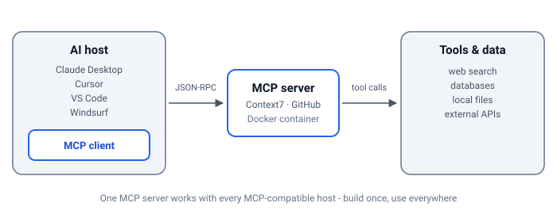

import YouTubeEmbed from "@components/widgets/YouTubeEmbed.astro";
import Notice from "@components/widgets/Notice.astro";
import Accordion from "@components/widgets/Accordion.astro";
import ListCheck from "@components/widgets/ListCheck.astro";
import Button from "@components/widgets/Button.astro";
import Tabs from "@components/widgets/Tabs.astro";
import Tab from "@components/widgets/Tab.astro";

MCP (Model Context Protocol) is the piece that turns an AI chat window into an assistant that can actually do things - search the web, query your database, read current documentation. If you've been using AI coding assistants, you've probably heard it mentioned. It's worth understanding: once I got MCP working, my AI assistant became genuinely useful for things it couldn't do before.

This guide is current for 2026 and covers what MCP actually is, how to set up your first server, how to verify it's connected, how to fix it when it isn't, and why Docker's MCP Catalog makes the whole process much less painful than it used to be.

<Notice type="info" title="What You'll Learn">
<ListCheck>
<ul>
<li>What MCP (Model Context Protocol) is and how it works</li>
<li>Why MCP is essential for modern AI development</li>
<li>How to set up your first MCP server</li>
<li>How to verify a server is connected and fix the most common setup errors</li>
<li>Understanding Docker MCP Catalog and Toolkit</li>
<li>Dynamic MCP management for efficient AI workflows</li>
<li>Best practices for beginners</li>
</ul>
</ListCheck>
</Notice>

## What is MCP (Model Context Protocol)?

MCP (Model Context Protocol) is an open protocol from Anthropic that standardizes how AI models connect to external tools and data. Without it, AI models are stuck with their training data - they can't search the web, access your database, or call APIs.

Before MCP existed, connecting an AI to external tools meant building custom integrations for each tool and each AI model. MCP fixes this by defining a standard protocol. Build one MCP server, and it works with Claude, Cursor, VS Code, or any other MCP-compatible client.

### The USB analogy

MCP is like USB for AI tools:

- **Before USB:** Every device needed its own weird connector
- **After USB:** One port works with everything

Same idea here. Developers build MCP servers once, and they work with any AI client that supports the protocol.

### How MCP Works

The MCP architecture consists of three main components:

| Component | Description | Examples |
|-----------|-------------|----------|
| **MCP Hosts** | AI applications that want to use external tools | Claude Desktop, Cursor, VS Code, Windsurf |
| **MCP Clients** | Protocol handlers within the host application | Built into Claude, Cursor, etc. |
| **MCP Servers** | Services that provide tools and data access | BrightData MCP, GitHub MCP, Database MCP |

When you ask Claude to "search for the latest news about Docker," here's what happens:

1. Claude (the host) recognizes it needs web search capability
2. It connects to a web search MCP server through the MCP client
3. The MCP server executes the search and returns results
4. Claude processes the results and provides you with an answer



## Why Use MCP? 4 Real Benefits

MCP solves real problems that make AI assistants frustrating to use:

### 1. Real-time data access

AI models only know what was in their training data. Ask about something that happened last week and they're useless. MCP lets them:

<ListCheck>
<ul>
<li>Search the web for up-to-date information</li>
<li>Access live databases and APIs</li>
<li>Retrieve current stock prices, weather, or news</li>
<li>Interact with your local files and projects</li>
</ul>
</ListCheck>

### 2. Build once, use everywhere

Write an MCP server for GitHub access, and it works with Claude, Cursor, VS Code, Windsurf - any client that speaks MCP. No more maintaining separate integrations for each platform.

### 3. Actually useful capabilities

With MCP servers, your AI can:

- Execute code in sandboxed environments
- Query databases directly
- Work with local files, or [give your AI agent a universal filesystem with Mirage](/mirage-virtual-filesystem-ai-agents/)
- Interact with version control systems
- Automate browser tasks
- Access specialized APIs (Amazon, LinkedIn, GitHub, etc.)

### 4. Control over what AI can access

MCP gives you a structured way to grant permissions. The AI only gets access to tools you explicitly enable, credentials stay on your machine, and you can revoke access anytime.

### Who benefits most

**Developers:** Current framework docs, direct database queries, Git automation, browser-based testing.

**Content creators:** Real-time research, product data extraction, competitor monitoring. If you're building [AI affiliate websites](/ai-affiliate-websites-amazon/), MCP servers like Bright Data help you pull actual product data instead of guessing.

**Researchers:** Academic database access, structured data collection, report generation from multiple sources.

## How to Use MCP: Getting Started

If you're new to [AI programming](/ai-programming-beginners-guide/), MCP might seem complicated. It's not that bad once you set up your first server. The whole flow is: pick a client, edit one config file, restart, verify.

### What you need

Before setting up MCP servers:

<ListCheck>
<ul>
<li>An AI assistant that supports MCP (Claude Desktop, Cursor, VS Code, Windsurf)</li>
<li>Node.js 18 or newer, for npx-based servers (check with `node --version`)</li>
<li>Basic familiarity with JSON configuration files</li>
<li>Docker Desktop 4.48+ for the easiest setup via the MCP Toolkit</li>
</ul>
</ListCheck>

### MCP configuration basics

MCP servers are configured through JSON files. Here's what one looks like:

```json
{
  "mcpServers": {
    "server-name": {
      "command": "npx",
      "args": ["-y", "@package/mcp-server"],
      "env": {
        "API_KEY": "your-api-key"
      }
    }
  }
}
```

The key parts:

- **command**: How to start the server (`npx` or `node` usually)
- **args**: What to pass to the command
- **env**: API keys and other secrets

Keep those env values out of any file that might end up in Git - more on that in the security section below.

### Where the config file lives

"My JSON edit does nothing" is the most common beginner failure, and the cause is almost always editing the wrong file. Each client has its own location:

<Tabs>
<Tab name="Claude Desktop">

The file is `claude_desktop_config.json`:

- **macOS:** `~/Library/Application Support/Claude/claude_desktop_config.json`
- **Windows:** `%APPDATA%\Claude\claude_desktop_config.json`

Quickest way in: open Claude Desktop, go to Settings, then Developer, then Edit Config. That opens the correct file for your OS.

</Tab>
<Tab name="Claude Code">

Claude Code uses a CLI command instead of a JSON file. From your project directory:

```bash
claude mcp add context7 -- npx -y @upstash/context7-mcp
```

If you want the config versioned with your code, use a `.mcp.json` file in the repo root instead. Check what's registered with:

```bash
claude mcp list
```

</Tab>
<Tab name="VS Code">

VS Code keeps MCP servers in `.vscode/mcp.json` in the workspace:

```json
{
  "servers": {
    "context7": {
      "type": "stdio",
      "command": "npx",
      "args": ["-y", "@upstash/context7-mcp"]
    }
  }
}
```

You can also add servers from the Command Palette (`MCP: Add Server`). If you use Copilot, the same servers are available in agent mode - see the [Copilot guide](/github-copilot-complete-guide/).

</Tab>
<Tab name="Cursor">

Cursor reads `~/.cursor/mcp.json` globally, or `.cursor/mcp.json` per project. The GUI path: Cursor Settings, then MCP, then Add new MCP server. Give it a name, choose the command type, paste the command and args.

One gotcha: new servers sometimes start disabled. Check the toggle is on before assuming the config failed.

</Tab>
</Tabs>

### Your first MCP server: Context7

Context7 is a good one to start with - it gives your AI access to current framework documentation instead of whatever was in its training data.

<Accordion label="Setting up Context7 MCP" group="setup" expanded="true">

For Claude Desktop, add this to your `claude_desktop_config.json`:

```json
{
  "mcpServers": {
    "context7": {
      "command": "npx",
      "args": ["-y", "@upstash/context7-mcp"]
    }
  }
}
```

</Accordion>

**Verify it works.** Quit Claude Desktop fully (tray icon, then Quit) and reopen it. Context7 should show up under Settings, then Developer, and the tools icon should appear in the chat box. Then ask something the model can't answer from training data alone, like a question about the latest version of a framework you use. If the answer cites current docs, the server is connected. If the assistant says it has no tools for that, it isn't - the failure modes below cover why.

The same Context7 server also works in code, not just chat clients. If you want to go a step further, see [how to build an AI agent with Context7 MCP](/agno-mcp-tools-context7/) using Agno.

<Notice type="warning" title="Server not showing up?">
Don't re-edit the JSON at random. Work through the five failure modes below - a syntax error or a skipped restart causes most "my server is missing" reports.
</Notice>

### When it doesn't work: five failure modes

1. **JSON syntax error.** One trailing comma breaks the whole file, and the client may silently load zero servers. Validate it: `cat claude_desktop_config.json | python3 -m json.tool`. If that prints an error, fix that line.
2. **Wrong config file.** macOS and Windows paths differ (see the tabs above). Editing a stray copy in the wrong place does nothing.
3. **`npx: command not found`** or a spawn error in the logs. Node.js is missing or not on your PATH. Install Node.js 18+, open a fresh terminal, and restart the client.
4. **Client not restarted.** Config changes don't hot-reload. Quit from the tray icon, not just by closing the window.
5. **Missing API key.** Servers that need credentials fail on the first call, sometimes with only a log line. Check the server's docs for required `env` values.

## Best MCP Servers for Beginners

Here's where I'd start. Each one fills a different gap, and two or three of these cover most beginner workflows.

### 1. Web search and scraping

For real-time web data, [BrightData MCP](/brightdata-mcp-guide/) works well. [Bright Data](https://go.bitdoze.com/brightdata) gives you 5,000 free requests monthly, access to search engines, and structured data from 40+ platforms, and it handles bot detection automatically.

If you'd rather call an API than run an MCP server, [TinyFish](https://go.bitdoze.com/tinyfish) hosts the same building blocks - web search, fetch, and browser control - behind a single API key. The [TinyFish free web search and fetch API guide](/tinyfish-ai-agents-web-search/) covers what it can do for coding agents.

### 2. Documentation

Context7 gives your AI current framework docs. Useful when you're working with fast-moving frameworks where the AI's training data is already outdated. You set it up in the section above.

### 3. Browser automation

Playwright MCP lets your AI control a browser - navigate pages, fill forms, click buttons, take screenshots. Good for testing or scraping dynamic sites.

If you want browser control without the MCP layer, Pinchtab exposes it over plain HTTP instead: see [Pinchtab browser control for AI agents over HTTP](/pinchtab-browser-ai-agents/).

### 4. Databases

Database MCP servers let your AI query PostgreSQL, MySQL, or SQLite directly. Useful for generating reports or exploring data through conversation. Start with a read-only user - it keeps an innocent question from turning into a deleted table.

### 5. Agent memory

[Hindsight](/hindsight-docker-deploy/) is an MCP server that gives your AI persistent long-term memory. It stores facts, builds mental models, and learns from conversations over time. Works with Claude, Cursor, OpenCode, and any other MCP client. If you're tired of your AI forgetting everything between sessions, this is the one to set up.

Not sure which memory system fits your stack? [Compare Cognee vs Hindsight for self-hosted agent memory](/cognee-vs-hindsight/).

## The problem with lots of MCP servers

MCP works great when you have 2-3 servers. But power users have ended up with hundreds of servers and thousands of tools. That creates problems:

### Context window bloat

Every MCP server adds tool definitions to your AI's context window. If you have 1,000 tools but only need 2 for a conversation, you're wasting tokens loading stuff you'll never use.

### Trust issues

Who made this MCP server? Can you trust it with your API keys? There's no real verification process for community servers.

### Configuration headaches

Managing auth, updates, and configs for dozens of servers gets old fast. Something always breaks.

<Notice type="warning" title="Token math">
With many MCP servers, a huge chunk of your context window goes to tool definitions alone. Less room for your actual conversation.
</Notice>

### Lighter alternatives: Agent Skills and native tools

Before you install a server for everything, check whether the job needs one. The client's built-in tools already cover files and code execution, and Agent Skills - a folder of instructions and scripts the model loads on demand - often costs fewer tokens than a full MCP server. See [how Agent Skills compare as a lighter alternative to MCP servers](/best-ai-skills-for-web-design/). If a skill can do the job, skip the server.

## Docker MCP Catalog and Toolkit

Docker built a solution: the MCP Catalog and Toolkit. It fixes most of the problems above.

<YouTubeEmbed
  url="https://www.youtube.com/embed/98M_6njOnus"
  label="Docker MCP Catalog and Toolkit Introduction"
/>

### The Catalog

A curated registry of verified MCP servers on Docker Hub. Pre-containerized, ready to use. Stripe, New Relic, Grafana - the popular ones are there. One-click setup.

### The Toolkit

A management layer between your AI clients and MCP servers:

<ListCheck>
<ul>
<li>**Centralized management** - One place to manage all your MCP servers</li>
<li>**Easy authentication** - Authenticate once, use everywhere</li>
<li>**Client integration** - Connect Claude, VS Code, Cursor, and more with one click</li>
<li>**Security** - All servers run in isolated Docker containers</li>
</ul>
</ListCheck>

### Setting it up

1. Update Docker Desktop to version 4.48+
2. Enable MCP Toolkit in settings (Beta Features)
3. Browse the Catalog, add what you need
4. Connect your AI clients

**Verify it works.** The server should show as running in Docker Desktop's MCP Toolkit panel, its tools should appear in your AI client, and one real query should come back with actual data. If the Toolkit panel shows the server but your client has no new tools, re-run the client connect step from the Toolkit - that's the handshake people skip.

Your AI client talks to Docker, Docker manages the servers. You don't deal with individual server configs anymore. And the pattern scales in both directions: the same setup also lets your [AI assistant deploy Docker apps with a single message](/ai-docker-deploy-skill/).

## Dynamic MCP loading

This is the clever part, and it needs Docker Desktop 4.50 or newer. Instead of loading every tool definition at startup, Docker's MCP Gateway lets AI agents discover and load tools only when needed.

### How it works

The Gateway gives your AI these meta-tools:

| Tool | Purpose |
|------|---------|
| `mcp-find` | Search for MCP servers in the catalog by name or description |
| `mcp-add` | Add an MCP server to the current session |
| `mcp-remove` | Remove an MCP server from the session |

The gateway ships a couple more (`mcp-config-set`, `mcp-exec`), but these three do most of the work. Your AI starts with just the management tools. When it needs GitHub access, it searches for and loads the GitHub server for that session. Context window stays clean.


### Code Mode

The Gateway also lets AI agents write JavaScript that calls MCP tools directly:

<ListCheck>
<ul>
<li>**Token efficiency** - The AI writes a custom tool once and reuses it</li>
<li>**Chaining tools** - Combine multiple MCP tools into one workflow</li>
<li>**Sandboxed execution** - Code runs safely in Docker containers</li>
<li>**State persistence** - Data can be stored between tool calls</li>
</ul>
</ListCheck>

One honest caveat: Docker's own docs flag Code Mode as early development and not yet reliable for general use. Treat the list above as design intent, and don't build anything important on it yet.

### Example: GitHub to Notion

Here's the kind of workflow it aims at, searching GitHub repos and saving results to Notion. With Code Mode:

1. AI writes JavaScript that calls both GitHub and Notion APIs
2. Code runs in a sandboxed container
3. AI gets a summary back, full results go to Notion
4. No huge JSON payloads eating your context window

More efficient than the AI processing raw results from each tool separately. Good idea, just early.

## Docker Hub MCP server

Docker also released an MCP server for Docker Hub itself. Search for images, manage repos, all through natural language.

### Setting it up

1. Open **MCP Toolkit** in Docker Desktop
2. Go to the **Catalog** tab
3. Search for "Docker Hub"
4. Click the plus icon to add it
5. Enter your Docker Hub username and personal access token

Then you can ask things like "find the latest Node.js Alpine image" or "what's the size of the official Python image" and get real answers.

**Verify it works.** Ask "what's the size of the official Python image?" A real answer means auth and the server are both fine. An "I don't have a tool for that" reply means the server didn't connect - check the token and re-add the server.

## Tips for getting started

**Start with 2-3 servers.** Context7 for docs, one web search server, maybe a database server. Add more as you actually need them.

**Use Docker's Toolkit if you can.** It handles updates, credentials, and client configuration. Less stuff to break.

**Know what you're installing.** Before adding an MCP server, understand what tools it provides and what data it can access.

**Watch your token usage.** If conversations feel limited, you probably have too many tools loaded. Use dynamic loading when available.

## MCP with different AI tools

**GitHub Copilot:** Has its own integrations, but you can add MCP through VS Code extensions. See the [Copilot guide](/github-copilot-complete-guide/).

**Cursor and Windsurf:** Built-in MCP support. Configure in settings, access through chat. If you're picking an agentic editor, [Windsurf](https://go.bitdoze.com/windsurf) is worth a trial.

**Claude Code:** Uses the `claude mcp add` command instead of a JSON file (shown in the tabs above). [OpenCode](https://go.bitdoze.com/opencode-go) is a solid open-source option in the same category with cheaper model support, and the [OpenCode setup guide (open-source Claude Code alternative)](/opencode-setup-guide/) walks through the whole thing. [Amp Code](/amp-code-free-ai-coding-agent/) and similar CLI agents follow the same config pattern.

**Open source LLMs:** Many [open source models](/best-open-source-llms-claude-alternative/) work with MCP through compatible clients.

## Security

MCP servers can access real systems with real credentials. A few things to keep in mind:

**Use Docker.** Containers isolate MCP servers from your system. If something goes wrong, cleanup is easy. See [using Docker with AI CLI tools](/docker-podman-ai-cli-tools-safe-environment/).

**Don't commit API keys.** Use environment variables, don't hardcode credentials in config files that might end up in Git.

**Know what's running.** Periodically check which servers are active and what they can access. Remove servers you're not using.

One attack worth knowing about: prompt injection. An MCP server returns content - a web page, a GitHub issue, a database row - and the model can treat that content as instructions. A poisoned page could tell your agent to send the API keys you just gave it somewhere you didn't intend. Prefer verified servers (the Docker Catalog vets what it ships), scope credentials as narrowly as the task allows, and run untrusted agents in containers. The [container-isolated Claude agent deployment on a VPS](/nanoclaw-deploy-guide/) guide shows what that isolation looks like in practice.

## Free options

You don't need to pay to try MCP:

- **Context7** - Free docs access
- **BrightData MCP** - 5,000 free requests/month
- **Playwright MCP** - Free browser automation
- **SQLite MCP** - Free local database access
- **Docker Desktop** - Free for personal use

What does MCP actually cost long term? The protocol is free, and so are most self-hosted servers. Two real costs show up: tokens, because every loaded tool definition eats context window on every request, and API fees, for servers that charge past their free tier - search and scraping services especially. Start with the free list above and watch your usage before adding paid servers.

You can also [use Claude and GPT for free](/use-claude-sonnet-4-5-gpt-5-free/) through various platforms.

## FAQ

<Accordion label="What is MCP in simple terms?" group="faq" expanded="true">
MCP (Model Context Protocol) is a standard way for AI assistants to connect to external tools and data. Think USB: before USB, every device needed its own cable; with MCP, any AI client can plug into any MCP server.
</Accordion>

<Accordion label="Do I need to code to use MCP?" group="faq">
No. You copy a JSON config once, then interact through natural language. The AI handles the technical bits.
</Accordion>

<Accordion label="Is MCP only for developers?" group="faq">
No. Anyone who wants to extend AI capabilities can use it - content creators, researchers, data analysts. If you can benefit from web scraping, database access, or automation, MCP helps.
</Accordion>

<Accordion label="Is MCP free to use?" group="faq">
The protocol is free and open source. Your real costs are the AI model's tokens - tool definitions consume context window on every request - and any MCP servers that charge past a free tier, like some search and scraping APIs.
</Accordion>

<Accordion label="How is MCP different from ChatGPT plugins?" group="faq">
ChatGPT plugins only worked with OpenAI. MCP is an open protocol - build an MCP server once, it works with Claude, Cursor, VS Code, Windsurf, and anything else that supports the protocol.
</Accordion>

<Accordion label="Can I build my own MCP server?" group="faq">
Yes. Anthropic provides SDKs for building MCP servers. You need programming knowledge, but it's not that complicated.
</Accordion>

<Accordion label="Do I need Docker?" group="faq">
No, but it makes things easier. Docker handles isolation, dependencies, and updates. Without it you manage all that yourself.
</Accordion>

<Accordion label="How many servers can I run?" group="faq">
No hard limit, but more servers means more tool definitions eating your context window. Use dynamic loading if available.
</Accordion>

## Wrapping up

MCP makes AI assistants actually useful for real work by connecting them to external tools and data. The protocol itself is straightforward - the complexity comes from managing many servers, which is why Docker's Toolkit is worth using. And if you're building your own agents, it's worth understanding [when to use native agent tools vs MCP servers](/mastra-tools-vs-mcp/) before you wire up a dozen servers.

Start with 2-3 servers, use Docker if you can, and add more as you actually need them. Don't install everything at once.

<Button text="Get Started with Docker MCP" link="https://hub.docker.com/mcp" variant="solid" color="blue" size="lg" />

## Related Resources

<ListCheck>
<ul>
<li>[Mastra tools vs MCP](/mastra-tools-vs-mcp/) - When to use native agent tools vs MCP servers (RAM, approvals, feature flags)</li>
<li>[Build an AI agent with Mastra](/build-ai-agent-mastra/) - TypeScript agent with createTool, memory, and Studio</li>
<li>[AI Programming Beginners Guide](/ai-programming-beginners-guide/) - Complete guide to programming with AI assistance</li>
<li>[BrightData MCP Complete Guide](/brightdata-mcp-guide/) - In-depth look at web scraping with MCP</li>
<li>[Docker/Podman AI CLI Safe Environment](/docker-podman-ai-cli-tools-safe-environment/) - Setting up secure AI development</li>
<li>[GitHub Copilot Complete Guide](/github-copilot-complete-guide/) - Master AI-assisted coding</li>
<li>[Best Open Source LLMs](/best-open-source-llms-claude-alternative/) - Alternatives to commercial AI models</li>
<li>[Top AI GitHub repos](/top-ai-github-repos/) - MCP directory, agents, frameworks, gateways</li>
<li>[Use Claude and GPT for Free](/use-claude-sonnet-4-5-gpt-5-free/) - Access premium AI models without cost</li>
<li>[Amp Code Free AI Coding Agent](/amp-code-free-ai-coding-agent/) - Free alternative for AI coding</li>
</ul>
</ListCheck>
