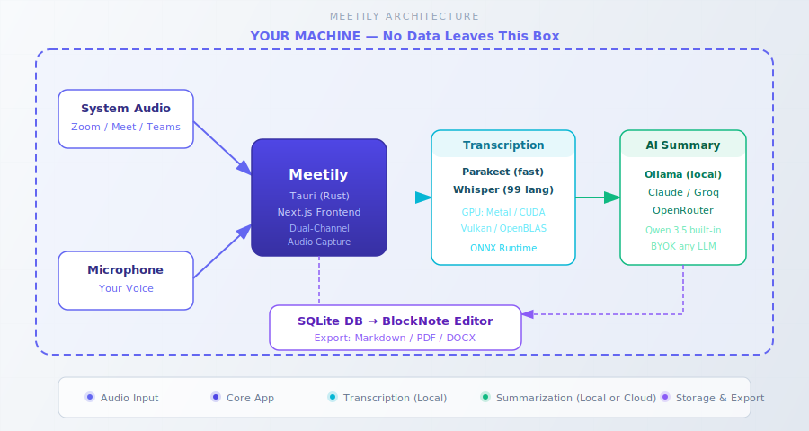
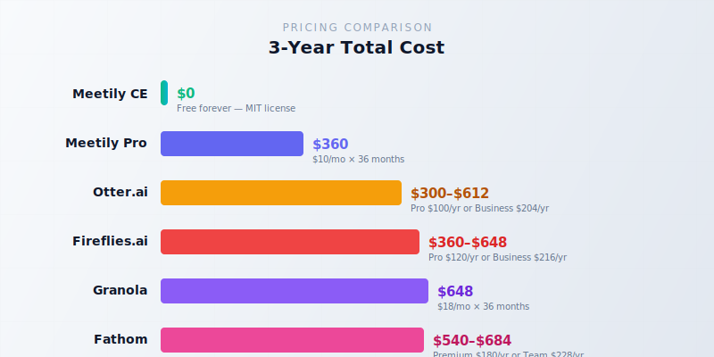

import Button from "@components/widgets/Button.astro";
import Notice from "@components/widgets/Notice.astro";
import ListCheck from "@components/widgets/ListCheck.astro";
import Accordion from "@components/widgets/Accordion.astro";
import Tabs from "@components/widgets/Tabs.astro";
import Tab from "@components/widgets/Tab.astro";

If you're paying Otter.ai, Fireflies, or Granola $10-18 per month to transcribe your meetings, you're spending $120-360 a year for something a free, open-source tool can do locally on your machine. Meetily is an MIT-licensed AI meeting assistant with ~25,000 GitHub stars and 308,000+ downloads that captures, transcribes, and summarizes meetings entirely on-device. No meeting bot joins your call, no audio leaves your machine.

I've already covered [FluidVoice, the free open-source Mac dictation app](https://www.bitdoze.com/fluidvoice-mac-dictation/) for single-speaker voice typing. Meetily is its meeting-length sibling: dual-channel capture (system audio + microphone), local transcription with Parakeet or Whisper, and AI summaries via Ollama or your preferred cloud LLM. Together, they form a $0/month local-first communication stack that replaces Wispr Flow + Otter.ai without any subscription.

<Notice type="info" title="Already using FluidVoice?">
If you followed the FluidVoice dictation guide, you already have Parakeet or Whisper installed locally. Meetily uses the same transcription models, so half the stack is already in place. The comparison section below breaks down exactly how the two tools complement each other.
</Notice>

This guide covers what Meetily actually does under the hood, how to install and configure it, how it compares to Otter.ai and other cloud meeting tools, and the honest gotchas you should know before committing.

## What is Meetily? (overview and key features)

Meetily is a desktop application built with Tauri (Rust backend + Next.js frontend) that captures your meeting audio, transcribes it with local AI models, and generates structured summaries. Developed by Zackriya Solutions (India), it hit v0.4.0 in June 2026.

The pitch is simple: everything stays on your machine. Transcription happens with Parakeet (NVIDIA) or Whisper (OpenAI) models running locally. Summarization can use Ollama (also local) or cloud LLMs you connect with your own API keys. Data is stored in an embedded SQLite database. No cloud account required, no data retention policies to worry about.

What it does:

- **Dual-channel audio capture**: system audio (Zoom, Meet, Teams) + your microphone, processed separately
- **No meeting bot**: other participants never see a "Recording Bot has joined" notification
- **Multiple transcription engines**: Parakeet (~4x faster than Whisper, 25 languages) or Whisper (99 languages)
- **Pluggable AI summaries**: Ollama (local), Anthropic Claude, Groq, OpenRouter, or any OpenAI-compatible endpoint
- **Built-in Qwen 3.5 models** (v0.4.0) for lightweight summarization without external LLMs
- **Rich editor**: BlockNote editor with Markdown export (Pro adds PDF/DOCX)
- **Meeting templates**: 7 built-in templates for different meeting types
- **GPU acceleration**: Apple Silicon Metal/CoreML, NVIDIA CUDA, AMD/Intel Vulkan
- **MIT license**: free for the Community Edition

### How Meetily captures meetings without a bot

When you start a recording, Meetily taps directly into your system audio (what you hear through your speakers/headphones) and your microphone simultaneously. It uses WASAPI on Windows and Core Audio on macOS.

Other meeting tools (Otter.ai, Fireflies, Fathom) work by joining your call as a bot participant. Everyone in the meeting sees "Otter.ai Notetaker has joined" or similar. This is awkward with clients, and in some industries it raises compliance questions about who else is in the call.

Meetily avoids this entirely. It captures audio from your system, same as if you pressed record on a screen capture tool. Dual-channel processing separates your voice (microphone) from other participants (system audio) before transcription, which helps with speaker attribution. Intelligent ducking lowers system audio volume when you speak to reduce crosstalk, and clipping prevention handles volume spikes from people who yell into their mics.



### Transcription engines: Whisper vs Parakeet

Meetily gives you two local STT options. The choice depends on your hardware and language needs.

<Tabs>
<Tab name="Parakeet (recommended)">
NVIDIA Parakeet is the faster option, roughly 4x faster than Whisper on comparable hardware with lower resource usage. The Parakeet TDT v3 ONNX model (~800 MB) supports 25 languages and led the Open ASR Leaderboard for word error rate.

**Requirements:** Apple Silicon (macOS) or NVIDIA GPU. Does not run on Intel Macs.

**When to use:** Default choice if your hardware supports it. Better accuracy, faster transcription, lower CPU/memory load.

**Setup:** On first launch, select Parakeet TDT v3 from the model dropdown. It downloads once (~800 MB) to your app data directory.
</Tab>
<Tab name="Whisper">
OpenAI Whisper supports 99 languages and runs on virtually any hardware, including Intel Macs. Model sizes range from tiny (~75 MB, fast but less accurate) to large-v3 (~2.9 GB, best accuracy but slow on CPU).

**Requirements:** Any modern CPU. No GPU required (but GPU helps a lot for large-v3).

**When to use:** Intel Macs, non-English languages not covered by Parakeet, or when you need the absolute broadest language support.

**Setup:** Select a Whisper model size from the dropdown. Recommendation: `medium` for the best accuracy-to-speed ratio on CPU; `large-v3` if you have a GPU.
</Tab>
</Tabs>

## How Meetily's self-hosted meeting transcription works

Since v0.1.1, Meetily uses a unified Tauri architecture. No separate backend server, no extra ports to manage. The entire application is a single binary with an embedded SQLite database. This simplified the architecture from the early days (v0.0.x) when you needed a separate Python backend running alongside the frontend.

### System audio + microphone: dual-channel capture

Dual-channel works by capturing two audio streams simultaneously:

1. **System audio**: what comes through your speakers/headphones. This is other participants in a Zoom/Meet/Teams call, shared screen audio, or any audio playing on your system.
2. **Microphone**: your voice.

The channels are processed separately through the transcription engine, then merged in the transcript. This separation helps the transcription engine distinguish speakers (your mic is clean, system audio has other voices mixed with call artifacts).

Intelligent ducking lowers system audio volume when the microphone detects you speaking, reducing the chance of crosstalk transcription errors. Clipping prevention smooths out volume spikes.

### Local AI models: Ollama, Claude, Groq, and OpenRouter

After transcription, Meetily can generate AI summaries of your meeting. You have several options:

**Local (Ollama):** Free, fully private. Requires installing Ollama separately (it is NOT bundled with Meetily). For good summary quality on longer meetings, use a model with 32B+ parameters. Quality drops on hour-long multi-topic calls with smaller models. See the [Hermes Agent setup guide](https://www.bitdoze.com/hermes-agent-setup-guide/) for a walkthrough of running AI models locally with Ollama.

**Built-in Qwen 3.5 (v0.4.0):** Lightweight option that doesn't require Ollama. Good for quick summaries but less capable than larger models on complex meetings.

**Cloud BYOK (bring your own key):** Anthropic Claude, Groq, OpenRouter, or any custom OpenAI-compatible endpoint. Better summary quality, especially on long meetings, but sends transcript text off-device.

<Notice type="warning" title="Cloud LLM privacy risk">
If you switch from Ollama to a cloud provider (Claude, Groq, OpenRouter) mid-session, the full transcript gets sent off-device. There's no clear warning UI for this transition. If privacy is your primary reason for using Meetily, double-check your LLM provider selection before every summary generation.
</Notice>

### GPU acceleration: Metal, CUDA, and Vulkan

GPU support makes a noticeable difference on transcription speed, especially with larger models.

| Platform | GPU Backend | Status |
|----------|-------------|--------|
| macOS (Apple Silicon) | Metal + CoreML | Auto-enabled, best experience |
| macOS (Intel) | CPU only | No GPU acceleration |
| Windows (NVIDIA) | Vulkan | Community Edition (v0.4.0+) |
| Windows (AMD/Intel) | Vulkan | Community Edition (v0.4.0+) |
| Linux (NVIDIA) | CUDA | Build from source with CUDA toolkit |
| Linux (AMD) | Vulkan/ROCm | Build from source with SDK |
| Any platform | OpenBLAS CPU | Fallback, no GPU needed |

**Note:** Windows GPU acceleration uses Vulkan in the Community Edition (v0.4.0+). Linux GPU works via source builds but requires the full CUDA toolkit or Vulkan SDK installed. Having GPU drivers alone is not enough.

## How to set up local AI meeting notes with Meetily

Follow the steps for your platform.

### Installing Meetily on macOS and Windows

<Tabs>
<Tab name="macOS (recommended)">
macOS has the smoothest experience, especially on Apple Silicon.

**Homebrew (recommended):**

```bash
brew tap zackriya-solutions/meetily
brew install --cask meetily
```

**Or download the DMG** from [GitHub Releases](https://github.com/Zackriya-Solutions/meetily/releases/latest). Look for `meetily_0.4.0_aarch64.dmg` (Apple Silicon) or `meetily_0.4.0_x64.dmg` (Intel).

**Verify:** Launch Meetily. A system tray icon should appear. Open Settings and confirm the transcription model dropdown is populated.

**macOS Sequoia 15.6+ note:** Some users report audio capture issues. Workaround: go to System Preferences → Sound → Output, temporarily adjust the Hz setting lower, then back to 48000 Hz.
</Tab>
<Tab name="Windows">
1. Download `meetily_0.4.0_x64-setup.exe` from [GitHub Releases](https://github.com/Zackriya-Solutions/meetily/releases/latest)
2. Right-click the installer → Properties → check "Unblock" → OK
3. Run the installer

**Verify:** Launch Meetily. Confirm the system tray icon appears and the transcription model dropdown is populated.

**Note:** GPU acceleration on Windows requires the Pro edition. Community Edition runs CPU-only transcription.
</Tab>
<Tab name="Linux (source build)">
Linux has no native installer. You must build from source. This is the weakest platform experience.

**Prerequisites:** Rust (latest stable), Node.js 18+, pnpm, CMake, build tools (gcc-c++, make).

```bash
git clone https://github.com/Zackriya-Solutions/meetily
cd meetily/frontend
pnpm install

# Auto-detect GPU and build
./build-gpu.sh
```

The output AppImage lands at `src-tauri/target/release/bundle/appimage/Meetily_<version>_amd64.AppImage`.

**GPU-specific builds:**

```bash
# Force CUDA (NVIDIA)
TAURI_GPU_FEATURE=cuda ./build-gpu.sh

# Force CPU-only
TAURI_GPU_FEATURE="" ./build-gpu.sh
```

For NVIDIA CUDA, install the toolkit first (drivers alone are not enough):

```bash
sudo apt install nvidia-driver-550 nvidia-cuda-toolkit
```

**Verify:** Run the AppImage. Confirm the window launches and system tray icon appears.
</Tab>
</Tabs>

### Configuring your first transcription model

On first launch, Meetily prompts you to download a transcription model. My recommendation:

- **Apple Silicon or NVIDIA GPU:** Parakeet TDT v3 (~800 MB), faster and lower resource usage
- **Intel Mac or non-English languages:** Whisper medium or large-v3

The model downloads to your app data directory. Make sure you have enough disk space (Parakeet ~800 MB, Whisper large-v3 ~2.9 GB).

**Verify:** After the model downloads, play a YouTube video or any audio on your system. Start a test recording in Meetily, let it run for 30-60 seconds, then stop. Confirm a transcript appears with reasonable accuracy. If you see "Transcription model not ready," restart the app and re-download the model.

### Connecting an LLM for AI summaries

<Notice type="info" title="Ollama is not bundled">
Ollama must be installed and running separately before you can use local AI summaries. This is the biggest friction point from community feedback. People install Meetily, expect AI summaries out of the box, and get nothing because Ollama isn't there.
</Notice>

**Path 1: Ollama (local, free, private)**

1. Install Ollama from [ollama.ai](https://ollama.ai)
2. Pull a model: `ollama pull llama3.1:8b` (start here for testing; use 32B+ for better summary quality on long meetings)
3. Verify Ollama is running: `ollama serve` (or check `curl http://localhost:11434/api/tags`)
4. In Meetily Settings → AI Provider, select Ollama and choose your model

**Path 2: Cloud BYOK**

1. Get an API key from Anthropic (Claude), Groq, OpenRouter, or any OpenAI-compatible provider
2. In Meetily Settings → AI Provider, select your provider and paste the API key
3. Choose a model (Claude Sonnet recommended for best quality-to-cost ratio)

**Verify:** Record a short test meeting (2-3 minutes). After stopping, click "Generate Summary." Confirm the AI summary appears. If using Ollama, check the terminal running `ollama serve` for request logs. You should see the model processing the transcript.

## Meetily vs Otter.ai: how they compare

Cloud meeting tools offer convenience. Meetily offers control. Here's how they actually compare.

### Privacy: local processing vs cloud upload

Meetily processes everything locally. Transcription runs on your hardware, and if you use Ollama, summaries do too. Otter.ai, Fireflies.ai, Granola, and Fathom all upload your audio to their cloud servers for processing.

Implications:

- **GDPR/HIPAA/SOC2:** Cloud tools store your audio on third-party servers. Meetily keeps it on your machine. For regulated industries, this matters.
- **The "no bot" advantage:** No awkward "Recording Bot has joined" notification in client calls. Meetily captures audio directly from your system.
- **Data retention:** Cloud tools retain your audio according to their policies (and policies change). With Meetily, you control the data.

<Notice type="warning" title="Verify the privacy claim">
Meetily markets "100% local" but this hasn't been independently verified with packet capture. If privacy is critical for compliance (healthcare, legal, finance), verify with Wireshark or Little Snitch before trusting. Also check Settings. Analytics were changed to opt-in by default in v0.4.0.
</Notice>

### Pricing: free Community Edition vs $8-18/month SaaS

The cost math is straightforward:

| Tool | Monthly Cost | 3-Year Cost |
|------|-------------|-------------|
| **Meetily CE** | **$0** | **$0** |
| Meetily Pro | $10/mo | $360 |
| Otter Pro | $8.33-16.99/mo | $300-612 |
| Fireflies | $10-18/mo | $360-648 |
| Granola | $14/mo | $504 |
| Fathom | $15-19/mo | $540-684 |



Meetily Community Edition is free forever. Even if you upgrade to Pro ($10/month, use coupon `LAUNCH20` for 20% off), you're competitive with the cheapest cloud option. And you own your data.

### Meetily vs Fireflies.ai and Granola: feature comparison

| Feature | Meetily CE | Otter.ai | Fireflies.ai | Granola | Fathom |
|---------|-----------|----------|--------------|---------|--------|
| **Price** | Free | $8.33-17/mo | $10-18/mo | $18/mo | Free-$19/mo |
| **Privacy** | Local only | Cloud | Cloud | Cloud | Cloud |
| **Bot-free recording** | Yes | No (bot joins) | No (bot joins) | Yes | No (bot joins) |
| **Platforms** | macOS, Win, Linux | Web, mobile | Web, mobile | macOS | Web, Win, Mac |
| **AI summary** | Yes (local or BYOK) | Yes | Yes | Yes | Yes |
| **Export** | Markdown (Pro: PDF/DOCX) | Multiple | Multiple | Multiple | Multiple |
| **Meeting templates** | 7 | No | Yes | No | No |
| **Speaker diarization** | Basic (CE) | Good | Good | Good | Good |
| **Calendar integration** | Pro only | Yes | Yes | Yes | Yes |
| **Mobile app** | No | Yes | Yes | No | Yes |
| **Search across meetings** | No | Yes | Yes | Yes | Yes |

The table tells the story: Meetily wins on privacy and cost. Cloud tools win on polish, cross-device access, and multi-speaker accuracy.

## Meetily and FluidVoice: your local AI meeting and dictation stack

If you read the [FluidVoice guide](https://www.bitdoze.com/fluidvoice-mac-dictation/), you know I'm a fan of local-first audio tools. Meetily and FluidVoice aren't competitors. They're complementary tools that cover different use cases with the same underlying tech.

| | FluidVoice | Meetily |
|---|---|---|
| **Purpose** | Single-speaker dictation (type anywhere by voice) | Meeting capture + transcription + summary |
| **License** | Open source (MIT) | Open source (MIT) |
| **Platforms** | macOS | macOS, Windows, Linux |
| **STT models** | Parakeet, Whisper | Parakeet, Whisper |
| **AI enhancement** | Fluid-1 smart formatting | Meeting summary templates |
| **Audio source** | Microphone only | System audio + microphone |
| **Output** | Typed text in any app | Transcript + summary + Markdown export |
| **GitHub stars** | ~2,000+ | ~25,000+ |
| **Price** | Free | Free (CE) |
| **Mobile** | No | No |

**FluidVoice** is for dictation. You speak, it types into whatever app you're focused on, with smart formatting via the Fluid-1 model. Think "voice-to-text replacement for typing."

**Meetily** is for meetings. It captures both sides of a conversation (system audio + mic), produces a full transcript, and generates structured summaries with action items. Think "local Otter.ai replacement."

Together, they replace Wispr Flow ($10-12/month) + Otter.ai ($10-17/month) for $0/month, all running on local models. If you care about privacy tools, you might also be interested in [self-hosted privacy tools like Chatto](https://www.bitdoze.com/chatto-self-hosted/) for keeping your team's messages private.

## Meetily Pro: is the paid tier worth it?

### Community vs Pro feature breakdown

| Feature | Community (Free) | Pro ($10/mo) |
|---------|-----------------|--------------|
| Local transcription (Parakeet/Whisper) | Yes | Yes |
| AI summaries (Ollama + cloud BYOK) | Yes | Yes |
| Markdown export | Yes | Yes |
| PDF/DOCX export | No | Yes |
| Custom summary templates | 7 built-in | Custom templates |
| Windows GPU acceleration | No (CPU only) | Yes |
| Auto-detect meetings (calendar) | No | Yes |
| Enhanced speaker diarization | Basic | Enhanced |
| Priority support | No | Yes |
| OTA updates | Yes | Yes |

14-day free trial for Pro, no credit card required. Coupon `LAUNCH20` gets 20% off.

<Accordion label="When is Community Edition enough?" group="pro-decision" expanded="true">

Community Edition is the right choice if:

- You're a solo user (no team workspace needed)
- You're on macOS (Metal/CoreML GPU works in CE) or Linux
- Markdown export is sufficient for your workflow
- You don't need calendar integration. Starting and stopping recording manually is fine
- You're privacy-focused and want to use Ollama exclusively

</Accordion>

<Accordion label="When should I upgrade to Pro?" group="pro-decision">

Pro makes sense if:

- You're on Windows and need GPU-accelerated transcription (CE is CPU-only on Windows)
- Calendar auto-detect is critical for your workflow (you forget to start recording)
- You need PDF or DOCX export for sharing with non-technical stakeholders
- Enhanced speaker diarization matters (multi-speaker meetings with many participants)
- You want priority support and SLA

</Accordion>

## Limitations and honest gotchas

No tool is perfect, and Meetily has real weaknesses you should know about before committing. This isn't a hit piece. It's the "know before you commit" section.

<Notice type="warning" title="Known issues as of v0.4.0">
The three biggest gotchas: **(1)** speaker diarization is weak in Community Edition. Multi-speaker meetings produce messy transcripts. **(2)** Ollama summarization quality drops on hour-long meetings. Small models struggle with multi-topic calls. **(3)** there's no mobile app. You can't review notes on your phone. See the full list below.
</Notice>

**1. Speaker diarization is weak in CE.** Multi-speaker meetings produce transcripts with wrong speaker labels or no speaker attribution at all. Enhanced diarization is a Pro feature. If you mostly have 1-on-1 or small meetings, this isn't a problem. For large group calls, it's a real limitation.

**2. Ollama summarization quality drops on long meetings.** Local small models (8B, 13B) handle short focused calls well but struggle on hour-long multi-topic meetings. The summaries get vague or miss key decisions. Fix: use a larger model (32B+) or switch to a cloud LLM for long meetings (but remember the privacy tradeoff).

**3. No search across meetings.** Each meeting is self-contained in the SQLite database. You can't query "what did we discuss about Project X last month?" across sessions. You'd need to export meetings and search them externally.

**4. No mobile app.** Meetily is a desktop-only application. No iOS or Android client exists. You can't review meeting notes on your phone. You'd need to export to Markdown and sync via your preferred notes app.

**5. No calendar integration in CE.** Auto-detect and auto-join meetings is Pro-only. Community Edition requires manual start/stop recording.

**6. No API or CLI.** You can't automate Meetily, query it from other tools, or integrate it into CI/CD pipelines. If you need programmatic access, this is a blocker.

**7. Linux requires source build.** No `apt install`, no Flatpak, no Docker one-liner. The source build works but requires Rust, Node.js, pnpm, CMake, and build tools. GPU auto-detection needs the actual SDK installed (CUDA toolkit, ROCm, or Vulkan SDK), not just GPU drivers.

**8. macOS Sequoia 15.6+ audio capture issues.** Known issue with a workaround: temporarily adjust the Hz setting in System Preferences → Sound → Output lower, then back to 48000 Hz.

**9. Summary cloud leakage risk.** Easy to misconfigure and accidentally send transcripts to a cloud LLM when you intended to use Ollama. No clear warning UI when switching providers mid-session.

### Common errors and fixes

| Error | Cause | Fix |
|-------|-------|-----|
| "Transcription model not ready" | Model download failed or corrupted | Restart app, re-download model from settings |
| Ollama not connecting | Ollama not running or wrong port | Verify `ollama serve` is running, check `curl http://localhost:11434/api/tags` |
| macOS audio not captured | Audio output routing issue | Check System Preferences → Sound → Output is set correctly; try the Hz workaround |
| Windows installer blocked | Windows SmartScreen | Right-click installer → Properties → Unblock → OK |
| Linux GPU not detected | Missing SDK (not just drivers) | Install CUDA toolkit, ROCm, or Vulkan SDK |
| Summary quality poor | Small Ollama model on long meeting | Use 32B+ model or cloud LLM for summaries |

## Real-world workflow: recording a Zoom call end-to-end

Here's the "run this tonight" scenario: what a typical meeting workflow looks like from start to finish.

1. **Launch Meetily.** System tray icon appears. The app sits in the background waiting.
2. **Start your Zoom/Meet/Teams call.** Join as normal.
3. **Click "Start Recording" in Meetily.** It begins capturing system audio (other participants) and your microphone simultaneously.
4. **During the call.** Real-time transcription appears in the Meetily window. You can keep it minimized.
5. **End the call.** Click "Stop Recording" in Meetily.
6. **AI summary generates automatically.** If Ollama or a cloud LLM is configured, Meetily processes the transcript and produces a structured summary with key points and action items.
7. **Review and edit.** The built-in BlockNote editor lets you clean up the transcript and summary.
8. **Export.** Markdown for Community Edition, PDF/DOCX for Pro.

**Verify after your first real meeting:**

- Is the transcript reasonably accurate? (Perfect accuracy isn't realistic. Expect 85-95% depending on audio quality and accent.)
- Does the summary capture the main points and action items?
- Does export work? (Test Markdown export)
- Check the SQLite database: `~/.local/share/meetily/` (Linux), `~/Library/Application Support/meetily/` (macOS), or `%APPDATA%/meetily/` (Windows)

If you're considering running Ollama on a server for a team setup, check the [best self-hosted server panels](https://www.bitdoze.com/best-self-hosted-panels/) for managing the deployment. A [Hetzner VPS](https://go.bitdoze.com/hetzner) with a decent GPU or a [dedicated mini PC](https://go.bitdoze.com/asus-dc510) works well for always-on Ollama serving.

## Backup, updates, and maintenance

Meetily stores everything in a local SQLite database. Back it up if the data matters to you.

**Database locations:**

- **Linux:** `~/.local/share/meetily/`
- **macOS:** `~/Library/Application Support/meetily/`
- **Windows:** `%APPDATA%/meetily/`

The SQLite file contains all your meeting transcripts, summaries, and metadata. Copy it somewhere safe periodically. The [meetily-exporter](https://github.com/Zackriya-Solutions/meetily) community tool can auto-export to Obsidian/Notion if you want a more structured backup.

**Transcription models** are stored in the app data directory. Ollama models live in `~/.ollama/`. Back this up too if you've pulled large models and don't want to re-download.

**Updates:**

- OTA updates are supported since v0.2.0. Meetily will notify you when a new version is available
- Homebrew users: `brew upgrade --cask meetily`
- Manual: download the latest release from GitHub

**Crash recovery:** Since v0.2.0, Meetily automatically recovers transcripts from interrupted recordings. Verify this works after your first few recordings by checking that partial transcripts persist if you force-quit the app.

## Final verdict: who should use Meetily?

Meetily is a real, functional tool, not a GitHub curiosity. With 25k stars, 308k+ downloads, and active development (v0.4.0 in June 2026), it's the most mature open-source meeting assistant available. It's not perfect, but for the right use case, it's the best option.

<ListCheck>
Meetily is a great fit if you need:

- Privacy-first meeting transcription. No audio on third-party servers
- Freedom from $10-18/month subscription fees for meeting notes
- Local processing for regulated industries (healthcare, legal, finance)
- A complement to FluidVoice for a complete local-first communication stack
- macOS (best experience) or Windows desktop use
- Bot-free recording. No "Recording Bot has joined" awkwardness

</ListCheck>

**Skip Meetily (for now) if:**

- You need reliable multi-speaker diarization on large calls. CE is weak here
- You need mobile access to meeting notes. No iOS/Android app exists
- You're on Linux and unwilling to build from source
- You need team collaboration or shared meeting workspaces
- You want turnkey zero-configuration setup

The sweet spot for Meetily right now is a solo operator or small team on macOS who wants to stop paying for Otter.ai or Fireflies and is comfortable with a tool that's functional but still rough around the edges. Paired with FluidVoice for dictation and [self-hosted alternatives to cloud services](https://www.bitdoze.com/executor-sh-vs-composio/) for other workflows, you can build a privacy-respecting stack without subscriptions.

If you're into [building your own AI agent with Mastra](https://www.bitdoze.com/build-ai-agent-mastra/) or running [Hermes Agent for self-hosted AI workflows](https://www.bitdoze.com/hermes-agent-setup-guide/), Meetily fits the same philosophy: own your data, run it locally, accept the tradeoffs of early-stage open source.

<Button text="Download Meetily from GitHub" link="https://github.com/Zackriya-Solutions/meetily/releases/latest" variant="solid" color="blue" size="md" icon="arrow-right" />
