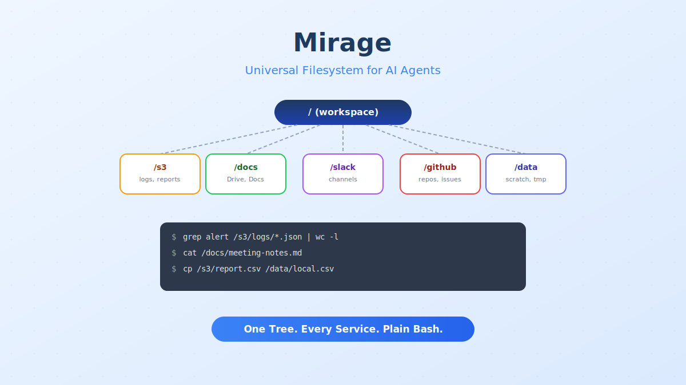

import Button from '@components/widgets/Button.astro';
import Notice from '@components/widgets/Notice.astro';
import Accordion from '@components/widgets/Accordion.astro';
import Tabs from '@components/widgets/Tabs.astro';
import Tab from '@components/widgets/Tab.astro';
import ListCheck from '@components/widgets/ListCheck.astro';

If you've built anything with AI agents that talks to more than one service, you've felt the pain. Your agent needs to read a file from S3, check a Slack thread, pull a Google Doc, and query a GitHub repo. Each one needs its own SDK, its own authentication flow, its own set of method calls. Your prompt engineering turns into a juggling act of API instructions.

[Mirage](https://github.com/strukto-ai/mirage) takes a different approach. It mounts all those services as branches of a single virtual filesystem tree — S3, Google Drive, Slack, GitHub, Redis, Gmail, whatever you need. Your agent navigates them with `ls`, `cat`, `grep`, and pipes.

The reason this works well is simple: every major LLM already knows bash. The Unix filesystem is probably the interface LLMs have the most training data for. Mirage leans on that existing knowledge instead of asking models to learn yet another API surface.

This guide walks through setting up Mirage, mounting your first backends, and wiring it into an agent framework. You'll have a working setup in about 10 minutes.



## What Mirage actually does

Mirage gives you a `Workspace` object. You mount services onto paths in that workspace, then run shell commands against the combined tree.

```python
from mirage import Workspace
from mirage.resource.s3 import S3Config, S3Resource
from mirage.resource.slack import SlackConfig, SlackResource
from mirage.resource.ram import RAMResource

ws = Workspace({
    "/data":  RAMResource(),
    "/s3":    S3Resource(S3Config(bucket="my-bucket")),
    "/slack": SlackResource(SlackConfig()),
})

# These commands hit different backends, but the agent sees one tree
await ws.execute("ls /s3/logs/")
await ws.execute("grep error /slack/engineering/*.json | wc -l")
await ws.execute("cp /s3/report.csv /data/local.csv")
```

The shell isn't a real `/bin/bash` — it's a tree-sitter parser with a custom executor that routes commands to per-mount handlers. Pipes, globs, `&&`, `||`, and most common Unix verbs work. The agent never touches your host filesystem or spawns subprocesses.

### Supported backends

Mirage covers a solid range of services out of the box:

| Category | Backends |
|---|---|
| **Storage** | S3, R2, OCI, Supabase, GCS, RAM, Disk |
| **Google** | Gmail, Google Drive, Google Docs, Sheets, Slides |
| **Collaboration** | GitHub, Linear, Notion, Trello, Slack, Discord, Telegram, Email |
| **Databases** | Redis, MongoDB, Postgres |
| **Remote** | SSH |

Each one mounts at a path you choose. The agent doesn't need to know which backend it's talking to — it just reads and writes files.

### Mirage vs per-service MCP servers

<Accordion label="How does this compare to MCP?" group="comparison" expanded="true">

| Aspect | Mirage | Per-service MCP servers |
|---|---|---|
| **Setup** | One workspace, mount config per service | One server per service |
| **Agent vocabulary** | Standard bash (`ls`, `cat`, `grep`, pipes) | Custom tool schemas per server |
| **Cross-service pipelines** | Native (pipes across mounts) | Manual orchestration in code |
| **Caching** | Built-in two-layer cache (index + file) | Varies by server |
| **Portability** | Snapshot and clone workspaces | State scattered across servers |
| **Framework support** | OpenAI Agents SDK, Vercel AI SDK, LangChain, Pydantic AI | Depends on MCP client |

MCP servers are still useful for services that need structured tool calls (like "create a calendar event"). Mirage works best when the interaction pattern is read/write/search, which covers a large chunk of what agents actually do.

</Accordion>

## Prerequisites

<ListCheck>
<ul>
<li>Python 3.12+ or Node.js 20+</li>
<li>macOS or Linux</li>
<li>Credentials for at least one backend (S3 bucket, Slack token, etc.)</li>
</ul>
</ListCheck>

## Step 1: Install Mirage

<Tabs>
<Tab name="Python">

```bash
uv add mirage-ai
```

This installs both the `mirage` library and the `mirage` CLI binary.

</Tab>
<Tab name="TypeScript (Node)">

```bash
npm install @struktoai/mirage-node
```

For browser or edge runtimes, use `@struktoai/mirage-browser` instead. The `@struktoai/mirage-core` package provides runtime-agnostic primitives if you need fine-grained control.

</Tab>
<Tab name="CLI Only">

```bash
curl -fsSL https://strukto.ai/mirage/install.sh | sh
```

Or via npm/npx:

```bash
npm install -g @struktoai/mirage-cli
# or
npx @struktoai/mirage-cli
# or
uvx mirage-ai
```

</Tab>
</Tabs>

<Notice type="info" title="No FUSE required">
Mirage runs the workspace in-process. You don't need FUSE support unless you want host tools (editors, language servers, `rg`) to also see the mounted filesystem.
</Notice>

## Step 2: Create a workspace and mount services

The workspace is the central object. You define it with a dictionary mapping mount paths to resource instances.

### Python

```python
from mirage import Workspace
from mirage.resource.ram import RAMResource
from mirage.resource.s3 import S3Config, S3Resource
from mirage.resource.slack import SlackConfig, SlackResource
from mirage.resource.gdocs import GDocsConfig, GDocsResource
from mirage.resource.github import GitHubConfig, GitHubResource

ws = Workspace({
    "/data":   RAMResource(),
    "/s3":     S3Resource(S3Config(bucket="my-logs-bucket")),
    "/slack":  SlackResource(SlackConfig()),
    "/docs":   GDocsResource(GDocsConfig()),
    "/github": GitHubResource(GitHubConfig()),
})
```

### TypeScript

```ts
import {
  Workspace,
  RAMResource,
  S3Resource,
  SlackResource,
  GDocsResource,
  GitHubResource,
} from '@struktoai/mirage-node'

const ws = new Workspace({
  '/data':   new RAMResource(),
  '/s3':     new S3Resource({ bucket: 'my-logs-bucket' }),
  '/slack':  new SlackResource({}),
  '/docs':   new GDocsResource({}),
  '/github': new GitHubResource({}),
})
```

Each resource needs its own credentials. Mirage reads them from environment variables or explicit config objects. Check the [resource matrix](https://docs.mirage.strukto.ai/home/resource-matrix) for per-backend setup details.

## Step 3: Run commands against the combined tree

Once the workspace is set up, every command goes through `execute()`:

```python
# List files in S3
await ws.execute("ls /s3/logs/2026/05/")

# Search across Slack messages
await ws.execute("grep 'incident' /slack/incidents/*.json")

# Pipe data between backends
await ws.execute("cat /s3/report.csv | head -20 > /data/preview.txt")

# Read a Google Doc
await ws.execute("cat /docs/meeting-notes.md")

# Search GitHub repo contents
await ws.execute("grep -r 'TODO' /github/my-repo/src/")
```

The agent uses the same commands it would use on a local filesystem. No new vocabulary to learn, no SDK method calls to memorize.

### Custom commands

You can register your own commands that work across all mounts:

```python
# Register a summarize command available everywhere
ws.command('summarize', summarize_handler)

# Override a command for a specific resource + filetype
# cat on a Parquet file in /s3 renders rows as JSON
ws.command('cat', {'resource': 's3', 'filetype': 'parquet'}, parquet_cat_handler)

await ws.execute('summarize /github/my-repo/README.md')
await ws.execute('cat /s3/events/2026-05-06.parquet | jq .user')
```

## Step 4: Wire into your agent framework

Mirage ships adapters for the major agent frameworks. Here's how to plug it in.

### OpenAI Agents SDK

```python
from agents import Runner
from agents.run import RunConfig
from agents.sandbox import SandboxAgent, SandboxRunConfig
from mirage.agents.openai_agents import MirageSandboxClient

client = MirageSandboxClient(ws)
agent = SandboxAgent(
    name="Filesystem Agent",
    model="gpt-4.1",
    instructions=ws.file_prompt,
)

result = await Runner.run(
    agent,
    "Find all error logs from last week in /s3 and summarize them.",
    run_config=RunConfig(sandbox=SandboxRunConfig(client=client)),
)
```

The `ws.file_prompt` property generates a system prompt that tells the model about the mounted filesystem layout. The agent runs bash commands against your mounts through the sandbox client.

### Vercel AI SDK (TypeScript)

```ts
import { generateText } from 'ai'
import { openai } from '@ai-sdk/openai'
import { mirageTools } from '@struktoai/mirage-agents/vercel'
import { buildSystemPrompt } from '@struktoai/mirage-agents/openai'

const { text } = await generateText({
  model: openai('gpt-4.1'),
  system: buildSystemPrompt({
    mountInfo: { '/s3': 'S3 bucket', '/slack': 'Slack messages' }
  }),
  prompt: "Read /s3/data/report.pdf, then describe what's in it.",
  tools: mirageTools(ws),
})
```

Adapters for LangChain, Pydantic AI, CAMEL, and OpenHands are also available. The pattern is the same: pass the workspace, get tools back.

### CLI with Claude Code or Codex

The Mirage CLI plugs directly into coding agents. This works with [Hermes Agent](/hermes-agent-setup-guide/), [OpenCode](/opencode-setup-guide/), [Pi Agent](/pi-coding-agent-setup-guide/), and any tool that exposes a shell interface.

```bash
# Create a workspace config
mirage workspace create ws.yaml --id my-agent

# Run commands
mirage execute --workspace_id my-agent --command "grep alert /s3/logs/*.json"

# Snapshot for reuse
mirage workspace snapshot my-agent my-agent.tar
```

## Step 5: Configure caching

Every workspace ships with a two-layer cache so repeated reads don't hit the network:

- **Index cache** caches directory listings and metadata. First `ls` hits the API; subsequent ones serve from cache until TTL expires.
- **File cache** stores object bytes. First `cat` streams from origin; later reads come from cache.

By default, Mirage uses an in-process RAM cache (512 MB file cache, 10-minute index TTL). For production setups with multiple workers or processes, switch to Redis:

```ts
import { RedisFileCacheStore, RedisIndexCacheStore, Workspace } from 'mirage/node'

const ws = new Workspace(
  { '/s3': new S3Resource({ bucket: 'my-bucket' }) },
  {
    cache: new RedisFileCacheStore({
      url: 'redis://localhost:6379/0',
      limit: '8GB',
    }),
    index: new RedisIndexCacheStore({
      url: 'redis://localhost:6379/0',
      ttl: 600,
    }),
  },
)
```

If you're running Mirage inside a container, you can pair it with a [Redis Docker setup](/multiple-postgres-databases-docker/) for a fully self-contained stack.

## Portable workspaces

Workspaces are portable. You can snapshot, clone, and version them.

```python
# Save workspace state
ws.snapshot("my-workspace.tar")

# Load it elsewhere
restored = Workspace.load("my-workspace.tar", id="restored")
```

```bash
# CLI equivalent
mirage workspace snapshot my-agent my-agent.tar
mirage workspace load my-agent.tar --id restored
```

You can save an agent's working environment and restore it on another machine, version workspace configs alongside your code, or reproduce agent runs by restoring the exact same filesystem state.

## Real-world example: multi-service log analysis

Here's a concrete workflow that pulls data from three services to produce a report:

```python
from mirage import Workspace
from mirage.resource.ram import RAMResource
from mirage.resource.s3 import S3Config, S3Resource
from mirage.resource.slack import SlackConfig, SlackResource
from mirage.resource.github import GitHubConfig, GitHubResource

ws = Workspace({
    "/data":   RAMResource(),
    "/s3":     S3Resource(S3Config(bucket="app-logs")),
    "/slack":  SlackResource(SlackConfig()),
    "/github": GitHubResource(GitHubConfig()),
})

# Find errors in S3 logs
await ws.execute("grep -i 'error' /s3/production/2026-05-*.log > /data/errors.txt")

# Count by frequency
await ws.execute("sort /data/errors.txt | uniq -c | sort -rn > /data/top-errors.txt")

# Check if these were reported in Slack
await ws.execute("grep -f /data/errors.txt /slack/incidents/*.json > /data/slack-matches.txt")

# Cross-reference with GitHub issues
await ws.execute("grep -i 'error' /github/my-app/issues/ > /data/github-issues.txt")

# Combine into a report
await ws.execute("cat /data/top-errors.txt /data/slack-matches.txt /data/github-issues.txt > /data/report.txt")
```

The agent handles this the same way a developer would on a local machine — `grep`, `sort`, `uniq`, pipes. The difference is that the data lives across S3, Slack, and GitHub, and the agent doesn't need to know that.

## Tips for working with Mirage

<ListCheck>
<ul>
<li>Use RAMResource as a local scratch pad for intermediate results, like `/tmp`</li>
<li>Name mount paths clearly — `/s3`, `/slack`, `/github` are easier for agents to reason about than `/m1`, `/m2`, `/m3`</li>
<li>Switch to Redis cache for production; the default RAM cache doesn't survive restarts or share across processes</li>
<li>Save workspace state before long-running agent tasks so you can restore if something goes sideways</li>
<li>Combine Mirage with coding agents like [OpenCode](/opencode-setup-guide/) or [Hermes Agent](/hermes-agent-setup-guide/) that already use shell interfaces</li>
<li>Check the [resource matrix](https://docs.mirage.strukto.ai/home/resource-matrix) before building — not every backend supports every operation</li>
</ul>
</ListCheck>

## Troubleshooting

<Accordion label="Commands return empty results" group="faq">
Check that your credentials are set correctly. Mirage reads service credentials from environment variables by default. Verify with:

```bash
# Check what's mounted
await ws.execute("ls /")

# Check a specific mount
await ws.execute("ls /s3/")
```

If the mount is empty but shouldn't be, verify the bucket/token/credential configuration for that specific resource.
</Accordion>

<Accordion label="Pipe commands fail across mounts" group="faq">
Most pipes work across mounts, but some commands have resource-specific behavior. If a pipe fails, try splitting it into separate steps using a RAMResource as intermediate storage:

```python
await ws.execute("cat /s3/data.json > /data/temp.json")
await ws.execute("jq '.items[]' /data/temp.json > /data/filtered.json")
```
</Accordion>

<Accordion label="Performance feels slow" group="faq">
First reads always hit the network. Subsequent reads use the cache. If you're doing heavy I/O:

1. Switch to Redis cache for shared caching across processes
2. Use `mirage provision` (CLI) to pre-warm the cache before agent runs
3. Check if your backend has rate limits (especially Slack and Google APIs)
</Accordion>

<Accordion label="Which model works best with Mirage?" group="faq">
Any model that handles bash well works. Models trained heavily on code and shell commands tend to perform best. If you're looking for affordable options, check [Best Open Source LLMs for Coding](/best-open-source-llms-claude-alternative/) or [Best Cheap Models for Hermes Agent](/best-cheap-models-hermes-agent/). You can run Mirage with free models through [OpenRouter](/hermes-agent-mimo-v2-pro/) or [LiteLLM](/litellm-docker-install/) as well.
</Accordion>

## What's next

Mirage solves a real problem in agent development: connecting agents to multiple services without drowning in SDK boilerplate. The filesystem abstraction is familiar to both developers and LLMs, which makes it a practical foundation for multi-service agent workflows.

- [Mirage GitHub Repository](https://github.com/strukto-ai/mirage) for source code and issues
- [Mirage Documentation](https://docs.mirage.strukto.ai) for the full API reference and resource matrix
- [Mirage Discord](https://discord.gg/u8BPQ65KsS) for community support
- [Hermes Agent Setup Guide](/hermes-agent-setup-guide/) to pair Mirage with a self-hosted AI agent
- [VPS Setup for AI Coding Agents](/vps-ai-coding-setup/) to get a server ready for agent workloads
- [Best Open Source LLMs for Coding](/best-open-source-llms-claude-alternative/) for affordable models that handle bash well

If you're building agents that touch more than one service, Mirage is worth a serious look. The 10-minute setup time isn't marketing fluff — once you have credentials for a backend, mounting it is a single line of config.

<Button text="More AI tool guides" link="/category/ai/" variant="solid" color="blue" size="md" icon="arrow-right" iconPosition="right" />
