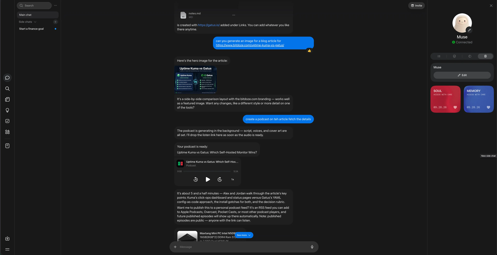
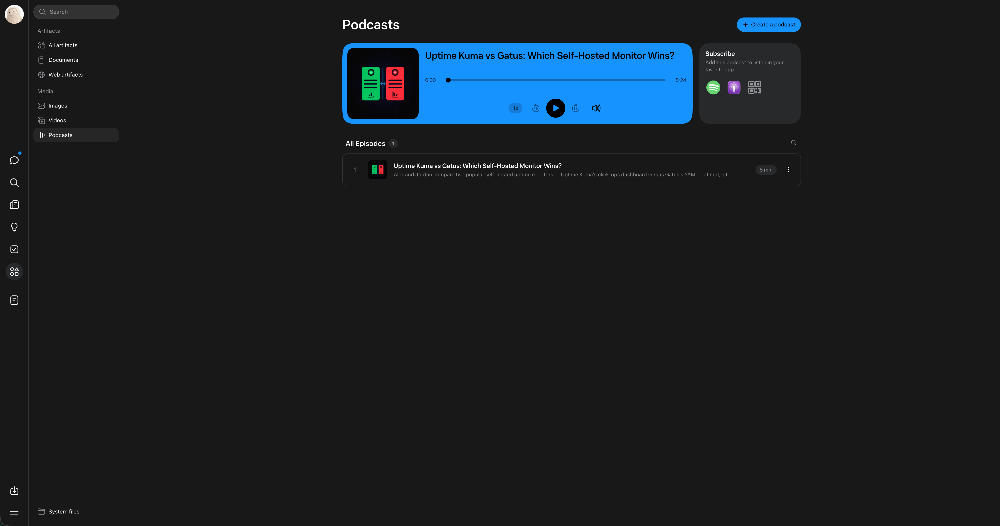

import Button from "@components/widgets/Button.astro";
import Notice from "@components/widgets/Notice.astro";
import ListCheck from "@components/widgets/ListCheck.astro";
import Accordion from "@components/widgets/Accordion.astro";

Meta just shipped Muse, a personal AI agent that lives on its own cloud VM and does things for you instead of only answering questions. It's invite-gated and region-locked right now, but there's a referral program attached: redeem an invite code within 48 hours of signing up and both sides get 1 billion Muse tokens. I went through the signup from a restricted region (US VPN endpoint) and it worked, so here's the full picture: what Muse is, the Linux box that comes with it, what the tokens get you, and how to actually get in.

<Notice type="success" title="Invite code: 1 billion free tokens">
  Sign up at [muse.ai](https://muse.ai), then within 48 hours go to **Settings > General > Redeem invite code** and enter my code:

  **`WQLEDY`**

  You get 1 billion tokens, I get 1 billion tokens. That's the deal.
</Notice>

## The invite deal, explained

<YouTubeEmbed
  url="https://www.youtube.com/embed/UaMdJFd7xJw"
  label="I Tested Meta's Muse AI (Browser Control, Local Access, & Free 1B Tokens)"
/>

Meta's Alexandr Wang [announced the referral program](https://x.com/Muse) when Muse launched in September 2026. The mechanics are simple:

<ListCheck>
- A new user redeems someone's invite code in **Settings > General** within **48 hours** of creating the account
- Both accounts get credited **1 billion Muse tokens** each
- One account can refer up to **20 friends**, so a fully used code is worth 20 billion tokens to the owner
- Users who refer all 20 slots get early access to unreleased features (Meta is teasing voice calling)
</ListCheck>

The 48-hour window is the part people miss. If you create an account, wander off, and come back two days later, the redeem field still shows but the bonus is gone. Enter the code during your first session and be done with it.

Miss the window or sign up without a code and the redeem option goes away once it closes. It's one shot per account, so use it.

## What Muse actually is

Muse is Meta's entry in the personal agent race. The web app at muse.ai is the main surface (there are also mobile apps, a macOS app, and a WhatsApp surface), and behind the chat each account gets a dedicated cloud VM: the **Muse Secure VM**. A second agent called **Sentinel** shares the machine, separated from Muse at the system level, and nothing the agent does reaches the internet unless Sentinel approves it. Passwords and API keys sit in a vault Muse itself can't read; it borrows them with your approval, one action at a time. The whole thing runs on **Muse Spark 1.3**, Meta's current top model.

On macOS, Muse can work inside the native Files, Messages, Calendar, Notes, and Mail apps, with access granted per app. A **Muse Confidential VM**, encrypted with a key only you hold, is promised for later this year.

## The VPS option: a real Linux box behind every account

Here's the part that lands hardest if you read this blog: every Muse account runs on a real Linux virtual machine. Terminal shell, its own filesystem, internet access. Muse works on that machine itself instead of pretending to work.

What that means day to day. It writes and runs code, Python, Bash, Node.js, for scripting, automation, data processing, scraping, and file conversion. It reads, writes, and organizes files, including PDFs, spreadsheets, documents, and archives. Need a package? It installs it and moves on. Need something that doesn't exist yet? It builds a small app or utility on the spot and keeps it in your Library.

If you've ever [set up a self-hosted agent on a VPS](/clawdbot-setup-guide/) by hand, you know the dance: rent the box, install the agent, wire up credentials, keep the thing updated. Muse ships that whole arrangement with the machine included and the wiring done. The trade is that the machine sits on Meta's infrastructure behind Meta's approval layer. Plenty of people will take that trade. If you self-host precisely because you don't trust that arrangement, Muse won't change your mind.

## The web interface

The product's shape shows in the web app: a workspace built around one agent rather than a single chat box with a send button. Alongside the main conversation you get dedicated areas for the things your Muse accumulates:

<ListCheck>
- **Chat**: one long main conversation rather than scattered threads. You can interrupt it mid-task, queue several requests in a row, and open **side chats** when a topic deserves its own context
- **Goals**: long-running objectives Muse breaks into plans and keeps working on a schedule, even with the app closed. You watch progress here instead of asking "how's that going?"
- **Tracked items**: reservations, deliveries, trips, commitments. Muse keeps them current and closes them when they're done
- **Library**: where the files it creates actually live. Documents, PDFs, dashboards, images, generated pages, all collected in one place instead of buried in the transcript
- **Ideas**: proactive suggestions Muse drafts based on your goals and what it's learned about you
- **Feed**: a personal newspaper tab with short posts Muse writes on a schedule you control
- **Memory**: the files it uses to remember you, readable and editable directly, plus an activity log under the avatar showing what it's doing and which permissions you've approved
</ListCheck>

The right rail is worth a look: your Muse's avatar sits on top with its connection status, and below it are two cards literally labeled "access with care," Soul and Memory, each with an Edit button. The Invite button in the top-right corner is where your own referral code lives once you're in.

That memory point matters more than it sounds. Most agent products treat memory as a black box you argue with. Here it's a set of files you can open, read, and edit. Tell Muse to forget something and it actually does.

The chat surface itself carries inline widgets: option buttons, maps, charts, custom HTML cards. File attachments render natively in the conversation. On mobile there's voice dictation and voice notes, because typing "reorganize my travel folder" on a phone screen is nobody's idea of a good time.

## Things it can make and do

This is the part that justifies the token metering. Here's what the agent actually handles:

**Research.** Web search for anything time-sensitive: news, prices, documentation. It opens and reads pages and articles, and for bigger questions it runs deep research across multiple sources and comes back with citations. The habit I care about most: it checks claims against primary sources before repeating them to you.

**Browsing and buying.** Muse has a full browser on its VM, a real Chromium one. It searches, navigates sites, fills forms, clicks through flows, downloads files, and signs into sites with saved credentials when you allow it. Purchases run through **Stripe Link** one-time-use virtual cards with a structured approval card: you see the item and the total, hit accept or reject, and only then does money move. Same pattern for sending email or other hard-to-undo actions: the agent does the work, you approve the consequence.

**Documents and files.** Ask for a spending tracker, a study guide, a trip plan, a resume, or a letter and you get a real file back: a document, a PDF, a spreadsheet, a presentation, or an interactive page. It lands in your Library instead of a wall of text in chat.

**Images and video.** It produces images inline, useful for covers, mockups, or anything where you'd normally leave the app to open a generator. Video is in the artifact list too, with its own shelf in the Library next to images and podcasts.

**Podcast generation.** Point it at a topic or a document and it produces a real episode: script, two voices (mine came back hosted by "Alex and Jordan"), and cover art, all generated in the background while you keep chatting. When it's done, an inline player lands in the conversation and Muse offers to publish it to a personal RSS feed you can add to Apple Podcasts, Overcast, or Pocket Casts. One caveat it flags itself: published episodes are public to anyone with the link. Plain text-to-speech and narrated briefings work too, if you'd rather listen than read.

**Automation.** One-off reminders ("remind me Friday at 9am"), recurring jobs like daily briefings and weekly reports, and event-driven hooks that fire when something happens, say a new email arriving. The work runs in the background whether the app is open or not, and the results come to you.

**Delegation.** Long multi-step jobs can fan out to background subagents while the main conversation stays responsive. Ask for five topics researched at once and five agents go to work in parallel.

**Connected services.** Connect an account and Muse works with it directly through Skills. Sensitive actions still hit the approval flow before anything leaves the machine.

| Service | What Muse does with it |
|---------|------------------------|
| Gmail | search, read, draft, send, reply, manage labels |
| Google Calendar | agenda, event details, scheduling |
| Spotify | music, podcasts, playlists |
| Instagram, Threads, Facebook, Messenger | read posts, profiles, messages; publish on request |
| Apple HealthKit, Google Health Connect | steps, sleep, heart rate, workouts |
| Plaid | bank accounts, balances, transactions |
| Shopping | product search, price comparison, Marketplace listings |
| FlightAware | flight status, delays, times |
| Places and Maps | find restaurants, stores, locations; reverse-geocode coordinates |

**Devices and WhatsApp.** WhatsApp side chats give each topic its own persistent thread outside the main conversation. Pair a Mac and Muse can browse its files. Pair a phone and it works with texts, calls, notifications, and location. It can message you on either.

**Its own tooling.** When a task needs something that doesn't exist, Muse writes code on its VM and builds the tool itself: a scraper, a converter, whatever the job needs. That output lands in your Library too.

The Library sorts everything it produces into Documents, Web artifacts, Images, Videos, and Podcasts, with System files at the bottom. It's basically a file manager for your agent's output, which is the right model: chat scrolls away, files shouldn't.

## Identity, soul, and memory

Personalization runs deep here. Start with a name and an avatar, then define its **soul**, the personality it runs on: tone, how proactive it is, how it talks to you. It holds a real conversation in any language you write in and will push back with an opinion when you want one. Two people on Muse can end up with agents that feel genuinely different, which is the point.

That pairs with the memory model above and the proactivity controls. Your Muse can message you first when it has something worth interrupting for, a deadline it caught in a school email, a price drop on something you asked it to watch. If that's too much, dial it down or turn it off entirely. The defaults are sane: proactive enough to be useful, not so chatty you mute it in a day.

**Bonus for terminal people:** a third-party CLI, [`muse-cli`](https://pypi.org/project/muse-cli/), already exists on PyPI. It speaks the app's gateway protocol over a Noise-encrypted WebSocket to your VM and prints JSON for every command, so you can script your agent or pipe it into other tools. Unofficial, so treat it accordingly.

## How to sign up (including from a restricted region)

Muse isn't available everywhere yet. The signup flow checks your region, and if you're outside the supported list you'll hit a wall. The workaround I used: a VPN with a US exit node, kept on for the whole registration. It got me through, and it's the same workaround every restricted-region signup guide I've seen recommends.

Here's the sequence:

<ListCheck>
1. Connect your VPN and pick a **US server**. Keep it on for the entire flow.
2. Go to [muse.ai](https://muse.ai) and create an account (email works).
3. Complete age verification. You're offered a **credit/debit card** check (a ~$1 temporary charge that gets refunded) or verification through **Facebook/Instagram**.
4. Once you're in, go to **Settings > General > Redeem invite code**.
5. Enter **`WQLEDY`** and confirm. Do this within 48 hours of creating the account. That's my code, so we both land the 1 billion tokens.
6. After onboarding, the mobile app and the macOS app accept the same account, so you can switch surfaces freely.
</ListCheck>

A few notes on the card check, since that's where people hesitate: it looks like an age-verification hold, not a subscription, and early users report the small charge getting refunded. If the idea of handing a card number to a Meta age gate bothers you, the Facebook/Instagram path skips it, though that ties the account to your social profile. Pick your poison.

<Notice type="warning" title="Region check isn't a one-time thing">
  Signup is the hard gate, but keep the VPN handy for the first sessions if you hit odd errors. Once the account exists and the code is redeemed, tokens are already credited, so the daily-use experience is less fussy than the registration.
</Notice>

<Button text="Get 1 billion tokens on Muse" link="https://muse.ai" variant="solid" color="blue" size="md" icon="arrow-right" />

## What a billion tokens actually buys you

Tokens are Muse's internal meter for agent work: conversations, background tasks, browser sessions, artifact generation. Meta hasn't published a public conversion table, so treat the billion as "a very large runway" rather than a dollar figure. For context, if you burned a million tokens a day on chats and background jobs, this credit would last close to three years. Most people will never see the bottom of it.

The real value is different anyway: while Muse is invite-gated, a referral code is effectively your ticket in, and the tokens make the free tier feel unlimited while Meta figures out pricing.

## Honest caveats before you hand it your life

I'd be doing you a disservice if I didn't say this part out loud. Muse asks for a lot: your credentials, your card, access to your email and calendar and messages. The Sentinel separation and the approval cards are a better security model than "agent with your password in a text file," and the Secure VM is genuinely isolated per user. Passwords live in a vault Muse can't read, and card details stay with the payment provider. Still, the infrastructure is Meta's. A Confidential VM with user-held encryption is promised but not shipping yet.

There are hard limits baked in, at least. Muse works for you alone, won't share your data without permission, won't echo credentials or keys back at you even if you ask, and hard-refuses weapons, child exploitation, and security-bypass work.

My take: connect low-risk stuff first (calendar read access, a shopping list), watch how the approval flow behaves for a week, then decide how much rope to give it. The activity log is decent, use it.

Also worth knowing: it's early. Side chats, goals, and artifacts work, but the product is clearly a 1.0 and Meta is iterating fast. Expect rough edges and changing behavior between updates.

If you've been following the "free AI credits" wave, this one is more generous than most. I covered a similar offer in my guide to [using Claude Sonnet 4.5 and GPT-5 for free](/use-claude-sonnet-4-5-gpt-5-free/), and Muse's billion-token referral beats it on raw volume.

## FAQ

<Accordion label="Where do I enter the Muse invite code?">
  In the Muse app or web app, open **Settings > General** and look for **Redeem invite code**. Enter `XWVGQ2` there. The field appears after onboarding, and the code must be redeemed within 48 hours of creating your account.
</Accordion>

<Accordion label="Do I get the tokens immediately?">
  The 1 billion tokens credit to both accounts once the code is redeemed successfully. If the redeem field rejects the code, double-check for typos (the code is all letters and digits, six characters).
</Accordion>

<Accordion label="Muse says it's not available in my country. What do I do?">
  The signup is region-gated. Use a VPN with a US exit node for the entire registration flow, complete age verification, and redeem the code while still connected. After the account exists, daily use is more forgiving, though keeping the VPN nearby for early sessions is a good idea.
</Accordion>

<Accordion label="Can I invite my own friends afterward?">
  Yes. Every account gets its own invite code (top-right corner of the app, "Invite"). You can refer up to 20 people, each redemption pays both sides 1 billion tokens, and filling all 20 slots gets you early access to upcoming features.
</Accordion>

<Accordion label="Is Muse free, or will tokens run out?">
  Muse is free to use right now and metering runs on tokens. Meta hasn't published pricing or a conversion table, so the billion-token credit is best read as a generous launch runway rather than a permanent state of things.
</Accordion>

<Accordion label="Does Muse give me a terminal or a VPS?">
  Every account runs on a dedicated Linux VM with a terminal shell, filesystem, and internet access, and Muse does its work there: running code, installing packages, building small tools. What surfaces for you is the output, files in the Library and artifacts in chat. To drive the agent from your own terminal, the unofficial `muse-cli` covers that over the app's gateway protocol.
</Accordion>

## Bottom line

Muse is the first big-tech personal agent that actually ships the "give it a goal, close the app, come back to finished work" promise, and it backs that with a real Linux VM per account instead of a chat window pretending to be a computer. The Secure VM plus Sentinel setup is a more serious answer to the security question than most competitors have offered. Whether you trust Meta with an agent that holds your credentials is a personal call, but the barrier to finding out is currently zero dollars and one invite code.

Grab the billion tokens while the referral program is still running. It won't stay this generous forever.

**Invite code: `XWVGQ2`** (redeem in Settings > General within 48 hours of signup)

<Button text="Get 1 billion tokens on Muse" link="https://muse.ai" variant="solid" color="blue" size="md" icon="arrow-right" />
