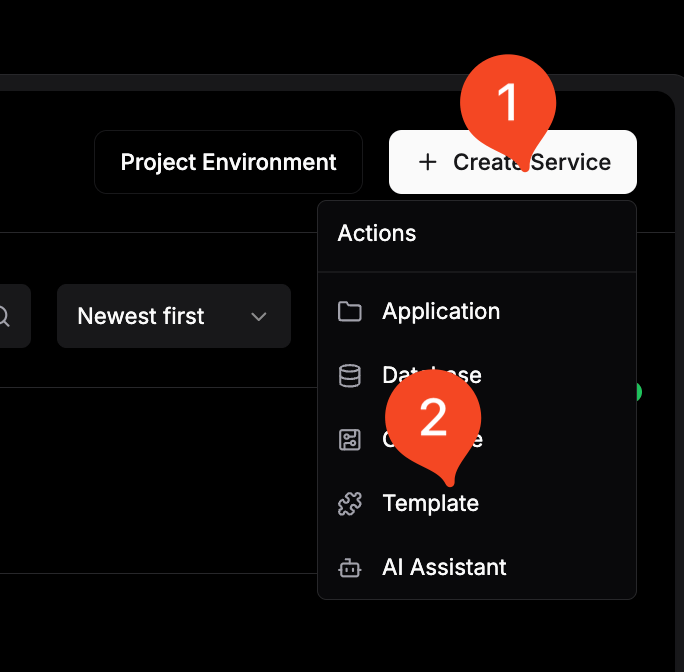
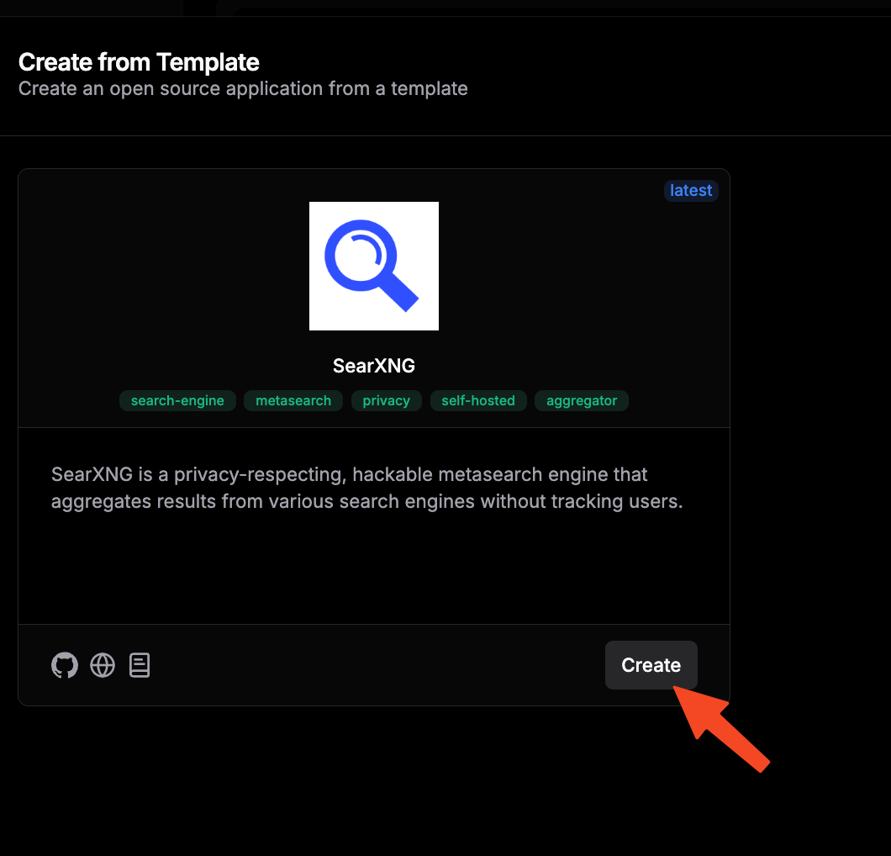
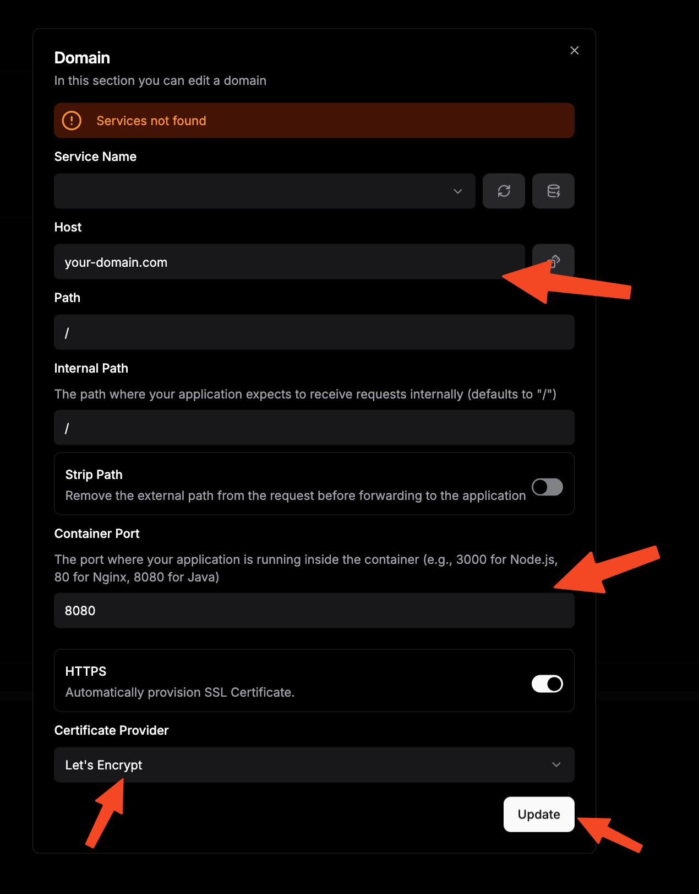
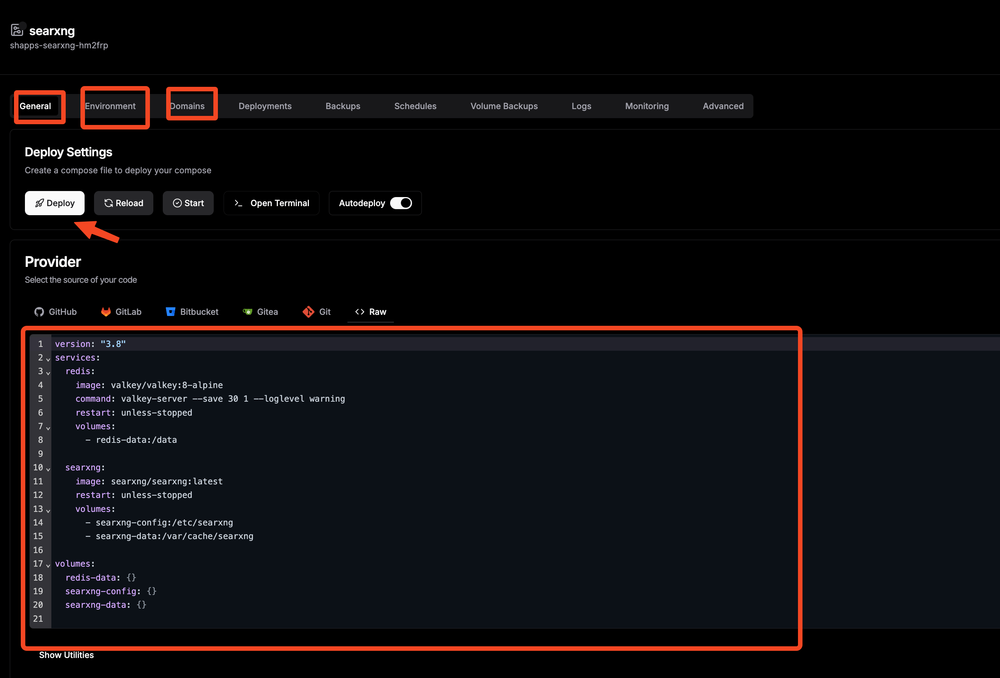

import Button from "@components/widgets/Button.astro";
import Notice from "@components/widgets/Notice.astro";
import ListCheck from "@components/widgets/ListCheck.astro";
import Accordion from "@components/widgets/Accordion.astro";

Zapier charges per task. Make charges per operation. If you run more than a handful of automations, the bill climbs fast. Self-hosting n8n gives you unlimited executions on your own hardware for the cost of a VPS.

**n8n** is an open-source workflow automation platform (fair-code, Sustainable Use License) at version 2.37.x stable, with 203k+ GitHub stars and 100M+ Docker pulls. You can self-host n8n on a cheap VPS with Docker Compose and get the same visual workflow builder, 1,000+ integrations, and webhook triggers that the cloud services charge for. n8n 3.0 is planned for October 2026 and will make Docker the only supported self-host method. If you're still running `npx n8n`, now is the time to move.

This guide covers four production-ready setup options: standalone Docker Compose, Traefik reverse proxy, Dokploy GUI deployment, and PostgreSQL queue mode for scale.

## What is n8n?

n8n (pronounced "nodemation") is a visual workflow automation platform that connects services and automates tasks through a node-based editor. Think of it as a self-hosted alternative to Zapier or Make. You drag nodes onto a canvas, connect them, and data flows from one to the next. The difference is you own the infrastructure and the data never leaves your servers.

### Key benefits of n8n

<ListCheck>

- **Visual workflow builder**: Create automations using a drag-and-drop interface. No coding required for most tasks.

- **1,000+ built-in integrations**: Connect to Google Workspace, Microsoft 365, Slack, GitHub, databases, and APIs (over 2,000 entries in n8n's [integration directory](https://n8n.io/integrations/))

- **Custom JavaScript nodes**: Write code when pre-built nodes don't cover your use case

- **Webhook support**: Trigger workflows from external events: HTTP requests, file changes, email arrivals

- **Advanced flow control**: Conditional logic, loops, error handling, and parallel processing

- **Queue mode**: Distribute work across multiple workers with PostgreSQL and Redis for high-volume operations

- **Credential management**: Encrypted storage for API keys, tokens, and authentication details

- **Self-hosted privacy**: Keep your data and automation logic on your own servers

- **Extensive API**: Manage workflows and configurations through REST APIs

- **AI Assistant** (Preview, 2.35+): Build workflows with an AI helper using your own API keys (Anthropic, OpenAI, OpenRouter)

</ListCheck>

A couple of features worth noting: Git version control integration and multi-environment support (dev/staging/production) require a paid license. The Community edition covers everything a solo operator needs: unlimited workflows, steps, executions, and users.

You can explore the codebase at the [official GitHub repository](https://github.com/n8n-io/n8n) or visit [n8n.io](https://n8n.io) for documentation.

### How n8n works

n8n uses nodes. Each node represents a function or service integration. You create workflows by connecting nodes in sequence, and data flows from one node to the next.

| Component type | Purpose | Use cases |
|---------------|---------|-----------|
| **Trigger nodes** | Initiate workflow execution | Webhook requests, scheduled tasks, file changes, email arrivals |
| **Regular nodes** | Perform actions | API calls, data processing, file operations |
| **Control nodes** | Manage workflow logic | Conditional branching, loops, error handling, data merging |
| **Code nodes** | Run custom scripts | Complex calculations, data transformations |
| **Sub-workflow nodes** | Reference other workflows | Reusable components, modular design |

This modular approach lets you build simple data sync tasks or complex multi-step business processes.

### n8n 2.0 and 3.0: what changed for self-hosters

n8n 2.0 shipped in December 2025 and brought several breaking changes that affect self-hosted deployments:

- **Secure by default**: Code nodes can no longer access environment variables (`N8N_BLOCK_ENV_ACCESS_IN_NODE=true`). File nodes are restricted to `~/.n8n-files`.
- **Publish/Save model**: Workflows now have a draft vs published state, replacing the old active/inactive toggle.
- **PostgreSQL recommended**: MySQL/MariaDB support was removed entirely. PostgreSQL 17/18 is the recommended production database.
- **Task runners on by default**: Code node execution is sandboxed in separate runner processes.
- **Migration Report**: A built-in tool (Settings → Migration Report) that flags workflows affected by breaking changes before you upgrade.

<Notice type="warning" title="n8n 3.0: Docker-only self-hosting coming October 2026">

n8n 3.0 will remove support for `npm` and `npx n8n` installations. Docker Compose will be the only supported self-host method. If you're running n8n via npm today, migrate to Docker now. The 3.0 release also removes legacy Function/Function Item nodes and the AI Agent node v1. Read the [v3.0 breaking changes](https://docs.n8n.io/changelog/v30-breaking-changes) before upgrading.

</Notice>

**Action items before upgrading:**
1. Run the Migration Report (Settings → Migration Report) to flag affected workflows
2. Read the [v2.0 breaking changes](https://docs.n8n.io/changelog/v20-breaking-changes) and [v3.0 breaking changes](https://docs.n8n.io/changelog/v30-breaking-changes)
3. Pin your Docker image tag. Don't rely on `latest` in production

## n8n system requirements and prerequisites

n8n is lightweight, but RAM is the bottleneck. The Node.js process is single-threaded, and complex workflows with large JSON payloads consume memory, not CPU. Queue mode adds roughly 1 GB for workers.

**Recommended specifications:**

| Component | Minimum | Recommended | Queue mode |
|-----------|---------|-------------|------------|
| **CPU** | 2 vCPU | 4 vCPU | 4+ vCPU |
| **RAM** | 2 GB | 4 GB | 4 GB + 1 GB per worker |
| **Storage** | 20 GB SSD | 50 GB SSD | 100 GB NVMe |
| **Network** | 100 Mbps | 1 Gbps | 1 Gbps |

<Notice type="info" title="RAM is the bottleneck">

n8n's Node.js process is single-threaded. Complex workflows with large JSON payloads consume memory, not CPU. If you see OOM kills, increase RAM before adding cores.

</Notice>

<ListCheck>

**Prerequisites:**

- **A Linux VPS**: Ubuntu 22.04+ recommended. [Hetzner Cloud](https://go.bitdoze.com/hetzner) (€4-8/mo) or [Hostinger VPS](https://go.bitdoze.com/hostinger-vps) work well, or use a [Mini PC as a home server](https://www.bitdoze.com/best-mini-pc-home-server/)
- **Docker and Docker Compose** installed on your server
- **A domain name** with DNS pointing to your server (e.g., `n8n.yourdomain.com`)
- **A reverse proxy** for HTTPS: Traefik (see [Traefik Reverse Proxy in Docker: Complete Setup Guide](https://www.bitdoze.com/traefik-proxy-docker/)) or let Dokploy handle it automatically

</ListCheck>

## Setup option 1: install n8n with Docker Compose (standalone)

This is the simplest setup. A single n8n container with SQLite. Good for getting started, development, or solo use with moderate workflow volume.

<Notice type="info" title="Why no Redis?">

The previous version of this guide included Redis in the standalone compose file. Redis only helps in queue mode. Without `EXECUTIONS_MODE=queue`, it does nothing except consume ~100 MB of RAM. This setup keeps it simple.

</Notice>

### Step 1: create project directory

```bash
mkdir -p ~/n8n-automation && cd ~/n8n-automation
```

### Step 2: create Docker Compose configuration

```yaml
services:
  n8n:
    image: docker.io/n8nio/n8n:2.37.7
    container_name: n8n-app
    restart: unless-stopped
    ports:
      - '5678:5678'
    environment:
      - N8N_EDITOR_BASE_URL=http://localhost:5678
      - N8N_WEBHOOK_URL=http://localhost:5678
      - GENERIC_TIMEZONE=UTC
      - TZ=UTC
      - N8N_ENCRYPTION_KEY=${N8N_ENCRYPTION_KEY}
      - N8N_ENFORCE_SETTINGS_FILE_PERMISSIONS=true
      - N8N_DEFAULT_BINARY_DATA_MODE=filesystem
      - N8N_LOG_LEVEL=info
      - N8N_LOG_OUTPUT=console
      - EXECUTIONS_DATA_PRUNE=true
      - EXECUTIONS_DATA_MAX_AGE=336
    volumes:
      - ./data:/home/node/.n8n
      - ./files:/files
    cap_drop:
      - ALL
    cap_add:
      - SETUID
      - SETGID
      - CHOWN
      - DAC_OVERRIDE
    healthcheck:
      test: ['CMD', 'wget', '--no-verbose', '--tries=1', '--spider', 'http://localhost:5678/healthz']
      interval: 30s
      timeout: 10s
      retries: 3
      start_period: 40s
```

Key changes from the old compose: removed `version: '3.8'` (obsolete in Compose v2), removed `VUE_APP_URL_BASE_API` (no-op in Docker), replaced `WEBHOOK_URL` with `N8N_WEBHOOK_URL`, dropped Redis, pinned the image tag.

### Step 3: initialize configuration

```bash
# Create required directories
mkdir -p {data,files}

# Generate a secure encryption key
echo "N8N_ENCRYPTION_KEY=$(openssl rand -base64 32)" > .env

# Set proper permissions
chmod 700 data
chmod 755 files
```

<Notice type="warning" title="Encryption key">

If you lose `N8N_ENCRYPTION_KEY`, all stored credentials become undecryptable. Back up the `.env` file alongside your data. If you use Docker secrets or a `.env` manager, n8n supports `_FILE` suffix variants (e.g., `N8N_ENCRYPTION_KEY_FILE`). See [Docker Compose secrets and secure alternatives](https://www.bitdoze.com/docker-compose-secrets/) for options.

</Notice>

### Step 4: launch and verify

```bash
# Launch the container
docker compose up -d

# Verify it's running
docker compose ps

# Check logs for issues (look for deprecation warnings)
docker compose logs -f n8n
```

Verify the health endpoint:

```bash
curl -s http://localhost:5678/healthz
```

You should get a `200 OK` response. If the logs show a `WEBHOOK_URL` deprecation warning, you used the old variable name. Update it to `N8N_WEBHOOK_URL`.

<Notice type="success" title="Verify it works">

`/healthz` returns 200 and logs show "Editor is now accessible". You're good. For production use, put this behind a reverse proxy (Option 2) or use Dokploy (Option 3).

</Notice>

### Step 5: access n8n

Navigate to `http://localhost:5678` in your browser. Create your admin account and start building workflows.

## Setup option 2: n8n behind a Traefik reverse proxy

This is the production single-instance setup: automatic HTTPS via Let's Encrypt, domain routing, and optional Dockge management.

<Notice type="info" title="Prerequisites">

You need Traefik running with wildcard certificates. Follow [Traefik Reverse Proxy in Docker: Complete Setup Guide](https://www.bitdoze.com/traefik-proxy-docker/) and [Traefik Free Let's Encrypt Wildcard Certificate With Cloudflare](https://www.bitdoze.com/traefik-wildcard-certificate/) to set this up first. You can manage the stack through [Dockge – Docker Compose Manager for Self-Hosting](https://www.bitdoze.com/dockge-install/).

</Notice>

### Step 1: prepare Traefik network

```bash
# Create the Traefik network if it doesn't exist
docker network create traefik-net 2>/dev/null || echo "Network already exists"

# Verify
docker network ls | grep traefik-net
```

### Step 2: Docker Compose with Traefik labels

```yaml
services:
  n8n:
    image: docker.io/n8nio/n8n:2.37.7
    container_name: n8n-production
    restart: unless-stopped
    environment:
      - N8N_EDITOR_BASE_URL=https://n8n.yourdomain.com
      - N8N_WEBHOOK_URL=https://n8n.yourdomain.com
      - N8N_PROXY_HOPS=1
      - GENERIC_TIMEZONE=UTC
      - TZ=UTC
      - N8N_ENCRYPTION_KEY=${N8N_ENCRYPTION_KEY}
      - N8N_ENFORCE_SETTINGS_FILE_PERMISSIONS=true
      - N8N_DEFAULT_BINARY_DATA_MODE=filesystem
      - N8N_LOG_LEVEL=warn
      - N8N_LOG_OUTPUT=file
      - N8N_METRICS=true
      - EXECUTIONS_DATA_PRUNE=true
      - EXECUTIONS_DATA_MAX_AGE=336
    volumes:
      - ./data:/home/node/.n8n
      - ./files:/files
    networks:
      - traefik-net
    cap_drop:
      - ALL
    cap_add:
      - SETUID
      - SETGID
      - CHOWN
      - DAC_OVERRIDE
    healthcheck:
      test: ['CMD', 'wget', '--no-verbose', '--tries=1', '--spider', 'http://localhost:5678/healthz']
      interval: 30s
      timeout: 10s
      retries: 3
      start_period: 40s
    labels:
      - "traefik.enable=true"
      - "traefik.http.routers.n8n.rule=Host(`n8n.yourdomain.com`)"
      - "traefik.http.routers.n8n.entrypoints=https"
      - "traefik.http.routers.n8n.tls=true"
      - "traefik.http.routers.n8n.tls.certresolver=letsencrypt"
      - "traefik.http.services.n8n.loadbalancer.server.port=5678"
      - "traefik.http.routers.n8n.middlewares=security-headers@file"

networks:
  traefik-net:
    external: true
```

Changes from the old version: removed Redis (not needed without queue mode), removed `VUE_APP_URL_BASE_API`, replaced `WEBHOOK_URL` with `N8N_WEBHOOK_URL`, added `N8N_PROXY_HOPS=1` for Cloudflare, removed `version:` key, pinned image tag.

### Step 3: deploy through Dockge

If you're using Dockge for container management:

1. **Access Dockge**: Navigate to your Dockge installation
2. **Create new stack**: Click "Create Stack" and name it "n8n-production"
3. **Paste configuration**: Copy the Docker Compose content above
4. **Configure environment**: Add your encryption key and domain in the `.env` file
5. **Deploy stack**: Click deploy and monitor the logs

<Button text="Deploy via Dockge" size="lg" color="green" variant="solid" icon="arrow-right" />

### Step 4: configure DNS and verify

Update your DNS records:

| Record type | Name | Value | TTL |
|-------------|------|-------|-----|
| A | n8n | YOUR_SERVER_IP | 300 |
| AAAA | n8n | YOUR_IPv6_ADDRESS | 300 |

<Notice type="info" title="DNS propagation">

DNS changes may take up to 24 hours to propagate globally. Use `nslookup n8n.yourdomain.com` or an online DNS checker to verify.

</Notice>

Once DNS propagates, verify:

```bash
curl -I https://n8n.yourdomain.com/healthz
```

Should return `200 OK`. Check the Traefik dashboard to confirm the route is active.

## Setup option 3: deploy n8n with Dokploy

Dokploy offers the simplest deployment with a GUI that handles reverse proxy, SSL, and environment configuration. It now ships both an "n8n" template and an "n8n Queue Mode" template (with PostgreSQL).

### Step 1: install Dokploy

Follow the [Dokploy installation guide](https://www.bitdoze.com/dokploy-install/) to set up the platform on your server.

### Step 2: create n8n application

1. **Access Dokploy dashboard**: Log into your Dokploy instance
2. **Create new project**: Click "New Project" and name it "n8n-automation"
3. **Select template**: Choose "n8n" from the available templates (or "n8n Queue Mode" for production with PostgreSQL)
4. **Configure basic settings**: Set your application name and description




### Step 3: configure environment variables

Set up the essential environment variables:

| Variable | Value | Description |
|----------|-------|-------------|
| `N8N_EDITOR_BASE_URL` | `https://n8n.yourdomain.com` | Editor interface URL |
| `N8N_WEBHOOK_URL` | `https://n8n.yourdomain.com` | Webhook endpoint base |
| `GENERIC_TIMEZONE` | `UTC` | Server timezone |
| `TZ` | `UTC` | Container timezone |
| `N8N_ENCRYPTION_KEY` | `your_generated_key` | Encryption key for credentials |
| `N8N_DEFAULT_BINARY_DATA_MODE` | `filesystem` | Binary data storage mode |
| `N8N_LOG_LEVEL` | `info` | Logging verbosity |
| `EXECUTIONS_DATA_PRUNE` | `true` | Enable execution cleanup |
| `EXECUTIONS_DATA_MAX_AGE` | `336` | Keep executions for 14 days (hours) |

<Notice type="warning" title="Environment security">

Never reuse encryption keys across instances. n8n supports `_FILE` suffix variants for secrets (e.g., `N8N_ENCRYPTION_KEY_FILE`, `DB_POSTGRESDB_PASSWORD_FILE`) which work with Docker secrets and `.env` managers.

</Notice>

### Step 4: domain and deploy

1. **Add domain**: In Dokploy, navigate to your n8n application settings
2. **Configure SSL**: Enable automatic SSL certificate generation
3. **Set domain**: Enter your subdomain (e.g., `n8n.yourdomain.com`)
4. **Deploy**: Click the deploy button and monitor the process




<Button text="Launch n8n Deployment" size="xl" color="blue" variant="solid" icon="arrow-right" />

Once deployed, access your n8n instance via the configured domain and create your admin account.

## Setup option 4: n8n queue mode with PostgreSQL

Queue mode is for scale. If you're running more than ~50 concurrent executions, need horizontal scaling, or want the robustness of PostgreSQL, this is the setup.

<Notice type="info" title="When do you need queue mode?">

If you're a solo operator with fewer than 50 workflows, Options 1-3 are fine. Queue mode adds complexity (PostgreSQL, Redis, separate worker and runner containers) but lets you distribute work across multiple processes. Queue mode works on the Community edition. The worker monitoring *tab* is Enterprise-only, but workers themselves run fine.

</Notice>

### Architecture overview

In queue mode, the n8n main instance handles the editor, webhooks, and triggers. Workers process executions from a Redis-backed queue. Runners handle Code node sandboxing. PostgreSQL stores all data.

```
Internet → Traefik → n8n (main) ↔ PostgreSQL
                         ↓
                       Redis (queue)
                         ↓
                    n8n-worker ↔ n8n-runner
```

### Docker Compose for queue mode

```yaml
services:
  postgres:
    image: postgres:18
    restart: always
    environment:
      - POSTGRES_USER=${POSTGRES_USER}
      - POSTGRES_PASSWORD=${POSTGRES_PASSWORD}
      - POSTGRES_DB=${POSTGRES_DB}
    volumes:
      - pg-data:/var/lib/postgresql/data
    healthcheck:
      test: ['CMD-SHELL', 'pg_isready -U ${POSTGRES_USER} -d ${POSTGRES_DB}']
      interval: 5s
      timeout: 5s
      retries: 10

  redis:
    image: redis:7-alpine
    restart: always
    command: redis-server --appendonly yes --maxmemory 512mb --maxmemory-policy allkeys-lru
    volumes:
      - redis-data:/data
    healthcheck:
      test: ['CMD', 'redis-cli', 'ping']
      interval: 15s
      timeout: 5s
      retries: 3

  n8n:
    image: docker.io/n8nio/n8n:2.37.7
    restart: always
    ports:
      - '5678:5678'
    environment:
      - DB_TYPE=postgresdb
      - DB_POSTGRESDB_HOST=postgres
      - DB_POSTGRESDB_PORT=5432
      - DB_POSTGRESDB_DATABASE=${POSTGRES_DB}
      - DB_POSTGRESDB_USER=${POSTGRES_USER}
      - DB_POSTGRESDB_PASSWORD=${POSTGRES_PASSWORD}
      - EXECUTIONS_MODE=queue
      - QUEUE_BULL_REDIS_HOST=redis
      - QUEUE_BULL_REDIS_PORT=6379
      - N8N_EDITOR_BASE_URL=https://n8n.yourdomain.com
      - N8N_WEBHOOK_URL=https://n8n.yourdomain.com
      - N8N_ENCRYPTION_KEY=${N8N_ENCRYPTION_KEY}
      - N8N_DEFAULT_BINARY_DATA_MODE=database
      - N8N_METRICS=true
      - GENERIC_TIMEZONE=UTC
      - TZ=UTC
    volumes:
      - n8n-data:/home/node/.n8n
    depends_on:
      postgres:
        condition: service_healthy
      redis:
        condition: service_healthy
    healthcheck:
      test: ['CMD', 'wget', '--no-verbose', '--tries=1', '--spider', 'http://localhost:5678/healthz']
      interval: 30s
      timeout: 10s
      retries: 3
      start_period: 40s

  n8n-worker:
    image: docker.io/n8nio/n8n:2.37.7
    restart: always
    command: worker
    environment:
      - DB_TYPE=postgresdb
      - DB_POSTGRESDB_HOST=postgres
      - DB_POSTGRESDB_PORT=5432
      - DB_POSTGRESDB_DATABASE=${POSTGRES_DB}
      - DB_POSTGRESDB_USER=${POSTGRES_USER}
      - DB_POSTGRESDB_PASSWORD=${POSTGRES_PASSWORD}
      - EXECUTIONS_MODE=queue
      - QUEUE_BULL_REDIS_HOST=redis
      - QUEUE_BULL_REDIS_PORT=6379
      - N8N_ENCRYPTION_KEY=${N8N_ENCRYPTION_KEY}
      - N8N_DEFAULT_BINARY_DATA_MODE=database
      - N8N_RUNNERS_MODE=external
      - N8N_RUNNERS_AUTH_TOKEN=${RUNNERS_AUTH_TOKEN}
      - N8N_RUNNERS_BROKER_LISTEN_ADDRESS=0.0.0.0
      - GENERIC_TIMEZONE=UTC
      - TZ=UTC
    volumes:
      - n8n-data:/home/node/.n8n
    depends_on:
      postgres:
        condition: service_healthy
      redis:
        condition: service_healthy

  n8n-runner:
    image: docker.io/n8nio/runners:2.37.7
    restart: always
    environment:
      - N8N_RUNNERS_AUTH_TOKEN=${RUNNERS_AUTH_TOKEN}
      - N8N_RUNNERS_TASK_BROKER_URI=http://n8n:5679

volumes:
  pg-data:
  redis-data:
  n8n-data:
```

<Notice type="warning" title="Runners image location">

The `n8nio/runners` image is only available on Docker Hub — it is NOT on `docker.n8n.io`. Use `docker.io/n8nio/runners:2.37.7`. The main n8n and worker images can use either registry.

</Notice>

Create the `.env` file:

```bash
cat > .env << 'EOF'
POSTGRES_USER=n8n
POSTGRES_PASSWORD=change_me_to_a_strong_password
POSTGRES_DB=n8n
N8N_ENCRYPTION_KEY=$(openssl rand -base64 32)
RUNNERS_AUTH_TOKEN=$(openssl rand -base64 32)
EOF
```

### Launch and verify queue mode

```bash
docker compose up -d

# Verify all 5 containers are running
docker compose ps

# Check the health endpoint
curl -s http://localhost:5678/healthz

# Check worker logs for queue connection
docker compose logs n8n-worker
```

All five containers should show as healthy. The worker logs should show it connected to Redis and ready to process jobs. Note: the worker monitoring tab in the n8n UI is Enterprise-only, but workers process executions fine on Community.

## Monitoring, backups, and maintenance

Once n8n is running, keep it healthy. This section covers health checks, metrics, backups, and a maintenance schedule.

### Health monitoring

n8n exposes a `/healthz` endpoint by default (configurable via `N8N_ENDPOINT_HEALTH`). For deeper monitoring:

**Metrics endpoint**: Set `N8N_METRICS=true` to expose `/metrics` in Prometheus format. Scrape it with Prometheus and build dashboards in Grafana.

<Notice type="info" title="Metrics endpoint">

`N8N_METRICS=true` exposes `/metrics` in Prometheus format. Combine with [Beszel & Uptime Kuma monitoring setup on Dokploy](https://www.bitdoze.com/beszel-uptime-kuma/) for a complete monitoring stack.

</Notice>

**OpenTelemetry tracing**: Available since n8n 2.19 for workflow execution tracing. UI-configurable from 2.27. Custom span tags are an Enterprise feature (2.22+).

**Structured logging**: Set `N8N_LOG_OUTPUT=json` for machine-parseable logs that work with log aggregation tools.

**Execution pruning**: `EXECUTIONS_DATA_PRUNE=true` with `EXECUTIONS_DATA_MAX_AGE=336` (14 days) is a good default. Add `EXECUTIONS_DATA_PRUNE_MAX_COUNT=10000` to cap the total number of stored executions.

**Key metrics to watch:**

| Metric | Description | Alert threshold |
|--------|-------------|-----------------|
| Response time | `/healthz` latency | > 5 seconds |
| Memory usage | Container memory | > 80% |
| Disk space | Data volume usage | > 90% |
| Failed executions | Workflow failure rate | > 10% |
| Queue length | Pending executions (queue mode) | > 100 items |

### Backup strategies

Two paths depending on your database:

**SQLite (Options 1–3):**
```bash
#!/bin/bash
# n8n SQLite Backup Script
BACKUP_DIR="/backups/n8n"
DATE=$(date +%Y%m%d_%H%M%S)

mkdir -p "$BACKUP_DIR"

# Stop n8n briefly for a consistent snapshot
docker compose stop n8n

# Back up data dir (includes SQLite DB + WAL + encryption key)
tar -czf "$BACKUP_DIR/n8n_data_$DATE.tar.gz" ./data

# Back up config
cp docker-compose.yml "$BACKUP_DIR/docker-compose_$DATE.yml"
cp .env "$BACKUP_DIR/env_$DATE.backup"

# Restart
docker compose start n8n

# Clean old backups (keep last 30 days)
find "$BACKUP_DIR" -name "*.tar.gz" -mtime +30 -delete

echo "Backup completed: n8n_data_$DATE.tar.gz"
```

**PostgreSQL (Option 4):**
```bash
#!/bin/bash
# n8n PostgreSQL Backup Script
BACKUP_DIR="/backups/n8n"
DATE=$(date +%Y%m%d_%H%M%S)

mkdir -p "$BACKUP_DIR"

# Dump the database
docker compose exec -T postgres pg_dump -U ${POSTGRES_USER} ${POSTGRES_DB} | gzip > "$BACKUP_DIR/n8n_pg_$DATE.sql.gz"

# Back up .n8n volume (encryption key, logs)
tar -czf "$BACKUP_DIR/n8n_home_$DATE.tar.gz" ./n8n-data

# Back up config
cp docker-compose.yml "$BACKUP_DIR/docker-compose_$DATE.yml"
cp .env "$BACKUP_DIR/env_$DATE.backup"

# Clean old backups
find "$BACKUP_DIR" -name "*.gz" -mtime +30 -delete

echo "Backup completed: n8n_pg_$DATE.sql.gz"
```

<Notice type="warning" title="Test your restores">

A backup you haven't tested is not a backup. After restoring, verify that `N8N_ENCRYPTION_KEY` matches what was used when credentials were stored — if it doesn't match, all saved credentials are unreadable. Push encrypted copies offsite to S3, Backblaze B2, or Cloudflare R2. See [Pluton: Self-Hosted Backups with Restic and Rclone](https://www.bitdoze.com/pluton-self-hosted-backup/) for an automated offsite backup setup.

</Notice>

**Workflow packages**: n8n 2.27 introduced `.n8np` packages (Preview) — portable workflow bundles you can export and import between instances. Useful for migrating individual workflows without a full database restore.

### Regular maintenance tasks

**Weekly:**
- Review execution logs for errors
- Check disk usage on the data volume
- Verify backup integrity

**Monthly:**
- Update n8n to the latest pinned stable version (`docker compose pull && docker compose up -d`)
- Review execution prune settings
- Audit user access and credentials

**Quarterly:**
- Test a full restore from backup
- Review resource usage and scale if needed
- Check for breaking changes in the [n8n changelog](https://docs.n8n.io/changelog/) before upgrading

## n8n pricing: Community vs Cloud

The Community edition is free and genuinely feature-complete for solo use: unlimited workflows, steps, executions, and users. Queue mode works on Community — only the worker monitoring *tab* requires an Enterprise license.

**n8n Cloud pricing (2026):**

| Plan | Price | Executions/month | Notes |
|------|-------|-----------------|-------|
| Starter | 20€/mo | 2,500 | Cloud-hosted |
| Pro | 50€/mo | 10,000 | Cloud-hosted |
| Business | 667€/mo | 40,000 | Self-hosted with license key |
| Enterprise | Contact sales | Custom | SSO, Insights, Git environments, multi-main |

No active-workflow limits on any plan — pricing is execution-based.

**The solo-operator math**: Community edition + a [Hetzner Cloud](https://go.bitdoze.com/hetzner) VPS at €4–8/month beats Cloud Starter by a wide margin. The paid license buys SSO, Insights dashboards, Git-based environments, external secrets management, and multi-main high availability. For most solo operators, Community is enough.

<Notice type="info" title="Fair-code license">

n8n uses the [Sustainable Use License](https://docs.n8n.io/privacy-and-security/sustainable-use-license), not a traditional OSI open-source license. Internal use is free, but the license restricts offering n8n itself as a competing commercial service. It's free for your own automation — just don't try to sell it as your own SaaS.

</Notice>

## Troubleshooting common n8n issues

These are the failure modes I see most often with self-hosted n8n. Each one has burned someone.

<Accordion label="Docker image pull rate limits" group="troubleshooting">

The n8n Docker image has 100M+ pulls on Docker Hub. Anonymous pull limits can hit you, especially during automated deployments. In February 2026, users reported `toomanyrequests` errors even on `docker.n8n.io` (n8n's own registry mirror).

**Fix**: Use `docker.io/n8nio/n8n` (Docker Hub) as your default registry. Pin image tags to avoid unnecessary pulls. For CI/CD, authenticate your Docker Hub puller. Note that `n8nio/runners` is only on Docker Hub — it's not available on `docker.n8n.io`.

</Accordion>

<Accordion label="Encryption key mismatch after restore" group="troubleshooting">

After migrating or restoring from backup, all saved credentials appear blank or throw decryption errors. This happens when `N8N_ENCRYPTION_KEY` doesn't match the key that was in use when credentials were stored.

**Fix**: Always back up `.env` alongside your data directory. In queue mode, ensure the same encryption key is set on the main instance and all workers. After a restore, verify that you can open a saved credential in the n8n editor before going live.

</Accordion>

<Accordion label="Deprecation warnings in logs" group="troubleshooting">

If your logs show a deprecation warning for `WEBHOOK_URL` on startup, you're using the old variable name. It was deprecated in n8n 2.35.0 and replaced by `N8N_WEBHOOK_URL`. The old name still works but will be removed in a future version.

**Fix**: Replace `WEBHOOK_URL` with `N8N_WEBHOOK_URL` in your compose file or environment variables. Also remove `VUE_APP_URL_BASE_API` if present — it's a no-op in Docker (only used when building the editor UI package manually).

</Accordion>

<Accordion label="Code node errors after upgrading to 2.x" group="troubleshooting">

n8n 2.0 blocks environment variable access inside Code nodes by default (`N8N_BLOCK_ENV_ACCESS_IN_NODE=true`). If your workflows use `process.env` or `$evaluateExpression()` returns null in Code nodes, this is why.

**Fix**: Check the [v2.0 breaking changes](https://docs.n8n.io/changelog/v20-breaking-changes) for documented workarounds. If you need env access in Code nodes, set `N8N_BLOCK_ENV_ACCESS_IN_NODE=false` — but understand this reduces security.

</Accordion>

<Accordion label="OAuth callbacks failing after 2.0 upgrade" group="troubleshooting">

The OAuth callback authentication default flipped in n8n 2.0. If OAuth-connected nodes (Google, Microsoft, etc.) start failing after an upgrade, this is likely the cause.

**Fix**: Set `N8N_SKIP_AUTH_ON_OAUTH_CALLBACK=false` and re-test your OAuth connections before going live.

</Accordion>

<Accordion label="Healthcheck fails in 2.x minimal image" group="troubleshooting">

The n8n 2.x Docker image is minimal (Alpine-based, non-root `node` user). Tools like `wget` or `curl` may not be present, which breaks healthchecks that depend on them.

**Fix**: Verify tool availability first:
```bash
docker run --rm --entrypoint sh n8nio/n8n:2.37.7 -c "which wget"
```
If `wget` is missing, switch to a Node-based healthcheck:
```yaml
healthcheck:
  test: ['CMD', 'node', '-e', "fetch('http://localhost:5678/healthz').then(r=>process.exit(r.ok?0:1)).catch(()=>process.exit(1))"]
  interval: 30s
  timeout: 10s
  retries: 3
  start_period: 40s
```

</Accordion>

## Conclusion

Self-hosting n8n gives you unlimited workflow automation for the cost of a VPS. The four options in this guide cover different needs:

1. **Docker Compose standalone** — quickest way to get started, SQLite, single container
2. **Traefik reverse proxy** — production single instance with automatic HTTPS and domain routing
3. **Dokploy** — GUI-based deployment with built-in reverse proxy and SSL management
4. **Queue mode with PostgreSQL** — horizontal scaling with workers, Redis queue, and external runners

The Community edition is free and covers everything a solo operator needs. A [Hetzner Cloud](https://go.bitdoze.com/hetzner) VPS at €4–8/month is all the infrastructure most people need. With n8n 3.0 making Docker the only supported self-host method from October 2026, now is a good time to get your Docker Compose setup in place.

<ListCheck>

- **Complete data control**: Workflows and data stay on your servers
- **No per-execution costs**: Run as many workflows as your hardware can handle
- **Production-ready**: PostgreSQL, queue mode, monitoring, and backups covered
- **Future-proof**: Docker Compose is the officially recommended and soon-only supported method
- **Active development**: 203k+ GitHub stars, weekly releases, 1,000+ integrations

</ListCheck>

**Next steps:**

1. Pick a setup option and get n8n running tonight
2. Build a simple workflow — a webhook trigger with an HTTP response is a good start
3. Explore the [integration directory](https://n8n.io/integrations/) for your most-used services
4. Set up backups before you have anything worth losing
5. Scale to queue mode when you outgrow a single container

<Button text="Begin Your Automation Journey" size="xl" color="green" variant="solid" icon="arrow-right" />

For more self-hosting guides, check out our [self-hosting guides](https://www.bitdoze.com/best-self-hosted-panels/) and [Docker container recommendations](https://www.bitdoze.com/docker-containers-home-server/). If you're interested in AI-powered search for your n8n AI Assistant workflows, see our guide on [self-hosted SearXNG search](https://www.bitdoze.com/searxng-self-host-privacy-search/).
