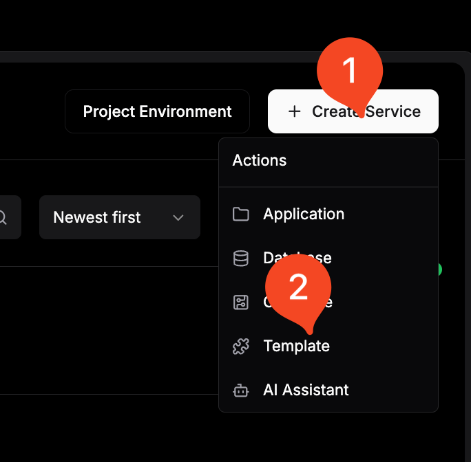
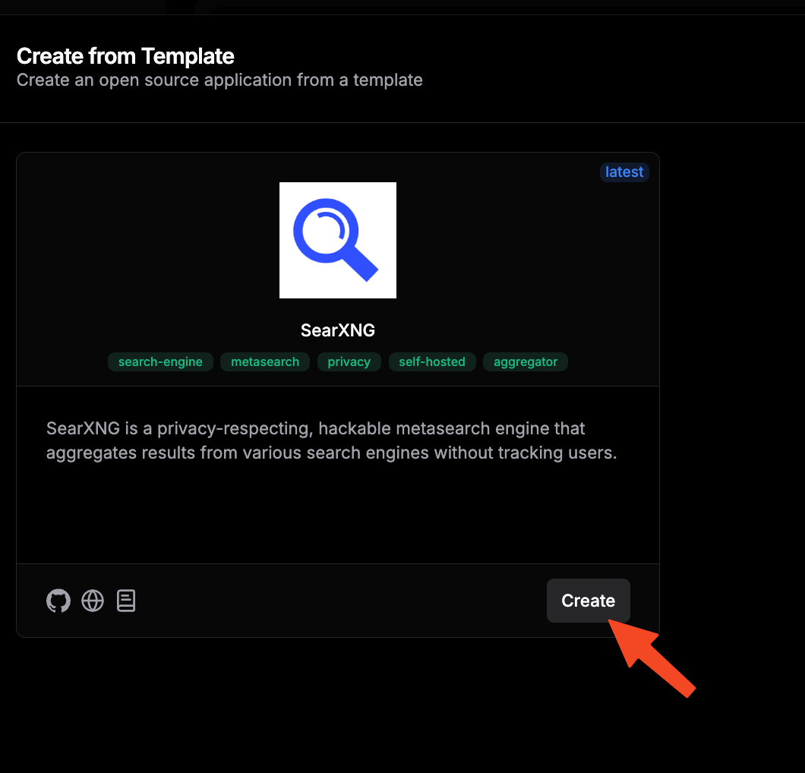

In an increasingly interconnected digital landscape, managing workflows across multiple applications and services has become both essential and challenging. Whether you're automating document processing, synchronizing data between platforms, or creating complex business logic flows, having the right automation tool can transform your productivity.

**n8n** emerges as a powerful solution—an open-source, self-hosted workflow automation platform that puts you in complete control of your data while offering enterprise-grade capabilities. Think of it as your personal automation powerhouse that rivals commercial solutions like Zapier or Microsoft Power Automate, but with unlimited customization potential and zero recurring costs.

## What is n8n and How Can It Transform Your Automation Experience?

**n8n** (pronounced "nodemation") is a fair-code licensed workflow automation tool that enables you to connect various services and automate repetitive tasks through an intuitive visual interface. Built with flexibility and extensibility at its core, n8n empowers both technical and non-technical users to create sophisticated automation workflows.

The platform's architecture centers around nodes—individual components that perform specific functions—connected together to form powerful automation sequences. What sets n8n apart is its commitment to transparency, self-hosting capabilities, and the freedom to modify the source code to meet your specific requirements.

### Key Benefits of n8n

<ListCheck>

- **Visual Workflow Builder**: Design complex automations using an intuitive drag-and-drop interface that makes workflow creation accessible to everyone

- **400+ Built-in Integrations**: Connect seamlessly to popular services including Google Workspace, Microsoft 365, Slack, GitHub, databases, and countless APIs

- **Custom JavaScript Nodes**: Execute custom code when pre-built nodes aren't sufficient, enabling unlimited workflow possibilities

- **Webhook Support**: Trigger workflows instantly from external events, creating real-time responsive automations

- **Advanced Flow Control**: Implement conditional logic, loops, error handling, and parallel processing for sophisticated workflow management

- **Queue Mode**: Handle high-volume operations efficiently with built-in queuing and retry mechanisms

- **Credential Management**: Securely store and manage API keys, tokens, and authentication details with encryption

- **Version Control Integration**: Track workflow changes and collaborate with team members using Git-based versioning

- **Self-Hosted Privacy**: Maintain complete control over your data without relying on third-party cloud services

- **Extensive API**: Programmatically manage workflows, executions, and configurations through comprehensive REST APIs

- **Multi-Environment Support**: Deploy across development, staging, and production environments with environment-specific configurations

- **Active Community**: Benefit from regular updates, community-contributed nodes, and extensive documentation

</ListCheck>

The project maintains an open-source approach with additional enterprise features available for organizations requiring advanced capabilities. You can explore the codebase and contribute at the [official GitHub repository](https://github.com/n8n-io/n8n) or visit their [website](https://n8n.io) for comprehensive documentation.

### How n8n Works

n8n operates on a node-based architecture where each node represents a specific function or service integration. Workflows are created by connecting these nodes in a logical sequence, with data flowing from one node to the next.

| Component Type | Purpose | Use Cases |
|---------------|---------|-----------|
| **Trigger Nodes** | Initiate workflow execution | Webhook requests, scheduled tasks, file changes, email arrivals |
| **Regular Nodes** | Perform actions and transformations | API calls, data processing, file operations, notifications |
| **Control Nodes** | Manage workflow logic | Conditional branching, loops, error handling, data merging |
| **Code Nodes** | Execute custom scripts | Complex calculations, data transformations, custom API integrations |
| **Sub-workflow Nodes** | Reference other workflows | Modular design, reusable components, complex orchestration |

This modular approach enables you to build everything from simple data synchronization tasks to complex multi-step business processes involving multiple systems and decision points.

## Prerequisites

Before diving into the n8n installation process, ensure your environment meets the necessary requirements for optimal performance and security.

<Notice type="info" title="System Requirements">

n8n is lightweight but benefits from adequate resources, especially when handling complex workflows or multiple concurrent executions.

</Notice>

**Essential Requirements:**

- **Server Infrastructure**: A reliable VPS or dedicated server. We recommend [Hetzner](https://go.bitdoze.com/hetzner) for excellent performance and value. Alternatively, consider a [Mini PC as Home Server](https://www.bitdoze.com/best-mini-pc-home-server/) for local deployments
- **Operating System**: Linux-based system (Ubuntu 20.04+ recommended) with Docker support
- **Domain Name**: A registered domain for accessing your n8n instance (e.g., n8n.yourdomain.com)
- **SSL Certificate**: For secure HTTPS access to your workflows and webhook endpoints

**Technical Prerequisites:**

- **Reverse Proxy Setup**: Traefik configured with Docker - follow our comprehensive guides:
  - [How to Use Traefik as A Reverse Proxy in Docker](https://www.bitdoze.com/traefik-proxy-docker/)
  - [Traefik FREE Let's Encrypt Wildcard Certificate With CloudFlare Provider](https://www.bitdoze.com/traefik-wildcard-certificate/)
- **Container Management**: Docker and Docker Compose installed on your server
- **Optional Management UI**: Dockge for simplified container management - see [Dockge - Portainer Alternative for Docker Management](https://www.bitdoze.com/dockge-install/)

**Recommended Specifications:**

| Component | Minimum | Recommended | Enterprise |
|-----------|---------|-------------|------------|
| **CPU** | 2 cores | 4 cores | 8+ cores |
| **RAM** | 2GB | 4GB | 8GB+ |
| **Storage** | 20GB SSD | 50GB SSD | 100GB+ NVMe |
| **Network** | 100 Mbps | 1 Gbps | 10 Gbps |

<Notice type="warning" title="Performance Considerations">

Complex workflows with multiple API calls, large data processing, or frequent executions may require higher specifications. Monitor resource usage and scale accordingly.

</Notice>

## Setup Option 1: Docker & Docker Compose (Standalone)

This straightforward approach is perfect for getting started quickly or for development environments where you need direct access to n8n without additional proxy layers.

### Step 1: Create Project Directory

Begin by establishing a dedicated directory structure for your n8n installation:

```bash
mkdir -p ~/n8n-automation && cd ~/n8n-automation
```

This creates a clean workspace where all n8n-related files will be organized and easily manageable.

### Step 2: Create Docker Compose Configuration

Create a comprehensive Docker Compose file that includes both n8n and Redis for optimal performance:

```yaml
version: '3.8'

services:
  n8n:
    image: docker.n8n.io/n8nio/n8n:latest
    container_name: n8n-app
    restart: unless-stopped
    ports:
      - '5678:5678'
    environment:
      - VUE_APP_URL_BASE_API=http://localhost:5678
      - N8N_EDITOR_BASE_URL=http://localhost:5678
      - WEBHOOK_URL=http://localhost:5678
      - GENERIC_TIMEZONE=UTC
      - N8N_ENCRYPTION_KEY=${N8N_ENCRYPTION_KEY}
      - N8N_ENFORCE_SETTINGS_FILE_PERMISSIONS=true
      - DB_TYPE=sqlite
      - N8N_LOG_LEVEL=info
      - N8N_LOG_OUTPUT=console
      - EXECUTIONS_DATA_PRUNE=true
      - EXECUTIONS_DATA_MAX_AGE=168
    volumes:
      - ./data:/home/node/.n8n
      - ./files:/files
      - ./custom-nodes:/opt/custom-nodes
    cap_drop:
      - ALL
    cap_add:
      - SETUID
      - SETGID
      - CHOWN
      - DAC_OVERRIDE
    depends_on:
      redis:
        condition: service_healthy
    healthcheck:
      test: ['CMD', 'wget', '--no-verbose', '--tries=1', '--spider', 'http://localhost:5678/healthz']
      interval: 30s
      timeout: 10s
      retries: 3
      start_period: 40s

  redis:
    container_name: n8n-redis
    image: redis:7-alpine
    command: redis-server --appendonly yes --maxmemory 512mb --maxmemory-policy allkeys-lru
    restart: unless-stopped
    volumes:
      - redis-data:/data
    cap_drop:
      - ALL
    cap_add:
      - SETUID
      - SETGID
      - CHOWN
      - DAC_OVERRIDE
    healthcheck:
      test: ['CMD', 'redis-cli', 'ping']
      interval: 15s
      timeout: 5s
      retries: 3
      start_period: 30s

volumes:
  redis-data:
    driver: local
```

### Step 3: Initialize Configuration Directory

Set up the necessary directories and generate a secure encryption key:

```bash
# Create required directories
mkdir -p {data,files,custom-nodes}

# Generate a secure encryption key
echo "N8N_ENCRYPTION_KEY=$(openssl rand -base64 32)" > .env

# Set proper permissions
chmod 700 data
chmod 755 files custom-nodes
```

<Notice type="info" title="Encryption Key Security">

The encryption key is crucial for securing credentials and sensitive data. Store it safely and use the same key when migrating or backing up your n8n instance.

</Notice>

### Step 4: Launch n8n

Start your n8n instance and verify the deployment:

```bash
# Launch the containers
docker compose up -d

# Verify containers are running
docker compose ps

# Check logs for any issues
docker compose logs -f n8n
```

### Step 5: Access Your Automation Platform

Navigate to `http://localhost:5678` in your web browser. You'll be greeted with the n8n setup wizard where you can:

- Create your administrator account
- Configure basic settings
- Start building your first workflow

<Notice type="success" title="Installation Complete">

Your n8n instance is now operational! You can begin creating powerful automation workflows immediately.

</Notice>

## Setup Option 2: Traefik & Dockge Integration

This professional setup provides automatic HTTPS certificates, domain routing, and simplified management through Dockge's intuitive interface—ideal for production environments.

<Notice type="info" title="Prerequisites Check">

Ensure you have Traefik configured with wildcard certificates using our [comprehensive guide](https://www.bitdoze.com/traefik-wildcard-certificate/). This setup assumes you're using CloudFlare as your DNS provider.

</Notice>

### Step 1: Prepare Traefik Network

Establish the external network that Traefik uses for service discovery:

```bash
# Create the Traefik network if it doesn't exist
docker network create traefik-net 2>/dev/null || echo "Network already exists"

# Verify network creation
docker network ls | grep traefik-net
```

### Step 2: Enhanced Docker Compose with Traefik Labels

Create a production-ready configuration with automatic SSL and domain routing:

```yaml
version: '3.8'

networks:
  traefik-net:
    external: true

services:
  n8n:
    image: docker.n8n.io/n8nio/n8n:latest
    container_name: n8n-production
    environment:
      - VUE_APP_URL_BASE_API=https://n8n.yourdomain.com
      - N8N_EDITOR_BASE_URL=https://n8n.yourdomain.com
      - WEBHOOK_URL=https://n8n.yourdomain.com
      - GENERIC_TIMEZONE=UTC
      - N8N_ENCRYPTION_KEY=${N8N_ENCRYPTION_KEY}
      - N8N_ENFORCE_SETTINGS_FILE_PERMISSIONS=true
      - DB_TYPE=sqlite
      - N8N_LOG_LEVEL=warn
      - N8N_LOG_OUTPUT=file
      - EXECUTIONS_DATA_PRUNE=true
      - EXECUTIONS_DATA_MAX_AGE=336
      - N8N_METRICS=true
      - QUEUE_BULL_REDIS_HOST=redis
      - QUEUE_BULL_REDIS_PORT=6379
    volumes:
      - ./data:/home/node/.n8n
      - ./files:/files
      - ./logs:/var/log/n8n
    networks:
      - traefik-net
    depends_on:
      redis:
        condition: service_healthy
    restart: unless-stopped
    labels:
      - "traefik.enable=true"
      - "traefik.http.routers.n8n.rule=Host(`n8n.yourdomain.com`)"
      - "traefik.http.routers.n8n.entrypoints=https"
      - "traefik.http.routers.n8n.tls=true"
      - "traefik.http.routers.n8n.tls.certresolver=letsencrypt"
      - "traefik.http.services.n8n.loadbalancer.server.port=5678"
      - "traefik.http.routers.n8n.middlewares=security-headers@file"

  redis:
    container_name: n8n-redis-prod
    image: redis:7-alpine
    command: redis-server --appendonly yes --maxmemory 1gb --maxmemory-policy allkeys-lru --save 900 1
    restart: unless-stopped
    networks:
      - traefik-net
    volumes:
      - redis-data:/data
      - ./redis-config:/usr/local/etc/redis
    cap_drop:
      - ALL
    cap_add:
      - SETUID
      - SETGID
      - CHOWN
      - DAC_OVERRIDE
    healthcheck:
      test: ['CMD', 'redis-cli', 'ping']
      interval: 30s
      timeout: 5s
      retries: 5
      start_period: 30s

volumes:
  redis-data:
    driver: local
```

### Step 3: Deploy Through Dockge

If you're using Dockge for container management:

1. **Access Dockge Interface**: Navigate to your Dockge installation
2. **Create New Stack**: Click "Create Stack" and name it "n8n-production"
3. **Paste Configuration**: Copy the Docker Compose content above
4. **Configure Environment**: Add your encryption key and domain settings
5. **Deploy Stack**: Click deploy and monitor the deployment logs

<Button text="Deploy via Dockge" size="lg" color="green" variant="solid" icon="arrow-right" iconPosition="right" />

### Step 4: Configure Domain DNS

Update your DNS records to point to your server:

| Record Type | Name | Value | TTL |
|-------------|------|-------|-----|
| A | n8n | YOUR_SERVER_IP | 300 |
| AAAA | n8n | YOUR_IPv6_ADDRESS | 300 |

<Notice type="info" title="DNS Propagation">

DNS changes may take up to 24 hours to propagate globally. Use tools like `nslookup` or online DNS checkers to verify propagation.

</Notice>

## Setup Option 3: Dokploy Easy Deployment

Dokploy offers the simplest deployment method with a user-friendly interface that handles most configuration automatically—perfect for users who prefer GUI-based management.

### Step 1: Install Dokploy

Follow our comprehensive [Dokploy installation guide](https://www.bitdoze.com/dokploy-install/) to set up this modern deployment platform on your server.

### Step 2: Create n8n Application

1. **Access Dokploy Dashboard**: Log into your Dokploy instance
2. **Create New Project**: Click "New Project" and name it "n8n-automation"
3. **Select Template**: Choose "n8n" from the available templates or use Docker Compose mode
4. **Configure Basic Settings**: Set your application name and description




### Step 3: Configure Environment Variables

Set up essential environment variables for optimal n8n operation:

| Variable Name | Value | Description |
|---------------|-------|-------------|
| `VUE_APP_URL_BASE_API` | `https://n8n.yourdomain.com` | Frontend API endpoint |
| `N8N_EDITOR_BASE_URL` | `https://n8n.yourdomain.com` | Editor interface URL |
| `WEBHOOK_URL` | `https://n8n.yourdomain.com` | Webhook endpoint base |
| `GENERIC_TIMEZONE` | `UTC` | Server timezone |
| `N8N_ENCRYPTION_KEY` | `your_generated_key` | Encryption key for credentials |
| `N8N_LOG_LEVEL` | `info` | Logging verbosity |
| `EXECUTIONS_DATA_PRUNE` | `true` | Enable execution cleanup |
| `EXECUTIONS_DATA_MAX_AGE` | `168` | Keep executions for 7 days |

<Notice type="warning" title="Environment Security">

Ensure your encryption key is strong and unique. Never reuse keys across different n8n instances or environments.

</Notice>


### Step 4: Domain Configuration

1. **Add Domain**: In Dokploy, navigate to your n8n application settings
2. **Configure SSL**: Enable automatic SSL certificate generation
3. **Set Domain**: Enter your chosen subdomain (e.g., n8n.yourdomain.com)
4. **Verify DNS**: Ensure your domain points to the Dokploy server


### Step 5: Deploy Application

1. **Review Configuration**: Double-check all settings and environment variables
2. **Deploy**: Click the deploy button and monitor the deployment process
3. **Access Application**: Once deployed, access your n8n instance via the configured domain


<Button text="Launch n8n Deployment" size="xl" color="blue" variant="solid" icon="arrow-right" iconPosition="right" />


## Monitoring and Maintenance

Establish robust monitoring and maintenance practices to ensure your n8n instance operates reliably and efficiently over time.

### Health Monitoring

Implement comprehensive health checks to monitor your n8n deployment:

```yaml
healthcheck:
  test: ['CMD', 'wget', '--no-verbose', '--tries=1', '--spider', 'http://localhost:5678/healthz']
  interval: 30s
  timeout: 10s
  retries: 3
  start_period: 60s
```

**Key Metrics to Monitor:**

| Metric | Description | Alert Threshold |
|--------|-------------|-----------------|
| **Response Time** | API endpoint response times | > 5 seconds |
| **Memory Usage** | Container memory consumption | > 80% |
| **CPU Usage** | Processing load | > 85% sustained |
| **Disk Space** | Storage utilization | > 90% |
| **Failed Executions** | Workflow failure rate | > 10% |
| **Queue Length** | Pending workflow executions | > 100 items |

### Regular Maintenance Tasks

Establish a maintenance schedule to keep your n8n instance running smoothly:

**Weekly Tasks:**
- Review execution logs for errors
- Check storage usage and clean old executions
- Verify backup integrity
- Update workflow documentation

**Monthly Tasks:**
- Update n8n to the latest stable version
- Review and optimize workflow performance
- Audit user access and permissions
- Analyze usage patterns and resource requirements

**Quarterly Tasks:**
- Comprehensive security audit
- Disaster recovery testing
- Performance benchmarking
- Infrastructure capacity planning

### Backup Strategies

Implement a comprehensive backup strategy to protect your automation workflows and data:

```bash
#!/bin/bash
# n8n Backup Script

BACKUP_DIR="/backups/n8n"
DATE=$(date +%Y%m%d_%H%M%S)
N8N_DATA_DIR="./data"

# Create backup directory
mkdir -p $BACKUP_DIR

# Backup n8n data
tar -czf $BACKUP_DIR/n8n_data_$DATE.tar.gz $N8N_DATA_DIR

# Backup Docker Compose configuration
cp docker-compose.yml $BACKUP_DIR/docker-compose_$DATE.yml
cp .env $BACKUP_DIR/env_$DATE.backup

# Clean old backups (keep last 30 days)
find $BACKUP_DIR -name "*.tar.gz" -mtime +30 -delete

echo "Backup completed: n8n_data_$DATE.tar.gz"
```


## Conclusion

Self-hosting n8n transforms your approach to workflow automation by providing unprecedented control, privacy, and customization capabilities. Throughout this comprehensive guide, we've explored three distinct setup methods—from simple Docker deployments to sophisticated Traefik integrations and user-friendly Dokploy implementations—ensuring you can choose the approach that best matches your technical expertise and infrastructure requirements.

**Key Advantages of Self-Hosting n8n:**

<ListCheck>

- **Complete Data Control**: Your sensitive workflows and data remain entirely under your jurisdiction
- **Unlimited Scalability**: Scale resources and capabilities based on your specific needs without artificial limitations
- **Cost Effectiveness**: Eliminate recurring subscription fees while gaining enterprise-grade functionality
- **Customization Freedom**: Modify, extend, and integrate n8n to perfectly match your unique requirements
- **Privacy Assurance**: No third-party access to your automation logic or processed data
- **Integration Flexibility**: Connect any service or system without external restrictions

</ListCheck>

Whether you're automating document processing workflows, synchronizing data between business systems, or creating complex multi-step processes, n8n provides the foundation for building robust, reliable automation solutions that grow with your needs.

**Next Steps:**

1. **Start Small**: Begin with simple workflows to familiarize yourself with n8n's capabilities
2. **Explore Integrations**: Test connections to your most frequently used services
3. **Build Complexity**: Gradually create more sophisticated workflows as your confidence grows
4. **Share Knowledge**: Contribute to the n8n community and learn from other users' experiences
5. **Scale Thoughtfully**: Monitor performance and scale your infrastructure as workflow complexity increases

<Button text="Begin Your Automation Journey" size="xl" color="green" variant="solid" icon="arrow-right" iconPosition="right" />

The power of workflow automation awaits—start building your digital efficiency engine today with n8n and transform how you handle repetitive tasks, data integration, and business process automation. Your future self will thank you for the time and effort saved through intelligent automation.

For additional guidance on Docker containerization and related technologies, explore our extensive collection of [self-hosting guides](https://www.bitdoze.com/best-self-hosted-panels/) and [Docker tutorials](https://www.bitdoze.com/docker-containers-home-server/).
