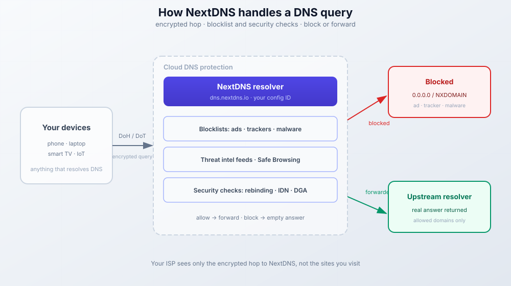

import Button from "@components/widgets/Button.astro";
import Notice from "@components/widgets/Notice.astro";
import ListCheck from "@components/widgets/ListCheck.astro";
import Tabs from "@components/widgets/Tabs.astro";
import Tab from "@components/widgets/Tab.astro";
import Accordion from "@components/widgets/Accordion.astro";

Here's my NextDNS review after nearly two years running [NextDNS](https://go.bitdoze.com/nextdns) across my whole network. No ads in my phone apps, no tracking scripts loading in the background, and my ISP sees nothing but encrypted queries to NextDNS servers. This is the 2026 pass: what's new since my first look, how to set it up, what it costs, and where it falls down.

<Button text="Try NextDNS Free" link="https://go.bitdoze.com/nextdns" variant="solid" color="blue" size="lg" external={true} icon="rocket-launch" />

## What NextDNS Does

NextDNS sits between your devices and the internet. Every time you visit a website, your device asks "where is example.com?" and NextDNS answers. The difference from your ISP's default DNS is that NextDNS encrypts these queries and checks them against blocklists before responding. That is cloud DNS protection in one sentence: DNS-level ad blocking, malware domains that return empty answers, and no plaintext query log sitting at your ISP.

Because the check happens at the resolver, it covers every device on the network. Smart TVs, game consoles, printers, IoT gadgets. Things that will never run a browser extension get the same filtering as your laptop.



<Notice type="info" title="Want the full technical breakdown?">

I wrote a detailed guide covering both NextDNS and self-hosted alternatives with AdGuard Home. It explains DNS encryption protocols, setup options, and when to choose each approach.

<Button text="Read the Complete DNS Protection Guide" link="/block-ads-malware-dns-protection/" variant="outline" color="blue" size="md" icon="book-open" />

</Notice>

<Notice type="warning" title="Chrome killed classic ad blockers">

Chrome fully removed Manifest V2 in mid-2025 (Chrome 138 in July 2025, and the enterprise policy that kept it alive was dropped in Chrome 139). Classic uBlock Origin is gone from Chrome. What's left at the browser level is MV3 extensions like uBlock Origin Lite. DNS-level blocking is the part that didn't change: NextDNS keeps ads blocked in every browser, extension or not, and it pairs fine with uBlock Origin Lite.

<Button text="Block Ads After Manifest V3 with NextDNS" link="/block-ads-manifest-v3-nextdns/" variant="outline" color="green" size="md" icon="arrow-right" />

</Notice>

## What's New in NextDNS (2025–2026)

Everything here shipped after my original write-up. I have not gone hands-on with each toggle yet, so treat this as a changelog with pointers to where each setting lives.

### Bypass Age Verification

Shipped in August 2025 and available on every plan, including Free. NextDNS describes it as a way around age-verification walls, the ID or selfie checks some sites now demand, using DNS tricks on a preset list of domains. The privacy argument is straightforward: you shouldn't have to upload a passport to read a website, and this pushes back on the wave of ID mandates like the UK Online Safety Act.

The toggle sits in profile Settings at `my.nextdns.io/$id/settings`. Family admins should know it is there. If you want age checks to keep working on a kid's profile, leave it off. It's per-profile, so one config can use it while another doesn't.

### Log Data Residency

You now choose where NextDNS stores your logs: the United States, the European Union, the United Kingdom, or Switzerland. If you've been filing GDPR paperwork or answering "where does this data live" questions, this closes a real gap in the cloud DNS protection story. Your filtered query logs can stay in your jurisdiction.

<Notice type="info" title="Keeping data in the EU?">

Residency settings are one half of the picture. Plenty of operators take the next step and start [self-hosting more of their privacy stack, like a private Chat Control-proof chat server](/chatto-self-hosted/). Same logic, more control.

</Notice>

### Tracker Insights and Expanded Analytics

Analytics now includes Tracker Insights. NextDNS says it shows who is tracking you and how much of your web traffic those trackers capture. It sits on top of the existing views I already liked: top blocked domains, queries by device, and the GAFAM breakdown. I cover the dashboard in the features section below.

## NextDNS Features

Here's what you get and what each feature actually does.

### Security Features

The security tab is now 11 toggles. Three are new since my first review (Parked Domains, Top-Level Domains, and CSAM protection).

| Feature | What It Does |
|---------|--------------|
| **Threat Intelligence Feeds** | Blocks domains flagged by security researchers as hosting malware, phishing, or command-and-control servers |
| **Google Safe Browsing** | Taps into Google's database of dangerous sites, updated constantly |
| **Cryptojacking Protection** | Stops websites from using your CPU to mine cryptocurrency in the background |
| **DNS Rebinding Protection** | Prevents attackers from using DNS to access your local network devices |
| **IDN Homograph Protection** | Blocks fake domains that use lookalike characters (like using "rn" to fake "m") |
| **Typosquatting Protection** | Catches common misspellings of popular domains that scammers register |
| **DGA Protection** | Blocks randomly generated domains that malware uses to phone home |
| **NRD (Newly Registered Domains)** | Optionally blocks domains registered in the last 30 days, which are often used for attacks |
| **Parked Domains** | Blocks parked and for-sale domains that serve no purpose but ads and malware |
| **Top-Level Domains Blocking** | Lets you block entire TLDs that are mostly abuse (some `.xyz` and `.top` style zones) |
| **CSAM Protection** | Blocks domains on CSAM blocklists |

### Privacy Features and Blocklists

| Feature | What It Does |
|---------|--------------|
| **Blocklists** | Choose from dozens of community-maintained lists that block ads, trackers, and malware domains |
| **Native Tracking Protection** | Blocks telemetry from Apple, Windows, Samsung, Xiaomi, Huawei, Amazon, and Roku devices |
| **Affiliate & Tracking Links** | Blocks tracking redirects and affiliate link services |
| **Disguised Trackers** | Catches trackers that use CNAME cloaking to hide as first-party domains |

For blocklists, the catalog is large (84 lists and actively maintained in [nextdns/blocklists](https://github.com/nextdns/blocklists)). You don't need most of them. Two or three lists with good overlap beats ten lists that add false positives for no extra coverage.

My picks, from safest to most aggressive:

- **NextDNS Recommended** - the vendor's own curated set. The right starting point if you don't want to think about it.
- **OISD** - the go-to community list. Blocks most ads and trackers without breaking sites.
- **AdGuard DNS filter** - well-maintained, good balance.
- **Steven Black's Unified Hosts** - another solid option with multiple variants.
- **HaGeZi Multi** - comes in Normal, Pro, Pro Plus, and Ultimate. This is the ladder to climb if you want more blocking and are willing to allowlist more breakage.

Under **Native Tracking Protection**, enable blocking for the device types you own. Apple devices, enable Apple. Windows PCs, enable Windows.

### Parental Controls

| Feature | What It Does |
|---------|--------------|
| **Website Categories** | Block entire categories: porn, gambling, dating, piracy, social media, etc. |
| **Recreation Time** | Set schedules when blocked categories become accessible |
| **Safe Search** | Forces safe search on Google, Bing, DuckDuckGo, and YouTube |
| **YouTube Restricted Mode** | Enables YouTube's built-in content filter |
| **Block Bypass Methods** | Prevents kids from using VPNs, proxies, or other DNS services to bypass your rules |

### Denylist and Allowlist

You can manually block or allow specific domains. The allowlist overrides blocklists when legitimate services get caught. The denylist lets you block domains that aren't on any list. This is the first place to go when something breaks (or when something annoying doesn't).

### Analytics

The dashboard shows total queries and percentage blocked, top blocked domains, top allowed domains, queries by device (if you name them), queries over time, and the GAFAM traffic breakdown. Tracker Insights (the 2026 addition) layers the "who is tracking you" view on top of that.

### Logs, Retention and Data Residency

Query logs show every DNS request with timestamps, device info, and whether it was blocked or allowed. Retention is selectable from one hour up to two years, or you can disable logging completely. Storage location is your choice: United States, European Union, United Kingdom, or Switzerland.

Honesty note on "no logs": even with logging off, the live query view in the dashboard still shows requests while you're looking at it. That's not retention, but it's not invisible either.

### More Settings Worth Knowing

A few settings that don't fit the tables but matter:

- **DNSSEC** - automatic validation of DNS answers.
- **Rewrites** - override the DNS response for any domain. This is the split-horizon tool for home labs. Point `home.example.com` at `192.168.1.10` without running a local DNS server.
- **Block Page** - show a page when domains are blocked (I disable this).
- **Anonymized EDNS Client Subnet** - hides your IP from upstream resolvers.
- **Cache Boost** - improves response times.
- **Query Name Minimisation** - enforced, sends only what's needed in each query.

Handshake (an experimental peer-to-peer naming system) is there too if you want to poke at it.

## How to Set Up NextDNS

The whole happy path is seven steps. Budget ten minutes.

<ListCheck>

- A NextDNS account (the free tier works for this)
- Admin access to whatever you'll point at NextDNS: router, device, or browser
- Ten minutes and one device to verify with

</ListCheck>

### Step 1: Create Your Account

1. Go to [NextDNS](https://go.bitdoze.com/nextdns) and click **Try it now**
2. Sign up with your email
3. You'll get a unique Configuration ID (something like `abc123`)

This ID is your profile. You can create multiple profiles for different use cases.

### Step 2: Configure Your Security Settings

In the **Security** tab, enable the protections you want:

```
Recommended settings:
- Threat Intelligence Feeds: ON
- Google Safe Browsing: ON
- Cryptojacking Protection: ON
- DNS Rebinding Protection: ON
- IDN Homograph Attacks Protection: ON
- Typosquatting Protection: ON
```

NRD (Newly Registered Domains) blocking is aggressive. It can break legitimate new services, so I leave it off unless I'm setting up a network for non-technical users. Same story for whole-TLD blocks and HaGeZi Ultimate. Dial those in later, not on day one.

### Step 3: Add Your Blocklists

In the **Privacy** tab, click **Add a blocklist** and choose from the list. Start with **NextDNS Recommended** if you want zero decisions, or add two or three from the OISD / AdGuard DNS filter / Steven Black set. If you want more blocking and don't mind allowlisting, climb the HaGeZi Multi ladder (Normal, then Pro).

Under **Native Tracking Protection**, enable blocking for the device types you own.

### Step 4: Set Up Parental Controls (Optional)

Skip this if you don't have kids on the network. Otherwise, the **Parental Control** tab lets you:

1. Block categories (porn, gambling, social media, etc.)
2. Set recreation times when blocks lift
3. Force safe search on search engines
4. Block bypass methods so VPNs and proxies don't work

If you use these, also check the Bypass Age Verification toggle in Settings and decide whether you want it on.

### Step 5: Connect Your Devices

NextDNS gives you several connection methods. Pick based on what you're protecting.

<Tabs>
<Tab name="Router (whole network)">
Change your router's DNS settings to use NextDNS. If your router supports DNS-over-HTTPS:

```
DNS-over-HTTPS: https://dns.nextdns.io/YOUR_CONFIG_ID
```

If it doesn't support DoH, use the linked IP addresses from your NextDNS dashboard. One change covers every device on the network, including smart TVs and IoT.

Some ISPs force their own DNS on the WAN side. If that's yours, plain router DNS settings won't be enough, and you'll need one of the other methods in this section.
</Tab>
<Tab name="Apps (per device)">
Download the NextDNS app:

- **iOS/Android**: Install from App Store or Play Store, enter your Configuration ID
- **Windows/Mac**: Download from nextdns.io, runs as a system service
- **Linux**: Install via their shell script or package manager:

```bash
sh https://nextdns.io/install
```

The installer auto-detects OS and architecture and pulls the latest release (v1.47.x as of mid-2026). This is also the way to run NextDNS as a local caching resolver on a Linux box or router.
</Tab>
<Tab name="Browser only">
Firefox and Chrome support DNS-over-HTTPS natively:

- Firefox: Settings > Privacy & Security > DNS over HTTPS > Custom > `https://dns.nextdns.io/YOUR_CONFIG_ID`
- Chrome: Settings > Privacy and security > Security > Use secure DNS > Custom > same URL

This covers browser traffic only. Apps and system services keep using whatever DNS the OS has.
</Tab>
<Tab name="Android Private DNS (DoT)">
Android's built-in **Private DNS** (DNS-over-TLS) is the most reliable way to cover all Android traffic, browser and non-browser, without installing the app.

Settings > Network & internet > Private DNS > Private DNS provider hostname:

```
YOUR_CONFIG_ID.dns.nextdns.io
```

Grab the exact hostname from the Setup tab in your dashboard. It's shown next to the Android option.

**Common failure mode:** the Private DNS field takes a hostname only. If you paste the full DoH URL (`https://dns.nextdns.io/...`), Android shows "couldn't connect". Hostname only.
</Tab>
</Tabs>

### Step 6: Verify It's Working

1. Visit [test.nextdns.io](https://test.nextdns.io). You should see "All good! You are using NextDNS"
2. From a terminal, the same check returns JSON:

```bash
curl -s https://test.nextdns.io
{"status":"ok","protocol":"DOH","profile":"abc123",...}   # using NextDNS
{"status":"unconfigured",...}                             # NOT using NextDNS
```

3. Check your dashboard. Queries should start appearing in the logs within a minute.

**If the test fails:** double-check your DNS settings. On some networks, the ISP forces their DNS and you'll need DoH, DoT, or the native app to bypass that. Browser DoH won't cover non-browser apps. A VPN that overrides DNS will also send queries past NextDNS until you point the VPN's DNS at your config.

### Step 7: Fine-Tune Your Settings

After a few days of use, check your logs:

- If legitimate sites break, add them to your allowlist
- If annoying domains slip through, add them to your denylist
- Adjust blocklists if you're seeing too many false positives

The **Settings** tab has the rest: log retention (one hour to two years, or off), log data residency, DNSSEC, Rewrites, Block Page, Anonymized EDNS Client Subnet, and Cache Boost. I cover these in the features section above rather than repeating the list.

## Running NextDNS Day-to-Day (Troubleshooting & Ops)

This is the section most reviews skip, and it's the part that matters once NextDNS becomes a dependency.

### Free-Tier Quota Exhaustion (Silent Degradation)

The free plan gives you 300,000 queries per month. When you hit the limit, NextDNS does not error out. It keeps resolving, but blocking silently stops. Ads creep back in with no warning anywhere in the UI. That's the single worst UX of the free plan, and the reason a dashboard check is the first thing to do when "blocking stopped working."

To watch it before the cliff: the [NextDNS public API](https://nextdns.github.io/api/) exposes query counts and config data. A ten-line script polling it weekly is enough to get a warning instead of a surprise.

### When NextDNS Itself Is Down

<Notice type="warning" title="Plan a fallback resolver">

NextDNS doesn't run a public status page (there is no `status.nextdns.io` to check during an incident). A network pointed only at NextDNS loses filtering and name resolution when NextDNS has a problem. Mitigations: set a secondary traditional resolver as fallback (you lose filtering on that path but stay online), or run the NextDNS CLI locally with its cache. Quick health check: `curl -s https://test.nextdns.io`.

</Notice>

For a Linux router or VPS, the CLI path is:

```bash
sh https://nextdns.io/install
```

It's MIT-licensed, actively developed (v1.47.x, mid-2026), and caches locally so a NextDNS hiccup doesn't take your resolver down immediately.

### False Positives and Broken Sites

Occasionally a legitimate service gets caught by a blocklist. The usual culprits are the aggressive ones: NRD blocking, HaGeZi Ultimate, whole-TLD blocks. Cross-check back to Step 7. Dial the list back one notch rather than abandoning blocking, and allowlist the specific domain from the logs.

<ListCheck>

- `curl -s https://test.nextdns.io` returns `"status":"ok"` on your main networks
- Free-tier quota is watched (dashboard or API) before the 300K cliff
- A fallback resolver is configured if you can't afford DNS downtime
- Log retention and data residency are set deliberately, not left on defaults
- Aggressive lists (NRD, TLD blocks, HaGeZi Ultimate) are enabled only where you accept the breakage

</ListCheck>

## What I Like About NextDNS

### Setup Takes Five Minutes

Create an account, get a configuration ID, and point your devices at NextDNS servers. That's it. No server to manage, no Docker containers to maintain, no firewall rules to configure.

For router-level protection, you just change your DNS settings once and every device on your network gets coverage automatically. Smart TVs, gaming consoles, IoT devices, phones, laptops. Everything.

### The Blocking Works Well

I've been running OISD, AdGuard DNS filter, and Steven Black's list on my main profile for nearly two years. YouTube still shows some ads (those are harder to block at DNS level since they come from the same domains as videos), but everything else is clean:

- In-app ads on mobile games: gone
- Banner ads on websites: gone
- Tracking scripts from Facebook, Google Analytics, etc.: blocked
- Those annoying cookie consent popups on some sites: reduced

The dashboard shows what's being blocked in real time. Watching my smart TV phone home to analytics servers only to get blocked is oddly satisfying.

### Privacy Settings That Make Sense

You can configure NextDNS to keep zero logs. No retention of query data, no IP address storage, nothing. Or you can keep logs for debugging (helpful when something breaks) and delete them after a set period. And now you can pick which jurisdiction those logs live in.

The anonymized EDNS option hides your IP from upstream DNS resolvers. Combined with encrypted DNS protocols, this means neither your ISP nor the destination servers know exactly what you're doing.

### Multiple Configurations

You can create separate profiles for different use cases. I have one for my main network with aggressive blocking, another for my parents' house with safer defaults, and a third for testing when I need to bypass filters temporarily. Rewrites are per-profile too, which makes the home-lab split-horizon trick possible without touching anything global.

## What Could Be Better

### The Free Tier Limit

300,000 queries per month sounds like a lot until you realize how chatty modern devices are. A household with a few phones, a smart TV, and some IoT devices can burn through that in two weeks.

When you hit the limit, NextDNS stops filtering and just passes queries through. You still have DNS service, but without the blocking, and with no warning that it happened. If you're on the free tier and care about the blocking, watch your query count (the API makes this easy, see the ops section). The Pro plan removes the limit entirely.

### YouTube Ads Still Get Through

DNS-level blocking can't touch YouTube ads because they're served from the same domains as the actual video content. Blocking those domains would break YouTube entirely. You'll still need a browser extension alongside NextDNS for YouTube specifically. On Chrome that means uBlock Origin Lite now that classic uBlock Origin is gone with Manifest V2.

### Some Sites Break

Occasionally a legitimate service gets caught by blocklists. Affiliate links, certain CDNs, or obscure tracking domains that websites actually need to function. The allowlist feature handles this, but you need to notice the problem first and figure out which domain to unblock.

## NextDNS Pricing (2026): Free Tier, Pro, Business & Education

NextDNS pricing is short enough to fit in one table. This is what the pricing page renders as of September 2026 (it geo-renders, so EU visitors see EUR; it's roughly the same numerals elsewhere).

| Plan | Queries | Price |
|------|---------|-------|
| Free | 300,000/month | €0 (blocking stops past the quota) |
| Pro (personal + close family) | Unlimited | €1.99/month or €19.90/year (save 17%) |
| Business | Unlimited | €19.90/month per 50 employees or €199/year |
| Education | Unlimited | €19.90/month per 250 students or €199/year |

All prices are in EUR on the EU-rendered page. Cards, PayPal, and crypto accepted. Pro at €1.99/month (roughly $2, billed in your local currency) works out to under €24 a year for every device on your network. That's cheaper than most VPNs and, for daily browsing, arguably more useful.

The free tier works for testing or light personal use. Most households need Pro. The Business and Education tiers (which used to be "custom" quotes) are now listed prices with per-seat scaling.

<Button text="Try NextDNS Free" link="https://go.bitdoze.com/nextdns" variant="solid" color="blue" size="lg" external={true} icon="rocket-launch" />

## My Configuration (2026)

Here's what I'm running:

**Security tab:** Threat Intelligence Feeds, Google Safe Browsing, Cryptojacking, DNS Rebinding, IDN Homographs, and Typosquatting all on. NRD off, TLD blocking off, Parked Domains on.

**Privacy tab (blocklists):** OISD, AdGuard DNS filter, and Steven Black's Unified Hosts on the main profile. HaGeZi Multi Pro on the test profile when I want to see what tighter lists catch.

**Settings:** Logs at 1 hour retention (enough for debugging, no long tail), log residency in the EU, Anonymized EDNS on, Cache Boost on.

This catches most ads and trackers without breaking too many websites. I check the logs occasionally and allowlist domains when something legitimate gets blocked.

## Who Should Use NextDNS

<ListCheck>

- People who want ad blocking without managing servers
- Families who need protection across all devices
- Mobile users who want filtering outside their home network
- Anyone frustrated with ISP tracking
- Users who prefer paying a small fee over running infrastructure
- Homelabbers who want Rewrites and multiple profiles without running another container

</ListCheck>

## Who Should Look Elsewhere (NextDNS vs AdGuard Home and Others)

If you want complete control over your DNS infrastructure, the NextDNS vs AdGuard Home question is really managed convenience versus ownership. NextDNS gives you any-network coverage and someone else maintaining the service for about €2/month. AdGuard Home gives you unlimited queries, custom rules, and no subscription, and you own the uptime, the updates, and the blocklist curation.

AdGuard Home needs hardware to run on. [A cheap Hetzner VPS](https://go.bitdoze.com/hetzner) (a €4-5/month box is plenty) works if you want it reachable from everywhere. For something at home, check the [best home server mini PCs](/best-mini-pc-home-server/), [an ASUS mini PC like the DC510](https://go.bitdoze.com/asus-dc510) is more than enough, or run it on [a NAS or Proxmox homelab box](/best-nas-homelab-docker-proxmox/) you already have.

<Button text="See How NextDNS Compares to AdGuard Home" link="/block-ads-malware-dns-protection/" variant="outline" color="green" size="md" icon="arrow-right" />

Also compare Control D if you want per-device policies; I haven't reviewed it, so I won't pretend to tell you how it stacks up. And note that EU-friendly alternatives have thinned out: DNS0.EU shut down in October 2025 for lack of funding, so don't count on it as a live option.

The tradeoff with self-hosting is maintenance. You handle updates, monitor uptime, and troubleshoot when things break. NextDNS handles all that for you.

## NextDNS FAQ

<Accordion label="Does NextDNS block YouTube ads?" group="faq" expanded="true">
No. YouTube ads are served from the same domains as the video content, so blocking them at the DNS level would break YouTube itself. You need a browser extension alongside NextDNS for YouTube. On Chrome, that means uBlock Origin Lite, since classic uBlock Origin was removed along with Manifest V2 in mid-2025.
</Accordion>

<Accordion label="Is the NextDNS free tier enough for a household?" group="faq">
Usually not. 300,000 queries is roughly two weeks for a chatty household with phones, a smart TV, and IoT devices. Past the cap, blocking silently stops while resolution keeps working, so the failure mode is ads creeping back rather than an error. The Pro plan (€1.99/month) removes the limit.
</Accordion>

<Accordion label="Where are NextDNS logs stored?" group="faq">
Wherever you choose. NextDNS offers storage in the United States, European Union, United Kingdom, or Switzerland, with retention from one hour up to two years, or logging disabled completely. The setting lives in the profile Settings tab.
</Accordion>

<Accordion label="Does NextDNS work with a VPN or Tailscale?" group="faq">
Yes, with caveats. A VPN that overrides system DNS will send queries past NextDNS until you point the VPN's DNS at your config. Tailscale is the easy case: there's an official NextDNS integration, so you can use NextDNS everywhere you use Tailscale. If you run your own mesh, [self-host your Tailscale control server with Headscale](/headscale-self-hosted-tailscale-setup/) or work out [which mesh VPN fits your network](/netbird-vs-headscale-vs-tailscale/) first.
</Accordion>

<Accordion label="What is Bypass Age Verification in NextDNS?" group="faq">
A profile setting shipped in August 2025 that works around age-verification ID checks (the upload-your-passport kind) for a preset list of domains using DNS tricks. It's available on all plans, including Free. The toggle lives in profile Settings at `my.nextdns.io/$id/settings`. Family admins should know it exists: if you want age checks to keep working on a kid's profile, leave it off there.
</Accordion>

## Final Thoughts

After nearly two years, NextDNS is still the DNS layer I run everywhere. The 2025 and 2026 additions (log data residency, Bypass Age Verification, Tracker Insights) mostly widen the lead over rolling your own resolver. The free tier is a useful demo, but Pro is the real product at pocket-change prices.

This NextDNS review keeps the same honest asterisks as before: YouTube ads still get through, occasional false positives need allowlisting, and there's no public status page to watch during an incident. Those are small problems against the convenience of encrypted, filtered DNS on every device you own, including the ones that can't run an extension.

If you want network-level ad blocking without the infrastructure headache, it's worth trying.

<Button text="Get Started with NextDNS" link="https://go.bitdoze.com/nextdns" variant="solid" color="blue" size="lg" external={true} icon="rocket-launch" />

---

**Related Articles:**
- [Manifest V3 Broke Your Ad Blocker? Block Ads Everywhere with NextDNS](/block-ads-manifest-v3-nextdns/)
- [How to Block Ads, Malware & Stop ISP Tracking with NextDNS and AdGuard Home](/block-ads-malware-dns-protection/)
- [Best 125+ Docker Containers for Home Server in 2026](/docker-containers-home-server/)
- [How to Self-Host SearXNG - Privacy-Focused Metasearch Engine](/searxng-self-host-privacy-search/)
