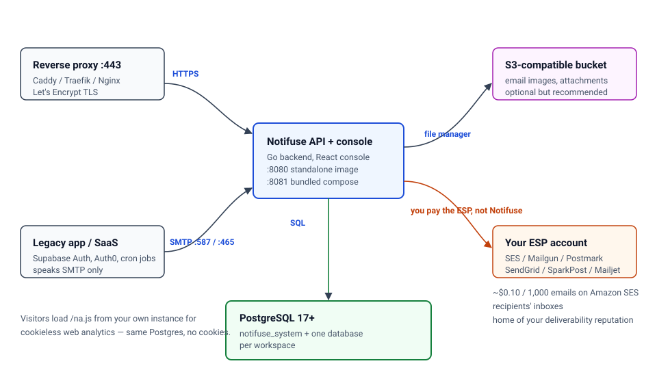
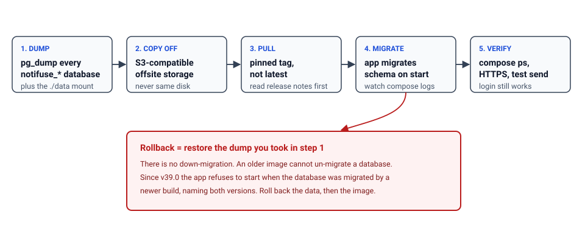

import Button from "@components/widgets/Button.astro";
import Notice from "@components/widgets/Notice.astro";
import ListCheck from "@components/widgets/ListCheck.astro";
import Accordion from "@components/widgets/Accordion.astro";
import Tabs from "@components/widgets/Tabs.astro";
import Tab from "@components/widgets/Tab.astro";
import YouTubeEmbed from "@components/widgets/YouTubeEmbed.astro";

Notifuse changed enough in the last year that the setup steps from the first version of this guide no longer produce a working install. The current release is **v40.0**, shipped 5 September 2026. Two things moved: the app now takes a single `SECRET_KEY` instead of a PASETO key pair, and the bundled Docker Compose file serves the console on port **8081**, not 8080. If you copied the old compose file and got a container that started fine but never answered, that's why.

This is the corrected guide, written for the solo operator with a VPS and somewhere between 2,000 and 50,000 subscribers who wants newsletter **and** transactional email without per-email pricing. It covers three deployment paths, how to verify each one actually works, day-to-day operations, backups, upgrades that won't paint you into a corner, and the failures you'll hit.

One honest framing before any commands: **Notifuse is the application layer, not a sending service.** You host the app and the database. You still rent deliverability from an email provider. Budget for both.

<YouTubeEmbed
  url="https://www.youtube.com/embed/kzULOnAuS0o"
  label="Self-Host Your Newsletter with Notifuse"
/>

## What Notifuse is (and what it isn't)

The Docker Hub README puts it plainly: *Notifuse is the application layer, not a sending service.* It keeps contacts, events and analytics in a Postgres database you control. Mail leaves through **your** Amazon SES, Mailgun, Postmark, SendGrid, SparkPost, Mailjet or plain SMTP account, at whatever that provider charges per message.

That split is the point. You get the expensive part (contact storage, segmentation, automation, unsubscribe handling) for the price of a small VPS, and you pay commodity rates for the part that genuinely costs money. Amazon SES is around $0.10 per 1,000 emails. Mailchimp charges per contact, dormant ones included.

It's built in Go with a React console, and it depends on exactly one thing: PostgreSQL 17 or newer. No Redis, no ClickHouse, no Elasticsearch, no worker fleet. That matters more than the feature list when you're the only person on call, because every extra service is another container in your memory budget and another thing that can die at 2am.

As of September 2026 the image has 100K+ pulls and the repo around 2.2k stars. Not a huge project, but actively released. You'll see why that cuts both ways in the licence section.

<Notice type="info" title="What 'self-hosted' actually means here">
You are hosting the app and the database. You are still renting deliverability from an ESP. Budget for both: a VPS *and* an SMTP/API provider. If you skip the ESP, you have a very nice contact database that can't send anything.
</Notice>

## What changed since the first version of this guide

I rewrote this instead of patching it, because six of the old steps were wrong. Here's the dated changelog, so returning readers can see what moved:

<ListCheck>
<ul>
<li><strong>Licence (v40.0, Sep 2026)</strong>: v40.0 and later ship under the Business Source License 1.1, converting to AGPL-3.0-or-later four years after each version ships. v39.x and earlier stay AGPL-3.0 permanently. Five capabilities need a licence key.</li>
<li><strong>`SECRET_KEY` replaced the PASETO keys</strong>: the old `PASETO_PRIVATE_KEY` / `PASETO_PUBLIC_KEY` pair and the paseto.notifuse.com generator are gone. You now generate one key with `openssl rand -base64 32`.</li>
<li><strong>Port 8081</strong>: the bundled compose file serves the console on 8081. The standalone image still uses 8080. Mixing these up is the most common "it started but the page won't load" report.</li>
<li><strong>Install is now `git clone` + `docker compose up -d`</strong>: the shipped file builds from the repo's Dockerfile and includes Postgres. The hand-rolled 60-line file from the old guide is now an optional variant.</li>
<li><strong>Visual automations</strong>: a flow builder with 10 node types (`delay`, `email`, `branch`, `filter`, `add_to_list`, `remove_from_list`, `ab_test`, `webhook`, `list_status_branch`).</li>
<li><strong>Built-in cookieless web analytics</strong>: the Staminads feature set merged in, running on the same Postgres. No cookies, no second database engine.</li>
<li><strong>Hosted blog CMS, S3 file manager, preference centre, SMTP bridge, OIDC single sign-on</strong>: all added since the original post, all in the same container.</li>
<li><strong>AI assistant on your own key</strong>: Anthropic, OpenAI or Gemini. The cost lands on your API bill, not Notifuse's.</li>
<li><strong>Zapier and scoped API keys (v39.0)</strong>: API keys can now be limited to specific resources instead of full workspace access.</li>
<li><strong>The migration guard (v39.0)</strong>: Notifuse refuses to start when its database was migrated by a newer build, naming both versions. Good safety net, and it changes how you roll back. See the upgrade section.</li>
</ul>
</ListCheck>

<Notice type="warning" title="Upgrading from the 2025 version of this guide?">
Two corrections matter most. Use `SECRET_KEY`, not PASETO keys. And check your port: `8081` for the bundled compose, `8080` for the standalone image. Everything else in the old compose file still works, it just won't boot cleanly without those two fixes.
</Notice>

## The features that actually matter for a solo operator

The old version of this post listed nine features and told you nothing. Here's the shorter version.

<Tabs>
<Tab name="Email marketing">
<ul>
<li><strong>MJML drag-and-drop builder with Liquid.</strong> Variables like `{{ contact.first_name }}` and custom fields, with a real-time preview. This is the biggest practical upgrade over Listmonk's raw HTML editing.</li>
<li><strong>Broadcasts with segments, A/B testing and UTM tagging.</strong> Target on fields, custom events or RFM scores, then A/B the subject, the content or the send time.</li>
<li><strong>Contact profiles with a full timeline.</strong> Every send, open, click, list change and webhook event in one view. This is what you open when someone says they never got your email.</li>
<li><strong>Segmentation without SQL.</strong> Dynamic rules with relative dates, nested behaviour and RFM buckets.</li>
<li><strong>Multi-tenant workspaces with per-workspace database isolation.</strong> One instance genuinely serves multiple brands or clients.</li>
<li><strong>Preference centre and double opt-in.</strong> Subscribers manage their own subscriptions and you keep a consent trail.</li>
</ul>
</Tab>
<Tab name="Automations & extras">
<ul>
<li><strong>Visual flow builder.</strong> One trigger at the root, 10 node types. Enrollment is `once` or `every_time`, with optional `exit_on_reply`. Draft, live or paused, and a paused automation holds its enrollments instead of dropping them.</li>
<li><strong>Transactional API plus an SMTP bridge.</strong> Send from your app over REST, or let a legacy SaaS that only speaks SMTP relay through Notifuse without code changes.</li>
<li><strong>Cookieless first-party analytics.</strong> A roughly 21 KB script served by your own instance at `/na.js`, storing sessions beside your contacts. Monthly partitioned tables, so expiring old data is a `DROP TABLE`.</li>
<li><strong>S3-compatible file manager.</strong> Email images live in your bucket, served over CDN, instead of bloating the container.</li>
<li><strong>AI assistant on your own provider key.</strong> The token spend is yours.</li>
<li><strong>Signed outbound webhooks</strong> and, since v39.0, scoped API keys.</li>
</ul>
</Tab>
</Tabs>

If you want a smaller surface and no licence questions, [Keila is the lighter option](/keila-setup/): Elixir, Docker, one Postgres, no per-workspace database partitioning.

## Licence reality check (read this before you commit)

This is the change that most affects whether you should start.

**What applies now:** Notifuse **v40.0 and every later release** ship under the **Business Source License 1.1**. Each version converts to **AGPL-3.0-or-later four years after it ships**. **v39.x and every earlier release remain AGPL-3.0 permanently**; the change isn't retroactive and can't be made so. The web analytics SDK stays AGPL in every version.

**What you may still do without paying:** run Notifuse in production, for a business, at any size. Read, modify and redistribute the source. Host it for other people and charge them for it, which the Additional Use Grant permits explicitly.

**The five capabilities that need a licence key:**

| Capability | Free self-host (no key) | With a licence key |
|---|---|---|
| Workspaces | Up to 3, all kept | 4th workspace and beyond |
| Team permissions | Full access only | Restricted / per-resource permissions |
| Amazon SES tenants | Existing tenants keep sending | Provisioning a new SES tenant |
| Template translations | Saved translations keep sending | Adding a language, editing one |
| Single sign-on (OIDC) | Sign-in by login code | SSO button available |

The first four refuse at the moment you create or change something and answer **402**, naming the missing capability. The fifth is quieter: the SSO button stops being offered, the startup log says `sso_gated=true`, and everyone signs in with a login code. Installing a key brings the button back with no restart.

**What an unlicensed install keeps:** everything. No telemetry gate, no activation, no account, no phone-home; key verification is offline against a signature compiled into the binary. No workspace, contact, key or setting is deleted, hidden or made read-only. The console never drops into a restricted mode. Permissions already granted stay enforced exactly as granted. SES tenants already provisioned keep sending. **The send path contains no licence check of any kind**, so scheduled broadcasts, automations and webhooks keep running after a key lapses. An invitation issued while licensed is still accepted afterwards.

Install a key by pasting it in **Settings** → **Licence** as root, or by setting `NOTIFUSE_LICENSE_KEY` (the env var wins, and while it's set the console refuses to store a competing value). One key covers one deployment, meaning one Postgres database however many API containers you run. A key past expiry keeps granting for a further 30 days.

<Notice type="warning" title="If you're upgrading to v40.0+">
You don't lose anything you already have. An install with more than three workspaces keeps all of them, it just can't create a fourth without a key. Nothing already in a restricted permission set widens to full access.
</Notice>

Sentry, HashiCorp, CockroachDB and Grafana each made the same move at the point their project became something people run in production. For a small shop the practical impact is often zero: most solo operators never create a fourth workspace and never touch template translations or SES tenant isolation. If you do need SSO or a fourth workspace, price the licence against a managed alternative and treat it as a line item. It isn't a moral question.

## Notifuse vs Listmonk, Keila, and the SaaS you're leaving

| Option | What you get | What it costs you |
|---|---|---|
| **Notifuse (self-hosted)** | MJML builder, automations, segmentation, web analytics, per-workspace DB isolation | Your VPS, ESP account, backups and DNS reputation |
| **Listmonk** | Smaller, sharper tool. No visual builder. **No licence-key concept at all** | Raw HTML templates |
| **Keila** (Elixir, Docker) | Simple, clean, transactional API, MJML support | Fewer automations and analytics; smallest surface |
| **Sendy** | Cheap, mature, email capture forms | Upfront licence fee, dated interface, no MJML |
| **Notifuse Cloud** | Same software, managed: daily backups with PITR, zero-downtime updates, monitoring, SSL | From $16/mo, scaling with active contacts |
| **Mailchimp / ConvertKit / Klaviyo** | Nothing to operate | Per-contact pricing, your data in their database, no ESP choice |

**Versus SaaS**: you stop paying per contact, your data stays put, and you can point the send path at whichever provider is cheapest this year. You also inherit every deliverability problem a Mailchimp used to absorb for you.

**Versus Listmonk**: Notifuse wins on the visual builder, native multi-tenancy, automations and built-in web analytics. Listmonk wins on size and on having zero licence-key machinery. If the previous section left a bad taste, that's a legitimate reason to pick Listmonk or Keila.

**Versus Keila**: the smallest correct answer if you want a newsletter and nothing else. One Postgres, no per-workspace database sprawl. See the [self-hosted newsletter with Keila guide](/keila-setup/) for that path.

If you'd rather not run a server at all, [EmailOctopus is a cheap hosted email marketing option](https://go.bitdoze.com/emailoctopus) and [MailerLite is a solid hosted newsletter platform](https://go.bitdoze.com/mailerlite). Neither beats self-hosting for someone with 20,000 subscribers and a VPS already paid for. They're the right answer for someone who doesn't want to own pg_dump.

<Notice type="info" title="The short recommendation">
Self-host Notifuse if you want the data and you'll own backups and DNS. Pick Listmonk or Keila if the licence bothers you. Pay for Cloud if your time is worth more than $16–39/month. Choosing a PaaS first? Start with [Dokploy vs Coolify vs Kamal 2](/coolify-vs-dokploy-vs-kamal-2/).
</Notice>

## Prerequisites

Everything below has to exist before step one. Getting this list wrong is how a 30-minute install turns into an evening.

<ListCheck>
<ul>
<li><strong>A server:</strong> 2 vCPU / 2 GB RAM / 40 GB SSD is the floor for a small list. Go to 4 GB for built-in web analytics or several workspaces. The image is about 63 MB; it's Postgres and the per-workspace databases that grow.</li>
<li><strong>Any Linux with Docker Engine and Compose v2.</strong> Both amd64 and arm64 work; the image is multi-arch, so a Hetzner CAX or Oracle Ampere box is fine.</li>
<li><strong>A domain and subdomain</strong> such as <code>newsletter.yourdomain.com</code>, plus the ability to add an A record and later SPF/DKIM/DMARC TXT records.</li>
<li><strong>A public HTTPS endpoint.</strong> Not optional. Tracking links, unsubscribe URLs and outbound webhooks all point at your instance.</li>
<li><strong>An SMTP or ESP account</strong>: SES, Mailgun, Postmark, SendGrid, SparkPost, Mailjet or plain SMTP. Needed for <em>system mail</em> (login links, invitations, password resets) before you send a campaign.</li>
<li><strong>PostgreSQL 17 or newer</strong> if you're not using the bundled compose, with <strong>CREATE DATABASE</strong> rights on the DB user, because Notifuse creates one database per workspace.</li>
<li><strong>Ports:</strong> 8080 (standalone) or 8081 (bundled compose), 443 for the proxy, optionally 587/465 for the SMTP bridge. Many VPS providers block outbound port 25 by default.</li>
</ul>
</ListCheck>

A €5–8/month EU VPS with 2 vCPU and 2 GB is plenty. Hetzner Cloud is what I'd default to, and it's worth [checking the current Hetzner plans](/hetzner-cloud-cost-optimized-plans/) before ordering. Hostinger is the budget alternative. Comparing providers? See [DigitalOcean vs Vultr vs Hetzner](/digitalocean-vs-vultr-vs-hetzner/). On ARM hosts, [install Docker and Compose on Ubuntu ARM](/install-docker-ubuntu-arm/) first.

<Button text="Try Hetzner Cloud" link="https://go.bitdoze.com/hetzner" variant="solid" color="blue" size="lg" external={true} icon="rocket-launch" />
<Button text="Try Hostinger VPS" link="https://go.bitdoze.com/hostinger-vps" variant="solid" color="green" size="lg" external={true} icon="rocket-launch" />

<Notice type="info" title="Start with a free SMTP tier for testing">
Brevo's free tier is enough to prove the plumbing works. Move to Amazon SES (~$0.10/1,000 emails) or a cheap relay once a real list is on it. See the [Mail.Baby review](/mail-baby-review/) for pay-as-you-go, or [set up an SMTP relay with ZeptoMail](/how-to-setup-smtp-relay-email-on-zeptomail/) if you want one host doing both jobs.
</Notice>

## Which deployment path should you pick?

Three paths, one decision.

| Path | Use it when | Watch out for |
|---|---|---|
| **Bundled Compose** (`git clone` + `up -d`) | You want it running tonight on one VPS. Includes Postgres 17, serves on :8081 | Port is 8081, not 8080. Pin the image tag |
| **Dokploy template** | You already run Dokploy and want SSL, DNS and a GUI | The template's env vars can lag upstream docs |
| **Standalone image + your own Postgres** | Production, the vendor's recommended path, most control | DB user needs CREATE DATABASE; `DB_HOST` is the Postgres host, not `localhost` |



One design constraint to internalise now: **Notifuse is designed to run as a single instance.** Don't put two app replicas behind a load balancer against one Postgres. You'll get duplicated webhook deliveries and, since v39.0, a startup refusal the moment one replica migrates the schema and the other restarts. Scale the box, not the replica count.

## Option 1: Bundled Docker Compose (fastest path)

This is the official quick start. It clones the repo, builds the image from the included Dockerfile, and starts Postgres alongside it.

### 1. Install Docker Engine and Compose v2

```sh
curl -fsSL https://get.docker.com -o get-docker.sh
sudo sh get-docker.sh
```

Verify:

```sh
docker --version && docker compose version
```

You want Compose v2 (`docker compose`, with a space). If `docker compose version` errors, you have the old v1 binary and every command below will fail. Install the plugin package for your distro and re-check.

### 2. Clone and start the stack

```sh
git clone https://github.com/notifuse/notifuse.git
cd notifuse
docker compose up -d
```

The first run builds locally, so give it a few minutes. The console is on **port 8081**:

```sh
docker compose ps
curl -I http://localhost:8081
```

`curl` should return an HTTP response, either 200 or a redirect to the sign-in page. If it returns nothing, check `docker compose logs -f api`. The usual cause is Postgres not being healthy yet on a 2 GB box.

<Notice type="info" title="This path is fine for production too">
The docs call it the evaluation path, but there's nothing wrong with running it in production on a single VPS if you pin `image: notifuse/notifuse:v40.0` and take backups. What you shouldn't do is run `latest` and expect a nightly `pull` to be uneventful.
</Notice>

### 3. Create your `.env` before first launch

Create a `.env` next to `compose.yaml`:

```ini
SECRET_KEY="$(openssl rand -base64 32)"
DB_PASSWORD="pick-something-long"
ROOT_EMAIL="you@yourdomain.com"
API_ENDPOINT="https://newsletter.yourdomain.com"
```

Run `openssl rand -base64 32` yourself and paste the output in quotes. If the stack is already up, `docker compose up -d` again and it picks the file up. Environment variables always override whatever the setup wizard stored in the database, which is a feature until it's a surprise.

<Notice type="error" title="# in your password? Quote it.">
In a `.env` file, an unquoted `#` starts a comment. `DB_PASSWORD=mypass#word123` parses as `mypass`, and you'll spend an hour convinced your Postgres credentials are wrong. Always quote:

```ini
DB_PASSWORD="mypass#word123"
SECRET_KEY="abc123#xyz789"
```
This affects `.env` files only. Values set in your shell, in Compose, or in a platform's secret store don't have the problem.
</Notice>

<Notice type="warning" title="Never change SECRET_KEY after first launch">
`SECRET_KEY` encrypts every workspace integration secret: ESP API keys, SMTP passwords, all of it. Changing it doesn't rotate anything, it destroys them permanently. Put the value in your password manager the moment you create it.
</Notice>

### 4. Complete the setup wizard

Open `http://<server-ip>:8081` and work through the wizard:

1. **Root administrator email**: the account that can create workspaces and reach System Settings.
2. **API endpoint**: the full public URL, `https://newsletter.yourdomain.com`, not the IP.
3. **SMTP settings**: for system mail. Do this now even if you won't send campaigns for a month. Without it you can't receive a login or password-reset email.
4. **Admin password**, or continue with login codes.

<Notice type="info" title="Multiple root admins">
`ROOT_EMAIL` accepts a comma- or semicolon-separated list, and an account is created for each address on startup. Matching is case-sensitive, so `Alice@example.com` and `alice@example.com` are two different people.
</Notice>

### 5. Put it behind TLS

The app listens on plain HTTP on 8081. Terminate TLS with your proxy and forward to it.

Caddy is the least work. One file at `/etc/caddy/Caddyfile`:

```
newsletter.yourdomain.com {
    reverse_proxy 127.0.0.1:8081
}
```

Then `sudo systemctl reload caddy`. Caddy gets and renews the Let's Encrypt certificate on its own. For Traefik labels inside Docker, see [Traefik reverse proxy in Docker](/traefik-proxy-docker/).

If you'd rather stay on Nginx, the old configuration still works. Change `proxy_pass http://localhost:8080;` to `proxy_pass http://localhost:8081;`. That one-line miss is the most common 502 in this article.

### 6. Verify it's actually up

```sh
docker compose ps
docker compose logs -f api
curl -I https://newsletter.yourdomain.com
```

What good looks like: both containers `Up`, log output showing the database migration completing without errors, and a 200 over a valid certificate with no `-k` flag. Then load the sign-in page and run the wizard's test email. The full checklist is further down.

<Notice type="info" title="Don't commit .env">
`.env` holds your database password and the key that encrypts every integration credential. Keep it out of git. [Docker Compose secrets: what works and what doesn't](/docker-compose-secrets/) covers the options honestly.
</Notice>

## Option 2: Deploy with Dokploy

Dokploy is a self-hosted PaaS that gives you a GUI, automatic SSL and a Notifuse template. If you already run it, this is the fastest path.

### 1. Install Dokploy

```sh
curl -sSL https://dokploy.com/install.sh | sh
```

Full walkthrough in the [Dokploy installation guide](/dokploy-install/).

### 2. Deploy the template

1. Log in to Dokploy and create a new project.
2. Open **Templates**, search for **Notifuse**.
3. Fill in the form: your subdomain, SMTP host/port/user/password, admin email.
4. Click **Deploy**.

Dokploy provisions PostgreSQL 17, wires the networking and issues a Let's Encrypt certificate.

### 3. DNS

Add an A record pointing your subdomain at the VPS IP:

| Type | Name | Value |
|---|---|---|
| A | `newsletter` | your VPS IP |

### 4. Verify

Open your domain and log in. If the page 502s, Dokploy is proxying to the wrong port. If TLS fails, the record hasn't propagated or Let's Encrypt already rate-limited you from earlier attempts. Check the Dokploy logs before retrying.

<Notice type="warning" title="Template drift">
Templates lag the upstream docs. If the Notifuse template still asks for PASETO keys, it predates v40. Use the manual Compose path instead of fighting it, or override with `SECRET_KEY` in the environment variables panel. Pin the image tag (`notifuse/notifuse:v40.0`) rather than leaving `latest`, so a redeploy can't jump a major version. Managing compose apps in Dokploy is covered in [deploying a Docker Compose app in Dokploy](/dokploy-docker-compose-app/).
</Notice>

## Option 3: Standalone container with your own PostgreSQL (production)

The vendor's production path: the published image against your own Postgres 17. It gives you the cleanest upgrade story and control over where the data lives.

The quick version from Docker Hub:

```sh
docker run -d --name notifuse \
  -p 8080:8080 \
  -e DB_HOST=your-postgres-host \
  -e DB_PORT=5432 \
  -e DB_USER=postgres \
  -e DB_PASSWORD=your-password \
  -e SECRET_KEY="$(openssl rand -base64 32)" \
  notifuse/notifuse:latest
```

For anything you'll actually run, keep it in Compose. This is the "bring your own Postgres" variant, corrected for v40. The previous version of this guide shipped `PASETO_PRIVATE_KEY` here, which no longer exists:

```yaml
services:
  notifuse:
    image: notifuse/notifuse:v40.0
    ports:
      - '8080:8080'
    environment:
      DB_HOST: postgres
      DB_PORT: '5432'
      DB_USER: postgres
      DB_PASSWORD: ${DB_PASSWORD}
      SECRET_KEY: ${SECRET_KEY}
      API_ENDPOINT: https://newsletter.yourdomain.com
      ROOT_EMAIL: you@yourdomain.com
      ENVIRONMENT: production
      TELEMETRY: 'false'
      CHECK_FOR_UPDATES: 'false'
    volumes:
      - ./data:/app/data
    depends_on:
      postgres:
        condition: service_healthy
    restart: unless-stopped

  postgres:
    image: postgres:17-alpine
    environment:
      POSTGRES_USER: postgres
      POSTGRES_PASSWORD: ${DB_PASSWORD}
      POSTGRES_DB: postgres
    volumes:
      - postgres-data:/var/lib/postgresql/data
    restart: unless-stopped
    healthcheck:
      test: ['CMD-SHELL', 'pg_isready -U postgres']
      interval: 5s
      timeout: 5s
      retries: 5

volumes:
  postgres-data:
```

Two details make this work, and both are easy to get wrong:

- **`DB_HOST: postgres`, not `localhost`.** Inside a container, `localhost` is the container. Use the service name, or an external hostname if Postgres lives elsewhere.
- **The DB user needs permission to create databases.** Notifuse creates one database per workspace plus its own `notifuse_system`. A user scoped to a single database fails at workspace creation with a permission error.

<Notice type="info" title="Pin your version">
Use `notifuse/notifuse:v40.0`, or whichever `vXX.Y` you've tested, not `latest`. An unattended `docker compose pull` against `latest` can jump a major version, run a schema migration, and leave you no path back except restoring a dump. [Running multiple PostgreSQL databases from one Docker service](/multiple-postgres-databases-docker/) covers the mechanics.
</Notice>

## Environment variables that actually matter

The wizard covers a lot, but production installs should put sensitive values in environment variables, because **env vars always override what's stored in the database**.

**Required:**

| Variable | Notes |
|---|---|
| `DB_HOST` | Postgres host. Service name inside Compose |
| `DB_PORT` | `5432` by default |
| `DB_USER` | Needs CREATE DATABASE rights |
| `DB_PASSWORD` | Quote it if it contains `#` |
| `SECRET_KEY` | `openssl rand -base64 32`. Immutable after first launch |

**Set these for production:**

| Variable | Notes |
|---|---|
| `ROOT_EMAIL` | Root admin, or a comma/semicolon-separated list. Case-sensitive |
| `API_ENDPOINT` | Public URL, used for tracking links and unsubscribe URLs |
| `SMTP_HOST` / `SMTP_PORT` / `SMTP_USERNAME` / `SMTP_PASSWORD` | System mail. `587` STARTTLS, `465` implicit TLS |
| `SMTP_FROM_EMAIL` / `SMTP_FROM_NAME` | What recipients see in the from line |
| `SMTP_EHLO_HOSTNAME` | For SMTP servers that reject `EHLO localhost` |
| `ENVIRONMENT` | `production` |
| `TELEMETRY` / `CHECK_FOR_UPDATES` | Both default to `true`. Set `false` if outbound phone-home is a policy matter |
| `LOG_LEVEL` | `info` by default, `debug` when chasing something |

**Tuning, worth knowing before you scale:**

| Variable | Default | Why it matters |
|---|---|---|
| `DB_MAX_CONNECTIONS` | `100` | Total across all databases |
| `DB_MAX_CONNECTIONS_PER_DB` | `3` | Per workspace. Ten workspaces is 30 connections minimum |
| `DB_CONNECTION_MAX_LIFETIME` / `_IDLE_TIME` | `10m` / `5m` | Connection recycling |
| `DB_PREFIX` | `notifuse` | Table prefix and the base of your database names |
| `TASK_SCHEDULER_ENABLED` / `_INTERVAL` / `_MAX_TASKS` | `true` / `30` / `10` | Broadcast and automation scheduler. Leave it on |

**Only if you need them:** `SMTP_BRIDGE_*`, `OIDC_*`, `TRACING_*`, `NOTIFUSE_LICENSE_KEY`, `BROADCAST_DATA_FEED_ALLOW_PRIVATE_HOSTS`.

<Notice type="error" title="BROADCAST_DATA_FEED_ALLOW_PRIVATE_HOSTS disables SSRF protection">
Setting this to `true` lets broadcast data feeds fetch private, loopback and link-local addresses. It exists for deployments that deliberately pull a feed from inside their own network. If your feeds come from the public internet, leave it at the default `false`.
</Notice>

<Notice type="info" title="Telemetry is on by default">
`TELEMETRY=true` and `CHECK_FOR_UPDATES=true` are the shipped defaults. With telemetry on, reported fields include version, licence tier, whether OIDC is enabled, whether custom RBAC is in use and whether SES tenants are configured. Never a key, an organisation, an issuer or a tenant name. Set both to `false` if you don't want that leaving your network.
</Notice>

## Connect your sending provider (and don't tank your deliverability)

There are two separate email paths in Notifuse, and conflating them is why people can't log in.

1. **System mail**: login links, invitations, password resets. Sent through the SMTP settings from the wizard. Required from day one.
2. **Campaign and transactional mail**: sent through the ESP you connect to a workspace under its integrations.

For Amazon SES, create SMTP credentials in the SES dashboard's SMTP settings section. They're not IAM access keys, and you must request production access before sending to arbitrary addresses. Then add the provider in your workspace, paste the credentials, and send a test.

Getting mail into inboxes is now your job:

- **SPF, DKIM and DMARC** TXT records on the domain you send from. Skip DKIM and Gmail and Microsoft will punish you within a day.
- **A matching From address.** Send from `newsletter@yourdomain.com`, not a gmail.com address on behalf of yourdomain.com.
- **A warmup ramp.** Zero to 20,000 sends in one evening on a fresh domain is how you manufacture a reputation problem.
- **Bounce and complaint handling.** SES suspends accounts for a bad enough complaint rate, and no app-level tuning fixes that.

The **SMTP bridge** is a different feature. It lets apps that only speak SMTP (Supabase Auth, Firebase, Auth0, cron scripts) relay through Notifuse so they get your MJML templates instead of their default plain text. Disabled by default. Enable with `SMTP_BRIDGE_ENABLED=true` and pick a TLS posture:

| `SMTP_BRIDGE_TLS` | Port | Meaning |
|---|---|---|
| `starttls` | 587 | Listens plaintext, client must STARTTLS before AUTH. Automatic when certs are provided |
| `implicit` | 465 | TLS from the first byte, for clients without STARTTLS |
| `off` | any | No TLS. Only behind a TLS-terminating proxy on a trusted network |

In `ENVIRONMENT=production` the bridge **refuses to start without TLS** unless you explicitly set `SMTP_BRIDGE_TLS=off`. Supplying certs means base64-encoding `fullchain.pem` and `privkey.pem` into `SMTP_BRIDGE_TLS_CERT_BASE64` and `SMTP_BRIDGE_TLS_KEY_BASE64`, and after certbot renews you have to re-encode and update the env vars.

<Notice type="warning" title="Deliverability is now your job">
Moving off Mailchimp moves the DNS reputation work onto your plate too. Budget an hour for SPF/DKIM/DMARC and a few weeks of watching bounce and complaint rates. If you'd rather not, [Postfix with an external SMTP relay](/postfix-external-smtp/) is a sane path for system mail while you sort out the campaign side.
</Notice>

## Verify the install end to end

Installing is not the same as working. Run this before pointing a real list at it.

<ListCheck>
<ul>
<li><strong>Containers healthy:</strong> <code>docker compose ps</code> shows everything Up with no restart loops. A container restarting every 30 seconds is almost always a DB connection problem.</li>
<li><strong>Migration completed:</strong> <code>docker compose logs -f api</code> shows the schema migration finishing cleanly. Errors here mean an incompatible Postgres or a user without the right grants.</li>
<li><strong>HTTPS valid:</strong> <code>curl -I https://newsletter.yourdomain.com</code> returns 200 without <code>-k</code>. If you need <code>-k</code>, tracking links will break in mail clients.</li>
<li><strong>Admin login works</strong> as the root account, and System Settings loads.</li>
<li><strong>Test broadcast arrives:</strong> send to yourself, open it, click a link, then confirm the open and click registered in the campaign report. Proves the ESP path and tracking redirects together.</li>
<li><strong>Transactional call returns 2xx.</strong> See the caveat below before copying the endpoint.</li>
<li><strong>Outbound webhook fires.</strong> A silent webhook is usually firewall or DNS egress, not a bug.</li>
<li><strong>Password-reset email arrives.</strong> This proves <em>system</em> SMTP, which is a completely separate path from your campaign ESP. Skip it and you'll discover it's broken when you're locked out.</li>
<li><strong>Unsubscribe link resolves</strong> on your public domain, not <code>localhost</code>. If it points at localhost, <code>API_ENDPOINT</code> is wrong and you're non-compliant.</li>
</ul>
</ListCheck>

<Notice type="warning" title="Verify the API path before you ship it">
The previous version of this guide used `POST /api/v1/send`. The vendor's published example uses the dotted `<resource>.<action>` style instead. What follows is what the vendor documents publicly, but **body keys and paths are version-specific**. Open your instance's API reference (or **Settings** → **Integrations** → **API**) and confirm before wiring it into an application. Don't paste it into production on my word alone:

```bash
curl -X POST https://newsletter.yourdomain.com/api/transactional.send \
  -H "Authorization: Bearer YOUR_API_KEY" \
  -H "Content-Type: application/json" \
  -d '{
    "workspace_id": "your-workspace",
    "notification": {
      "id": "welcome-email",
      "contact": { "email": "you@example.com" },
      "data": { "first_name": "Dragos" }
    }
  }'
```

Two related details: since v39.0 transactional sending requires an API key with **Transactional write**, and failed broadcast recipients are kept for seven days with a Retry button (`broadcasts.retryFailed`) instead of being discarded silently.
</Notice>

If a port check is failing, verify from outside the box with a proper TCP check rather than `ping`: [check remote ports with nc](/check-remote-port-in-linux-nc/).

## Operating it day to day

<Tabs>
<Tab name="Contacts & campaigns">
<ul>
<li><strong>Workspaces first.</strong> Everything lives inside one, with its own database, integrations and domain. Three without a licence key; the fourth needs one.</li>
<li><strong>Contacts and lists.</strong> Import by CSV or API, add custom fields, build segments on fields, custom events or RFM scores. Enable double opt-in for anything that isn't a hand-typed address.</li>
<li><strong>Templates and broadcasts.</strong> Build in the MJML editor with Liquid variables, save as a template, schedule against a segment. A/B the subject, content or send time, and let UTM tagging handle attribution.</li>
<li><strong>Preference centre and notification centre.</strong> Subscribers manage their own subscriptions, which is the piece that makes GDPR paperwork survivable.</li>
</ul>
</Tab>
<Tab name="Automations & API">
<ul>
<li><strong>Automations are graphs, not lists.</strong> One trigger at the root, nodes for `delay`, `email`, `branch`, `filter`, `add_to_list`, `remove_from_list`, `ab_test`, `webhook` and `list_status_branch`.</li>
<li><strong>Draft, live or paused.</strong> Pausing holds enrollments rather than dropping them. Each enrollment tracks its own status (`active`, `completed`, `exited`, `failed`) plus per-node history.</li>
<li><strong>Scoped API keys.</strong> Since v39.0 you can limit a key to specific resources. Two gotchas: transactional sending needs Transactional write, and Contacts write is also what permits deleting contacts.</li>
<li><strong>SMTP bridge for legacy apps.</strong> Point a SaaS that only speaks SMTP at your bridge and it gets your templates without a code change.</li>
<li><strong>Root programmatic auth for CI.</strong> A root user can authenticate with an HMAC-SHA256 signature against `POST /api/user.rootSignin` instead of a login code. Timestamps must be within 60 seconds of server time, rate-limited to 5 attempts per 5 minutes.</li>
</ul>
</Tab>
<Tab name="Analytics & extras">
<ul>
<li><strong>Web analytics.</strong> Enable per workspace and paste the `/na.js` snippet into your site. Cookieless, first-party, same Postgres, with 40 default channel-attribution rules you can edit and backfill.</li>
<li><strong>Retention by partition drop.</strong> Sessions land in monthly tables like `web_sessions_y2026m08`. Expiring old data is a `DROP TABLE` on the partition you no longer want, and the disk comes back immediately.</li>
<li><strong>GeoLite2 for geo data.</strong> Drop your own `GeoLite2-City.mmdb` into the mounted `data/` directory (it takes precedence) or point `GEOIP_DB_PATH` at it.</li>
<li><strong>S3 file manager</strong> for email images and attachments.</li>
<li><strong>AI assistant.</strong> Runs on your own Anthropic, OpenAI or Gemini key, so the usage lands on your API bill.</li>
<li><strong>Hosted blog.</strong> Liquid-templated, on custom domains your workspace owns.</li>
</ul>
</Tab>
</Tabs>

If the analytics side bothers you, turn it off per workspace or keep site analytics separate. [Self-hosted Umami](/umami-analytics-install/) and [Plausible](/install-plausible-analytics/) both do the job without analytics in your mailing stack.

## What it actually costs at 10k subscribers (September 2026)

Assume 10,000 contacts, four sends a month (40,000 emails), and Amazon SES at about $0.10 per 1,000 emails. Order-of-magnitude, not a quote.

| Setup | Monthly | What you're paying for |
|---|---|---|
| **Self-hosted** | €5–8 VPS + ~$1–2 SES + ~$0–1 storage | A 2 vCPU / 2 GB box, 40k emails, an object bucket. Plus your time |
| **Notifuse Cloud** | $16 / $39 / $99 / $249 | Lite / Starter / Pro / Business. Unlimited emails, BYO-ESP |
| **Mailchimp-class SaaS** | roughly 10x the self-hosted bill at this size | Per-contact pricing, dormant contacts included |

Cloud tiers as of September 2026: Lite $16/mo (2,500 active contacts, 1 workspace, 3 team members), Starter $39/mo (10,000 active, 5 workspaces), Pro $99/mo (25,000 active, 10 workspaces, 10 members), Business $249/mo (50,000 active, 20 workspaces, 25 members). Every plan includes every feature and **unlimited emails**; plans differ only by scale and data retention.

The billing model matters: Cloud charges for **active contacts**, defined as any unique contact with at least one event in the trailing 30 days (an email sent, a list change, an automation run, a custom event). Dormant contacts don't count. Mailchimp and Klaviyo bill for the address whether it's ever opened anything or not. Self-hosting has no per-contact and no per-email fee at all, which is why it's cheap at 10k and still cheap at 100k.

<Notice type="info" title="The hidden cost">
Your time, SPF/DKIM/DMARC and backups are the real line item. If your hourly rate is high and your list is small, Cloud at $16–39/month is genuinely cheaper. Two hours of troubleshooting costs more than a year of the Lite plan. Same logic if the alternative you'd actually buy is [EmailOctopus](https://go.bitdoze.com/emailoctopus) with nothing to maintain.
</Notice>

<Button text="Try Hetzner Cloud" link="https://go.bitdoze.com/hetzner" variant="solid" color="blue" size="md" external={true} icon="rocket-launch" />

## Backups, updates, and upgrades that won't break you

This section decides whether self-hosting was a good idea. Read all three parts before touching an upgrade.



### Back up what you can't re-create

**Notifuse creates one database per workspace plus its own system database, so a single `pg_dump` of `notifuse_system` is not a backup.** If you took the old article's advice literally, you've been backing up configuration and losing contacts.

This loop dumps everything. Run it from the project directory:

```bash
#!/usr/bin/env bash
# Back up every Notifuse database plus the ./data mount.
set -euo pipefail

STAMP=$(date +%F-%H%M)
OUT="/srv/backups/notifuse/$STAMP"
mkdir -p "$OUT"

DBS=$(docker compose exec -T postgres psql -U postgres -Atc \
  "SELECT datname FROM pg_database
   WHERE datname LIKE 'notifuse%' AND datistemplate = false;")

for db in $DBS; do
  docker compose exec -T postgres pg_dump -U postgres -Fc "$db" > "$OUT/$db.dump"
done

tar czf "$OUT/data-dir.tar.gz" -C "$HOME/notifuse/data" .
echo "backed up: $DBS"
```

The `./data` bind mount holds the GeoLite2 database and any locally mounted assets, which is why it's in the same archive. Then copy the directory offsite. [Bunny Storage for offsite backups and email image assets](https://go.bitdoze.com/bunny) covers both jobs at once. A backup on the same disk as the database is a copy, not a backup. For config-driven versions, [Dokploy backups with Cloudflare R2](/dokploy-backups-cloudflare-r2/) and [Restic-based backups](/pluton-self-hosted-backup/) are both solid.

**Do the restore drill.** It's the only proof the backup works:

```bash
docker compose exec -T postgres createdb -U postgres notifuse_restore_test
docker compose exec -T postgres pg_restore -U postgres -d notifuse_restore_test < /srv/backups/notifuse/2026-09-14-0300/notifuse_system.dump
docker compose exec -T postgres psql -U postgres -d notifuse_restore_test -c "SELECT count(*) FROM contacts;"
docker compose exec -T postgres dropdb -U postgres notifuse_restore_test
```

If the count matches your contact list, you have a restore path. If `pg_restore` errors on a missing role or extension, better now than during an incident.

<Notice type="warning" title="Back up before every update — not just the ones you're scared of">
Even a patch release can run a schema migration. Dump first, upgrade second, keep the dump for a couple of weeks. The cost is a few minutes of disk; the alternative is a data-loss postmortem.
</Notice>

### Update the app

1. Pin your image tag in the compose file (`notifuse/notifuse:v40.0`).
2. Run the backup above.
3. Read the release notes for the target version, paying attention to licence and feature changes.
4. Pull and restart:

```sh
docker compose pull
docker compose up -d
```

On Dokploy, **Redeploy** does the same thing, and [updating the stack in Dokploy](/dokploy-update-docker-compose/) covers the GUI path. The generic case is [updating a container with Docker Compose](/updating-container-docker-compose/).

Then verify: `docker compose ps`, migration finished in the logs, log in, send yourself a test email. A successful `pull` proves nothing on its own.

### The upgrade traps (read before you pull)

**There is no down-migration.** The app migrates the schema forward and nothing moves it back.

**Since v39.0, Notifuse refuses to start when its database was migrated by a newer build.** The startup log names both versions and the two ways out: deploy a build at least as new as the database, or restore a database stamped no higher. Two consequences:

- A rolling deploy has to replace **every** replica before the first one migrates, because an older replica restarting afterwards will never come back up. Another reason not to run multiple app replicas.
- Rolling back to a previous image **requires a database from before the upgrade**. Stop the app, restore the pre-upgrade dump, then start the older image.

**Upgrading Postgres itself is a separate project.** The shipped compose file deliberately stays on Postgres 17, because moving to 18 needs `pg_upgrade` and 18 changed its data directory layout. That's a Postgres problem, not a Notifuse one, and it deserves its own maintenance window.

**An expired or removed licence key doesn't stop sending.** It greys out the five gated capabilities and leaves the send path untouched.

<Notice type="error" title="There is no down-migration">
Roll the image back without restoring the database and the app refuses to start, by design. The database is the source of truth, not the container. Restore data first, then the image.
</Notice>

## Troubleshooting: the failures you'll actually hit

<Notice type="error" title="The two destructive mistakes">
Changing `SECRET_KEY` after first launch destroys every stored integration credential permanently. Upgrading without a fresh dump leaves you no rollback path, because there's no down-migration. Both are avoidable in under a minute of work.
</Notice>

| Symptom | Cause | Fix |
|---|---|---|
| Container exits, logs show DB connection refused | `DB_HOST=localhost` instead of the Postgres service name, or Postgres isn't healthy yet | Set `DB_HOST` to the service name or real hostname, and keep `depends_on: condition: service_healthy` |
| Workspace creation fails, permission denied | DB user can't `CREATE DATABASE` | Grant CREATEDB; Notifuse needs one database per workspace |
| SMTP credentials "wrong" but they're correct | A `#` in the password was truncated by `.env` parsing | Quote the value: `SMTP_PASSWORD="pa#ss"` |
| Password reset email never arrives | System SMTP unset or misconfigured; a different path from the campaign ESP | Configure `SMTP_*` and test a real reset |
| Port already allocated on 8080/8081 | Something else owns the port | Check `ss -ltnp` and remap. The bundled compose uses 8081 |
| SMTP bridge won't start in production | The bridge refuses TLS-less startup | Provide the cert/key base64 values, or set `SMTP_BRIDGE_TLS=off` behind a TLS-terminating proxy |
| "database has been migrated by a newer build" | You rolled back the image but not the database | Restore the pre-upgrade dump, then start the older image |
| 502 from the reverse proxy | Wrong upstream port, or the app bound to `127.0.0.1` in the container | Point the proxy at 8081 (bundled) or 8080 (standalone), bind on `0.0.0.0` |
| Permission errors on the mounted `./data` | UID/GID mismatch on the bind mount | Match ownership to the container user, or use a named volume |
| 402 responses naming a capability | A licence-gated feature | 4th workspace, restricted permissions, new SES tenant, translation authoring, or SSO |
| Campaigns send but land in spam | Missing SPF/DKIM/DMARC, or no warmup | Fix the DNS records first, warmup second |

If a port looks open locally but isn't reachable from outside, check whether Docker is bypassing your firewall rules: [Docker bypasses UFW](/docker-bypasses-firewall/) explains the iptables behaviour and the fix.

## Hardening and production notes

Short list, all of it load-bearing.

<ListCheck>
<ul>
<li><strong>Never expose Postgres.</strong> No <code>5432</code> in your firewall allowlist, no port mapping to the host. The app is the only client.</li>
<li><strong>Firewall, then the Docker caveat.</strong> UFW or firewalld plus awareness that Docker writes its own iptables rules. See <a href="/bsi-security-report-docker-ufw/">the Hetzner BSI report write-up</a> and <a href="/docker-bypasses-firewall/">Docker bypasses firewall</a>.</li>
<li><strong>Secrets out of the repo.</strong> Keep <code>.env</code> out of git; use Docker secrets or your platform's store. <code>SECRET_KEY</code> is write-once.</li>
<li><strong>Resource limits.</strong> Cap <code>mem_limit</code> and CPU so a runaway broadcast can't OOM the box. Remember <code>DB_MAX_CONNECTIONS</code> is 100 total and <code>DB_MAX_CONNECTIONS_PER_DB</code> is 3; do that arithmetic before creating ten workspaces.</li>
<li><strong>Monitoring.</strong> An uptime check on the public endpoint plus container metrics. <a href="/beszel-uptime-kuma/">Beszel and Uptime Kuma</a> cover both, and <a href="/sever-monitoring/">Docker resource monitoring</a> answers "why is the disk full".</li>
<li><strong>Fail2ban or CrowdSec</strong> in front of the proxy: <a href="/crowdsec-secure-server/">securing a VPS with CrowdSec</a>.</li>
<li><strong>Updates.</strong> Pin tags, watch GitHub releases, subscribe to release notifications so a security patch doesn't sit unread for three weeks.</li>
<li><strong>Privacy.</strong> <code>TELEMETRY=false</code> and <code>CHECK_FOR_UPDATES=false</code> if policy requires it. Data retention is your call, and the partition-drop trick makes it cheap to enforce.</li>
</ul>
</ListCheck>

## When self-hosting Notifuse is the wrong call

Three cases where I'd tell you not to bother.

**Your list is tiny and not growing.** Under a few hundred subscribers, a hosted free tier is less work than any self-hosted option, and per-contact pricing hasn't started to bite. Use a free plan and revisit this in a year.

**You have no appetite for DNS, deliverability or `pg_dump`.** Notifuse Cloud runs the same software from $16/month. If you'd rather not own a Postgres backup routine or debug DKIM records, paying someone is rational, not a capitulation. Self-hosting is only cheaper if your time is free.

**You need a fourth workspace or SSO and won't buy a key.** Then pick [Keila](/keila-setup/) or Listmonk, neither of which has a licence-key concept. Running software whose licence terms you resent is a bad foundation for a business process.

If you land in the first or second bucket, [MailerLite is a solid hosted newsletter platform](https://go.bitdoze.com/mailerlite) and [Sender has a free-forever plan](https://go.bitdoze.com/sender) worth pricing against your list size.

<Notice type="info" title="Still the cheapest option if you have the time">
For a solo operator with a real list, from 5,000 subscribers up, self-hosting is still the cheapest correct answer, usually by an order of magnitude. This section exists so nobody starts in the wrong place and quits two weeks later with mail in everybody's spam folder.
</Notice>

## FAQ

<Accordion label="Is Notifuse still free?" group="faq" expanded="true">
Yes, self-hosting is free. v40.0 and later are published under the Business Source License 1.1, which converts to AGPL-3.0-or-later four years after each version ships. v39.x and earlier stay AGPL-3.0 permanently. You can run it in production, for a business, at any scale, and host it for other people and charge them. Five capabilities need a licence key; the send path never does.
</Accordion>

<Accordion label="What exactly needs a licence key?" group="faq">
Five things: creating a fourth workspace, granting permissions that aren't full access, provisioning a new Amazon SES tenant, adding or editing a template translation, and single sign-on. The first four answer HTTP 402 naming the missing capability. SSO is quieter: the button stops being offered and the startup log says `sso_gated=true`. Nothing you already have is taken away.
</Accordion>

<Accordion label="Can I migrate from Mailchimp?" group="faq">
Yes. Export contacts as CSV, import them into a workspace, map your custom fields. The real cost is templates: they have to be rebuilt in the MJML builder, and a Mailchimp export won't bring segmentation rules or automation logic with it. Budget a few hours for a real list.
</Accordion>

<Accordion label="Can I migrate from Listmonk?" group="faq">
Contacts move over as CSV. There's no official Listmonk importer I can point you at, so expect CSV import for contacts and rebuilding templates and lists by hand. [Keila](/keila-setup/) is the third option in that size class if you're comparing projects.
</Accordion>

<Accordion label="Is there a sending limit?" group="faq">
Notifuse imposes none. Your limit is whatever your ESP account allows: SES sending quotas, Mailgun rate limits, your provider's plan. At roughly $0.10 per 1,000 emails on Amazon SES, volume is rarely the expensive part of this stack.
</Accordion>

<Accordion label="Do I need a developer?" group="faq">
Setup needs basic Linux and Docker comfort: SSH, a compose file, DNS records, a reverse proxy. Day-to-day use (campaigns, segments, automations) is point-and-click. The ongoing developer-flavoured work is backups and upgrades, and this article gives you scripts for both.
</Accordion>

<Accordion label="Can it send transactional email?" group="faq">
Yes, two ways: a REST API for app-triggered sends, and an SMTP bridge so an existing app that only speaks SMTP can relay through Notifuse without code changes. Both need a properly scoped API key or permission grant, and the bridge needs TLS in production.
</Accordion>

<Accordion label="Does it need Redis, ClickHouse or Elasticsearch?" group="faq">
No. One Postgres 17 database, plus one database per workspace. That's the entire dependency list, which is why it runs comfortably on a 2 GB VPS and why there's no extra service to monitor.
</Accordion>

<Accordion label="Does it work on ARM (Hetzner CAX, Oracle Ampere)?" group="faq">
Yes. The published image is multi-arch, `linux/amd64` and `linux/arm64`. On a fresh ARM box, install Docker and Compose first: [Docker on Ubuntu ARM](/install-docker-ubuntu-arm/).
</Accordion>

<Accordion label="How do I upgrade safely?" group="faq">
Back up every workspace database and the `./data` mount, read the release notes, pin the image tag, then `docker compose pull && docker compose up -d` (or Redeploy in Dokploy). Afterwards verify the migration completed and send a test email. There's no down-migration, so the only rollback path is restoring the pre-upgrade dump.
</Accordion>

## Key takeaways

<ListCheck>
<ul>
<li><strong>Notifuse v40 is the application layer, not a sending service.</strong> Bring your own ESP and budget for a VPS plus that provider.</li>
<li><strong>The licence changed in September 2026.</strong> v40.0+ is BSL 1.1, converting to AGPL four years after each release; v39.x and earlier stay AGPL permanently. Five capabilities need a key.</li>
<li><strong>The install is a clone and one compose command,</strong> console on port 8081, one `SECRET_KEY` from `openssl rand -base64 32` that you never change again.</li>
<li><strong>Back up every workspace database.</strong> A single dump of `notifuse_system` is not a backup, and there's no down-migration to save you.</li>
<li><strong>10k subscribers costs single-digit dollars a month</strong> plus your time. Cloud starts at $16/mo if you'd rather not own the ops.</li>
<li><strong>Verify before you trust it:</strong> test broadcast, transactional call, webhook, password reset, unsubscribe link. An install answering on HTTPS has proven almost nothing.</li>
</ul>
</ListCheck>

Want to see it before installing? The vendor's [live demo](https://demo.notifuse.com/console/signin?email=demo@notifuse.com) runs the full console, and the [self-hosting docs](https://docs.notifuse.com/self-hosting/installation) are the primary source for every environment variable here. Still deciding on the platform? Start with the [Dokploy installation guide](/dokploy-install/); it pays for itself the second time you deploy something.
