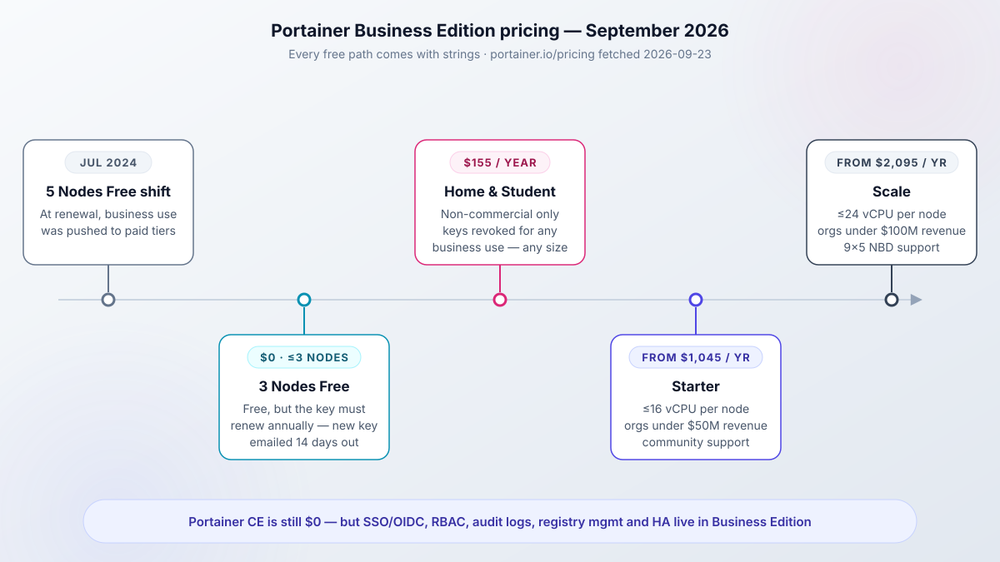
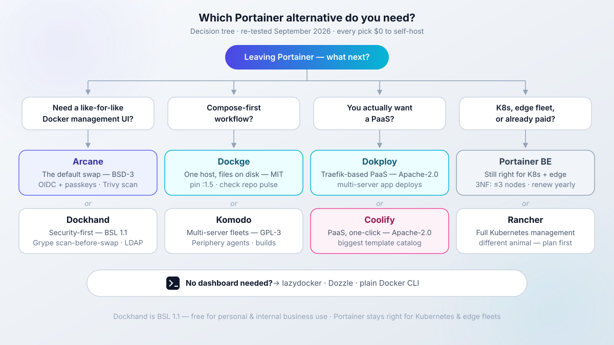
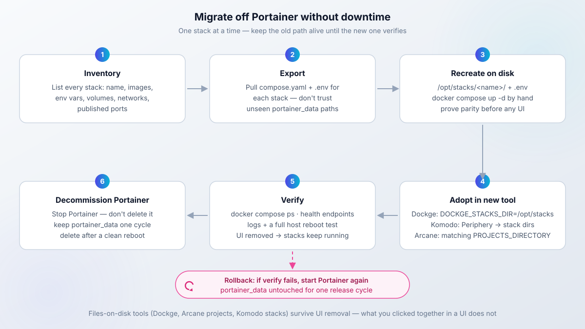
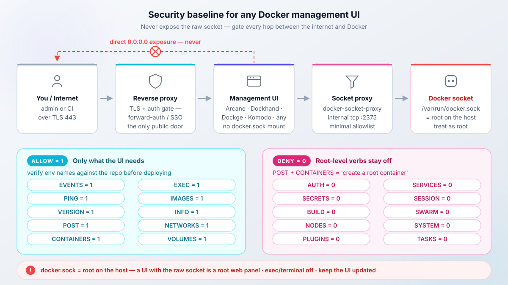

import { Picture } from "astro:assets";
import Accordion from "@components/widgets/Accordion.astro";
import Button from "@components/widgets/Button.astro";
import ListCheck from "@components/widgets/ListCheck.astro";
import Notice from "@components/widgets/Notice.astro";
import Tabs from "@components/widgets/Tabs.astro";
import Tab from "@components/widgets/Tab.astro";
import arcaneUi from "../../assets/images/26/02/arcane-ui.webp";
import dockhandUi from "../../assets/images/26/02/dockerhand-ui.webp";
import usulnetDashboard from "../../assets/images/26/02/usulnet-dashboard.png";
import dockgeUi from "../../assets/images/24/01/dockge-main.png";
import komodoUi from "../../assets/images/26/02/komodo-ui.png";

Portainer is still the default answer when someone asks for a Docker management UI, and the search for Portainer alternatives keeps growing for one reason: every free path comes with strings. Community Edition is alive and free, but SSO, RBAC, audit logs, and registry management sit behind Business Edition. The free Business tiers (3 Nodes Free, the old 5 Nodes Free) bring annual renewal paperwork and commercial-use clauses. Paid starts at $155/yr, and that tier is non-commercial only.

I run Docker across VPS and homelab machines, and I use Arcane on my own servers for day-to-day management and deploys. For this update I re-tested the field: which tool matches how you work, what Portainer licensing actually costs a solo operator in 2026, and how to move your stacks off Portainer with a rollback plan.

<ListCheck>
<ul>
<li>A decision tree so you can self-select in under a minute</li>
<li>Dated numbers: stars, licenses, last commits, version tags from 2026-09-23</li>
<li>A Portainer-exit migration path with a real rollback branch</li>
<li>A security baseline that applies to every Docker management UI on the list</li>
</ul>
</ListCheck>

<Notice type="warning" title="Affiliate Disclosure">
Some links in this guide are affiliate links. If you buy through them, we may earn a small commission at no extra cost to you. This helps us keep testing and updating these recommendations.
</Notice>

## Why people are leaving Portainer in 2026

Portainer CE is not dead. The repo shows 38,544 stars and an active push cadence (last push 2026-09-22), it ships under the Zlib license, and for a single-host homelab with no SSO needs it still works. That is not the problem.

The problem is where the feature line sits. RBAC, OIDC/SSO, registry management, audit logs, HA, and most edge features are Business Edition only (per docs.portainer.io and the CE-vs-BE post on portainer.io). Portainer's own pitch is blunt: "Most people should install Business Edition. It is free for up to 3 nodes." So the official funnel sends you to a licensed product, even at zero cost.



The licensing timeline is what pushed people to look for Portainer alternatives in the first place:

- **2024-07-10:** the 5 Nodes Free (5NF) license changed at renewal. Home users kept it; business use was pushed to paid. The blog post from that date is still the reference.
- **3 Nodes Free (3NF):** free forever up to 3 nodes, but you renew annually. Portainer emails a new key 14 days before expiry (per portainer.io/renew-3-nodes-free-license-key, fetched 2026-09-23).
- **Home & Student:** $155/yr, up to 15 nodes, strictly non-commercial. The pricing page says license keys will be revoked for any business use, any company size.
- **Starter:** from $1,045/yr ($105/mo), capped at 16 vCPUs per node, orgs under $50M revenue, community support.
- **Scale:** from $2,095/yr ($209/mo), 24 vCPUs per node, orgs under $100M revenue, 9x5 NBD support.

Community pain points line up with that. In r/selfhosted threads people call out the stagnant mobile UI, an API that falls behind what automation needs, and the missing volume/stack backups in CE. There is also a specific fear: leaving Portainer should not mean locking your stacks in yet another proprietary database.

<Notice type="warning" title="The Home & Student trap">
The $155/yr Home &amp; Student tier is strictly non-commercial. The pricing page states license keys will be revoked for any business use. If you run an LLC, invoice consulting clients, or host anything that makes money, do not buy it. The floor for commercial use is Starter at $1,045/yr as of 2026-09-23.
</Notice>

### The licensing math for solo operators and small teams

The honest annual comparison for 2026:

| Path | Cost per year | What you accept |
|---|---|---|
| Portainer CE | $0 | No SSO/OIDC, no RBAC, no audit logs, no HA, limited edge |
| Portainer BE 3 Nodes Free | $0 | Annual renewal paperwork, max 3 nodes |
| Portainer Home &amp; Student | $155/yr | Non-commercial only, revocation clause |
| Portainer Starter | from $1,045/yr | 16 vCPUs/node cap, orgs under $50M revenue |
| Arcane, Sencho, Dockge, Komodo, Coolify, Dokploy, lazydocker, Dozzle, 1Panel | $0 | Your own ops and backups |
| Dockhand | $0 for personal and internal business use | BSL 1.1, not OSI open source |

The dollars are only half of it. The real cost of the Portainer free paths is friction and revocation risk: a renewal you must remember, a node count you must not exceed ("we reserve the right to limit some or all of the product capability should the node count be exceeded" is the exact wording on the renewal page), and a home license that evaporates the moment you invoice anyone.

Rule of thumb I use: if you invoice anyone, Home &amp; Student is not for you. If you need SSO today and do not want to pay, Portainer CE is not for you.

<Notice type="info" title="3 Nodes Free renewal mechanics">
3NF renews free, but you must renew every year. Portainer sends the replacement key 14 days before your current key expires, and the form has spam-filter quirks (gibberish names get stuck). The separate "7 days" rule on that page is about moving a key to a different instance during a server move, not about the renewal window. What exactly happens if a key lapses (lockout vs. feature downgrade) is not clearly documented; users report expiry warnings after reboots in GitHub discussion #12301. Treat the renewal as mandatory calendar paperwork.
</Notice>

## How this update was tested (September 2026)

Numbers in this article come from GitHub API pulls on 2026-09-23, release pages read the same day, and portainer.io pricing fetched 2026-09-23. Hands-on claims mean a real install on a throwaway [€4-5/mo Hetzner CX-class VPS](https://go.bitdoze.com/hetzner), not my production fleet. Twelve tools compared, seven covered in depth.

_VPS prices jumped across the board in 2026 — if you're rethinking a rented box, see [what changed and when a mini PC wins](/vps-price-increases/)._

The previous version of this article made two wrong claims about Arcane: that it had no vulnerability scanning and no auto-updates. Both are wrong as of September 2026.

<Notice type="success" title="Corrections vs the previous version">
Arcane now has Trivy vulnerability scanning in the UI (v2.12.0, 2026-09-16), Copacetic image patching and scheduled backups (v2.10.0, 2026-08-31), and S3 backups (v2.9.0, 2026-08-25). Claims updated throughout this piece. One claim dropped entirely: the "around since 2022" history line, because the current repo was created 2025-04-19 and the pre-rename lineage is unconfirmed.
</Notice>

Where I could not re-verify something before publish, I hedge inline instead of stating it as tested. That applies to a couple of vendor pricing tiers and to Portainer's exact expiry behavior.

## Best free Portainer alternatives at a glance

Decision-first. The table, then the tree, then the reviews.

| Tool | Stars | License | Last commit | Vuln scan | SSO/OIDC | Backups | Multi-host | API | Best for |
|---|---|---|---|---|---|---|---|---|---|
| Arcane | 7,537 | BSD-3-Clause | 2026-09-23 (v2.13.1) | Trivy | OIDC, passkeys | S3, Git | agents | yes | Like-for-like Portainer swap |
| Dockhand | 6,343 | BSL 1.1 | 2026-09-23 (v1.0.48) | Grype/Trivy safe-pull | OIDC, MFA (LDAP paid) | restic | Hawser | OpenAPI | Security-first management |
| Sencho | 460 | AGPL-3.0 | 2026-09-23 (v0.97.1) | Trivy, scan policies | OIDC, TOTP, RBAC | S3 archives | node-link + Pilot | API tokens | Compose fleets with guardrails |
| Dockge | 24,427 | MIT | 2026-04-25 | no | no | files on disk | agents | limited | Pure compose UI |
| Komodo | 12,449 | GPL-3.0 | 2026-09-21 | no built-in | OAuth | snapshots | Periphery | strong | Multi-server fleets and builds |
| Coolify | 62,160 | Apache-2.0 | 2026-09-22 | no built-in | teams | yes | multi-server | yes | PaaS with one-click services |
| Dokploy | 37,466 | Apache-2.0 (verify file) | 2026-09-21 | no built-in | yes | yes | multi-server | yes | PaaS, Traefik-based |
| lazydocker | 52,921 | MIT | 2026-04-19 | no | n/a | no | no | n/a | Terminal work |
| Dozzle | 14,456 | MIT | 2026-09-23 | no | n/a | no | swarm/k8s read | no | Real-time logs |
| 1Panel | 37,003 | GPL-3.0 | 2026-09-22 | some | yes | yes | no | yes | Whole-server panel |
| CapRover | 15,166 | Apache-2.0 (verify file) | 2026-09-23 | no built-in | yes | no | swarm | yes | Swarm PaaS, one-click apps |
| UsulNet | 131 | AGPL-3.0 | 2026-05-21 | Trivy | business tier | S3/B2/SFTP | NATS | REST + WS | All-in-one, still beta |

Blank or "no built-in" cells mean exactly that. Stars are a community proxy, not a quality score. Last commit is the maintenance pulse; anything over about 90 days gets flagged in its section.



<ListCheck>
<ul>
<li>Pick Arcane for a like-for-like Docker management UI</li>
<li>Pick Dockhand when security workflow leads: scan-before-swap, LDAP, secret managers</li>
<li>Pick Sencho for compose-on-disk plus fleet features and free RBAC/SSO (pre-1.0, small community)</li>
<li>Pick Dockge for pure compose on one host (with the pulse caveat)</li>
<li>Pick Komodo for a multi-server fleet plus builds</li>
<li>Pick Dokploy or Coolify if what you want is a PaaS</li>
<li>Pick lazydocker, Dozzle, or plain Docker CLI if you did not need a dashboard</li>
</ul>
</ListCheck>

All picks are $0 to self-host. Dockhand is free under BSL 1.1 for personal and internal business use. A management UI adds no hosting cost when it runs on a VPS you already pay for; a dedicated small box is about €4-5/mo.

## Arcane: the closest like-for-like Docker management UI

Arcane is my default recommendation when someone wants Portainer-shaped features without Portainer licensing, and it is what I run on my own servers. As of 2026-09-23: 7,537 stars, BSD-3-Clause (true OSS), Go backend with a SvelteKit frontend, current release v2.13.1 (2026-09-22). The repo lives at `getarcaneapp/arcane` now; old `ofkm/arcane` links redirect.

<Picture
  src={arcaneUi}
  alt="Arcane Docker Manager UI showing container list and compose editor"
/>

What you get on the free tier: container/stack/image/network/volume management, OIDC, passkeys and MFA, per-permission API gating, and remote hosts via `arcane-agent` binaries (linux/darwin across amd64/arm64/armv7/riscv64) with an edge tunnel and agent self-upgrade. Single container plus a volume, no database to babysit. The official image is `ghcr.io/getarcaneapp/manager` and the web UI listens on port 3552 by default.

For install, follow [our Arcane Docker install guide (with socket proxy setup)](/arcane-docker-install/) instead of copy-pasting from here. That guide already uses the hardened pattern this article recommends: socket proxy in front of `docker.sock`, reverse proxy with auth in front of the UI.

<Notice type="info" title="Socket proxy is the default posture">
The Arcane install guide points the container at `DOCKER_HOST=tcp://docker-socket-proxy:2375` instead of mounting `/var/run/docker.sock`. Full allowlist and threat model in the security baseline section below.
</Notice>

One install detail that bites people adopting existing compose projects: the project folder path must match inside and outside the container. If your stacks live at `/opt/docker` on the host, mount `/opt/docker:/opt/docker` and set `PROJECTS_DIRECTORY=/opt/docker`. Mapping that path to something else breaks relative mounts.

<Button text="Arcane install guide (with socket proxy)" link="/arcane-docker-install/" variant="solid" color="blue" size="md" icon="arrow-right" />

### What's new in Arcane 2.x: scanning, patching, backups

The corrections, itemized with release dates from the Arcane releases page (fetched 2026-09-23):

- **v2.9.0 (2026-08-25):** automated S3 backups, standalone container editing, batched update notifications, CLI coverage for vulnerabilities/activities/webhooks.
- **v2.10.0 (2026-08-31):** scheduled volume backups, selective system restores, Copacetic (Copa) direct image patching for OS-level CVEs, "Convert to Compose" for running containers, Swarm read access, ML-DSA-87 signing for sessions/OIDC/edge mTLS.
- **v2.11.0 (2026-09-12):** durable job execution with offline recovery, Docker event streaming, tag-based container updates, label filtering. v2.11.1 added a toggle to disable scans per environment.
- **v2.12.0 (2026-09-16):** Trivy vulnerability scanning in the UI with CSV export, a "Fix available" filter, per-image CVE counts, Trivy config and ignore-file support. Also "Back up to Git" sync mode and IPv6 network visibility.

Cadence check: v2.8.1 to v2.13.1 landed in about five weeks (2026-08-19 to 2026-09-22). That is a healthy release pulse. Dockge below is the contrast.

Two of these features mutate running containers: bulk update and Copa patching. Same rule as any auto-updater. Point them at a canary stack first and snapshot the volume before the first scheduled run. If you want a dedicated updater with rollback as a complement or instead, see [how Tugtainer handles Docker auto-updates vs Watchtower](/tugtainer-docker-autoupdate/).

## Dockhand: security-first alternative with scanning and rollbacks

Dockhand is the pick when the security workflow matters more than OSI licensing. As of 2026-09-23: 6,343 stars, TypeScript on Bun, v1.0.48 (2026-09-14), roughly weekly releases from v1.0.39 to v1.0.48.

<Picture
  src={dockhandUi}
  alt="Dockhand Docker Manager UI showing container dashboard with security scanning"
/>

The security story is concrete:

- safe-pull scans before it swaps: image updates run through Grype/Trivy first, with rollback if the new container fails.
- The maintainer flagged v1.0.45 (2026-08-27) as an "important security upgrade with a number of API hardenings". A useful reminder that these UIs have CVEs too.
- Secret providers cover 1Password, HashiCorp Vault, Infisical, Doppler, Bitwarden Secrets, Proton Pass, KeePassXC, and Azure Key Vault.
- Auth covers MFA, LDAP, and OIDC/SSO.
- Stack backups are restic-based, with retention and bulk delete.
- A Compose Validate linter runs as preflight before you deploy.
- On the ops side: `docker load` for air-gapped hosts, notifications to MQTT/Zabbix/Pushover/Teams, OpenAPI docs at `/api/docs` (opt-in via `FEAT_API_DOCS`), the Hawser agent for remote hosts, and Podman compatibility fixes.

Image reference straight from the release notes:

```bash
docker pull fnsys/dockhand:v1.0.48   # or :latest, but pin in prod
```

For the full walkthrough (SQLite and PostgreSQL backends, OIDC/SSO, Hawser agents), use the [Dockhand Docker install walkthrough](/dockhand-docker-install/).

<Notice type="warning" title="Dockhand is source-available, not open source">
Dockhand runs under BSL 1.1. It is free for personal use and internal business use, and it converts to Apache 2.0 in January 2029. If you resell or offer it as a hosted service, read the license first. I say this plainly because roundups often wave "open source" over anything with a public repo. Commercial tier pricing was not re-verified for this article; do not trust old numbers without checking dockhand.pro.
</Notice>

Failure mode to know: safe-pull reduces auto-update risk but does not eliminate it. Snapshot volumes before the first scheduled run.

### Dockhand vs Arcane: which should you install?

Direct answer, not a feature dump.

<Tabs>
<Tab name="Choose Arcane if">

- You want a true OSI license (BSD-3-Clause) with no usage strings
- OIDC and passkeys on the free tier cover your auth needs
- You value the fastest release cadence in this category
- You want the simplest footprint: one Go container and a volume

</Tab>
<Tab name="Choose Dockhand if">

- Scan-before-swap with rollback is a hard requirement
- You need LDAP, or you already live in 1Password/Vault/Infisical/Doppler
- restic stack backups with retention beat an external cron job
- You are fine with BSL 1.1 for now and the 2029 conversion date is acceptable

</Tab>
</Tabs>

My default is Arcane. Pick Dockhand when scan-before-swap rollbacks, LDAP, or enterprise secret managers are the deciding features. If you are genuinely torn, run both on one box during evaluation on different ports. They can coexist.

<Button text="Full Arcane vs Dockhand comparison" link="/arcane-vs-dockhand/" variant="outline" color="blue" size="md" />

## Sencho: Compose control plane with fleet features

[Sencho](https://github.com/Studio-Saelix/sencho) is the newest entry here, and for Compose shops it fills the same slot Portainer does: a single container (`saelix/sencho`, UI on port 1852) that manages Compose stacks on one machine or a fleet. As of 2026-09-23: 460 stars, AGPL-3.0, TypeScript, still pre-1.0 (latest release v0.97.1, 2026-08-09) with commits landing the same day I checked.

The pitch is compose-on-disk plus a real ops layer. Your files stay the source of truth on the host, and Sencho adds the things Dockge never had: atomic deployments with automatic rollback, a Monaco editor with diff preview and one-click rollback to any prior deploy, health-gated updates, drift detection against running containers, Git-sourced stacks, and a Compose Doctor preflight that catches problems before you deploy. There is even an app store that accepts any Portainer-compatible template registry, with LinuxServer.io templates by default.

<ListCheck>
<ul>
<li>SSO (OIDC plus Google/GitHub/Okta presets), TOTP 2FA, and five-role RBAC on the free tier</li>
<li>Trivy scanning with VEX suppression, SARIF export, SBOM upload, and scan policies that can block a deploy</li>
<li>Multi-node without a separate agent: run the same Sencho binary on each host and link them with an API token; the Pilot Agent covers nodes behind NAT through a single outbound WebSocket</li>
<li>Fleet operations: snapshots of compose and env, secrets push to labeled nodes, bulk actions, remote updates, Blueprints with drift detection</li>
<li>Scheduled ops on cron, webhooks, auto-heal and auto-update policies, read-only audit log</li>
<li>Off-site stack archives to S3-compatible storage, notifications to Slack/Discord/generic webhook</li>
<li>No telemetry and no outbound calls to the vendor</li>
</ul>
</ListCheck>

The multi-node model differs from Komodo's Periphery or Arcane's agents: every node runs a full Sencho instance and the primary proxies authenticated HTTP/WebSocket to it. No SSH, no Docker socket exposed on the network. For a two or three box setup it is pleasantly simple.

Two caveats. Pre-1.0 means what it says: the repo ships a KNOWN_LIMITATIONS.md and tells you to validate against your own setup before trusting it with critical infrastructure. And the community is small, 460 stars against Arcane's 7,500 and Dockge's 24,000. There is a paid "Admiral" plan (hardened builds, managed off-site recovery vault, LDAP/AD, audit export, priority support), but the Community tier is the real product: unlimited nodes, unlimited users, everything above included.

Install note: the same 1:1 path rule as Arcane applies. If stacks live at `/opt/docker`, mount `/opt/docker:/opt/docker` and set `COMPOSE_DIR=/opt/docker`. And like everything else on this list, Sencho mounts `/var/run/docker.sock`, so read the security baseline section before exposing the UI.

## Dockge: still the best pure compose UI, but check the pulse

This is the "Portainer vs Dockge" answer for compose-only users. Dockge has 24,427 stars (the biggest of any compose UI), MIT license, TypeScript. The design is the selling point: your stacks are plain compose files on disk, with no proprietary database holding your deployments hostage. That is exactly what people fear losing when they leave Portainer.

<Picture
  src={dockgeUi}
  alt="Dockge UI showing compose stack management"
/>

You point it at a stacks directory with `DOCKGE_STACKS_DIR` (default `/opt/stacks`) and it picks up `compose.yaml` plus `.env` per folder. See [how to install Dockge with Docker Compose](/dockge-install/) for the full setup, including the pin-a-version caveat.

Now the caveat, because I would not hang a fleet on hope.

<Notice type="warning" title="Dockge maintenance pulse">
Last upstream commit was 2026-04-25, about five months before this article's 2026-09-23 research date. "Is this still developed?" is an open community question (GitHub issue #893, r/selfhosted threads, community forks appearing). Also: Dockge 1.5.0 disabled the Console/terminal feature by default, which I consider the right security call, not a regression. Pin `:1.5.x`, keep your compose files in Git, and any tool can adopt them later.
</Notice>

Dockge 1.5.x is still the nicest pure compose UI to use on a single host. Set your expectations before betting more than one box on it, and remember multi-host via agents gets clumsy around 8 hosts and 90 containers (a complaint that shows up repeatedly in r/selfhosted). At that size, look at Komodo, Arcane agents, or Sencho's node-link model.

## Komodo: fleet management for multi-server homelabs

Komodo is the fleet answer: 12,449 stars, GPL-3.0, Rust, actively pushed (last commit 2026-09-21). It builds, deploys, and manages across many servers through Periphery agents, and it has a strong API for automation. If your complaint about Portainer is "the API is falling short," this is usually where people land.

<Picture
  src={komodoUi}
  alt="Komodo dashboard showing server status and deployment overview"
/>

It is compose-on-disk friendly, and community migration write-ups exist for exactly this move (FoxxMD's Portainer/Dockge to Komodo guide is the reference people link in r/selfhosted). I am citing it, not copying it.

Ops reality check before you commit:

- Komodo is stateful. It wants a MongoDB-compatible database: either MongoDB or FerretDB (FerretDB v2 is the supported combo as of Komodo 1.18.0; the older SQLite/Postgres-via-FerretDB-v1 path is gone). Budget roughly 300-500 MB extra RAM on top of the core. I do not run Komodo on a 1 GB box by choice.
- That database is one more stateful thing to back up. Arcane, Dockhand, Sencho, and Dockge are effectively single-container plus volume shapes; Komodo is not.
- Agent version skew is a real ops task. After a core upgrade, upgrade Periphery agents next, then re-run the fleet check.

<Notice type="info" title="Back up the Komodo database">
Treat the Komodo DB like production state. Scheduled dumps or volume snapshots, and test a restore once. Losing it does not kill your stacks (the compose files live on the hosts), but you lose inventory, sync state, and API keys.
</Notice>

If you are building a 3-5 node homelab fleet for this kind of tooling, quiet nodes like [a compact mini PC such as the GMKtec M5 Ultra](/go/gmktec-m5-ultra/) beat a tower of old laptops on noise and power draw.

The socket-proxy pattern from [our Arcane Docker install guide (with socket proxy setup)](/arcane-docker-install/) applies to Komodo's Periphery agents too. Do not hand a raw `docker.sock` to anything with a network listener.

## Coolify and Dokploy: when the real answer is a PaaS, not a UI

Category correction. If what you do is "push code, deploy app, get HTTPS", a container management UI is the wrong shape of tool. You want a PaaS. Two serious options:

<Tabs>
<Tab name="Coolify">

- PHP/Laravel under Apache-2.0, 62,160 stars (2026-09-23).
- Git-push deploys plus 280+ one-click services.
- Built-in reverse proxy with Let's Encrypt.
- Covers Docker and Docker Compose, with Kubernetes claims in the docs.
- Best for people who want batteries included and a large template catalog. Paid Coolify Cloud exists if you do not want to run the control plane.

</Tab>
<Tab name="Dokploy">

- TypeScript, 37,466 stars (2026-09-23), created 2024-04-19 and the fastest star growth in this space.
- Git deploys plus Docker/Compose services, with databases and backups built in.
- Traefik-based routing.
- Best for people who want a leaner PaaS with Traefik under the hood. This is what I run across my own VPS fleet.

</Tab>
</Tabs>

License note: the GitHub API reported NOASSERTION for both repos on 2026-09-23; historically both are Apache-2.0, but check the license file in the repo before you make a legal call.

Both replace Portainer-style deploy workflows, not the low-level Docker poking. Keep lazydocker or the Docker CLI on the box for the 3 a.m. work. And plan for weight: a PaaS adds Traefik plus build workers, so 2 GB RAM is a realistic floor.

<Button text="Step-by-step Dokploy install guide" link="/dokploy-install/" variant="solid" color="green" size="md" icon="arrow-right" />

If you cannot choose between the PaaS options, [Coolify vs Dokploy vs Kamal 2 compared](/coolify-vs-dokploy-vs-kamal-2/) walks the tradeoffs properly.

## No dashboard needed: lazydocker, Dozzle and plain Docker CLI

The honest baseline, and the section most roundups skip. Before adopting any Docker management UI, try two weeks of terminal work. Many people do not go back.

- **lazydocker** (52,921 stars, MIT, Go TUI, last push 2026-04-19): containers, logs, and stats in your terminal. Zero server footprint, nothing listening on a port, nothing to patch on the VPS.
- **Dozzle** (14,456 stars, MIT, Go, last push 2026-09-23): a real-time log viewer in the browser for Docker, Swarm, and Kubernetes. Tiny and single-purpose.
- **Plain Docker CLI + compose:** covers the majority of what people open Portainer for. Honorable mention for the VS Code Docker extension over SSH.

<ListCheck>
<ul>
<li><code>docker compose ps</code> and <code>docker compose up -d</code> for state and restarts</li>
<li><code>docker compose logs -f --tail=100</code> for tails</li>
<li><code>docker compose pull &amp;&amp; docker compose up -d</code> for updates</li>
<li><code>docker stats</code> and <code>docker system df</code> for resources</li>
<li><code>docker compose exec</code> for shell access</li>
<li><code>docker system prune</code> for cleanup (read the flags first)</li>
</ul>
</ListCheck>

Cost is zero and the attack surface does not grow. Nothing runs on the VPS to patch. That is a better default than most people admit.

## 1Panel, CapRover, Rancher and UsulNet: the adjacent options

Short mentions so nobody searching for these feels stranded.

**1Panel** (37,003 stars, GPL-3.0, Go) is a full Linux server panel with a Docker UI bolted on: firewalls, files, apps store, the works. FIT2CLOUD-backed. Heavier than a pure Docker management UI, and the default branch is currently `dev-v2`, so check the release channel before assuming stable behavior. Choose it when you want a whole-server panel, not just containers.

**CapRover** (15,166 stars, TypeScript, mature since 2017) is a Docker Swarm PaaS with one-click apps. The GitHub API showed NOASSERTION for the license on 2026-09-23 (historically Apache-2.0, verify the file). Still a reasonable choice if you are already committed to Swarm.

**Rancher** is for readers who moved to Kubernetes. It is a full K8s management plane from Suse, a different animal from everything above. I do not review it hands-on here, and current Community vs Prime packaging changes often enough that you should read their docs before planning around licensing.

**UsulNet** was covered in depth in the previous version of this article as an all-in-one container management platform (PostgreSQL, Redis, NATS, multi-node). The repo has since moved to `fran-olivares/usulnet` with 131 stars and a last push in May 2026. It is a solo-dev beta product and those move or die fast; re-verify current status and limits on their site before committing. Install instructions from the earlier test are in the [UsulNet install guide](/usulnet-docker-install/).

<Picture
  src={usulnetDashboard}
  alt="UsulNet dashboard showing container status, resource utilization, and security score"
/>

## When Portainer is still the right choice

No tribalism here. Four cases where I would stay on Portainer:

1. **3 Nodes Free is genuinely free** if 3 nodes cover you and an annual renewal email is acceptable friction. Just read the terms: one license per company domain, node-count enforcement is reserved as a right.
2. **Kubernetes management.** Arcane is read-only Swarm at best. Dockge, Dockhand, Sencho, and Komodo are Docker/Compose tools. Portainer BE and Rancher are the K8s plays in this neighborhood.
3. **Edge/IIoT fleets.** The Portainer Edge Agent is still the product nobody has fully matched for large numbers of unreliable uplinks.
4. **You already paid.** If migration cost exceeds renewal cost this year, renew and migrate later with a plan.

Also fine: Portainer CE on a single homelab host when none of the gated features matter to you.

<Notice type="info" title="If you stay on 3 Nodes Free">
Calendar the annual renewal. Portainer sends the new key 14 days before expiry, but spam filters have eaten submissions before (their own FAQ warns about it). Keep the signup email. And do not exceed 3 nodes "temporarily" while testing; the license agreement does not have a soft edge there.
</Notice>

If none of those four cases apply, the feature gating plus renewal paperwork is your reason to move.

## How to migrate from Portainer without downtime

You can migrate from Portainer to any compose-on-disk tool without dropping traffic. The honest framing: this is per-stack sequencing, not magic. Do one stack at a time, keep the old path working until the new one is verified.



1. **Inventory.** List every stack in Portainer: name, images, env vars, volumes, networks, published ports. A spreadsheet is fine.
2. **Export.** Pull each stack's compose file and env from the Portainer UI. Stacks also live inside the `portainer_data` volume under numbered `compose/` directories, but the exact layout varies by version. Do not trust a path you have not seen; look in a throwaway VM on your version first.
3. **Recreate on disk.** One directory per stack, for example `/opt/stacks/<name>/compose.yaml` plus `.env`. Then prove parity by hand before any UI sees it:

```bash
mkdir -p /opt/stacks/myapp
cd /opt/stacks/myapp
# copy compose.yaml and .env from the Portainer export
docker compose up -d
docker compose ps
curl -I http://127.0.0.1:8080/health   # hit the real health endpoint
```

4. **Point the new tool at the stacks directory:**

<Tabs>
<Tab name="Dockge">

```yaml
services:
  dockge:
    image: louislam/dockge:1.5
    environment:
      - DOCKGE_STACKS_DIR=/opt/stacks
    volumes:
      - /opt/stacks:/opt/stacks
      - /var/run/docker.sock:/var/run/docker.sock
```

Use "Scan Stacks Folder" in the UI to adopt existing stacks. Pin the tag, do not run `:latest` here.

</Tab>
<Tab name="Komodo">

Run Periphery on each host and point it at the stack directories. Keep core and Periphery versions in lockstep after upgrades. Remember the Komodo database needs its own backup schedule.

</Tab>
<Tab name="Arcane">

Mount the projects path identically inside and outside the container and set `PROJECTS_DIRECTORY`:

```yaml
    volumes:
      - /opt/docker:/opt/docker
    environment:
      - PROJECTS_DIRECTORY=/opt/docker
```

Existing compose projects are adopted when the paths match. Absolute paths only.

</Tab>
<Tab name="Sencho">

Same 1:1 path rule: mount the stack directory identically and set `COMPOSE_DIR`:

```yaml
    volumes:
      - /opt/docker:/opt/docker
      - /var/run/docker.sock:/var/run/docker.sock
      - ./data:/app/data
    environment:
      - COMPOSE_DIR=/opt/docker
```

Compose projects on the mounted path show up as adoptable stacks. The UI listens on port 1852.

</Tab>
</Tabs>

5. **Move backup config.** If you adopt in-UI backups (Arcane S3, Dockhand restic, Sencho archives), configure them and run one manual backup plus one restore test before you trust the schedule.
6. **Verify** with the checklist below.
7. **Rollback plan.** Stop Portainer, do not delete it, and leave `portainer_data` intact for one release cycle. If the new tool fails you, start Portainer again and re-point. Decommission only after the verification checklist passes on a host reboot.

<ListCheck>
<ul>
<li>Export compose + env for every stack</li>
<li>Recreate as plain dirs and <code>docker compose up -d</code> once by hand</li>
<li>Adopt in the new tool (Dockge, Komodo, Arcane, or Sencho config above)</li>
<li>Verify: <code>docker compose ps</code>, health endpoints, logs, host reboot</li>
<li>Rollback-ready: Portainer stopped but present, data volume untouched</li>
<li>Decommission Portainer only after a clean reboot cycle</li>
<li>Post-exit cleanup: <a href="/clean-docker-overlay2-dir/">reclaim disk space from old overlay2 directories after decommissioning Portainer</a></li>
</ul>
</ListCheck>

<Notice type="warning" title="Secrets do not belong in Git">
When stacks move to plain directories, the temptation is to push `/opt/stacks` to a repo with `.env` included. Do not commit production secrets. See <a href="/docker-compose-secrets/">handling secrets in plain Compose files</a> for patterns that survive contact with a public repo.
</Notice>

Verify and failure modes, in order of how often they bite:

- Parity comes first: `docker compose ps` should show the same services and health as Portainer did. Broken looks like a service silently absent because the env file did not come along in the export.
- Then `curl -I` each health endpoint. DNS and TLS stay the same, but upstream container names change with the compose project name. Traefik labels that matched the old project name will 502.
- Reboot with `sudo reboot` and confirm every stack returns. Tools that read files on disk (Dockge, Arcane projects, Komodo stacks, Sencho stacks) recover; anything you only clicked together in a UI will not.
- In a scratch VM, remove the management UI and confirm your stacks keep running. Files-on-disk tools leave them intact; database-backed tools can take the definition with them.
- If you read stacks out of `portainer_data` and the directory layout surprises you, stop and inspect the live volume instead of guessing. Env files forgotten in the export are the single most common broken deploy.
- Portainer-created networks and stale volumes outlive the container. Prune carefully, and use the overlay2 cleanup guide above for the disk space side.

## Security baseline for any Docker management UI

This applies to Arcane, Dockhand, Sencho, Dockge, Komodo, 1Panel, Portainer, and anything else that can start containers.

<Notice type="error" title="docker.sock equals root on the host">
Any container with <code>/var/run/docker.sock</code> mounted can start a privileged container and own the host. A Docker management UI with the raw socket is a root web panel. Treat it that way in your threat model.
</Notice>



Four non-negotiables:

<ListCheck>
<ul>
<li>Put a socket proxy in front of the raw socket: tecnativa/docker-socket-proxy (or equivalent), allowing only the verbs the UI needs.</li>
<li>Put a reverse proxy with auth in front of the UI, or keep it on VPN/localhost only. Never publish a management UI on <code>0.0.0.0</code> raw.</li>
<li>Turn terminal and exec features off unless you are actively using them. Dockge 1.5.0 disabling the Console by default is the right call.</li>
<li>Update the UI itself. Dockhand v1.0.45 shipping "API hardenings" proves these projects have CVEs like everything else.</li>
</ul>
</ListCheck>

The socket proxy pattern, using the env-var names from the current tecnativa/docker-socket-proxy README (double-check them against the repo before you deploy, the semantics have shifted over the years):

```yaml
services:
  docker-socket-proxy:
    image: tecnativa/docker-socket-proxy:latest
    container_name: socket-proxy
    environment:
      - EVENTS=1
      - PING=1
      - VERSION=1
      - AUTH=0
      - SECRETS=0
      - POST=1
      - BUILD=0
      - CONTAINERS=1
      - EXEC=1
      - IMAGES=1
      - INFO=1
      - NETWORKS=1
      - NODES=0
      - PLUGINS=0
      - SERVICES=0
      - SESSION=0
      - SWARM=0
      - SYSTEM=0
      - TASKS=0
      - VOLUMES=1
    volumes:
      - /var/run/docker.sock:/var/run/docker.sock:ro

  arcane:
    image: ghcr.io/getarcaneapp/manager:latest
    environment:
      - DOCKER_HOST=tcp://docker-socket-proxy:2375
    # no /var/run/docker.sock mount here
```

Then [put the UI behind a Traefik reverse proxy](/traefik-proxy-docker/) with auth (forward auth, basic auth plus strong TLS, or your SSO layer). Verify after setup: from outside the host, confirm the UI port does not answer directly (`curl -v https://host:3552` should time out or refuse), and from the UI confirm it cannot reach API verbs you did not allow. If a terminal feature is enabled, that is the test surface.

Failure modes here are boring and severe: a port accidentally bound to `0.0.0.0`, an allowlist so broad that `POST=1` plus `CONTAINERS=1` is effectively "create root container", a terminal left enabled after an eval, and agent version skew after core upgrades (core, then agents, then a fleet check).

Ops notes for small boxes: Trivy and Grype scans burst CPU and RAM during image scan. On 1 GB, schedule scans off-peak or disable them per environment (Arcane v2.11.1 has that toggle). And if you want the UI and socket proxy isolated from production workloads, even a [budget Hostinger VPS](https://go.bitdoze.com/hostinger-vps) is enough for a management plane of one.

## FAQ

<Accordion label="Is there a completely free Portainer alternative?" group="faq" expanded="true">
Yes. Arcane, Sencho, Dockge, Komodo, Coolify, Dokploy, lazydocker, and Dozzle are all $0 to self-host with no license key and no renewal. Dockhand is free under BSL 1.1 for personal and internal business use, with a conversion to Apache 2.0 in January 2029. None of these require an email signup to unlock features.
</Accordion>

<Accordion label="What happens if I do not renew Portainer's 3 Nodes Free license?" group="faq">
Renewal is free but annual. Portainer says it sends a new key 14 days before your current one expires. What happens exactly if a key lapses, lockout versus feature downgrade, is not clearly documented on the site. Users report expiry warnings after reboots (GitHub discussion #12301), so treat the renewal as mandatory. The "7 days" clause on the renewal page is about moving your key between instances during a server migration, not a renewal grace window.
</Accordion>

<Accordion label="Is Dockge still maintained?" group="faq">
The honest answer as of 2026-09-23: the last upstream commit was 2026-04-25, and "is this abandoned?" threads and community forks exist. The files-on-disk philosophy is still the right one and 1.5.x works well. Pin `:1.5.x`, keep compose files in Git, and check the repo pulse before you expand beyond one host.
</Accordion>

<Accordion label="Is Sencho ready for production?" group="faq">
Sencho is pre-1.0 (v0.97.1 as of this update) with a small community, and the maintainers say so themselves: the repo ships a KNOWN_LIMITATIONS.md and asks you to validate against your own setup before deploying on critical infrastructure. The feature set is real: SSO, RBAC, Trivy scanning, fleet ops. And its own authors run it in production. For a homelab or a small fleet you can roll back from, it is worth an install. For a fleet you cannot afford to babysit, Arcane or Komodo are safer bets today.
</Accordion>

<Accordion label="Can I manage multiple servers from one dashboard for free?" group="faq">
Yes. Komodo does it with Periphery agents, Arcane with `arcane-agent`, Dockhand with the Hawser agent, and Sencho by linking full instances (or the Pilot Agent for NAT hosts). All free at the tiers described above. Budget time for version skew: upgrade the primary, then the nodes or agents, then verify the fleet state.
</Accordion>

<Accordion label="Which alternative has SSO/OIDC without paying?" group="faq">
Arcane ships OIDC plus passkeys and MFA on the free tier. Sencho has OIDC with Google/GitHub/Okta presets, TOTP, and five-role RBAC free. Dockhand has OIDC/SSO and MFA free, but LDAP and RBAC sit on its Enterprise tier. Portainer CE does not include OIDC/SSO at all; that is Business Edition.
</Accordion>

<Accordion label="Do these tools work with Kubernetes?" group="faq">
Mostly no. Arcane has read-only Swarm access at best. Komodo, Dockge, Sencho, and Dockhand are Docker/Compose tools. For Kubernetes you want Rancher, Portainer BE, or a cloud console. If someone sells you a "Portainer replacement for K8s" in this category, read the docs twice.
</Accordion>

## Verdict: which Portainer alternative should you pick?

Restating the tree in prose, because this is the decision:

- **Arcane** if you want a like-for-like Portainer replacement. Single Go container, BSD-3, free OIDC and passkeys, and since v2.9-v2.12 it scans, patches, and backs up. This is the default, and what I run on my own servers.
- **Dockhand** when scan-before-swap rollbacks, LDAP, or enterprise secret managers matter more than OSI licensing. Accept BSL 1.1 with eyes open.
- **Sencho** if you want compose-on-disk with fleet features, free RBAC/SSO, and Trivy policies that can block a deploy, and you can live with pre-1.0 software and a small community.
- **Dockge** for single-host pure compose simplicity, with the pulse caveat and a pinned tag.
- **Komodo** for multi-server fleets and API-driven automation. Budget RAM and a database backup.
- **Dokploy or Coolify** when the real job is deploying apps. I run Dokploy on my fleet; Coolify if you want the bigger template catalog.
- **lazydocker, Dozzle, or the plain CLI** when you did not need a dashboard at all. Try this first.
- **Portainer** if you need Kubernetes, Edge/IIoT at scale, or the 3 Nodes Free renewal is friction you accept.

Whatever the tool, keep the boring ops basics: stack definitions as files on disk, config in Git (without secrets), volumes backed up to S3-compatible storage. Tools come and go, including the ones I just recommended. Those habits make any of them replaceable.

Cost close-out: every tool in the verdict is $0 in license fees. Run it on the VPS you already have, or spend about €4-5/mo on a small dedicated box.

<Button text="Arcane install guide (with socket proxy)" link="/arcane-docker-install/" variant="solid" color="blue" size="md" icon="arrow-right" />

## Related articles

- [Install Arcane](/arcane-docker-install/) - full setup guide with socket proxy and OIDC
- [Install Dockhand](/dockhand-docker-install/) - security-focused Docker manager
- [Arcane vs Dockhand](/arcane-vs-dockhand/) - side-by-side comparison
- [Install UsulNet](/usulnet-docker-install/) - all-in-one Docker management platform
- [Install Dockge](/dockge-install/) - lightweight compose management UI
- [Best Docker containers for home server](/docker-containers-home-server/) - what to run once your manager is set up
- [Best self-hosted panels](/best-self-hosted-panels/) - server management panels compared
- [Traefik reverse proxy for Docker](/traefik-proxy-docker/) - proper reverse proxy setup
