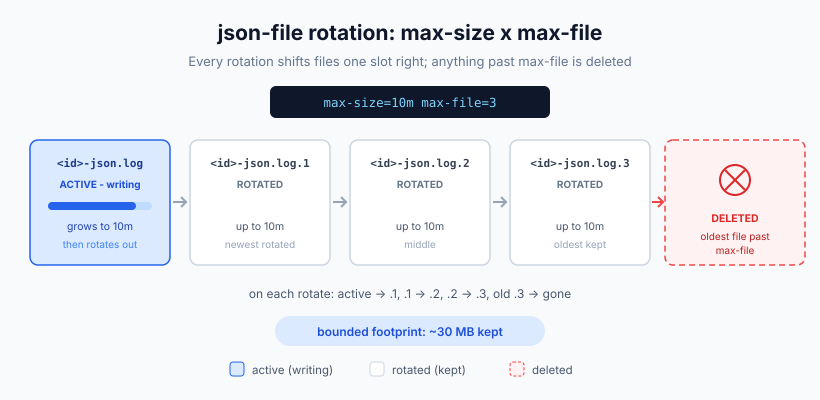
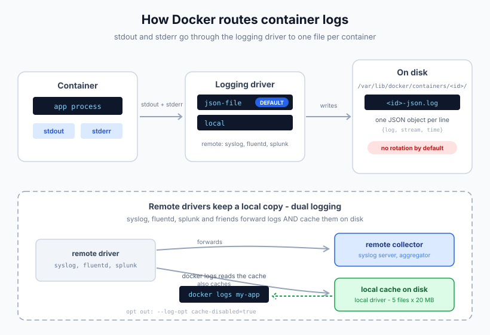

import Button from "@components/widgets/Button.astro";
import Notice from "@components/widgets/Notice.astro";
import ListCheck from "@components/widgets/ListCheck.astro";
import Accordion from "@components/widgets/Accordion.astro";
import Tabs from "@components/widgets/Tabs.astro";
import Tab from "@components/widgets/Tab.astro";

Docker stores each container's logs in a separate file under `/var/lib/docker/containers/`. Once you run more than a couple of containers, grepping through scattered per-container files gets old fast. This guide covers three ways to redirect Docker logs to a single file: a quick one-liner with `docker logs`, rotation through the `json-file` driver, and the `local` driver I recommend for most self-hosted setups.

Everything here was re-checked against Docker Engine 29.x in Oct 2026 (latest stable 29.8.2). Where behavior depends on the Engine version, I call it out inline. None of this needs paid tooling. And if you are stocking a new box, take a look at the [best Docker containers for a home server](https://www.bitdoze.com/docker-containers-home-server/) once logging is sorted.

<Notice type="info" title="Verified against Docker Engine 29.x">
Re-checked against the Docker docs and the moby release notes in Oct 2026. Version-specific features (like the local driver's `tag`/`labels` options) are marked inline so you know what applies to your fleet.
</Notice>

**Other Docker guides you might find useful:**

- [Add Users to a Docker Container](https://www.bitdoze.com/add-users-to-docker-container/)
- [Copy Multiple Files in One Layer Using a Dockerfile](https://www.bitdoze.com/copy-multiple-files-in-one-layer-using-a-dockerfile/)
- [Install Docker & Docker-compose for Ubuntu ARM](https://www.bitdoze.com/install-docker-ubuntu-arm/)
- [Environment Variables ARG and ENV in Docker](https://www.bitdoze.com/docker-env-vars/)

## What You Need

<ListCheck>
<ul>
<li>Docker Engine installed and running (19.03+; this guide verified on 29.x). If it is not installed yet, [install Docker on Ubuntu or ARM](https://www.bitdoze.com/install-docker-ubuntu-arm/).</li>
<li>sudo access or membership in the `docker` group.</li>
<li>A text editor for `/etc/docker/daemon.json`. On Docker Desktop you edit this via Settings → Docker Engine, not as a file on a VM.</li>
<li>Docker Compose, if you want to follow the Compose examples.</li>
</ul>
</ListCheck>

## Method 1: Redirect Docker Logs to a File with the `docker logs` Command

The simplest way to dump container logs to a file is to redirect the CLI output. If the CLI is rusty, keep my [essential Docker commands](https://www.bitdoze.com/docker-commands/) open in another tab.

```bash
docker logs my-container > container.log 2>&1
```

The `2>&1` part matters. Without it you only capture stdout, and stderr gets lost. This merges both streams into one file.

**Verify** the export worked:

```bash
ls -lh container.log && tail -n 20 container.log
```

If the file is zero bytes, the container is either silent or you dropped the `2>&1` while the app logs to stderr.

### Targeted exports with --since and --until

Most of the time you do not want the full history, just the window around an incident. The `docker logs` time filters are the cleanest way to save logs to a file for a specific period:

```bash
# last 24 hours only
docker logs --since 24h my-container > last24h.log 2>&1

# an exact window (ISO timestamps)
docker logs --since 2026-10-01T00:00:00Z --until 2026-10-02T00:00:00Z my-container > window.log 2>&1
```

Add `--timestamps` if you need the timestamps baked into the export instead of reconstructing them later.

### Follow logs continuously

To follow logs in real time and write them continuously:

```bash
docker logs -f my-container > container.log 2>&1 &
```

The `-f` flag follows new output and `&` runs it in the background. The limitation: the process dies when your shell session ends. For anything longer than a debug session, run it inside `tmux` or wrap it in `nohup`:

```bash
nohup docker logs -f my-container >> container.log 2>&1 &
```

### Capture multiple containers in one file

```bash
for container in $(docker ps --format '{{.Names}}'); do
  echo "=== $container ===" >> all-logs.log
  docker logs "$container" >> all-logs.log 2>&1
done
```

Failure modes are predictable: an empty file almost always means a missing `2>&1` on an app that logs to stderr, or a container that has not written anything yet (check `docker ps`). A background `docker logs -f` that "stopped logging" usually means the SSH session ended and took the job with it.

Use this method for quick debugging, one-off log exports, or when you need a snapshot of what is happening right now. For persistent single-file access on a running host, move on to Method 2.

## Method 2: Configure the `json-file` Driver with Log Rotation

Docker uses the `json-file` logging driver by default. It writes logs as JSON to `/var/lib/docker/containers/<id>/<id>-json.log`. The catch: no rotation is enabled by default. A chatty container will fill your disk. This is the single most common Docker disk issue on long-lived hosts.

The `json-file` driver also has a `compress` option for rotated files, and it defaults to `false`. Rotation alone does not shrink old files unless you turn compression on (the `local` driver in Method 3 compresses by default).

### Per-container configuration

Set the logging driver when starting a container:

```bash
docker run -d \
  --name my-app \
  --log-driver json-file \
  --log-opt max-size=10m \
  --log-opt max-file=3 \
  my-app:latest
```

- `max-size=10m` caps each log file at 10 MB
- `max-file=3` keeps 3 rotated files (the oldest gets deleted)

With these settings the container uses at most 30 MB for logs. Rotated files get numeric suffixes (`<id>-json.log.1`, `<id>-json.log.2`, and so on).



**Verify** the options are applied:

```bash
docker inspect -f '{{.HostConfig.LogConfig}}' my-app
```

You should see the driver plus the `max-size`/`max-file` options you passed.

### Daemon-wide configuration (`daemon.json`)

To apply rotation to every new container, edit `/etc/docker/daemon.json`:

```json
{
  "log-driver": "json-file",
  "log-opts": {
    "max-size": "10m",
    "max-file": "3"
  }
}
```

Before restarting the daemon, validate the config:

```bash
sudo dockerd --validate --config-file /etc/docker/daemon.json
```

Then restart Docker:

```bash
sudo systemctl restart docker
```

<Notice type="warning" title="daemon.json values must be strings">
Every value in `log-opts` must be a quoted string: `"max-file": "3"`. Writing `"max-file": 3` (number, no quotes) breaks the daemon. Also note that existing containers keep their original logging config until you recreate them. Restarting Docker does not rewrite what old containers are already using.
</Notice>

On Docker Desktop there is no `/etc/docker/daemon.json` to edit on a VM. Use Settings → Docker Engine, which edits the daemon config for the Desktop-managed engine.

### Non-blocking mode for chatty containers

By default Docker uses direct, blocking delivery to the logging driver. If the driver stalls (full disk, remote endpoint down), backpressure can block your application's writes to stdout and stderr. For chatty services where losing a log line beats stalling the app, switch to non-blocking mode:

```bash
docker run -d \
  --name my-app \
  --log-driver json-file \
  --log-opt max-size=10m \
  --log-opt max-file=3 \
  --log-opt mode=non-blocking \
  --log-opt max-buffer-size=4m \
  my-app:latest
```

The same in `daemon.json`:

```json
{
  "log-driver": "json-file",
  "log-opts": {
    "max-size": "10m",
    "max-file": "3",
    "mode": "non-blocking",
    "max-buffer-size": "4m"
  }
}
```

<Notice type="warning" title="Non-blocking mode drops log messages">
When the buffer is full, messages are discarded, not queued. The default buffer is `1m` per container. Fine for chatty app or telemetry logs, wrong for audit logs you cannot afford to lose. Remember the buffer is per container: sizing `max-buffer-size` across a few dozen containers adds up in RAM.
</Notice>

### Verify the configuration

Check the daemon default:

```bash
docker info --format '{{.LoggingDriver}}'
```

Check a single container's driver (the narrow inspect format the docs recommend):

```bash
docker inspect -f '{{.HostConfig.LogConfig.Type}}' my-app
```

Check where the log file lives:

```bash
docker inspect --format='{{.LogPath}}' my-app
```

## Method 3: Use the `local` Driver (Recommended for Production)

The `local` driver is Docker's recommended replacement for `json-file` in most situations. It uses an efficient binary format, compresses rotated files by default, and has good defaults: 20 MB per file, 5 files kept, which caps each container at roughly 100 MB of logs (5 x 20 MB before compression). `docker logs` works exactly the same way with both drivers.

One practical contrast with Method 2: `local` compresses by default, while `json-file` leaves `compress` off unless you set it.

Here is the same `local` driver config on all three surfaces:

<Tabs>
<Tab name="daemon.json">
```json
{
  "log-driver": "local"
}
```
Defaults apply: `max-size=20m`, `max-file=5`, `compress=true`. Restart the daemon afterwards with `sudo systemctl restart docker`.
</Tab>
<Tab name="docker run">
```bash
docker run -d \
  --name my-app \
  --log-driver local \
  my-app:latest
```
</Tab>
<Tab name="Docker Compose">
```yaml
services:
  api:
    image: my-app:latest
    logging:
      driver: local
```
</Tab>
</Tabs>

<Notice type="info" title="New in Engine 29.5.0: tag, labels, env on the local driver">
As of Docker Engine 29.5.0 (moby#52348) the `local` driver accepts the `label`, `label-regex`, `env`, `env-regex`, and `tag` log options, matching what `json-file` already supported. Heads up: the local driver docs options table has not caught up with the release notes yet, so test on your fleet before rolling it out everywhere. This removes the last common reason to prefer `json-file` over `local`.
</Notice>

Docker keeps `json-file` as the default because switching would break tools that read the json-file layout, Kubernetes being the main one. If you are not running Kubernetes (or anything that parses those files directly), use `local`.

A note on the old "reading rotated local logs costs temp disk and CPU" caveat: since Engine 27.4.0 (moby#48842), rotated and compressed files are decompressed lazily (only when read), and a parse error skips to the next rotated file instead of aborting the whole stream. Reading logs on a `local` driver host is less painful than it used to be.

### Docker Compose configuration

For Compose stacks, use the `logging` key:

```yaml
services:
  api:
    image: my-app:latest
    logging:
      driver: local

  worker:
    image: my-worker:latest
    logging:
      driver: json-file
      options:
        max-size: "20m"
        max-file: "5"
```

To apply the same logging config across all services with a YAML anchor:

```yaml
x-logging: &default-logging
  driver: json-file
  options:
    max-size: "10m"
    max-file: "3"

services:
  api:
    image: my-app:latest
    logging: *default-logging

  worker:
    image: my-worker:latest
    logging: *default-logging
```

Quote the option values in YAML (`"20m"`, not `20m`) for the same reason as in `daemon.json`: these are strings. While you are in the compose file, [Docker Compose secrets](https://www.bitdoze.com/docker-compose-secrets/) are worth a look if you still pass credentials as plain environment variables.

**Verify** after `docker compose up -d`:

```bash
docker inspect -f '{{.HostConfig.LogConfig.Type}}' my-app
```

Expected output: `local` (or `json-file`, depending on what you set). If you get the daemon default instead of your per-service value, the `logging:` block is not under the service, or you forgot to recreate the containers after editing.

## Where Docker Stores Container Log Files by Default

Before redirecting logs, it helps to understand what Docker does on its own:



- Docker captures stdout and stderr from every container.
- Each container gets its own log file under `/var/lib/docker/containers/<id>/`.
- With `json-file`, each line is a JSON object with timestamp and stream type.
- No rotation is enabled by default. This is the main problem.

Find the log file for a specific container:

```bash
docker inspect --format='{{.LogPath}}' my-container
```

Output looks like:

```
/var/lib/docker/containers/a4f8c9e1.../a4f8c9e1...-json.log
```

Each line is a JSON object:

```json
{"log":"Listening on port 8080\n","stream":"stdout","time":"2023-07-03T10:14:02.123456789Z"}
```

### Disk triage: what is actually eating the space

`docker system df` does not itemize per-container logs. To see which containers are the worst offenders:

```bash
du -sh /var/lib/docker/containers/*/*-json.log | sort -h | tail
```

For rotated files, widen the glob to `*-json.log*`. `docker ps -s` shows a size column per container, but it mixes writable layer and log data, so the `du` line is the honest one for logs.

Footprint math for planning: unrotated `json-file` is unbounded. `local` defaults cap you at about 100 MB per container (5 x 20 MB before compression). On a 20-container host that is the difference between "no ceiling" and roughly 2 GB of predictable log data.

When logs legitimately outgrow the disk, the right fix is usually more disk: [add a new drive and mount it permanently with LVM](https://www.bitdoze.com/add-new-drive-lvm/). And to catch a filling disk before logs do it for you, [monitor server disk usage with Beszel and Uptime Kuma](https://www.bitdoze.com/beszel-uptime-kuma/).

<Notice type="error" title="Do not run logrotate on Docker's log files">
The json-file and local driver docs are explicit about this: the log files are designed to be exclusively accessed by the Docker daemon, and interacting with them with external tools should be avoided. External rotation or truncation can corrupt log state or interfere with the daemon's logging in unpredictable ways. Use the driver's own `max-size`/`max-file` rotation instead.
</Notice>

## Forwarding Docker Logs to a Central System

For production setups with multiple hosts, consider forwarding logs to a central system instead of (or alongside) local files.

### Syslog driver

```bash
docker run -d \
  --log-driver syslog \
  --log-opt syslog-address=tcp://logs.example.com:514 \
  --log-opt tag="{{.Name}}" \
  my-app:latest
```

### Fluentd driver

```bash
docker run -d \
  --log-driver fluentd \
  --log-opt fluentd-address=localhost:24224 \
  --log-opt tag="docker.{{.Name}}" \
  my-app:latest
```

<Notice type="warning" title="fluentd-async-connect was removed in Docker 28.0">
The `fluentd-async-connect` option (deprecated since 20.10) was removed in Docker 28.0. Older tutorials still recommend it, and pasting it into a 28+ config errors out. Just drop the option. If you need timeouts, use `fluentd-write-timeout` (added 28.2.0) and `fluentd-read-timeout` (added 29.0.0).
</Notice>

One more removal worth knowing about: the `logentries` driver is gone. It was removed in Docker 25.0, and its migration code in 28.0. If you see it in old content, it does not exist on current Engines.

Since Docker 20.10, remote drivers (syslog, fluentd, splunk, and friends) keep a local cache alongside forwarding. Docker calls this **dual logging**, and it now has its own docs page: [Dual logging](https://docs.docker.com/engine/logging/dual-logging/). `docker logs` keeps working. The cache uses the `local` driver internally with 5 files of 20 MB each (before compression), per container. To disable the cache for a remote driver, add `"cache-disabled": "true"` to its `log-opts`.

Current driver list on the [logging overview](https://docs.docker.com/engine/logging/): `none`, `local`, `json-file`, `syslog`, `journald`, `gelf`, `fluentd`, `awslogs`, `splunk`, `etwlogs` (Windows), `gcplogs`.

One failure mode worth knowing: if the remote collector (fluentd, syslog) is unreachable, the default blocking delivery can stall your application's writes to stdout and stderr. Cross-check the non-blocking mode in Method 2 for that case.

## Common Docker Logging Issues (and Fixes)

**Container logs filling disk.** Enable rotation with `max-size` and `max-file` (Method 2). Without rotation, `json-file` has no upper bound. If the disk is already full and you need air right now, the last-resort move is to truncate the log file in place:

```bash
truncate -s 0 "$(docker inspect --format '{{.LogPath}}' my-container)"
```

<Notice type="warning" title="Truncate is a last resort">
Docker's docs warn against external tools touching daemon-managed log files. This is for the "disk is at 100% and the box is about to go read-only" moment, not a rotation strategy, and I have not validated the behavior on 29.x. Confirm on your Docker version. Recreating the container is cleaner. Then fix the real cause: enable rotation, and see [how to clean all Docker images and reclaim disk space](https://www.bitdoze.com/cleanup-all-docker-things/) plus [how to reclaim disk space from /var/lib/docker/overlay2](https://www.bitdoze.com/clean-docker-overlay2-dir/), the other big disk eater on Docker hosts.
</Notice>

**`docker logs` not showing output after changing the driver.** The container must be created after the daemon configuration change. Existing containers keep their original settings. Recreate them (or set the driver per container and restart that container).

**Daemon will not start after editing `daemon.json`.** Validate the JSON first:

```bash
sudo dockerd --validate --config-file /etc/docker/daemon.json
```

If the daemon is already down, check `journalctl -u docker` for the exact parse error. The usual culprit is an unquoted numeric value in `log-opts`.

**Log stream aborts mid-file or a corrupted rotated file kills the tail.** Fixed in Engine 27.4.0: parse errors while reading `json-file`/`local` logs now skip to the next rotated file instead of aborting the whole stream, and compressed files decompress lazily. If you are on an older Engine and see half-tails, upgrade rather than fighting the file format.

**Want to disable local caching for remote drivers.** Add `"cache-disabled": "true"` to the driver's `log-opts`. Trade-off: `docker logs` stops working for those containers.

## Which Method Should You Use?

| Method | Best for | Persistence | Supports `tag`/`labels` |
|--------|----------|-------------|-------------------------|
| `docker logs > file` | Quick debugging, one-off exports | No (runs in shell) | n/a |
| `json-file` with rotation | Single-host setups, Kubernetes | Yes (managed by Docker) | Yes |
| `local` driver | Single-host production setups | Yes (more efficient) | Yes, since 29.5.0 |
| `syslog`/`fluentd` | Multi-host, centralized logging | Yes (external system) | Driver-dependent |

For most self-hosted setups the `local` driver with default settings is the right choice. It rotates and compresses automatically, and it caps each container at a predictable footprint instead of betting on a quiet app. Whichever driver you pick, keep rotation on and watch disk usage with the `du` triage command from the section above.

<Button text="Essential Docker Commands" link="https://www.bitdoze.com/docker-commands/" variant="outline" color="blue" size="md" icon="arrow-right" />

If you are deploying compose stacks on a small box, an [affordable Hetzner Cloud VPS](https://go.bitdoze.com/hetzner) runs a dozen containers with logging to spare. For a home lab instead of a VPS, a [compact ASUS mini PC for a home server](https://go.bitdoze.com/asus-dc510) is enough to host the stack and its logs. And when you want a UI in front of it all, see how to [deploy a Docker Compose app in Dokploy](https://www.bitdoze.com/dokploy-docker-compose-app/).

## FAQ

<Accordion label="Can I use logrotate with Docker logs?" group="faq" expanded="true">
No. The json-file and local driver docs state that the log files are designed to be exclusively accessed by the Docker daemon, and interacting with them with external tools should be avoided. External rotation or truncation can corrupt log state or interfere with the daemon's logging in unpredictable ways. Use the driver's own `max-size`/`max-file` rotation instead.
</Accordion>

<Accordion label="Why is json-file still the default driver?" group="faq">
Backwards compatibility. Tools that read the json-file layout would break if Docker switched defaults, Kubernetes being the main one. If you are not in that camp, nothing stops you from setting `local` in `daemon.json` and moving on.
</Accordion>

<Accordion label="Do local and json-file behave the same with docker logs?" group="faq">
Yes. Same CLI, same flags (`-f`, `--since`, `--until`, `--tail`). The difference is storage: `local` uses a binary format and compresses rotated files by default, while `json-file` stores plain JSON and leaves compression off unless you enable the `compress` option.
</Accordion>

<Accordion label="What happened to fluentd-async-connect and the logentries driver?" group="faq">
`fluentd-async-connect` was deprecated in 20.10 and removed in Docker 28.0. Drop it from your config. The `logentries` driver was removed in Docker 25.0. Newer fluentd options are `fluentd-write-timeout` (28.2.0) and `fluentd-read-timeout` (29.0.0).
</Accordion>

<Accordion label="How do I check which logging driver a container uses?" group="faq">
For one container: `docker inspect -f '{{.HostConfig.LogConfig.Type}}' my-app`. For the daemon default that new containers inherit: `docker info --format '{{.LoggingDriver}}'`. If they disagree, the container was created with a per-container override or before a `daemon.json` change.
</Accordion>
