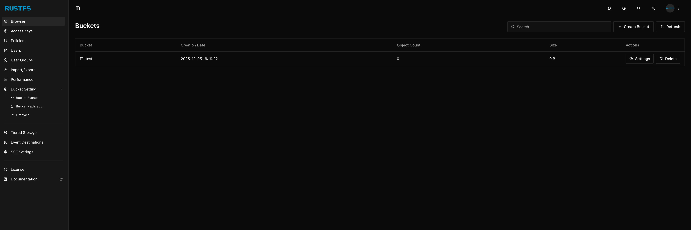

import { Image } from "astro:assets";
import Button from "@components/widgets/Button.astro";
import Notice from "@components/widgets/Notice.astro";
import ListCheck from "@components/widgets/ListCheck.astro";
import Accordion from "@components/widgets/Accordion.astro";
import YouTubeEmbed from "@components/widgets/YouTubeEmbed.astro";

If you've been using MinIO for S3-compatible object storage, you may have noticed recent changes to its licensing and feature availability. The MinIO "Community Edition" has effectively entered maintenance mode, with key features like the web console and replication being gated behind the commercial "AIStor" product.

Enter **RustFS** — a blazing-fast, 100% S3-compatible object storage system written in Rust that's specifically designed to be the MinIO replacement you've been looking for. In this guide, I'll show you how to self-host RustFS on your own infrastructure using either Dokploy (the easiest method) or Docker Compose.

## What is RustFS?

[RustFS](https://github.com/rustfs/rustfs) is a high-performance, distributed object storage system built in Rust. It was created explicitly to address the licensing and feature-gating issues users faced with MinIO while delivering even better performance.

### Key Features of RustFS

<ListCheck>
- **Blazing Fast Performance**: 2.3x faster than MinIO for 4KB object payloads, thanks to Rust's zero-cost abstractions and no garbage collection pauses
- **100% S3 Compatible**: Works seamlessly with any S3-compatible application, SDK, or tool
- **Built-in Web Console**: Full-featured management interface for buckets, users, and objects
- **Apache 2.0 License**: Permissive licensing with no AGPL restrictions or "poison pill" clauses
- **Memory Safe**: Built with Rust for memory safety by design — no GC pauses or memory leaks
- **Single Binary Deployment**: Simple deployment with minimal dependencies
- **Versioning Support**: Full object versioning capabilities
- **Event Notifications**: Webhook support for object events
- **Kubernetes Ready**: Helm charts available for cloud-native deployments
</ListCheck>

### RustFS vs MinIO vs Other Object Storage

| Feature | RustFS | MinIO | SeaweedFS | Garage |
|---------|--------|-------|-----------|--------|
| **Primary Goal** | Speed & MinIO drop-in replacement | Enterprise object storage | Scalability & billions of files | Reliability & self-hosting |
| **Web Console** | ✅ Built-in Console | ⚠️ Limited in Community Edition | ✅ Filer UI | ❌ External tools only |
| **License** | Apache 2.0 (Permissive) | AGPL v3 (Restrictive) | Apache 2.0 | AGPLv3 |
| **Language** | Rust (Memory safe, no GC) | Go (GC pauses) | Go | Rust |
| **Performance** | Extremely High (2.3x MinIO) | High | High | Moderate |
| **Maturity** | Alpha/Beta (Newer) | Very Stable | Very Stable | Stable |

<Notice type="warning" title="Maturity Consideration">
RustFS is much newer than SeaweedFS or MinIO. While it's "batteries included" with a great web console, it hasn't been battle-tested for as many years. For critical production data, run extensive tests or consider a hybrid approach during the evaluation period.
</Notice>

### Why Choose RustFS?

**The "MinIO Feel"**: RustFS replicates the ease of use of MinIO, including a nice web console for managing buckets and users. If you're migrating from MinIO, you'll feel right at home.

**Superior Performance**: RustFS is designed to be incredibly fast. Rust avoids the "Garbage Collection" pauses that Go (MinIO's language) suffers from, making it particularly excellent for small file operations.

**Apache 2.0 License**: This is crucial for businesses. Unlike MinIO (AGPL), you can use RustFS in commercial products without legal headaches or source code disclosure requirements.

**Active Development**: The project has gained significant traction with 13.8k+ GitHub stars and active community development.

## Prerequisites

Before you begin, make sure you have:

<ListCheck>
- **A VPS or Server**: Minimum 2GB RAM and 2 CPU cores (4GB+ recommended for production)
- **A Domain Name**: For accessing your RustFS console (e.g., `storage.yourdomain.com`)
- **Docker Installed**: Docker 20.10+ and Docker Compose
- **Storage Space**: Adequate disk space for your object storage needs
- **Basic Command Line Knowledge**: For running deployment commands
</ListCheck>

<Button text="Try Hetzner Cloud Now" link="https://go.bitdoze.com/hetzner" variant="solid" color="blue" size="lg" external={true} icon="rocket-launch" />

<Notice type="info" title="Hosting Recommendations">
For production use, we recommend a VPS with at least 4GB RAM and SSD/NVMe storage. Avoid network file systems (NFS) for the data directory. Providers like Hetzner, DigitalOcean, or AWS work well.
</Notice>

## Understanding RustFS Ports

RustFS uses two ports by default:

- **Port 9000**: S3 API endpoint — this is where your applications connect to interact with object storage
- **Port 9001**: Web Console — the management interface for creating buckets, managing users, and viewing objects

## Option 1: Deploy with Dokploy (Easiest Method)

Dokploy is an open-source Platform as a Service that simplifies deploying Docker applications. If you haven't set up Dokploy yet, check out our [Dokploy Installation Guide](https://www.bitdoze.com/dokploy-install/).

### Step 1: Install Dokploy

If not already installed:

```sh
curl -sSL https://dokploy.com/install.sh | sh
```

Access Dokploy at `http://your-vps-ip:3000` and complete the setup.

### Step 2: Create a New Project

1. Log in to Dokploy dashboard
2. Click **"Create Project"** and name it (e.g., "RustFS")
3. Inside the project, click **"Add Service"** → **"Compose"**
4. Select **"Docker Compose"** type (not Stack)
5. Name it "rustfs-stack"

### Step 3: Add Docker Compose Configuration

Go to the **General** tab and paste the following Docker Compose configuration:

```yaml
services:
  rustfs:
    image: rustfs/rustfs:latest
    networks:
      - dokploy-network
    volumes:
      - rustfs-data:/data
      - rustfs-logs:/app/logs
    environment:
      - RUSTFS_VOLUMES=/data
      - RUSTFS_ADDRESS=0.0.0.0:9000
      - RUSTFS_CONSOLE_ADDRESS=0.0.0.0:9001
      - RUSTFS_CONSOLE_ENABLE=true
      - RUSTFS_ACCESS_KEY=${RUSTFS_ACCESS_KEY:-rustfsadmin}
      - RUSTFS_SECRET_KEY=${RUSTFS_SECRET_KEY}
      - RUSTFS_CORS_ALLOWED_ORIGINS=*
      - RUSTFS_CONSOLE_CORS_ALLOWED_ORIGINS=*
    healthcheck:
      test: ["CMD", "sh", "-c", "curl -f http://localhost:9000/health && curl -f http://localhost:9001/rustfs/console/health"]
      interval: 30s
      timeout: 10s
      retries: 3
      start_period: 40s
    restart: unless-stopped
    deploy:
      resources:
        limits:
          cpus: "2.0"
          memory: 4GB

networks:
  dokploy-network:
    external: true

volumes:
  rustfs-data:
  rustfs-logs:
```

<Notice type="info" title="Volume Explanation">
- `rustfs-data:/data` - Persists all object storage data (buckets and objects)
- `rustfs-logs:/app/logs` - Persists RustFS logs for debugging and monitoring

Using named volumes ensures data persists across Dokploy deployments.
</Notice>

### Step 4: Configure the Domains

This Docker Compose configuration doesn't include Traefik labels or exposed ports. Instead, configure domains through **Dokploy's Domain tab**:

Be sure that they are pointing to the server.

1. After deploying, go to the **Domains** tab for your compose service
2. Click **Add Domain** and configure for the S3 API:
   - **Domain**: `s3.yourdomain.com`
   - **Container**: Select the `rustfs` service
   - **Port**: `9000`
   - Enable **HTTPS** for automatic SSL
3. Add another domain for the Console:
   - **Domain**: `storage.yourdomain.com`
   - **Container**: Select the `rustfs` service
   - **Port**: `9001`
   - Enable **HTTPS** for automatic SSL

This approach is cleaner than inline Traefik labels and allows easy domain management through the Dokploy UI.


<Notice type="warning" title="Important Notes">
- The `dokploy-network` is required for Traefik routing
- Don't set `container_name` as it causes issues with Dokploy features
- Generate a strong secret key for production use
</Notice>

### Step 5: Configure Environment Variables

Go to the **Environment** tab and add these variables:

```sh
# RustFS Access Key (username)
RUSTFS_ACCESS_KEY=rustfsadmin

# RustFS Secret Key (password - generate a strong one!)
RUSTFS_SECRET_KEY=your-super-secure-secret-key-here

# Your domain (optional, for virtual-hosted style URLs)
SERVER_DOMAIN=s3.yourdomain.com
```

Generate a secure secret key:

```sh
openssl rand -base64 32
```

### Step 6: Configure DNS

Before deploying, set up your DNS A records:

1. `s3.yourdomain.com` → Your VPS IP (for S3 API)
2. `storage.yourdomain.com` → Your VPS IP (for Web Console)

### Step 7: Deploy and Access

1. Click **"Deploy"** and wait for the service to start
2. Monitor the logs in the **Deployments** or **Logs** tab
3. Go to the **Domains** tab and add domains for each port (see notes above)
4. Wait about 30 seconds for Traefik to generate SSL certificates

Once deployed, access the web console at `https://storage.yourdomain.com` with your configured credentials.





## Option 2: Deploy with Docker Compose Only

For more manual control or if you prefer not to use Dokploy, here's how to deploy with Docker Compose directly.

### Step 1: Prepare Your Server

Update system and install Docker:

```sh
# Update packages
sudo apt update && sudo apt upgrade -y

# Install Docker
curl -fsSL https://get.docker.com -o get-docker.sh
sudo sh get-docker.sh

# Install Docker Compose plugin
sudo apt install docker-compose-plugin -y
```

### Step 2: Create Project Directory and Set Permissions

RustFS container runs as a non-root user `rustfs` with UID `10001`. You need to set the correct ownership for mounted directories:

```sh
mkdir -p ~/rustfs
cd ~/rustfs

# Create data and logs directories
mkdir -p data logs

# Change the owner to match the container user (UID 10001)
sudo chown -R 10001:10001 data logs
```

<Notice type="info" title="Logs Directory">
RustFS stores logs in `/app/logs` inside the container. We mount `./logs` to `/app/logs` for persistence.
</Notice>

<Notice type="warning" title="Permission Required">
If you skip the `chown` step, RustFS will encounter "permission denied" errors when trying to write data. The container runs as UID 10001 for security purposes.
</Notice>

### Step 3: Create Docker Compose File

```sh
nano docker-compose.yml
```

Paste the following configuration:

```yaml
services:
  rustfs:
    image: rustfs/rustfs:latest
    container_name: rustfs
    networks:
      - rustfs-network
    volumes:
      - ./data:/data
      - ./logs:/app/logs
    environment:
      - RUSTFS_VOLUMES=/data
      - RUSTFS_ADDRESS=0.0.0.0:9000
      - RUSTFS_CONSOLE_ADDRESS=0.0.0.0:9001
      - RUSTFS_CONSOLE_ENABLE=true
      - RUSTFS_ACCESS_KEY=${RUSTFS_ACCESS_KEY:-rustfsadmin}
      - RUSTFS_SECRET_KEY=${RUSTFS_SECRET_KEY}
      - RUSTFS_CORS_ALLOWED_ORIGINS=*
      - RUSTFS_CONSOLE_CORS_ALLOWED_ORIGINS=*
    ports:
      - "9000:9000"
      - "9001:9001"
    healthcheck:
      test: ["CMD", "sh", "-c", "curl -f http://localhost:9000/health && curl -f http://localhost:9001/rustfs/console/health"]
      interval: 30s
      timeout: 10s
      retries: 3
      start_period: 40s
    restart: unless-stopped
    deploy:
      resources:
        limits:
          cpus: "2.0"
          memory: 4GB

networks:
  rustfs-network:
    name: rustfs-network
```

### Step 4: Create Environment File

```sh
nano .env
```

Add your configuration:

```sh
# RustFS Access Key (username)
RUSTFS_ACCESS_KEY=rustfsadmin

# RustFS Secret Key (password - CHANGE THIS!)
RUSTFS_SECRET_KEY=your-super-secure-secret-key-minimum-8-chars
```

<Notice type="warning" title="Security Warning">
Never use the default credentials in production! Generate a strong secret key using `openssl rand -base64 32`.
</Notice>

### Step 5: Start RustFS

```sh
# Start services
docker compose up -d

# View logs
docker compose logs -f

# Check status
docker compose ps
```

You should see output indicating RustFS is running and the console is available.

### Step 6: Set Up Reverse Proxy with Nginx

For production with custom domains and SSL:

```sh
sudo apt install nginx certbot python3-certbot-nginx -y
```

Create Nginx configuration:

```sh
sudo nano /etc/nginx/sites-available/rustfs
```

Paste:

```nginx
# RustFS S3 API
server {
    listen 80;
    server_name s3.yourdomain.com;

    # Allow large file uploads
    client_max_body_size 0;

    location / {
        proxy_pass http://localhost:9000;
        proxy_http_version 1.1;
        proxy_set_header Upgrade $http_upgrade;
        proxy_set_header Connection 'upgrade';
        proxy_set_header Host $host;
        proxy_set_header X-Real-IP $remote_addr;
        proxy_set_header X-Forwarded-For $proxy_add_x_forwarded_for;
        proxy_set_header X-Forwarded-Proto $scheme;
        proxy_cache_bypass $http_upgrade;

        # Timeouts for large uploads
        proxy_connect_timeout 300;
        proxy_send_timeout 300;
        proxy_read_timeout 300;
    }
}

# RustFS Console
server {
    listen 80;
    server_name storage.yourdomain.com;

    location / {
        proxy_pass http://localhost:9001;
        proxy_http_version 1.1;
        proxy_set_header Upgrade $http_upgrade;
        proxy_set_header Connection 'upgrade';
        proxy_set_header Host $host;
        proxy_set_header X-Real-IP $remote_addr;
        proxy_set_header X-Forwarded-For $proxy_add_x_forwarded_for;
        proxy_set_header X-Forwarded-Proto $scheme;
        proxy_cache_bypass $http_upgrade;
    }
}
```

Enable the site and get SSL certificates:

```sh
sudo ln -s /etc/nginx/sites-available/rustfs /etc/nginx/sites-enabled/
sudo nginx -t
sudo systemctl reload nginx

# Get SSL certificates
sudo certbot --nginx -d s3.yourdomain.com -d storage.yourdomain.com
```

## Option 3: Quick Start with Docker Run

For quick testing without Docker Compose:

```sh
# Create directories and set permissions
mkdir -p data logs
sudo chown -R 10001:10001 data logs

# Run RustFS
docker run -d \
  --name rustfs \
  -p 9000:9000 \
  -p 9001:9001 \
  -v $(pwd)/data:/data \
  -v $(pwd)/logs:/app/logs \
  -e RUSTFS_VOLUMES=/data \
  -e RUSTFS_ADDRESS=0.0.0.0:9000 \
  -e RUSTFS_CONSOLE_ADDRESS=0.0.0.0:9001 \
  -e RUSTFS_CONSOLE_ENABLE=true \
  -e RUSTFS_ACCESS_KEY=rustfsadmin \
  -e RUSTFS_SECRET_KEY=your-secret-key-here \
  rustfs/rustfs:latest
```

Access the console at `http://localhost:9001` with your credentials.

## Using RustFS

### Access the Web Console

Open your browser and navigate to:

- **Local**: `http://localhost:9001`
- **With Domain**: `https://storage.yourdomain.com`

Log in with your configured access key and secret key (default: `rustfsadmin` / `rustfsadmin`).

### Create a Bucket

1. In the console, click **"Create Bucket"**
2. Enter a bucket name (e.g., `my-first-bucket`)
3. Configure versioning and locking options as needed
4. Click **"Create Bucket"**

### Upload Objects

1. Click on your bucket name
2. Click **"Upload"** or drag and drop files
3. Your files are now stored in RustFS!

### Using S3 CLI (mc)

RustFS is fully compatible with MinIO Client (mc) and AWS CLI:

```sh
# Install MinIO Client
curl https://dl.min.io/client/mc/release/linux-amd64/mc -o mc
chmod +x mc
sudo mv mc /usr/local/bin/

# Configure alias
mc alias set rustfs http://localhost:9000 rustfsadmin your-secret-key

# Or with domain
mc alias set rustfs https://s3.yourdomain.com rustfsadmin your-secret-key

# Create bucket
mc mb rustfs/my-bucket

# Upload file
mc cp myfile.txt rustfs/my-bucket/

# List objects
mc ls rustfs/my-bucket

# Download file
mc cp rustfs/my-bucket/myfile.txt ./downloaded.txt
```

### Using AWS CLI

```sh
# Configure AWS CLI
aws configure
# Access Key ID: rustfsadmin
# Secret Access Key: your-secret-key
# Region: us-east-1 (or any)
# Output format: json

# Use with endpoint URL
aws --endpoint-url http://localhost:9000 s3 ls

# Create bucket
aws --endpoint-url http://localhost:9000 s3 mb s3://my-bucket

# Upload file
aws --endpoint-url http://localhost:9000 s3 cp myfile.txt s3://my-bucket/

# List objects
aws --endpoint-url http://localhost:9000 s3 ls s3://my-bucket/
```

## Integrating with Applications

### Using with Backup Tools

RustFS works with any S3-compatible backup tool. Here's an example with Restic:

```sh
# Set environment variables
export AWS_ACCESS_KEY_ID=rustfsadmin
export AWS_SECRET_ACCESS_KEY=your-secret-key
export RESTIC_REPOSITORY=s3:http://localhost:9000/backups

# Initialize repository
restic init

# Create backup
restic backup /path/to/data
```

### Using with Docker Registry

Configure Docker Registry to use RustFS as storage backend:

```yaml
services:
  registry:
    image: registry:2
    environment:
      REGISTRY_STORAGE: s3
      REGISTRY_STORAGE_S3_ACCESSKEY: rustfsadmin
      REGISTRY_STORAGE_S3_SECRETKEY: your-secret-key
      REGISTRY_STORAGE_S3_REGION: us-east-1
      REGISTRY_STORAGE_S3_BUCKET: docker-registry
      REGISTRY_STORAGE_S3_REGIONENDPOINT: http://rustfs:9000
```

### Using with Applications

Most applications that support S3 can use RustFS. Common environment variables:

```sh
S3_ENDPOINT=http://localhost:9000
S3_ACCESS_KEY=rustfsadmin
S3_SECRET_KEY=your-secret-key
S3_BUCKET=my-bucket
S3_REGION=us-east-1
```

## Configuration Options

### Environment Variables

| Variable | Description | Default |
|----------|-------------|---------|
| `RUSTFS_VOLUMES` | Storage volume path(s) | — |
| `RUSTFS_ACCESS_KEY` | Access key (username) | `rustfsadmin` |
| `RUSTFS_SECRET_KEY` | Secret key (password) | `rustfsadmin` |
| `RUSTFS_ADDRESS` | S3 API bind address | `0.0.0.0:9000` |
| `RUSTFS_CONSOLE_ADDRESS` | Console bind address | `0.0.0.0:9001` |
| `RUSTFS_CONSOLE_ENABLE` | Enable web console | `false` |
| `RUSTFS_CORS_ALLOWED_ORIGINS` | CORS allowed origins for S3 API | — |
| `RUSTFS_CONSOLE_CORS_ALLOWED_ORIGINS` | CORS allowed origins for console | — |
| `RUSTFS_EXTERNAL_ADDRESS` | External address for redirects | — |
| `RUSTFS_TLS_PATH` | Path to TLS certificates | — |
| `RUSTFS_OBS_ENDPOINT` | OpenTelemetry endpoint | — |
| `RUSTFS_OBS_LOGGER_LEVEL` | Log level (info, debug, etc.) | `info` |

### Command Line Arguments

RustFS can also be configured via command line arguments, though environment variables are recommended for Docker deployments:

```sh
rustfs [OPTIONS] <VOLUMES>

Options:
  --address <ADDRESS>              S3 API bind address (default: :9000)
  --console-address <ADDRESS>      Console bind address (default: :9001)
  --console-enable                 Enable the web console
  --access-key <KEY>               Set access key
  --secret-key <KEY>               Set secret key
  --server-domains <DOMAINS>       Set server domains
```

### TLS Configuration

For native TLS without a reverse proxy:

```yaml
services:
  rustfs:
    image: rustfs/rustfs:latest
    volumes:
      - ./data:/data
      - ./certs:/certs
    environment:
      - RUSTFS_TLS_PATH=/certs
    command: ["--address", ":9000", "/data"]
```

Place your `public.crt` and `private.key` in the `./certs` directory.

## Maintenance and Backups

### Backup Strategy

For RustFS data, back up the entire data directory:

```sh
# Stop RustFS (optional, for consistent backup)
docker compose stop rustfs

# Backup data directory
tar -czvf rustfs-backup-$(date +%Y%m%d).tar.gz ./data

# Restart RustFS
docker compose start rustfs
```

For automated backups, create a cron job:

```sh
# Edit crontab
crontab -e

# Add daily backup at 2 AM
0 2 * * * cd /home/user/rustfs && tar -czvf /backups/rustfs-$(date +\%Y\%m\%d).tar.gz ./data
```

### Updating RustFS

```sh
# Pull latest image
docker compose pull

# Recreate container with new image
docker compose up -d

# Clean up old images
docker image prune -f
```

<Notice type="info" title="Version Pinning">
For production, consider pinning to a specific version:

```yaml
image: rustfs/rustfs:1.0.0.alpha.68
```

Check the [RustFS releases](https://github.com/rustfs/rustfs/releases) for the latest version.
</Notice>

### Monitoring

RustFS supports observability through Prometheus metrics. The official docker-compose includes Grafana, Prometheus, and Jaeger:

```sh
# Clone RustFS repository
git clone https://github.com/rustfs/rustfs.git
cd rustfs

# Start with observability stack
docker compose --profile observability up -d
```

This starts:
- **Grafana** on port 3000
- **Prometheus** on port 9090
- **Jaeger** on port 16686

## Security Best Practices

<ListCheck>
- **Change Default Credentials**: Never use `rustfsadmin/rustfsadmin` in production
- **Use Strong Secret Keys**: Generate with `openssl rand -base64 32`
- **Enable TLS**: Use HTTPS for all connections (via reverse proxy or native TLS)
- **Restrict Network Access**: Use firewall rules to limit access to ports 9000/9001
- **Regular Backups**: Implement automated backup strategy
- **Monitor Logs**: Check logs regularly for suspicious activity
- **Keep Updated**: Regularly update to the latest RustFS version
- **Use Named Volumes**: For Docker deployments, use named volumes for data persistence
</ListCheck>

## Migrating from MinIO

RustFS is designed as a drop-in replacement for MinIO. For most applications, you can:

1. Export your data from MinIO using `mc mirror`
2. Deploy RustFS with the same bucket structure
3. Import your data using `mc mirror`
4. Update your application's S3 endpoint URL

```sh
# Export from MinIO
mc mirror minio/my-bucket ./backup/

# Import to RustFS
mc mirror ./backup/ rustfs/my-bucket/
```

## Conclusion

RustFS provides an excellent self-hosted alternative to MinIO with better performance, a permissive Apache 2.0 license, and a familiar user experience. While it's still newer than MinIO or SeaweedFS, its rapid development and strong community make it worth considering for your object storage needs.

### Key Takeaways

<ListCheck>
- **Performance**: 2.3x faster than MinIO for small object operations
- **License**: Apache 2.0 — no AGPL restrictions
- **Compatibility**: 100% S3 compatible with built-in web console
- **Easy Deployment**: Single container with minimal configuration
- **Active Development**: Rapidly growing with strong community support
</ListCheck>

### Next Steps

<ListCheck>
- Explore the [RustFS Documentation](https://docs.rustfs.com/) for advanced configuration
- Set up automated backups for your data
- Configure monitoring with Prometheus and Grafana
- Join the [GitHub Discussions](https://github.com/rustfs/rustfs/discussions) community
- Consider contributing to the project
</ListCheck>

## Frequently Asked Questions

<Accordion label="Is RustFS production-ready?" group="faq">
RustFS is currently in alpha/beta stage. While it's feature-complete for basic object storage operations and performs excellently in benchmarks, it hasn't been battle-tested as long as MinIO or SeaweedFS. For critical production workloads, consider running extensive tests first or maintaining backups on a proven system during the evaluation period.
</Accordion>

<Accordion label="Can I migrate from MinIO to RustFS?" group="faq">
Yes! RustFS is designed as a drop-in replacement for MinIO. You can use `mc mirror` to copy data between MinIO and RustFS. Since both are 100% S3 compatible, your applications should work without code changes — just update the endpoint URL.
</Accordion>

<Accordion label="What's the difference between ports 9000 and 9001?" group="faq">
- **Port 9000**: The S3 API endpoint — this is where applications connect to upload/download objects
- **Port 9001**: The web console — a management interface for creating buckets, managing users, and browsing objects

For applications, you'll typically only expose port 9000. The console (9001) can be restricted to internal access.
</Accordion>

<Accordion label="Why do I need to chown the data directory to UID 10001?" group="faq">
RustFS runs as a non-root user inside the container for security purposes. This user has UID 10001. If you mount a host directory, it needs to be owned by this UID so RustFS can write data. This is a security best practice that prevents the container from running as root.
</Accordion>

<Accordion label="How does RustFS compare to SeaweedFS?" group="faq">
Both are excellent S3-compatible storage systems:
- **RustFS**: Focuses on performance and being a MinIO drop-in replacement with a web console
- **SeaweedFS**: More mature, focuses on scalability with billions of small files

Choose RustFS if you want the MinIO experience with better performance. Choose SeaweedFS if you need proven stability and massive scale.
</Accordion>

<Accordion label="Does RustFS support distributed/cluster mode?" group="faq">
Distributed mode is currently under testing in RustFS. For production cluster deployments, you may want to wait for the feature to stabilize or use the single-node mode with proper backups. Check the [RustFS GitHub](https://github.com/rustfs/rustfs) for the latest status on distributed mode.
</Accordion>

<Accordion label="Can I use RustFS with Kubernetes?" group="faq">
Yes! RustFS provides official Helm charts for Kubernetes deployment. Check the `helm/` directory in the RustFS repository for installation instructions. The charts support various configurations including resource limits, persistence, and ingress.
</Accordion>

<Accordion label="How do I enable TLS/HTTPS?" group="faq">
You have two options:
1. **Reverse Proxy (Recommended)**: Use Nginx, Traefik, or Caddy in front of RustFS to handle TLS termination
2. **Native TLS**: Mount certificates to the container and set `RUSTFS_TLS_PATH=/certs`

For Dokploy deployments, HTTPS is automatically handled by Traefik when you configure domains.
</Accordion>
