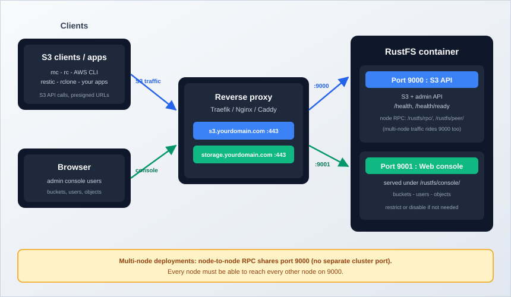
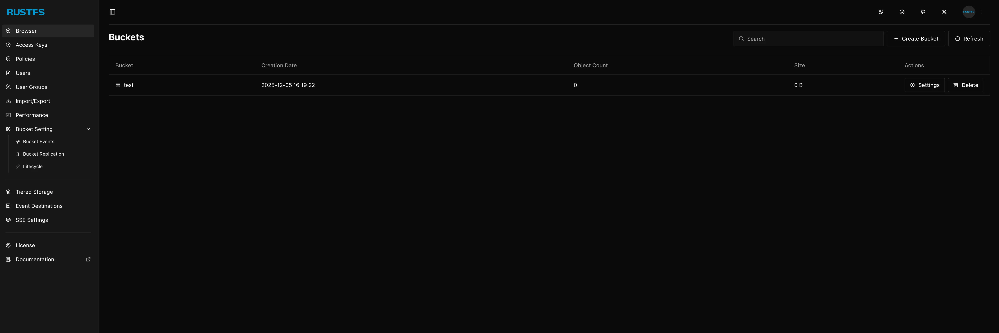

import { Image } from "astro:assets";
import Button from "@components/widgets/Button.astro";
import Notice from "@components/widgets/Notice.astro";
import ListCheck from "@components/widgets/ListCheck.astro";
import Accordion from "@components/widgets/Accordion.astro";
import Tabs from "@components/widgets/Tabs.astro";
import Tab from "@components/widgets/Tab.astro";
import YouTubeEmbed from "@components/widgets/YouTubeEmbed.astro";

If you self-host RustFS today, you're deploying one of the fastest-rising S3-compatible object storage servers around — and with MinIO's repository now archived, RustFS 1.0 (GA September 2026) has become the default MinIO alternative for self-hosters. This guide covers two deployment paths, Dokploy (easiest) or plain Docker Compose, plus the verify, backup, and scaling steps that turn a demo into storage you can actually trust with data.

The December 2025 version of this guide deployed a pre-release build. Everything below was re-checked against the official docs and repositories in September 2026, and several configuration details changed along the way — including two mistakes in my earlier compose files that I've fixed here.

## What Is RustFS?

[RustFS](https://github.com/rustfs/rustfs) is a high-performance, distributed S3-compatible object storage server written in Rust and released under the Apache 2.0 license. The project open-sourced in July 2025 and moved fast: 10k GitHub stars by October 2025, 20k by January 2026, beta in April 2026, and 1.0.0 GA on September 16, 2026. It now sits at 33k+ stars, 10M+ Docker Hub pulls, and 160+ contributors. (The "2.7M+ instances deployed" figure from the GA announcement is a vendor claim — impressive either way, but attribute it as marketing.)

Three things make it a strong MinIO alternative rather than just another S3 server:

- **The MinIO feel.** RustFS replicates MinIO's interface, including a web console for buckets, users, and objects. If you're migrating from MinIO, you'll feel at home.
- **Rust instead of Go.** Memory safety without garbage collection pauses, which matters for small-object workloads.
- **Apache 2.0.** No AGPL obligations. You can use it in commercial products without source-disclosure requirements.

### Key Features of RustFS (1.0 GA)

The 1.0 feature set is a big step up from the alpha builds most early guides (including mine) covered:

<ListCheck>
- **Distributed mode + erasure coding**: multi-drive and multi-node deployments are GA, not "under testing"
- **Server-side encryption**: SSE-S3 (AES256), SSE-C, and SSE-KMS with local, Vault KV2/Transit, or AWS KMS backends
- **Bucket and site replication**: GA at 1.0.0
- **Lifecycle management (ILM)** with remote-S3 tiering
- **Audit logging, OIDC, mTLS, multi-tenancy**: enterprise-style controls without the enterprise license
- **Event notifications**: webhook, Kafka, MQTT, MySQL, Postgres, NATS, Redis, AMQP, Pulsar
- **S3 Tables**: built-in Apache Iceberg REST catalog (Preview as of September 2026)
- **More than S3**: WebDAV, FTP/FTPS (plus opt-in SFTP/Swift), and an MCP server for AI assistants
- **Single-container deployment**: ~110MB image, amd64 and arm64
</ListCheck>

### RustFS vs MinIO vs Other Object Storage

| Feature | RustFS | MinIO | SeaweedFS | Garage |
|---------|--------|-------|-----------|--------|
| **Primary goal** | MinIO drop-in replacement, speed | Enterprise object storage (AIStor) | Billions of small files | Reliability, geo-distribution |
| **Web console** | ✅ Built-in | ❌ Community edition is source-only, no maintained binaries | ✅ Filer UI | ❌ External tools |
| **License** | Apache 2.0 | AGPLv3 (source-only community) | Apache 2.0 | AGPLv3 |
| **Language** | Rust (no GC) | Go | Go | Rust |
| **Performance** | High — early vendor benchmarks claimed ~2.3x MinIO on small-object GETs; run your own `warp`/`s3bench` test | High | High | Moderate |
| **Maturity** | GA (1.0.0, Sep 2026) | Archived (last binary Oct 2025) | Very stable | Stable |
| **Protocols** | S3 + WebDAV + FTP/FTPS + MCP | S3 | S3 (+ WebDAV) | S3 |

<Notice type="info" title="GA, But Do Your Own Due Diligence">
GA means the vendor considers the core object storage engine production-ready. It does not mean RustFS has MinIO's or SeaweedFS's years of field mileage. The combination that works: pin your version, keep backups, test restores, and read the release notes before upgrading. That's true for any storage system, but it matters more the younger the project is.
</Notice>

### What's New Since Our December 2025 Guide

If you read the earlier version of this post, here's what changed:

<Notice type="info" title="Updated September 2026">
- **RustFS 1.0.0 GA** released 2026-09-16 (the previous guide deployed `1.0.0.alpha.68`)
- **MinIO's GitHub repository is archived** — "no longer maintained," community edition is source-only, last binary release was October 2025
- **Distributed mode, erasure coding, SSE/KMS, and replication are all GA**
- **First-party `rc` CLI** ([rustfs/cli](https://github.com/rustfs/cli)) joins `mc` and the AWS CLI
- **New install options**: RPM/DEB packages, Helm chart on ArtifactHub, Kubernetes operator, one-click install script
- **SSRF outbound policy** (since 1.0.0-beta.11) blocks webhook and notification targets on private networks by default — a new gotcha covered below
- **Corrections to this guide**: `SERVER_DOMAIN` never existed in the env-var reference (it's `RUSTFS_SERVER_DOMAINS`), the console is enabled by default, and the log volume in my old compose files was inert without `RUSTFS_OBS_LOG_DIRECTORY`
</Notice>

<YouTubeEmbed
  url="https://www.youtube.com/embed/pNY7NlPuFyM"
  label="RustFS: The Lightweight S3 Solution You Need in 2026"
/>

## Prerequisites

Before you begin, make sure you have:

<ListCheck>
- **A VPS or server**: minimum 2GB RAM and 2 CPU cores; 4GB+ recommended for production
- **A domain name**: one for the S3 API (`s3.yourdomain.com`) and one for the console (`storage.yourdomain.com`)
- **Docker 20.10+** with Docker Compose (or an existing Dokploy install)
- **Fast local storage**: SSD/NVMe for the data directory; avoid NFS
- **A topology decision**: single-node single-drive deployments cannot expand in place, so decide before the first deploy (see [Scaling Out](#scaling-out-multi-drive-and-multi-node))
</ListCheck>

<Button text="Try Hetzner Cloud Now" link="https://go.bitdoze.com/hetzner" variant="solid" color="blue" size="lg" external={true} icon="rocket-launch" />
<Button text="Try Hostinger VPS" link="https://go.bitdoze.com/hostinger-vps" variant="solid" color="green" size="lg" external={true} icon="rocket-launch" />

<Notice type="info" title="Hosting Recommendations">
A €4–8/month VPS is enough to start — storage growth dominates the long-term bill, not CPU or RAM. For a full comparison, see our [Hetzner vs DigitalOcean vs Vultr VPS comparison](https://www.bitdoze.com/digitalocean-vs-vultr-vs-hetzner/). The image is amd64 + arm64 and about 110MB, so a [compact mini PC home server](https://go.bitdoze.com/asus-dc510) works fine for homelab use too. Whatever you pick: local SSD/NVMe, no NFS on the data directory.
</Notice>

## Understanding RustFS Ports (9000 vs 9001)

RustFS uses two ports:

- **Port 9000**: the S3 API endpoint. Applications connect here. It also serves the unauthenticated health endpoints (`/health`, `/health/ready`) and, in multi-node deployments, the internal node-to-node RPC paths (`/rustfs/rpc/`, `/rustfs/peer/`). There is no separate cluster port.
- **Port 9001**: the web console for buckets, users, and objects, served under the `/rustfs/console/` path.



In practice you put a reverse proxy with TLS in front of both and only expose 443. That proxy is also why the console health check lives at `https://storage.yourdomain.com/rustfs/console/health` rather than at the root.

## Option 1: Self-Host RustFS with Dokploy

Dokploy is the fastest path if you already run it — a compose service plus two domains, and Traefik handles TLS. If you're still choosing a PaaS, see our [Coolify vs Dokploy vs Kamal 2 comparison](https://www.bitdoze.com/coolify-vs-dokploy-vs-kamal-2/).

### Step 1: Install Dokploy

If you don't have Dokploy yet, follow the [Dokploy installation guide](https://www.bitdoze.com/dokploy-install/), then:

```sh
curl -sSL https://dokploy.com/install.sh | sh
```

Access Dokploy at `http://your-vps-ip:3000` and complete setup.

### Step 2: Create a New Project

1. Log in to the Dokploy dashboard
2. Click **"Create Project"** and name it (e.g., "RustFS")
3. Inside the project, click **"Add Service"** → **"Compose"**
4. Select **"Docker Compose"** type (not Stack)
5. Name it "rustfs-stack"

### Step 3: Add the Docker Compose Configuration

Go to the **General** tab and paste this configuration. If you're new to the flow, our guide on [how to deploy a Docker Compose app in Dokploy](https://www.bitdoze.com/dokploy-docker-compose-app/) walks through the UI in detail.

```yaml
services:
  rustfs:
    image: rustfs/rustfs:1.0.0 # pin the version; latest = 1.0.0 as of 2026-09-16
    networks:
      - dokploy-network
    volumes:
      - rustfs-data:/data
    environment:
      - RUSTFS_VOLUMES=/data
      - RUSTFS_ADDRESS=0.0.0.0:9000
      - RUSTFS_CONSOLE_ADDRESS=0.0.0.0:9001
      - RUSTFS_CONSOLE_ENABLE=true
      # Logs go to stdout unless this is set — without it, a log volume collects nothing
      - RUSTFS_OBS_LOG_DIRECTORY=/app/logs
      # :? guard = the stack refuses to start on missing/default credentials
      - RUSTFS_ACCESS_KEY=${RUSTFS_ACCESS_KEY:?set_a_non_default_access_key}
      - RUSTFS_SECRET_KEY=${RUSTFS_SECRET_KEY:?set_a_non_default_secret_key}
      # Only if a browser app needs CORS against the S3 API — list explicit origins:
      # - RUSTFS_CORS_ALLOWED_ORIGINS=https://app.yourdomain.com
      # For virtual-hosted style URLs (bucket.s3.yourdomain.com):
      # - RUSTFS_SERVER_DOMAINS=s3.yourdomain.com
    healthcheck:
      test: ["CMD", "sh", "-c", "curl -f http://localhost:9000/health && curl -f http://localhost:9001/rustfs/console/health"]
      interval: 30s
      timeout: 10s
      retries: 3
      start_period: 40s
    restart: unless-stopped
    deploy:
      resources:
        limits:
          cpus: "2.0"
          memory: 4GB

networks:
  dokploy-network:
    external: true

volumes:
  rustfs-data:
```

<Notice type="info" title="Volume Explanation">
- `rustfs-data:/data` — persists all object storage data (buckets and objects)
- `RUSTFS_OBS_LOG_DIRECTORY=/app/logs` — required if you want file logs; without it RustFS logs to stdout and `docker logs` is your log source

Named volumes keep data alive across Dokploy redeploys. Note the healthcheck matches the official compose (interval 30s, timeout 10s, retries 3, start_period 40s).
</Notice>

<Notice type="warning" title="Pick Your Topology Before You Deploy">
This compose deploys a single named volume, which makes it a **single-node single-drive (SNSD)** deployment. SNSD **cannot expand in place** and can't be added as a pool later. Moving to multi-drive means a new deployment plus a data migration over S3. If growth is plausible, start with multi-drive volumes (`RUSTFS_VOLUMES=/data/rustfs{0...3}`) — see [Scaling Out](#scaling-out-multi-drive-and-multi-node) before your first deploy, not after your first terabyte.
</Notice>

### Step 4: Configure the Domains

This compose has no Traefik labels and no exposed ports. Route traffic through **Dokploy's Domains tab** instead. Make sure DNS points at the server first.

1. After deploying, open the **Domains** tab for your compose service
2. Click **Add Domain** for the S3 API:
   - **Domain**: `s3.yourdomain.com`
   - **Container**: select the `rustfs` service
   - **Port**: `9000`
   - Enable **HTTPS** for automatic SSL
3. Add a second domain for the console:
   - **Domain**: `storage.yourdomain.com`
   - **Container**: select the `rustfs` service
   - **Port**: `9001`
   - Enable **HTTPS**

<Notice type="warning" title="Important Notes">
- `dokploy-network` is required for Traefik routing
- Don't set `container_name` — it breaks Dokploy features like per-service domains
- Generate real credentials before the first deploy (next step); the compose refuses to start without them
</Notice>

### Step 5: Configure Environment Variables

Open the **Environment** tab and add your credentials. Generate them on any machine with OpenSSL:

```sh
# Access key: uppercase letters and digits only, no slashes (SigV4-safe)
openssl rand -hex 12 | tr 'a-f' 'A-F'

# Secret key: long random string
openssl rand -base64 32
```

Then set:

```sh
RUSTFS_ACCESS_KEY=A3F91C2E8B7D4056A9E1
RUSTFS_SECRET_KEY=<the base64 output from above>
```

<Notice type="info" title="Credential Rules From the Official Docs">
The docs are explicit: **don't use `rustfsadmin` for either credential** (the container entrypoint prints a warning when you do). Access keys must not contain `/` — SigV4 scope parsing breaks — and raw base64 is fine for the secret but not for the access key. If you set `RUSTFS_SERVER_DOMAINS`, this is also where it goes; `SERVER_DOMAIN` from the old guide does not exist in the current reference.
</Notice>

### Step 6: Configure DNS

Create two A records pointing at your VPS:

1. `s3.yourdomain.com` → your VPS IP (S3 API)
2. `storage.yourdomain.com` → your VPS IP (console)

### Step 7: Deploy and Verify

1. Click **"Deploy"** and wait for the service to start
2. Watch the **Logs** tab — a healthy start shows the S3 API on 9000 and the console on 9001
3. Add the domains from Step 4 and wait ~30 seconds for Traefik certificates
4. Verify:

```sh
curl --fail https://s3.yourdomain.com/health
```

Expected: an empty 200 response. Then log in at `https://storage.yourdomain.com` with your access key and secret key. The Dokploy healthcheck turns green within about a minute.

**If the stack exits immediately on deploy**: the `${VAR:?}` guard fired, meaning an env var is missing or you left the old defaults in. Fix the Environment tab and redeploy. If you upgraded from the previous version of this guide, note the old `SERVER_DOMAIN` variable did nothing — replace it with `RUSTFS_SERVER_DOMAINS`.

## Option 2: Deploy RustFS with Docker Compose

For manual control, or on a server without a PaaS.

### Step 1: Prepare Your Server

```sh
# Update packages
sudo apt update && sudo apt upgrade -y

# Install Docker
curl -fsSL https://get.docker.com -o get-docker.sh
sudo sh get-docker.sh

# Install Docker Compose plugin
sudo apt install docker-compose-plugin -y
```

### Step 2: Create Directories and Set Permissions

The RustFS container runs as non-root user `rustfs` with UID `10001`. Bind-mounted directories must be owned by that UID:

```sh
mkdir -p ~/rustfs
cd ~/rustfs

# Data and logs directories
mkdir -p data logs

# Hand ownership to the container user (UID 10001)
sudo chown -R 10001:10001 data logs
```

<Notice type="warning" title="Permission Required">
Skip the `chown` and RustFS hits "permission denied" writing data. The container runs as UID 10001 on purpose — non-root is the right default for a network-facing storage service.
</Notice>

### Step 3: Create the Docker Compose File

```sh
nano docker-compose.yml
```

```yaml
services:
  rustfs:
    image: rustfs/rustfs:1.0.0
    container_name: rustfs
    volumes:
      - ./data:/data
      - ./logs:/app/logs
    environment:
      - RUSTFS_VOLUMES=/data
      - RUSTFS_ADDRESS=0.0.0.0:9000
      - RUSTFS_CONSOLE_ADDRESS=0.0.0.0:9001
      - RUSTFS_CONSOLE_ENABLE=true
      # Without this, logs go to stdout and ./logs stays empty
      - RUSTFS_OBS_LOG_DIRECTORY=/app/logs
      - RUSTFS_ACCESS_KEY=${RUSTFS_ACCESS_KEY:?set_a_non_default_access_key}
      - RUSTFS_SECRET_KEY=${RUSTFS_SECRET_KEY:?set_a_non_default_secret_key}
    ports:
      - "9000:9000"
      - "9001:9001"
    healthcheck:
      test: ["CMD", "sh", "-c", "curl -f http://localhost:9000/health && curl -f http://localhost:9001/rustfs/console/health"]
      interval: 30s
      timeout: 10s
      retries: 3
      start_period: 40s
    restart: unless-stopped
    deploy:
      resources:
        limits:
          cpus: "2.0"
          memory: 4GB
```

Two changes from the previous version of this guide, both fixes: `RUSTFS_OBS_LOG_DIRECTORY=/app/logs` makes the log mount actually receive logs (in the old file the volume collected nothing because the default log destination is stdout), and the `:-rustfsadmin` fallback is gone — the stack now refuses to start on default credentials.

### Step 4: Create the Environment File

Generate credentials (same commands as Option 1):

```sh
openssl rand -hex 12 | tr 'a-f' 'A-F'   # access key
openssl rand -base64 32                 # secret key
```

```sh
nano .env
```

```sh
RUSTFS_ACCESS_KEY=A3F91C2E8B7D4056A9E1
RUSTFS_SECRET_KEY=<generated secret>
```

<Notice type="warning" title="Security Warning">
Never ship `rustfsadmin/rustfsadmin`. The official docs say not to use `rustfsadmin` for either credential, and multi-node clusters refuse default-derived RPC auth outright. For better hygiene, load credentials from files with `RUSTFS_ACCESS_KEY_FILE` / `RUSTFS_SECRET_KEY_FILE` — see the [Docker Compose secrets for sensitive credentials](https://www.bitdoze.com/docker-compose-secrets/) guide and the security section below.
</Notice>

### Step 5: Start RustFS

```sh
# Start
docker compose up -d

# Status — wait for "healthy"
docker compose ps

# Logs — make sure there's no credential warning
docker compose logs -f

# Liveness check
curl --fail http://localhost:9000/health
```

`docker compose ps` should show `(healthy)` after roughly a minute. Anything else, check the [verification section](#verify-your-rustfs-deployment) below.

### Step 6: Reverse Proxy with Nginx

For production domains and SSL:

```sh
sudo apt install nginx certbot python3-certbot-nginx -y
sudo nano /etc/nginx/sites-available/rustfs
```

```nginx
# RustFS S3 API
server {
    listen 80;
    server_name s3.yourdomain.com;

    # Allow large file uploads
    client_max_body_size 0;

    location / {
        proxy_pass http://localhost:9000;
        proxy_http_version 1.1;
        proxy_set_header Upgrade $http_upgrade;
        proxy_set_header Connection 'upgrade';
        proxy_set_header Host $host;
        proxy_set_header X-Real-IP $remote_addr;
        proxy_set_header X-Forwarded-For $proxy_add_x_forwarded_for;
        proxy_set_header X-Forwarded-Proto $scheme;
        proxy_cache_bypass $http_upgrade;

        # Timeouts for large uploads
        proxy_connect_timeout 300;
        proxy_send_timeout 300;
        proxy_read_timeout 300;
    }
}

# RustFS Console
server {
    listen 80;
    server_name storage.yourdomain.com;

    location / {
        proxy_pass http://localhost:9001;
        proxy_http_version 1.1;
        proxy_set_header Upgrade $http_upgrade;
        proxy_set_header Connection 'upgrade';
        proxy_set_header Host $host;
        proxy_set_header X-Real-IP $remote_addr;
        proxy_set_header X-Forwarded-For $proxy_add_x_forwarded_for;
        proxy_set_header X-Forwarded-Proto $scheme;
        proxy_cache_bypass $http_upgrade;
    }
}
```

Enable and secure it:

```sh
sudo ln -s /etc/nginx/sites-available/rustfs /etc/nginx/sites-enabled/
sudo nginx -t
sudo systemctl reload nginx

# SSL certificates
sudo certbot --nginx -d s3.yourdomain.com -d storage.yourdomain.com
```

Verify TLS end to end:

```sh
curl -I https://s3.yourdomain.com/health
```

Expected: `HTTP/2 200`. A `502` here usually means the container isn't healthy; `client_max_body_size 0` missing means large uploads fail with 413.

## Option 3: Quick Test with Docker Run

For a throwaway test drive. Data still lands in `$(pwd)/data`, so the UID fix applies here too:

```sh
mkdir -p data logs
sudo chown -R 10001:10001 data logs

docker run -d \
  --name rustfs \
  -p 9000:9000 \
  -p 9001:9001 \
  -v $(pwd)/data:/data \
  -v $(pwd)/logs:/app/logs \
  -e RUSTFS_VOLUMES=/data \
  -e RUSTFS_ADDRESS=0.0.0.0:9000 \
  -e RUSTFS_CONSOLE_ADDRESS=0.0.0.0:9001 \
  -e RUSTFS_CONSOLE_ENABLE=true \
  -e RUSTFS_OBS_LOG_DIRECTORY=/app/logs \
  -e RUSTFS_ACCESS_KEY=testadminkey01 \
  -e RUSTFS_SECRET_KEY=only-for-local-testing-not-prod \
  rustfs/rustfs:1.0.0
```

Verify:

```sh
curl --fail http://localhost:9000/health
```

Console at `http://localhost:9001`. Tear it down with `docker rm -f rustfs`.

**If the container crash-loops with a disk-topology error**: the strict disk checks don't like your volume setup. On a lab box you can set `RUSTFS_UNSAFE_BYPASS_DISK_CHECK=true` — the name says unsafe, treat it as lab-only.

## Verify Your RustFS Deployment

RustFS exposes an unauthenticated health endpoint family on port 9000. Learn the difference between liveness and readiness — it saves you from "the container is up but the storage isn't" confusion:

| Endpoint | Meaning |
|----------|---------|
| `/health`, `/health/live`, `/minio/health/live` | Liveness — the process is running |
| `/health/ready`, `/minio/health/ready` | Readiness — storage, IAM, and peers are initialized; returns **503 until then** |
| `/minio/health/cluster` | Cluster health for distributed deployments |

The `/minio/health/*` aliases exist for MinIO compatibility, so your existing tooling keeps working. All of these are on by default; disable with `RUSTFS_HEALTH_ENDPOINT_ENABLE=false`.

Post-deploy checklist:

```sh
# Container running and healthy
docker ps --filter name=rustfs

# Liveness
curl --fail http://localhost:9000/health

# Readiness — 200 means fully ready, 503 means still initializing
curl -s -o /dev/null -w '%{http_code}\n' http://localhost:9000/health/ready
```

Then exercise the S3 path with the `rc` CLI (installed in the next section):

```sh
rc alias set local http://localhost:9000 $RUSTFS_ACCESS_KEY $RUSTFS_SECRET_KEY
rc ping local
rc ready local
rc admin info cluster local
```

<Notice type="info" title="Monitor the Readiness Endpoint">
Point Uptime Kuma (or any monitor) at `https://s3.yourdomain.com/health/ready`, not `/health`. Liveness can be green while the storage layer is still unhappy. We use exactly this pattern in our guide on how to [monitor your server with Beszel and Uptime Kuma](https://www.bitdoze.com/beszel-uptime-kuma/).
</Notice>

## Using RustFS: Web Console, rc CLI, mc and AWS CLI

### Access the Web Console and Create a Bucket

Open `https://storage.yourdomain.com` (or `http://localhost:9001` locally) and log in with your access key and secret key.

1. Click **"Create Bucket"**
2. Name it (e.g., `my-first-bucket`)
3. Configure versioning and object locking if needed
4. Click **"Create Bucket"**, then open the bucket and upload or drag-and-drop files



The screenshot above predates 1.0.0 — the GA console looks similar but the project now maintains the UI as a separate repository, so expect visual polish changes between versions.

### Command-Line Clients: rc, mc, or AWS CLI

Install the first-party `rc` CLI (v0.1.30 at research time; Homebrew and Scoop packages also exist):

```sh
curl -fLO https://github.com/rustfs/cli/releases/download/v0.1.30/rustfs-cli-linux-amd64-v0.1.30.tar.gz
tar -xzf rustfs-cli-linux-amd64-v0.1.30.tar.gz
sudo install -m 0755 rc /usr/local/bin/rc
```

All three clients work against RustFS — `rc` is first-party and understands RustFS-specific admin output, `mc` is the veteran MinIO client that everything supports, and the AWS CLI is what your boto3/SDK habits map to. Pick one for scripts and stick with it.

<Tabs>
<Tab name="RustFS rc CLI">

```sh
# Configure an alias
rc alias set local http://localhost:9000 $RUSTFS_ACCESS_KEY $RUSTFS_SECRET_KEY

# Or with your domain
rc alias set rustfs https://s3.yourdomain.com $RUSTFS_ACCESS_KEY $RUSTFS_SECRET_KEY

# Connectivity and readiness
rc ping local
rc ready local

# Cluster and disk status
rc admin info cluster local

# Bucket and object work
rc bucket list local
rc object cp myfile.txt local/my-bucket/
```

`rc` also manages lifecycle rules — check `rc bucket lifecycle --help` and `rc --help` for the full command tree.

</Tab>
<Tab name="MinIO mc">

```sh
# Install MinIO Client
curl https://dl.min.io/client/mc/release/linux-amd64/mc -o mc
chmod +x mc
sudo mv mc /usr/local/bin/

# Configure alias
mc alias set rustfs http://localhost:9000 $RUSTFS_ACCESS_KEY $RUSTFS_SECRET_KEY

# Create bucket, upload, list, download
mc mb rustfs/my-bucket
mc cp myfile.txt rustfs/my-bucket/
mc ls rustfs/my-bucket
mc cp rustfs/my-bucket/myfile.txt ./downloaded.txt
```

</Tab>
<Tab name="AWS CLI">

```sh
aws configure
# Access Key ID: your RustFS access key
# Secret Access Key: your RustFS secret key
# Region: us-east-1 (RustFS accepts any; see RUSTFS_REGION)
# Output format: json

aws --endpoint-url http://localhost:9000 s3 ls
aws --endpoint-url http://localhost:9000 s3 mb s3://my-bucket
aws --endpoint-url http://localhost:9000 s3 cp myfile.txt s3://my-bucket/
aws --endpoint-url http://localhost:9000 s3 ls s3://my-bucket/
```

</Tab>
</Tabs>

Verify the read/write path either way: `rc ready local` returning OK plus a `mc ls rustfs` that lists your bucket means you have working storage.

One honest note: for scripts that must not break, `mc` is the safest default because it's older and battle-tested across S3-compatible stores. `rc` is where RustFS-specific features (admin info, lifecycle) show up first.

## Integrating RustFS with Applications

Most S3-speaking applications just need an endpoint, key, secret, and bucket:

```sh
S3_ENDPOINT=http://localhost:9000
S3_ACCESS_KEY=<your access key>
S3_SECRET_KEY=<your secret key>
S3_BUCKET=my-bucket
S3_REGION=us-east-1
```

Note on URL styles: RustFS supports path-style (`http://endpoint/bucket`) out of the box, which is what most self-hosted apps use. Virtual-hosted style (`bucket.s3.yourdomain.com`) requires setting `RUSTFS_SERVER_DOMAINS=s3.yourdomain.com`. If an app hardcoded MinIO path-style quirks, it should work unchanged.

### Backup Tools: Restic

```sh
export AWS_ACCESS_KEY_ID=<your access key>
export AWS_SECRET_ACCESS_KEY=<your secret key>
export RESTIC_REPOSITORY=s3:http://localhost:9000/backups

restic init
restic backup /path/to/data
```

RustFS at 1.0.0 is new enough that I'd run `restic init`, a real `restic backup`, and `restic check` before trusting production data to this pairing. The full workflow lives in our guide to [self-hosted backups with Restic and Rclone](https://www.bitdoze.com/pluton-self-hosted-backup/).

### Docker Registry

```yaml
services:
  registry:
    image: registry:2
    environment:
      REGISTRY_STORAGE: s3
      REGISTRY_STORAGE_S3_ACCESSKEY: <your access key>
      REGISTRY_STORAGE_S3_SECRETKEY: <your secret key>
      REGISTRY_STORAGE_S3_REGION: us-east-1
      REGISTRY_STORAGE_S3_BUCKET: docker-registry
      REGISTRY_STORAGE_S3_REGIONENDPOINT: http://rustfs:9000
```

### AI Workloads

Two additions worth knowing if you lean that way: S3 Tables ships a built-in Apache Iceberg REST catalog (Preview), and `RUSTFS_BUFFER_PROFILE=AiTraining` tunes I/O buffers for large sequential AI training reads. There's also an MCP server ([rustfs/mcp](https://github.com/rustfs/mcp)) that lets AI assistants query buckets directly.

## RustFS Configuration: Environment Variables

The table below reflects the [official env-var reference](https://docs.rustfs.com/en/reference/environment-variables) as of 2026-09-18. Confirm any variable against that page before relying on it — this surface changed a lot between the alpha builds and 1.0.0.

| Variable | Description | Default |
|----------|-------------|---------|
| `RUSTFS_VOLUMES` | Storage path(s) or URLs; supports `{0...3}` ellipsis expansion | `/data` in Docker |
| `RUSTFS_ADDRESS` | S3 API bind address | `:9000` |
| `RUSTFS_CONSOLE_ADDRESS` | Console bind address | `:9001` |
| `RUSTFS_CONSOLE_ENABLE` | Enable the web console | `true` |
| `RUSTFS_ACCESS_KEY` / `RUSTFS_SECRET_KEY` | Root credentials | `rustfsadmin` fallback (docs: don't use it) |
| `RUSTFS_ACCESS_KEY_FILE` / `RUSTFS_SECRET_KEY_FILE` | Read credentials from files (Docker/K8s secrets) | — |
| `RUSTFS_SERVER_DOMAINS` | Comma-separated domains for virtual-hosted style | — |
| `RUSTFS_REGION` | Region fallback for SigV4 | `us-east-1` |
| `RUSTFS_CORS_ALLOWED_ORIGINS` | CORS origins for the S3 API | — |
| `RUSTFS_CONSOLE_CORS_ALLOWED_ORIGINS` | CORS origins for the console | `*` |
| `RUSTFS_HEALTH_ENDPOINT_ENABLE` | Unauthenticated health endpoints on 9000 | `true` |
| `RUSTFS_OBS_LOG_DIRECTORY` | Log file directory | unset = stdout |
| `RUSTFS_OBS_LOG_ROTATION_TIME` / `_KEEP_FILES` / `_MAX_TOTAL_SIZE_BYTES` | Log rotation knobs | hourly / 30 / 2GiB |
| `RUSTFS_TLS_PATH` | Directory with TLS certs (`rustfs_cert.pem`, `rustfs_key.pem`) | — |
| `RUSTFS_TLS_RELOAD_ENABLE` | Hot-reload TLS certs without restart | — |
| `RUSTFS_RPC_SECRET` | Shared RPC auth for multi-node clusters | — |
| `RUSTFS_NOTIFY_ENABLE` / `RUSTFS_AUDIT_ENABLE` | Event notifications / audit logging | off unless enabled |
| `RUSTFS_STORAGE_CLASS_STANDARD` / `RUSTFS_STORAGE_CLASS_RRS` | Storage classes | auto / EC:1 |
| `RUSTFS_BUFFER_PROFILE` | I/O buffer tuning: GeneralPurpose, AiTraining, DataAnalytics, WebWorkload, IndustrialIoT, SecureStorage | GeneralPurpose |
| `RUSTFS_OUTBOUND_ALLOW_ORIGINS` | Allowlist for webhook/OIDC/audit egress (see below) | — |
| `RUSTFS_KMS_*` | KMS backend settings (local, Vault, AWS KMS) | — |
| `RUSTFS_UNSAFE_BYPASS_DISK_CHECK` | Skip strict disk-topology checks | `false` |

Two corrections versus the previous version of this article: `RUSTFS_CONSOLE_ENABLE` defaults to **true** (I listed false before), and `SERVER_DOMAIN` is not a real variable — use `RUSTFS_SERVER_DOMAINS`. `RUSTFS_EXTERNAL_ADDRESS` also appeared in my old table but no longer shows up in the current reference; verify against the 1.0.0 source before using it.

### Command Line Arguments

RustFS also takes CLI flags (`--address`, `--console-address`, `--console-enable`, `--access-key`, `--secret-key`, `--server-domains`), but environment variables are the right choice for Docker — check `rustfs --help` on your version for the exact set.

### TLS Configuration

For native TLS without a reverse proxy, mount a directory with two files: **`rustfs_cert.pem`** and **`rustfs_key.pem`**. (The cert names in my old guide, `public.crt`/`private.key`, are wrong.)

```yaml
services:
  rustfs:
    image: rustfs/rustfs:1.0.0
    volumes:
      - ./data:/data
      - ./certs:/certs
    environment:
      - RUSTFS_TLS_PATH=/certs
      - RUSTFS_TLS_RELOAD_ENABLE=true # swap certs without a restart
```

<Notice type="warning" title="Healthchecks and Native TLS">
The healthchecks in this guide use plain `curl http://localhost:9000/health`. Once native TLS is on, those probes talk HTTP to an HTTPS port and the container flips unhealthy. Fix the healthcheck to match (`curl -kf`), or keep TLS termination in the reverse proxy — which remains my default recommendation for Dokploy and Compose deployments alike.
</Notice>

### Encryption and KMS

GA at 1.0.0: SSE-S3 (AES256), SSE-C (caller-supplied keys), and SSE-KMS with `local`, `vault`/`vault-kv2`, or `vault-transit` backends (AWS KMS also supported). The README marks Local/Static KMS as development-only — for production, point it at Vault. Details in the [official encryption docs](https://docs.rustfs.com/en/security-compliance/encryption). Two operator notes: SSE-C means the client owns the key, lose it and the object is gone; and RustFS-layer encryption doesn't replace backups.

### Event Notifications and the Outbound-Policy Gotcha

Event targets at GA: webhook, Kafka, MQTT, MySQL, Postgres, NATS, Redis, AMQP, Pulsar. Enable with `RUSTFS_NOTIFY_ENABLE=true`; audit logging is separate (`RUSTFS_AUDIT_ENABLE=true`).

<Notice type="warning" title="Notifications to LAN/Compose Targets Are Blocked by Default">
Since 1.0.0-beta.11, an SSRF outbound policy blocks webhook, audit-webhook, and OIDC-discovery calls to private and container-network addresses. The failure is silent at the S3 level: uploads succeed, no POST ever arrives. The log line to grep for is `... is not allowed: private address`.

Fix: allowlist the exact target — `RUSTFS_OUTBOUND_ALLOW_ORIGINS=http://gotify:8080,http://nats:4222` (exact `scheme://host:port`, read once at startup, so restart after changing it). Bucket replication to private addresses is allowed by default; loopback targets need `RUSTFS_REPLICATION_ALLOW_LOOPBACK_TARGET=true`.
</Notice>

This is the number-one trap for self-hosters wiring RustFS events into a self-hosted notification stack, so check the logs before assuming your webhook receiver is broken.

## Maintenance: Updates, Backups and Monitoring

### Updating RustFS

Pin discipline: run `rustfs/rustfs:1.0.0` (or newer tagged releases), not `:latest`, so an upgrade is a decision instead of a surprise.

```sh
# Compose path
docker compose pull
docker compose up -d
docker image prune -f
```

On Dokploy, change the image tag in the compose and redeploy — our guide to [updating Docker Compose stacks in Dokploy](https://www.bitdoze.com/dokploy-update-docker-compose/) covers the flow. For distributed clusters, follow the [official upgrade procedure](https://docs.rustfs.com/en/operations/upgrade): node by node, verifying cluster health between nodes.

<Notice type="info" title="Version Pinning">
Pin to a specific tag:

```yaml
image: rustfs/rustfs:1.0.0
```

Check the [RustFS releases page](https://github.com/rustfs/rustfs/releases) before bumping — 1.0.0 shipped 2026-09-16 and preview builds move fast.
</Notice>

### Backups and Offsite Copies

**Bind mounts (Option 2).** Stop the container for a consistent copy, then tar:

```sh
docker compose stop rustfs
tar -czvf rustfs-backup-$(date +%Y%m%d).tar.gz ./data
docker compose start rustfs
```

**Named volumes (Option 1 / Dokploy).** The `tar ./data` approach above doesn't apply — your data lives in a Docker volume. Use a helper container instead:

```sh
docker run --rm -v rustfs-data:/data -v $PWD:/backup alpine \
  tar -czf /backup/rustfs-data-$(date +%F).tar.gz -C /data .
```

**Automate it** with cron (adjust paths):

```sh
# crontab -e
0 2 * * * docker run --rm -v rustfs-data:/data -v /backups:/backup alpine tar -czf /backup/rustfs-data-$(date +\%F).tar.gz -C /data .
```

**Go offsite.** A tarball on the same disk is not a backup. Ship copies with restic or rclone — see [self-hosted backups with Restic and Rclone](https://www.bitdoze.com/pluton-self-hosted-backup/) for the setup, or [offsite Dokploy backups to Cloudflare R2](https://www.bitdoze.com/dokploy-backups-cloudflare-r2/) if you're on Dokploy. For destination shopping, our [cheapest cloud storage for backups](https://www.bitdoze.com/bunny-storage-vs-s3-vs-backblaze/) comparison covers Bunny vs S3 vs Backblaze; a [Bunny Storage Zone](https://go.bitdoze.com/bunny) or a B2 bucket both work fine as restic/rclone targets. Since replication is now GA, a second RustFS instance as a replication target is the native high-availability path if you'd rather stay in one ecosystem.

Verify it: a backup you haven't restored is a hope, not a backup. Spin up a scratch RustFS container, restore the tarball into a fresh volume, and read an object back.

### Monitoring and Logs

The RustFS repo ships an observability profile with Grafana (3000), Prometheus (9090), and Jaeger (16686):

```sh
git clone https://github.com/rustfs/rustfs.git
cd rustfs
docker compose --profile observability up -d
```

Beyond dashboards: RustFS exports an OTLP/HTTP pipeline (traces, metrics, logs) with a set of `RUSTFS_OBS_*` knobs if you'd rather feed your own stack. For the simple path, logs go to stdout by default (`docker logs -f rustfs`), or to `RUSTFS_OBS_LOG_DIRECTORY` when set, with rotation defaults of hourly files, 30 kept, 2GiB total, zstd-compressed. For host-level alerting on disk and container health, see our guide to [monitoring your server with Beszel and Uptime Kuma](https://www.bitdoze.com/beszel-uptime-kuma/).

## RustFS Security Best Practices

<ListCheck>
- **Never use `rustfsadmin` for either credential** — official guidance, and the entrypoint warns about it
- **Format your access key correctly**: no `/` (SigV4 scope parsing), stick to A–Z and 0–9; raw base64 is fine for the secret key, not the access key
- **Load credentials from files** with `RUSTFS_ACCESS_KEY_FILE` / `RUSTFS_SECRET_KEY_FILE` instead of env vars — never set both the direct var and the `_FILE` variant for the same key (hard error)
- **TLS everywhere**: reverse proxy with automatic certs, or native TLS with `RUSTFS_TLS_PATH`
- **Firewall 9000/9001** — and remember Docker publishes ports through iptables, so see [how Docker bypasses UFW firewall rules](https://www.bitdoze.com/docker-bypasses-firewall/) before trusting a UFW rule alone
- **Restrict or disable the console**: `RUSTFS_CONSOLE_ENABLE=false` if you don't need it, or keep 9001 off the public internet
- **Tighten CORS**: drop the `*` defaults; list explicit origins only where a browser app needs them
- **Multi-node clusters need `RUSTFS_RPC_SECRET`** — servers refuse default-derived RPC auth
- **Backups plus tested restores, and regular updates** — the boring 20% that carries 80% of real security
</ListCheck>

The secrets-in-files pattern, which also keeps credentials out of `docker inspect` output:

```yaml
services:
  rustfs:
    image: rustfs/rustfs:1.0.0
    environment:
      - RUSTFS_ACCESS_KEY_FILE=/run/secrets/rustfs_access_key
      - RUSTFS_SECRET_KEY_FILE=/run/secrets/rustfs_secret_key
    secrets:
      - rustfs_access_key
      - rustfs_secret_key

secrets:
  rustfs_access_key:
    file: ./secrets/access_key.txt
  rustfs_secret_key:
    file: ./secrets/secret_key.txt
```

Rules: the file's first line is the value, empty or unreadable files are a hard startup error, and setting both `RUSTFS_ACCESS_KEY` and `RUSTFS_ACCESS_KEY_FILE` at once is also a hard error — pick one. More patterns in our [Docker Compose secrets guide](https://www.bitdoze.com/docker-compose-secrets/).

## Scaling Out: Multi-Drive and Multi-Node

<Notice type="warning" title="Single-Volume Deployments Cannot Expand In Place">
Single-node single-drive deployments can't grow in place and can't be added to a pool later. The upgrade path is a new deployment plus a data migration over S3. Decide the topology now, while it's still free.
</Notice>


**Multi-drive, single node.** Point `RUSTFS_VOLUMES` at an ellipsis-expanded set of paths, like the official `docker-compose-simple.yml`:

```yaml
services:
  rustfs:
    image: rustfs/rustfs:1.0.0
    volumes:
      - rustfs-data:/data
    environment:
      - RUSTFS_VOLUMES=/data/rustfs{0...3}
```

This gives you erasure coding across four drive paths on one server. Disk-topology checks are strict by default — paths must exist and the geometry has to match across the set. If you're adding physical or virtual drives for this, our guide to [adding a second drive with LVM](https://www.bitdoze.com/add-new-drive-lvm/) covers the prep work.

**Multi-node.** Docker bridge networking can't span hosts, so the official pattern uses host networking per node:

```sh
# /etc/hosts on every node:
# 192.168.1.11 node1
# 192.168.1.12 node2
# 192.168.1.13 node3
# 192.168.1.14 node4

docker run -d --name rustfs --network host \
  -v /mnt/rustfs/data:/data \
  -e RUSTFS_ACCESS_KEY=<shared access key> \
  -e RUSTFS_SECRET_KEY=<shared secret key> \
  -e RUSTFS_RPC_SECRET=<shared rpc secret> \
  -e RUSTFS_VOLUMES="http://node{1...4}:9000/data/rustfs{0...3}" \
  rustfs/rustfs:1.0.0
```

Key constraints: RPC rides port 9000 (no separate cluster port), so every node must reach every other node on 9000; all nodes use the same credentials; and `RUSTFS_RPC_SECRET` is mandatory here. This is a teaser, not a full walkthrough — the [high-availability docs](https://docs.rustfs.com/en/operations/high-availability) cover site replication, node healing, and pool decommission, and the [scaling docs](https://docs.rustfs.com/en/operations/scaling) cover pool expansion.

Cost reality check: a 4-node, 4-drives-per-node erasure-coded cluster means at least four servers. For most solo operators that's overkill; one node with tested offsite backups is a legitimate production choice.

## Migrating from MinIO to RustFS

Two routes, and the right one depends on where your data lives.

<Tabs>
<Tab name="Binary replacement (in place)">

Since `1.0.0-alpha.89` (March 2026), RustFS reads MinIO's on-disk format directly. Point RustFS at the existing MinIO data directory, keep the same ports and credentials, and your buckets, objects, and IAM show up as-is:

```yaml
services:
  rustfs:
    image: rustfs/rustfs:1.0.0
    volumes:
      # The existing MinIO data directory, untouched
      - /srv/minio/data:/data
    environment:
      - RUSTFS_VOLUMES=/data
      - RUSTFS_ACCESS_KEY=<same as MinIO>
      - RUSTFS_SECRET_KEY=<same as MinIO>
    ports:
      - "9000:9000"
      - "9001:9001"
```

**Caveats before you do this:**
- Objects that MinIO **encrypted with SSE** are not readable by default builds
- MinIO on-disk compatibility is marked **Preview** (`rio-v2`)
- Take a backup first, and keep the old MinIO data directory untouched until you've verified — rollback is pointing MinIO back at it

</Tab>
<Tab name="mc mirror (copy)">

The safe, boring route: copy data over S3 into a fresh RustFS.

```sh
# Export from MinIO
mc mirror minio/my-bucket ./backup/

# Import to RustFS
mc mirror ./backup/ rustfs/my-bucket/
```

1. Deploy RustFS with the same bucket structure
2. `mc mirror` the data across
3. Point your applications at the new S3 endpoint

Choose this route for cross-host migrations, or whenever encryption or format-compatibility doubts are in play.

</Tab>
</Tabs>

After either route: `mc ls` both sides and diff the object counts, download one large object end to end and checksum it, and confirm buckets and users look right in the console. If you hit unreadable encrypted objects, the path is decrypt under MinIO first, then mirror across.

## Conclusion: A Production-Ready MinIO Alternative

RustFS went from a promising alpha to 1.0 GA in fourteen months, and the timing worked out: MinIO archived its repository just as RustFS matured. For self-hosters, this is now the obvious default — Apache 2.0 license, S3 compatibility with a built-in console, GA distributed mode and encryption, and single-container ops that stay boring.

### Key Takeaways

<ListCheck>
- **License**: Apache 2.0 — no AGPL restrictions
- **Compatibility**: S3-compatible with `mc`, AWS CLI, `rc`, and anything that speaks S3
- **GA feature set**: distributed mode, erasure coding, SSE/KMS, replication, lifecycle tiering
- **Simple ops**: one container, two ports, health endpoints, ~110MB image
- **Growing ecosystem**: `rc` CLI, Helm chart, Kubernetes operator, MCP server
</ListCheck>

### Next Steps

<ListCheck>
- Explore the [RustFS documentation](https://docs.rustfs.com/) for advanced configuration
- Set up automated backups with an offsite copy, and test a restore
- Wire `/health/ready` into your monitoring
- Join the [GitHub Discussions](https://github.com/rustfs/rustfs/discussions) community
</ListCheck>

## Frequently Asked Questions

<Accordion label="Is RustFS production-ready?" group="faq" expanded="true">
Yes, as of 1.0.0 GA on September 16, 2026, the vendor considers the core object storage engine production-ready, and distributed mode, erasure coding, and encryption are all GA features. The honest caveat: RustFS has fewer field years than MinIO or SeaweedFS. Run it with pinned versions, real backups, and tested restores, and it's a reasonable home for production data.
</Accordion>

<Accordion label="Can I migrate from MinIO to RustFS?" group="faq">
Yes, two ways. Direct binary replacement (since March 2026): point RustFS at your existing MinIO data directory and it reads buckets, objects, and IAM in place — with the caveat that MinIO-SSE-encrypted objects aren't readable in default builds and on-disk compatibility is Preview. Or use `mc mirror` to copy data over S3 into a fresh deployment. Both are covered in the migration section above.
</Accordion>

<Accordion label="What's the difference between ports 9000 and 9001?" group="faq">
Port 9000 is the S3 API — applications connect here, and health endpoints live at `/health` and `/health/ready`. Port 9001 is the web console, served under `/rustfs/console/`. In multi-node deployments, port 9000 also carries internal node-to-node RPC traffic, so every node must reach every other node on 9000. Applications only need 9000; the console can stay internal.
</Accordion>

<Accordion label="Why do I need to chown the data directory to UID 10001?" group="faq">
RustFS runs as a non-root user inside the container (UID 10001) for security. Bind-mounted host directories need to be owned by that UID so the process can write data. Named volumes avoid the issue entirely since Docker handles permissions. If you see "permission denied" in the logs right after startup with bind mounts, this is why.
</Accordion>

<Accordion label="How does RustFS compare to SeaweedFS?" group="faq">
RustFS focuses on the MinIO experience — familiar console, S3 compatibility, strong small-object performance. SeaweedFS is older and focused on scale with billions of small files. Since RustFS hit GA in September 2026 the maturity gap narrowed, but SeaweedFS still wins on years of production mileage. Choose RustFS for the drop-in MinIO replacement path; SeaweedFS for proven massive scale.
</Accordion>

<Accordion label="Does RustFS support distributed/cluster mode?" group="faq">
Yes — distributed mode and erasure coding are GA as of 1.0.0. Multi-drive single node uses `RUSTFS_VOLUMES=/data/rustfs{0...3}`; multi-node uses `RUSTFS_VOLUMES="http://node{1...4}:9000/data/rustfs{0...3}"` with host networking and a shared `RUSTFS_RPC_SECRET`. Remember that RPC shares port 9000 and single-drive deployments can't expand in place.
</Accordion>

<Accordion label="Can I use RustFS with Kubernetes?" group="faq">
Yes. The Helm chart lives in the dedicated [rustfs/helm](https://github.com/rustfs/helm) repository and is listed on ArtifactHub, and there's a separate [Kubernetes operator](https://github.com/rustfs/operator). There's also a standalone console repo. Verify chart coordinates on ArtifactHub before scripting installs, since this ecosystem moved quickly through 2026.
</Accordion>

<Accordion label="How do I enable TLS/HTTPS?" group="faq">
Two options: terminate TLS in a reverse proxy (Nginx, Traefik, Caddy — my default, and automatic with Dokploy domains), or use native TLS by mounting `rustfs_cert.pem` and `rustfs_key.pem` into the directory set via `RUSTFS_TLS_PATH`. Native TLS supports hot reload with `RUSTFS_TLS_RELOAD_ENABLE=true`. If you go native, fix your healthcheck — plain-HTTP probes fail against a TLS port.
</Accordion>

<Accordion label="Can I keep the default rustfsadmin credentials?" group="faq">
No. The official credential guidance says not to use `rustfsadmin` for either the access key or the secret key, and the container warns at startup. Generate an uppercase alphanumeric access key (no slashes — SigV4 breaks) and a long random secret. For clusters, a shared `RUSTFS_RPC_SECRET` is required because servers refuse default-derived RPC auth. Prefer `RUSTFS_ACCESS_KEY_FILE`/`RUSTFS_SECRET_KEY_FILE` with Docker or Kubernetes secrets.
</Accordion>
