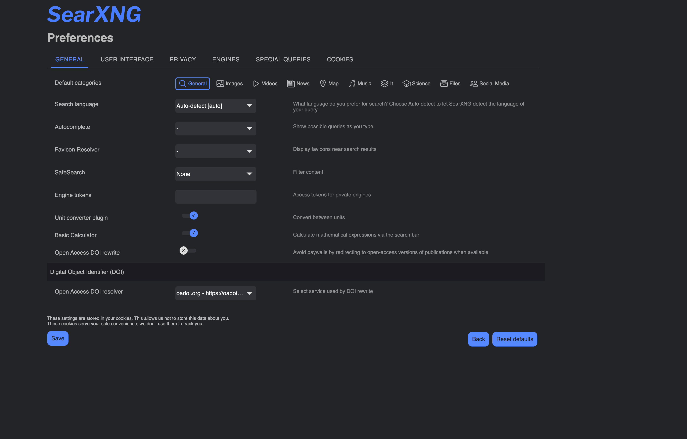

import Button from "@components/widgets/Button.astro";
import Notice from "@components/widgets/Notice.astro";
import ListCheck from "@components/widgets/ListCheck.astro";
import Accordion from "@components/widgets/Accordion.astro";

**Self-host SearXNG** and you get a private metasearch engine running on your own server. SearXNG aggregates results from Google, DuckDuckGo, Brave, Startpage, and up to 272 other search services without tracking your queries. It runs on a cheap VPS with Docker. No API keys, no subscriptions.

Three deployment paths are covered below: standalone Docker Compose, Traefik with Dockge, and Dokploy. Each one gets you a working instance in under 15 minutes.

## What is SearXNG and how does the metasearch engine work?

**SearXNG** is an open-source metasearch engine, a fork of the original Searx project with active development and a larger community. Unlike search engines that track users, SearXNG queries multiple search engines at the same time while preserving anonymity. Your queries are anonymous to search engines: they see your VPS IP, not yours.

Check the [GitHub repository](https://github.com/searxng/searxng) (34k+ stars, AGPL-3.0) and the [official documentation](https://docs.searxng.org/) for the full picture.

### Key benefits of SearXNG

<ListCheck>

- **No tracking or profiling**: No user profiling, no data sold to third parties
- **Aggregated results**: Combines results from up to 272 search services (245 engines, 88 enabled by default)
- **Customizable**: Choose which search engines to include, configure preferences per category
- **Open source**: Fully auditable code under AGPL-3.0 with active community development
- **Multi-language support**: Available in numerous languages with localized results
- **JSON API for automation**: Query programmatically for AI agents, RAG pipelines, and n8n workflows

</ListCheck>

### How SearXNG works

SearXNG uses a metasearch architecture that acts as a privacy proxy between you and the search engines:

| Component | Function | Benefit |
|-----------|----------|---------|
| **Query distribution** | Sends your search to multiple engines simultaneously | Comprehensive results from diverse sources |
| **Result aggregation** | Combines and deduplicates responses | Unified, ranked result set |
| **Privacy proxy layer** | Acts as intermediary; engines see SearXNG, not you | Anonymous searching |
| **Customization engine** | Filters results based on your preferences | Personalized without profiling |

> For more useful self-hosted applications, check out our guide on [Docker containers for home servers](/docker-containers-home-server/).

## Why self-host SearXNG? (Privacy, cost, control)

Public SearXNG instances exist: [searx.space](https://searx.space/) lists about 74 online right now. But they come with tradeoffs: rate limiting, JSON API disabled, someone else's engine selection, and no guarantee the operator is not logging queries.

When you self-host:

- **Privacy**: You control the server, the config, and the logs (or lack thereof). No third party sees your search history.
- **Cost**: SearXNG + Valkey fits in 1-2 GB RAM. That is a $4-6/month VPS. No API keys, no per-query fees.
- **Control**: You pick the engines, enable the JSON API for your AI agents, set rate limits, and customize the UI.

<Notice type="info" title="Private vs. public instance">

A private instance (limiter off, no `public_instance` flag) is fine for solo use. If you want to share it with others or make it public, you need the limiter enabled — see the [public instance section](#from-private-to-public-searxng-instance-limiter--bot-protection) below.

</Notice>

## Prerequisites: what you need to self-host SearXNG

<Notice type="info" title="Hardware requirements">

SearXNG + Valkey is lightweight. 2 CPU cores and 2 GB RAM is enough for personal use. Don't over-provision.

</Notice>

<ListCheck>

- **VPS or dedicated server**: A reliable hosting platform. We recommend [Hetzner](https://go.bitdoze.com/hetzner) for affordable European VPS hosting or [Hostinger](https://go.bitdoze.com/hostinger-vps) for budget KVM VPS with NVMe storage. Minimum: 2 CPU cores, 2 GB RAM, 20 GB storage. Alternative: a [GMKtec M5 Ultra mini PC](/go/gmktec-m5-ultra/) for local home-server hosting.
- **Docker Engine and Docker Compose**: Latest stable versions installed on your server
- **Domain name**: A domain or subdomain pointing to your server (e.g., `search.yourdomain.com`)
- **Reverse proxy** (for HTTPS access):
  - **Option A**: Traefik with Docker — follow the [Traefik reverse proxy guide](/traefik-proxy-docker/)
  - **Option B**: Traefik with Let's Encrypt wildcard certificates — see the [Traefik wildcard certificate setup](/traefik-wildcard-certificate/)
- **Container management** (optional): [Dockge installation tutorial](/dockge-install/) for simplified Docker management, or [Dokploy](/dokploy-install/) for GUI-based deployment. See the [best self-hosted server panels in 2026](/best-self-hosted-panels/) for more options.

_VPS prices jumped across the board in 2026 — if you're rethinking a rented box, see [what changed and when a mini PC wins](/vps-price-increases/)._

</ListCheck>

## Setup option 1: SearXNG Docker and Docker Compose (standalone)

This is the primary install path using the official compose template from the SearXNG repository.

<Notice type="info" title="Web server note">

Container images from July 2025 onward (tag `2025.7.4-01be261` and later) run **Granian** instead of uWSGI. The old `UWSGI_WORKERS` and `UWSGI_THREADS` environment variables do nothing, so do not set them. The official docs say "it's not advised to modify the amount of workers." Scale out by adding replicas behind your reverse proxy if needed.

</Notice>

### Step 1: create the project directory

```bash
mkdir -p ~/searxng && cd ~/searxng
```

### Step 2: fetch the official compose template and configure .env

Download the official compose file and environment template:

```bash
curl -fsSL -O https://raw.githubusercontent.com/searxng/searxng/master/container/docker-compose.yml \
     -O https://raw.githubusercontent.com/searxng/searxng/master/container/.env.example
```

Create your `.env` file from the example:

```bash
cp .env.example .env
```

Edit `.env` and set your values:

```bash
SEARXNG_VERSION=latest
SEARXNG_HOST=0.0.0.0
SEARXNG_PORT=8080
```

Now add a healthcheck and the Valkey URL to the compose. The official template doesn't include a healthcheck, so add one. Your final `docker-compose.yml` should look like this:

```yaml
name: searxng
services:
  core:
    container_name: searxng-core
    image: docker.io/searxng/searxng:latest
    restart: always
    env_file: ./.env
    environment:
      - SEARXNG_BASE_URL=http://localhost:8080
      - SEARXNG_REDIS_URL=valkey://valkey:6379/0
    volumes:
      - ./core-config/:/etc/searxng/:Z
      - core-data:/var/cache/searxng/
    ports:
      - "${SEARXNG_PORT:-8080}:${SEARXNG_PORT:-8080}"
    depends_on:
      valkey:
        condition: service_healthy
    healthcheck:
      test: ["CMD", "python3", "-c", "import urllib.request,sys; sys.exit(0 if urllib.request.urlopen('http://localhost:8080/healthz', timeout=5).status==200 else 1)"]
      interval: 30s
      timeout: 5s
      retries: 3
      start_period: 40s

  valkey:
    container_name: searxng-valkey
    image: docker.io/valkey/valkey:9-alpine
    command: valkey-server --save 30 1 --loglevel warning
    restart: always
    volumes:
      - valkey-data:/data/
    healthcheck:
      test: ["CMD", "valkey-server", "--version"]
      interval: 10s
      timeout: 5s
      retries: 3
      start_period: 10s

volumes:
  core-data:
  valkey-data:
```

<Notice type="warning" title="Docker Hub rate limits">

If you hit Docker Hub's unauthenticated pull rate limit, switch the image to the GitHub Container Registry mirror: `ghcr.io/searxng/searxng:latest`. Same image, different registry.

</Notice>

On first boot, the entrypoint auto-generates `core-config/settings.yml` from a template if the file does not exist. It sets `use_default_settings: true`, `image_proxy: true`, and a random `secret_key`. You do not need to create this file manually.

### Step 3: launch and verify SearXNG

```bash
docker compose up -d
```

Verify both containers are running:

```bash
docker compose ps
```

You should see both `searxng-core` and `searxng-valkey` with status `Up` (or `healthy`).

Check the health endpoint:

```bash
curl -f http://localhost:8080/healthz
```

Expected: HTTP 200 response. If you get a connection refused, check the logs:

```bash
docker compose logs -f core
```

Look for a line like `SearXNG <version>` in the startup output.

<Notice type="success" title="Installation complete">

Your SearXNG instance is running at `http://localhost:8080`. You can start searching immediately. For HTTPS access, continue to option 2 or 3 below.

</Notice>

**Failure modes:**

- **Port 8080 already in use**: Change `SEARXNG_PORT` in your `.env` file.
- **Permission denied on `core-config/`**: The container runs as uid 977. The entrypoint sets `FORCE_OWNERSHIP=true` and chowns on start, which usually fixes itself. If not, run `chown -R 977:977 core-config/`.
- **Container restart loop**: Check `docker compose logs core` for YAML parse errors in `settings.yml`. Delete `core-config/settings.yml` and restart. The entrypoint regenerates defaults.

## Setup option 2: Traefik and Dockge integration

This setup integrates SearXNG with Traefik reverse proxy and Dockge container management. You get HTTPS encryption, automatic SSL certificates, and a web management interface.

<Notice type="info" title="Prerequisites for this method">

Ensure you have Traefik and Dockge configured by following the [Traefik wildcard certificate setup](/traefik-wildcard-certificate/) guide.

</Notice>

### Step 1: prepare Traefik network

Verify your Traefik network exists and create if necessary:

```bash
docker network create traefik-net
```

### Step 2: Docker Compose with Traefik labels

Create a production-ready `docker-compose.yml` with Traefik integration:

```yaml
name: searxng
networks:
  traefik-net:
    external: true

services:
  core:
    container_name: searxng-core
    image: docker.io/searxng/searxng:latest
    restart: always
    environment:
      - SEARXNG_PORT=8080
      - SEARXNG_BASE_URL=https://search.yourdomain.com
      - SEARXNG_REDIS_URL=valkey://valkey:6379/0
    volumes:
      - ./core-config/:/etc/searxng/:Z
      - core-data:/var/cache/searxng/
    networks:
      - traefik-net
    depends_on:
      valkey:
        condition: service_healthy
    healthcheck:
      test: ["CMD", "python3", "-c", "import urllib.request,sys; sys.exit(0 if urllib.request.urlopen('http://localhost:8080/healthz', timeout=5).status==200 else 1)"]
      interval: 30s
      timeout: 5s
      retries: 3
      start_period: 40s
    labels:
      - "traefik.enable=true"
      - "traefik.http.routers.searxng.rule=Host(`search.yourdomain.com`)"
      - "traefik.http.routers.searxng.entrypoints=https"
      - "traefik.http.routers.searxng.tls=true"
      - "traefik.http.routers.searxng.tls.certresolver=letsencrypt"
      - "traefik.http.services.searxng.loadbalancer.server.port=8080"

  valkey:
    container_name: searxng-valkey
    image: docker.io/valkey/valkey:9-alpine
    command: valkey-server --save 30 1 --loglevel warning
    restart: always
    networks:
      - traefik-net
    volumes:
      - valkey-data:/data/
    healthcheck:
      test: ["CMD", "valkey-server", "--version"]
      interval: 10s
      timeout: 5s
      retries: 3
      start_period: 10s

volumes:
  core-data:
  valkey-data:
```

<Notice type="warning" title="X-Forwarded-For headers for the limiter">

If you plan to enable the SearXNG limiter (public instance), Traefik must pass `X-Forwarded-For` correctly. Without it, the limiter sees all clients as the proxy IP and rate-limits everyone. Make sure your Traefik entrypoint has `forwardedHeaders` configured, or add the forwarded headers middleware to the router labels. See the [Traefik reverse proxy guide](/traefik-proxy-docker/) for details.

</Notice>

### Step 3: deploy through Dockge

1. Access your Dockge interface (typically `https://dockge.yourdomain.com`)
2. Create a new stack named "searxng"
3. Paste the Docker Compose configuration above
4. Customize the domain name in the Traefik labels
5. Deploy the stack

### Step 4: configure DNS and verify

Point your subdomain to your server's IP address:

| Record type | Name | Value | TTL |
|-------------|------|-------|-----|
| A | search | your-server-ip | 300 |

<Notice type="warning" title="DNS propagation">

Allow 5-15 minutes for DNS changes to propagate before accessing your SearXNG instance.

</Notice>

Verify the deployment:

```bash
curl -f https://search.yourdomain.com/healthz
```

Expected: HTTP 200 over HTTPS.

## Setup option 3: Dokploy easy deployment

Dokploy is the fastest path if you prefer GUI-based management with minimal command-line interaction. It has built-in templates and handles configuration automatically.

### Step 1: install Dokploy

If you haven't already, set up Dokploy on your server following the [Dokploy installation tutorial](/dokploy-install/). See also the [best self-hosted server panels in 2026](/best-self-hosted-panels/) for a comparison.

### Step 2: create SearXNG application

1. **Access Dokploy dashboard**: Navigate to your Dokploy interface
2. **Create new project**: Click "New Project" and name it "searxng"
3. **Select template**: Choose the "SearXNG" blueprint from the available templates. The official blueprint in [Dokploy's templates repo](https://github.com/Dokploy/templates/tree/canary/blueprints/searxng) uses `searxng/searxng:latest` with `valkey/valkey:8-alpine`, mounts `/etc/searxng` and `/var/cache/searxng`, and sets `limiter: false` by default.


### Step 3: configure environment variables

Set the following environment variables in Dokploy:

| Variable | Value | Description |
|----------|-------|-------------|
| `SEARXNG_BASE_URL` | `https://search.yourdomain.com` | Your public URL (must be HTTPS in production) |
| `SEARXNG_REDIS_URL` | `valkey://valkey:6379/0` | Valkey connection for caching and limiter |

<Notice type="info" title="Dokploy blueprint notes">

The Dokploy blueprint defaults to Valkey 8-alpine (not 9) — this works fine. The limiter is off by default. If you need bot protection, see the [public instance section](#from-private-to-public-searxng-instance-limiter--bot-protection).

</Notice>


### Step 4: domain configuration

1. Navigate to the "Domains" section in your Dokploy project
2. Add your domain: `search.yourdomain.com`
3. Set container port to 8080
4. Enable SSL/TLS certificate generation


### Step 5: deploy application

Click the "Deploy" button and monitor the deployment logs. Dokploy will automatically pull the Docker images, set up networking, generate SSL certificates, and configure reverse proxy rules.

Verify: access your deployed URL and check `https://search.yourdomain.com/healthz` returns HTTP 200.

<Button text="Deploy SearXNG" size="lg" color="green" variant="solid" icon="arrow-right" iconPosition="right" />

## From private to public SearXNG instance (limiter and bot protection)

By default, your SearXNG instance is private: no rate limiting, no bot detection, no public access controls. That is fine for personal use. But if you share the URL or make it public, bots will scrape it, and upstream engines will start returning 429 errors and CAPTCHAs.

<Notice type="info" title="Private instances skip this section">

If you are the only user, you do not need the limiter. Valkey is still useful for caching, but the bot detection features are optional.

</Notice>

To enable the limiter and public instance mode, edit `core-config/settings.yml`:

```yaml
use_default_settings: true
server:
  secret_key: "change-me-to-a-random-string"
  public_instance: true
  limiter: true
  image_proxy: true
valkey:
  url: valkey://valkey:6379/0
```

You can also create an optional `core-config/limiter.toml` for finer control:

```toml
[botdetection]
ipv4_prefix = 32
ipv6_prefix = 48
trusted_proxies = ['127.0.0.0/8', '::1']

[botdetection.ip_limit]
link_token = true

[botdetection.ip_lists]
pass_searxng_org = true
```

<Notice type="warning" title="Secret key and environment handling">

The auto-generated `secret_key` is random but stored in plain text in `settings.yml`. For production deployments, consider [secure alternatives to plain-text environment variables in Docker Compose](/docker-compose-secrets/).

</Notice>

**Requirements for the limiter to work:**

- Valkey must be running and accessible (`valkey.url` configured)
- Your reverse proxy must pass `X-Forwarded-For` or `X-Real-IP` headers — otherwise the limiter sees all traffic as coming from the proxy IP
- `server.limiter: true` must be set in `settings.yml`

## Using SearXNG's JSON API for AI agents and automation

SearXNG exposes a search API at `/search?q=...&format=json`. You can use it for AI agents, RAG pipelines, n8n workflows, and Open WebUI integrations.

<Notice type="info" title="JSON is disabled on most public instances">

Most public SearXNG instances disable the JSON API to prevent abuse. Self-hosting is the reliable way to get programmatic search access.

</Notice>

To enable JSON output, add this to `core-config/settings.yml`:

```yaml
search:
  formats:
    - html
    - json
```

Then query it:

```bash
curl 'https://search.yourdomain.com/search?q=bitdoze&format=json'
```

The API also supports `csv` and `rss` formats. Without the `formats` setting, requesting JSON returns a 403.

**Use cases:**

- Feed search results into LLM context windows for RAG
- Power n8n or Make.com automation workflows
- Build custom search dashboards
- Replace paid search APIs for your AI agents

Rate-limit your own agents — don't hammer upstream engines. A few queries per minute is fine; hundreds per minute will get your VPS IP blocked.

For alternative approaches to web search in AI workflows, see [DuckDuckGo search for AI agents without API keys](/duckduckgo-openclaw-search/) or [web scraping via MCP for AI agents](/brightdata-mcp-guide/). For a managed web search API alternative, [TinyFish](https://go.bitdoze.com/tinyfish) provides agent-friendly search infrastructure. If you need structured web data at scale alongside search, [Bright Data](https://go.bitdoze.com/brightdata) offers AI-driven web data collection.

## SearXNG configuration and customization

### Search engine selection

Navigate to **Preferences → Engines** to customize your search sources. The default-enabled web engines are Google, DuckDuckGo, Brave, and Startpage. Bing, Yandex, and others are available but disabled by default.

<ListCheck>

- **General search**: Google, DuckDuckGo, Brave, Startpage (enabled); Bing, Yandex, Qwant, Mojeek (available, disabled by default)
- **News sources**: Reuters, Wikinews, plus regional sources like Tagesschau (DE) and Ansа (IT)
- **Academic**: Google Scholar, Semantic Scholar, arxiv, pubmed, OpenAlex (Microsoft Academic was retired in 2021)
- **Media**: YouTube, Vimeo, Flickr, Unsplash
- **Shopping**: Amazon, eBay, AliExpress
- **Social**: Lemmy, Mastodon, Stack Overflow (Reddit is disabled by default; Twitter/X engine was removed after the free API ended in 2023)

</ListCheck>



Use `!bang` syntax for quick engine-specific searches (e.g., `!go docker compose` searches only Google). You can customize which categories appear as tabs via the `categories_as_tabs` setting.

### Privacy and security settings

Configure these options in Preferences or in `settings.yml`:

| Setting | Recommended value | Purpose |
|---------|------------------|---------|
| **Safe search** | Moderate | Filter inappropriate content |
| **Image proxy** | Enabled | Hide your IP from image sources (on by default in the template) |
| **Method** | GET | Default; POST hides queries from browser history but breaks the back button |
| **Autocomplete** | Disabled | Avoids external API calls to suggestion services |

Note: SearXNG stores UI preferences in browser cookies by design — these are local cookies for your settings, not remote tracking. This is different from "no cookies at all."

### Themes and appearance (Simple theme)

SearXNG ships with a single theme: **simple**. The Oscar and Pix-art themes were removed in May 2022. You can configure the style via `simple_style` in settings or the UI preferences:

- `auto` — follows system preference (light/dark)
- `light`
- `dark`
- `black` — true black for OLED screens

## Browser integration

### Setting SearXNG as default search engine

**For Firefox/LibreWolf:**

1. Navigate to `about:preferences#search`
2. Click "Add Search Engine"
3. Enter details:
   - **Name**: SearXNG Privacy Search
   - **URL**: `https://search.yourdomain.com/search?q=%s`
4. Set as default search engine

**For Chrome/Chromium:**

1. Go to Settings → Search engine → Manage search engines
2. Click "Add" next to "Other search engines"
3. Fill in:
   - **Search engine**: SearXNG
   - **Keyword**: searxng
   - **URL**: `https://search.yourdomain.com/search?q=%s`

<Notice type="info" title="Privacy enhancement">

Setting SearXNG as your default search engine routes all searches through your self-hosted instance, eliminating tracking from commercial search engines entirely.

</Notice>

## Monitoring and maintenance

### Health monitoring

Use the `/healthz` endpoint for healthchecks — not a search query. The old approach of hitting `/search?q=test&format=json` is fragile and generates unnecessary load.

Correct healthcheck for your compose file:

```yaml
healthcheck:
  test: ["CMD", "python3", "-c", "import urllib.request,sys; sys.exit(0 if urllib.request.urlopen('http://localhost:8080/healthz', timeout=5).status==200 else 1)"]
  interval: 30s
  timeout: 5s
  retries: 3
  start_period: 40s
```

SearXNG also exposes metrics endpoints:

- `/stats` — engine performance statistics (enabled by default via `general.enable_metrics`)
- `/stats/errors` — per-engine error rates (useful for spotting broken engines after updates)
- `/metrics` — optional OpenMetrics endpoint for Prometheus (enable via `open_metrics` setting)

Consider adding a [Uptime Kuma monitor](/uptime-kuma-tool/) for your `/healthz` endpoint to get alerts when SearXNG goes down.

### Updating SearXNG

SearXNG is a rolling release — there are no major version numbers, just date-based tags like `2026.7.7-f69b22c45`. To update:

```bash
docker compose pull
docker compose up -d
```

Check `/stats/errors` after updates — engine integrations can break between releases. See [how to update containers with Docker Compose](/updating-container-docker-compose/) for a general workflow.

### Backup strategies

The only mandatory state is your configuration directory. Valkey data is disposable cache — do not back it up.

```bash
# Config backup (the only critical state)
tar -czf searxng-backup-$(date +%Y%m%d).tar.gz core-config/

# Favicon/cache state (optional, small)
docker run --rm -v searxng_core-data:/from -v "$PWD":/to alpine sh -c 'cd /from && tar czf /to/searxng-cache-$(date +%Y%m%d).tar.gz .'
```

<Notice type="info" title="Valkey data is disposable">

The Valkey volume stores rate-limit state and cache. If you lose it, SearXNG recreates it on next start. Don't waste backup space on it.

</Notice>

If you lose `core-config/settings.yml`, the entrypoint regenerates a default on next boot — but your custom settings are gone. Back up `core-config/` regularly.

## Troubleshooting common issues

<Accordion label="Search results not appearing or 429 CAPTCHA errors" group="troubleshooting">

Upstream engines rate-limit or return CAPTCHAs when they detect unusual traffic. This is the most common issue.

**Solutions:**

1. Enable the limiter if your instance is public (see the [public instance section](#from-private-to-public-searxng-instance-limiter--bot-protection))
2. Disable problematic engines in Preferences → Engines
3. Check engine error rates at `/stats/errors`
4. Wait — some rate limits are temporary (minutes to hours)

See [GitHub discussion #5651](https://github.com/searxng/searxng/discussions/5651) for ongoing engine reliability reports.

</Accordion>

<Accordion label="Client IP shows as proxy IP (limiter misattribution)" group="troubleshooting">

The limiter reads client IP from `X-Forwarded-For` / `X-Real-IP`. If Traefik isn't forwarding headers correctly, all clients appear as the proxy IP and rate limiting blocks everyone.

**Fix:** Ensure your Traefik entrypoint has `forwardedHeaders` configured. Check the [Traefik reverse proxy guide](/traefik-proxy-docker/) for the correct label syntax.

</Accordion>

<Accordion label="Container restart loops or settings errors" group="troubleshooting">

Check `docker compose logs core` for YAML parse errors in `settings.yml`. Common causes: wrong indentation, invalid keys, or copy-paste artifacts.

**Fix:** Delete `core-config/settings.yml` and restart. The entrypoint regenerates defaults:

```bash
rm core-config/settings.yml
docker compose restart core
docker compose logs -f core
```

Look for the `SearXNG <version>` startup line to confirm it recovered.

</Accordion>

<Accordion label="SSL certificate problems" group="troubleshooting">

**Symptoms:** HTTPS errors or certificate warnings.

**Solutions:**

1. Verify domain DNS configuration points to your server IP
2. Check Traefik certificate generation logs: `docker compose logs traefik`
3. Restart Traefik container
4. Validate certificate resolver settings in Traefik config

</Accordion>

## Security best practices

### Network security

<ListCheck>

- **Firewall configuration**: Block unnecessary ports, allow only HTTP/HTTPS traffic (ports 80, 443)
- **VPN access**: For private instances, consider restricting access through VPN instead of exposing to the internet
- **Regular updates**: Keep Docker images and host system updated — SearXNG is a rolling release with frequent fixes
- **Don't expose the JSON API** to the public internet unless you specifically need it
- **Keep `debug: false`** in production settings

</ListCheck>

For comprehensive VPS hardening, see [how to secure your VPS with CrowdSec](/crowdsec-secure-server/).

### Application security

- **Change the auto-generated `secret_key`** in `settings.yml` to a strong random value
- **Set `SEARXNG_BASE_URL`** to your final HTTPS URL — mismatched URLs cause redirect loops and broken image proxy
- **Use the GHCR mirror** (`ghcr.io/searxng/searxng`) if Docker Hub rate limits affect your pulls
- **For public instances**: enable the limiter, set `public_instance: true`, configure `limiter.toml` with trusted proxies

Add a DNS firewall like [NextDNS](https://go.bitdoze.com/nextdns) for an extra layer of privacy and ad blocking at the network level.

### Data protection

| Component | Security measure | Implementation |
|-----------|-----------------|----------------|
| **Search queries** | No logging | Default SearXNG behavior — nothing is written to disk |
| **User preferences** | Local cookies only | Stored in the browser, not on the server |
| **Cache/rate-limit state** | Valkey (optional) | Only needed for limiter; disposable data |
| **SSL/TLS** | Strong encryption | Let's Encrypt certificates via Traefik |

## Conclusion

Self-hosting SearXNG gives you a private metasearch engine aggregating results from up to 272 search services, running on a $4-6/month VPS with Docker. No tracking, no API keys, no subscriptions.

<ListCheck>

- **Complete privacy**: No tracking, profiling, or data collection
- **Search diversity**: Results from Google, DuckDuckGo, Brave, and 270+ other services
- **JSON API**: Programmatic search for AI agents, RAG pipelines, and automation
- **Three deployment paths**: Standalone Docker, Traefik + Dockge, or Dokploy
- **Low cost**: Runs comfortably on a 2 GB RAM VPS

</ListCheck>

Start with option 1 (standalone Docker Compose) to get running in minutes. Add Traefik for HTTPS when you're ready to use it as your daily search engine. Enable the JSON API when you want to feed search results into your AI workflows.

<Button text="Start Your SearXNG Journey" size="xl" color="blue" variant="solid" icon="arrow-right" iconPosition="right" />

**Want to expand your self-hosted stack?** Check out our guides on [Dockge for Docker container management](/dockge-install/), [Traefik reverse proxy setup](/traefik-proxy-docker/), and [Dokploy platform deployment](/dokploy-install/).

*Verified against SearXNG 2026.x rolling release, docs version 2026.8.29.*
