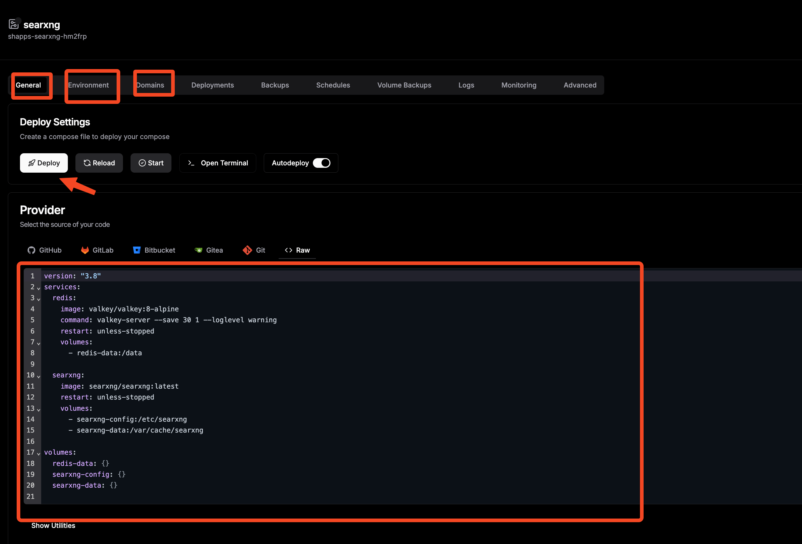
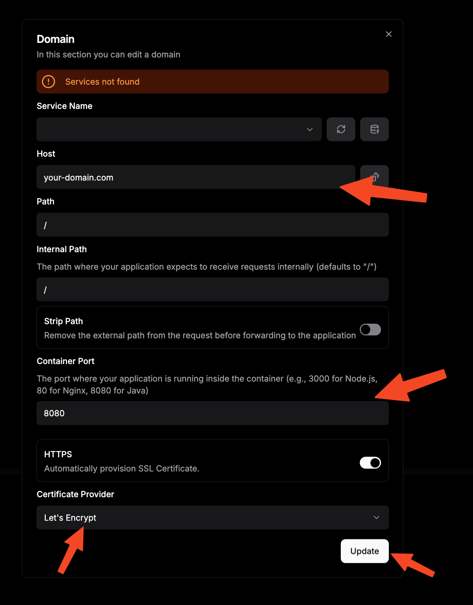

In today's digital landscape, privacy has become a precious commodity. Every search query you make is tracked, analyzed, and used to build detailed profiles about your interests and behaviors. Popular search engines like Google, Bing, and Yahoo collect vast amounts of personal data, raising concerns about digital privacy and autonomy.

This is where **SearXNG** emerges as a powerful solution—a self-hosted, privacy-focused metasearch engine that puts you back in control of your search experience. By aggregating results from multiple search engines while maintaining complete anonymity, SearXNG offers the best of both worlds: comprehensive search results without sacrificing your privacy.

## What is SearXNG and How Can It Transform Your Search Experience?


**SearXNG** is a free, open-source metasearch engine that revolutionizes how you interact with search technology. Unlike traditional search engines that track and profile users, SearXNG acts as an intermediary that queries multiple search engines simultaneously while preserving your anonymity.

### Key Benefits of SearXNG

<ListCheck>

- **Complete Privacy Protection**: No tracking, cookies, or user profiling
- **Aggregated Results**: Combines results from 230+ search engines for comprehensive coverage
- **Customizable Experience**: Choose which search engines to include and configure preferences
- **Open Source Transparency**: Fully auditable code with active community development
- **Self-Hosted Control**: Complete ownership of your search infrastructure
- **Multi-Language Support**: Available in numerous languages with localized results

</ListCheck>

### How SearXNG Works

The magic of SearXNG lies in its metasearch architecture:

| Component | Function | Benefit |
|-----------|----------|---------|
| **Query Distribution** | Sends your search to multiple engines | Comprehensive results |
| **Result Aggregation** | Combines and deduplicates responses | Unified experience |
| **Privacy Layer** | Acts as intermediary proxy | Anonymous searching |
| **Customization Engine** | Filters based on preferences | Personalized results |

SearXNG is a fork of the original Searx project, enhanced with additional features, improved performance, and better maintenance. You can explore the project further at their [official GitHub repository](https://github.com/searxng/searxng) and [documentation site](https://docs.searxng.org/).

> For a comprehensive list of useful applications, check out our guide on [Docker containers for home servers](https://www.bitdoze.com/docker-containers-home-server/).

## Prerequisites

Before embarking on your SearXNG self-hosting journey, ensure you have the following infrastructure components in place:

<Notice type="info" title="Hardware Requirements">

SearXNG is lightweight but performs best with adequate resources for handling multiple search engine queries simultaneously.

</Notice>


- **VPS or Dedicated Server**: A reliable hosting platform where you can install SearXNG. We recommend [Hetzner](https://go.bitdoze.com/hetzner) for excellent performance and pricing. For optimal experience, consider:
  - **Minimum**: 2 CPU cores, 2GB RAM, 20GB storage
  - **Recommended**: 4+ CPU cores, 4GB+ RAM, 40GB+ storage
  - **Alternative**: [Mini PC as Home Server](https://www.bitdoze.com/best-mini-pc-home-server/) for local hosting

- **Reverse Proxy Setup** (for HTTPS access):
  - **Option 1**: Traefik with Docker configured - follow our guide: [How to Use Traefik as A Reverse Proxy in Docker](https://www.bitdoze.com/traefik-proxy-docker/)
  - **Option 2**: Traefik with Let's Encrypt wildcard certificates - see: [Traefik FREE Let's Encrypt Wildcard Certificate With CloudFlare Provider](https://www.bitdoze.com/traefik-wildcard-certificate/)

- **Container Management**: Docker and container orchestration tools:
  - **Docker Engine**: Latest stable version
  - **Docker Compose**: For multi-container orchestration
  - **Dockge** (optional): Simplified Docker management - tutorial: [Dockge - Portainer Alternative for Docker Management](https://www.bitdoze.com/dockge-install/)

- **Domain Name**: A domain or subdomain pointing to your server (e.g., `search.yourdomain.com`)


## Setup Option 1: Docker & Docker Compose (Standalone)

This method provides a straightforward installation using Docker containers without additional complexity. Perfect for users who want a simple, self-contained SearXNG instance.

### Step 1: Create Project Directory

Begin by establishing a dedicated directory structure for your SearXNG installation:

```bash
mkdir -p ~/searxng && cd ~/searxng
```

### Step 2: Create Docker Compose Configuration

Create a comprehensive `docker-compose.yml` file that includes SearXNG with Redis caching for optimal performance:

```yaml
version: '3.8'

services:
  searxng:
    image: "docker.io/searxng/searxng:latest"
    container_name: "searxng"
    volumes:
      - "./config:/etc/searxng:rw"
    ports:
      - "8080:8080"
    environment:
      - PGID=1000
      - PUID=1000
      - SEARXNG_BASE_URL=http://localhost:8080
      - SEARXNG_REDIS_URL=redis://redis:6379/0
      - UWSGI_WORKERS=4
      - UWSGI_THREADS=4
    cap_drop:
      - ALL
    cap_add:
      - CHOWN
      - SETGID
      - SETUID
    depends_on:
      redis:
        condition: service_healthy
    restart: unless-stopped

  redis:
    container_name: searxng-redis
    image: docker.io/valkey/valkey:8-alpine
    command: valkey-server --save 30 1 --loglevel warning
    restart: unless-stopped
    volumes:
      - "redis-data:/data"
    cap_drop:
      - ALL
    cap_add:
      - SETGID
      - SETUID
      - DAC_OVERRIDE
      - CHOWN
    healthcheck:
      test: ["CMD", "valkey-server", "--version"]
      interval: 10s
      timeout: 5s
      retries: 3
      start_period: 10s

volumes:
  redis-data:
```

### Step 3: Initialize Configuration Directory

Create the necessary directory structure for SearXNG configuration files:

```bash
mkdir -p config
```

### Step 4: Launch SearXNG

Deploy your SearXNG instance using Docker Compose:

```bash
docker compose up -d
```

### Step 5: Access Your Search Engine

Once the containers are running, access SearXNG through your web browser:

- **Local Access**: `http://localhost:8080`
- **Network Access**: `http://your-server-ip:8080`

<Notice type="success" title="Installation Complete">

Your SearXNG instance is now operational! You can begin searching immediately while enjoying complete privacy.

</Notice>

## Setup Option 2: Traefik & Dockge Integration

This advanced setup integrates SearXNG with Traefik reverse proxy and Dockge container management, providing HTTPS encryption, automatic SSL certificates, and simplified management through a web interface.

<Notice type="info" title="Prerequisites for This Method">

Ensure you have Traefik and Dockge properly configured by following our [Traefik Wildcard Certificate guide](https://www.bitdoze.com/traefik-wildcard-certificate/).

</Notice>

### Step 1: Prepare Traefik Network

Verify your Traefik network exists and create if necessary:

```bash
docker network create traefik-net
```

### Step 2: Enhanced Docker Compose with Traefik Labels

Create a production-ready `docker-compose.yml` with Traefik integration:

```yaml
version: '3.8'

networks:
  traefik-net:
    external: true

services:
  searxng:
    image: "docker.io/searxng/searxng:latest"
    container_name: "searxng"
    volumes:
      - "./config:/etc/searxng:rw"
    environment:
      - PGID=1000
      - PUID=1000
      - SEARXNG_BASE_URL=https://search.yourdomain.com
      - SEARXNG_REDIS_URL=redis://redis:6379/0
      - UWSGI_WORKERS=4
      - UWSGI_THREADS=4
    cap_drop:
      - ALL
    cap_add:
      - CHOWN
      - SETGID
      - SETUID
    networks:
      - traefik-net
    depends_on:
      redis:
        condition: service_healthy
    restart: unless-stopped
    labels:
      - "traefik.enable=true"
      - "traefik.http.routers.searxng.rule=Host(`search.yourdomain.com`)"
      - "traefik.http.routers.searxng.entrypoints=https"
      - "traefik.http.routers.searxng.tls=true"
      - "traefik.http.routers.searxng.tls.certresolver=letsencrypt"
      - "traefik.http.services.searxng.loadbalancer.server.port=8080"

  redis:
    container_name: searxng-redis
    image: docker.io/valkey/valkey:8-alpine
    command: valkey-server --save 30 1 --loglevel warning
    restart: unless-stopped
    networks:
      - traefik-net
    volumes:
      - "redis-data:/data"
    cap_drop:
      - ALL
    cap_add:
      - SETGID
      - SETUID
      - DAC_OVERRIDE
      - CHOWN
    healthcheck:
      test: ["CMD", "valkey-server", "--version"]
      interval: 10s
      timeout: 5s
      retries: 3
      start_period: 10s

volumes:
  redis-data:
```

### Step 3: Deploy Through Dockge

1. Access your Dockge interface (typically `https://dockge.yourdomain.com`)
2. Create a new stack named "searxng"
3. Paste the Docker Compose configuration
4. Customize the domain name in the Traefik labels
5. Deploy the stack

### Step 4: Configure Domain DNS

Point your chosen subdomain to your server's IP address:

| Record Type | Name | Value | TTL |
|-------------|------|-------|-----|
| A | search | your-server-ip | 300 |

<Notice type="warning" title="DNS Propagation">

Allow 5-15 minutes for DNS changes to propagate before accessing your SearXNG instance.

</Notice>

## Setup Option 3: Dokploy Easy Deployment

Dokploy offers the most streamlined deployment experience with built-in templates and automated configuration. This method is ideal for users who prefer GUI-based management with minimal command-line interaction.

### Step 1: Install Dokploy

If you haven't already, set up Dokploy on your server following our comprehensive guide: [Dokploy Installation Tutorial](https://www.bitdoze.com/dokploy-install/).

### Step 2: Create SearXNG Application

1. **Access Dokploy Dashboard**: Navigate to your Dokploy interface
2. **Create New Project**: Click "New Project" and name it "searxng"
3. **Select Template**: Choose "SearXNG" from the available templates or create a custom compose application


### Step 3: Configure Environment Variables

Set up the following environment variables in Dokploy:

| Variable | Value | Description |
|----------|-------|-------------|
| `SEARXNG_BASE_URL` | `https://search.yourdomain.com` | Your public URL |
| `UWSGI_WORKERS` | `4` | Number of worker processes |
| `UWSGI_THREADS` | `4` | Threads per worker |
| `PGID` | `1000` | Group ID for file permissions |
| `PUID` | `1000` | User ID for file permissions |




### Step 4: Domain Configuration

1. Navigate to the "Domains" section in your Dokploy project
2. Add your domain: `search.yourdomain.com`
3. Set Container Port (8080 for SearXNG)
4. Enable SSL/TLS certificate generation in Certificate Provider



### Step 5: Deploy Application

Click the "Deploy" button and monitor the deployment logs. Dokploy will automatically:

- Pull required Docker images
- Set up networking
- Generate SSL certificates
- Configure reverse proxy rules

<Button text="Deploy SearXNG" size="lg" color="green" variant="solid" icon="arrow-right" iconPosition="right" />

## Advanced Configuration and Customization

Once your SearXNG instance is operational, you can enhance its functionality through various configuration options.

### Search Engine Selection

Navigate to **Preferences → Engines** to customize your search sources:

<ListCheck>

- **General Search**: Google, Bing, DuckDuckGo, Startpage, Yandex
- **News Sources**: BBC News, Reuters, Associated Press, Wikinews
- **Academic**: Google Scholar, Microsoft Academic, Semantic Scholar
- **Media**: YouTube, Vimeo, Flickr, Unsplash
- **Shopping**: Amazon, eBay, AliExpress
- **Social**: Reddit, Twitter, Stack Overflow

</ListCheck>


### Privacy and Security Settings

Configure these essential privacy options:

| Setting | Recommended Value | Purpose |
|---------|------------------|---------|
| **Safe Search** | Moderate | Filter inappropriate content |
| **Image Proxy** | Enabled | Hide IP from image sources |
| **Method** | POST | Prevent query leaks in referrers |
| **Autocomplete** | Disabled | Avoid external service calls |

### Performance Optimization

Fine-tune SearXNG performance based on your server specifications:

```yaml
environment:
  - UWSGI_WORKERS=8        # 2x CPU cores
  - UWSGI_THREADS=4        # Adjust based on RAM
  - SEARXNG_REDIS_URL=redis://redis:6379/0
```

### Custom Themes and Appearance

SearXNG supports multiple themes and customization options:

- **Default Theme**: Clean, modern interface
- **Simple Theme**: Minimal design with fast loading
- **Oscar Theme**: Feature-rich with advanced filters
- **Pix-art Theme**: Artistic, image-focused layout

## Browser Integration

### Setting SearXNG as Default Search Engine

**For Firefox/LibreWolf:**
1. Navigate to `about:preferences#search`
2. Click "Add Search Engine"
3. Enter details:
   - **Name**: SearXNG Privacy Search
   - **URL**: `https://search.yourdomain.com/search?q=%s`
4. Set as default search engine

**For Chrome/Chromium:**
1. Go to Settings → Search engine → Manage search engines
2. Click "Add" next to "Other search engines"
3. Fill in:
   - **Search engine**: SearXNG
   - **Keyword**: searxng
   - **URL**: `https://search.yourdomain.com/search?q=%s`

### Browser Extension Benefits

<Notice type="info" title="Privacy Enhancement">

Installing SearXNG as your default search enhances privacy by routing all searches through your self-hosted instance, eliminating tracking from commercial search engines.

</Notice>

## Monitoring and Maintenance

### Health Monitoring

Implement monitoring to ensure optimal SearXNG performance:

```yaml
# Add to your docker-compose.yml
healthcheck:
  test: ["CMD", "curl", "-f", "http://localhost:8080/search?q=test&format=json"]
  interval: 30s
  timeout: 10s
  retries: 3
  start_period: 40s
```

### Regular Maintenance Tasks

<ListCheck>

- **Weekly**: Review search engine performance and disable problematic sources
- **Monthly**: Update Docker images for security patches
- **Quarterly**: Analyze search patterns and optimize engine selection
- **Annually**: Review and update SSL certificates (if not automated)

</ListCheck>

### Backup Strategies

Protect your SearXNG configuration with regular backups:

```bash
# Backup configuration
tar -czf searxng-backup-$(date +%Y%m%d).tar.gz config/

# Backup Redis data (optional)
docker exec searxng-redis redis-cli BGSAVE
```

## Troubleshooting Common Issues

### Search Results Not Appearing

**Symptoms**: Empty search results or specific engines not working

**Solutions**:
1. Check engine status in preferences
2. Verify network connectivity from container
3. Review rate limiting settings
4. Update engine configurations

### Performance Issues

**Symptoms**: Slow search responses or timeouts

**Solutions**:
1. Increase UWSGI workers and threads
2. Optimize Redis memory allocation
3. Disable problematic search engines
4. Implement result caching

### SSL Certificate Problems

**Symptoms**: HTTPS errors or certificate warnings

**Solutions**:
1. Verify domain DNS configuration
2. Check Traefik certificate generation logs
3. Restart Traefik container
4. Validate certificate resolver settings

<Notice type="warning" title="Rate Limiting">

Some search engines implement aggressive rate limiting. If you experience blocked requests, consider reducing the number of simultaneous engines or implementing request delays.

</Notice>

## Security Best Practices

### Network Security

<ListCheck>

- **Firewall Configuration**: Block unnecessary ports, allow only HTTP/HTTPS traffic
- **VPN Access**: Consider restricting access through VPN for enhanced privacy
- **Regular Updates**: Keep Docker images and host system updated
- **Access Logs**: Monitor and analyze access patterns for anomalies

</ListCheck>

### Data Protection

| Component | Security Measure | Implementation |
|-----------|-----------------|----------------|
| **Search Queries** | No logging | Default SearXNG behavior |
| **User Sessions** | No cookies | Disabled in preferences |
| **IP Addresses** | Proxy protection | Redis session storage |
| **SSL/TLS** | Strong encryption | Let's Encrypt certificates |

## Conclusion

Self-hosting SearXNG represents a significant step toward digital privacy and search independence. By implementing your own metasearch engine, you gain:

<ListCheck>

- **Complete Privacy Control**: No tracking, profiling, or data collection
- **Search Result Diversity**: Access to multiple search engines simultaneously
- **Customization Freedom**: Tailor the search experience to your preferences
- **Infrastructure Ownership**: Full control over your search infrastructure
- **Cost Effectiveness**: Minimal hosting costs for unlimited private searching

</ListCheck>

Whether you choose the straightforward Docker approach, the robust Traefik integration, or the streamlined Dokploy deployment, SearXNG provides a powerful foundation for private, efficient web searching. The investment in self-hosting pays dividends in privacy protection and search quality enhancement.

As digital privacy becomes increasingly important, tools like SearXNG demonstrate that you don't need to compromise functionality for privacy. Take control of your search experience today and enjoy the freedom of truly private web searching.

<Button text="Start Your SearXNG Journey" size="xl" color="blue" variant="solid" icon="arrow-right" iconPosition="right" />

**Ready to explore more self-hosting opportunities?** Check out our comprehensive guides on [Docker container management](https://www.bitdoze.com/dockge-install/), [Traefik reverse proxy setup](https://www.bitdoze.com/traefik-proxy-docker/), and [Dokploy platform deployment](https://www.bitdoze.com/dokploy-install/) to expand your self-hosted infrastructure.
