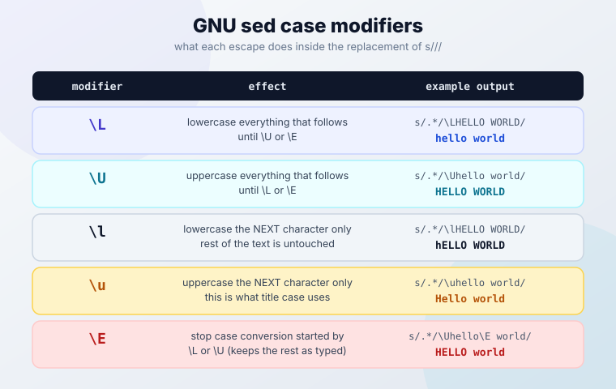
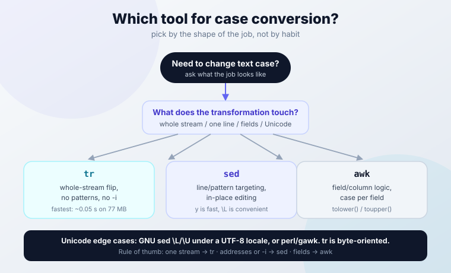

import Button from "@components/widgets/Button.astro";
import Notice from "@components/widgets/Notice.astro";
import ListCheck from "@components/widgets/ListCheck.astro";
import Accordion from "@components/widgets/Accordion.astro";
import Tabs from "@components/widgets/Tabs.astro";
import Tab from "@components/widgets/Tab.astro";

Need to change text case with sed? This guide covers every sed change case technique: sed lowercase, sed uppercase, and sed title case, built with the portable `y` command, GNU sed's `\L`/`\U` modifiers, and `\u` for single characters. All examples are verified against GNU sed 4.9, with notes for GNU sed 4.10 and macOS/BSD where behavior differs. Useful for cleaning data, normalizing log levels, and batch-fixing file extensions.

The article runs from the basic commands through in-place editing, batch processing, and the traps that make sed lowercase "not work" (it is almost always the `y` range shorthand or the locale). There is a cheat sheet at the end if you only need the commands.

<ListCheck>
<ul>
<li>GNU sed 4.9+ (or 4.10, released 2026-04-21). Check with <code>sed --version</code>. macOS/BSD sed works for most examples, with limits noted inline.</li>
<li>A test file to chew on. Never point a first run at data you care about.</li>
<li>Optional: a git repo around the files you edit. <code>git checkout -- .</code> is the cleanest undo sed will ever get.</li>
<li>Five minutes and one terminal. Everything below is copy-pasteable.</li>
</ul>
</ListCheck>

## What Is Sed?

**sed** (Stream Editor) is a command-line tool for text manipulation. It processes input line by line, which makes it fast for large files. If you are still building up your toolkit, it sits alongside grep, awk, and curl in the [essential Linux commands cheat sheet](/linux-commands/).

Sed is great for case conversion because:

- Works non-interactively (no prompts)
- Handles large files efficiently (constant memory, one line at a time)
- Can target specific patterns or line ranges
- Works with pipes and other commands

Other sed guides in this series:

- [sed search and replace](/sed-search-replace/)
- [delete lines with sed](/sed-delete-lines/)
- [insert or append text with sed](/sed-insert-append-text/)

## When to Change Text Case with Sed

Common situations:

- **Data cleanup** - standardize names or fields. `Jon`, `JON`, and `jon` in the same column is a data-quality bug waiting to bite a join.
- **Log formatting** - make error levels consistent. `ERROR`, `Error`, and `error` in one log file break naive greps and log dashboards.
- **Config files** - some apps demand lowercase keys, others shout everything in caps. Changing case by hand in a 200-line file is how typos happen.
- **Batch processing** - file extensions, HTTP headers, CSV column headers, docker-compose service names.

Sed is the right tool when the conversion is line-based or pattern-targeted. If you only need to flip an entire stream from upper to lower with no conditions, `tr` is faster (numbers in the [tr vs sed vs awk](#tr-vs-sed-vs-awk-which-tool-for-case-conversion) section). Case conversion is CPU-cheap on small and medium files either way.

## Sed Lowercase and Uppercase: The Basic Commands

There are two families of sed case conversion, plus per-character modifiers:

1. The `y` command - portable, works on GNU, BSD, and macOS sed. Character-list based.
2. `\L` and `\U` replacement modifiers - GNU sed only. Shorter, and they compose with other substitutions.
3. `\u`, `\l`, `\E` - GNU sed only. Control case per character, which is how you build title case.

Most sed change case workflows start with one of the first two.

### Convert Case with the y Command (Portable)

`y` transliterates one set of characters into another. You must list every character. This works everywhere sed works.

**Convert to lowercase:**

```sh
echo "HELLO WORLD" | sed 'y/ABCDEFGHIJKLMNOPQRSTUVWXYZ/abcdefghijklmnopqrstuvwxyz/'
# Output: hello world
```

**Convert to uppercase:**

```sh
echo "hello world" | sed 'y/abcdefghijklmnopqrstuvwxyz/ABCDEFGHIJKLMNOPQRSTUVWXYZ/'
# Output: HELLO WORLD
```

<Notice type="warning" title="sed y never expands ranges">
Unlike <code>tr</code> and unlike regex brackets, the <code>y</code> command does <strong>not</strong> expand <code>A-Z</code> style ranges. This is the single most common bug in sed case-conversion snippets found online (and it used to live in this article too):

```sh
echo "ABC az AZ 09" | sed 'y/A-Z/a-z/'
# Output: aBC az az 09   <- wrong, and silently wrong
```

Only the literal characters <code>A</code>, <code>-</code>, and <code>Z</code> get transliterated. Always write out the full 26-character lists.
</Notice>

<Notice type="warning" title="POSIX classes are not valid in y either">
<code>y/[[:upper:]]/[[:lower:]]/</code> looks clever and does nothing useful. The class syntax is not expanded in <code>y</code>, and because both strings happen to be the same length, sed silently transliterates the literal characters (<code>u</code> to <code>l</code>, <code>p</code> to <code>o</code>, <code>e</code> to <code>w</code>, <code>r</code> to <code>e</code>, ...) instead of erroring. Use the full lists in <code>y</code>, or <code>[[:upper:]]</code>/<code>[[:lower:]]</code> inside a normal <code>s///</code> regex where classes do work.
</Notice>

### GNU Sed \L and \U: Shorter Case Modifiers

GNU sed adds case modifiers in the replacement part of `s///`. `\L` lowercases everything after it, `\U` uppercases everything after it.

**Convert entire line to lowercase (GNU sed):**

```sh
echo "HELLO WORLD" | sed 's/.*/\L&/'
# Output: hello world
```

**Convert entire line to uppercase (GNU sed):**

```sh
echo "hello world" | sed 's/.*/\U&/'
# Output: HELLO WORLD
```

**Target specific lines:**

```sh
sed '/^ERROR/s/.*/\U&/' logfile.txt   # uppercases only lines starting with ERROR
```

These modifiers are GNU-only. They are absent from the FreeBSD and macOS sed man pages, so scripts that must run on a Mac or BSD box should stick to `y` with full lists. The `&` in the replacement means "the whole matched text", which is why `s/.*/\L&/` converts the whole line.

<Notice type="info" title="GNU sed 4.9 and 4.10">
Examples here were verified against GNU sed 4.9 (shipped by Debian 12 / Ubuntu 24.04 class systems, released 2022-11-06). GNU sed <strong>4.10</strong> shipped 2026-04-21, the first stable release in about three and a half years. Relevant changes: <code>s///g</code> no longer panics on lines larger than 2 GB, a TOCTOU race in <code>sed -i --follow-symlinks</code> was fixed (upgrade if you use that flag on shared directories), and <code>--posix</code> now warns about GNU-only backslash escapes in <code>s</code>, which makes it usable as a portability linter for your scripts. Check your version with <code>sed --version</code>.
</Notice>

One-liner on locale: `LC_ALL=C sed ...` gives predictable ASCII behavior, while `\L`/`\U` need a UTF-8 locale to handle non-ASCII text. Details in the [gotchas section](#sed-case-conversion-gotchas-and-fixes).

### Title Case and Capitalize: \u, \l, and \E

This is the part most "sed case conversion" roundups skip, and it is what the `\b[a-z]\+/\U&/g`-style snippets get wrong. GNU sed has five replacement case modifiers:

| Modifier | Effect |
|----------|--------|
| `\L` | Lowercase everything that follows, until `\U` or `\E` |
| `\l` | Lowercase the **next character only** |
| `\U` | Uppercase everything that follows, until `\L` or `\E` |
| `\u` | Uppercase the **next character only** |
| `\E` | Stop case conversion started by `\L` or `\U` |



**Title case every word** (each word's first letter uppercase, rest lowercase):

```sh
sed -E 's/[a-z]+/\u&/g' filename.txt
# Input:  hello world
# Output: Hello World
```

Without `-E` (BRE), the same thing:

```sh
sed 's/[a-z][a-z]*/\u&/g' filename.txt
# Output: Hello World
```

Prefer `-E` over the older GNU `-r` spelling for extended regex. `-E` is the POSIX-standard flag these days (Austin Group bug 528) and is what GNU's own manual recommends for portability.

**Capitalize the first letter of each line:**

```sh
sed 's/./\u&/' filename.txt
# Input:  hello world
# Output: Hello world
```

**Uppercase one token and leave the rest of the line alone:**

```sh
echo "user: admin status: ok" | sed 's/admin/\U&\E/'
# Output: user: ADMIN status: ok
```

**The `\E` leak bug.** Case conversion keeps running through the rest of the replacement after a capture group unless you stop it:

```sh
echo "host: db1" | sed -E 's/host: (.*)/HOST: \U\1 is up/'
# Output: HOST: DB1 IS UP   <- "is up" got uppercased too

echo "host: db1" | sed -E 's/host: (.*)/HOST: \U\1\E is up/'
# Output: HOST: DB1 is up   <- \E stops conversion after the group
```

Two more subtleties from the manual and from testing:

- With the `g` flag, case conversion does **not** propagate from one match to the next. Each match restarts clean. It **does** keep running inside one replacement unless `\E` stops it.
- Word boundaries are not portable. GNU sed accepts `\b`, `\<`, `\>`. Traditional BSD sed wants `[[:<:]]` and `[[:>:]]` instead. If a `\b` example silently matches nothing, that is usually why (worth confirming on your Mac before trusting either form).

<Notice type="warning" title={"\\l and \\u touch one character only"}>
<code>s/[[:upper:]]/\l&amp;/g</code> does not lowercase a file. It lowercases just the first character of every uppercase run: <code>HELLO</code> becomes <code>hELLO</code>. For whole-line conversion use <code>s/.*/\L&amp;/</code> or the full-list <code>y</code> command.
</Notice>

### Match Case-Insensitively with the I Flag

Case conversion and case-insensitive matching solve different problems. When you want to *find* text regardless of case, GNU sed accepts the `I` flag on regex matches (uppercase `i` also works):

```sh
sed 's/error/CRITICAL/gI' app.log
# matches Error, ERROR, error, and eRRor
```

Address form, for example deleting every warning line whatever its capitalization:

```sh
sed '/^warning/Id' app.log
```

Portability surprise: `I` is documented as a GNU extension, but FreeBSD and macOS sed also accept `i`/`I` as an `s` flag. That makes it *more* portable than `\L`/`\U` in practice. If you only remember one flag for scripts that travel between Linux and macOS, this is it.

## Convert Case in Files: In-Place Editing and Pattern Targeting

Working with files splits into two cases: write the result somewhere else (safe), or edit the file in place (fast, with sharp edges).

**Whole file to lowercase (portable):**

```sh
sed 'y/ABCDEFGHIJKLMNOPQRSTUVWXYZ/abcdefghijklmnopqrstuvwxyz/' filename.txt > output.txt
```

**Whole file to lowercase (GNU sed):**

```sh
sed 's/.*/\L&/' filename.txt > output.txt
```

**Whole file to uppercase (portable / GNU):**

```sh
sed 'y/abcdefghijklmnopqrstuvwxyz/ABCDEFGHIJKLMNOPQRSTUVWXYZ/' filename.txt > output.txt
sed 's/.*/\U&/' filename.txt > output.txt
```

**Target specific patterns:**

```sh
sed '/^ERROR/s/.*/\U&/' logfile.txt        # only lines starting with ERROR
sed 's/\blinux\b/\U&/g' filename.txt       # only the word linux (GNU \b)
```

**Practical examples:**

```sh
sed 's/^./\U&/' filename.txt               # uppercase first letter of each line
sed 's/\.[^.]*$/\L&/' filelist.txt         # lowercase the file extension
```

The extension example matters: `s/\.[A-Z]*$/\L&/` only matches extensions that are already all-caps, so `photo.Jpg` slips through. `s/\.[^.]*$/\L&/` matches any extension and lowercases it.

### In-place editing

Test the command without `-i` first. Every time. Then edit in place, and keep a backup on the first pass:

<Tabs>
<Tab name="GNU/Linux">
```sh
# edit in place
sed -i 's/.*/\L&/' filename.txt

# edit in place and keep a backup copy
sed -i.bak 's/.*/\L&/' filename.txt
ls filename.txt.bak    # confirm the backup exists before you trust this in a loop
```
</Tab>
<Tab name="macOS/BSD">
```sh
# -i REQUIRES a suffix argument on macOS/BSD (empty string = no backup)
sed -i '' 's/.*/\L&/' filename.txt

# cross-platform idiom: GNU treats .bak as a suffix, BSD as a backup extension
sed -i.bak 's/.*/\L&/' filename.txt
ls filename.txt.bak
```
</Tab>
</Tabs>

**Verify before you move on:**

```sh
diff original.txt modified.txt
sed -n '1,5p' filename.txt
```

If the file is in a git repo, skip the scattered `.bak` clutter and use [git commands for undoing changes](/git-commands/) instead:

```sh
sed -i 's/.*/\L&/' filename.txt
git diff --stat          # see what actually changed
git checkout -- .        # full rollback if the result is wrong
```

### Sed -i Gotchas: macOS, Inodes, and Docker Bind Mounts

GNU `sed -i` does not edit your file. It writes the output to a temp file and renames it over the original. The filename stays; the inode changes. That has consequences:

- **Hard links break.** Anything still pointing at the old inode now holds stale content.
- **`tail -f` loses the file.** It follows the old inode. `tail -F` (uppercase) reopens by name and survives.
- **Single-file Docker bind mounts fail.** The rename crosses a mount boundary and you get `sed: cannot rename ...: Device or resource busy`. Workaround: copy the file out, edit it, copy it back, or mount the containing directory instead of the single file. (Exact error wording is worth a 2-minute check in your own Docker version; see [essential Docker commands](/docker-commands/) for the mount basics.) In Alpine/BusyBox containers, sed is BusyBox sed, not GNU sed: `-i` behaves slightly differently and `\L`/`\U` support is not something I would bet a deploy on.
- **You need free disk.** During the rewrite, the temp copy exists alongside the original. Budget roughly 2x the file size.
- **Symlink race in older GNU sed.** `sed -i --follow-symlinks` had a TOCTOU vulnerability (a symlink swapped between resolution and open) fixed in GNU sed 4.10. If you use that flag on shared directories, upgrade.

<Notice type="warning" title="macOS and BSD: -i needs a suffix">
On macOS and FreeBSD, <code>sed -i</code> without an argument is an error, and <code>sed -i '' '...'</code> means "no backup". Both BSD man pages warn that a zero-length backup extension risks a corrupted or partial file if the disk fills up mid-write, because there is no backup to fall back to. The safe cross-platform form is <code>sed -i.bak</code> everywhere, then delete the <code>.bak</code> files after you verify.
</Notice>

## Batch Case Conversion Across Multiple Files

For loops, `find`, and `xargs` cover almost every batch case. Quote your variables and handle spaces in filenames.

**Convert all .txt files to lowercase:**

```sh
for file in *.txt; do
    sed -i.bak 'y/ABCDEFGHIJKLMNOPQRSTUVWXYZ/abcdefghijklmnopqrstuvwxyz/' "$file"
done
```

Loop syntax differs per shell (word splitting, globbing, `set -e` behavior). If you script this in anything other than bash, check [bash vs zsh vs fish shell differences](/fish-shell-vs-bash-vs-zsh/) first.

**Recursive, space-safe:**

```sh
find . -name "*.txt" -type f -print0 | xargs -0 sed -i.bak 'y/ABCDEFGHIJKLMNOPQRSTUVWXYZ/abcdefghijklmnopqrstuvwxyz/'
```

**Find with -exec:**

```sh
# one sed invocation per file
find . -name "*.txt" -type f -exec sed -i.bak 'y/ABCDEFGHIJKLMNOPQRSTUVWXYZ/abcdefghijklmnopqrstuvwxyz/' {} \;

# batched, faster on large trees
find . -name "*.txt" -type f -exec sed -i.bak 'y/ABCDEFGHIJKLMNOPQRSTUVWXYZ/abcdefghijklmnopqrstuvwxyz/' {} +
```

`{} +` runs sed on many files per invocation and is the right default. `{} \;` is easier to read in error output, one file at a time.

**Conditional processing:**

```sh
grep -l "ERROR" *.log | xargs sed -i.bak 's/error/ERROR/g'   # only files that contain ERROR
find . -name "*.conf" -exec sed -i.bak '/^#/!s/.*/\L&/' {} \;  # lowercase lines that are not comments
```

**Practical examples:**

```sh
# normalize source files
find ./src -name "*.php" -exec sed -i.bak 'y/ABCDEFGHIJKLMNOPQRSTUVWXYZ/abcdefghijklmnopqrstuvwxyz/' {} +

# shout every log level in place
find ./logs -name "*.log" -exec sed -i.bak 's/\b\(info\|warn\|error\|debug\)\b/\U&/g' {} +
```

<ListCheck>
<ul>
<li><strong>Backup first.</strong> <code>find . -name "*.txt" -exec cp &#123;&#125; &#123;&#125;.backup \;</code> or rely on git.</li>
<li><strong>Test on sample files.</strong> <code>find . -name "sample*.txt" -exec sed 'y/ABCDEFGHIJKLMNOPQRSTUVWXYZ/abcdefghijklmnopqrstuvwxyz/' &#123;&#125; \;</code> (no <code>-i</code> on the trial run).</li>
<li><strong>Use version control or archives</strong> before any batch rewrite of tracked files.</li>
<li><strong>Check results with diff</strong> before you delete anything: <code>diff original.txt modified.txt</code>.</li>
</ul>
</ListCheck>

### Verify Results After Batch Conversion

Batch edits are where silent bugs (like `y/A-Z/a-z/`) do the most damage. Verify instead of hoping:

```sh
# after lowercasing a tree: confirm nothing uppercase remains
grep -rlE '[[:upper:]]' ./converted || echo "clean"

# eyeball the actual changes against the originals
diff -ru ./orig ./converted | head

# in a git repo: summary first, then undo if needed
git diff --stat
git checkout -- .
```

<Notice type="success" title="Verify before cleanup">
Run the grep, the diff, and <code>git status</code> <strong>before</strong> deleting any <code>.bak</code> or <code>.backup</code> files. If the grep prints nothing, the diff matches what you intended, and git shows only the expected files, then remove the backups.
</Notice>

## Sed Case Conversion Gotchas (and Fixes)

Four failure modes cover nearly every "sed lowercase is not working" report.

**1. `y/A-Z/a-z/` does nothing useful.** `y` never expands ranges or POSIX classes. Recap from the [y command section](#convert-case-with-the-y-command-portable): use the full 26-character lists, always.

**2. Locale collation eats your character classes.** `[a-z]` is not ASCII `a` through `z` under every locale. In a Danish locale `^[a-z]$` can match `aa` (a single collating symbol); Spanish locales do similar things with `ll`. If a match seems impossible or over-eager:

```sh
LC_ALL=C sed 's/[A-Z]/\l&/g' file.txt     # deterministic ASCII behavior
sed 's/[[:upper:]]/\l&/g' file.txt        # POSIX classes in s/// are locale-aware and explicit
```

<Notice type="warning" title="Locale is the usual culprit">
If a case conversion "works in the terminal but not in cron" (or the other way round), compare <code>locale</code> in both environments. For ASCII-only work, run <code>LC_ALL=C sed ...</code>. POSIX classes like <code>[[:upper:]]</code> work inside <code>s///</code> regexes and are the clearer choice when you mean "all uppercase letters". They are still not valid in <code>y</code>.
</Notice>

**3. Unicode and multibyte text.** The old advice "sed is ASCII-only, use perl" is half wrong:

```sh
echo "ÉCOLE École naïve" | LC_ALL=C.UTF-8 sed 's/.*/\L&/'
# Output: école école naïve   <- GNU \L is locale-aware under a UTF-8 locale

echo "ÉCOLE École naïve" | LC_ALL=C sed 's/.*/\L&/'
# mangled multibyte output   <- C locale treats bytes, not characters

echo "ÉCOLE École naïve" | tr '[:upper:]' '[:lower:]'
# Output: École naïve        <- tr is byte-oriented and never touches É
```

So: for Unicode, GNU `\L`/`\U` under a UTF-8 locale works. `tr` does not. `perl` and `gawk` also work if you already carry them. The `y` command is list-based and impractical for Unicode.

**4. `sed -i` swaps the inode.** Recap from the [sed -i gotchas](#sed-i-gotchas-macos-inodes-and-docker-bind-mounts): hard links break, `tail -f` drops the file, single-file Docker bind mounts can fail on the rename. If the file matters, keep the backup or the git history.

## tr vs sed vs awk: Which Tool for Case Conversion?

Quick benchmark on a 77 MB / 2,000,000-line file (GNU sed 4.9, wall time; your numbers will differ, treat these as order of magnitude):

| Command | Time | Notes |
|---------|------|-------|
| `tr '[:upper:]' '[:lower:]' < file` | 0.05 s | Whole stream, no conditions |
| `sed 'y/'` with the full 26-char lists | 0.26 s | Portable, ~5x tr |
| `sed 's/.*/\L&/' file` | 1.87 s | Convenient, ~37x tr |

Rules of thumb, not dogma:

- **Whole-stream flip, nothing else** - use `tr`. It wins on every multi-GB job.
- **Line addresses, patterns, or in-place editing** - use `sed`.
- **Field or column logic** (case depends on which column) - use `awk` with `tolower()` / `toupper()`.
- **Unicode edge cases** - GNU `\L`/`\U` under a UTF-8 locale, or `perl` / `gawk`.



For completeness: GNU sed 4.2.2+ has `sed -z`, which reads NUL-separated "lines" instead of newline-separated ones. That is the trick for multiline or NUL-delimited input, for example lowercase-casing the values inside a NUL-separated `find -print0` stream. And remember the disk note from earlier: in-place `-i` needs roughly 2x file size in free space while the temp copy exists.

## Sed Change Case Cheat Sheet

```sh
# lowercase, portable (full lists - never y/A-Z/a-z/)
sed 'y/ABCDEFGHIJKLMNOPQRSTUVWXYZ/abcdefghijklmnopqrstuvwxyz/' file.txt

# uppercase, portable
sed 'y/abcdefghijklmnopqrstuvwxyz/ABCDEFGHIJKLMNOPQRSTUVWXYZ/' file.txt

# lowercase / uppercase, GNU sed
sed 's/.*/\L&/' file.txt
sed 's/.*/\U&/' file.txt

# title case (first letter of each word), GNU sed
sed -E 's/[a-z]+/\u&/g' file.txt

# capitalize first letter of each line
sed 's/./\u&/' file.txt

# uppercase one token, stop conversion with \E
sed 's/admin/\U&\E/' file.txt

# case-insensitive match, then convert
sed 's/error/CRITICAL/gI' app.log

# in-place with backup (GNU + BSD)
sed -i.bak 's/.*/\L&/' file.txt
# macOS/BSD alternative: sed -i '' 's/.*/\L&/' file.txt

# batch, space-safe
find . -name '*.txt' -type f -exec sed -i.bak 'y/ABCDEFGHIJKLMNOPQRSTUVWXYZ/abcdefghijklmnopqrstuvwxyz/' {} +

# verify nothing uppercase remains
grep -rlE '[[:upper:]]' . || echo "all lowercase"
```

| Command | Function | Portability |
|---------|----------|-------------|
| `y/ABCDEFGHIJKLMNOPQRSTUVWXYZ/abcdefghijklmnopqrstuvwxyz/` | Whole-line lowercase | GNU, BSD, macOS |
| `y/abcdefghijklmnopqrstuvwxyz/ABCDEFGHIJKLMNOPQRSTUVWXYZ/` | Whole-line uppercase | GNU, BSD, macOS |
| `s/.*/\L&/` | Whole-line lowercase | GNU only |
| `s/.*/\U&/` | Whole-line uppercase | GNU only |
| `s/./\u&/` | Capitalize first char of line | GNU only |
| `sed -E 's/[a-z]+/\u&/g'` | Title case each word | GNU only |
| `s/admin/\U&\E/` | Uppercase one token, keep rest | GNU only |
| `s/error/ERROR/gI` | Case-insensitive match | GNU + FreeBSD + macOS |
| `sed -i.bak '…'` | In-place edit with backup | GNU + BSD |
| `sed -i '' '…'` | In-place edit, no backup | macOS/BSD only |
| `grep -rlE '[[:upper:]]'` | Verify lowercasing worked | anywhere |

<ListCheck>
<ul>
<li>Test every command without <code>-i</code> first.</li>
<li><code>y</code> needs full 26-character lists. Ranges do not expand.</li>
<li>Use <code>\u</code> (not <code>\U</code>) for title case. One letter versus the rest of the string.</li>
<li><code>\E</code> stops case conversion. Without it, conversion leaks past your capture group.</li>
<li>Verify with <code>grep</code> and <code>diff</code>, undo with <code>git checkout</code>.</li>
</ul>
</ListCheck>

<Button text="Essential Linux commands cheat sheet" link="/linux-commands/" variant="solid" color="blue" size="md" icon="arrow-right" />

## Sed Change Case FAQ

<Accordion label={"y or \\L/\\U - which one should I use?"} group="faq" expanded="true">
Use the full-list `y` command when the script has to run on BSD or macOS sed, or when you want the faster of the two (about 7x faster than `\L` on large files, per the quick benchmark above). Use `\L`/`\U` on GNU sed when you are already inside an `s///` substitution or you want the shorter syntax. Never write `y/A-Z/a-z/` - it only transliterates the literal characters `A`, `-`, and `Z`.
</Accordion>

<Accordion label="How do I target specific patterns or lines?" group="faq">
Prefix the substitution with an address. `sed '/^ERROR/s/.*/\U&/' file.txt` converts only lines starting with ERROR. `sed 's/\blinux\b/\U&/g' file.txt` converts only the word linux (GNU `\b`; BSD sed traditionally wants `[[:<:]]`/`[[:>:]]`). For case-insensitive matching, add the `I` flag: `sed 's/error/CRITICAL/gI' app.log`.
</Accordion>

<Accordion label="Can I undo sed changes?" group="faq">
Sed has no built-in undo, but you can make every edit reversible. Either keep a backup (`sed -i.bak '…' file.txt`) or work inside a git repo and roll back with `git checkout -- file.txt`. The one thing you cannot do is recover an in-place edit from nothing after the fact - so make the backup or the commit before, not after.
</Accordion>

<Accordion label="How do I handle filenames with spaces?" group="faq">
Use NUL delimiters end to end: `find . -name "*.txt" -type f -print0 | xargs -0 sed -i.bak 'command'`. In a for loop, quote the variable (`"$file"`) and consider `shopt -s nullglob` so an empty glob does not pass a literal `*.txt` to sed.
</Accordion>

<Accordion label="Does sed handle Unicode case conversion?" group="faq">
The `y` command does not - it is character-list based and impractical beyond ASCII. GNU sed's `\L`/`\U` does, under a UTF-8 locale: `echo "ÉCOLE" | LC_ALL=C.UTF-8 sed 's/.*/\L&/'` gives `école`. Under the C locale the same command mangles multibyte output. `tr` is byte-oriented and never touches `É`. For heavier Unicode work, `perl` or `gawk` are the usual answer.
</Accordion>

<Accordion label="How do I capitalize the first letter of each word or line?" group="faq">
For each word (title case), GNU sed: `sed -E 's/[a-z]+/\u&/g' file.txt` turns `hello world` into `Hello World`. For just the first character of each line: `sed 's/./\u&/' file.txt` turns `hello world` into `Hello world`. Remember `\u` touches one character only - `\U` would uppercase the whole rest of the line.
</Accordion>

<Accordion label="Why does my macOS sed -i command fail?" group="faq">
Because BSD sed requires a suffix argument: `sed -i 's/a/b/' file` is an error, `sed -i '' 's/a/b/' file` edits without a backup, and `sed -i.bak 's/a/b/' file` keeps one. The `.bak` form works on GNU sed too, so use it in portable scripts. And on both platforms, remember `-i` replaces the file via rename - the inode changes, hard links break, and a single-file Docker bind mount can refuse the rename.
</Accordion>
