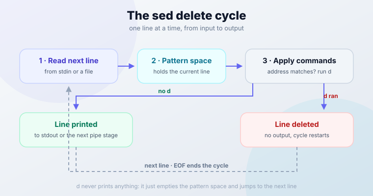
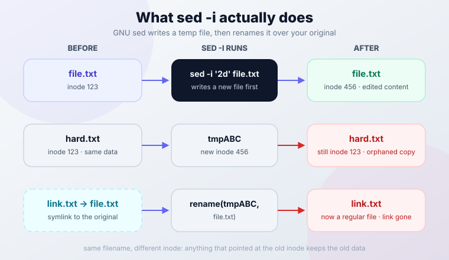

import Notice from "@components/widgets/Notice.astro";
import Tabs from "@components/widgets/Tabs.astro";
import Tab from "@components/widgets/Tab.astro";
import ListCheck from "@components/widgets/ListCheck.astro";
import Accordion from "@components/widgets/Accordion.astro";
import Button from "@components/widgets/Button.astro";

The `sed delete lines` command (`sed 'Nd'`) removes specific lines from text files in seconds. Delete a line by number, a range of lines, or any line matching a pattern. This guide covers every sed line-deletion technique, plus the GNU vs BSD sed gotchas and in-place editing traps that bite in production. Every command below was verified on GNU sed 4.9.

<Notice type="info" title="GNU sed vs BSD sed, and versions">
All examples were verified on **GNU sed 4.9**, the version current Debian and Ubuntu stable ship. **GNU sed 4.10** (April 2026) is the latest release: it fixes panics on lines longer than 2GB and a `--follow-symlinks -i` security race. macOS ships **BSD sed**, which has no `~` step addresses and different `-i` syntax:

- GNU sed: `sed -i.bak '...' file`
- BSD sed (macOS): `sed -i '.bak' '...' file` (the backup suffix argument is required)

Run `sed --version` first. If it errors, you are on BSD sed. The in-place editing section below shows the portable temp-file approach that works everywhere.
</Notice>

## What is sed and Why Use It for Line Deletion?

**sed** (Stream Editor) is a command-line utility for filtering and transforming text on Unix-like systems. It suits line deletion because it streams text line by line instead of loading whole files into memory.

Why it earns a place in your toolkit:

- **Non-interactive**: changes happen without opening an editor, which is what you want in scripts, cron jobs, and CI pipelines
- **Flexible targeting**: line numbers (`5d`), ranges (`10,20d`), patterns (`/error/d`), or full regular expressions
- **Cheap on resources**: constant memory regardless of file size, fast even on multi-GB logs
- **Composable**: plays well with pipes, `grep`, `awk`, and redirects
- **Everywhere**: available on virtually every Unix-like system

This guide is part of a four-part sed series:

- [Delete lines](https://www.bitdoze.com/sed-delete-lines/) using `d` command (this guide)
- [Insert or append text](https://www.bitdoze.com/sed-insert-append-text/) with `i` and `a` commands
- [Transform text case](https://www.bitdoze.com/sed-change-case/) for standardization
- [Search and replace text](https://www.bitdoze.com/sed-search-replace/) with pattern matching

## Basic sed Syntax for Line Deletion

The structure combines an address (which lines to target) with the delete command (`d`).

```shell
sed 'ADDRESS d' filename
```

- **ADDRESS**: specifies which lines to delete
- **d**: the delete command
- **filename**: target file (or stdin if omitted)

### Addressing Methods

**1. Line numbers:**

```shell
sed '5d' file.txt          # Delete line 5
sed '1d' file.txt          # Delete first line
sed '$d' file.txt          # Delete last line
```

**2. Line ranges:**

```shell
sed '2,5d' file.txt        # Delete lines 2-5
sed '10,$d' file.txt       # Delete from line 10 to end
sed '1,3d' file.txt        # Delete first 3 lines
```

**3. Pattern matching:**

```shell
sed '/error/d' file.txt    # Delete lines containing "error"
sed '/^#/d' file.txt       # Delete lines starting with #
sed '/^$/d' file.txt       # Delete empty lines
```

**4. Regular expressions:**

```shell
sed '/^[0-9]/d' file.txt   # Delete lines starting with digits
sed '/\.log$/d' file.txt   # Delete lines ending with .log
```

### Key Options

| Option | Function | Example |
|--------|----------|---------|
| `-i` | Edit files in-place | GNU: `sed -i '1d' file.txt` / BSD: `sed -i '' '1d' file.txt` |
| `-i.bak` | Edit in-place with backup | GNU: `sed -i.bak '1d' file.txt` / BSD: `sed -i '.bak' '1d' file.txt` |
| `-n` | Suppress default output | Used with `p` command |

Before anything else, run `sed --version`. On GNU sed it prints the version (4.9 or 4.10 on current systems). On macOS it fails with an `illegal option` error, which tells you every GNU-only example in this guide needs the portable variant.

### Execution Flow

sed operates in a simple cycle: read a line into the pattern space, apply commands, and output the result. The `d` command short-circuits that cycle: the line never reaches output and sed jumps straight to the next line.



Because sed processes one line at a time, memory use stays constant no matter how big the file is. A multi-GB log gets the same treatment as a 10 KB config file.

**Verify as you go**: without `-i`, sed prints to stdout and touches nothing. That preview is your first safety check, and it's free.

## Deleting Specific Lines

sed targets specific lines through its addressing system.

### Delete by Line Number

```shell
sed '2d' filename          # Delete line 2
sed '1d' filename          # Delete first line
sed '$d' filename          # Delete last line
```

**Multiple specific lines:**

```shell
sed '1d;3d;5d' filename    # Delete lines 1, 3, and 5
sed -e '2d' -e '5d' filename # Alternative syntax
```

### Delete Line Ranges

```shell
sed '10,20d' filename      # Delete lines 10-20
sed '1,5d' filename        # Delete first 5 lines
sed '10,$d' filename       # Delete from line 10 to end
```

**Practical examples:**

```shell
sed '1d' config.txt        # Remove header line
sed '$d' data.txt          # Remove footer/last line
sed '2,4d' log.txt         # Remove lines 2-4
```

### Delete the Last N Lines

sed has no `$-2,$d` syntax, so "delete the last 3 lines" needs a different tool or a trick:

```shell
head -n -3 file.txt                 # GNU coreutils head (Linux)
tac file.txt | sed '1,3d' | tac     # Portable: works on macOS/BSD too
```

`head -n -3` prints everything except the last 3 lines, but negative counts are a GNU extension. The `tac` recipe reverses the file, deletes the (now) first 3 lines, and reverses it back. Both print to stdout, so redirect to a new file and compare before replacing the original.

### Delete by Pattern Matching

Pattern-based deletion deserves its own section: see [Pattern-Based Line Deletion with Regular Expressions](#pattern-based-line-deletion-with-regular-expressions) below for the full treatment.

### Safety and Testing

**Preview changes first:**

```shell
sed '2d' file.txt             # Shows output without modifying file
sed '2d' file.txt > new.txt   # Save to new file
```

**In-place editing with backup:**

```shell
# GNU sed (Linux)
sed -i.bak '2d' file.txt      # Creates file.txt.bak

# BSD sed (macOS)
sed -i '.bak' '2d' file.txt   # Creates file.txt.bak
```

The in-place section below covers the failure modes (`-i` is less innocent than it looks).

**Test with line numbers:**

```shell
nl file.txt | sed '2d'        # Show line numbers to verify targeting
```

### Practical Use Cases

- Log cleaning: `sed '/DEBUG/d' app.log`. If the logs live in Docker, [redirect Docker logs to a single file](https://www.bitdoze.com/redirect-docker-logs-to-a-single-file/) first, then trim DEBUG and error lines with sed
- Config files: `sed '/^#/d' nginx.conf`
- Data processing: `sed '1d' data.csv` (remove CSV header)
- Code cleanup: `sed '/^\/\//d' script.js` (remove JS comments)

## Pattern-Based Line Deletion with Regular Expressions

Pattern matching is where sed earns its keep: delete any line matching a pattern, not just lines at a fixed position.

### Basic Pattern Matching

```sh
sed '/error/d' filename       # Delete lines containing "error"
sed '/warning/d' logfile.txt  # Delete lines with "warning"
sed '/DEBUG/d' app.log        # Delete debug messages
```

Matching is case-sensitive: `/error/` does not match `Error`. See the case-insensitive section below for both the portable and the GNU shortcut.

### Remove Empty Lines (Including CRLF Files)

The classic recipe:

```sh
sed '/^$/d' filename              # Delete empty lines
sed '/^[[:space:]]*$/d' filename  # Delete blank lines, including whitespace-only
```

Here's the trap: if a file passed through Windows, "empty" lines often contain only a carriage return (`\r`). `sed '/^$/d'` will not delete those, because the line isn't empty, it contains `\r`. The POSIX-class version catches them:

```sh
sed '/^[[:space:]]*$/d' win-file.txt   # CRLF-safe: \r is in the POSIX space class
```

GNU sed also accepts `sed '/^\r$/d'` for exactly the `\r`-only case, but that's a GNU extension. Stick with the `[:space:]` class, it's portable.

**Verify what you're dealing with**: `cat -A file.txt | head` shows `$` at line ends and `^M$` on CRLF lines.

### Match Whole Words Only

Deleting every line containing `err` when you meant `error` is a bad afternoon. Word boundaries fix that, but the syntax differs between implementations:

<Tabs>
<Tab name="GNU (Linux)">

```sh
sed '/\berror\b/d' file.txt
```

`\b`, `\<`, and `\>` all work as GNU extensions.

</Tab>
<Tab name="BSD (macOS)">

```sh
sed '/[[:<:]]error[[:>:]]/d' file.txt
```

BSD sed does not know `\b` but supports `[[:<:]]` and `[[:>:]]` as word-boundary brackets.

</Tab>
<Tab name="Portable anywhere">

```sh
sed -E '/(^|[^[:alnum:]_])error([^[:alnum:]_]|$)/d' file.txt
```

This defines "word" as `[A-Za-z0-9_]` using only POSIX constructs. Verbose, but it runs unchanged on GNU, BSD, and other sed implementations. If you only care about whitespace boundaries, the shorter `sed -E '/(^|[[:space:]])error([[:space:]]|$)/d'` also works.

</Tab>
</Tabs>

### Case-Insensitive Deletion: `/error/Id` vs Portable

```sh
sed '/[Ee]rror/d' file.txt   # Portable: matches "Error" or "error"
sed '/error/Id' file.txt     # GNU only: cleaner, handles all casing
```

The `I` modifier after the pattern makes matching case-insensitive. GNU sed supports it; BSD sed does not. On macOS, either extend the bracket class (which gets ugly fast for full casing) or install GNU sed with `brew install gnu-sed` and use `gsed`.

### Character Classes and Anchors

```sh
sed '/[0-9]/d' filename       # Delete lines containing any digit
sed '/[A-Z]/d' filename       # Delete lines with uppercase letters
sed '/^error/d' filename      # Delete lines starting with "error"
sed '/error$/d' filename      # Delete lines ending with "error"
```

**Quantifiers:**

```sh
sed '/[0-9]\{3\}/d' filename     # Delete lines with 3+ consecutive digits
sed '/^.\{80,\}/d' filename      # Delete lines longer than 80 chars
sed '/error.*critical/d' file    # "error" followed by "critical"
```

### Comment Patterns

```sh
sed '/^#/d' config.txt            # Delete lines starting with #
sed '/^[[:space:]]*#/d' file.txt  # Delete comments with leading whitespace
sed '/^\/\//d' script.js          # Delete JavaScript comments
sed '/^\/\*/d' style.css          # Delete CSS comment starts
```

### Complex Patterns

```sh
sed '/^[0-9]\{4\}-[0-9]\{2\}-[0-9]\{2\}/d' file.txt  # Delete date lines (YYYY-MM-DD)
```

Email-shaped lines: use `-E` and plain `+`:

```sh
sed -E '/^[a-zA-Z0-9._%+-]+@[a-zA-Z0-9.-]+\.[a-zA-Z]{2,}/d' file.txt
```

You'll also see this written with `\+` (`[a-zA-Z0-9._%+-]\+@...`). That's a GNU BRE extension; the `-E` form is the portable one.

### Negation: Keep Only Matching Lines

The `!` inverts the address, so `d` deletes everything that does not match:

```sh
sed '/success/!d' filename    # Keep only lines with "success"
sed '/^#/!d' config.txt       # Keep only comment lines
sed '/error/!d' log.txt       # Keep only error lines
```

For keeping several log levels, use extended regex (portable) instead of BRE alternation (GNU-only):

```sh
sed -E '/INFO|WARN|ERROR/!d' log.txt   # Portable: keep only these levels
sed '/INFO\|WARN\|ERROR/!d' log.txt    # [GNU only] BRE \| alternation
```

### Extended Regular Expressions

`-E` switches to ERE: no backslashes on `+`, `?`, `|`, or groups. It's portable across GNU and BSD; GNU also accepts the older `-r` alias.

```sh
sed -E '/^[0-9]{3}-[0-9]{3}-[0-9]{4}$/d' file.txt    # Delete phone numbers
sed -E '/^(http|https):/d' urls.txt                   # Delete HTTP URLs
sed -E '/^[A-Z]{2,}/d' file.txt                       # Lines starting with 2+ caps
```

### Practical Examples

**Log file cleanup:**

```sh
sed '/INFO/d' app.log         # Remove info messages
sed '/^\[.*DEBUG.*\]/d' log   # Remove debug entries
sed '/^$/d' access.log        # Remove empty lines
```

**Configuration files:**

```sh
sed '/^#/d' nginx.conf        # Remove comments
sed '/^[[:space:]]*$/d' config.ini  # Remove blank lines
```

**Data processing:** if your source is a PDF, [extract text from a PDF on the Linux command line](https://www.bitdoze.com/pdf-extract-text-linux-cmd/) with `pdftotext`, then pipe it through sed to strip blank and header lines before further processing:

```sh
pdftotext report.pdf - | sed -e '/^$/d' -e '/^Page [0-9]/d' > report.txt
```

### Safety and Testing

**Preview what will be deleted:**

```sh
grep 'pattern' filename | head    # See matching lines
sed -n '/pattern/p' filename      # Print matches without deleting
```

**Check line numbers for context:**

```sh
nl filename | sed '/pattern/d' | head
```

**Common mistakes to avoid:**

- Forgetting to escape special characters: `/./d` matches every non-empty line, `/\./d` matches literal dots
- Case sensitivity: `sed '/Error/d'` misses `error`. Use `[Ee]rror` portably or `/error/I` on GNU
- Overly broad patterns: `/log/d` also kills `login`, `catalog`, `logger`. Use word boundaries

## Advanced Line Deletion Techniques

Beyond single-line matches, sed handles ranges, multi-line blocks, and decisions based on neighboring lines.

### Range-Based Pattern Deletion

```sh
sed '/START/,/END/d' file.txt         # Delete from START to END markers
sed '/BEGIN/,/FINISH/d' config.txt    # Delete configuration blocks
sed '/<!--/,/-->/d' html.txt          # Delete HTML comments
sed '/ERROR/,10d' file.txt            # Delete from first ERROR to line 10
sed '5,/STOP/d' file.txt              # Delete from line 5 to first STOP after it
sed '/FOOTER/,$d' file.txt            # Delete from FOOTER to end
```

<Notice type="warning" title="Ranges re-open, and unclosed ranges run to end of file">
Two of these are easy to get wrong. Both are documented and verified on GNU sed:

**1. Every later match of the start pattern re-opens the range.** On a file with `ERROR` on lines 3 and 12, `sed '/ERROR/,10d'` deletes lines 3-10 **and then line 12** on its own. The manual is explicit: if the second address is a number less than or equal to the line matching the first address, the range matches only that single line. So "delete the first ERROR block through line 10" silently deletes stray ERROR lines after it too.

**2. An end pattern that never matches deletes through EOF.** The end pattern is only checked *after* the range opens. If `STOP` appears before line 5, `sed '5,/STOP/d'` deletes line 5 to the end of the file. Same for `sed '/<!--/,/-->/d'` on an unclosed HTML comment: verified that it removes the rest of the file.

**Sanity check before committing:** run the range with `p` instead of `d` and count what it eats:

```sh
sed -n '/ERROR/,10p' file.txt | nl | head
```
</Notice>

### Multi-Line Pattern Deletion

```sh
sed '/^$/,/^$/d' file.txt             # Delete empty-line blocks
sed '/^function/,/^}/d' script.js     # Delete JavaScript functions
sed '/^def /,/^$/d' script.py         # Delete Python function definitions
```

### More GNU Address Forms Worth Knowing

Three address forms that make surgical deletion easier. All are GNU extensions:

| Address | What it deletes | Verified example |
|---|---|---|
| `0,/re/d` | From line 1 through the **first** `re`, including a match on line 1 | `printf 'A\nB\nEND\nC\n' \| sed '0,/END/d'` → `C` |
| `5,+2d` | Line 5 plus the next 2 lines (5, 6, 7) | `seq 8 \| sed '5,+2d'` → deletes 5, 6, 7 |
| `6,~4d` | From line 6 through the next multiple of 4 (6, 7, 8) | manual example |

The `0,/re/` form matters: with `1,/END/d`, a match on line 1 ends the range at the **second** match instead, which is rarely what you want when stripping a leading banner.

### Using Address Ranges with Steps

**Delete every nth line:**

```sh
sed '1~2d' file.txt                   # Delete every odd line (1st, 3rd, 5th...) [GNU only]
sed '2~3d' file.txt                   # Delete every 3rd line starting from line 2 [GNU only]
sed '0~5d' file.txt                   # Delete every 5th line [GNU only]
```

`first~step` is a GNU extension. On macOS it fails with `sed: 1: '0~5d': invalid command code ~`. For a portable nth-line delete, use awk: `awk 'NR % 5 == 0 {next} {print}' file.txt`.

### Working with Hold and Pattern Space

sed has two buffers. The **pattern space** holds the current line (or several lines if you append with `N`). The **hold space** is a spare buffer you can copy to and from with `h`, `H`, `g`, `G`, and `x`. For deletion, multi-line techniques matter when the decision depends on adjacent lines or blocks.

**The famous consecutive-duplicates one-liner:**

```sh
sed '$!N; /^\(.*\)\n\1$/d' file.txt   # Deletes duplicate pairs, NOT like uniq
```

Know what this does before using it: it joins each line with the next, and when they're identical it deletes **both**. On input `a\na\n` the output is empty; on `a\na\na\nb\nc\nc\n` you get `a` and `b`, because the lone third `a` pairs with the `b` and both get printed. That's usually not what people want from "dedup".

For real duplicate removal, use `uniq` (it keeps one line of each run) or `uniq -u` (keeps only lines that never repeat). Sort first if duplicates might not be adjacent: `sort file.txt | uniq`.

### Delete a Line Based on the Next Line

You'll find this one-liner floating around:

```sh
sed '$!N; /error\n/d' file.txt   # BROKEN: deletes nothing useful
```

It doesn't do what it claims. `/error\n/` only matches when the *first* line of a joined pair ends in `error`, and then `d` removes both lines of that pair. On a realistic log (`a1`, `ERROR`, `b1`, `c1`), it deletes nothing. Verified.

Here are the two working patterns:

**Delete a line containing ERROR plus the line after it:**

```sh
sed '/ERROR/{N;d}' file.txt
```

When a line matches `ERROR`, `N` appends the next line to the pattern space, and `d` deletes both. Verified: input `a1, ERROR, b1, c1` → output `a1, c1`.

**Delete a line only if the *next* line contains ERROR** (a true lookahead). sed gets ugly here, and awk is honest about it:

```sh
awk 'NR>1 && $0 !~ /ERROR/ {print prev} {prev=$0} END {print prev}' file.txt
```

Verified: input `a1, ERROR, b1, c1, ERROR, d1` → output `ERROR, b1, ERROR, d1` (the lines *followed by* ERROR are gone). awk keeps one line of lookahead in `prev` and only prints it once it knows the next line is safe.

### Complex Multi-Command Operations

```sh
sed -e '/^#/d' -e '/^$/d' -e '/DEBUG/d' file.txt    # Remove comments, empty lines, debug
sed -f delete_script.sed file.txt                    # Or keep the logic in a script
```

Where `delete_script.sed` contains:

```
/^#/d
/^$/d
/DEBUG/d
```

### Practical Advanced Examples

**Clean log files:**

```sh
sed -e '/DEBUG/d' -e '/^$/d' -e '/^\[.*\]$/d' app.log
```

**Process configuration files:**

```sh
sed -e '/^[[:space:]]*#/d' -e '/^[[:space:]]*$/d' nginx.conf
```

**Code cleanup:**

```sh
sed -e '/^$/d' -e '/^[[:space:]]*\/\//d' -e '/console\.log/d' script.js
```

### Advanced Safety Practices

**Test complex commands step by step:**

```sh
sed '/^#/d' file.txt | head -20                                  # Step 1
sed -e '/^#/d' -e '/^$/d' file.txt | head -20                    # Step 2
sed -e '/^#/d' -e '/^$/d' -e '/DEBUG/d' file.txt | head -20      # Step 3
```

**Use intermediate files for layered operations:**

```sh
sed '/START/,/END/d' file.txt > temp1.txt
sed '/ERROR/d' temp1.txt > temp2.txt
sed '/^$/d' temp2.txt > final.txt
```

**Dated backups before risky in-place runs:**

```sh
cp original.txt original.txt.backup.$(date +%Y%m%d-%H%M%S)
sed -i.bak 'complex_deletion_commands' original.txt
```

**Untrusted input?** GNU sed's `--sandbox` disables the `e`, `r`, and `w` commands so a crafted file can't make sed execute commands or write files:

```sh
sed --sandbox '/DEBUG/d' untrusted.log   # [GNU only]
```

## GNU vs BSD sed: Portability Cheat Sheet

Half the sed one-liners on the internet are GNU-only, and they fail on macOS with confusing errors. This matrix maps each gap to a portable alternative:

| Feature | GNU sed (4.9 / 4.10) | BSD sed (macOS) | Portable alternative |
|---|---|---|---|
| In-place `-i` with backup | `sed -i.bak '1d' f` | `sed -i '.bak' '1d' f` (suffix required) | temp file + `mv` |
| Step addresses `first~step` | yes (`1~2d`) | no: `invalid command code ~` | awk (`NR % n`) |
| `\|` alternation in BRE | yes (GNU extension) | no | `sed -E '/a\|b/'` (ERE pipe) |
| `\+` one-or-more in BRE | yes | no | `-E` and plain `+` |
| `\b`, `\<`, `\>` word boundaries | yes | no | bracket-class trick or awk |
| `[[:<:]]`, `[[:>:]]` boundaries | no | yes | bracket-class trick |
| `/I` case-insensitive modifier | yes | no | `[Ee]rror` character class |
| `0,/re/` address | yes | no | `1,/re/` (ends at 2nd match) or awk |
| `addr,+N`, `addr,~N` | yes | no | awk |
| `-z` (NUL-separated input) | yes | no | awk with `RS="\0"` |
| `--sandbox`, `--follow-symlinks`, `--debug` | yes | no | manual pre-checks |
| `$` with multiple input files | last line of *last* file (use `-s` for per-file) | last line of *each* file | test with a two-file sample first |
| `--version` | prints version | errors: `illegal option` | n/a |

Three habits that keep sed scripts portable:

**1. Lint with `--posix`.** Running `sed --posix -f cleanup.sed file.txt` makes GNU sed 4.10+ warn about backslash constructs that GNU accepts but other seds don't. Cheap way to catch non-portable syntax before your script hits a macOS machine.

**2. Pin the locale for machine-generated text.** `[A-Z]` and `[a-z]` ranges follow locale collation, and in some locales unexpected characters fall inside a range. For logs and configs, prefix with `LC_ALL=C`:

```sh
LC_ALL=C sed '/^[A-Z]/d' app.log
```

Byte-wise matching is predictable, which is what you want for automated deletion.

**3. Check the version in CI.** Add `sed --version || echo "BSD sed"` to your pipeline's debug output. Behavior differences (especially `-i` and `$` across files) are much easier to debug when you know which sed ran.

One more edge: GNU sed preserves a missing final newline only while the last line survives. `printf 'a\nb\nc' | sed '1d'` outputs `b\nc` with no trailing newline (verified on 4.9). Delete that last line with `$d` instead, and the new final line gets a normal newline, so `printf 'a\nb\nc' | sed '$d'` outputs `a\nb\n`. If your pipeline hashes or diffs output byte-for-byte across platforms, test on the macOS version you run; BSD sed is widely reported to add newlines where GNU does not.

## sed -i In-Place Editing: Gotchas That Bite in Production

`-i` looks like a convenience flag. It is a file-replacement operation, and it interacts badly with hard links, symlinks, and the `-n` flag.

### What `-i` Does Under the Hood

GNU sed doesn't edit the file. It writes the result to a temp file and renames it over your original. The filename stays, but the inode changes:



**Hard links break silently.** Verified behavior:

```sh
ln orig.txt hard.txt
sed -i '1d' orig.txt
ls -li orig.txt hard.txt
# Both now show link count 1. hard.txt still has the OLD content.
```

**Symlinks get replaced by a regular file.** Verified:

```sh
ln -s real.conf link.conf
sed -i '1d' link.conf
# link.conf is now a regular file with edited content.
# real.conf is untouched. The symlink is gone.
```

The GNU fix is `--follow-symlinks`, which edits the target in place and preserves the link:

```sh
sed -i --follow-symlinks '1d' link.conf
```

Worth knowing: `--follow-symlinks -i` had a time-of-check-to-time-of-use race that let an attacker swap the symlink between resolution and write, fixed in GNU sed 4.10. On multi-tenant boxes where users can write to your temp directories, that's one more reason to know which sed version you're running.

### Multi-File Line Numbering and `$`

GNU sed counts lines continuously across all input files unless you pass `-i` or `-s` (in-place implies `-s`):

```sh
sed -n '2p' f1.txt f2.txt     # Prints line 2 OVERALL (from f1) only
sed -s -n '2p' f1.txt f2.txt  # Prints line 2 of EACH file
sed -s -i '$d' f1.txt f2.txt  # Deletes the last line of EACH file
```

Without `-s`, `$d` only hits the last line of the last file. BSD sed resets numbering per file by default, so the same command means different things on each platform. Verify with `sed -s -n '$=' f1.txt f2.txt` (prints each file's line count) before trusting it.

<Notice type="error" title="sed -ni truncates your file to 0 bytes">
This is the classic CI and Ansible data-loss bug:

```sh
sed -ni '/DEBUG/d' file.txt   # file.txt is now 0 bytes
```

`-n` suppresses output. `-i` writes whatever wasn't printed back to the file. Nothing was printed, so the file becomes empty. Verified.

Make `wc -c file.txt` a reflex after any `-i` run. If you already did this to a file with a `.bak`, restore with `mv file.txt.bak file.txt`. No `.bak`? Restore from your backup system, this is not recoverable from the file itself.
</Notice>

### Pre-Flight Checklist for In-Place Edits

<ListCheck>
<ul>
<li>Preview without `-i` first: `sed '2d' file.txt | head`</li>
<li>Always pass a backup suffix: `-i.bak`, never bare `-i` in scripts</li>
<li>Check `ls -li` when hard links or symlinks might be involved</li>
<li>Run `wc -c file.txt` after the edit to confirm the file isn't empty</li>
<li>Keep the `.bak` until you've diffed it against the result</li>
</ul>
</ListCheck>

### The Right Way on Each Platform

<Tabs>
<Tab name="GNU (Linux)">

```sh
sed -i.bak '2d' file.txt
```

Creates `file.txt.bak` alongside the edited file.

</Tab>
<Tab name="BSD (macOS)">

```sh
sed -i '.bak' '2d' file.txt
```

The suffix is a mandatory argument on BSD sed. Leave it out and `sed -i '2d' file.txt` treats `2d` as the backup suffix and `file.txt` as the script, which fails with `invalid command code f`.

</Tab>
<Tab name="Portable anywhere">

```sh
sed '2d' file.txt > file.txt.new && mv file.txt.new file.txt
```

No `-i` at all: works identically on GNU, BSD, and everything else, and it's atomic-ish when the temp file lands on the same filesystem. This is what I use in scripts that must run on both Linux and macOS.
</Tab>
</Tabs>

### Verify and Roll Back

```sh
diff file.txt.bak file.txt     # See exactly what was removed
mv file.txt.bak file.txt       # Roll back
```

The diff is the verification step: it should show only the lines you intended to delete, nothing else. For checking edits across a config tree, see how to [compare two files or folders in the terminal](https://www.bitdoze.com/compare-folders-content-differences/). Keep the dated-backup habit (`cp file.txt file.txt.$(date +%Y%m%d-%H%M%S)`) for anything you can't afford to lose.

## Performance Considerations

sed is fast for a streaming editor, but pure line filtering is grep's job, and the gap is wide.

Deleting every line containing `DEBUG` from a ~5 million line / 69 MB file, measured on one Linux box with GNU sed 4.9:

| Tool | Time | Relative |
|---|---|---|
| `grep -v DEBUG` | ~4 ms | 1x |
| `sed '/DEBUG/d'` | ~600 ms | ~150x slower |
| `awk '/DEBUG/{next} {print}'` | ~1.1 s | slowest |

The absolute numbers depend on your hardware and I/O. The ordering doesn't: `grep -v` was roughly two orders of magnitude faster because it does one thing, while sed carries its full addressing engine even when you don't use it.

The decision rule:

| Job | Reach for |
|---|---|
| Remove lines matching a pattern, output to stdout | `grep -v 'pattern'` |
| Delete by line number, range, or multiple addresses; edit in place | sed |
| Field-aware logic, lookaheads, per-file counters | awk |

<Notice type="warning" title="Huge single-line files">
On GNU sed 4.9 and earlier, global operations on input lines longer than 2GB (minified JSON, one-line stack traces) hit a `panic` and sed exits with code 4. Fixed in GNU sed 4.10 (April 2026). If you process such files: check `sed --version`, or use `grep -v`/perl for the filtering, which don't have the limit.
</Notice>

## Conclusion

sed deletes lines by number, range, pattern, or any combination, streams files of any size with constant memory, and fits anywhere from one-off shell history to CI pipelines. The difference between a safe sed edit and a data-loss incident is usually one missing flag.

Key takeaways:

1. Start simple: line numbers and basic patterns cover most daily needs
2. Preview without `-i` before every in-place edit, and diff the `.bak` before deleting it
3. Tag everything GNU-specific (`~`, `\|`, `\b`, `/I`, `0,/re/`) and check `sed --version` on any machine the script hasn't met
4. Never combine `-n` with `-i`. That's the 0-byte file trap
5. For pure filtering, `grep -v` beats sed by orders of magnitude

When to use alternatives:

- **grep -v**: pure pattern exclusion, fastest option for filtering
- **awk**: field-based processing, lookaheads, per-file line counting
- **uniq** / **uniq -u**: actual duplicate removal (the sed trick deletes both lines of a pair)
- **A text editor**: interactive deletion when you need visual confirmation

### Master sed's Complete Toolkit

The rest of the sed series:

- [Insert or append text](https://www.bitdoze.com/sed-insert-append-text/) with `i` and `a` commands
- [Transform text case](https://www.bitdoze.com/sed-change-case/) for standardization
- [Search and replace text](https://www.bitdoze.com/sed-search-replace/) with pattern matching

<Button text="100+ essential Linux commands" link="/linux-commands/" variant="outline" color="blue" size="md" icon="arrow-right" />

### FAQ

<Accordion label="Why is my file 0 bytes after sed?" group="faq" expanded="true">

Almost always `sed -ni`. The `-n` flag suppresses output and `-i` writes back only what was printed, so the file ends up empty. Restore from the `.bak` if you have one (`mv file.txt.bak file.txt`), otherwise from backups. See the [in-place editing section](#sed--i-in-place-editing-gotchas-that-bite-in-production) for the full list of `-i` gotchas and the habit of running `wc -c` after edits.

</Accordion>

<Accordion label="Does sed work on minified one-line JSON?" group="faq">

For normal-size single lines, yes. But GNU sed 4.9 and earlier panic (exit code 4) on lines longer than 2GB during global operations, and minified files can get there. GNU sed 4.10 (April 2026) fixed it. For filtering one-line files, `grep -v` is both safe and ~150x faster anyway.

</Accordion>

<Accordion label="How do I test a sed delete safely?" group="faq">

Three steps. First, run the command without `-i` so it only prints to stdout. Second, pipe it through `nl | head` to check you're targeting the right lines. Third, run it for real with `-i.bak`, then `diff file.txt.bak file.txt` to confirm the diff shows only your intended deletions. Delete the `.bak` only after that diff looks right.

</Accordion>

<Accordion label="Do hold space and multi-line tricks matter for deletion?" group="faq">

For adjacent-line decisions, yes: `sed '/ERROR/{N;d}'` deletes a line plus the next one, and the pattern space is what makes that work. The hold space only matters when state must survive across lines, which most deletion tasks don't need. If a multi-line sed gets harder to reason about than the problem, awk is the honest tool.

</Accordion>
