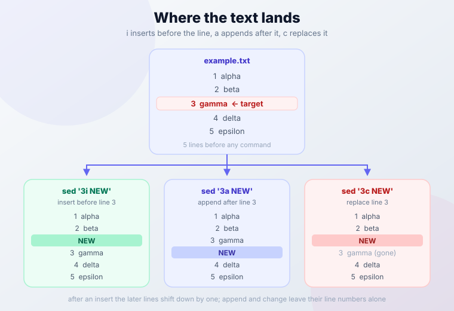
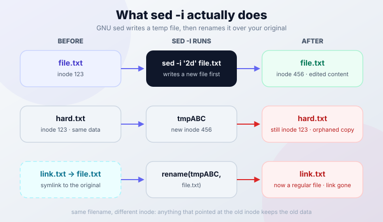

import Button from "@components/widgets/Button.astro";
import Notice from "@components/widgets/Notice.astro";
import ListCheck from "@components/widgets/ListCheck.astro";
import Accordion from "@components/widgets/Accordion.astro";
import Tabs from "@components/widgets/Tabs.astro";
import Tab from "@components/widgets/Tab.astro";

The **sed insert** (`i`) and **sed append** (`a`) commands add text before or after any line in a file, targeted by line number or pattern match. One catch: the one-line `sed '4i text'` syntax that most tutorials show fails on macOS/BSD sed. This guide covers the portable form that works everywhere first, then line numbers, patterns, multi-line blocks, safe in-place editing, and the silent failure modes (empty files, multi-file streams, hard links) that show up in scripts.

<Notice type="info" title="GNU sed vs BSD sed (macOS)">
Most Linux distributions use GNU sed, macOS ships BSD sed, and Alpine/Docker images ship BusyBox sed. Two differences matter for this article:

1. **In-place editing**: GNU sed uses `sed -i '...' file`. BSD sed (macOS) needs a backup suffix argument: `sed -i '' '...' file`.
2. **One-line insert/append**: `sed '4i text'` works on GNU sed and BusyBox sed, but BSD/macOS sed requires the `i\` + newline form.

If you want one approach that works everywhere, use the `i\` + newline syntax and write to a temp file instead of `-i` (examples below).
</Notice>

Tested with GNU sed 4.9 and BusyBox sed 1.36.1 on Linux. Current GNU sed is 4.10 (released 2026-04-21); Ubuntu 24.04 and Debian 12-era distros still ship 4.9. Nothing in 4.10 changed `i`, `a`, or `c` handling, so every example below applies to both.

<Button text="Jump to the Quick Reference" link="#quick-reference-guide" variant="outline" color="blue" size="sm" />

## What is sed?

sed (Stream Editor) is a command-line utility for filtering and transforming text in Unix-like systems. It processes files line by line without user interaction, which makes it a solid fit for scripts and batch operations. Along with tools like `grep`, `awk`, and `find`, it belongs in your set of [essential Linux commands](https://www.bitdoze.com/linux-commands/).

Advantages for text insertion and appending:

- Non-interactive: runs to completion once invoked, no prompts
- Precise positioning: insert or append at specific line numbers or pattern matches
- Light on memory: processes one line at a time (one caveat: sed 4.10's headline fix was `s///g` panicking on lines larger than 2GB, so huge single lines were a real failure mode until recently)
- Scriptable: works in pipes, loops, and CI jobs alongside the rest of the Unix toolkit

Other sed guides for text manipulation:

- [Delete lines with sed](https://www.bitdoze.com/sed-delete-lines/) using the `d` command
- Insert or append text with `i` and `a` commands (this guide)
- [Change text case with sed](https://www.bitdoze.com/sed-change-case/) for standardization
- [Sed search and replace](https://www.bitdoze.com/sed-search-replace/) with pattern matching

If you want a real GNU sed to practice on instead of whatever is on your laptop, a [Hetzner Cloud VPS](https://go.bitdoze.com/hetzner) starts around EUR 4-5/month and gives you the exact Linux environment these examples assume. A budget [Hostinger VPS](https://go.bitdoze.com/hostinger-vps) works too.

### Which sed are you running?

Before copying any example, check which implementation you are on. The one-line syntax behaves differently across them.

<Tabs>
<Tab name="GNU sed (Linux)">

```sh
sed --version
# sed (GNU sed) 4.9
# or: sed (GNU sed) 4.10
```

- One-line `i text` / `a text`: works (GNU extension)
- `sed -i '...' file`: works, no backup suffix needed
- `sed -s`: supported (per-file mode for multiple inputs)
- This is what the distro examples in this guide assume

</Tab>
<Tab name="BSD sed (macOS)">

```sh
which sed
# /usr/bin/sed
man sed
# no --version flag on BSD sed
```

- One-line `i text` / `a text`: **fails**. Use the `i\` + newline form
- In-place needs an explicit suffix: `sed -i '' '...' file`
- No `-s` flag
- This is the implementation the "macOS gotchas" in this guide are about

</Tab>
<Tab name="BusyBox sed (Alpine/Docker)">

```sh
sed --help 2>&1 | head -1
# BusyBox v1.36.1 sed
```

- One-line `i text` / `a text`: works, like GNU
- `sed -i '...' file`: works
- Empty file + `$a` / `1i`: silent no-op, same as GNU
- Alpine-based images ship BusyBox sed, which is worth knowing when you write sed into a Dockerfile and test it on your Mac first. For the rest of the container toolkit, see the [must-know Docker commands](https://www.bitdoze.com/docker-commands/).

</Tab>
</Tabs>

Quick capability summary:

| Syntax / flag | GNU sed | BusyBox sed | BSD sed (macOS) |
|---------------|---------|-------------|-----------------|
| `i text` one-liner | works | works | fails |
| `i\` + newline (POSIX form) | works | works | works |
| `-i` without backup suffix | works | works | fails, use `-i ''` |
| `$` = last line of last file | yes (unless `-s`) | yes | yes |

`-s` (treat each file as a separate stream) is a GNU extension and does not exist in BSD sed. On BusyBox, check `sed --help` before relying on it.

One portability note for new scripts: `-E` for extended regex is standardized as of POSIX.1-2024 (Issue 8). Prefer `-E` over the older GNU `-r` flag.

## Inserting text with sed

### Print-only vs in-place editing

By default sed prints the modified output to stdout and leaves the file alone. Always start here:

```sh
sed '4i Inserted line' example.txt
```

If the output looks right, make it permanent using the "Safe in-place editing" section further down. GNU vs BSD differences matter once you add `-i`, so do not skip that part.

The `i` command inserts text before a specified line. It is the right tool for adding headers, comments, or configuration entries at specific locations.

### Basic insert syntax

There are two forms. The portable one comes from POSIX and works on GNU, BusyBox, and BSD sed:

```sh
sed 'LINE_NUMBER i\
TEXT' filename
```

The one-liner is shorter and is what most blog posts show:

```sh
sed 'LINE_NUMBER i TEXT' filename
```

<Notice type="warning" title="One-line i/a syntax is a GNU extension">
The one-line `i text` form is accepted by GNU sed and BusyBox sed, but it is not in the POSIX standard. POSIX.1-2024 still requires the `a\` / `i\` backslash form. BSD/macOS sed rejects the one-liner. Full story in the next section.
</Notice>

### Why your sed '1i text' command fails on macOS

This is the single most common sed complaint from Mac users. You copy a tutorial command like this:

<Tabs>
<Tab name="Fails on macOS">

```sh
sed '4i Inserted line' example.txt
```

On BSD sed this errors out. The expected wording comes from the FreeBSD sed source, which macOS sed derives from (confirm the exact text on a real Mac):

```
sed: command i expects \ followed by text
```

Nothing is inserted. The same applies to `a` and `c`.

</Tab>
<Tab name="Works everywhere">

```sh
sed '4i\
Inserted line' example.txt
```

The newline immediately after `i\` is the key. GNU sed, BusyBox sed, and BSD sed all accept this form, so a script written this way runs on a Mac, on a Linux box, and inside an Alpine container.

</Tab>
</Tabs>

<Notice type="info" title="Rule of thumb">
If the script must run on macOS, always use `i\` + newline. If you only ever run on GNU/Linux (including Alpine/BusyBox), the one-liner is fine and less noisy.
</Notice>

The same rule covers `a` (append) and `c` (change/replace line). All three commands live in the same POSIX block and share the syntax quirk.

### Insert by line number

**Insert before a specific line** (GNU/BusyBox one-liner shown first, portable form below it):

```sh
sed '4i This is the inserted line.' example.txt

# portable form: works on macOS too
sed '4i\
This is the inserted line.' example.txt
```

**Insert at the beginning of a file:**

```sh
sed '1i\
Header line goes here' filename
```

**Insert multiple lines (portable style):**

```sh
sed '4i\
First inserted line\
Second inserted line\
Third inserted line' filename
```

Notes:

- The newline right after `i\` is required for portability between GNU sed and BSD sed
- Keep the closing quote at the end of the last inserted line
- Original line numbers shift down after insertion. If you insert before line 4, the old line 4 becomes line 5

### Insert by pattern matching

**Insert before lines matching a pattern:**

```sh
sed '/PATTERN/i\
TEXT' filename
```

**Practical examples:**

```sh
sed '/function main/i\
# Main function starts here' script.py
sed '/^server {/i\
# Nginx server configuration' nginx.conf
sed '/export PATH/i\
# Adding to PATH variable' .bashrc
```

If you are editing `nginx.conf` as part of a real server setup, see how to [set up Nginx on Linux](https://www.bitdoze.com/setup-webdav-nginx/) for the surrounding configuration.

### Advanced insert examples

**Insert with variables (quote safely):**

```sh
header="Generated on $(date)"
sed "1i\\
$header" datafile.txt
```

Why this style: if your variable contains characters sed treats specially (leading dashes, backslashes, etc.), the `i\` + newline form behaves more consistently across platforms than the one-liner.

**Insert configuration blocks:**

```sh
sed '/^# Database settings/i \
# Redis configuration\
redis.host=localhost\
redis.port=6379' config.ini
```

**Insert after finding specific content:**

```sh
sed '/TODO:/i\
# FIXME: Review this section' code.py
```

### Points to remember

<ListCheck>
<ul>
<li>Text is inserted before the specified line or before every line matching a pattern</li>
<li>Original line numbers shift down after an insertion</li>
<li>Use `\` at the end of each line for multi-line insertions</li>
<li>sed writes to stdout by default. Add `-i` only after you have previewed the output</li>
</ul>
</ListCheck>

## Appending text with sed

The `a` command appends text after a specified line. Use it for footers, closing tags, or data that must follow specific content.

### Basic append syntax

Portable form (POSIX, works everywhere):

```sh
sed 'LINE_NUMBER a\
TEXT' filename
```

One-liner (GNU + BusyBox only):

```sh
sed 'LINE_NUMBER a TEXT' filename
```

### Append by line number

**Append after a specific line:**

```sh
sed "2a\\
Don't forget to subscribe!" filename
```

**Append at end of file**. This is the `sed append to end of file` case people search for, and `$` is the address for it:

```sh
sed '$a\
Footer text goes here' filename
```

`$` matches the last line. On multiple files without `-i`, "last line" means the last line of the **last** file. See the gotchas section.

**Append multiple lines (portable style):**

```sh
sed '4a\
First appended line\
Second appended line\
Third appended line' filename
```

Unlike insert, appended lines do not shift the line numbers of existing content.

### Append by pattern matching

**Append after lines matching a pattern:**

```sh
sed '/PATTERN/a\
TEXT' filename
```

**Practical examples:**

```sh
sed '/^}$/a\
# End of function block' script.js
sed '/^server {/a\
    # Server configuration continues' nginx.conf
sed '/export PATH/a\
# PATH modified above' .bashrc
```

### Advanced append examples

**Append configuration sections:**

```sh
sed '/^# Database settings/a \
host=localhost\
port=5432\
database=myapp' config.ini
```

**Append with variables:**

```sh
timestamp="Last modified: $(date)"
sed "\$a\
$timestamp" datafile.txt
```

**Append after specific markers:**

```sh
sed '/<!-- INSERT HERE -->/a\
<div>New content</div>' template.html
```

If you find yourself pasting JSON or YAML blobs through sed quoting, stop and read the "When NOT to use sed" section further down. There are better tools for that job.

### Insert vs append vs change

`i` and `a` have a third sibling: `c` (change) replaces the matched line entirely. All three appear in the same POSIX block.



| Command | Position | Example (GNU/BusyBox one-liner) | Notes |
|---------|----------|---------------------------------|-------|
| `i` | Before line/pattern | `sed '5i text'` | Inserts above; later line numbers shift down |
| `a` | After line/pattern | `sed '5a text'` | Inserts below; existing line numbers stay |
| `c` | Replaces the line | `sed '5c text'` | The matched line is discarded and replaced |

On macOS/BSD sed, write the portable form instead: `i\`, `a\`, or `c\` followed by a newline and then the text.

### Points to remember

<ListCheck>
<ul>
<li>Text is appended after the specified line or pattern</li>
<li>Use `$a` to append at the end of a file</li>
<li>Use `\` at line end for multi-line appends</li>
<li>Existing line numbers stay unchanged; new lines land below</li>
</ul>
</ListCheck>

## Targeting specific positions

sed's strength is targeting where text should land, using line numbers, ranges, or patterns.

### Position-based targeting

**Line numbers:**

```sh
sed '1i\
Header text' filename        # Insert at beginning
sed '5a\
Middle text' filename        # Append after line 5
sed '$a\
Footer text' filename        # Append at end
```

**Line ranges**. Note the semantics: a command with a range runs **once per line in the range**, not once for the whole range:

```sh
sed '10,15i\
# Section start' filename    # Inserts before EACH line from 10 to 15
sed '20,$a\
# End section' filename      # Appends after every line from 20 to EOF
```

If you wanted one insert before line 10 only, address line 10 (`10i\`), not the range `10,15i`. This trips people up regularly.

### Pattern-based targeting

**Simple patterns:**

```sh
sed '/TODO/i\
# FIXME: Address this' filename
sed '/^function/a\
# Function definition ends' filename
sed '/^#/a\
# Comment continues' filename
```

**Complex patterns with regular expressions:**

```sh
sed '/^[0-9]/i\
# Numbered item:' filename              # Before lines starting with digits
sed '/\.log$/a\
# Log entry processed' filename         # After lines ending with .log
sed '/^[[:space:]]*$/i\
# Empty line above' filename            # Before blank lines
```

**Mixed regex work** (identifier shapes, email patterns):

```sh
sed '/^[A-Z][a-z]*[0-9]\{2,4\}/i\
# Code identifier found' data.txt

sed '/[a-zA-Z0-9._%+-]\+@[a-zA-Z0-9.-]\+\.[a-zA-Z]\{2,\}/a\
# Email processed' contacts.txt
```

For text manipulation that goes beyond insert/append, like replacing matches or restructuring lines, the [sed search and replace](https://www.bitdoze.com/sed-search-replace/) guide covers the `s` command properly.

### Practical use cases

**Configuration files:**

```sh
# Add database configuration
sed '/^# Database/a \
host=localhost\
port=5432\
user=admin' config.ini

# Insert security headers
sed '/^server {/a \
    add_header X-Frame-Options SAMEORIGIN;\
    add_header X-Content-Type-Options nosniff;' nginx.conf
```

**Code files:**

```sh
# Add function documentation
sed '/^def /i\
# Function: Performs calculation' script.py

# Insert debugging statements
sed '/^if /a\
print("Debug: Condition checked")' debug.py
```

**Data processing:**

```sh
# Add CSV headers
sed '1i\
Name,Age,Email' data.csv

# Insert separators
sed '/^---/i\
# Section divider' document.txt
```

### Advanced targeting techniques

**Conditional insertion (block form):**

```sh
sed '/config_section/{
i\
# Configuration starts here
}' filename
```

Inside blocks, stick to the `i\` + newline form. It behaves the same on GNU sed and BSD sed.

**Multiple operations (insert + append around the same match):**

```sh
sed '/important_line/{
i\
# Important section begins
a\
# Important section ends
}' filename
```

**Using variables for dynamic content:**

```sh
section_name="Database Configuration"
sed "/^# $section_name/a\\
host=localhost" config.ini
```

One GNU-specific detail: as a GNU extension, `i` and `a` accept two addresses (a range in a single command). POSIX sed accepts only one. Keep scripts to one address if BSD/macOS has to run them.

### Safety and testing

**Preview changes first (always):**

```sh
sed '/pattern/i\
NEW TEXT' filename
sed '/pattern/i\
NEW TEXT' filename | head
```

**Show line numbers for context:**

```sh
nl -ba filename | sed '/pattern/i\
NEW TEXT'
```

Post-edit verification (diff, grep, line counts) lives in the "Verify your edit" section. Do that after any in-place run.

### Safe in-place editing (GNU vs BSD sed)

**GNU sed (most Linux):**

```sh
sed -i.bak '/pattern/i\
NEW TEXT' filename
```

**BSD sed (macOS):**

```sh
sed -i '.bak' '/pattern/i\
NEW TEXT' filename
```

Both create `filename.bak` so you can revert. The suffix is the only difference: GNU takes `-i.bak` as one word, BSD wants `-i '.bak'` (and `-i ''` if you truly want no backup, which I would not).

**Portable in-place edit that preserves inode, mode, ownership, and hard links:**

```sh
tmp="$(mktemp)"
sed '/pattern/i\
NEW TEXT' filename > "$tmp" && cat "$tmp" > filename && rm -f "$tmp"
```

This writes the result to a temp file, then copies the bytes over the original with `cat >`. The original file object is never replaced, so hard links and permissions survive. The simpler `mv "$tmp" filename` version also works, but the renamed file picks up mktemp's `0600` mode and your ownership. Fine for throwaway files, wrong for anything shared. The inode story is in the gotchas section.

<Notice type="info" title="Rollback">
With `-i.bak` or a `.bak` suffix, `mv filename.bak filename` reverts the edit completely. Without a backup file, undo means re-running the inverse edit or restoring from your own backup.
</Notice>

## Gotchas: empty files, multiple files, and hard links

These are the failure modes that do not show up in most sed tutorials. Each one produces a "but the command ran fine" situation, which is exactly what makes them expensive in scripts.

### Empty files: 1i and $a are silent no-ops

On an empty input file, `1i` and `$a` do nothing. sed never starts a cycle, so the queued insert/append text is never printed. Exit code is 0. No warning. Verified on both GNU sed and BusyBox sed.

The GNU manual describes `i`/`a` text as queued "at the end of the current cycle, or when the next input line is read". Empty file means no line, no cycle, no output.

<Notice type="warning" title="Empty file? sed will do nothing">
If you run `sed '1i Header' empty.txt` and the file stays empty, sed is not broken. This is expected behavior. Use a shell approach instead.
</Notice>

Empty-file-safe alternatives:

```sh
# Prepend a header (works on empty files too)
printf 'Header line\n' | cat - file.txt > out && cat out > file.txt && rm out

# Append a footer
echo 'Footer line' >> file.txt
```

### Multiple files: one stream vs -s vs -i

Without `-i`, passing several files makes sed treat them as **one continuous stream**. So this:

```sh
sed '$a END' f1 f2
```

appends `END` only after the last line of `f2`, not after each file. If you expected a footer in every file, you got one footer at the very end and a confusing result.

Your options:

```sh
sed -s '$a END' f1 f2       # GNU only: END after each file, on stdout
sed -i '$a END' f1 f2       # works per-file: -i implies -s in GNU sed
```

The GNU manual states it plainly: the in-place option implies `-s`. That is why `sed -i '1i Header' *.txt` puts a header in each file.

BSD sed has no `-s`, so the portable per-file answer is a loop:

```sh
for f in *.txt; do
  sed '$a END' "$f" > "$f.tmp" && cat "$f.tmp" > "$f"
  rm -f "$f.tmp"
done
```

### Inodes, hard links, and permissions

`sed -i` does not edit your file. It writes a temp file and renames it over the original. The path stays the same; the inode does not.



Consequences:

- **Hard links go stale.** A hard-linked sibling path keeps pointing at the old inode with the old content. Verified: after `sed -i`, the hard link still showed the original text.
- **Symlinks get replaced.** Without `--follow-symlinks`, the symlink itself is overwritten with a regular file.
- **Mode is preserved.** A `600` file stayed `600` after `-i` in testing. Ownership is generally preserved too, but verify on your system if you run `sed -i` under `sudo` on files owned by another user. That combination is the one worth checking rather than assuming.

If you need the inode to survive (shared files, hard links, weird permissions), use the `cat >` recipe from the "Safe in-place editing" section instead of `-i`.

For symlinked `/etc` files, GNU sed has `--follow-symlinks` (only valid with `-i`). sed 4.10 fixed a TOCTOU symlink race in that flag, which is a good reason to be on a current release.

### Trailing newline edge case

If a file's last line has no trailing newline, `sed '$a appended'` still works on GNU sed: it adds the newline to the old last line and appends normally. BSD sed is reported to behave differently. Verify before relying on this on macOS.

Where it matters: byte-sensitive files such as generated assets or certain `/etc` configs where a missing final newline is meaningful. Check with `tail -c 1 file | xxd` if you are unsure.

### Exit codes and idempotent config edits

sed exits 0 whether or not anything matched. Your script cannot use `$?` to ask "did the insert happen?". For one-shot provisioning this is fine. For anything that runs twice (cron, config management, re-runnable setup scripts) you need a guard, or the line lands twice:

```sh
grep -qxF 'export EDITOR=vim' ~/.bashrc || echo 'export EDITOR=vim' >> ~/.bashrc

grep -q '^PermitRootLogin' /etc/ssh/sshd_config || \
  sed -i '/^#PermitRootLogin/a\
PermitRootLogin no' /etc/ssh/sshd_config
```

The second example is the standard "uncomment a hardening default exactly once" pattern. If you are editing sshd_config on remote hosts through a jumphost, the [SSH ProxyJump](https://www.bitdoze.com/ssh-proxyjump-jumphost/) setup is worth having first so you do not lock yourself out testing.

One ops note: at fleet scale, do not hand-roll these guards. Ansible's `lineinfile` and `blockinfile` modules exist for exactly this job: idempotency, check mode, and rollback are already solved there. sed is the right tool for a box you are on right now; a config management tool is the right tool for a thousand boxes.

### Failure modes quick table

| Symptom | Cause | Fix |
|---------|-------|-----|
| Command ran, exit 0, file unchanged | Empty input file, no sed cycle ran | `printf 'Header\n' \| cat - file` or `echo >> file` |
| Footer only appeared in the last file | Multiple files = one stream without `-s` | Use `sed -i` (implies `-s`) or loop per file |
| Hard link still shows old content after `-i` | Temp file + rename, new inode | Use the `cat >` in-place recipe |
| Line appears twice after re-running a script | sed exits 0 regardless of matches | `grep -q` guard before editing |
| `sed: command i expects \ followed by text` | BSD/macOS sed rejected the one-liner | Use `i\` + newline form |
| `r` command produced nothing | Missing or unreadable file, silently empty | Check the path, then `grep -n` after |

## Verify your edit

Editing config files blind is how you get a service that will not start on the next reboot. Three one-liners catch almost everything.

### Post-edit checks

```sh
sed -i.bak '/pattern/i\
NEW TEXT' file && diff file.bak file    # review exactly what changed
grep -n 'NEW TEXT' file                 # confirm it landed (and landed once)
wc -l file.bak file                     # line-count sanity
```

If the diff is wrong, `mv file.bak file` puts you back. If you need to compare whole trees after a bulk edit, see [compare files and folders from the terminal](https://www.bitdoze.com/compare-folders-content-differences/) for the recursive version of this.

<ListCheck>
<ul>
<li>Diff reviewed: the only changes are the lines you intended</li>
<li>`grep -n` finds exactly one occurrence per target (not zero, not two)</li>
<li>Line count moved by the expected amount</li>
<li>Service reloaded or config validated if the file feeds one (`nginx -t`, `sshd -t`, `systemctl reload ...`)</li>
<li>Only then delete the `.bak`</li>
</ul>
</ListCheck>

### Trace execution with sed --debug

GNU sed 4.6 and later has `--debug`, which prints the compiled program and traces every cycle. It is the fastest way to see why an address did not match:

```sh
$ printf 'x\n' | sed --debug '1a hello'
SED PROGRAM:
  1 a\hello
INPUT:   'STDIN' line 1
PATTERN: x
COMMAND: 1 a\hello
END-OF-CYCLE:
x
hello
```

You get the program as sed parsed it (useful when you suspect a quoting mistake), the line it is on, and the pattern space at each step. sed 4.10 fixed a crash in `--debug` itself, so keep current if you lean on it.

`--debug` is GNU-only. It does not exist in BSD/macOS sed or BusyBox sed.

## Advanced insert and append techniques

Once the basics are solid, these patterns handle the messier jobs.

### Conditional text addition

**Insert before lines matching a condition:**

```sh
# Insert a warning before error lines
sed '/ERROR/i\
*** WARNING: Critical error detected ***' logfile.txt

# Append configuration after specific sections
sed '/^# Network settings/a \
interface=eth0\
dhcp=true' config.txt
```

**Multiple condition matching:**

```sh
# Insert before lines starting with date patterns
sed '/^[0-9]\{4\}-[0-9]\{2\}-[0-9]\{2\}/i\
Date entry:' dates.txt

# Append after lines containing both keywords
sed '/database.*config/a\
# Database configuration processed' app.conf
```

### Multi-line text blocks

**Insert complex configuration blocks:**

```sh
sed '/^# SSL Configuration/i \
# SSL Certificate Setup\
ssl_certificate /path/to/cert.pem;\
ssl_certificate_key /path/to/key.pem;\
ssl_protocols TLSv1.2 TLSv1.3;' nginx.conf
```

**Append structured data:**

```sh
sed '/^{$/a \
    "name": "default",\
    "version": "1.0",\
    "active": true' config.json
```

The earlier `sed '$a END'` footer is a different job: one line at EOF, not a structured block. For JSON or YAML blocks of any real size, prefer `jq` or `yq`. Escaping multi-line structured data through sed quoting gets fragile fast.

### Dynamic content insertion

**Using variables and command substitution:**

```sh
# Insert timestamp
current_time=$(date)
sed "1i\
Generated on: $current_time" report.txt

# Append system information
sed "\$a\
System: $(uname -s), User: $(whoami)" logfile.txt
```

### Insert file contents with r

The `r` command reads another file into the output after the matched line:

```sh
# Insert entire file content
sed '/INCLUDE_POINT/r include.txt' main.txt

# Combine with text insertion
sed '/HEADER/{ 
i\
# Configuration file begins
r config_template.txt
a\
# Configuration file ends
}' main.conf
```

<Notice type="warning" title="sed r fails silently">
If the filename cannot be read, GNU sed treats it as an empty file with no error indication. A typo'd path produces unchanged output and exit code 0, indistinguishable from success. Always `grep -n` after using `r` to confirm the content landed.
</Notice>

POSIX also specifies that the file is read "as of the time the output is written", not when the `r` command executes. For sed's normal single-pass output that rarely matters, but do not assume the content is snapshotted at match time.

### Pattern range operations

```sh
# Insert text before each line in a range
sed '10,20i\
# Line in middle section' filename

# Append after each line in a pattern-delimited range
sed '/START/,/END/a\
# Block processed' filename
```

Remember the range semantics from earlier: the command fires for every line in the range, not once at the start of it.

### Advanced scripting techniques

**Multiple operations in sequence:**

```sh
sed -e '/function/i\
# Function definition' \
    -e '/function/a\
# Function body starts' \
    -e '/return/i\
# Function ends' \
    -e '/return/a\
# Return statement processed' script.py
```

**Using sed scripts for complex operations.** Create `modify.sed`:

```
/^# Database/i\
# Database Configuration Section
/^# Database/a\
host=localhost
/^# Database/a\
port=5432
/^# Security/i\
# Security Settings Section
/^# Security/a\
enable_ssl=true
```

The `i\`/`a\` + newline style is what you want in script files. It avoids the edge cases that vary between sed implementations.

Run it with:

```sh
sed -f modify.sed config.ini
```

`-f` is the right move once a sed program grows past what you can read on one line. Check the script in with the code it modifies.

### Practical advanced examples

**Log file processing:**

```sh
now="$(date)"
sed -e '/ERROR/i\
=== ERROR DETECTED ===' \
    -e "/ERROR/a\
Timestamp: $now" \
    -e '/WARN/i\
--- Warning ---' application.log
```

**HTML head injection:**

```sh
sed -e '1i\
<!DOCTYPE html>' \
    -e '/<head>/a\
<meta charset="UTF-8">' \
    -e '/<head>/a\
<meta name="viewport" content="width=device-width, initial-scale=1.0">' index.html
```

### GNU-only flags worth knowing

Four flags that earn their keep in operator scripts (all GNU sed):

- **`--sandbox`**: rejects the `e`, `w`, and `r` commands. Run untrusted sed scripts with it.
- **`--follow-symlinks`**: only with `-i`; edits through symlinks instead of replacing them. Needed for symlinked `/etc` files. sed 4.10 fixed a TOCTOU race in this flag.
- **`-z` / `--null-data`**: NUL-delimited mode, pairs with `find -print0` pipelines on filenames with spaces.
- **`-E`**: extended regex, now POSIX-standard as of Issue 8 (2024). Prefer it over `-r` in anything new.

### When NOT to use sed

Honest boundaries, from someone who has cleaned up clever sed scripts:

1. **Appending a line at EOF.** `echo 'line' >> file` is simpler, atomic via O_APPEND, and works on empty files. `sed '$a'` adds nothing there and is harder to read.
2. **Repeated idempotent config edits across machines.** A grep-guarded sed one-liner works on one box. On a fleet, Ansible `lineinfile`/`blockinfile` gives you idempotency, dry-run, and diffs for free.
3. **Large or structured blocks (JSON, YAML, HTML fragments).** `jq`, `yq`, or a real templating tool beat escaping quotes and backslashes through sed quoting. If the insert is longer than three lines and anything in it is quoted, reconsider.

## Conclusion

sed insert (`i`) and sed append (`a`) are small commands that do one job well: put text at an exact position. The portable `i\` + newline form runs everywhere including macOS, `1i` and `$a` silently no-op on empty files, and `sed -i` replaces your file behind the scenes. Preview on stdout, keep the `.bak`, verify with diff.

<ListCheck>
<ul>
<li>Use `i\` + newline for any script that must run on macOS or BSD</li>
<li>`1i` and `$a` do nothing on empty files. Use `cat -` or `>>` there</li>
<li>`sed -i` replaces the file (inode changes, hard links go stale)</li>
<li>sed exits 0 whether or not it matched. Guard with `grep -q` for idempotent scripts</li>
<li>Verify with `diff file.bak file` and `grep -n` before deleting the backup</li>
</ul>
</ListCheck>

More sed commands worth knowing:

- [Delete lines](https://www.bitdoze.com/sed-delete-lines/) with sed to remove unwanted content
- [Change text case with sed](https://www.bitdoze.com/sed-change-case/) to standardize capitalization
- [Sed search and replace](https://www.bitdoze.com/sed-search-replace/) for pattern-based substitution

## Quick reference guide

### Common insert commands

```sh
# Insert at specific positions
sed '1i\
Header text' file.txt            # Before first line
sed '5i\
Middle text' file.txt            # Before line 5
sed '/pattern/i\
Before text' file.txt            # Before matching lines

# Multi-line insert (portable)
sed '1i\
Line 1\
Line 2\
Line 3' file.txt

# One-liner: GNU/BusyBox only, fails on macOS
sed '1i Header text' file.txt
```

### Common append commands

```sh
# Append at specific positions
sed '5a\
After text' file.txt             # After line 5
sed '$a\
Footer text' file.txt            # After last line
sed '/pattern/a\
After text' file.txt             # After matching lines

# Multi-line append (portable)
sed '$a\
Footer line 1\
Footer line 2\
Footer line 3' file.txt

# Change/replace a line
sed '5c\
Replacement text' file.txt
```

### Frequently asked questions

<Accordion label="What's the difference between insert and append (and change)?" group="faq" expanded="true">
Insert (`i`) adds text before the target line or match. Append (`a`) adds text after it. Change (`c`) discards the target line and replaces it with the new text. After an insert, later line numbers shift down; append and change leave them alone.
</Accordion>

<Accordion label="How do I add multi-line text?" group="faq">
Use the portable backslash form with a newline after the command letter:

```sh
sed '1i\
Line 1\
Line 2' file.txt
```

This works on GNU sed, BusyBox sed, and BSD/macOS sed.
</Accordion>

<Accordion label="Can I insert variables in the text?" group="faq">
Yes. Use double quotes so the shell expands them, and prefer the `i\` + newline form for safety:

```sh
sed "1i\\
Current date: $(date)" file.txt
```
</Accordion>

<Accordion label="How do I make changes permanent?" group="faq">
Use in-place editing with a backup suffix:

```sh
# GNU sed (Linux)
sed -i.bak '1i\
Header' file.txt

# BSD sed (macOS)
sed -i '.bak' '1i\
Header' file.txt
```

You may see `'1i\'$'\n''Header'` in older answers. That is bash/zsh ANSI-C quoting, and it does not work in `dash` or plain `sh`. See [how bash, Zsh, and fish differ](https://www.bitdoze.com/fish-shell-vs-bash-vs-zsh/) for why. If you want to avoid the `-i` flag differences entirely, use the portable temp-file recipe from "Safe in-place editing".
</Accordion>

<Accordion label="What happens to line numbers after insertion?" group="faq">
Insert: line numbers below the insert point shift down by one per inserted line. Append: existing line numbers stay the same, new lines appear below. Change: line count is unchanged unless the replacement is multi-line.
</Accordion>

<Accordion label="Can I insert/append to multiple files at once?" group="faq">
With `-i`, yes: `sed -i '1i Header' *.txt` (GNU/BusyBox form) puts the header in each file, because GNU `sed -i` implies `-s` (separate streams per file). Without `-i`, `sed '$a END' f1 f2` treats the files as one stream and appends only after the last file. `-s` itself is GNU-only. The portable answer is a per-file loop. See the "Multiple files" gotcha above.
</Accordion>

<Accordion label="Why does sed do nothing on an empty file?" group="faq">
`1i` and `$a` are silent no-ops on empty input: sed never runs a cycle, so the queued text is never written. Exit code 0, no error. Prepend with `printf 'Header\n' | cat - file.txt` and append with `echo 'Footer' >> file.txt` instead.
</Accordion>

<Accordion label="How do I know my edit happened? Why did my script insert the line twice?" group="faq">
sed exits 0 whether or not the address matched, so `$?` tells you nothing about whether text was inserted. Check with `grep -n 'NEW TEXT' file`. For scripts that run more than once, guard the edit:

```sh
grep -q '^PermitRootLogin' /etc/ssh/sshd_config || \
  sed -i '/^#PermitRootLogin/a\
PermitRootLogin no' /etc/ssh/sshd_config
```
</Accordion>

<Accordion label="Why didn't sed 'r file' insert anything?" group="faq">
If the filename is missing or unreadable, GNU sed treats it as an empty file without any error indication. The command "succeeds" and inserts nothing. Verify the path exists first, and `grep -n` the output after.
</Accordion>

<Accordion label="Why does my hard link still show old content after sed -i?" group="faq">
`sed -i` writes a temp file and renames it over your path. The inode changes, so hard-linked sibling paths keep pointing at the old, unedited inode. Symlinks get replaced by regular files unless you pass `--follow-symlinks`. To preserve inodes and hard links, copy the new content over the original instead of renaming: `sed ... file > tmp && cat tmp > file`.
</Accordion>

<Accordion label="Does all of this work on macOS and in Alpine Docker images?" group="faq">
The portable `i\` + newline form works on macOS (BSD sed), Linux (GNU sed), and Alpine images (BusyBox sed). The one-line `i text` form works on GNU and BusyBox but fails on macOS. In-place editing syntax differs (`-i` vs `-i ''`). Check "Which sed are you running?" at the top for the full comparison.
</Accordion>
