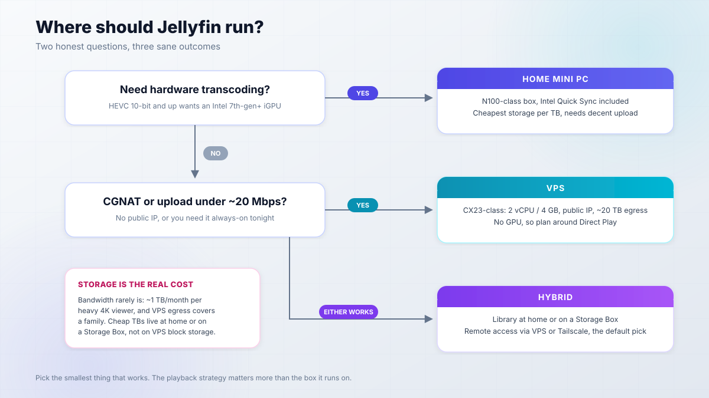
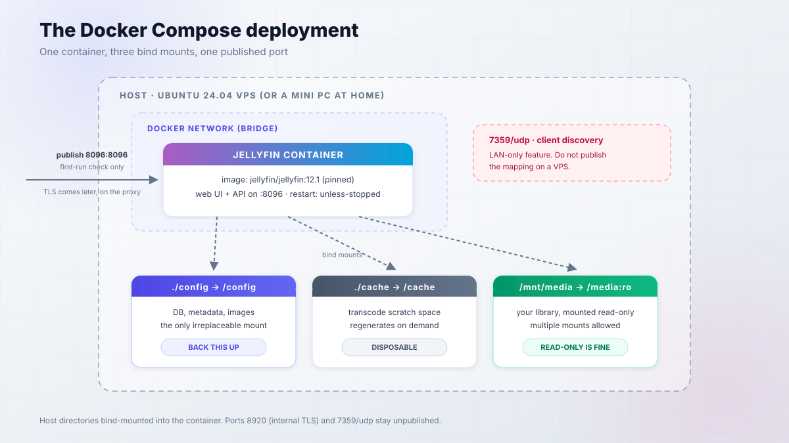
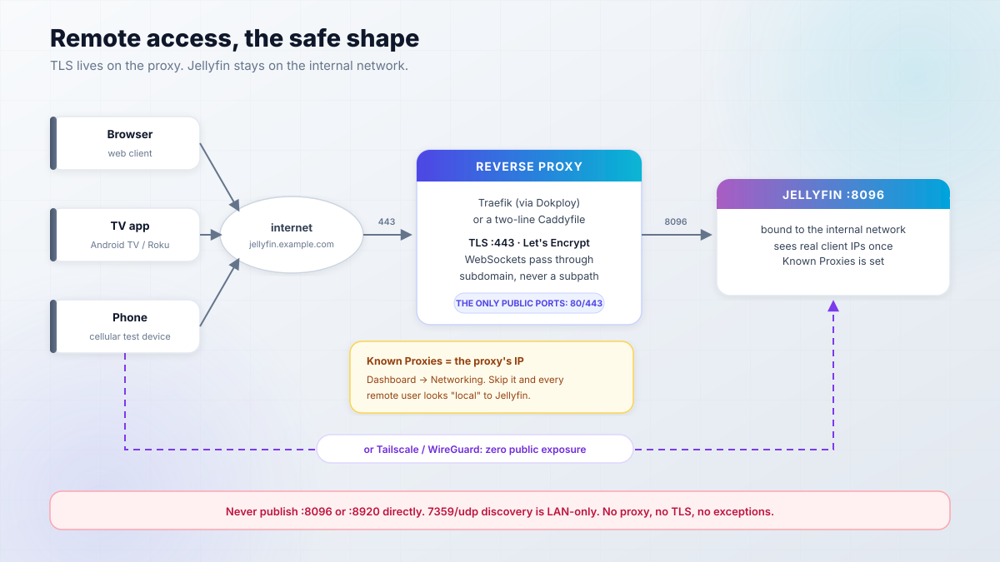
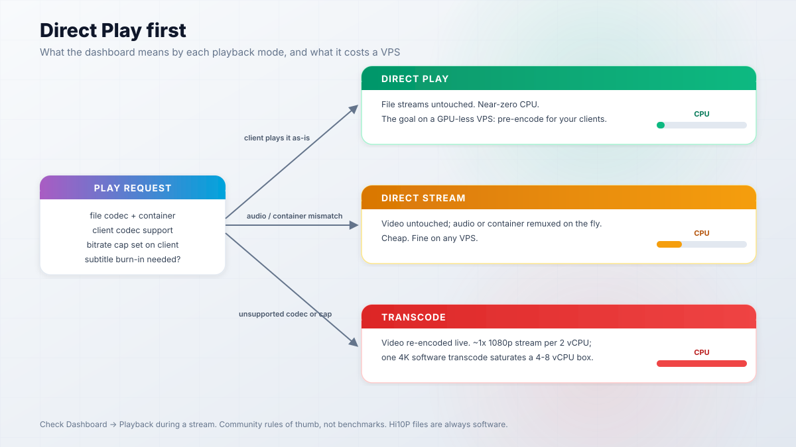
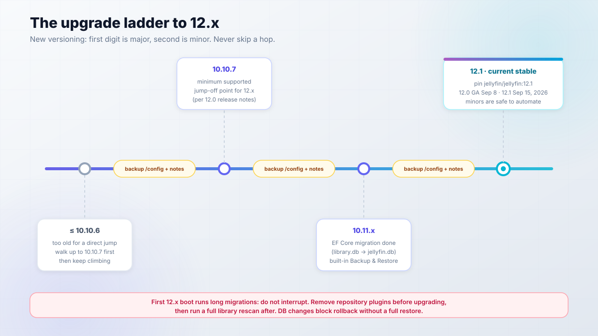

import Button from "@components/widgets/Button.astro";
import Notice from "@components/widgets/Notice.astro";
import ListCheck from "@components/widgets/ListCheck.astro";
import Accordion from "@components/widgets/Accordion.astro";
import Tabs from "@components/widgets/Tabs.astro";
import Tab from "@components/widgets/Tab.astro";
import YouTubeEmbed from "@components/widgets/YouTubeEmbed.astro";

Plex keeps paywalling features you already own. If you would rather self-host Jellyfin instead, you get your own Netflix: no accounts with a vendor, no ads, no subscription, and no remote-access paywall. This guide deploys the Jellyfin media server with Docker Compose on a cheap VPS (or a mini PC at home), exposes it safely behind a reverse proxy, and covers the parts that actually keep it running: Direct Play on a GPU-less box, backups, and upgrades on the new 12.x version line.

Everything below is pinned to Jellyfin 12.1 and written in September 2026. Every major step has a verify command so you know it worked before you move on.

<Notice type="info" title="Versions in this guide">
  Pin your image to `jellyfin/jellyfin:12.1`. Jellyfin changed its versioning with 12.0 (GA September 8, 2026): the `10.` prefix is gone, so `10.11.x` is followed by `12.x`, where the first digit is now the major version. All commands here match the current 12.x docs; the upgrade section covers the move from 10.10.7 or 10.11.x.
</Notice>

Prefer video first? This walkthrough is home-server framed; the written guide below is the VPS and Dokploy path.

<YouTubeEmbed url="https://youtube.com/embed/F8k_nvatKZE" label="The Ultimate Jellyfin Guide - Full Walkthrough" />

## Why self-host Jellyfin instead of paying for Plex

Jellyfin is a free, GPL-2.0 media server with no vendor account and no phone-home requirement. The repo sits at roughly 57,000 GitHub stars, it has been under development since December 2018 (it started as a community fork of Emby; see the [official about page](https://jellyfin.org/about/)), and the web client ships in the box on port 8096.

What you get free that Plex puts behind Plex Pass: hardware transcoding, remote access, and unlimited users. That is not a small gap. Plex Pass lifetime pricing has been climbing (community threads cite $749.99), and remote streaming is exactly the feature most people start a self-hosting journey for.

What you give up: client polish. Plex apps are still smoother on some TVs, and Jellyfin's clients occasionally lag behind new codecs and platforms. You also operate the server yourself. If you have read this far on bitdoze, that is probably a plus, not a minus. For the wider self-hosting argument, see [why you need a home server in 2026](/why-need-home-server/).

| | Jellyfin | Plex |
|---|---|---|
| Price | Free, GPL-2.0 | Free tier + Plex Pass paywall |
| Hardware transcoding | Included | Plex Pass |
| Remote access | Included, your proxy | Free tier has changed repeatedly |
| Vendor account | Not required | Required |

One more angle for the VPS crowd: Jellyfin is just software you run. It has no vendor ToS banning datacenter IPs. Community reports suggest Plex blocks or refuses some Hetzner IP ranges, which is worth knowing before you plan a hosted setup around it. The real rule is simpler than any ToS question: only serve media you own, ripped, or purchased.

<Notice type="warning" title="Your media, your responsibility">
  This guide stays neutral on sourcing. Use media you own, ripped from discs you bought, or purchased digitally. No *arr stack walkthroughs here on purpose.
</Notice>

## Where to run your Jellyfin server: mini PC vs VPS

The decision in one breath: a home server wins on storage cost and hardware transcoding. A VPS wins on upload bandwidth, a public IP, and always-on reliability if you are stuck behind CGNAT. Bandwidth is almost never the constraint. Storage is. A rough community number: 4K at 25 Mbps is about 11 GB/hour, so one heavy viewer is around 1 TB/month of outbound traffic. A typical EU VPS includes 20 TB/month, which covers a family without trying.



<ListCheck>
  <ul>
    <li>Decent home upload (20 Mbps+) and you want hardware transcoding? Run a home server.</li>
    <li>CGNAT, slow upload, or you need it always-on with a public IP? Run a VPS.</li>
    <li>Both of the above? Run hybrid: library at home, VPS or Tailscale for remote access.</li>
    <li>Need hardware transcode? That is home territory (Intel 7th-gen or newer iGPU).</li>
    <li>Just want it live tonight with zero hardware shopping? VPS.</li>
  </ul>
</ListCheck>

| Path | Recurring cost | One-time | What you get |
|---|---|---|---|
| VPS | ~EUR 10-20/mo (CX-class + Storage Box + domain) | - | Public IP, 20 TB egress, no home hardware |
| Home | ~EUR 3-5/mo power | ~EUR 150-180 mini PC + disks | Cheap TB, Intel Quick Sync |
| Hybrid | VPS cost + power | Mini PC + disks | Best of both, more moving parts |

Prices are as of September 2026 and Hetzner repriced in June 2026, so [check current Hetzner pricing](https://www.hetzner.com/cloud/) before you budget. My default is hybrid: keep the library at home (or on a Storage Box), Direct Play everywhere, and never think about transcode budgets.

### The VPS path: Direct Play on a cheap Hetzner box

My default recommendation is a CX23-class [Hetzner Cloud VPS](https://go.bitdoze.com/hetzner) (2 vCPU, 4 GB RAM) or the CAX21 ARM twin, with media on a Hetzner Storage Box mounted over SMB/SFTP/WebDAV, or simply a bigger local disk. If you need non-EU locations or already have an account, a [Hostinger KVM VPS](https://go.bitdoze.com/hostinger-vps) works the same way.

_VPS prices jumped across the board in 2026 — if you're rethinking a rented box, see [what changed and when a mini PC wins](/vps-price-increases/)._

No GPU on this class of VPS means software transcoding only, so the strategy is Direct Play (covered in its own section below). Community rules of thumb, not benchmarks: roughly one 1080p software transcode per 2 vCPU, and a 4K software transcode eats a 4-8 vCPU box for a single stream. Plan around Direct Play and those numbers stop mattering.

### The home-server path: storage and hardware

An N100 or similar Jasper Lake-class mini PC is the community favorite because HEVC 10-bit hardware decode needs Intel 7th-gen (Kaby Lake) or newer. Something like the [GMKtec K15](/go/gmktec-k15/) is the right shape of machine — Intel QuickSync handles the HEVC transcodes. Pair it with a NAS or USB disks; the [best NAS for Docker and Proxmox homelabs](/best-nas-homelab-docker-proxmox/) covers storage boxes that double as Docker hosts, and our [best home server mini PCs](/best-mini-pc-home-server/) shortlist has the current CPU picks.

If the library lives on a NAS share, [mount an NFS share from your NAS](/setup-nfs-linux/) and know the caveat up front: network mounts do not deliver inotify events, so Jellyfin will not auto-scan new files on them. Use scheduled scans instead.

Do not start a new build on a Raspberry Pi. V4L2 hardware acceleration is deprecated, the Pi 5 has no hardware encoder at all, and Jellyfin 10.11+ dropped 32-bit ARM entirely. And if the box is always-on, [pick a UPS for your home server](/best-ups-for-home-server/) so a power blip does not corrupt a database mid-scan.

## What you need before you start

<ListCheck>
  <ul>
    <li>Linux x86_64 or ARM64 host (Ubuntu 24.04 / Debian 12 typical). 64-bit only.</li>
    <li>Docker Engine + Docker Compose plugin installed and working.</li>
    <li>2 GB RAM is the floor; 4 GB is comfortable with the in-memory metadata DB (10.11 and later).</li>
    <li>At least 2 GB free in the data directories. Jellyfin 10.11+ refuses to start otherwise.</li>
    <li>A DNS record for Let's Encrypt (or accept Tailscale-only access and skip TLS).</li>
    <li>Ports 80/443 open on the reverse proxy host. Port 8096 stays internal.</li>
    <li>A folder of media you own, ripped, or purchased.</li>
    <li>Optional, home path only: Intel 7th-gen or newer iGPU for hardware transcoding.</li>
  </ul>
</ListCheck>

<Notice type="warning" title="64-bit only">
  Jellyfin 10.11 removed ARM32/armhf support. Pi 1/2 and 32-bit SBC images are dead ends. If `uname -m` prints `armv7l` or `i686`, stop and pick a different box.
</Notice>

RAM sizing note: Jellyfin has no official documented minimum. The 2 GB floor and 4 GB comfort number are recommendations based on the in-memory database caching introduced in 10.11 and kept in 12.x, which can push RAM usage up to roughly the size of your library DB. Big libraries want 8 GB.

## Install Jellyfin with Docker Compose, step by step

Two happy paths below: plain Docker Compose (default), or the Dokploy one-click template if you already run Dokploy. Both end at the same verify step.



### The docker-compose.yml (pinned to 12.1)

Create the project directory and a media mount point, then write the compose file. Pin the exact tag. `latest` already tracks 12.x and will float to the next major, taking migrations with it.

```bash
mkdir -p /opt/jellyfin/{config,cache}
cd /opt/jellyfin
```

```yaml
services:
  jellyfin:
    image: jellyfin/jellyfin:12.1
    container_name: jellyfin
    # user: "1000:1000"          # optional: run non-root, match media ownership
    ports:
      - "8096:8096/tcp"
      # - "7359:7359/udp"        # client discovery. LAN only. omit on a VPS
    volumes:
      - ./config:/config         # metadata, DB, images. this is what you back up
      - ./cache:/cache           # disposable transcode/cache data
      - /mnt/media:/media:ro     # your library. read-only is fine
    environment:
      - JELLYFIN_PublishedServerUrl=https://jellyfin.example.com
    restart: unless-stopped
```

Notes from the [official container docs](https://jellyfin.org/docs/general/installation/container/) worth knowing before you edit this:

- Multiple media mounts work (`/media/movies`, `/media/tv`, ...), and read-only is fully supported.
- Custom fonts for subtitle burn-in mount at `/usr/local/share/fonts/custom` (plus an optional `/fallback_fonts`).
- DLNA needs `network_mode: host`. The default bridge network is right for a VPS.
- Port 8920 exists for internal HTTPS. Internal TLS is deprecated and planned for removal. Do not use it; terminate TLS on a reverse proxy.
- Tag vocabulary on the new scheme: `latest`, `12`, `12.1`, `unstable`. `12` floats across minor releases; I pin the full minor and bump deliberately.
- Alternative images (`linuxserver/jellyfin`, `ghcr.io/hotio/jellyfin`) use different config paths. They are not swappable with the official image's volumes. Container-on-Windows/macOS is officially unsupported for hardware acceleration. Linux host only.

Then bring it up:

```bash
docker compose up -d
docker compose logs -f --tail=50
```

### One-click deploy with the Dokploy Jellyfin template

If you already run Dokploy, Jellyfin is a first-party template on [dokploy.com/templates](https://dokploy.com/templates/) (500+ templates at last count, alongside Jellyseerr). Two routes:

1. One-click the Jellyfin template from the panel.
2. Paste the compose above as a Dokploy Compose service.

Either way, Dokploy's Traefik terminates TLS for you, so skip the Caddy section and jump straight to the Known Proxies fix below. Template behavior as of September 2026: check the volume paths in the generated compose before you deploy, especially if you are migrating an existing `/config`. If Dokploy is not installed yet, start with [our Dokploy install guide](/dokploy-install/).

<Button text="Install Dokploy first" link="/dokploy-install/" variant="outline" color="blue" size="sm" icon="arrow-right" />

<Tabs>
  <Tab name="Deploy with Docker Compose">
    ```bash
    cd /opt/jellyfin
    docker compose up -d
    docker compose ps
    curl -sI http://localhost:8096 | head -1
    ```

    Expect `HTTP/1.1 200` (or a 302 to the web UI). `docker compose ps` should show `running`, not `restarting`. If the container restart-loops, `docker compose logs jellyfin | tail -20` usually names the cause: permissions on `./config`, or less than 2 GB free on the volume.
  </Tab>
  <Tab name="Deploy with Dokploy">
    In Dokploy: Templates, search "Jellyfin", deploy. Set the domain to `jellyfin.example.com`, leave TLS to Traefik, and confirm the config volume is on persistent storage, not the container layer.

    Verify the same way from the host:

    ```bash
    docker ps --filter name=jellyfin --format '{{.Status}}'
    curl -sI http://localhost:8096 | head -1
    ```

    Then set Known Proxies before anyone streams remotely (next section). That is the one Dokploy-specific step people skip.
  </Tab>
</Tabs>

<Notice type="info" title="Verify it's up">
  `curl -sI http://localhost:8096 | head -1` returns `HTTP/1.1 200` or 302. `docker compose ps` is healthy. `docker compose logs jellyfin | tail -20` shows no migration errors. Broken looks like: permission denied on `./config` (see Troubleshooting), or "Less than 2 GB of free space" and an immediate exit.
</Notice>

## First-run setup: admin, libraries, and user accounts

Open `http://YOUR_SERVER_IP:8096` from a trusted network (or via SSH tunnel: `ssh -L 8096:localhost:8096 user@server`, then browse to `http://localhost:8096`). The wizard runs in this order:

1. **Create the admin account.** Strong, unique password. You will not share this account.
2. **Set display and metadata language.** Remote metadata providers (TMDb, OMDb, Open Subtitles) are enabled by default. If you prefer local NFO files, say so here rather than rescanning later.
3. **Add libraries** pointing at the in-container paths (`/media/movies`, `/media/tv`, `/media/music`), not the host paths.
4. **Let the first scan run.** Big libraries take a while. That is normal.
5. **Create per-user accounts for family.** Never hand out the admin login. Each user gets their own "Allow remote connections" toggle, which becomes meaningful once Local Networks are configured in the security section.

Roku sidebar: the store listing may claim a cable subscription is required. It does not. That is a store limitation, per the [official clients page](https://jellyfin.org/downloads/clients/).

<Notice type="success" title="Verify your first scan">
  Dashboard > Libraries shows item counts climbing. `docker logs jellyfin` shows scan progress. Play one item in the browser at original quality and confirm audio and subtitles work before you call it done.
</Notice>

<Notice type="warning" title="Do not expose 8096 yet">
  Resist the urge to open 8096 to the internet "just to test". Set up the reverse proxy in the next section first. It takes ten minutes and removes the single worst footgun in this guide.
</Notice>

## Jellyfin remote access behind a reverse proxy

Three reasons a reverse proxy is not optional. Internal TLS is deprecated and scheduled for removal, so HTTPS termination belongs on the proxy. You want a real domain with Let's Encrypt, not a raw IP. And a raw 8096 on the internet is exactly what the docs warn about.

Use a subdomain (`jellyfin.example.com`), not a subpath. Base URL subpath hosting works, but the [networking docs](https://jellyfin.org/docs/general/post-install/networking/) list what it breaks: DLNA, HDHomeRun, Sonarr/Radarr integrations, MrMC. Not worth it.



Jellyfin's [reverse proxy docs](https://jellyfin.org/docs/general/post-install/networking/reverse-proxy/) call out three footguns. They are the top cause of "works locally, broken remotely":

1. **Known Proxies.** Add the proxy IP or Jellyfin discards `X-Forwarded-For`. Remote users then look local, and per-user remote-access restrictions silently break.
2. **WebSockets** must pass through the proxy. Live TV guide data and activity updates need them.
3. **Log hygiene.** Jellyfin can put `api_key` in URLs. Do not log full request paths in the proxy access log.

### Traefik or Caddy: TLS and WebSockets

Jellyfin's docs recommend Caddy "for its ease of use, especially with https". It is hard to disagree. Minimum Caddyfile:

```
jellyfin.example.com {
    reverse_proxy jellyfin:8096
}
```

Caddy fetches and renews the certificate by itself and proxies WebSockets by default. Nginx, HAProxy, and Apache configs live in the official reverse-proxy docs if you already run those; do not paste three competing stacks into one box.

If you deployed via Dokploy, you already run Traefik. Create the domain on the service, point it at the Jellyfin container port 8096, and let Dokploy's router handle TLS. The Known Proxies step below is the part that is not automatic.

### Known Proxies: the #1 "works locally, broken remotely" fix

The exact failure: Jellyfin ignores `X-Forwarded-For` headers from proxies it does not trust. Every remote user appears with the proxy's IP. Your per-user "block remote access" rules become decoration, and the dashboard shows one IP for everyone.

Fix: Dashboard > Networking > Known Proxies. Add the reverse proxy's IP as Jellyfin sees it. On Dokploy that is Traefik's container or gateway IP:

```bash
docker inspect -f '{{range.NetworkSettings.Networks}}{{.Gateway}}{{end}}' dokploy-traefik
# or list the container IP if they share a user-defined network
docker inspect -f '{{range.NetworkSettings.Networks}}{{.IPAddress}}{{end}}' dokploy-traefik
```

Verify with a real remote client: play something from a phone on cellular (Wi-Fi off), then check Dashboard > Activity > Devices. The session should show a remote IP that is not your proxy, and "Remote" in the session row. If it still says Local with the proxy IP, the Known Proxies entry did not take.

### Prefer not to expose it? Tailscale or WireGuard only

Zero-exposure alternative: bind Jellyfin to the private network only and join clients through Tailscale or WireGuard. No domain, no public port, no fail2ban, no certificate to babysit. This is a good default for single-family use.

The trade-off: every device needs the VPN client. Phones and laptops are fine. Smart TVs are the problem. Some cannot run Tailscale at all, and teaching relatives to toggle a VPN is a support burden. For living-room-heavy use, the subdomain + proxy path wins.

<Tabs>
  <Tab name="Caddy">
    ```
    jellyfin.example.com {
        reverse_proxy jellyfin:8096
    }
    ```

    Reload: `caddy reload --config /etc/caddy/Caddyfile`. Certificates are automatic. WebSockets pass by default.
  </Tab>
  <Tab name="Traefik (Dokploy)">
    Attach the domain to the Jellyfin service in the Dokploy panel and let its Traefik router terminate TLS. No label editing needed for a standard Compose service. Then set Known Proxies to Traefik's IP (see above). That is the whole Dokploy delta.
  </Tab>
  <Tab name="Tailscale only">
    ```bash
    curl -fsSL https://tailscale.com/install.sh | sh
    tailscale up
    tailscale ip -4
    ```

    Publish Jellyfin only on the tailscale0 address (or leave it bound to the docker network and reach it via the compose service from another container on the tailnet). No domain, no 80/443, no public exposure. Add clients from the Tailscale admin console.
  </Tab>
</Tabs>

<Notice type="error" title="Never forward port 8096 directly">
  The networking docs say it plainly: opening a port directly to the internet is insecure and not recommended. Proxy with TLS, or VPN only. Same for 8920 (deprecated) and 7359/UDP (LAN discovery).
</Notice>

<Notice type="warning" title="Known Proxies footgun">
  Skip Known Proxies and every remote-access restriction in the next section is theater. Users will be misclassified and your per-user remote rules will not apply.
</Notice>

End-to-end checks: `curl -I https://jellyfin.example.com` returns `HTTP/2 200` (or 302) with a valid Let's Encrypt chain. Then do the cellular Known Proxies test above. Broken looks like: TLS handshake failures (DNS not propagated, or 443 blocked), dropped live TV updates (WebSockets blocked), or every session showing the proxy IP (Known Proxies).

## Playback strategy for a GPU-less VPS: Direct Play first

On a VPS with no GPU, transcoding is what melts the box. The fix is not a bigger VPS. It is avoiding transcodes.

Quick definitions, because the dashboard uses these words and people conflate them:

- **Direct Play**: the client plays the file as-is. Near-zero CPU. This is the goal.
- **Direct Stream**: video is untouched, audio or subtitles get remuxed/container-changed. Cheap.
- **Transcode**: video is re-encoded. This is the expensive one.



Strategy for a GPU-less VPS:

1. **Pre-encode the library** to broadly compatible formats: H.264 or HEVC video, AAC or EAC3 audio. HandBrake for one-off rips, Tdarr or similar for batch re-encoding existing files. Pick presets that match your clients, not theoretical max quality.
2. **Set clients to original quality / auto-max.** Most transcodes on a Direct Play server are self-inflicted by a client set to 2 Mbps.
3. **Prefer the official web, desktop, and TV clients** whose codec support you actually know.

Community rules of thumb (again, not benchmarks): about one 1080p software transcode per 2 vCPU. A 4K software transcode saturates a 4-8 vCPU box for one stream. Direct Play drops those numbers to near zero and the bandwidth math from earlier (roughly 1 TB/month per heavy 4K viewer) becomes the only thing to watch.

Reading the dashboard: start playback, open Dashboard > Playback. The row says Direct Play, Direct Stream, or Transcode.

- Direct Play: done. `docker stats jellyfin` should show CPU near idle.
- Direct Stream: fine. Audio/subtitle work only.
- Transcode: either fix the source file or the client setting, or accept CPU burn. If it keeps happening and you need it, you want an iGPU (next section).

<Notice type="warning" title="H.264 Hi10P footgun">
  10-bit H.264 (Hi10P) has no hardware decode on any Intel, NVIDIA, or AMD GPU. These files always fall back to software. Re-encode them to H.264 8-bit or HEVC 10-bit, or budget CPU for every playback.
</Notice>

## Jellyfin hardware transcoding with Intel Quick Sync

<Notice type="info" title="Skip this on a VPS">
  Hetzner/Contabo-class VPS instances have no iGPU. This section is for the mini-PC and home-server path. On a VPS, follow the Direct Play strategy above.
</Notice>

If you do need transcoding (mixed clients, subtitle burn-in, a 4K library served to 1080p screens), Intel Quick Sync is the default recommendation. The official Docker image ships Intel media drivers and an OpenCL runtime. You only pass the device through and match the host `render` group GID.

Find the GID on the host:

```bash
getent group render | cut -d: -f3    # often 104, but it varies. also check video/input
```

Add to the compose service and recreate:

```yaml
    user: "1000:1000"
    group_add:
      - "104"       # the host render GID from getent
    devices:
      - /dev/dri/renderD128:/dev/dri/renderD128
```

```bash
docker compose up -d
```

Then Dashboard > Playback: enable hardware acceleration (QSV or VAAPI), uncheck codecs your generation does not support, and leave tone mapping off until a basic transcode works.

Intel generation facts from the [official Intel HWA docs](https://jellyfin.org/docs/general/post-install/transcoding/hardware-acceleration/intel/):

- HEVC 10-bit decode/encode: 7th gen (Kaby Lake) and newer. This is why N100-class boxes are the default pick.
- AV1 decode: Tiger Lake (11th gen) and newer. AV1 encode: Arc A-series and Meteor Lake and newer.
- Unlike NVIDIA NVENC, there is no concurrent encoding session limit on Intel iGPU or Arc dGPU.
- HDR10/HLG to SDR tone mapping is supported (OpenCL or QSV VPP methods).

<Notice type="success" title="Verify HWA is actually working">
  ```bash
  docker exec -it jellyfin /usr/lib/jellyfin-ffmpeg/vainfo
  docker exec -it jellyfin /usr/lib/jellyfin-ffmpeg/ffmpeg -v verbose -init_hw_device vaapi=va -init_hw_device opencl@va
  ```

  `vainfo` lists VA-API profiles with no permission errors. During a forced low-quality transcode, `intel_gpu_top` on the host (package `intel-gpu-tools`) shows the Video/VideoEnhance engines busy. If the engines stay at 0% while CPU spikes, you are silently on software: wrong device, wrong GID, or an unsupported codec still checked.
</Notice>

<Tabs>
  <Tab name="Intel QSV (recommended)">
    The steps above are the whole path: device + `group_add` + enable QSV in Dashboard > Playback. Official deep dive: [Intel hardware acceleration docs](https://jellyfin.org/docs/general/post-install/transcoding/hardware-acceleration/intel/). Verify with `vainfo` and `intel_gpu_top`.
  </Tab>
  <Tab name="NVIDIA NVENC (pointer)">
    NVIDIA works but is more moving parts: `nvidia-container-toolkit` on the host, runtime passed to Docker, and NVENC has concurrent-session limits depending on GPU class. I have not reproduced the commands here on purpose. Follow the [official NVIDIA HWA docs](https://jellyfin.org/docs/general/post-install/transcoding/hardware-acceleration/nvidia/) and verify with the tools listed there before trusting it in production.
  </Tab>
</Tabs>

## Backups and safe upgrades (10.11.x to 12.x)

Media you can re-rip. What you cannot rebuild is the metadata DB, watch progress, user accounts, and image cache. Back up `/config`. That is the whole job.

**Layer 1: built-in Backup & Restore (introduced in 10.11).** Dashboard can snapshot the metadata DB live and restore it. Caveat straight from the release notes: restore is for the same system, OS, and container. It is not a cross-machine migration tool.

**Layer 2: classic tar of `/config` offsite.** `/config` is small (DB + metadata + images). `/cache` is disposable. The pattern I use for the rest of my fleet:

```bash
# stop first for a consistent tar, or use the live backup above
docker compose stop jellyfin
tar -czf jellyfin-config-$(date +%F).tar.gz -C /opt/jellyfin config
# ship it offsite: restic/rclone to S3, B2, R2, whatever you already run
rclone copy jellyfin-config-$(date +%F).tar.gz remote:backups/jellyfin/
docker compose start jellyfin
```

If you run Dokploy, [schedule Dokploy backups to Cloudflare R2](/dokploy-backups-cloudflare-r2/) and point one at the Jellyfin volume. If you want a fuller backup platform around Restic and Rclone, [self-hosted backups with Restic and Rclone](/pluton-self-hosted-backup/) covers a Pluton-based setup. Snapshot pricing (Hetzner snapshots are roughly EUR 0.014/GB/month, community-cited) versus restic-to-S3 is a wash at this size. Pick the one you will actually restore from.

### The upgrade ladder

Jellyfin's versioning changed with 12.0 (GA September 8, 2026; 12.1 followed a week later). The `10.` prefix is gone. The rules going forward: the first digit is the major (never blind-auto-update; backup and read the release notes first), the second is the minor (usually safe to automate).



Path and constraints from the [12.0 release notes](https://github.com/jellyfin/jellyfin/releases/tag/v12.0):

`<=10.10.6` to `10.10.7` to `10.11.x` to `12.1` (pin)

- 12.x supports direct upgrades from 10.10.7 and 10.11.x only. Anything older walks the ladder to 10.10.7 first.
- The 12.0 database changes prevent rolling back without a full restore. Your pre-upgrade `/config` backup is the rollback plan.
- Remove installed repository plugins before migrating; they need time to adapt to the new schema. Re-add them afterward from the stable plugin repository.
- A full library scan is required after upgrading to 12.x: auto-resolved alternative versions are dropped in migration and the rescan restores them. Expect the first scan to take much longer than usual, and some titles may reappear as newly added.
- The first 12.x boot runs migrations for minutes or more. Do not interrupt it.
- Legacy `/emby/*` and `/mediabrowser/*` API routes are removed, and legacy authorization is disabled by default (the migration turns it off on existing installs). Ancient third-party clients will stop working.
- A new `--mode` startup flag (`MediaServer`, `MigrateSystem`, `SeedSystem`) can run migrations without starting the server, which is handy for controlled container upgrades.
- Coming from pre-10.11, the older footguns still apply on that hop: the EF Core migration (`library.db` becomes `jellyfin.db`) can take hours on big or corrupt libraries, so run it overnight and watch the startup UI from the LAN. Reset Library Page Size to 100 first, keep at least 2 GB free in the data dirs (it refuses to start otherwise), expect higher RAM afterward, and keep the `library.db.old` rollback file until the new version proves stable.

<ListCheck>
  <ul>
    <li>Backup `/config` (live Backup API or tar) and verify the backup file exists offsite.</li>
    <li>Check free space in data dirs: at least 2 GB, more for big libraries.</li>
    <li>Confirm you are on 10.10.7+ or 10.11.x before attempting 12.x.</li>
    <li>Remove repository-installed plugins before migrating; re-add them after.</li>
    <li>Reset Library Page Size to 100 if you are coming from pre-10.11.</li>
    <li>Schedule downtime. Migrations are not a lunch-break activity on big libraries.</li>
    <li>Do not interrupt migrations. Not with Ctrl-C, not with `docker restart`.</li>
    <li>Plan the required full library rescan after a 12.x upgrade.</li>
    <li>Read the release notes for the target version first. Every time.</li>
  </ul>
</ListCheck>

<Notice type="warning" title="Never blind-auto-update major versions">
  12.x migrations run on first boot. Backup first, read the notes, schedule it. Minor releases (`12.0` to `12.1`) are the ones you can automate. If you want tooling for that, you can [auto-update Docker containers with Tugtainer](/tugtainer-docker-autoupdate/) for the minor channel only, and keep major bumps manual.
</Notice>

Why the paranoia about point releases too: 10.11.7 (March 2026) fixed 4 GHSAs flagged "extremely important", and 10.11.10 fixed 3 more. The cadence did not slow down on the new scheme either: 12.1 landed one week after 12.0 with 47 fixes. Jellyfin's policy is a 14-day disclosure embargo after fixes ship. Being one minor version behind is fine. Being six months behind is not.

**Rollback, in order of preference.** Note that 12.x has no in-place rollback once the database migrations run; every path below is a restore, not a downgrade:

1. Restore the built-in Backup & Restore snapshot (same system only).
2. If mid-migration on the 10.11 hop: stop, and inspect `library.db.old`. It is your pre-migration DB.
3. Full fallback: pin the previous tag (`jellyfin/jellyfin:10.11.11` for a 10.11-to-12 rollback), stop the container, untar your `/config` backup over `./config`, start.

```bash
docker compose stop jellyfin
rm -rf config && tar -xzf jellyfin-config-2026-09-22.tar.gz
# compose file: image: jellyfin/jellyfin:10.11.11
docker compose up -d
```

Cost/ops note: a Hetzner snapshot is roughly EUR 0.0143/GB/month (community-cited, verify). At `/config` sizes of a few GB that is pocket change versus the cost of rebuilding watch history. Back it up.

## Security hardening checklist

For an internet-exposed instance, this is the minimum I would run in production:

<ListCheck>
  <ul>
    <li>Never forward 8096. Proxy with TLS (or VPN only). Same for 8920 and 7359/UDP.</li>
    <li>UFW allows 22, 80, 443 only: `ufw allow 22,80,443/tcp && ufw enable`.</li>
    <li>Set Local Networks CIDRs in Dashboard > Networking so "remote" classification is real.</li>
    <li>Per-user "Allow remote connections" toggles set intentionally, not left default-by-accident.</li>
    <li>Unique accounts per person. No shared admin login. Strong passwords.</li>
    <li>Optional LDAP/SSO plugin for auth (verify current plugin names against the official catalog).</li>
    <li>fail2ban jail on Jellyfin auth logs (community pattern; verify the filter regex against your current log format before trusting it).</li>
    <li>Proxy access logs censor request paths. `api_key` can appear in URLs.</li>
    <li>Keep the host patched (`unattended-upgrades` on Debian/Ubuntu) and monitor it.</li>
  </ul>
</ListCheck>

Commands worth having in muscle memory:

```bash
sudo ufw default deny incoming
sudo ufw allow 22,80,443/tcp
sudo ufw enable
sudo apt install unattended-upgrades && sudo dpkg-reconfigure -plow unattended-upgrades
```

<Notice type="info" title="Family DNS filtering">
  For a household media server, DNS-level ad/tracker/malware filtering on the network is a cheap complement. I point the house at [NextDNS](https://go.bitdoze.com/nextdns) rather than running another container for it.
</Notice>

Secrets belong in env files with tight permissions, not inline in compose files that end up in Git. And the last layer is monitoring: [monitor your server with Beszel and Uptime Kuma](/beszel-uptime-kuma/) so you find out about disk-full and downtime before your family does.

## Finishing touches: Jellyseerr, TV clients, plugins

**Jellyseerr** (v2.7.x, also a Dokploy template) is the browse-and-request UI that makes the setup feel like Netflix for everyone else in the house. Family searches, hits request, you approve, your existing library tooling grabs it. Free. If you run the *arr stack privately already, Jellyseerr is the front door that stops the "can you add X" texts.

**Clients**, from the [official list](https://jellyfin.org/downloads/clients/):

| Screen | Client |
|---|---|
| Browser | Built-in web client |
| Desktop | Jellyfin Media Player |
| Android / iOS | Jellyfin apps (Play, F-Droid, Amazon, App Store) |
| Android TV / Fire TV | Official app |
| Roku | Official app (store listing may claim cable required; it is not) |
| LG WebOS / Samsung Tizen | Official app |
| Xbox | Official app |
| Kodi | JellyCon add-on |

Popular third-party clients exist (Findroid on Android, Swiftfin on Apple TV, Infuse on Apple platforms). Infuse is paid. The official list above is the safe baseline.

**Plugins** in one paragraph: TMDb, OMDb, and Open Subtitles providers ship enabled. LDAP/SSO plugins exist for auth hardening; verify names against the [official plugin catalog](https://jellyfin.org/docs/general/server/plugins/) before installing anything unpinned, and stick to the stable repository: 12.x's schema changes broke older plugin builds. 10.11 made media-segment providers per-library configurable (what intro-skipper-style plugins hook into), and 12.0 moved subtitle settings per-library as well. For transcoding offload, rffmpeg (mentioned in the official HWA docs) delegates transcode jobs to another machine over SSH, which is a neat trick when one box has the iGPU and the other has the library.

## Jellyfin troubleshooting: quick fixes

| Symptom | Likely cause | Fix |
|---|---|---|
| Library empty / "playback error" | Container cannot read media (UID/GID mismatch) | `user: uid:gid` matching media ownership, or fix perms. See deep dive below. |
| Transcode silently on CPU | HWA off, wrong device/GID, or unsupported codec checked | `vainfo`, `intel_gpu_top`, uncheck unsupported codecs |
| HWA broken in container | Running Docker on macOS/Windows | Officially unsupported. Use a Linux host. |
| "Database locked" on scans | Parallel scan contention; LXC file locking | Lower parallel scan tasks; `LockingBehavior` = `Optimistic` in `config/database.xml`; avoid LXC entirely |
| New files never appear | NFS/rclone mounts lack inotify | Use scheduled scans; raise `fs.inotify.max_user_watches=524288` on the **host** for local big libraries |
| Admin locked out | Too many failed logins | See SQL below. Copy `jellyfin.db` first. |
| Playback progress missing | Clock skew | `timedatectl set-ntp true` |
| Subtitles render as boxes (☐☐☐) | Missing fonts | Mount fonts at `/usr/local/share/fonts/custom` |
| Remote users flagged Local | Known Proxies unset | Add proxy IP in Dashboard > Networking |
| Live TV / activity stalls | WebSockets blocked | Allow upgrade headers through the proxy |
| 404s on apps at `/jellyfin` | Base URL subpath | Use a subdomain instead |
| Refuses to start, exits immediately | Less than 2 GB free in data dirs | Free space or move volumes |
| Container won't start on old Pi | ARM32 dropped in 10.11+ | Move to a 64-bit ARM64/x86_64 host |

**Permissions, the number one Docker issue.** The container user cannot read your media mount, so the scan finds nothing and playback fails. Check what the container sees:

```bash
docker exec -it jellyfin ls -l /media
docker exec -it jellyfin id
ls -ln /mnt/media    # host-side numeric owners
```

Match them: set `user: "1000:1000"` (or whatever `ls -ln` shows) in compose, or `chown -R` the media tree to the container user. Do not `chmod 777` and move on. For the full pattern (Dockerfile USER, `docker exec -u`, Compose `user` + `group_add`), see [how to fix Docker container permission errors](/add-users-to-docker-container/).

**Admin lockout.** With the container stopped and a copy of the DB made:

```bash
cp config/data/jellyfin.db jellyfin.db.bak
sqlite3 config/data/jellyfin.db \
  "UPDATE Users SET InvalidLoginAttemptCount = 0 WHERE Username='admin';"
```

The 10.11 schema lives under `jellyfin.db` (post EF Core). On older installs it may be `library.db`. Permissions repair queries exist in the official troubleshooting docs; work on a copy.

<Notice type="error" title="Database locked on Proxmox LXC?">
  Official position: LXC has unfixable database locking issues with Jellyfin. Run it in Docker or a full VM. If you virtualize, a VM with Docker inside is the boring, working answer.
</Notice>

## FAQ: self-hosting Jellyfin

<Accordion label="Is Jellyfin really free, even for hardware transcoding?" group="faq" expanded="true">
  Yes. GPL-2.0, no Plex Pass equivalent, no feature tiers. Hardware transcoding, remote access, and unlimited users are all included. Your costs are infrastructure only: VPS rental, electricity, and disks.
</Accordion>

<Accordion label="Can I run Jellyfin on a cheap VPS?" group="faq">
  Yes, with the Direct Play strategy. A CX23-class box (2 vCPU / 4 GB) serves a Direct Play library to a family without breathing hard. Storage is the real cost, not compute. Do not plan on 4K software transcoding on this class of hardware; one stream will saturate it.
</Accordion>

<Accordion label="Does Jellyfin need a GPU?" group="faq">
  No, unless you transcode. Direct Play needs no GPU at all. When you do need transcoding, an Intel 7th-gen or newer iGPU with Quick Sync is the sweet spot: no session limits, drivers in the official image, one device passthrough in compose.
</Accordion>

<Accordion label="Is Jellyfin better than Plex in 2026?" group="faq">
  For control and price, yes: no subscription, no vendor account, hardware transcoding free, and your server on your terms. For app polish on some TVs, Plex still leads. The trade-off is operating it yourself, which this guide is built around. Your media stays on your hardware either way.
</Accordion>

<Accordion label="Is it okay to run Jellyfin on a datacenter VPS?" group="faq">
  For media you have rights to, yes. Jellyfin the software has no vendor ToS in your way; the constraint is the content, not the platform. Keep it to media you own, ripped, or purchased, use real per-user accounts, and you are in the same position as any other self-hosted service. Not legal advice; just operational common sense.
</Accordion>

## Wrap-up: your own Netflix is running, keep it boring

You picked a VPS or a mini PC, deployed Jellyfin with Docker Compose (or the Dokploy template), put it behind a reverse proxy with Known Proxies set, chose Direct Play or wired up Quick Sync, and scheduled `/config` backups before anything else. That is a media server you can leave alone.

The operating cadence is short: take the latest point release, keep the `/config` backup schedule honest, never blind-upgrade a major version, and monitor the box so your family is not the alerting system. From here, the natural next steps are Jellyseerr for requests, hybrid storage if the library outgrows the VPS disk, and proper uptime monitoring.

<Button text="Deploy it with Dokploy" link="/dokploy-install/" variant="solid" color="blue" size="md" icon="arrow-right" />
