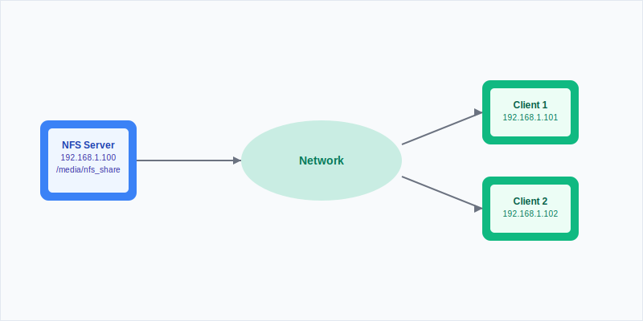

Network File System (NFS) is one of the most efficient ways to share files across Linux machines on your network. I run it on my N100 mini PC that hosts Jellyfin and handles backups for everything on my network. It lets me access media files, backups, and documents from any Linux machine.

This guide covers the basics through to advanced mounting options.

## What is NFS and Why Use It?

<Notice type="info" title="Understanding NFS">
Network File System (NFS) is a protocol that lets you access files over a network the same way you access local storage. It works well in Linux environments.
</Notice>

### Key Benefits of NFS

<ListCheck>
- **Native Linux Support**: Built into all major distributions
- **High Performance**: Optimized for Unix-like systems with minimal overhead
- **Scalability**: Handles multiple concurrent connections
- **Flexibility**: Supports various mount options and security configurations
- **Cost-Effective**: Open source with no licensing fees
</ListCheck>

### NFS vs Other Protocols

| Protocol | Best For | Performance | Security | Complexity |
|----------|----------|-------------|----------|------------|
| NFS | Linux-only environments | High | Moderate | Low |
| SMB/CIFS | Mixed Windows/Linux | Moderate | High | Moderate |
| FTP | File transfers | Low | Variable | Low |
| SSH/SFTP | Secure transfers | Moderate | High | High |

## Prerequisites and Planning

Before starting, make sure you have:

<ListCheck>
- **Two or more Linux machines** (server and clients)
- **Root or sudo access** on all machines
- **Network connectivity** between devices
- **Static IP addresses** (this saves headaches later)
- **Firewall configuration** knowledge
</ListCheck>

### Network Architecture Overview




## Step 1: Setting Up the NFS Server

### Install NFS Server Package

Update your system and install the NFS kernel server:

```bash
sudo apt update && sudo apt install nfs-kernel-server -y
```

For CentOS/RHEL systems:

```bash
sudo yum install nfs-utils -y
# or for newer versions
sudo dnf install nfs-utils -y
```

### Create the Shared Directory

Set up a directory structure for your NFS shares. I organize by purpose:

```bash
# Create main NFS directory
sudo mkdir -p /srv/nfs

# Create specific share directories
sudo mkdir -p /srv/nfs/media
sudo mkdir -p /srv/nfs/backups
sudo mkdir -p /srv/nfs/documents
```

<Notice type="warning" title="Directory Location">
Using `/srv/nfs` follows Linux filesystem standards. Don't use `/media` or `/mnt` for NFS exports since these are reserved for temporary mounts.
</Notice>

### Configure Permissions

Set ownership and permissions:

```bash
# Set ownership to nobody:nogroup for security
sudo chown -R nobody:nogroup /srv/nfs

# Set permissions (755 for directories, 644 for files)
sudo chmod -R 755 /srv/nfs
```

### Configure NFS Exports

The `/etc/exports` file defines which directories are shared and with what permissions:

```bash
sudo nano /etc/exports
```

Add your export configurations:

```bash
# Basic configuration for local network
/srv/nfs/media    192.168.1.0/24(rw,sync,no_subtree_check,no_root_squash)
/srv/nfs/backups  192.168.1.0/24(rw,sync,no_subtree_check,root_squash)
/srv/nfs/documents 192.168.1.101(rw,sync,no_subtree_check) 192.168.1.102(ro,sync,no_subtree_check)
```

### Export Options Explained

| Option | Description | Use Case |
|--------|-------------|----------|
| `rw` | Read-write access | Full access for trusted clients |
| `ro` | Read-only access | Sharing read-only content |
| `sync` | Synchronous writes | Data integrity (recommended) |
| `async` | Asynchronous writes | Better performance, less safe |
| `no_subtree_check` | Disable subtree checking | Improved reliability |
| `root_squash` | Map root to anonymous user | Security (default) |
| `no_root_squash` | Allow root access | Administrative access |
| `all_squash` | Map all users to anonymous | Maximum security |

### Apply Export Configuration

After configuring exports, apply the changes:

```bash
# Export the file systems
sudo exportfs -a

# Restart NFS services
sudo systemctl restart nfs-kernel-server
sudo systemctl enable nfs-kernel-server
```

### Configure Firewall

Allow NFS traffic through the firewall:

```bash
# For UFW (Ubuntu)
sudo ufw allow from 192.168.1.0/24 to any port nfs

# For firewalld (CentOS/RHEL)
sudo firewall-cmd --permanent --add-service=nfs
sudo firewall-cmd --reload
```

## Step 2: Setting Up NFS Clients

### Install NFS Client Package

On client machines, install the NFS utilities:

```bash
sudo apt update && sudo apt install nfs-common -y
```

### Create Mount Points

Create directories where NFS shares will be mounted:

```bash
# Create mount points
sudo mkdir -p /mnt/server-media
sudo mkdir -p /mnt/server-backups
sudo mkdir -p /mnt/server-docs
```

### Test Manual Mounting

Before setting up automatic mounting, test the connection:

```bash
# Mount the media share
sudo mount -t nfs 192.168.1.100:/srv/nfs/media /mnt/server-media

# Verify the mount
df -h | grep nfs
ls -la /mnt/server-media
```

<Notice type="success" title="Verification">
If the NFS mount appears in `df -h` output and you can access files in the mounted directory, the basic setup works.
</Notice>

### Configure Permanent Mounting

Edit `/etc/fstab` for automatic mounting on boot:

```bash
sudo nano /etc/fstab
```

Add entries for your NFS shares:

```bash
# NFS mounts
192.168.1.100:/srv/nfs/media    /mnt/server-media    nfs    defaults,_netdev    0    0
192.168.1.100:/srv/nfs/backups  /mnt/server-backups  nfs    defaults,_netdev    0    0
192.168.1.100:/srv/nfs/documents /mnt/server-docs    nfs    defaults,_netdev,ro 0    0
```

### Mount Options for fstab

| Option | Description | Benefit |
|--------|-------------|---------|
| `_netdev` | Network device | Waits for network before mounting |
| `soft` | Soft mount | Returns error if server unavailable |
| `hard` | Hard mount | Retries indefinitely (default) |
| `intr` | Interruptible | Allows process interruption |
| `rsize=8192` | Read buffer size | Optimizes read performance |
| `wsize=8192` | Write buffer size | Optimizes write performance |

Test the fstab configuration:

```bash
# Test mounting all fstab entries
sudo mount -a

# Verify mounts
mount | grep nfs
```

## Step 3: Advanced Configuration Options

### Using AutoFS for On-Demand Mounting

AutoFS handles automatic mounting and unmounting, which helps when the NFS server isn't always available.

Install AutoFS:

```bash
sudo apt install autofs -y
```

Configure the master map:

```bash
sudo nano /etc/auto.master
```

Add this line:

```bash
/mnt/auto /etc/auto.nfs --timeout=60 --ghost
```

Create the AutoFS map file:

```bash
sudo nano /etc/auto.nfs
```

Configure your auto-mounts:

```bash
media     -fstype=nfs4,rw,soft,intr  192.168.1.100:/srv/nfs/media
backups   -fstype=nfs4,rw,soft,intr  192.168.1.100:/srv/nfs/backups
documents -fstype=nfs4,ro,soft,intr  192.168.1.100:/srv/nfs/documents
```

Start and enable AutoFS:

```bash
sudo systemctl restart autofs
sudo systemctl enable autofs
```

### Performance Optimization

For better performance with large files or heavy traffic:

```bash
# Add to /etc/fstab for optimized performance
192.168.1.100:/srv/nfs/media /mnt/server-media nfs rsize=32768,wsize=32768,hard,intr,_netdev 0 0
```

### Security Enhancements

#### Using NFSv4 with Kerberos

For better security in production environments:

```bash
# On server: Install Kerberos
sudo apt install krb5-kdc krb5-admin-server -y

# Configure NFSv4 security
echo "Domain = your-domain.com" | sudo tee -a /etc/idmapd.conf
```

#### Restricting Access by IP Range

Modify `/etc/exports` for tighter security:

```bash
# More restrictive access
/srv/nfs/media 192.168.1.100/32(rw,sync,no_subtree_check) 192.168.1.101/32(ro,sync,no_subtree_check)
```

## Step 4: Monitoring and Maintenance

### Checking NFS Status

Monitor your NFS setup:

```bash
# Check NFS server status
sudo systemctl status nfs-kernel-server

# View active exports
sudo exportfs -v

# Show NFS statistics
nfsstat -s  # Server stats
nfsstat -c  # Client stats

# Monitor active connections
sudo ss -tuln | grep :2049
```

### Log Analysis

NFS logs are typically found in:

```bash
# Check NFS logs
sudo journalctl -u nfs-kernel-server
sudo tail -f /var/log/syslog | grep nfs
```

### Performance Monitoring

Create a simple monitoring script:

```bash
#!/bin/bash
# nfs-monitor.sh

echo "=== NFS Performance Monitor ==="
echo "Date: $(date)"
echo

echo "Active NFS Mounts:"
df -h | grep nfs
echo

echo "NFS Server Statistics:"
nfsstat -s | head -10
echo

echo "Network Connections:"
sudo ss -tuln | grep :2049
```

## Troubleshooting Common Issues

### Connection Problems

<Notice type="error" title="Common Error: Connection Refused">
This usually means firewall issues or NFS services aren't running.
</Notice>

**Solution checklist:**

<ListCheck>
- **Verify NFS services are running**: `sudo systemctl status nfs-kernel-server`
- **Check firewall rules**: ports 2049, 111, and related ports should be open
- **Test network connectivity**: `ping` between server and client
- **Verify exports**: `sudo exportfs -v` on server
</ListCheck>

### Permission Issues

```bash
# Fix ownership issues
sudo chown -R nobody:nogroup /srv/nfs

# Check export permissions
sudo exportfs -v | grep your-share
```

### Performance Issues

For slow NFS performance:

1. **Adjust buffer sizes**:
   ```bash
   # In /etc/fstab
   rsize=32768,wsize=32768
   ```

2. **Use async for non-critical data**:
   ```bash
   # In /etc/exports
   /srv/nfs/temp *(rw,async,no_subtree_check)
   ```

3. **Monitor network utilization**:
   ```bash
   iftop -i eth0
   ```

## Integration with Home Server Setup

NFS works well with other home server technologies. Here's how I use it:

### Media Server Integration

For Jellyfin and other media servers:

```bash
# Media directory structure
/srv/nfs/media/
├── movies/
├── tv-shows/
├── music/
└── photos/
```

This structure lets the N100 mini PC serve media files efficiently across the network.

### Backup Strategy

Combined with the [LVM setup](https://www.bitdoze.com/add-new-drive-lvm/) from my previous article:

```bash
# Backup scripts can now target NFS shares
rsync -av /home/user/documents/ /mnt/server-backups/user-docs/
```

### Container Integration

When running [Docker containers](https://www.bitdoze.com/docker-containers-home-server/):

```yaml
# docker-compose.yml
version: '3'
services:
  jellyfin:
    image: jellyfin/jellyfin
    volumes:
      - /mnt/server-media:/media:ro
      - ./config:/config
```

## Best Practices and Security Considerations

### Security Best Practices

<ListCheck>
- **Use NFSv4** when possible for better security
- **Set firewall rules** to restrict access to trusted networks
- **Keep both server and clients updated**
- **Check access logs** for suspicious activity
- **Use root_squash** by default unless you need otherwise
</ListCheck>

### Backup Considerations

<Notice type="warning" title="Backup Strategy">
NFS shares should be part of your backup strategy. Back up the shared data on the server side to prevent data loss.
</Notice>

### Network Considerations

- **Use wired connections** when possible for better performance
- **Set up network monitoring** as discussed in [server monitoring](https://www.bitdoze.com/sever-monitoring/)
- **Consider network segmentation** for security

## Conclusion

NFS on Linux gives you solid file sharing across your network. I run it on my N100 mini PC alongside Jellyfin, and it handles everything I throw at it.

Start with a basic setup. Get that working first, then add AutoFS and performance tuning as you need them.

For more on home servers and Linux, see my articles on [best mini PCs for home servers](https://www.bitdoze.com/best-mini-pc-home-server/) and [Docker containers for home servers](https://www.bitdoze.com/docker-containers-home-server/).

<Button text="Start Building Your NFS Setup" size="lg" color="blue" variant="solid" />
