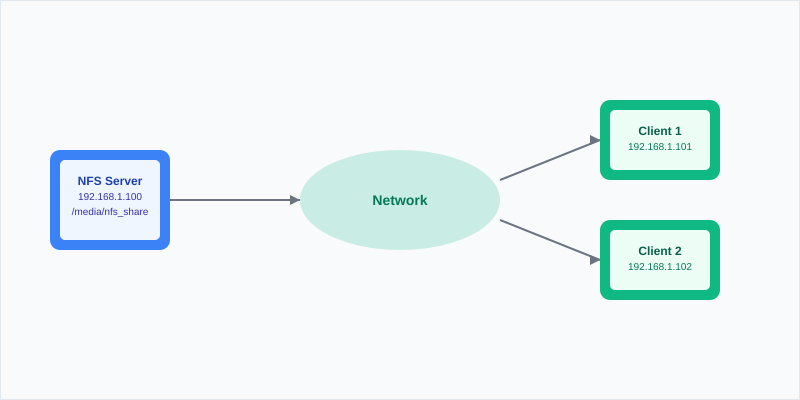

import Button from "@components/widgets/Button.astro";
import Notice from "@components/widgets/Notice.astro";
import ListCheck from "@components/widgets/ListCheck.astro";
import Tabs from "@components/widgets/Tabs.astro";
import Tab from "@components/widgets/Tab.astro";

I run NFS on my N100 mini PC. It serves Jellyfin media, handles backups for every machine on my network, and stores shared documents. This NFS Linux setup guide walks you through configuring an NFS server and mounting shares on Linux clients, from a basic working setup through to NFSv4.2 lockdown, systemd automount, and container integration.

NFSv4.2 is the default on modern Linux clients (they negotiate 4.2 first), so this guide locks it in from the start. NFS is free, kernel-built-in, and the most efficient way to share files across a Linux-only home network. If you're still shopping for hardware, check the [best mini PCs for home servers](https://www.bitdoze.com/best-mini-pc-home-server/).

## What is NFS and why use it?

<Notice type="info" title="Understanding NFS">
Network File System (NFS) is a protocol that lets you access files over a network the same way you access local storage. NFSv4.2 is the current standard. It adds sparse-file operations, server-side copy, and space reservation. All major Linux distributions ship with NFS support built into the kernel.
</Notice>

### Key benefits of NFS

<ListCheck>
- **Native Linux support**: Built into all major distributions, no extra software to install on clients beyond `nfs-common`
- **High performance**: Kernel-level implementation with minimal overhead; modern clients negotiate 1 MiB read/write buffers automatically
- **Scalability**: Handles multiple concurrent connections; tune server threads for heavier loads
- **Flexibility**: Supports various mount options, security configurations, and automount strategies
- **Cost-effective**: Open source with no licensing fees, the real costs are hardware and electricity
</ListCheck>

### NFS vs SMB: which file-sharing protocol should you use?

| Protocol | Best for | Performance | Security | Complexity |
|----------|----------|-------------|----------|------------|
| NFS | Linux-only environments | High (kernel-level) | Moderate (IP-based trust) | Low |
| SMB/CIFS | Mixed Windows/Linux | Moderate | High (user auth) | Moderate |
| FTP | Legacy file transfers | Low | Variable | Low |
| SSH/SFTP | Secure one-off transfers | Moderate | High | High |
| WebDAV | HTTP-based file access | Moderate | Moderate | Moderate |

**Recommendation:** Use NFS for Linux-only home networks. It's faster and simpler than SMB. For mixed Windows/Linux environments, use SMB/CIFS. See [how to set up Samba for mixed Windows/Linux networks](https://www.bitdoze.com/setup-samba-linux/). For HTTP-based file access, check [our WebDAV on Nginx guide](https://www.bitdoze.com/setup-webdav-nginx/).

## Prerequisites and network planning

Before starting, make sure you have:

<ListCheck>
- **Two or more Linux machines** (server and one or more clients)
- **Root or sudo access** on all machines
- **Network connectivity** between devices on the same LAN
- **Static IP addresses** on server and clients (saves headaches later)
- **Firewall configuration** knowledge for your distro (UFW or firewalld)
</ListCheck>

<Notice type="warning" title="Never expose NFS to the internet">
NFS has no user authentication. It trusts IP addresses. Never expose NFS ports to the public internet. If you need NFS across remote networks, tunnel it through a VPN like WireGuard. Consider [self-hosting your own Tailscale control server with Headscale](https://www.bitdoze.com/headscale-self-hosted-tailscale-setup/) for a managed VPN mesh.
</Notice>

### Network architecture overview



## Step 1: Set up the NFS server on Linux

### Install the NFS server package

<Tabs>
<Tab name="Ubuntu/Debian">
```bash
sudo apt update && sudo apt install nfs-kernel-server -y
```
Ubuntu 24.04 ships nfs-utils 2.6.4. The service name is `nfs-kernel-server`.
</Tab>
<Tab name="RHEL/Fedora">
```bash
sudo dnf install nfs-utils -y
```
On older CentOS systems use `yum install nfs-utils -y`. The service name is `nfs-server`.
</Tab>
</Tabs>

### Create shared directories

Set up a directory structure for your NFS shares. I organize by purpose:

```bash
# Create main NFS directory (FHS-compliant location)
sudo mkdir -p /srv/nfs

# Create specific share directories
sudo mkdir -p /srv/nfs/media
sudo mkdir -p /srv/nfs/backups
sudo mkdir -p /srv/nfs/documents
```

<Notice type="warning" title="Directory location">
Using `/srv/nfs` follows Linux filesystem hierarchy standards. Don't use `/media` or `/mnt` for NFS exports. Those are reserved for temporary mounts.
</Notice>

### Configure permissions and understand UID/GID mapping

Set ownership and permissions:

```bash
# Set ownership to nobody:nogroup for security
sudo chown -R nobody:nogroup /srv/nfs

# Set permissions (755 for directories)
sudo chmod -R 755 /srv/nfs
```

<Notice type="warning" title="The UID/GID write trap">
This is the #1 "permission denied" surprise with NFS. With default `root_squash`, a client root user gets mapped to `nobody` (UID 65534). Since `nobody` owns the share, root clients can write. But a normal client user (e.g. UID 1000) becomes "others" with `r-x` permissions and **cannot write**.

NFS uses AUTH_SYS, which trusts client-supplied UIDs. The server and client must agree on UIDs/GIDs, or you need to map them explicitly.
</Notice>

<Notice type="info" title="Fixing permissions for normal users">
Two approaches to let normal users write:

**1. Match UIDs across machines:** Create the same user with the same UID on both server and clients, then `chown` the share to that user.

**2. Use `all_squash` with explicit UID/GID:** Map all client users to one UID/GID on the server:
```bash
# In /etc/exports, squash everyone to UID 1000, GID 1000
/srv/nfs/media  192.168.1.0/24(rw,sync,no_subtree_check,all_squash,anonuid=1000,anongid=1000)
```
This is the simplest approach for home networks where all clients trust each other.
</Notice>

### Configure NFS exports in /etc/exports

The `/etc/exports` file defines which directories are shared and with what permissions:

```bash
sudo nano /etc/exports
```

Add your export configurations:

```bash
# Media share, read-write for the whole LAN (root_squash is the default)
/srv/nfs/media     192.168.1.0/24(rw,sync,no_subtree_check)

# Backup share, read-write for the whole LAN
/srv/nfs/backups   192.168.1.0/24(rw,sync,no_subtree_check)

# Documents, read-write for one machine, read-only for another
/srv/nfs/documents 192.168.1.101(rw,sync,no_subtree_check) 192.168.1.102(ro,sync,no_subtree_check)

# Container share, squash all users to UID/GID 1000
/srv/nfs/appdata   192.168.1.0/24(rw,sync,no_subtree_check,all_squash,anonuid=1000,anongid=1000)

# Optional: NFSv4 root export (lets clients mount server:/media instead of server:/srv/nfs/media)
/srv/nfs           192.168.1.0/24(rw,sync,no_subtree_check,fsid=0,crossmnt)
```

<Notice type="error" title="Avoid no_root_squash">
Do not use `no_root_squash` unless you have a specific reason (like diskless clients). With `no_root_squash`, a remote root user can change any file on the share and plant trojaned or setuid binaries. The Red Hat Security Guide explicitly warns against it. `root_squash` is the default, rely on it.
</Notice>

### Export options explained

| Option | Description | Use case |
|--------|-------------|----------|
| `rw` | Read-write access | Full access for trusted clients |
| `ro` | Read-only access | Sharing read-only content |
| `sync` | Synchronous writes | Data integrity (default since nfs-utils 1.0.0) |
| `async` | Asynchronous writes | Better performance on spinning disks, but risks data loss on crash |
| `no_subtree_check` | Disable subtree checking | Improved reliability (default since nfs-utils 1.1.0) |
| `root_squash` | Map root to anonymous user | Security (default, always use this) |
| `no_root_squash` | Allow root access | Diskless clients only, security risk on shared networks |
| `all_squash` | Map all users to anonymous | Maximum security or container shares |
| `anonuid` | Set anonymous UID | Use with `all_squash` to control ownership |
| `anongid` | Set anonymous GID | Use with `all_squash` to control group ownership |
| `fsid=0` | NFSv4 root export | Lets clients mount shorter paths |
| `crossmnt` | Follow mount points | Required with `fsid=0` for subdirectories |

### Apply exports and start the service

After configuring exports, apply the changes live, no service restart needed:

```bash
# Apply exports (re-exports all directories, re-reads /etc/exports)
sudo exportfs -arv
```

Expected output:
```
exporting 192.168.1.0/24:/srv/nfs/media
exporting 192.168.1.0/24:/srv/nfs/backups
exporting 192.168.1.101:/srv/nfs/documents
exporting 192.168.1.102:/srv/nfs/documents
```

Enable the service so it starts on boot:

```bash
sudo systemctl enable --now nfs-kernel-server
```

Verify active exports:

```bash
sudo exportfs -v
```

You should see each share listed with its options (rw, sync, no_subtree_check, root_squash).

### Configure the firewall

NFSv4 needs **only TCP port 2049**. The old ports 111 (rpcbind), mountd, statd, and lockd are NFSv2/v3-era, you don't need them if you're running NFSv4-only.

<Tabs>
<Tab name="UFW (Ubuntu/Debian)">
```bash
sudo ufw allow from 192.168.1.0/24 to any port 2049 proto tcp
sudo ufw reload
```
</Tab>
<Tab name="firewalld (RHEL/Fedora)">
```bash
sudo firewall-cmd --permanent --add-service=nfs
sudo firewall-cmd --reload
```
Only add `nfs3`, `mountd`, and `rpc-bind` services if you still run NFSv3.
</Tab>
</Tabs>

Verify the port is listening:

```bash
sudo ss -tuln | grep :2049
```

### Lock down to NFSv4 and tune the server

<Notice type="info" title="Ubuntu 22.04+ uses /etc/nfs.conf">
On Ubuntu 22.04+, Debian 12+, and modern distros, NFS configuration uses `/etc/nfs.conf` (INI format). The old `/etc/default/nfs-kernel-server` `NEED_*` flags have no effect on systemd-based installations.
</Notice>

Edit `/etc/nfs.conf` to disable older NFS versions and tune the server:

```bash
sudo nano /etc/nfs.conf
```

Add or update the `[nfsd]` section:

```ini
[nfsd]
# Disable NFSv2 and NFSv3, NFSv4 only
vers3=n
# Optional: disable NFSv4.0 and 4.1 if you only need 4.2
vers4.0=n
vers4.1=n
# Increase worker threads (default is 8; raise for multiple clients)
threads=16
# Bind to LAN IP only (replace with your server's IP)
host=192.168.1.100
```

Restart the NFS server to apply:

```bash
sudo systemctl restart nfs-kernel-server
```

Verify the enabled versions:

```bash
cat /proc/fs/nfsd/versions
```

Expected output:
```
-2 -3 +4 +4.1 +4.2
```

Query the effective configuration:

```bash
sudo nfsconf --dump
```

On a v4-only server, you can mask rpcbind since NFSv4 doesn't use it:

```bash
sudo systemctl mask rpcbind.service rpcbind.socket
```

Note: masking rpcbind breaks `showmount -e` on the server. Unmask if you need it.

## Step 2: Mount NFS shares on Linux clients

### Install the NFS client package

On client machines:

```bash
sudo apt update && sudo apt install nfs-common -y
```

For RHEL/Fedora clients:

```bash
sudo dnf install nfs-utils -y
```

### Verify the server exports

Before mounting, verify the server is reachable and exports are visible:

```bash
# List exports from the server
showmount -e 192.168.1.100
```

Expected output:
```
Export list for 192.168.1.100:
/srv/nfs        192.168.1.0/24
/srv/nfs/media  192.168.1.0/24
/srv/nfs/backups 192.168.1.0/24
```

Note: if you masked rpcbind on the server, `showmount` may fail, that's OK. The mount itself uses port 2049 directly.

### Create mount points and test a manual NFS mount

```bash
# Create mount points
sudo mkdir -p /mnt/server-media
sudo mkdir -p /mnt/server-backups
sudo mkdir -p /mnt/server-docs
```

Test a manual mount:

```bash
sudo mount -t nfs 192.168.1.100:/srv/nfs/media /mnt/server-media
```

Verify the mount:

```bash
df -h | grep nfs
ls -la /mnt/server-media
```

<Notice type="success" title="Verification">
If the NFS mount appears in `df -h` output and you can list files in the mounted directory, the basic setup works. Check the negotiated NFS version and buffer sizes:
```bash
grep server-media /proc/mounts
```
You should see `nfsvers=4.2` and `rsize=1048576,wsize=1048576` (1 MiB, the modern default).
</Notice>

### Persistent NFS mounts with /etc/fstab

Edit `/etc/fstab` for automatic mounting on boot:

```bash
sudo nano /etc/fstab
```

<Tabs>
<Tab name="Always-on mount">
Use this when the NFS server is always available (e.g., same machine as your router or always-on NAS):

```bash
# NFS mounts, always-on
192.168.1.100:/srv/nfs/media     /mnt/server-media    nfs  _netdev,nfsvers=4.2,hard,timeo=600,retrans=2  0 0
192.168.1.100:/srv/nfs/backups   /mnt/server-backups  nfs  _netdev,nfsvers=4.2,hard,timeo=600,retrans=2  0 0
192.168.1.100:/srv/nfs/documents /mnt/server-docs     nfs  _netdev,nfsvers=4.2,hard,timeo=600,retrans=2,ro  0 0
```
</Tab>
<Tab name="On-demand automount">
Use this when the NFS server might not be running at boot, prevents boot hangs and unmounts after idle:

```bash
# NFS mounts, on-demand automount via systemd
192.168.1.100:/srv/nfs/media     /mnt/server-media    nfs  _netdev,noauto,x-systemd.automount,x-systemd.mount-timeout=30,x-systemd.idle-timeout=10min,nfsvers=4.2,hard,timeo=600,retrans=2  0 0
192.168.1.100:/srv/nfs/backups   /mnt/server-backups  nfs  _netdev,noauto,x-systemd.automount,x-systemd.mount-timeout=30,x-systemd.idle-timeout=10min,nfsvers=4.2,hard,timeo=600,retrans=2  0 0
192.168.1.100:/srv/nfs/documents /mnt/server-docs     nfs  _netdev,noauto,x-systemd.automount,x-systemd.mount-timeout=30,x-systemd.idle-timeout=10min,nfsvers=4.2,hard,timeo=600,retrans=2,ro  0 0
```
</Tab>
</Tabs>

After editing fstab, reload systemd and test:

```bash
sudo systemctl daemon-reload
sudo mount -a
mount | grep nfs
```

### Mount options explained

| Option | Description | Notes |
|--------|-------------|-------|
| `_netdev` | Network device | Waits for network before mounting (implied for nfs by systemd, but safe to include) |
| `nfsvers=4.2` | Pin NFS version | Modern default; client negotiates 4.2 first anyway, but pinning avoids surprises |
| `hard` | Hard mount | Retries indefinitely on server failure, **recommended for data integrity** |
| `soft` | Soft mount | Returns error after timeout, see warning below |
| `timeo=600` | Timeout in tenths of seconds | 60 seconds; good default for LAN |
| `retrans=2` | Number of retries | 2 retries before reporting error |
| `nconnect=4` | Multiple TCP connections | Higher throughput on modern NICs (1 to 16, default 1) |
| `noauto` | Don't mount at boot | Used with `x-systemd.automount` |
| `x-systemd.automount` | systemd automount | Mounts on first access, unmounts after idle |
| `x-systemd.mount-timeout=30` | Mount timeout | Seconds to wait for mount |
| `x-systemd.idle-timeout=10min` | Idle timeout | Unmounts after this period of inactivity |

<Notice type="warning" title="soft mounts can corrupt data">
From the nfs(5) man page: "A so-called 'soft' timeout can cause silent data corruption in certain cases. Use the soft or softerr option only when client responsiveness is more important than data integrity."

Use `hard` for backup and document shares. `soft` is acceptable for read-only media shares where a timeout is preferable to a hung process.
</Notice>

Note on rsize/wsize: modern kernels negotiate the maximum supported buffer size (1 MiB) automatically. **Do not** force `rsize=8192` or `rsize=32768`, this actually reduces throughput. Leave them unset and verify with `grep server-media /proc/mounts`.

### Automount NFS with systemd

The `x-systemd.automount` option shown above is the modern way to handle NFS mounts on single-host clients. It's simpler than AutoFS and prevents boot hangs when the NFS server is down.

Verify the automount unit is active:

```bash
systemctl status mnt-server\\x2dmedia.automount
```

Expected output should show `Active: active (waiting)`.

How it works: systemd creates an automount trigger at the mount point. The first time you access `/mnt/server-media`, systemd mounts the NFS share. After `x-systemd.idle-timeout` of inactivity, it unmounts automatically. If the NFS server is down at boot, the system boots normally, no hang.

Do **not** add `x-systemd.requires=network-online.target`, this causes systemd ordering cycles (per systemd.automount(5)). Keep fstab pass numbers at `0 0`, running fsck on NFS at boot can hang.

## Step 3: Advanced NFS configuration

### AutoFS for on-demand mounting

AutoFS is still valid for complex setups with multiple mount maps. Install it:

```bash
sudo apt install autofs -y
```

Configure the master map:

```bash
sudo nano /etc/auto.master
```

Add this line:

```bash
/mnt/auto /etc/auto.nfs --timeout=60 --ghost
```

Create the AutoFS map file:

```bash
sudo nano /etc/auto.nfs
```

Configure your auto-mounts:

```bash
media     -fstype=nfs,nfsvers=4.2,rw,hard,timeo=600   192.168.1.100:/srv/nfs/media
backups   -fstype=nfs,nfsvers=4.2,rw,hard,timeo=600   192.168.1.100:/srv/nfs/backups
documents -fstype=nfs,nfsvers=4.2,ro,hard,timeo=600   192.168.1.100:/srv/nfs/documents
```

Start and enable AutoFS:

```bash
sudo systemctl restart autofs
sudo systemctl enable autofs
```

Note: use `-fstype=nfs,nfsvers=4.2`, the old `-fstype=nfs4` syntax is deprecated per the nfs(5) man page.

### NFSv4.2 features and the root export

NFSv4.2 adds several features over 4.1:

- **Sparse file operations** (SEEK/HOLE): efficient handling of files with holes
- **Server-side copy/clone**: `copy_file_range()` works on the server, great for rsync and cp on the same share
- **Space reservation**: `fallocate()` support
- **Labeled NFS**: security labels for mandatory access control

The `fsid=0` root export shown earlier lets clients mount shorter paths. With this export:

```bash
# Instead of:
sudo mount -t nfs 192.168.1.100:/srv/nfs/media /mnt/server-media

# You can mount:
sudo mount -t nfs 192.168.1.100:/media /mnt/server-media
```

The `crossmnt` option follows mount points within the export. Without it, subdirectories that are separate filesystems (like LVM volumes) won't be visible.

### Performance tuning

<Notice type="info" title="Modern defaults are fast">
Modern Linux kernels negotiate 1 MiB read/write buffers automatically. Forcing lower values (like the old `rsize=8192` advice) actually reduces throughput. Leave rsize/wsize unset unless you have a specific reason to limit them.
</Notice>

**Multi-connection TCP (`nconnect`):** For higher single-client throughput on modern NICs, add `nconnect=4` (up to 16) to your mount options:

```bash
192.168.1.100:/srv/nfs/media /mnt/server-media nfs _netdev,nfsvers=4.2,hard,timeo=600,retrans=2,nconnect=4  0 0
```

Note: `nconnect` is set at first mount and cannot be changed without remounting.

**Server threads:** The default is 8 nfsd worker threads. For multiple clients, raise to 16 or higher in `/etc/nfs.conf`:

```ini
[nfsd]
threads=16
```

**Async exports:** Using `async` instead of `sync` in `/etc/exports` can improve performance on spinning disks, but risks data loss if the server crashes. Only use it for non-critical data like media caches.

### Secure NFS with Kerberos, TLS, and VPNs

<Notice type="warning" title="NFS has no user authentication">
Plain NFS (AUTH_SYS) trusts client-supplied UIDs and IP addresses. There is no user authentication, any machine on the allowed network can claim any UID. This is why you should never expose NFS to the public internet.
</Notice>

**Kerberos:** For real authentication and encryption, NFS supports `sec=krb5`, `sec=krb5i` (integrity), and `sec=krb5p` (privacy). This requires a Kerberos KDC, `nfs/<server-fqdn>` principal, keytab extraction, and `gssproxy`/`rpc-gssd` setup on both server and clients. It's the right choice for production environments but complex for home networks. See [Ubuntu's official NFS with Kerberos guide](https://ubuntu.com/server/docs/how-to/networking/install-nfs/) for the full procedure.

**NFS-over-TLS:** Available since Linux kernel 6.4 (RFC 9289, RPC-with-TLS). Requires `ktls-utils`/`tlshd` and certificates. RHEL 9.6+ officially supports it. Still maturing for general use.

**WireGuard VPN (recommended for home networks):** The simplest way to secure NFS across untrusted networks. Run NFS inside a WireGuard tunnel, all traffic is encrypted, and only VPN peers can reach port 2049. If you need a cheap VPS as a WireGuard relay or offsite backup node, [Hetzner Cloud VPS](https://go.bitdoze.com/hetzner) starts at a few euros per month in EU datacenters.

_VPS prices jumped across the board in 2026 — if you're rethinking a rented box, see [what changed and when a mini PC wins](/vps-price-increases/)._

### Container UID/GID mapping

When running Docker containers that access NFS shares, you need to match the container's UID to the export's ownership.

**Using `all_squash` with PUID/PGID:**

Export with explicit UID/GID:
```bash
/srv/nfs/appdata  192.168.1.0/24(rw,sync,no_subtree_check,all_squash,anonuid=1000,anongid=1000)
```

For linuxserver.io images (Jellyfin, Plex, etc.), set `PUID=1000` and `PGID=1000` to match.

**Named NFS volume in Docker Compose:**

```yaml
services:
  jellyfin:
    image: jellyfin/jellyfin
    volumes:
      - media:/media:ro
      - ./config:/config

volumes:
  media:
    driver: local
    driver_opts:
      type: nfs
      o: addr=192.168.1.100,rw,nfsvers=4.2,hard,timeo=600,retrans=2
      device: ":/srv/nfs/media"
```

This is better than a host bind-mount because the named volume survives multi-host setups and the NFS options are declared in the compose file.

## Step 4: Monitor and maintain NFS

### Check NFS status and exports

```bash
# Check NFS server status
sudo systemctl status nfs-kernel-server

# View active exports with options
sudo exportfs -v

# Check active connections on port 2049
sudo ss -tuln | grep :2049
```

### NFS statistics and logs

```bash
# Server statistics
nfsstat -s

# Client statistics
nfsstat -c

# Real-time I/O statistics (install nfs-common if not present)
nfsiostat 1

# NFS-related kernel messages
dmesg | grep -i nfs

# Server logs
sudo journalctl -u nfs-kernel-server

# Verify effective server configuration
sudo nfsconf --dump
```

### Stay patched: recent NFS CVEs

<Notice type="warning" title="Keep NFS updated">
Two notable CVEs from 2025 to 2026 affect NFS:

**CVE-2025-12801** (rpc.mountd, CVSS 6.5): An NFSv3 client can access any subtree of an exported directory regardless of permissions and regardless of `root_squash`/`all_squash`. Running NFSv4-only avoids this entirely since NFSv4 doesn't use rpc.mountd.

**CVE-2025-38571** (NFS-over-TLS client, CVSS 5.5): A remote NFS server can crash the client via a crafted TLS alert. Only affects NFS-over-TLS configurations.

Keep `nfs-utils` and your kernel updated. Running NFSv4-only (disabling v2/v3) eliminates the rpc.mountd attack surface.
</Notice>

## Troubleshooting common NFS issues

### Connection refused

<Notice type="error" title="Common error: Connection refused">
This usually means the firewall is blocking port 2049 or the NFS service isn't running.
</Notice>

**Fix checklist:**

<ListCheck>
- **Verify NFS services are running**: `sudo systemctl status nfs-kernel-server`
- **Check firewall rules**: only TCP 2049 is needed for NFSv4, see [checking remote ports with the nc command](https://www.bitdoze.com/check-remote-port-in-linux-nc/)
- **Test network connectivity**: `ping 192.168.1.100` between server and client
- **Verify exports**: `sudo exportfs -v` on server
- **Check if rpcbind is masked**: if you masked rpcbind for NFSv4-only, `showmount` will fail but mounts should still work
</ListCheck>

### mount.nfs: access denied by server

**Symptom:** `mount.nfs: access denied by server` when trying to mount.

**Cause:** Export syntax error, IP/subnet mismatch, or the client's IP isn't in the export list.

**Fix:**
```bash
# On the server, check what's actually exported
sudo exportfs -v

# Verify /etc/exports syntax (no missing parentheses, correct IPs)
cat /etc/exports

# Re-apply after fixing
sudo exportfs -arv
```

### Permission denied (UID/GID mapping)

**Symptom:** You can mount the share but get "Permission denied" when writing.

**Cause:** The classic UID/GID mismatch. With `nobody:nogroup` ownership and `chmod 755`, a normal user (UID 1000) on the client becomes "others" with read+execute only.

**Fix:**
```bash
# Check your UID on the client
id

# Option 1: Match UIDs, create the same user on the server
sudo useradd -u 1000 myuser

# Option 2: Use all_squash in /etc/exports
/srv/nfs/media  192.168.1.0/24(rw,sync,no_subtree_check,all_squash,anonuid=1000,anongid=1000)
sudo exportfs -arv
```

### Stale file handle

**Symptom:** `Stale file handle` error when accessing files.

**Cause:** The server filesystem was replaced (LVM snapshot restore, btrfs rollback) or the export was removed and recreated while clients had it mounted.

**Fix:**
```bash
# On the client, lazy unmount and remount
sudo umount -l /mnt/server-media
sudo mount -a
```

### Protocol not supported

**Symptom:** `mount.nfs: Protocol not supported`

**Cause:** NFS version mismatch, the client requests a version the server doesn't support (or vice versa).

**Fix:**
```bash
# Check supported versions on the server
cat /proc/fs/nfsd/versions

# Explicitly set the version in fstab
nfsvers=4.2
```

### Slow performance or boot hangs

**Boot hangs:** The NFS server isn't reachable at boot and the mount blocks. Fix: use `x-systemd.automount` or add `nofail` to fstab options.

**Slow performance:**
```bash
# Check negotiated buffer sizes and version
grep server-media /proc/mounts

# Try adding nconnect for parallel TCP connections
# In /etc/fstab: add nconnect=4

# Real-time I/O stats
nfsiostat 1
```

## NFS in a home server setup

### Media server directory structure

```bash
/srv/nfs/media/
├── movies/
├── tv-shows/
├── music/
└── photos/
```

This structure works well with Jellyfin, Plex, or Emby. The N100 mini PC serves these files across the network, any machine with an NFS mount can access the full media library. If you're looking for a [compact mini PC for your home server](/go/gmktec-m5-ultra/), there are plenty of low-power options that handle NFS and Docker without breaking a sweat.

### Backup strategy with NFS

Combined with [adding a new drive to Ubuntu LVM](https://www.bitdoze.com/add-new-drive-lvm/) for storage expansion:

```bash
# Backup scripts can target NFS shares
rsync -av /home/user/documents/ /mnt/server-backups/user-docs/

# Exclude unnecessary files, see [excluding files and directories with rsync](https://www.bitdoze.com/exclude-directories-files-copy-remote-machine/)
rsync -av --exclude='.cache' --exclude='node_modules' /home/user/ /mnt/server-backups/user-home/
```

<Notice type="warning" title="NFS is not a backup">
A client `rm -rf` on an NFS mount is instant and permanent. NFS shares should be backed up on the server side to a separate location. Consider offsite or encrypted backups for critical data. The NFS server is also a single point of failure, there's no built-in HA (pNFS is beyond this guide's scope).
</Notice>

### Container integration with Docker

For running [Docker containers for a home server](https://www.bitdoze.com/docker-containers-home-server/) that need shared media:

```yaml
services:
  jellyfin:
    image: jellyfin/jellyfin
    environment:
      - PUID=1000
      - PGID=1000
    volumes:
      - media:/media:ro
      - ./config:/config
    ports:
      - 8096:8096

volumes:
  media:
    driver: local
    driver_opts:
      type: nfs
      o: addr=192.168.1.100,rw,nfsvers=4.2,hard,timeo=600,retrans=2
      device: ":/srv/nfs/media"
```

Match the `PUID`/`PGID` values to the `anonuid`/`anongid` in your exports if using `all_squash`.

## Best practices and security considerations

### Security best practices

<ListCheck>
- **Use NFSv4.2**, disable NFSv2/v3 in `/etc/nfs.conf` to eliminate rpc.mountd exposure
- **Use `root_squash`** by default (it's the default, don't override it)
- **Restrict exports by IP**, use `/32` for single clients or `/24` for the LAN
- **Firewall: TCP 2049 only**, NFSv4 doesn't need ports 111, mountd, or statd
- **Never expose NFS to the public internet**, use WireGuard for remote access
- **Keep nfs-utils and kernel patched**, watch for CVEs in rpc.mountd and sunrpc
- **Check logs** for suspicious activity with `journalctl -u nfs-kernel-server`
- **Consider Kerberos** for production environments where IP-based trust isn't enough
</ListCheck>

### Backup and redundancy

<Notice type="warning" title="NFS is not a backup">
The NFS server is a single point of failure. Back up shared data on the server side to a separate disk or offsite location. A client `rm -rf` on an NFS share is immediate, there's no trash, no undo. Plan your backup strategy accordingly.
</Notice>

### Network considerations

- **Use wired connections** when possible, NFS over WiFi works but is less reliable
- **Set up network monitoring**, see the [full server monitoring guide](https://www.bitdoze.com/sever-monitoring/)
- **Consider network segmentation** for security, isolate NFS traffic on a VLAN if your switch supports it
- **No encryption by default**, NFS traffic is plaintext on the wire. Use WireGuard if crossing untrusted networks

## Conclusion

NFS on Linux gives you fast, kernel-level file sharing across your network. I've been running it on my N100 mini PC alongside Jellyfin, and it handles media streaming, backups, and document sharing without issues.

Start with the basics: install `nfs-kernel-server`, set up `/etc/exports` with `root_squash`, and mount from your clients. Once that works, add systemd automount to prevent boot hangs and lock down to NFSv4-only for better security. The whole setup takes under 30 minutes.

For more on building out your home server, see [best mini PCs for home servers](https://www.bitdoze.com/best-mini-pc-home-server/), [Docker containers for a home server](https://www.bitdoze.com/docker-containers-home-server/), and [why you need a home server in 2026](https://www.bitdoze.com/why-need-home-server/).

<Button text="Start Building Your NFS Setup" size="lg" color="blue" variant="solid" />
