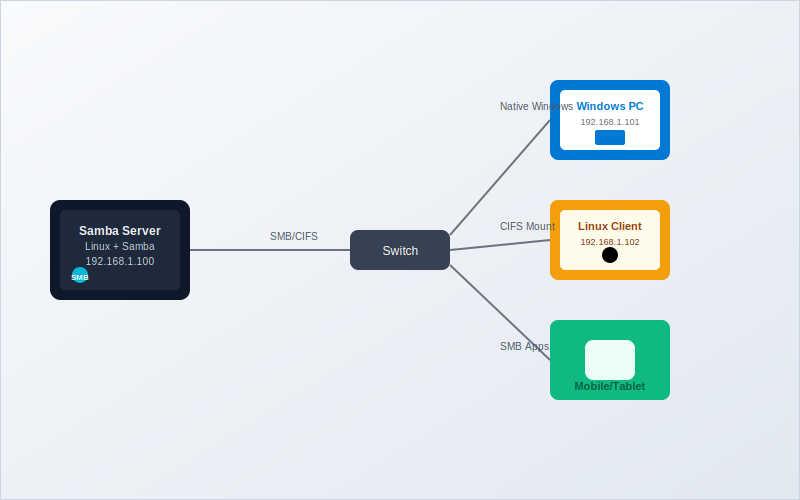

While [NFS is excellent for Linux-to-Linux file sharing](https://www.bitdoze.com/setup-nfs-linux/), many home server environments include a mix of operating systems. When you need to share files between Linux servers and Windows machines, or want broader compatibility across different platforms, Samba provides the perfect solution.

In my home setup with the N100 Intel mini PC running Jellyfin and handling backups, I use Samba alongside NFS to ensure all family devices - including Windows laptops, Android phones, and Linux machines - can seamlessly access shared media and documents. This dual approach gives me the best of both worlds: high-performance NFS for Linux systems and universal SMB compatibility for everything else.

This comprehensive guide will walk you through setting up Samba on Linux, from basic configuration to advanced security and performance optimization.

## Understanding SMB, CIFS, and Samba

<Notice type="info" title="Protocol Evolution">
SMB (Server Message Block) is the original protocol developed by Microsoft. CIFS (Common Internet File System) was Microsoft's enhanced version of SMB. Modern implementations use SMB2/SMB3 protocols, but the terms are often used interchangeably.
</Notice>

### What is Samba?

Samba is an open-source implementation of the SMB/CIFS protocol suite that enables Linux and Unix systems to communicate with Windows systems using native Windows networking protocols. It effectively turns your Linux machine into a Windows-compatible file server.

### Key Advantages of Samba

<ListCheck>
- **Cross-Platform Compatibility**: Works seamlessly with Windows, macOS, Linux, and mobile devices
- **Native Integration**: Appears as a standard network drive in Windows Explorer
- **Advanced Authentication**: Supports Active Directory integration and complex user management
- **Printer Sharing**: Can share printers across the network
- **Wide Device Support**: Compatible with smart TVs, media players, and IoT devices
</ListCheck>

### Samba vs NFS Comparison

| Feature | Samba (SMB/CIFS) | NFS |
|---------|------------------|-----|
| **Cross-Platform** | Excellent (Windows native) | Limited (Linux/Unix focus) |
| **Performance on Linux** | Good | Excellent |
| **Security Options** | Advanced (AD integration) | Basic to moderate |
| **Configuration Complexity** | Moderate | Simple |
| **Mobile Device Support** | Excellent | Limited |
| **Windows Integration** | Native | Requires third-party tools |

## Prerequisites and Planning

Before setting up Samba, ensure you have:

<ListCheck>
- **Linux server** with sufficient storage space
- **Root or sudo access** on the server
- **Network connectivity** between all devices
- **Static IP address** for the server (recommended)
- **Firewall configuration** knowledge
- **User accounts** planned for access control
</ListCheck>

### Network Architecture for Mixed Environment




## Step 1: Installing and Configuring Samba Server

### Install Samba Package

Start by installing Samba on your Linux server:

```bash
# For Ubuntu/Debian
sudo apt update && sudo apt install samba samba-common-bin -y

# For CentOS/RHEL/Fedora
sudo dnf install samba samba-client samba-common -y
# or for older versions
sudo yum install samba samba-client samba-common -y
```

### Create Samba Users

Samba maintains its own user database separate from system users. Create users for file sharing:

```bash
# Add system user (if doesn't exist)
sudo useradd -m -s /bin/bash mediauser

# Add user to Samba database
sudo smbpasswd -a mediauser
```

<Notice type="warning" title="User Management">
Samba users must exist as system users first. The `smbpasswd` command sets a separate password for SMB authentication, which can be different from the system password.
</Notice>

### Create Shared Directories

Organize your shared directories with a clear structure:

```bash
# Create main Samba directory
sudo mkdir -p /srv/samba

# Create specific share directories
sudo mkdir -p /srv/samba/media
sudo mkdir -p /srv/samba/documents
sudo mkdir -p /srv/samba/backups
sudo mkdir -p /srv/samba/public

# Set ownership
sudo chown -R mediauser:mediauser /srv/samba/media
sudo chown -R mediauser:mediauser /srv/samba/documents
sudo chown -R nobody:nogroup /srv/samba/public

# Set permissions
sudo chmod -R 755 /srv/samba
sudo chmod -R 777 /srv/samba/public  # Public share with full access
```

### Configure Samba Settings

The main configuration file is `/etc/samba/smb.conf`. First, backup the original:

```bash
sudo cp /etc/samba/smb.conf /etc/samba/smb.conf.backup
```

Edit the configuration file:

```bash
sudo nano /etc/samba/smb.conf
```

Here's a comprehensive configuration:

```ini
[global]
# Server identification
workgroup = WORKGROUP
server string = BitDoze Home Server
netbios name = HOMESERVER

# Network settings
interfaces = lo eth0
bind interfaces only = yes
server role = standalone server

# Security settings
security = user
encrypt passwords = yes
map to guest = bad user
guest account = nobody

# Performance optimization
socket options = TCP_NODELAY IPTOS_LOWDELAY SO_RCVBUF=131072 SO_SNDBUF=131072
read raw = yes
write raw = yes
max xmit = 65535
dead time = 15

# Logging
log file = /var/log/samba/%m.log
max log size = 50
log level = 1

# Character set
unix charset = UTF-8
dos charset = CP932

#======================= Share Definitions =======================

[media]
comment = Media Files (Movies, Music, Photos)
path = /srv/samba/media
valid users = mediauser
read only = no
browsable = yes
create mask = 0755
directory mask = 0755
force user = mediauser
force group = mediauser

[documents]
comment = Personal Documents
path = /srv/samba/documents
valid users = mediauser
read only = no
browsable = yes
create mask = 0644
directory mask = 0755

[backups]
comment = Backup Storage
path = /srv/samba/backups
valid users = mediauser
read only = no
browsable = no
create mask = 0600
directory mask = 0700
hide unreadable = yes

[public]
comment = Public Share (Guest Access)
path = /srv/samba/public
public = yes
guest ok = yes
read only = no
browsable = yes
create mask = 0666
directory mask = 0777
force user = nobody
force group = nogroup
```

### Key Configuration Options Explained

| Section | Option | Purpose |
|---------|---------|---------|
| **Global** | `workgroup` | Windows workgroup name |
| **Global** | `security = user` | Require authentication |
| **Global** | `encrypt passwords` | Use encrypted authentication |
| **Share** | `valid users` | Restrict access to specific users |
| **Share** | `create mask` | Default permissions for new files |
| **Share** | `directory mask` | Default permissions for new directories |
| **Share** | `force user/group` | Override file ownership |

### Test Configuration

Verify your Samba configuration:

```bash
# Test configuration syntax
sudo testparm

# Test with detailed output
sudo testparm -v
```

### Start and Enable Samba Services

```bash
# Start Samba services
sudo systemctl start smbd nmbd

# Enable auto-start on boot
sudo systemctl enable smbd nmbd

# Check service status
sudo systemctl status smbd nmbd
```

### Configure Firewall

Allow Samba traffic through the firewall:

```bash
# For UFW (Ubuntu)
sudo ufw allow samba

# For firewalld (CentOS/RHEL)
sudo firewall-cmd --permanent --add-service=samba
sudo firewall-cmd --reload

# Manual port configuration if needed
sudo ufw allow 137/udp  # NetBIOS Name Service
sudo ufw allow 138/udp  # NetBIOS Datagram Service
sudo ufw allow 139/tcp  # NetBIOS Session Service
sudo ufw allow 445/tcp  # SMB over TCP
```

## Step 2: Connecting from Different Operating Systems

### Windows Clients

#### Method 1: Using File Explorer

1. Open File Explorer
2. In the address bar, type: `\\192.168.1.100` (replace with your server IP)
3. Enter your Samba username and password
4. Browse available shares

#### Method 2: Map Network Drive

```powershell
# Using Command Prompt
net use Z: \\192.168.1.100\media /user:mediauser

# Using PowerShell
New-PSDrive -Name "Z" -PSProvider FileSystem -Root "\\192.168.1.100\media" -Credential (Get-Credential)
```

### Linux Clients

#### Install CIFS Utilities

```bash
# Ubuntu/Debian
sudo apt install cifs-utils -y

# CentOS/RHEL
sudo dnf install cifs-utils -y
```

#### Create Credentials File

For security, store credentials in a protected file:

```bash
# Create credentials file
sudo nano /etc/samba/credentials

# Add content:
username=mediauser
password=your_password
domain=WORKGROUP

# Secure the file
sudo chmod 600 /etc/samba/credentials
```

#### Mount Samba Shares

```bash
# Create mount points
sudo mkdir -p /mnt/samba-media
sudo mkdir -p /mnt/samba-docs

# Mount shares
sudo mount -t cifs //192.168.1.100/media /mnt/samba-media -o credentials=/etc/samba/credentials,uid=1000,gid=1000,iocharset=utf8

# Verify mount
df -h | grep cifs
```

#### Permanent Mounting via fstab

Add entries to `/etc/fstab` for automatic mounting:

```bash
sudo nano /etc/fstab
```

Add these lines:

```bash
# Samba shares
//192.168.1.100/media /mnt/samba-media cifs credentials=/etc/samba/credentials,uid=1000,gid=1000,iocharset=utf8,_netdev 0 0
//192.168.1.100/documents /mnt/samba-docs cifs credentials=/etc/samba/credentials,uid=1000,gid=1000,iocharset=utf8,_netdev 0 0
```

### macOS Clients

1. Open Finder
2. Press `Cmd + K` to open "Connect to Server"
3. Enter: `smb://192.168.1.100`
4. Authenticate with your Samba credentials
5. Select shares to mount

### Mobile Devices

For Android and iOS devices, use apps like:
- **ES File Explorer** (Android)
- **FE File Explorer** (iOS/Android)
- **VLC Media Player** (for media streaming)

Configuration typically requires:
- Server IP: `192.168.1.100`
- Share name: `media`
- Username/Password: Your Samba credentials

## Step 3: Advanced Configuration and Security

### User and Group Management

#### Create Multiple Users

```bash
# Add additional users
sudo useradd -m john
sudo smbpasswd -a john

sudo useradd -m mary
sudo smbpasswd -a mary

# Create groups
sudo groupadd sambausers
sudo usermod -a -G sambausers john
sudo usermod -a -G sambausers mary
```

#### Group-Based Shares

Add group-based access to `smb.conf`:

```ini
[family-photos]
comment = Family Photo Collection
path = /srv/samba/photos
valid users = @sambausers
read only = no
browsable = yes
create mask = 0664
directory mask = 0775
force group = sambausers
```

### Enhanced Security Configuration

#### Restrict SMB Protocol Versions

For better security, disable older SMB versions:

```ini
[global]
# Disable SMB1 (security risk)
server min protocol = SMB2
client min protocol = SMB2

# Prefer SMB3 for encryption
server max protocol = SMB3
```

#### Enable SMB Encryption

```ini
[global]
# Global encryption
smb encrypt = required

# Or per-share encryption
[secure-docs]
path = /srv/samba/secure
smb encrypt = required
valid users = mediauser
```

#### Access Control Lists

```bash
# Install ACL support
sudo apt install acl -y

# Set detailed permissions
sudo setfacl -R -m u:john:rwx /srv/samba/media
sudo setfacl -R -m u:mary:r-- /srv/samba/media
sudo setfacl -R -m g:sambausers:rw- /srv/samba/documents
```

### Performance Optimization

#### Tuning for Media Serving

For large file transfers and media streaming:

```ini
[global]
# Buffer sizes
socket options = TCP_NODELAY IPTOS_LOWDELAY SO_RCVBUF=262144 SO_SNDBUF=262144

# Async I/O
aio read size = 16384
aio write size = 16384

# Connection optimization
max connections = 0
deadtime = 15
keepalive = 300

[media]
# Media-specific optimizations
read raw = yes
write raw = yes
strict locking = no
oplocks = yes
level2 oplocks = yes
```

#### Disk I/O Optimization

```bash
# For the media directory, consider mounting with optimized options
sudo mount -o remount,noatime,nobarrier /srv/samba/media
```

## Step 4: Integration with Home Server Setup

### Jellyfin Integration

For media server integration, as I use in my N100 setup:

```bash
# Create dedicated media structure
sudo mkdir -p /srv/samba/media/{movies,tvshows,music,photos}

# Set ownership for Jellyfin user
sudo chown -R jellyfin:jellyfin /srv/samba/media

# Update Samba configuration
```

```ini
[jellyfin-media]
comment = Jellyfin Media Library
path = /srv/samba/media
valid users = mediauser, jellyfin
read only = no
browsable = yes
force user = jellyfin
force group = jellyfin
create mask = 0664
directory mask = 0775
```

### Backup Integration

Combine with the [LVM setup](https://www.bitdoze.com/add-new-drive-lvm/) for comprehensive backup:

```bash
# Backup script using Samba shares
#!/bin/bash
BACKUP_DATE=$(date +%Y%m%d)
rsync -av --delete /home/ /srv/samba/backups/home-backup-$BACKUP_DATE/
```

### Docker Container Access

For [Docker containers](https://www.bitdoze.com/docker-containers-home-server/):

```yaml
# docker-compose.yml
version: '3.8'
services:
  filemanager:
    image: filebrowser/filebrowser
    volumes:
      - /srv/samba:/srv
    ports:
      - "8080:80"
```

## Step 5: Monitoring and Maintenance

### Monitoring Active Connections

```bash
# View active Samba connections
sudo smbstatus

# Detailed connection info
sudo smbstatus -v

# Monitor in real-time
watch -n 2 'sudo smbstatus'
```

### Log Analysis

```bash
# View Samba logs
sudo tail -f /var/log/samba/log.smbd

# Client-specific logs
sudo tail -f /var/log/samba/192.168.1.101.log

# Search for errors
sudo grep -i error /var/log/samba/*.log
```

### Performance Monitoring Script

```bash
#!/bin/bash
# samba-monitor.sh

echo "=== Samba Performance Monitor ==="
echo "Date: $(date)"
echo

echo "Active Connections:"
sudo smbstatus -b
echo

echo "Share Access:"
sudo smbstatus -S
echo

echo "Locked Files:"
sudo smbstatus -L
echo

echo "Disk Usage:"
df -h /srv/samba/*
```

## Troubleshooting Common Issues

### Connection Problems

<Notice type="error" title="Common Error: Access Denied">
This often occurs due to user authentication issues or incorrect permissions.
</Notice>

**Diagnostic steps:**

<ListCheck>
- **Verify user exists in Samba**: `sudo pdbedit -L -v`
- **Check share permissions**: `ls -la /srv/samba/`
- **Test from server**: `smbclient -L localhost -U mediauser`
- **Verify firewall**: `sudo ufw status` or `sudo firewall-cmd --list-all`
</ListCheck>

```bash
# Reset user password
sudo smbpasswd -x mediauser  # Remove user
sudo smbpasswd -a mediauser  # Re-add user

# Test local connection
smbclient //localhost/media -U mediauser
```

### Performance Issues

#### Slow Transfer Speeds

1. **Check network connectivity**:
   ```bash
   iperf3 -s  # On server
   iperf3 -c 192.168.1.100  # On client
   ```

2. **Optimize buffer sizes**:
   ```ini
   [global]
   socket options = TCP_NODELAY SO_RCVBUF=524288 SO_SNDBUF=524288
   ```

3. **Disable unnecessary features**:
   ```ini
   [media]
   strict locking = no
   oplocks = no
   ```

### Windows 10/11 Compatibility

For modern Windows versions that block SMB1:

```bash
# Ensure SMB2/3 is properly configured
sudo nano /etc/samba/smb.conf
```

```ini
[global]
server min protocol = SMB2
server max protocol = SMB3
```

### Permission Debugging

```bash
# Check effective permissions
sudo smbcacls //localhost/media /path/to/file -U mediauser

# Reset permissions
sudo chmod -R 755 /srv/samba/
sudo chown -R mediauser:mediauser /srv/samba/media
```

## Security Best Practices

### Network Security

<ListCheck>
- **Use strong passwords** for all Samba users
- **Limit access by IP range** using `hosts allow` in share definitions
- **Disable guest access** unless specifically needed
- **Use SMB3 encryption** for sensitive data
- **Regular security updates** on the server
</ListCheck>

```ini
[secure-share]
path = /srv/samba/secure
hosts allow = 192.168.1.0/24
hosts deny = ALL
encrypt passwords = yes
smb encrypt = required
```

### Backup and Recovery

<Notice type="warning" title="Configuration Backup">
Always backup your Samba configuration before making changes. The configuration and user database are critical for maintaining access.
</Notice>

```bash
# Backup Samba configuration
sudo cp /etc/samba/smb.conf /backup/smb.conf.$(date +%Y%m%d)

# Backup user database
sudo cp -r /var/lib/samba /backup/samba-users.$(date +%Y%m%d)

# Create restoration script
echo '#!/bin/bash
sudo cp /backup/smb.conf.YYYYMMDD /etc/samba/smb.conf
sudo cp -r /backup/samba-users.YYYYMMDD/* /var/lib/samba/
sudo systemctl restart smbd nmbd' > restore-samba.sh
```

## Conclusion

Setting up Samba on Linux provides excellent cross-platform file sharing capabilities, making it perfect for mixed-environment home servers and office networks. While it requires more configuration than [NFS](https://www.bitdoze.com/setup-nfs-linux/), the universal compatibility and advanced features make it invaluable for heterogeneous networks.

In my home server setup with the N100 Intel mini PC, running both NFS and Samba has proven to be the optimal approach - leveraging NFS's performance for Linux-to-Linux communication while ensuring all family devices can access shared media and documents through Samba's cross-platform compatibility.

The combination of proper security configuration, performance optimization, and integration with other [home server services](https://www.bitdoze.com/why-need-home-server/) creates a robust foundation for centralized file storage and sharing.

For additional home server insights, explore my articles on [best mini PCs for home servers](https://www.bitdoze.com/best-mini-pc-home-server/) and [server monitoring](https://www.bitdoze.com/sever-monitoring/).

<Button text="Start Your Samba Setup" size="lg" color="blue" variant="solid" />
