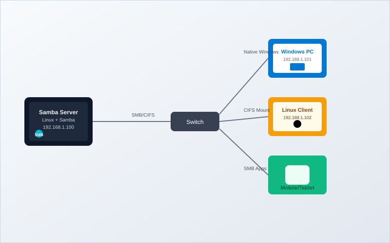

import Button from "@components/widgets/Button.astro";
import Notice from "@components/widgets/Notice.astro";
import ListCheck from "@components/widgets/ListCheck.astro";
import Accordion from "@components/widgets/Accordion.astro";
import Tabs from "@components/widgets/Tabs.astro";
import Tab from "@components/widgets/Tab.astro";

If you need to **setup Samba on Linux** for cross-platform file sharing across Windows, macOS, and mobile devices, this guide walks through the full process: `smb.conf` configuration, Windows 11 24H2 compatibility, WS-Discovery, and security patching.

While [NFS works well for Linux-to-Linux file sharing](https://www.bitdoze.com/setup-nfs-linux/), many home servers have a mix of operating systems. When you need to share files between Linux servers and Windows machines, or want broader device compatibility, Samba handles it.

I run Samba alongside NFS on my N100 mini PC that hosts Jellyfin and handles backups. All family devices (Windows laptops, Android phones, and Linux machines) access shared media and documents through it. NFS gives me performance between Linux systems, and Samba covers everything else. If you're shopping for hardware, the [GMKtec M5 Ultra](/go/gmktec-m5-ultra/) is a good compact option for this kind of always-on home server.

## Understanding SMB, CIFS, and Samba

<Notice type="info" title="Protocol Evolution">
SMB (Server Message Block) is the original protocol developed by Microsoft. CIFS (Common Internet File System) was Microsoft's enhanced version. Modern implementations use SMB2/SMB3 protocols, but the terms are often used interchangeably.
</Notice>

### What is Samba?

Samba is an open-source implementation of the SMB/CIFS protocol that lets Linux and Unix systems communicate with Windows systems using native Windows networking protocols. It turns your Linux machine into a Windows-compatible file server.

### What Samba gives you

<ListCheck>
<ul>
<li>Cross-Platform Compatibility: Works with Windows, macOS, Linux, and mobile devices</li>
<li>Native Integration: Shows up as a standard network drive in Windows Explorer</li>
<li>Advanced Authentication: Supports Active Directory and complex user management</li>
<li>Printer Sharing: Can share printers across the network</li>
<li>Wide Device Support: Compatible with smart TVs, media players, and IoT devices</li>
</ul>
</ListCheck>

### Samba vs NFS Comparison

| Feature | Samba (SMB/CIFS) | NFS |
|---------|------------------|-----|
| **Cross-Platform** | Excellent (Windows native) | Limited (Linux/Unix focus) |
| **Performance on Linux** | Good | Excellent |
| **Security Options** | Advanced (AD integration) | Basic to moderate |
| **Configuration Complexity** | Moderate | Simple |
| **Mobile Device Support** | Excellent | Limited |
| **Windows Integration** | Native | Requires third-party tools |
| **Modern Features** | SMB3 Directory Leases (4.22+), Unix Extensions (4.23+) | NFSv4 delegations |

If you only need HTTP-based file access, [serving a WebDAV share with Nginx](https://www.bitdoze.com/setup-webdav-nginx/) is another option worth considering.

## Prerequisites and Planning

Before setting up Samba, make sure you have:

<ListCheck>
<ul>
<li>Linux server with enough storage space</li>
<li>Root or sudo access on the server</li>
<li>Network connectivity between devices</li>
<li>Static IP address for the server (recommended)</li>
<li>Firewall configuration knowledge</li>
<li>User accounts planned for access control</li>
</ul>
</ListCheck>

<Notice type="error" title="Never Expose SMB to the Internet">
Port 445 (SMB) is one of the most attacked ports on the internet. Never expose it to the public. If you need remote access to Samba shares, use a VPN like WireGuard or Tailscale. See [which mesh VPN fits your setup](https://www.bitdoze.com/netbird-vs-headscale-vs-tailscale/) or [self-host a Tailscale control server](https://www.bitdoze.com/headscale-self-hosted-tailscale-setup/) for options.
</Notice>

### Check Your Samba Version

Run this first to see what your distro ships:

```bash
smbd --version
```

| Distro | Samba version | Notes |
|--------|--------------|-------|
| Debian 12 bookworm | 4.17.x | Older; consider backports for security |
| Debian 13 trixie | 4.22.10 | Security-patched, ships wsdd2 |
| Ubuntu 24.04 LTS | 4.19.x | Security backports applied |
| Ubuntu 26.04 LTS | 4.24.x | Latest stable series |
| RHEL/Rocky/Alma 9 | 4.18–4.20 | Uses `smb`/`nmb` service names |

<Notice type="info" title="Keep Samba Patched">
Samba has had critical security releases in the past year, including CVE-2025-10230 (CVSS 10.0), a command injection in the WINS hook on AD domain controllers. Standalone servers (what this guide sets up) are not affected by that specific CVE, but keeping Samba updated still matters. Check the <a href="#samba-security-and-patching-best-practices">Security and Patching</a> section below.
</Notice>

### Network Architecture for Mixed Environment



## Step 1: Samba Server Configuration on Linux (smb.conf)

This is the core section. Install, configure, test, and start your Samba server.

### Install Samba Package

<Tabs>
<Tab name="Debian / Ubuntu">
```bash
sudo apt update && sudo apt install samba samba-common-bin -y
```
</Tab>
<Tab name="RHEL / Fedora">
```bash
sudo dnf install samba samba-client samba-common -y
```
</Tab>
</Tabs>

### Create Samba Users

Samba maintains its own user database separate from system users. Create users for file sharing:

```bash
# Add system user (if doesn't exist)
sudo useradd -m -s /bin/bash mediauser

# Add user to Samba database
sudo smbpasswd -a mediauser
```

<Notice type="warning" title="User Management">
Samba users must exist as system users first. The `smbpasswd` command sets a separate password for SMB authentication, which can be different from the system password. Use `smbpasswd -d mediauser` to disable and `smbpasswd -e mediauser` to re-enable a user.
</Notice>

### Create Shared Directories

Organize your shared directories:

```bash
# Create main Samba directory
sudo mkdir -p /srv/samba

# Create specific share directories
sudo mkdir -p /srv/samba/media
sudo mkdir -p /srv/samba/documents
sudo mkdir -p /srv/samba/backups
sudo mkdir -p /srv/samba/public

# Set ownership
sudo chown -R mediauser:mediauser /srv/samba/media
sudo chown -R mediauser:mediauser /srv/samba/documents
sudo chown -R nobody:nogroup /srv/samba/public

# Set permissions
sudo chmod -R 755 /srv/samba
sudo chmod -R 777 /srv/samba/public
```

### Configure smb.conf (Modern Global Block)

The main configuration file is `/etc/samba/smb.conf`. Back up the original first:

```bash
sudo cp /etc/samba/smb.conf /etc/samba/smb.conf.backup
```

Edit the configuration file:

```bash
sudo nano /etc/samba/smb.conf
```

Here's a modern, lean `[global]` block that works with Samba 4.19+ and Windows 11 24H2:

```ini
[global]
   workgroup = WORKGROUP
   server string = BitDoze Home Server
   netbios name = HOMESERVER

   # LAN-only bind (use your real CIDR, or remove these two lines entirely)
   interfaces = lo 192.168.1.0/24
   bind interfaces only = yes

   server role = standalone server
   security = user
   map to guest = bad user
   guest account = nobody

   # Explicit SMB3 (optional, SMB1 is already disabled by default since 4.11)
   server min protocol = SMB2_10
   server max protocol = SMB3_11

   # Recommended for Windows 11 24H2+ clients (signing required by default there)
   server signing = mandatory

   logging = file
   log file = /var/log/samba/%m.log
   max log size = 1000
   log level = 1

   # Uncomment to disable legacy NetBIOS traffic entirely (port 445 only)
   # smb ports = 445
   # disable netbios = yes
```

<Notice type="info" title="What Changed From Older Guides">
If you're comparing this to older tutorials, several options have been removed: `encrypt passwords` (deprecated since Samba 4.11, encrypted passwords are always on), `socket options` with `SO_RCVBUF`/`SO_SNDBUF` (modern kernels handle this; large values can actually hurt throughput), `max xmit` (deprecated), `aio read size`/`aio write size` with byte values (now a 0/1 toggle, default is 1), and `dos charset = CP932` (Japanese encoding, likely a typo in old guides). Run `testparm` after editing and watch for deprecation warnings.
</Notice>

### Define Share Sections

```ini
[media]
   comment = Media Files (Movies, Music, Photos)
   path = /srv/samba/media
   valid users = mediauser
   read only = no
   browsable = yes
   create mask = 0755
   directory mask = 0755
   force user = mediauser
   force group = mediauser

[documents]
   comment = Personal Documents
   path = /srv/samba/documents
   valid users = mediauser
   read only = no
   browsable = yes
   create mask = 0644
   directory mask = 0755

[backups]
   comment = Backup Storage
   path = /srv/samba/backups
   valid users = mediauser
   read only = no
   browsable = no
   create mask = 0600
   directory mask = 0700
   hide unreadable = yes

[public]
   comment = Public Share (Guest Access)
   path = /srv/samba/public
   public = yes
   guest ok = yes
   read only = no
   browsable = yes
   create mask = 0666
   directory mask = 0777
   force user = nobody
   force group = nogroup
```

<Notice type="warning" title="Guest Shares and Windows 11 24H2">
Windows 11 24H2 Pro/Enterprise/Education blocks insecure guest logon by default. The `[public]` share above will not work from 24H2 clients without a real user account. See the <a href="#windows-11--10-file-explorer--smb-client-incl-24h2-fixes">Windows 11 24H2 section</a> for the fix.
</Notice>

With Samba 4.23+, SMB3 Unix Extensions are enabled by default. Files created from Linux and macOS clients keep their POSIX mode bits. The `create mask` and `force user` settings still apply to Windows clients.

### Test, Start, and Enable Samba Services

First, validate your configuration:

```bash
# Test configuration syntax (read the output carefully)
sudo testparm -s
```

If `testparm` shows errors or unknown parameters, fix them before proceeding. Common mistakes: `dead time` (should be `deadtime`), `encrypt passwords` (remove it).

Then start the services:

<Tabs>
<Tab name="Debian / Ubuntu">
```bash
sudo systemctl enable --now smbd nmbd
sudo systemctl status smbd nmbd
```
</Tab>
<Tab name="RHEL / Fedora">
```bash
sudo systemctl enable --now smb nmb
sudo systemctl status smb nmb
```
</Tab>
</Tabs>

Verify Samba is listening:

```bash
ss -tlnp | grep -E '445|139'
```

Expected output: lines showing port 445 (and 139 if NetBIOS is enabled) in LISTEN state.

Test a local connection:

```bash
smbclient //localhost/media -U mediauser -c 'ls'
```

You should see the contents of your media share (empty if freshly created).

### Configure Firewall

<Tabs>
<Tab name="UFW (Ubuntu)">
```bash
sudo ufw allow samba

# Or manually if you prefer:
sudo ufw allow 445/tcp    # SMB over TCP
sudo ufw allow 137/udp    # NetBIOS Name Service
sudo ufw allow 138/udp    # NetBIOS Datagram Service
sudo ufw allow 139/tcp    # NetBIOS Session Service
```

If you've disabled NetBIOS in smb.conf (`disable netbios = yes`), only port 445/tcp is needed.
</Tab>
<Tab name="firewalld (RHEL / Fedora)">
```bash
sudo firewall-cmd --permanent --add-service=samba
sudo firewall-cmd --reload
```
</Tab>
</Tabs>

## Step 2: Connect Linux, Windows, and macOS Clients

### Mount Samba Shares on Linux (cifs-utils & fstab)

#### Install CIFS Utilities

```bash
# Ubuntu/Debian
sudo apt install cifs-utils -y

# CentOS/RHEL
sudo dnf install cifs-utils -y
```

#### Create Credentials File

For security, store credentials in a protected file instead of putting them in fstab:

```bash
sudo nano /etc/samba/credentials
```

Add:

```
username=mediauser
password=your_password
domain=WORKGROUP
```

Secure the file:

```bash
sudo chmod 600 /etc/samba/credentials
```

#### Mount Samba Shares

```bash
# Create mount points
sudo mkdir -p /mnt/samba-media
sudo mkdir -p /mnt/samba-docs

# Mount shares
sudo mount -t cifs //192.168.1.100/media /mnt/samba-media \
  -o credentials=/etc/samba/credentials,uid=1000,gid=1000,vers=3.1.1,iocharset=utf8

# Verify mount
df -h | grep cifs
```

#### Permanent Mounting via fstab

Add entries to `/etc/fstab` for automatic mounting:

```bash
sudo nano /etc/fstab
```

Add these lines:

```fstab
//192.168.1.100/media  /mnt/samba-media  cifs  credentials=/etc/samba/credentials,uid=1000,gid=1000,file_mode=0664,dir_mode=0775,vers=3.1.1,iocharset=utf8,nofail,x-systemd.automount,_netdev  0  0
//192.168.1.100/documents  /mnt/samba-docs  cifs  credentials=/etc/samba/credentials,uid=1000,gid=1000,file_mode=0664,dir_mode=0775,vers=3.1.1,iocharset=utf8,nofail,x-systemd.automount,_netdev  0  0
```

Key options: `vers=3.1.1` forces SMB3 and avoids any SMB1 negotiation. `x-systemd.automount` mounts on first access instead of at boot (fixes the race where fstab tries to mount before the network is up). `nofail` prevents boot hangs if the share is unavailable.

Verify:

```bash
sudo mount -a && mount | grep cifs
```

**Common failures:**
- `mount error(2): No such file or directory`: wrong share name
- `mount error(13): Permission denied`: wrong credentials or SMB version mismatch; try adding `vers=3.0` or `vers=2.0`

### Windows 11 / 10 File Explorer & SMB Client (incl. 24H2 Fixes)

#### Basic Connection

**Method 1: File Explorer**

1. Open File Explorer
2. In the address bar, type: `\\192.168.1.100` (replace with your server IP)
3. Enter your Samba username and password
4. Browse available shares

**Method 2: Map Network Drive**

```powershell
# Using Command Prompt
net use Z: \\192.168.1.100\media /user:mediauser

# Using PowerShell
New-PSDrive -Name "Z" -PSProvider FileSystem -Root "\\192.168.1.100\media" -Credential (Get-Credential)
```

#### Windows 11 24H2 Changes

<Notice type="warning" title="Windows 11 24H2 Requires SMB Signing">
Windows 11 24H2 (and Windows Server 2025) require SMB signing by default on Pro, Enterprise, and Education editions. Insecure guest logon is also blocked. This is the #1 reason Windows clients fail to connect to Samba after a 24H2 update.
</Notice>

If you're getting connection errors after upgrading to Windows 11 24H2, check your client configuration:

```powershell
Get-SmbClientConfiguration | FL RequireSecuritySignature,EnableInsecureGuestLogons
```

<Accordion label="Fix: Windows 11 24H2 Can't Connect to Samba" group="troubleshooting">

Try these steps in order:

**1. Ensure signing is enabled on the Samba server**

In `smb.conf` `[global]` section:
```ini
server signing = mandatory
```

Restart Samba:
```bash
sudo systemctl restart smbd    # Debian/Ubuntu
sudo systemctl restart smb     # RHEL/Fedora
```

**2. Connect by hostname, not IP**

Windows 11 24H2 can reject signed connections when using IP addresses in some workgroup configurations. Use the NetBIOS name:
```
\\HOMESERVER\media
```

**3. Use real user accounts, not guest**

Guest shares are blocked on 24H2 Pro+. Create a real Samba user and authenticate:
```powershell
net use Z: \\HOMESERVER\media /user:mediauser
```

**4. Last resort: disable client signing requirement (not recommended)**

```powershell
Set-SmbClientConfiguration -RequireSecuritySignature $false
```

This weakens security. Only use this for testing.

</Accordion>

### macOS Finder + Avahi Discovery

1. Open Finder
2. Press `Cmd + K` to open "Connect to Server"
3. Enter: `smb://192.168.1.100`
4. Authenticate with your Samba credentials
5. Select shares to mount

To make Samba shares appear automatically in Finder's Network sidebar, install `avahi-daemon` for mDNS/DNS-SD advertisement:

```bash
sudo apt install avahi-daemon -y
sudo systemctl enable --now avahi-daemon
```

Create the service file:

```bash
sudo nano /etc/avahi/services/smb.service
```

```xml
<?xml version="1.0" standalone='no'?>
<!DOCTYPE service-group SYSTEM "avahi-service.dtd">
<service-group>
  <name replace-wildcards="yes">%h SMB</name>
  <service>
    <type>_smb._tcp</type>
    <port>445</port>
  </service>
</service-group>
```

Restart avahi:

```bash
sudo systemctl restart avahi-daemon
```

Verify from another Mac: `avahi-browse -a` should show the SMB service.

### Mobile Devices

**iOS (iPhone/iPad):** The native Files app has built-in SMB support since iOS 13. Open Files → tap the three dots (⋯) → "Connect to Server" → enter `smb://192.168.1.100` → authenticate. No third-party app needed.

**Android:** Use Solid Explorer, CX File Explorer, or Google's Android Samba Client (`samba-documents-provider` from the Play Store). AndSMB is another option.

**Media streaming:** VLC on both iOS and Android can browse and play media directly from SMB shares.

## Step 3: Advanced Security and Performance

### User and Group Management

#### Create Multiple Users

```bash
# Add additional users
sudo useradd -m john
sudo smbpasswd -a john

sudo useradd -m mary
sudo smbpasswd -a mary

# Create groups
sudo groupadd sambausers
sudo usermod -a -G sambausers john
sudo usermod -a -G sambausers mary
```

#### Group-Based Shares

Add group-based access to `smb.conf`:

```ini
[family-photos]
   comment = Family Photo Collection
   path = /srv/samba/photos
   valid users = @sambausers
   read only = no
   browsable = yes
   create mask = 0664
   directory mask = 0775
   force group = sambausers
```

### SMB3 Encryption and Signing

Signing is already enabled via `server signing = mandatory` in the global config above. This protects against man-in-the-middle attacks and is required by Windows 11 24H2.

For full traffic encryption (useful on untrusted network segments or when tunneling over VPN):

```ini
[global]
   smb encrypt = required
```

Or per-share for sensitive data only:

```ini
[secure-docs]
   path = /srv/samba/secure
   smb encrypt = required
   valid users = mediauser
```

On a typical home LAN, signing alone is sufficient. Encryption adds CPU overhead. Use it when the network path is untrusted.

### Access Control Lists (ACLs)

```bash
# Install ACL support
sudo apt install acl -y

# Set detailed permissions
sudo setfacl -R -m u:john:rwx /srv/samba/media
sudo setfacl -R -m u:mary:r-- /srv/samba/media
sudo setfacl -R -m g:sambausers:rw- /srv/samba/documents
```

### Performance: What Actually Matters in 2026

<Notice type="info" title="Skip the Buffer Tuning">
Older guides recommend setting `socket options = SO_RCVBUF=262144 SO_SNDBUF=262144`. Don't do this. The Samba man page explicitly warns against it. Modern Linux kernels handle buffer sizing automatically, and large manual values can actually reduce throughput. Delete any `socket options` lines you find in old configs.
</Notice>

What actually affects Samba performance:

1. **Gigabit wiring and switch.** If you're on 100Mbps, no smb.conf tweak will help. This is the bottleneck in most home setups.
2. **SMB3 Directory Leases** (Samba 4.22+, on by default). Clients cache directory listings locally. Great for media libraries where you browse the same folders repeatedly.
3. **`deadtime = 15`**. Close idle connections after 15 minutes. Frees resources. Add to `[global]` if you want it.
4. **`noatime` mount option.** Add to the filesystem hosting your Samba shares in `/etc/fstab` to skip writing access timestamps on every read.
5. **io_uring.** Distro builds with `liburing` (Debian, Ubuntu) get io_uring-based async I/O in smbd automatically.
6. **`vfs_aio_ratelimit`** (Samba 4.24). Useful if your backing storage is slow (spinning disks, USB drives). Limits async I/O to prevent overwhelming the device.

## Step 4: Integrate with Your Home Server

### Jellyfin Integration

For media server integration, as I use in my N100 setup:

```bash
# Create dedicated media structure
sudo mkdir -p /srv/samba/media/{movies,tvshows,music,photos}

# Set ownership for Jellyfin user
sudo chown -R jellyfin:jellyfin /srv/samba/media
```

```ini
[jellyfin-media]
   comment = Jellyfin Media Library
   path = /srv/samba/media
   valid users = mediauser, jellyfin
   read only = no
   browsable = yes
   force user = jellyfin
   force group = jellyfin
   create mask = 0664
   directory mask = 0775
```

### Backup Integration

Combine with [adding a new drive to Ubuntu LVM](https://www.bitdoze.com/add-new-drive-lvm/) for backup storage:

```bash
#!/bin/bash
# Backup script using Samba shares
BACKUP_DATE=$(date +%Y%m%d)
rsync -av --delete /home/ /srv/samba/backups/home-backup-$BACKUP_DATE/
```

For a more robust backup strategy, consider [self-hosting backups with Restic and Rclone](https://www.bitdoze.com/pluton-self-hosted-backup/).

### Docker Container Access

For [Docker containers](https://www.bitdoze.com/docker-containers-home-server/) that need access to Samba shares:

```yaml
services:
  filebrowser:
    image: filebrowser/filebrowser
    volumes:
      - /srv/samba:/srv
    ports:
      - "8080:80"
```

You can [self-host FileBrowser with Docker](https://www.bitdoze.com/deploy-filebrowser-docker/) for a web-based file manager that works alongside Samba.

<Notice type="warning" title="Container File Ownership">
When Docker containers write to Samba share directories, files may be created as root (or the container's UID). Use `force user` and `force group` in the Samba share config, or set the container's user with `user: "1000:1000"` in the compose file to match your Samba user.
</Notice>

## Step 5: Discovery and Monitoring

### Why Windows Can't See Your Samba Share (wsdd2 / WS-Discovery)

This is the most common complaint after setting up Samba: you open Windows Explorer, click "Network," and your server doesn't appear.

The reason: modern Windows (10/11) uses **WS-Discovery** to discover network devices, not the old NetBIOS browse protocol that Samba's `nmbd` handles. Samba has no built-in WS-Discovery server.

Install `wsdd2` to fix this:

<Tabs>
<Tab name="Debian 13+">
```bash
sudo apt install wsdd2 -y
sudo systemctl enable --now wsdd2
```
</Tab>
<Tab name="Ubuntu 24.04">
Ubuntu 24.04 ships `wsdd` (Python version) which may be missing a systemd unit. Install it and create the unit manually:

```bash
sudo apt install wsdd -y

# Create systemd unit if missing
sudo nano /etc/systemd/system/wsdd.service
```

```ini
[Unit]
Description=Web Services for Devices (wsdd)
After=network.target

[Service]
Type=simple
ExecStart=/usr/bin/wsdd --interface eth0
Restart=on-failure

[Install]
WantedBy=multi-user.target
```

Replace `eth0` with your actual interface name (`ip link show` to find it).

```bash
sudo systemctl daemon-reload
sudo systemctl enable --now wsdd
```
</Tab>
</Tabs>

Verify:

```bash
systemctl status wsdd2    # or wsdd
```

Check Windows Explorer, then Network. Your Samba server should now appear.

### Optional: Disable NetBIOS Entirely

On modern LANs where all clients support SMB2+, you can disable NetBIOS to reduce attack surface:

```ini
[global]
   smb ports = 445
   disable netbios = yes
```

Then stop and disable `nmbd`:

```bash
sudo systemctl disable --now nmbd    # Debian/Ubuntu
sudo systemctl disable --now nmb     # RHEL/Fedora
```

This eliminates ports 137, 138, and 139. Only port 445 remains. Only do this if all your clients are Windows 10+, macOS, or modern Linux.

### Monitoring with smbstatus, Logs, and Prometheus

```bash
# View active Samba connections
sudo smbstatus

# Detailed connection info
sudo smbstatus -v

# Brief summary
sudo smbstatus -b

# Share access
sudo smbstatus -S

# Locked files
sudo smbstatus -L

# Real-time monitoring
watch -n 2 'sudo smbstatus'
```

Log analysis:

```bash
# View Samba logs
sudo tail -f /var/log/samba/log.smbd

# Client-specific logs
sudo tail -f /var/log/samba/192.168.1.101.log

# Search for errors
sudo grep -i error /var/log/samba/*.log

# Systemd journal
journalctl -u smbd -f
```

Graceful reload (no dropped connections) vs restart:

```bash
sudo systemctl reload smbd     # Graceful, preferred for config changes
sudo systemctl restart smbd    # Drops active connections
```

For Grafana users, Samba 4.23+ includes `smb_prometheus_endpoint`, a built-in Prometheus metrics exporter on port 9922. See [server and Docker monitoring](https://www.bitdoze.com/sever-monitoring/) for setting up a full monitoring stack.

## Troubleshooting Common Issues

### Connection Problems

<Notice type="error" title="Common Error: Access Denied">
This often happens due to user authentication issues or incorrect permissions.
</Notice>

**Diagnostic steps:**

<ListCheck>
<ul>
<li>Verify user exists in Samba: `sudo pdbedit -L -v`</li>
<li>Check share permissions: `ls -la /srv/samba/`</li>
<li>Test from server: `smbclient -L localhost -U mediauser`</li>
<li>Verify firewall: `sudo ufw status` or `sudo firewall-cmd --list-all`</li>
<li>Check for config errors: `sudo testparm -s`</li>
</ul>
</ListCheck>

```bash
# Reset user password
sudo smbpasswd -x mediauser  # Remove user
sudo smbpasswd -a mediauser  # Re-add user

# Test local connection
smbclient //localhost/media -U mediauser -c 'ls'
```

### Windows 11 24H2 Error Codes

<Accordion label="Error 0xc000a000: STATUS_INVALID_SIGNATURE" group="errors">

**Cause:** SMB signing mismatch between client and server.

**Fix:**
1. Add `server signing = mandatory` to smb.conf `[global]`
2. Restart Samba
3. Connect by hostname (`\\HOMESERVER\share`) instead of IP
4. Verify: `Get-SmbClientConfiguration | FL RequireSecuritySignature` on the Windows client

</Accordion>

<Accordion label="Error 0x80070035: Network Path Not Found" group="errors">

**Cause:** The client can't reach the server at all.

**Fix:**
1. Check firewall on the Samba server: `sudo ufw status`
2. Verify Samba is listening: `ss -tlnp | grep 445`
3. Ping the server from the Windows client
4. If using hostname, check wsdd2 is running or add the server IP to the Windows hosts file

</Accordion>

<Accordion label="Security policies block unauthenticated guest access" group="errors">

**Cause:** Windows 11 24H2 Pro/Enterprise/Education blocks insecure guest logon.

**Fix:**
1. Create a real Samba user: `sudo smbpasswd -a username`
2. Remove `guest ok = yes` from the share (or create a separate authenticated share)
3. Connect with credentials: `net use Z: \\HOMESERVER\share /user:username`

</Accordion>

### Slow Transfer Speeds

1. **Check network link speed:**
   ```bash
   ethtool eth0 | grep Speed
   ```
   If it shows 100Mb/s, that's your bottleneck — check cables and switch.

2. **Test raw network throughput:**
   ```bash
   # On server
   iperf3 -s
   # On client
   iperf3 -c 192.168.1.100
   ```

3. **Check disk I/O:**
   ```bash
   sudo iotop -o
   ```

4. **Remove any legacy `socket options`** from smb.conf — these hurt more than they help on modern kernels.

### Permission Debugging

```bash
# Check effective permissions
sudo smbcacls //localhost/media /path/to/file -U mediauser

# Check ACLs
getfacl /srv/samba/media

# Reset permissions
sudo chmod -R 755 /srv/samba/
sudo chown -R mediauser:mediauser /srv/samba/media
```

## Samba Security and Patching Best Practices

### Keep Samba Patched

<Notice type="error" title="CVE-2025-10230: CVSS 10.0 RCE in Samba">
In October 2025, a critical vulnerability (CVE-2025-10230) was patched in Samba. It allowed unauthenticated remote code execution via the WINS hook on AD domain controllers. CVSS 10.0. Affected: all versions since 4.0 when running as a domain controller with `wins support = yes` and a `wins hook` set. Standalone and member servers are not affected. Fixed in 4.23.2, 4.22.5, and 4.21.9. If you're running Samba as an AD DC and haven't updated since mid-2025, do it now.
</Notice>

Samba security releases in the past year:
- **15 Oct 2025:** CVE-2025-10230 (CVSS 10.0), CVE-2025-9640
- **26 May 2026:** 6 CVEs patched
- **28 Jul 2026:** 6 CVEs patched

Actionable steps:

```bash
# Check your version
smbd --version

# Update Samba
sudo apt update && sudo apt upgrade -y    # Debian/Ubuntu
sudo dnf upgrade samba -y                 # RHEL/Fedora

# Check for deprecation warnings after update
sudo testparm -s
journalctl -u smbd -b --priority=err
```

Subscribe to the Samba security announcements at https://www.samba.org/samba/history/security.html.

### Network Security Checklist

<ListCheck>
<ul>
<li>Use strong passwords for all Samba users</li>
<li>Limit access by IP range: `hosts allow = 192.168.1.0/24`</li>
<li>Disable guest access unless specifically needed</li>
<li>Use `smb encrypt = required` for sensitive data on untrusted networks</li>
<li>Never expose port 445 to the public internet</li>
<li>Use a VPN for remote access — see [securing a Linux server with CrowdSec](https://www.bitdoze.com/crowdsec-secure-server/)</li>
<li>Keep Samba updated — check quarterly at minimum</li>
</ul>
</ListCheck>

```ini
[secure-share]
   path = /srv/samba/secure
   hosts allow = 192.168.1.0/24
   hosts deny = ALL
   smb encrypt = required
   valid users = mediauser
```

### Backup and Recovery

<Notice type="warning" title="Configuration Backup">
Always backup your Samba configuration before making changes. The configuration and user database are critical for maintaining access.
</Notice>

```bash
# Backup Samba configuration
sudo cp /etc/samba/smb.conf /backup/smb.conf.$(date +%Y%m%d)

# Backup user database
sudo cp -r /var/lib/samba /backup/samba-users.$(date +%Y%m%d)
```

Restoration:

```bash
#!/bin/bash
# restore-samba.sh
sudo cp /backup/smb.conf.YYYYMMDD /etc/samba/smb.conf
sudo cp -r /backup/samba-users.YYYYMMDD/* /var/lib/samba/
sudo systemctl restart smbd nmbd    # Debian/Ubuntu
# sudo systemctl restart smb nmb   # RHEL/Fedora
```

## Conclusion

Samba on Linux gives you cross-platform file sharing for mixed environments. It requires more configuration than [NFS](https://www.bitdoze.com/setup-nfs-linux/), but the universal compatibility makes it worth it for networks with Windows, macOS, and mobile devices.

On my N100 mini PC, running both NFS and Samba works best. NFS handles Linux-to-Linux transfers with speed, while Samba covers everything else. In 2026, the main things to get right: enable `server signing = mandatory` for Windows 11 24H2 compatibility, install wsdd2 so Windows can discover your shares, and keep Samba patched.

For more on home servers, see my guides on the [best mini PCs for home servers](https://www.bitdoze.com/best-mini-pc-home-server/) and [server monitoring](https://www.bitdoze.com/sever-monitoring/). If you need a remote VPS for offsite replication or a WireGuard endpoint, a [Hetzner Cloud VPS](https://go.bitdoze.com/hetzner) works well for that.

_VPS prices jumped across the board in 2026 — if you're rethinking a rented box, see [what changed and when a mini PC wins](/vps-price-increases/)._

<Button text="Start Your Samba Setup" size="lg" color="blue" variant="solid" />
