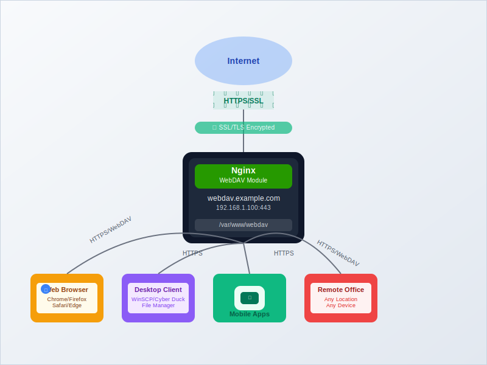

While [NFS](https://www.bitdoze.com/setup-nfs-linux/) works well for Linux-to-Linux file sharing and [Samba](https://www.bitdoze.com/setup-samba-linux/) handles cross-platform compatibility, sometimes you need web-based file access that works through firewalls and NAT. That's where WebDAV (Web Distributed Authoring and Versioning) comes in.

I run WebDAV alongside NFS and Samba on my N100 mini PC to get secure remote access to files when I'm away from home. Unlike traditional file sharing protocols, WebDAV works over standard HTTP/HTTPS ports, so you can access your home server files from anywhere with just a web browser or WebDAV client.

This guide covers setting up a WebDAV server using Nginx on Linux, with SSL encryption and security features.

## Understanding WebDAV

<Notice type="info" title="What is WebDAV?">
WebDAV (Web Distributed Authoring and Versioning) is an extension of HTTP that allows clients to perform remote web content authoring operations. It enables users to collaboratively edit and manage files on remote web servers.
</Notice>

### Key Advantages of WebDAV

<ListCheck>
- **Firewall Friendly**: Uses standard HTTP(S) ports (80/443), works through most firewalls
- **Secure by Default**: Built-in SSL/TLS encryption support
- **Universal Access**: Accessible via web browsers and dedicated clients
- **Cross-Platform**: Supported by Windows, macOS, Linux, and mobile platforms
- **Version Control**: Built-in file locking and versioning support
- **Cloud-Like Experience**: Provides Dropbox-style functionality on your own server
</ListCheck>

### WebDAV vs Other File Sharing Protocols

| Feature | WebDAV | NFS | Samba/SMB | FTP |
|---------|---------|-----|-----------|-----|
| **Remote Access** | Excellent | Poor | Poor | Good |
| **Security** | Excellent (HTTPS) | Moderate | Good | Poor |
| **Firewall Compatibility** | Excellent | Poor | Poor | Moderate |
| **Web Browser Access** | Yes | No | No | Limited |
| **Mobile Support** | Excellent | Poor | Good | Good |
| **Performance (LAN)** | Moderate | Excellent | Very Good | Good |
| **Setup Complexity** | Moderate | Simple | Moderate | Simple |

## Prerequisites and Planning

Before setting up WebDAV with Nginx, make sure you have:

<ListCheck>
- **Linux server** with root or sudo access
- **Nginx web server** (we'll install if needed)
- **SSL certificate** (Let's Encrypt recommended)
- **Domain name** or dynamic DNS (for remote access)
- **Basic understanding** of Nginx configuration
- **Firewall access** to ports 80 and 443
</ListCheck>

### WebDAV Architecture Overview



## Step 1: Installing and Configuring Nginx

### Install Nginx with WebDAV Module

Check if Nginx is already installed and whether it includes the WebDAV module:

```bash
# Check if Nginx is installed
nginx -v

# Check for WebDAV module
nginx -V 2>&1 | grep -o with-http_dav_module
```

If Nginx isn't installed or lacks the WebDAV module, install it:

```bash
# Ubuntu/Debian - Install Nginx with extra modules
sudo apt update
sudo apt install nginx nginx-extras -y

# CentOS/RHEL - Enable EPEL repository first
sudo dnf install epel-release -y
sudo dnf install nginx nginx-mod-http-dav-ext -y

# Alternative: Compile Nginx with WebDAV support
# (Only if package doesn't include WebDAV module)
```

<Notice type="warning" title="Module Availability">
The standard Nginx package may not include the WebDAV module. The `nginx-extras` package on Ubuntu/Debian or `nginx-mod-http-dav-ext` on CentOS/RHEL includes this module.
</Notice>

### Create WebDAV Directory Structure

Set up the directory structure for your WebDAV shares:

```bash
# Create WebDAV root directory
sudo mkdir -p /var/www/webdav

# Create subdirectories for different purposes
sudo mkdir -p /var/www/webdav/documents
sudo mkdir -p /var/www/webdav/media
sudo mkdir -p /var/www/webdav/projects
sudo mkdir -p /var/www/webdav/shared

# Set ownership to www-data (Nginx user)
sudo chown -R www-data:www-data /var/www/webdav

# Set appropriate permissions
sudo chmod -R 755 /var/www/webdav
```

### Configure SSL Certificate

For secure remote access, set up SSL using Let's Encrypt:

```bash
# Install Certbot
sudo apt install certbot python3-certbot-nginx -y

# Obtain SSL certificate (replace with your domain)
sudo certbot --nginx -d webdav.yourdomain.com

# Verify certificate renewal
sudo certbot renew --dry-run
```
<Notice type="warning" title="Domain DNS">
    Make sure the domain you're using points to the WebDAV server with an A record.
</Notice>


## Step 2: Configuring Nginx for WebDAV

### Create WebDAV Configuration

Create a dedicated Nginx configuration file for WebDAV:

```bash
sudo nano /etc/nginx/sites-available/webdav
```

Add the following configuration:

```nginx
server {
    listen 80;
    server_name webdav.yourdomain.com;

    # Redirect HTTP to HTTPS
    return 301 https://$server_name$request_uri;
}

server {
    listen 443 ssl http2;
    server_name webdav.yourdomain.com;

    # SSL Configuration
    ssl_certificate /etc/letsencrypt/live/webdav.yourdomain.com/fullchain.pem;
    ssl_certificate_key /etc/letsencrypt/live/webdav.yourdomain.com/privkey.pem;
    ssl_protocols TLSv1.2 TLSv1.3;
    ssl_ciphers ECDHE-RSA-AES256-GCM-SHA512:DHE-RSA-AES256-GCM-SHA512:ECDHE-RSA-AES256-GCM-SHA384;
    ssl_prefer_server_ciphers off;
    ssl_session_cache shared:SSL:10m;
    ssl_session_timeout 10m;

    # Security Headers
    add_header Strict-Transport-Security "max-age=31536000; includeSubDomains" always;
    add_header X-Content-Type-Options nosniff;
    add_header X-Frame-Options DENY;
    add_header X-XSS-Protection "1; mode=block";

    # WebDAV Configuration
    location / {
        root /var/www/webdav;

        # Enable WebDAV methods
        dav_methods PUT DELETE MKCOL COPY MOVE;
        dav_ext_methods PROPFIND PROPPATCH LOCK UNLOCK;
        dav_access user:rw group:rw all:r;

        # Create directories automatically
        create_full_put_path on;

        # Client body settings for large file uploads
        client_body_temp_path /tmp/nginx_client_temp;
        client_max_body_size 10G;
        client_body_timeout 300s;

        # Authentication
        auth_basic "WebDAV Access";
        auth_basic_user_file /etc/nginx/.htpasswd;

        # Additional WebDAV headers
        add_header DAV "1, 2" always;

        # Handle WebDAV PROPFIND method
        if ($request_method = PROPFIND) {
            add_header Content-Type "application/xml; charset=utf-8";
        }

        # Logging
        access_log /var/log/nginx/webdav_access.log;
        error_log /var/log/nginx/webdav_error.log;
    }

    # Disable access to hidden files
    location ~ /\. {
        deny all;
        access_log off;
        log_not_found off;
    }

    # Handle large file uploads
    location /upload {
        root /var/www/webdav;
        dav_methods PUT;
        create_full_put_path on;
        client_max_body_size 50G;
        client_body_timeout 600s;

        auth_basic "WebDAV Upload";
        auth_basic_user_file /etc/nginx/.htpasswd;
    }
}
```

### Create WebDAV Users

Set up authentication for WebDAV access:

```bash
# Install apache2-utils for htpasswd
sudo apt install apache2-utils -y

# Create password file and first user
sudo htpasswd -c /etc/nginx/.htpasswd webdavuser

# Add additional users
sudo htpasswd /etc/nginx/.htpasswd john
sudo htpasswd /etc/nginx/.htpasswd mary

# Secure the password file
sudo chmod 640 /etc/nginx/.htpasswd
sudo chown root:www-data /etc/nginx/.htpasswd
```

### Advanced User Management

For more sophisticated user management, create different access levels:

```bash
sudo nano /etc/nginx/sites-available/webdav-advanced
```

```nginx
# Advanced WebDAV configuration with multiple user levels
server {
    listen 443 ssl http2;
    server_name webdav.yourdomain.com;

    # ... SSL configuration (same as above) ...

    # Admin access (full WebDAV methods)
    location /admin {
        alias /var/www/webdav/admin;
        dav_methods PUT DELETE MKCOL COPY MOVE;
        dav_ext_methods PROPFIND PROPPATCH LOCK UNLOCK;
        dav_access user:rw group:rw all:r;
        create_full_put_path on;

        auth_basic "Admin WebDAV";
        auth_basic_user_file /etc/nginx/.htpasswd-admin;
    }

    # User access (limited methods)
    location /users {
        alias /var/www/webdav/users;
        dav_methods PUT DELETE MKCOL;
        dav_ext_methods PROPFIND PROPPATCH;
        dav_access user:rw group:rw all:r;
        create_full_put_path on;

        auth_basic "User WebDAV";
        auth_basic_user_file /etc/nginx/.htpasswd-users;
    }

    # Public read-only access
    location /public {
        alias /var/www/webdav/public;
        dav_methods off;
        autoindex on;
        autoindex_exact_size off;
        autoindex_localtime on;
    }
}
```

### Enable and Test Configuration

```bash
# Test Nginx configuration
sudo nginx -t

# Create symbolic link to enable site
sudo ln -s /etc/nginx/sites-available/webdav /etc/nginx/sites-enabled/

# Remove default site if needed
sudo rm -f /etc/nginx/sites-enabled/default

# Restart Nginx
sudo systemctl restart nginx
sudo systemctl enable nginx

# Check status
sudo systemctl status nginx
```

## Step 3: Client Configuration for Different Platforms

### Windows Clients

#### Method 1: Native Windows WebDAV

```powershell
# Map WebDAV as network drive
net use W: https://webdav.yourdomain.com /user:webdavuser

# Or using File Explorer:
# 1. Open File Explorer
# 2. Right-click "This PC" → "Map network drive"
# 3. Enter: https://webdav.yourdomain.com
# 4. Check "Connect using different credentials"
# 5. Enter username and password
```

#### Method 2: Third-Party Clients

Popular Windows WebDAV clients:

| Client | Type | Features |
|--------|------|----------|
| **WinSCP** | GUI | SFTP, WebDAV, file sync |
| **NetDrive** | Drive mapping | Multiple protocols |
| **WebDrive** | Commercial | Advanced caching |
| **BitKinex** | GUI | Multi-protocol support |

### Linux Clients

#### Command Line Access

```bash
# Install davfs2 for WebDAV mounting
sudo apt install davfs2 -y

# Create mount point
sudo mkdir /mnt/webdav

# Mount WebDAV share
sudo mount -t davfs https://webdav.yourdomain.com /mnt/webdav

# Create credentials file for automatic mounting
sudo nano /etc/davfs2/secrets

# Add line:
https://webdav.yourdomain.com webdavuser your_password

# Secure credentials file
sudo chmod 600 /etc/davfs2/secrets
```

#### Permanent Mounting

Add to `/etc/fstab` for automatic mounting:

```bash
sudo nano /etc/fstab

# Add line:
https://webdav.yourdomain.com /mnt/webdav davfs _netdev,user,uid=1000,gid=1000 0 0
```

#### GUI Clients

```bash
# Install Nautilus (GNOME)
sudo apt install nautilus -y

# In Nautilus: Other Locations → Connect to Server
# Enter: davs://webdav.yourdomain.com

# Install Dolphin (KDE)
sudo apt install dolphin -y

# In Dolphin: Network → Add Network Folder → WebDAV
```

### macOS Clients

#### Native macOS Support

1. Open **Finder**
2. Press `Cmd + K` (Connect to Server)
3. Enter: `https://webdav.yourdomain.com`
4. Enter credentials when prompted

#### Command Line (macOS)

```bash
# Mount WebDAV share
mkdir ~/webdav
mount_webdav https://webdav.yourdomain.com ~/webdav

# Unmount
umount ~/webdav
```

### Mobile Clients

#### iOS Applications

| App | Features | Price |
|-----|----------|-------|
| **WebDAV Nav+** | Full WebDAV client | Paid |
| **FE File Explorer** | Multi-protocol support | Freemium |
| **Documents by Readdle** | Document management + WebDAV | Free |

#### Android Applications

| App | Features | Price |
|-----|----------|-------|
| **Solid Explorer** | Dual-pane file manager | Paid |
| **Total Commander** | With WebDAV plugin | Free |
| **FX File Explorer** | WebDAV support | Freemium |

## Step 4: Advanced Configuration and Security

### Enhanced Security Configuration

#### IP-Based Access Control

```nginx
# Restrict access by IP range
location / {
    allow 192.168.1.0/24;
    allow 10.0.0.0/8;
    deny all;

    # ... rest of WebDAV configuration ...
}
```

#### Rate Limiting

```nginx
# Add to http block in nginx.conf
http {
    limit_req_zone $binary_remote_addr zone=webdav:10m rate=10r/m;

    # Apply in server block
    location / {
        limit_req zone=webdav burst=5 nodelay;
        # ... WebDAV configuration ...
    }
}
```

#### Two-Factor Authentication Integration

For enhanced security, integrate with external authentication:

```nginx
# Example with auth_request module
location /auth {
    internal;
    proxy_pass http://your-auth-service;
    proxy_pass_request_body off;
    proxy_set_header Content-Length "";
    proxy_set_header X-Original-URI $request_uri;
}

location / {
    auth_request /auth;
    # ... WebDAV configuration ...
}
```

### Performance Optimization

#### Caching Configuration

```nginx
# Add caching for static content
location ~* \.(jpg|jpeg|png|gif|ico|css|js|pdf)$ {
    expires 1y;
    add_header Cache-Control "public, immutable";
    access_log off;
}

# Enable gzip compression
gzip on;
gzip_types text/plain text/css application/json application/javascript text/xml application/xml application/xml+rss text/javascript;
```

#### Large File Handling

```nginx
# Optimize for large file uploads
client_max_body_size 50G;
client_body_buffer_size 128k;
client_body_timeout 300s;
client_header_timeout 300s;
keepalive_timeout 300s;
send_timeout 300s;

# Use sendfile for large file downloads
sendfile on;
sendfile_max_chunk 1m;
tcp_nopush on;
tcp_nodelay on;
```

### Integration with Home Server Setup

#### Media Server Integration

For integration with your media server setup:

```bash
# Create symbolic links to existing media directories
sudo ln -s /srv/samba/media /var/www/webdav/media
sudo ln -s /srv/nfs/documents /var/www/webdav/documents

# Ensure proper permissions
sudo chown -h www-data:www-data /var/www/webdav/media
sudo chown -h www-data:www-data /var/www/webdav/documents
```

#### Backup Integration

Combine with your [backup strategy](https://www.bitdoze.com/add-new-drive-lvm/):

```bash
#!/bin/bash
# webdav-backup.sh
DATE=$(date +%Y%m%d_%H%M%S)
BACKUP_DIR="/var/www/webdav/backups"

# Create timestamped backup directory
mkdir -p "$BACKUP_DIR/$DATE"

# Backup important configurations
cp /etc/nginx/sites-available/webdav "$BACKUP_DIR/$DATE/"
cp /etc/nginx/.htpasswd "$BACKUP_DIR/$DATE/"

# Backup WebDAV content
rsync -av /var/www/webdav/documents/ "$BACKUP_DIR/$DATE/documents/"
```

#### Docker Integration

For [Docker container](https://www.bitdoze.com/docker-containers-home-server/) access:

```yaml
# docker-compose.yml
version: '3.8'
services:
  file-manager:
    image: filebrowser/filebrowser
    ports:
      - "8080:80"
    volumes:
      - /var/www/webdav:/srv
    environment:
      - FB_BASEURL=/files

  webdav-nginx:
    image: nginx:alpine
    ports:
      - "443:443"
    volumes:
      - /var/www/webdav:/var/www/webdav
      - /etc/nginx/sites-available/webdav:/etc/nginx/conf.d/default.conf
      - /etc/letsencrypt:/etc/letsencrypt
```

## Step 5: Monitoring and Maintenance

### Log Analysis and Monitoring

```bash
# Monitor WebDAV access logs
sudo tail -f /var/log/nginx/webdav_access.log

# Check for errors
sudo tail -f /var/log/nginx/webdav_error.log

# Analyze WebDAV usage
sudo awk '{print $1}' /var/log/nginx/webdav_access.log | sort | uniq -c | sort -nr

# Monitor file upload/download activity
sudo grep -E "(PUT|GET)" /var/log/nginx/webdav_access.log | tail -20
```

### Performance Monitoring Script

```bash
#!/bin/bash
# webdav-monitor.sh

echo "=== WebDAV Server Monitor ==="
echo "Date: $(date)"
echo

echo "Nginx Status:"
sudo systemctl status nginx --no-pager -l
echo

echo "SSL Certificate Status:"
sudo certbot certificates
echo

echo "Active Connections:"
sudo netstat -an | grep :443 | grep ESTABLISHED | wc -l
echo

echo "Disk Usage:"
df -h /var/www/webdav
echo

echo "Recent Access (Last 10 entries):"
sudo tail -10 /var/log/nginx/webdav_access.log
```

### Automated Maintenance

Create a maintenance script for regular tasks:

```bash
#!/bin/bash
# webdav-maintenance.sh

# Rotate logs
sudo logrotate /etc/logrotate.d/nginx

# Clean temporary files
sudo find /tmp/nginx_client_temp -type f -mtime +1 -delete 2>/dev/null

# Check SSL certificate expiration
DAYS_UNTIL_EXPIRY=$(sudo certbot certificates 2>/dev/null | grep "VALID" | head -1 | grep -oP '\d+(?= days)')
if [ "$DAYS_UNTIL_EXPIRY" -lt 30 ]; then
    echo "SSL certificate expires in $DAYS_UNTIL_EXPIRY days. Consider renewal."
fi

# Update file permissions
sudo chown -R www-data:www-data /var/www/webdav
sudo find /var/www/webdav -type d -exec chmod 755 {} \;
sudo find /var/www/webdav -type f -exec chmod 644 {} \;
```

## Troubleshooting Common Issues

### WebDAV-Specific Problems

<Notice type="error" title="Common Error: 405 Method Not Allowed">
This usually means the WebDAV module isn't properly loaded or configured in Nginx.
</Notice>

**Diagnostic steps:**

<ListCheck>
- **Verify WebDAV module**: `nginx -V 2>&1 | grep dav`
- **Check configuration syntax**: `sudo nginx -t`
- **Review error logs**: `sudo tail -f /var/log/nginx/error.log`
- **Test WebDAV methods**: `curl -X PROPFIND https://webdav.yourdomain.com/`
</ListCheck>

```bash
# Test WebDAV connectivity
curl -X OPTIONS https://webdav.yourdomain.com/ -u webdavuser:password -v

# Test PROPFIND method
curl -X PROPFIND https://webdav.yourdomain.com/ -u webdavuser:password -H "Depth: 1" -v

# Test file upload
curl -X PUT https://webdav.yourdomain.com/test.txt -u webdavuser:password -d "test content"
```

### Authentication Issues

```bash
# Check password file
sudo cat /etc/nginx/.htpasswd

# Test authentication
curl -X GET https://webdav.yourdomain.com/ -u webdavuser:password -v

# Reset user password
sudo htpasswd /etc/nginx/.htpasswd webdavuser
```

### SSL/TLS Problems

```bash
# Test SSL configuration
openssl s_client -connect webdav.yourdomain.com:443 -servername webdav.yourdomain.com

# Check certificate validity
sudo certbot certificates

# Renew certificate if needed
sudo certbot renew --force-renewal -d webdav.yourdomain.com
```

### Performance Issues

#### Slow Upload/Download Speeds

1. **Increase buffer sizes**:
```nginx
client_body_buffer_size 256k;
large_client_header_buffers 4 256k;
```

2. **Optimize worker processes**:
```nginx
worker_processes auto;
worker_connections 1024;
```

3. **Enable HTTP/2**:
```nginx
listen 443 ssl http2;
```

### File Permission Issues

```bash
# Fix ownership issues
sudo chown -R www-data:www-data /var/www/webdav

# Check SELinux context (CentOS/RHEL)
sudo setsebool -P httpd_can_network_connect 1
sudo semanage fcontext -a -t httpd_exec_t "/var/www/webdav(/.*)?"
sudo restorecon -R /var/www/webdav
```

## Security Best Practices

### Access Control Best Practices

<ListCheck>
- **Use strong passwords** and consider password policies
- **Implement IP whitelisting** for administrative access
- **Enable HTTPS only** - never use plain HTTP for WebDAV
- **Keep security updates** current on Nginx and system packages
- **Monitor access logs** for suspicious activity
- **Use fail2ban** to prevent brute force attacks
</ListCheck>

```bash
# Install and configure fail2ban
sudo apt install fail2ban -y

# Create WebDAV jail configuration
sudo nano /etc/fail2ban/jail.local
```

```ini
[webdav]
enabled = true
port = 443
filter = webdav
logpath = /var/log/nginx/webdav_error.log
maxretry = 5
bantime = 3600
findtime = 600
```

```bash
# Create WebDAV filter
sudo nano /etc/fail2ban/filter.d/webdav.conf
```

```ini
[Definition]
failregex = ^<HOST> -.*"(GET|POST|PUT|DELETE|PROPFIND|PROPPATCH|MKCOL|COPY|MOVE|LOCK|UNLOCK)" .* (401|403) .*$
ignoreregex =
```

### Backup and Recovery

<Notice type="warning" title="Configuration Backup">
Always backup your WebDAV configuration and user data. SSL certificates and authentication files are critical for maintaining access.
</Notice>

```bash
#!/bin/bash
# webdav-backup-config.sh

BACKUP_DATE=$(date +%Y%m%d_%H%M%S)
BACKUP_ROOT="/backup/webdav-config"

mkdir -p "$BACKUP_ROOT/$BACKUP_DATE"

# Backup Nginx configuration
cp /etc/nginx/sites-available/webdav "$BACKUP_ROOT/$BACKUP_DATE/"

# Backup authentication files
cp /etc/nginx/.htpasswd* "$BACKUP_ROOT/$BACKUP_DATE/"

# Backup SSL certificates
cp -r /etc/letsencrypt "$BACKUP_ROOT/$BACKUP_DATE/"

# Create restoration script
cat > "$BACKUP_ROOT/$BACKUP_DATE/restore.sh" << 'EOF'
#!/bin/bash
sudo cp webdav /etc/nginx/sites-available/
sudo cp .htpasswd* /etc/nginx/
sudo cp -r letsencrypt /etc/
sudo systemctl restart nginx
echo "WebDAV configuration restored"
EOF

chmod +x "$BACKUP_ROOT/$BACKUP_DATE/restore.sh"
echo "Backup completed: $BACKUP_ROOT/$BACKUP_DATE"
```

## Use Cases and Integration Examples

### Remote Work Setup

For remote access to your home server files:

```nginx
# Dedicated remote work location
location /work {
    alias /var/www/webdav/work;

    # Enhanced security for work files
    auth_basic "Work Files Access";
    auth_basic_user_file /etc/nginx/.htpasswd-work;

    # Restrict to specific hours (9 AM to 6 PM UTC)
    access_by_lua_block {
        local hour = tonumber(os.date("%H"))
        if hour < 9 or hour > 18 then
            ngx.status = 403
            ngx.say("Access restricted to business hours")
            ngx.exit(403)
        end
    }

    dav_methods PUT DELETE MKCOL COPY MOVE;
    dav_ext_methods PROPFIND PROPPATCH LOCK UNLOCK;
    create_full_put_path on;
}
```

### Photo Backup from Mobile

Configure automatic photo backup from mobile devices:

```nginx
location /photos {
    alias /var/www/webdav/photos;

    # Allow large image uploads
    client_max_body_size 100M;

    # Organize by date
    try_files $uri $uri/ @create_date_folder;

    dav_methods PUT MKCOL;
    create_full_put_path on;

    auth_basic "Photo Backup";
    auth_basic_user_file /etc/nginx/.htpasswd-photos;
}

location @create_date_folder {
    # Auto-create date-based folders
    access_by_lua_block {
        local date = os.date("%Y/%m/%d")
        ngx.var.uri = "/photos/" .. date .. ngx.var.uri
    }
}
```

### Integration with Home Server Ecosystem

Combine WebDAV with your existing [home server setup](https://www.bitdoze.com/why-need-home-server/):

```bash
# Create unified access point
sudo mkdir -p /var/www/webdav/unified
sudo ln -s /srv/nfs/media /var/www/webdav/unified/media-nfs
sudo ln -s /srv/samba/documents /var/www/webdav/unified/docs-samba
sudo ln -s /var/lib/docker/volumes /var/www/webdav/unified/container-data

# Set permissions
sudo chown -h www-data:www-data /var/www/webdav/unified/*
```

This creates a single WebDAV endpoint that provides access to files from your [NFS](https://www.bitdoze.com/setup-nfs-linux/), [Samba](https://www.bitdoze.com/setup-samba-linux/), and [Docker container](https://www.bitdoze.com/docker-containers-home-server/) setups.

## Conclusion

WebDAV with Nginx gives you secure remote file access that complements your existing file sharing infrastructure. Unlike [NFS](https://www.bitdoze.com/setup-nfs-linux/) which works best on local networks, or [Samba](https://www.bitdoze.com/setup-samba-linux/) for cross-platform local sharing, WebDAV handles remote access through firewalls and NAT.

On my N100 mini PC, WebDAV serves as the bridge for accessing files remotely while keeping local protocols for internal network access. Running all three protocols covers everything from local media streaming to secure remote document access.

Start with basic functionality. Get SSL and authentication working first, then add rate limiting, fail2ban, and custom access controls as you need them.

For more on building a complete home server, see my guides on [server monitoring](https://www.bitdoze.com/sever-monitoring/) and [best mini PCs for home servers](https://www.bitdoze.com/best-mini-pc-home-server/).

<Button text="Deploy Your WebDAV Server" size="lg" color="blue" variant="solid" />
