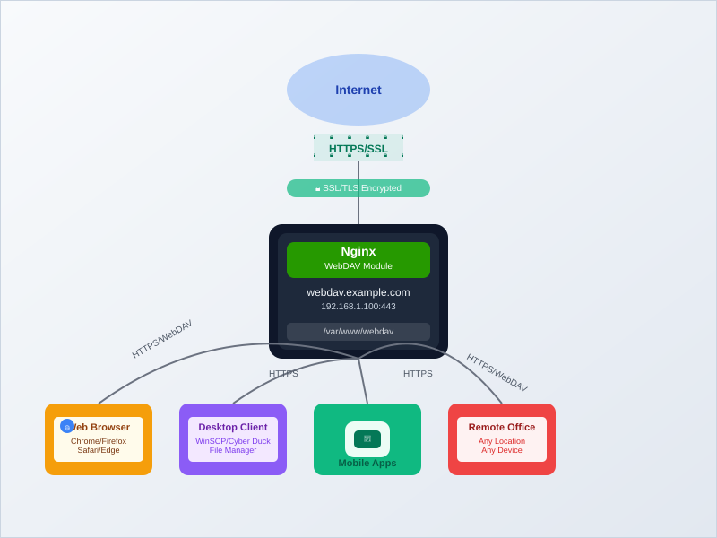

import Button from "@components/widgets/Button.astro";
import Notice from "@components/widgets/Notice.astro";
import ListCheck from "@components/widgets/ListCheck.astro";
import Accordion from "@components/widgets/Accordion.astro";
import Tabs from "@components/widgets/Tabs.astro";
import Tab from "@components/widgets/Tab.astro";

While [NFS](https://www.bitdoze.com/setup-nfs-linux/) works well for Linux-to-Linux file sharing and [Samba](https://www.bitdoze.com/setup-samba-linux/) handles cross-platform compatibility, sometimes you need web-based file access that works through firewalls and NAT. That's where WebDAV (Web Distributed Authoring and Versioning) comes in.

I run WebDAV alongside NFS and Samba on my N100 mini PC to get secure remote access to files when I'm away from home. Unlike traditional file sharing protocols, WebDAV works over standard HTTP/HTTPS ports, so you can access your home server files from anywhere with a dedicated client app. This guide covers how to setup WebDAV server with Nginx on Linux, including SSL encryption, basic auth, file locking (DAV Level 2), rclone and davfs2 clients, Docker alternatives, and troubleshooting.

## Understanding WebDAV

<Notice type="info" title="What is WebDAV?">
WebDAV (Web Distributed Authoring and Versioning) is an extension of HTTP that allows clients to perform remote web content authoring operations. It enables users to collaboratively edit and manage files on remote web servers.
</Notice>

### Key advantages of WebDAV

<ListCheck>
- **Firewall friendly**: Uses standard HTTP(S) ports (80/443), works through most firewalls
- **Secure by default**: Built-in SSL/TLS encryption support
- **Client-rich access**: Windows Explorer, macOS Finder, rclone, Cyberduck, mobile apps. No browser needed
- **Cross-platform**: Supported by Windows, macOS, Linux, and mobile platforms
- **File locking**: Exclusive write locks via dav-ext (no versioning; that's what Nextcloud/Zotero add on top)
- **Cloud-like experience**: Provides Dropbox-style functionality on your own server
</ListCheck>

### WebDAV vs NFS, Samba, and FTP

| Feature | WebDAV | NFS | Samba/SMB | FTP |
|---------|---------|-----|-----------|-----|
| **Remote Access** | Excellent | Poor | Poor | Good |
| **Security** | Excellent (HTTPS) | Moderate | Good | Poor |
| **Firewall Compatibility** | Excellent | Poor | Poor | Moderate |
| **Web Browser Access** | No (use a client app) | No | No | Limited |
| **Mobile Support** | Excellent | Poor | Good | Good |
| **Performance (LAN)** | Moderate | Excellent | Very Good | Good |
| **Setup Complexity** | Moderate | Simple | Moderate | Simple |

## Prerequisites and planning

Before you start, make sure you have:

<ListCheck>
- **Linux server** (Ubuntu 22.04+, Debian 12+, RHEL 9+, or Alpine) with root or sudo access
- **Domain name** with a DNS A record pointing to the server
- **Ports 80 and 443** open in your firewall
- (Optional) A VPS if you need remote access. [Affordable VPS hosting like Hetzner](https://go.bitdoze.com/hetzner) or [budget VPS options like Hostinger](https://go.bitdoze.com/hostinger-vps) work well for this
</ListCheck>

_VPS prices jumped across the board in 2026 — if you're rethinking a rented box, see [what changed and when a mini PC wins](/vps-price-increases/)._

### WebDAV architecture overview



### Update Nginx first: CVE-2026-27654

<Notice type="error" title="Security: Update Nginx Before Proceeding">
A buffer overflow in <code>ngx_http_dav_module</code> (CVE-2026-27654, CVSS 8.2-8.8) was disclosed on 2026-03-24. It affects configurations using <code>alias</code> with DAV COPY/MOVE, a pattern that appears in several examples below. A remote unauthenticated attacker can crash the nginx worker or manipulate filenames outside the document root.

<strong>Fixed in:</strong> nginx 1.28.3 / 1.29.7 (upstream), Ubuntu noble <code>1.24.0-2ubuntu7.7</code> (USN-8375-1), Debian bookworm security backports.

<strong>Check your version:</strong>
<pre>nginx -v</pre>

If your version is older than the fixed builds above, update now before proceeding.
</Notice>

## Step 1: Install Nginx with the WebDAV module

Nginx's base `ngx_http_dav_module` handles PUT, DELETE, MKCOL, COPY, and MOVE. For full WebDAV support (PROPFIND, OPTIONS, LOCK, UNLOCK), you also need the `dav-ext` third-party module.

### Install the Nginx WebDAV module

<Tabs>
<Tab name="Debian/Ubuntu">
```bash
# Base nginx already includes ngx_http_dav_module. Add only the ext module
sudo apt update
sudo apt install nginx libnginx-mod-http-dav-ext apache2-utils -y
```
</Tab>
<Tab name="RHEL/Alma/Rocky">
```bash
# Enable EPEL, then install
sudo dnf install epel-release -y
sudo dnf install nginx nginx-mod-http-dav-ext httpd-tools -y
```
</Tab>
<Tab name="Alpine">
```bash
# Useful for container builds
apk add nginx nginx-mod-http-dav-ext
```
</Tab>
</Tabs>

<Notice type="info" title="Module split explained">
The base <code>ngx_http_dav_module</code> (compiled into standard nginx packages on Debian/Ubuntu) handles write methods: PUT, DELETE, MKCOL, COPY, MOVE. The <code>dav-ext</code> module adds the read/lock methods: PROPFIND, OPTIONS, LOCK, UNLOCK. You need both for a functional WebDAV server.
</Notice>

**Verify the modules are loaded:**

```bash
# Check base module
nginx -V 2>&1 | grep -o with-http_dav_module

# Check ext module (Debian/Ubuntu)
ls /usr/lib/nginx/modules/ | grep dav
```

If the first command returns nothing, your nginx build lacks the base DAV module. If the second returns nothing, the ext module isn't installed.

### Create the WebDAV directory structure

```bash
# Create share directories
sudo mkdir -p /var/www/webdav/{documents,media,projects,shared}

# Create temp directory on the SAME filesystem (important, see note below)
sudo mkdir -p /var/www/webdav/.tmp

# Set ownership to www-data (Nginx user)
sudo chown -R www-data:www-data /var/www/webdav

# Set permissions
sudo chmod -R 755 /var/www/webdav
```

<Notice type="warning" title="Same filesystem for temp path">
The <code>client_body_temp_path</code> directory must be on the <strong>same filesystem</strong> as your WebDAV root. If they're on different filesystems, nginx copies the uploaded file instead of doing an atomic rename, which is slower and can fail on large uploads. The <code>/var/www/webdav/.tmp</code> path above keeps everything together.
</Notice>

### Configure SSL with Certbot

```bash
# Install Certbot
sudo apt install certbot python3-certbot-nginx -y

# Obtain SSL certificate (replace with your domain)
sudo certbot --nginx -d webdav.yourdomain.com

# Verify certificate auto-renewal works
sudo certbot renew --dry-run
```

<Notice type="warning" title="DNS must point to this server">
Make sure your domain's A record resolves to this server's IP before running Certbot. The HTTP-01 challenge needs to reach your server on port 80.
</Notice>

## Step 2: Configure Nginx for WebDAV

This is the core config. It includes all the fixes: correct `dav_ext_methods` (no `PROPPATCH`), file locking for DAV Level 2, same-filesystem temp path, macOS Finder workaround, and modern TLS settings.

### Enable WebDAV methods

Create the main config file:

```bash
sudo nano /etc/nginx/sites-available/webdav
```

Add this configuration:

```nginx
# /etc/nginx/sites-available/webdav
#
# Requires dav_ext_lock_zone in http{} context. See "Enable File Locking" below.
# Make sure /var/www/webdav/.tmp exists on the same filesystem as /var/www/webdav.

server {
    listen 80;
    server_name webdav.yourdomain.com;
    return 301 https://$server_name$request_uri;
}

server {
    listen 443 ssl;
    http2 on;

    server_name webdav.yourdomain.com;

    # SSL Configuration
    ssl_certificate     /etc/letsencrypt/live/webdav.yourdomain.com/fullchain.pem;
    ssl_certificate_key /etc/letsencrypt/live/webdav.yourdomain.com/privkey.pem;
    ssl_protocols TLSv1.2 TLSv1.3;

    # Security Headers
    add_header Strict-Transport-Security "max-age=31536000; includeSubDomains" always;
    add_header X-Content-Type-Options nosniff;
    add_header X-Frame-Options DENY;

    # Authentication
    auth_basic "WebDAV Access";
    auth_basic_user_file /etc/nginx/.htpasswd;

    # WebDAV root
    location / {
        root /var/www/webdav;

        # Write methods (base module)
        dav_methods PUT DELETE MKCOL COPY MOVE;

        # Read/lock methods (dav-ext module)
        # NOTE: PROPPATCH is NOT supported — do not add it here
        dav_ext_methods PROPFIND OPTIONS LOCK UNLOCK;

        # Enable real LOCK/UNLOCK (requires dav_ext_lock_zone in http{})
        dav_ext_lock zone=davlock;

        dav_access user:rw group:rw all:r;
        create_full_put_path on;
        min_delete_depth 1;

        # Temp path on same filesystem
        client_body_temp_path /var/www/webdav/.tmp;
        client_max_body_size 10G;
        client_body_timeout 300s;

        # Fix macOS Finder MKCOL-without-slash (creates dirs without trailing /)
        set $x $uri$request_method;
        if ($x ~ [^/]MKCOL$) { rewrite ^(.*)$ $1/; }

        # Logging
        access_log /var/log/nginx/webdav_access.log;
        error_log  /var/log/nginx/webdav_error.log;
    }

    # Block access to hidden files
    location ~ /\. {
        deny all;
        access_log off;
        log_not_found off;
    }
}
```

<Notice type="error" title="If nginx -t fails with 'unknown directive dav_ext_methods'">
The dav-ext module isn't loaded. Check with: <code>ls /usr/lib/nginx/modules/ | grep dav</code>. On Debian/Ubuntu, install <code>libnginx-mod-http-dav-ext</code>. On RHEL/Alpine, install <code>nginx-mod-http-dav-ext</code>.
</Notice>

### Enable file locking for DAV Level 2

Without explicit lock configuration, the server advertises `DAV: 1` (basic read/write only). macOS Finder requires `DAV: 2` (working LOCK support) for read/write mounts. Windows Explorer also checks this header.

Add the lock zone to your main nginx config (`/etc/nginx/nginx.conf`) inside the `http {}` block:

```nginx
http {
    # ... existing config ...

    # WebDAV lock zone — shared memory for tracking locks
    # 10MB handles thousands of concurrent locks; 300s timeout
    dav_ext_lock_zone zone=davlock:10m timeout=300;
}
```

<Notice type="info" title="DAV Level 1 vs Level 2">
<strong>Level 1</strong> = basic read/write (PUT/DELETE/PROPFIND). <strong>Level 2</strong> = adds LOCK/UNLOCK for concurrent editing. macOS Finder and Windows Explorer need Level 2 for full read/write access. Without the lock zone config above, the server only advertises DAV: 1.
</Notice>

**Verify DAV Level 2 is working:**

```bash
curl -i -X OPTIONS https://webdav.yourdomain.com/ -u webdavuser:password
```

Look for `DAV: 2` in the response headers. If you see `DAV: 1` only, the lock zone isn't configured.

### Create WebDAV users

```bash
# Create password file with first user (use -B for bcrypt)
sudo htpasswd -cB /etc/nginx/.htpasswd webdavuser

# Add additional users (no -c flag after first user)
sudo htpasswd -B /etc/nginx/.htpasswd john
sudo htpasswd -B /etc/nginx/.htpasswd mary

# Secure the password file
sudo chmod 640 /etc/nginx/.htpasswd
sudo chown root:www-data /etc/nginx/.htpasswd
```

<Notice type="warning" title="Use bcrypt (-B)">
The default <code>htpasswd</code> hash is MD5-crypt, which is weak against modern GPUs. Always use the <code>-B</code> flag for bcrypt. On RHEL-family, <code>htpasswd</code> comes from the <code>httpd-tools</code> package.
</Notice>

### Advanced user management

For different access levels (admin, users, public read-only):

```nginx
# Admin access — full WebDAV methods
location /admin {
    alias /var/www/webdav/admin;
    dav_methods PUT DELETE MKCOL COPY MOVE;
    dav_ext_methods PROPFIND OPTIONS LOCK UNLOCK;
    dav_ext_lock zone=davlock;
    dav_access user:rw group:rw all:r;
    create_full_put_path on;

    auth_basic "Admin WebDAV";
    auth_basic_user_file /etc/nginx/.htpasswd-admin;
}

# User access — limited methods
location /users {
    alias /var/www/webdav/users;
    dav_methods PUT DELETE MKCOL;
    dav_ext_methods PROPFIND OPTIONS;
    dav_access user:rw group:rw all:r;
    create_full_put_path on;

    auth_basic "User WebDAV";
    auth_basic_user_file /etc/nginx/.htpasswd-users;
}

# Public read-only access
location /public {
    alias /var/www/webdav/public;
    limit_except GET {
        deny all;
    }
    autoindex on;
    autoindex_exact_size off;
    autoindex_localtime on;
}
```

<Notice type="warning" title="alias + DAV is the CVE-2026-27654 pattern">
The <code>alias</code> directive combined with DAV COPY/MOVE is the exact trigger for CVE-2026-27654. Make sure your nginx is patched before using these location blocks. See the CVE notice in Prerequisites.
</Notice>

### Enable and test the configuration

```bash
# Test configuration syntax
sudo nginx -t

# Enable the site
sudo ln -s /etc/nginx/sites-available/webdav /etc/nginx/sites-enabled/

# Remove default site if it conflicts
sudo rm -f /etc/nginx/sites-enabled/default

# Restart and enable nginx
sudo systemctl restart nginx
sudo systemctl enable nginx

# Check status
sudo systemctl status nginx
```

**Full verification checklist:**

```bash
# 1. Module loaded?
nginx -V 2>&1 | grep -o with-http_dav_module

# 2. Config valid?
sudo nginx -t

# 3. Methods advertised? (expect DAV: 2 + Allow list)
curl -i -X OPTIONS https://webdav.yourdomain.com/ -u webdavuser:password

# 4. Directory listing works?
curl -i -X PROPFIND https://webdav.yourdomain.com/ -u webdavuser:password -H "Depth: 1"

# 5. Upload works?
curl -i -T test.txt https://webdav.yourdomain.com/test.txt -u webdavuser:password

# 6. Move works?
curl -i -X MOVE https://webdav.yourdomain.com/test.txt \
  -H "Destination: https://webdav.yourdomain.com/final.txt" \
  -u webdavuser:password
```

## Step 3: Connect WebDAV clients on every platform

### Windows: Map WebDAV as a network drive

```powershell
# Map WebDAV as network drive
net use W: https://webdav.yourdomain.com /user:webdavuser

# Or via File Explorer:
# 1. Open File Explorer
# 2. Right-click "This PC" → "Map network drive"
# 3. Enter: https://webdav.yourdomain.com
# 4. Check "Connect using different credentials"
# 5. Enter username and password
```

<Notice type="warning" title="Windows WebDAV caveats">
Windows native WebDAV is finicky. Common issues:
<ul>
<li><strong>Error 0x80070043</strong> ("The network name cannot be found") — usually means the WebClient service isn't running or the URL is wrong</li>
<li><strong>Basic auth over HTTP blocked</strong> — modern Windows requires HTTPS for basic authentication by default</li>
<li><strong>WebClient service</strong> must be running: <code>net start WebClient</code></li>
</ul>
If native mapping fails, use a third-party client like RaiDrive, Cyberduck, or WinSCP.
</Notice>

### Linux: Mount WebDAV with davfs2

```bash
# Install davfs2
sudo apt install davfs2 -y

# Create mount point
sudo mkdir /mnt/webdav

# Mount WebDAV share
sudo mount -t davfs https://webdav.yourdomain.com /mnt/webdav

# Verify
mount | grep webdav
```

For permanent mounting, add credentials and fstab entry:

```bash
# Add credentials (one line per share)
sudo nano /etc/davfs2/secrets
# Add: https://webdav.yourdomain.com webdavuser your_password

# Secure the secrets file
sudo chmod 600 /etc/davfs2/secrets

# Add to fstab for auto-mount on boot
sudo nano /etc/fstab
# Add: https://webdav.yourdomain.com /mnt/webdav davfs _netdev,user,uid=1000,gid=1000 0 0
```

**GUI file managers** also work:

```bash
# Nautilus (GNOME): Other Locations → Connect to Server
# Enter: davs://webdav.yourdomain.com

# Dolphin (KDE): Network → Add Network Folder → WebDAV
```

### macOS Finder and mount_webdav

1. Open **Finder**
2. Press `Cmd + K` (Connect to Server)
3. Enter: `https://webdav.yourdomain.com`
4. Enter credentials when prompted

Finder mounts read/write only if the server advertises `DAV: 2` (working LOCK support). If you followed Step 2's locking configuration, this works out of the box.

Command-line mount:

```bash
mkdir ~/webdav
mount_webdav https://webdav.yourdomain.com ~/webdav

# Unmount
umount ~/webdav
```

### Mobile WebDAV apps (iOS/Android)

| App | Platform | Features | Price |
|-----|----------|----------|-------|
| **Documents by Readdle** | iOS | Document management + WebDAV | Free |
| **FE File Explorer** | iOS/Android | Multi-protocol support | Freemium |
| **Solid Explorer** | Android | Dual-pane file manager | Paid |
| **Total Commander** | Android | With WebDAV plugin | Free |
| **FX File Explorer** | Android | WebDAV support | Freemium |

### Power users: Sync and mount with rclone

rclone is the Swiss-army-knife client for WebDAV. It handles sync, mount, and backup with a single binary.

```bash
# Install rclone
curl https://rclone.org/install.sh | sudo bash

# Configure a WebDAV remote
rclone config
# Choose: New remote → name: webdav-remote → type: webdav → vendor: other
# URL: https://webdav.yourdomain.com
# User: webdavuser / Password: your_password

# Sync a local directory to WebDAV
rclone sync /data/source webdav-remote:backup

# Mount WebDAV as a local directory (with caching)
rclone mount webdav-remote: ~/webdav --vfs-cache-mode full

# List files
rclone ls webdav-remote:
```

rclone also works as a lightweight WebDAV server itself — useful for side projects where you don't need nginx:

```bash
# Serve a local directory over WebDAV (single binary, TLS, user/pass)
rclone serve webdav /data/to/share --addr :8080 --user admin --pass secret
```

## Step 4: Advanced configuration and hardening

### IP allow/deny and rate limiting

```nginx
# Restrict access by IP range
location / {
    allow 192.168.1.0/24;
    allow 10.0.0.0/8;
    deny all;

    # ... rest of WebDAV configuration ...
}
```

Rate limiting in the `http {}` block:

```nginx
http {
    limit_req_zone $binary_remote_addr zone=webdav:10m rate=30r/s;

    location / {
        limit_req zone=webdav burst=50 nodelay;
        # ... WebDAV configuration ...
    }
}
```

<Notice type="info" title="Rate limiting caveat">
WebDAV clients make many rapid requests — PROPFIND with <code>Depth: 1</code> on large folders, rclone multi-file PUTs, etc. Set the rate generously or scope rate limits to authentication failures. Heavier throttling belongs in fail2ban, not nginx's <code>limit_req</code>.
</Notice>

### Two-factor auth with auth_request

For external authentication (SSO, TOTP, etc.), use the `auth_request` module — no Lua dependency needed:

```nginx
# Internal auth endpoint
location /auth {
    internal;
    proxy_pass http://your-auth-service/verify;
    proxy_pass_request_body off;
    proxy_set_header Content-Length "";
    proxy_set_header X-Original-URI $request_uri;
}

# Apply to WebDAV location
location / {
    auth_request /auth;
    # ... WebDAV configuration ...
}
```

### Tuning Nginx for large file uploads

```nginx
# In the WebDAV location block
client_max_body_size 50G;
client_body_buffer_size 256k;
client_body_timeout 600s;
client_header_timeout 300s;
keepalive_timeout 300s;
send_timeout 300s;

# Use sendfile for downloads
sendfile on;
sendfile_max_chunk 1m;
tcp_nopush on;
tcp_nodelay on;
```

<Notice type="info" title="min_delete_depth">
The <code>min_delete_depth 1</code> directive (nginx ≥1.25.5) prevents DELETE requests from removing top-level files in the share root. It's a useful safety knob — a client can't accidentally delete the entire share with a single request.
</Notice>

### Run WebDAV in Docker

The official `nginx:alpine` image includes the base DAV module but **not** the dav-ext module. Mounting a config with `dav_ext_methods` into `nginx:alpine` will fail with `unknown directive "dav_ext_methods"`. Here are three working options:

<Tabs>
<Tab name="hacdias/webdav (recommended)">
A Go-based WebDAV server. 5.8k GitHub stars, actively maintained (v5.14.2), per-user permissions, bcrypt support.

```yaml
# docker-compose.yml
services:
  webdav:
    image: hacdias/webdav:latest
    restart: unless-stopped
    ports:
      - "127.0.0.1:6065:6065"
    volumes:
      - ./webdav-config.yml:/config.yml:ro
      - /var/www/webdav:/data
    command: -c /config.yml
```

Config file (`webdav-config.yml`):

```yaml
address: 0.0.0.0
port: 6065
scope: /data
modify: true
rules: []
users:
  - username: webdavuser
    password: "$2a$10$..."  # bcrypt hash
    scope: /data
```
</Tab>
<Tab name="nginx-webdav-nononsense">
An nginx-based image with dav-ext pre-installed. 500K+ Docker Hub pulls, works with macOS Finder and Windows 11 out of the box.

```yaml
# docker-compose.yml
services:
  webdav:
    image: dgraziotin/nginx-webdav-nononsense:latest
    restart: unless-stopped
    ports:
      - "443:443"
    volumes:
      - /var/www/webdav:/var/www/webdav
      - ./htpasswd:/etc/nginx/.htpasswd:ro
    environment:
      - WEBDAV_USERNAME=webdavuser
      - WEBDAV_PASSWORD=your_password
```
</Tab>
<Tab name="nginx:alpine + dav-ext">
For those who want pure nginx in a container. Requires installing the ext module inside the container.

```yaml
# docker-compose.yml
services:
  webdav:
    image: nginx:alpine
    restart: unless-stopped
    ports:
      - "443:443"
    volumes:
      - /var/www/webdav:/var/www/webdav
      - ./nginx.conf:/etc/nginx/nginx.conf:ro
      - /etc/letsencrypt:/etc/letsencrypt:ro
    entrypoint: >
      sh -c "apk add --no-cache nginx-mod-http-dav-ext &&
             nginx -g 'daemon off;'"
```

Add to the mounted `nginx.conf` at the top level:

```nginx
load_module modules/ngx_http_dav_ext_module.so;
```
</Tab>
</Tabs>

<Notice type="error" title="Avoid bytemark/webdav">
The <code>bytemark/webdav</code> image hasn't been updated in over 7 years. It's based on an unmaintained Apache configuration. Use one of the options above instead.
</Notice>

For more Docker ideas, see [Docker containers for your home server](https://www.bitdoze.com/docker-containers-home-server/) and [a self-hosted web file manager like FileBrowser](https://www.bitdoze.com/deploy-filebrowser-docker/).

### Integrate with NFS, Samba, and backups

Create a unified access point that combines your existing file shares:

```bash
# Symlink NFS and Samba shares into WebDAV
sudo ln -s /srv/samba/media /var/www/webdav/media
sudo ln -s /srv/nfs/documents /var/www/webdav/documents

# Set ownership on symlinks (note -h flag)
sudo chown -h www-data:www-data /var/www/webdav/media
sudo chown -h www-data:www-data /var/www/webdav/documents
```

Combine with your [backup strategy](https://www.bitdoze.com/add-new-drive-lvm/) — and **test the restore, not just the backup**:

```bash
#!/bin/bash
# webdav-backup.sh
DATE=$(date +%Y%m%d_%H%M%S)
BACKUP_DIR="/var/www/webdav/backups"

mkdir -p "$BACKUP_DIR/$DATE"

# Backup configs
cp /etc/nginx/sites-available/webdav "$BACKUP_DIR/$DATE/"
cp /etc/nginx/.htpasswd "$BACKUP_DIR/$DATE/"

# Backup content (use -l to preserve symlinks as-is)
rsync -av /var/www/webdav/documents/ "$BACKUP_DIR/$DATE/documents/"
```

## Step 5: Monitor and maintain your WebDAV server

### Log analysis

```bash
# Monitor access in real time
sudo tail -f /var/log/nginx/webdav_access.log

# Check for errors
sudo tail -f /var/log/nginx/webdav_error.log

# Top IPs by request count
sudo awk '{print $1}' /var/log/nginx/webdav_access.log | sort | uniq -c | sort -nr | head -20

# Recent PUT/GET activity
sudo grep -E "(PUT|GET)" /var/log/nginx/webdav_access.log | tail -20
```

For broader server health, see how to [monitor your server's CPU, memory and disk](https://www.bitdoze.com/sever-monitoring/).

<Accordion label="WebDAV monitoring script" group="ops">

```bash
#!/bin/bash
# webdav-monitor.sh

echo "=== WebDAV Server Monitor ==="
echo "Date: $(date)"
echo

echo "Nginx Status:"
sudo systemctl status nginx --no-pager -l
echo

echo "SSL Certificate Status:"
sudo certbot certificates
echo

echo "Active Connections:"
ss -tlnp | grep :443 | wc -l
echo

echo "Disk Usage:"
df -h /var/www/webdav
echo

echo "Recent Access (Last 10 entries):"
sudo tail -10 /var/log/nginx/webdav_access.log
```

</Accordion>

<Accordion label="Automated maintenance script" group="ops">

```bash
#!/bin/bash
# webdav-maintenance.sh

# Rotate logs
sudo logrotate /etc/logrotate.d/nginx

# Clean temp files older than 1 day
sudo find /var/www/webdav/.tmp -type f -mtime +1 -delete 2>/dev/null

# Check SSL certificate expiry
DAYS_LEFT=$(sudo certbot certificates 2>/dev/null | grep "VALID" | head -1 | grep -oP '\d+(?= days)')
if [ -n "$DAYS_LEFT" ] && [ "$DAYS_LEFT" -lt 30 ]; then
    echo "WARNING: SSL certificate expires in $DAYS_LEFT days"
fi

# Fix permissions
sudo chown -R www-data:www-data /var/www/webdav
sudo find /var/www/webdav -type d -exec chmod 755 {} \;
sudo find /var/www/webdav -type f -exec chmod 644 {} \;
```

</Accordion>

## WebDAV security best practices

### Use HTTPS only and harden TLS

Never expose WebDAV over plain HTTP. The config above already redirects HTTP to HTTPS and sets TLS 1.2+1.3 only.

For custom cipher profiles, use the [Mozilla SSL Configuration Generator](https://ssl-config.mozilla.org/) to generate a config matching your nginx version. The defaults from Certbot are fine for most setups.

### Block brute force with fail2ban or CrowdSec

```bash
# Install fail2ban
sudo apt install fail2ban -y

# Create WebDAV jail
sudo nano /etc/fail2ban/jail.local
```

```ini
[webdav]
enabled  = true
port     = 443
filter   = webdav
logpath  = /var/log/nginx/webdav_access.log
maxretry = 5
bantime  = 3600
findtime = 600
```

<Notice type="warning" title="fail2ban logpath fix">
The 401 responses from failed authentication are logged in the <strong>access log</strong>, not the error log. Make sure <code>logpath</code> points to <code>webdav_access.log</code>, not <code>webdav_error.log</code>. The jail won't match anything if it watches the wrong file.
</Notice>

Create the filter:

```bash
sudo nano /etc/fail2ban/filter.d/webdav.conf
```

```ini
[Definition]
failregex = ^<HOST> -.*"(GET|POST|PUT|DELETE|PROPFIND|MKCOL|COPY|MOVE|LOCK|UNLOCK)" .* (401|403) .*$
ignoreregex =
```

For a more modern approach, consider [CrowdSec as a modern fail2ban alternative](https://www.bitdoze.com/crowdsec-secure-server/) — it shares threat intelligence across a community network.

<Accordion label="Backup and restore script" group="security">

```bash
#!/bin/bash
# webdav-backup-config.sh

BACKUP_DATE=$(date +%Y%m%d_%H%M%S)
BACKUP_ROOT="/backup/webdav-config"

mkdir -p "$BACKUP_ROOT/$BACKUP_DATE"

# Backup Nginx configuration
cp /etc/nginx/sites-available/webdav "$BACKUP_ROOT/$BACKUP_DATE/"

# Backup authentication files
cp /etc/nginx/.htpasswd* "$BACKUP_ROOT/$BACKUP_DATE/" 2>/dev/null

# Backup SSL certificates
cp -r /etc/letsencrypt "$BACKUP_ROOT/$BACKUP_DATE/"

# Create restoration script
cat > "$BACKUP_ROOT/$BACKUP_DATE/restore.sh" << 'EOF'
#!/bin/bash
set -e
sudo cp webdav /etc/nginx/sites-available/
sudo cp .htpasswd* /etc/nginx/
sudo cp -r letsencrypt /etc/
sudo nginx -t && sudo systemctl restart nginx
echo "WebDAV configuration restored"
EOF

chmod +x "$BACKUP_ROOT/$BACKUP_DATE/restore.sh"
echo "Backup completed: $BACKUP_ROOT/$BACKUP_DATE"
```

**Test the restore** — run the restore script on a staging server or in a container before you need it in production.

</Accordion>

### Keep Nginx patched

<Notice type="warning" title="Stay patched">
CVE-2026-27654 is not the only nginx security fix in 2026. Check your version regularly:
<pre>nginx -v</pre>
If you're on a distro package, security updates come through <code>apt upgrade</code> / <code>dnf update</code>. If you use the nginx.org repo, watch their release announcements. Either way, don't run an unpatched nginx exposed to the internet.
</Notice>

## Troubleshooting common WebDAV problems

### 405 Method Not Allowed

The WebDAV module isn't loaded or the methods aren't configured.

```bash
# Verify module
nginx -V 2>&1 | grep dav

# Check config syntax
sudo nginx -t

# Test methods
curl -X OPTIONS https://webdav.yourdomain.com/ -u webdavuser:password -v
```

### Authentication failures

```bash
# Check password file exists and is readable
ls -la /etc/nginx/.htpasswd

# Test auth with curl
curl -X GET https://webdav.yourdomain.com/ -u webdavuser:password -v

# Reset a user's password
sudo htpasswd -B /etc/nginx/.htpasswd webdavuser
```

### SSL/TLS problems

```bash
# Test SSL handshake
openssl s_client -connect webdav.yourdomain.com:443 -servername webdav.yourdomain.com

# Check certificate validity
sudo certbot certificates

# Force renewal
sudo certbot renew --force-renewal -d webdav.yourdomain.com
```

### Windows-specific errors

- **0x80070043 "The network name cannot be found"**: Start the WebClient service (`net start WebClient`), verify the URL uses HTTPS, and check that the server responds to OPTIONS requests.
- **"The user has not been authenticated"**: Windows blocks basic auth over HTTP by default. Use HTTPS.
- **Still failing?**: Use RaiDrive, Cyberduck, or WinSCP instead of Windows Explorer.

### macOS Finder issues

- **Read-only mount**: The server isn't advertising `DAV: 2`. Add the `dav_ext_lock_zone` and `dav_ext_lock` directives from Step 2.
- **MKCOL 409 errors**: The macOS Finder MKCOL workaround is already in the main config above.

### SELinux permission denied (RHEL/Fedora)

If PROPFIND returns 500 on RHEL-family systems, SELinux is likely blocking nginx from reading the WebDAV directory.

```bash
# Set the correct SELinux context
sudo semanage fcontext -a -t httpd_sys_rw_content_t "/var/www/webdav(/.*)?"
sudo restorecon -Rv /var/www/webdav

# Verify
ls -laZ /var/www/webdav/
```

<Notice type="error" title="SELinux blocks PROPFIND">
Check <code>/var/log/audit/audit.log</code> for <code>avc: denied</code> entries related to nginx. The old advice to use <code>httpd_exec_t</code> is wrong for data directories — use <code>httpd_sys_rw_content_t</code> instead.
</Notice>

### Slow upload/download

```nginx
# Increase buffer sizes
client_body_buffer_size 256k;
large_client_header_buffers 4 256k;

# Optimize workers
worker_processes auto;
worker_connections 1024;

# Enable HTTP/2 (use the directive, not the deprecated listen parameter)
http2 on;
```

## Use cases and integration examples

### Remote work setup

Create a dedicated work location with its own credentials:

```nginx
location /work {
    alias /var/www/webdav/work;
    dav_methods PUT DELETE MKCOL COPY MOVE;
    dav_ext_methods PROPFIND OPTIONS LOCK UNLOCK;
    dav_ext_lock zone=davlock;
    dav_access user:rw group:rw all:r;
    create_full_put_path on;

    auth_basic "Work Files";
    auth_basic_user_file /etc/nginx/.htpasswd-work;
}
```

For time-restricted access, use fail2ban rules or IP whitelisting rather than Lua-based hour checks — simpler, no extra module dependency.

### Photo backup from mobile

```nginx
location /photos {
    alias /var/www/webdav/photos;
    dav_methods PUT MKCOL;
    dav_ext_methods PROPFIND OPTIONS;
    dav_access user:rw group:rw all:r;
    create_full_put_path on;

    # Allow large image uploads
    client_max_body_size 100M;

    auth_basic "Photo Backup";
    auth_basic_user_file /etc/nginx/.htpasswd-photos;
}
```

### Unified endpoint with NFS and Samba

Combine WebDAV with your existing [home server](https://www.bitdoze.com/why-need-home-server/) file shares:

```bash
# Create unified access point
sudo mkdir -p /var/www/webdav/unified
sudo ln -s /srv/nfs/media /var/www/webdav/unified/media-nfs
sudo ln -s /srv/samba/documents /var/www/webdav/unified/docs-samba
sudo ln -s /var/lib/docker/volumes /var/www/webdav/unified/container-data

# Set permissions on symlinks
sudo chown -h www-data:www-data /var/www/webdav/unified/*
```

This creates a single WebDAV endpoint that provides access to files from your [NFS](https://www.bitdoze.com/setup-nfs-linux/), [Samba](https://www.bitdoze.com/setup-samba-linux/), and [Docker container](https://www.bitdoze.com/docker-containers-home-server/) setups.

## Conclusion

WebDAV with Nginx gives you secure remote file access that complements your existing file sharing infrastructure. Unlike [NFS](https://www.bitdoze.com/setup-nfs-linux/) which works best on local networks, or [Samba](https://www.bitdoze.com/setup-samba-linux/) for cross-platform local sharing, WebDAV handles remote access through firewalls and NAT.

On my N100 mini PC, WebDAV serves as the bridge for accessing files remotely while keeping local protocols for internal network access. Running all three protocols covers everything from local media streaming to secure remote document access.

Start with basic functionality — get SSL and authentication working first, then add locking, fail2ban, and custom access controls as you need them. If you're exposing WebDAV to the internet, keep nginx patched and consider [CrowdSec](https://www.bitdoze.com/crowdsec-secure-server/) for automated threat blocking. For personal access only, a VPN like [self-hosting your own Tailscale control server](https://www.bitdoze.com/headscale-self-hosted-tailscale-setup/) is often the better choice — it removes the public attack surface entirely.

For more on building a complete home server, see my guides on [server monitoring](https://www.bitdoze.com/sever-monitoring/) and [best mini PCs for home servers](https://www.bitdoze.com/best-mini-pc-home-server/).

<Button text="Deploy Your WebDAV Server" size="lg" color="blue" variant="solid" />
