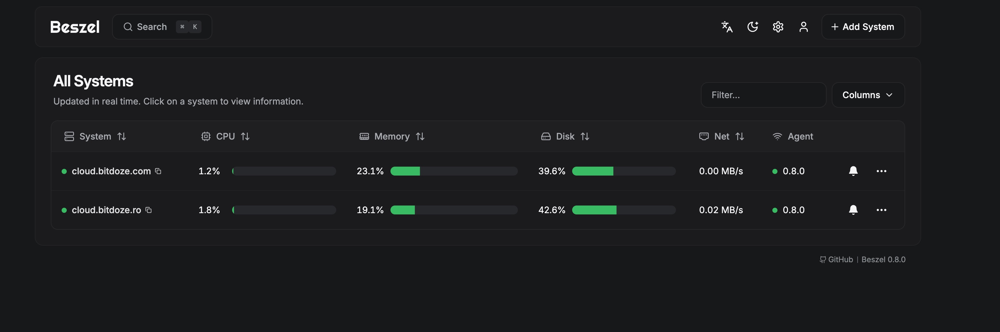
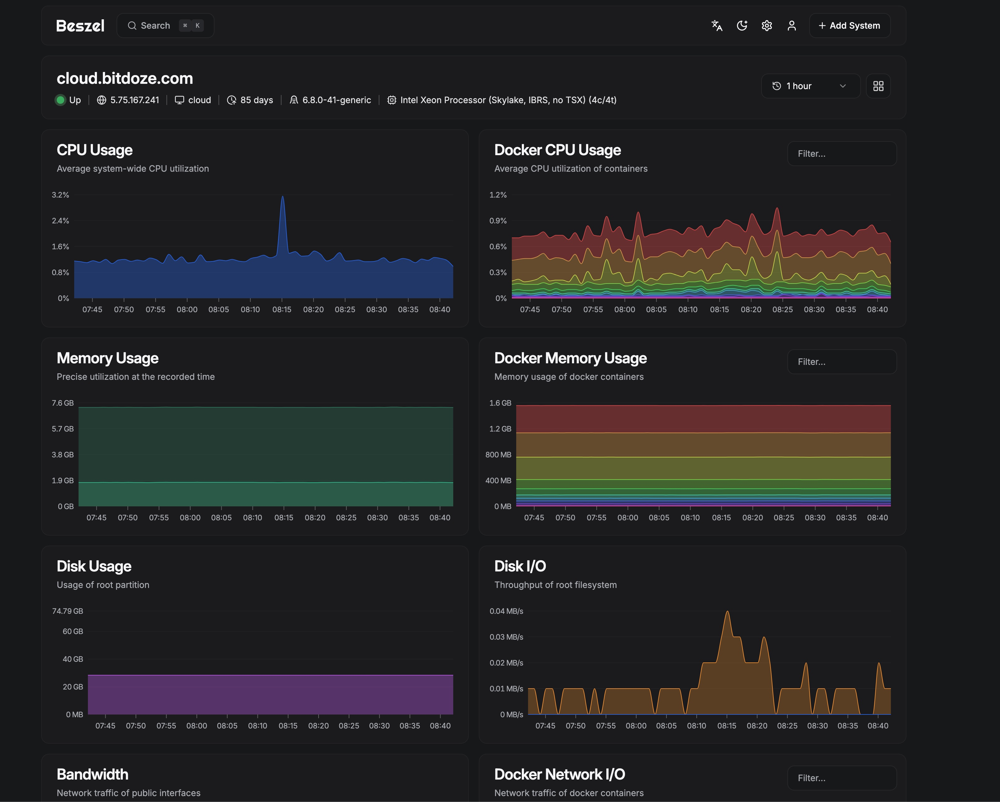
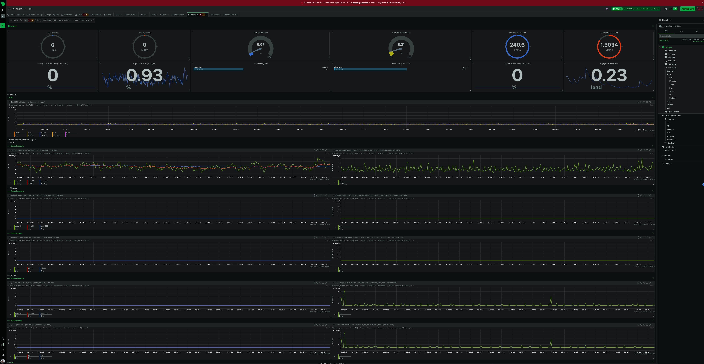
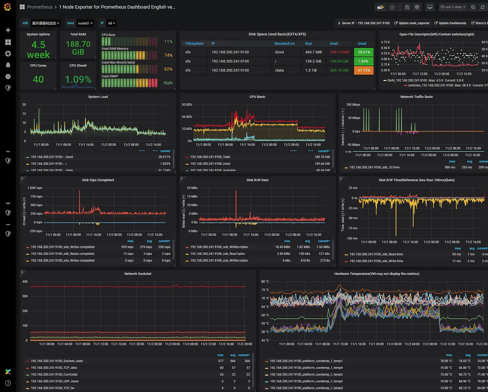
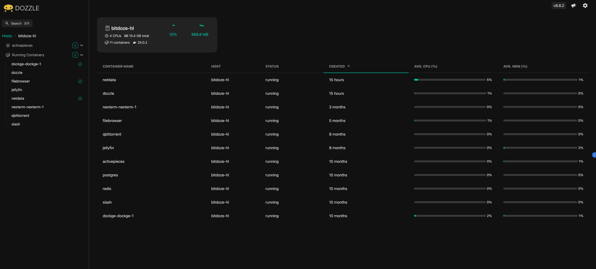

import Button from "../../components/widgets/Button.astro";
import Notice from "../../components/widgets/Notice.astro";
import ListCheck from "../../components/widgets/ListCheck.astro";
import Accordion from "../../components/widgets/Accordion.astro";
import Tabs from "../../components/widgets/Tabs.astro";
import Tab from "../../components/widgets/Tab.astro";

import YouTubeEmbed from "../../components/widgets/YouTubeEmbed.astro";


If you run Docker on a VPS, you need to know when CPU spikes, disk fills, or a container dies, before your users notice. Server monitoring is the systematic process of tracking resource utilization, container health, and service availability so you can catch problems early. This guide compares four free, self-hosted monitoring tools (Beszel, Netdata, Dozzle, and Prometheus/Grafana), adds Uptime Kuma for availability checks, and gives you a clear default stack for 1–20 servers. Whether you're running [Docker containers for your home server](/docker-containers-home-server/) or managing production workloads on cheap VPS boxes, the monitoring stack you choose matters.

## Quick picks: which monitoring tool should you use?

<Notice type="info" title="TL;DR">
For 90% of self-hosters with 1–20 servers, deploy **Beszel** (metrics) + **Dozzle** (logs) + **Uptime Kuma** (availability). Total RAM overhead: ~50–80 MB. You can have the whole stack running tonight.


<YouTubeEmbed
  url="https://www.youtube.com/embed/vG8fFm_lI-o"
  label="How To Monitor Server and Docker Resources:CPU,Memory.."
/>
If you need per-second resolution and AI anomaly detection, go with **Netdata**, but budget 200-500 MB RAM.

If you're running an organization with 50+ targets and custom PromQL dashboards, use **Prometheus + Grafana**, but budget 1 GB+ RAM and a weekend for setup.
</Notice>

<ListCheck>
**You need Beszel if you want:**
- A monitoring dashboard that runs in 5 minutes with ~10–25 MB RAM
- Built-in Docker container stats, GPU monitoring, and S.M.A.R.T. disk health
- OAuth/OIDC login and automatic S3 backups

**You need Netdata if you want:**
- Per-second metric collection with 800+ integrations
- AI-powered anomaly detection and blast radius analysis
- Deep production debugging at 3 am

**You need Prometheus + Grafana if you want:**
- Custom PromQL dashboards and long-term metric storage
- Enterprise-grade alerting with Alertmanager
- Multi-team observability with role-based access
</ListCheck>

Here's what each tool actually costs you in RAM on a VPS:

| Tool | RAM (idle) | Best for |
|---|---|---|
| Beszel agent | ~10–15 MB | Every server |
| Beszel hub | ~12 MB | Central dashboard |
| Dozzle | ~10–18 MB | Log viewing + alerts |
| Uptime Kuma | ~30–50 MB | HTTP/TCP availability |
| Netdata | 200–500 MB | Deep metrics, AI |
| Prometheus + Grafana | 500 MB–1 GB+ | Enterprise observability |

Compare these numbers against [self-hosted server management panels](/best-self-hosted-panels/) to plan your total resource budget.

## Key areas in server monitoring

Effective server monitoring tracks four resource domains. The tools in this article cover all of them.

| Metric Type | Traditional Server | Container Environment | Cloud Infrastructure |
|---|---|---|---|
| CPU | Overall usage | Per container usage | Instance utilization |
| Memory | Physical/Swap | Container limits | Instance limits |
| Storage | Partition usage | Volume usage | Block storage |
| Network | Interface stats | Container networks | VPC metrics |

Before you deploy anything, it helps to [benchmark your cloud server](/benchmark-cloud-servers/) so you know your baseline.

### CPU monitoring

- Load averages (1, 5, 15 minute)
- Per-core utilization
- Process-level CPU consumption
- System/user time split

For a deeper dive on CPU alerting, see how to [monitor CPU usage with alerts](/monitor-cpu-usage-and-send-email-alerts-in-linux/).

### Memory monitoring

- Available RAM and swap usage
- Buffer/cache utilization
- Per-process memory consumption
- OOM kill events (Dozzle can alert on these)

### Disk & filesystem monitoring

- Disk space usage (percentage and absolute)
- Inode utilization
- Read/write operations and I/O wait times
- S.M.A.R.T. disk health with failure alerts (Beszel v0.17+)

Disk fills up fast with Docker images and logs. If you're running low, [clean up Docker disk usage](/clean-docker-overlay2-dir/) to reclaim space.

### Network monitoring

- Bandwidth utilization per interface
- Packet loss and latency
- Connection states and socket counts
- Container-level network stats

## Importance of getting notified

Proactive alerting is the difference between catching a problem at 90% disk and waking up to a dead server at 100%. Every tool in this article supports notifications:

- **Beszel**: ntfy, email, webhook, Telegram, Gotify
- **Netdata**: 90+ notification channels including Slack, Discord, PagerDuty
- **Dozzle**: webhook delivery to Slack, Discord, ntfy, or custom endpoints
- **Prometheus**: Alertmanager with multi-channel routing

The key principles still apply:

1. **Early warning.** Detect issues before they become critical. Monitor trend changes, not just thresholds.
2. **Quick response.** Deliver notifications with diagnostic info and clear action items.
3. **Prevent alert fatigue.** Use intelligent thresholds, correlation, and proper priorities. If everything is critical, nothing is.

<Notice type="info" title="Alert routing pattern">
Instead of wiring each monitoring tool to email separately, route all alerts through a single notification server like [ntfy](https://ntfy.sh/) or [Gotify](https://gotify.net/). Every tool in this article supports webhook delivery. Point them all at one endpoint, then manage subscriptions from a single place. One webhook target to maintain, one place to mute at 3 am.
</Notice>

## Metrics monitoring: track CPU, memory, disk & network

This section covers tools that watch system resources. Metrics tell you *what* is happening (CPU at 95%, memory exhausted, disk filling up). The log monitoring section below covers *why* it's happening (error messages, stack traces, crash loops).

### Beszel: lightweight server & Docker monitoring

<Notice type="success">
Beszel is the recommended starting point for most readers. It uses ~10-25 MB total RAM, deploys in 5 minutes, and now includes GPU monitoring, S.M.A.R.T. disk health, systemd service monitoring, and OAuth/OIDC. Version 0.18.7, 22,700+ GitHub stars, MIT license.
</Notice>

[Beszel](https://github.com/henrygd/beszel) is a lightweight monitoring hub with agents that report back via SSH or universal tokens. It's designed for small to medium fleets, the kind of setup where you have 1-20 VPS boxes and want a clean dashboard without the overhead of Netdata or Prometheus.

Main Beszel interface:


Beszel graphs:


#### Beszel key features (v0.18)

What's new since the original article:

- **Universal tokens** (v0.12+). Create a token at `/settings/tokens` and skip per-system key setup. This simplifies multi-server deployment significantly.
- **OAuth2/OIDC.** Sign in via Google, GitHub, Authentik, Authelia. Password auth can be disabled entirely.
- **S.M.A.R.T. disk monitoring** with failure alerts. Catch a dying drive before it takes your data.
- **GPU monitoring.** NVIDIA (NVML/nvtop), AMD, Intel, experimental Apple Silicon.
- **systemd service monitoring.** See which services are running and get alerted on failures.
- **Automatic backups** to disk or S3-compatible storage.
- **Multi-user** with admin and read-only roles.

<Tabs>
<Tab name="TOKEN auth (recommended)">
Since v0.12.0, universal tokens are the recommended auth method. You create a token in the hub UI and paste it into the agent config. No SSH key juggling.

```yaml
services:
  beszel-agent:
    image: henrygd/beszel-agent:latest
    container_name: beszel-agent
    restart: unless-stopped
    network_mode: host
    volumes:
      - /var/run/docker.sock:/var/run/docker.sock:ro
    environment:
      PORT: 45876
      TOKEN: "your-universal-token-from-hub"
```

</Tab>
<Tab name="KEY auth (legacy)">
The original SSH key-based auth still works. Generate an ed25519 key pair, paste the public key in the hub, and the private key in the agent config.

```yaml
services:
  beszel-agent:
    image: henrygd/beszel-agent:latest
    container_name: beszel-agent
    restart: unless-stopped
    network_mode: host
    volumes:
      - /var/run/docker.sock:/var/run/docker.sock:ro
    environment:
      PORT: 45876
      KEY: "ssh-ed25519 AAAAC3..."
```

</Tab>
</Tabs>

#### Deploy Beszel hub with Docker Compose

```yaml
services:
  beszel:
    image: henrygd/beszel:latest
    container_name: beszel
    restart: unless-stopped
    environment:
      APP_URL: http://localhost:8090   # change to your domain in production
    ports:
      - 8090:8090
    volumes:
      - ./beszel_data:/beszel_data
```

Save this as `docker-compose.yml`, then:

```bash
mkdir -p beszel && cd beszel
# paste the compose file above
docker compose up -d
```

**Verify:** Open `http://your-ip:8090`. The setup wizard should appear. Create your admin account. If you get a blank page, check that `APP_URL` matches your access URL.

<Notice type="info" title="Run the hub on a separate box">
If your only server goes down, your monitoring goes down with it. Beszel hub uses ~12 MB RAM — cheap enough to run on a separate [Hetzner VPS](https://go.bitdoze.com/hetzner) (CX22 at ~€4/month) or a [Hostinger VPS](https://go.bitdoze.com/hostinger-vps). Even a Raspberry Pi works. The agent stays on your production servers; the hub lives elsewhere.
</Notice>

#### Deploy Beszel agent with Docker Compose

On each monitored server:

```yaml
services:
  beszel-agent:
    image: henrygd/beszel-agent:latest
    container_name: beszel-agent
    restart: unless-stopped
    network_mode: host
    volumes:
      - /var/run/docker.sock:/var/run/docker.sock:ro
      # monitor other disks/partitions by mounting into /extra-filesystems
      # - /mnt/disk/.beszel:/extra-filesystems/sda1:ro
    environment:
      PORT: 45876
      TOKEN: "your-universal-token-from-hub"
```

To get your token: in the Beszel hub UI, go to **Settings → Tokens**, create a new universal token, and paste it into the agent's `TOKEN` environment variable.

**Verify:** The system row should flip green in the hub UI within 30 seconds. If red, check `docker logs beszel-agent` for connection errors.

<Accordion label="Beszel agent shows red — common fixes" group="beszel-failure">
**Wrong TOKEN or KEY:** Regenerate the token in the hub and update the agent compose. Restart the agent.
**Firewall blocking port 45876:** The hub connects to the agent on port 45876. Make sure your firewall allows inbound TCP on that port from the hub's IP:
```bash
sudo ufw allow from HUB_IP to any port 45876
```
**Agent not running:** Check `docker ps | grep beszel-agent`. If it's not listed, check `docker logs beszel-agent` for startup errors.
**Docker socket permissions:** Ensure `/var/run/docker.sock` is readable. The `:ro` mount is sufficient — the agent only reads stats, it doesn't control containers.
</Accordion>

<Accordion label="Hub shows 'connection refused'" group="beszel-failure">
**APP_URL mismatch:** The `APP_URL` env var must match how you access the hub. If you're using `http://localhost:8090` but accessing via a reverse proxy domain, update `APP_URL` to the domain.
**Port not exposed:** Verify with `docker port beszel` that 8090 is mapped.
**Reverse proxy misconfiguration:** If behind Caddy/Nginx/Traefik, ensure the proxy passes the `Host` header and forwards to port 8090.
</Accordion>

**Ops notes:**
- **Backup:** The `/beszel_data` directory contains all configuration and history. Back it up, or configure S3 backup in hub settings.
- **Updates:** `docker compose pull && docker compose up -d` — Beszel hub and agent update independently.
- See how to [pair Beszel with Uptime Kuma](/beszel-uptime-kuma/) for the complete setup with Dokploy.

### Netdata: deep real-time server monitoring

[Netdata](https://www.netdata.cloud/) gives you 2,000+ metrics at 1-second resolution with AI anomaly detection. That depth costs 200–500 MB of RAM. For "is my CPU OK," that's overkill. For debugging a production incident at 3 am with per-second granularity, it's worth every megabyte.

Version 2.10.4 (July 2026), 79,600+ GitHub stars, GPL-3.0+.



#### Netdata key features (v2.10)

- **800+ integrations** with auto-detection — Netdata discovers what's running and starts collecting metrics with zero config.
- **AI Co-Engineer** — built-in AI chat, AI reporting, and blast radius detection. The agent has self-learning anomaly detection built in.
- **Per-second metric collection** — no other free tool matches this granularity.
- **Parent streaming + HA clustering** — scale to thousands of nodes with parent-child architecture.
- **UI-based alert configuration** — define alerts in the Cloud dashboard, not just config files. Includes alert silencing, recurrence rules, and acknowledgement.

#### Netdata pricing: Community vs Homelab vs Business

The old "Community vs Cloud" split is gone. Current tiers (Aug 2026):

| Plan | Price | Nodes | Custom Dashboards | Retention |
|---|---|---|---|---|
| Community | Free | 5 | 1 | 3 GB disk, >1 year |
| Homelab | $90/yr | Unlimited | Unlimited | Fair usage |
| Business | $4.50/node/mo | Unlimited | Unlimited | Full |
| Enterprise On-Premise | Contact sales | Unlimited | Unlimited | Full |

<Notice type="info">
If you have more than 5 servers, the **Homelab plan at $90/year** is the sweet spot. Unlimited nodes with fair usage — this is the tier designed for self-hosters. The free Community plan (5 nodes, 1 custom dashboard, 3 GB disk / >1 year retention) is enough to evaluate.
</Notice>

Compare: SaaS alternatives like Datadog charge $15–18/host/month. Self-hosting Netdata is free; the Cloud plan adds multi-node dashboards and AI features.

#### Deploy Netdata with Docker

```yaml
services:
  netdata:
    image: netdata/netdata:stable
    container_name: netdata
    restart: unless-stopped
    pid: host
    network_mode: host
    cap_add:
      - SYS_PTRACE
      - SYS_ADMIN
    security_opt:
      - apparmor:unconfined
    volumes:
      - netdataconfig:/etc/netdata
      - netdatalib:/var/lib/netdata
      - netdatacache:/var/cache/netdata
      - /etc/passwd:/host/etc/passwd:ro
      - /etc/group:/host/etc/group:ro
      - /etc/localtime:/etc/localtime:ro
      - /proc:/host/proc:ro
      - /sys:/host/sys:ro
      - /var/run/docker.sock:/var/run/docker.sock:ro
    environment:
      - NETDATA_CLAIM_TOKEN=your-cloud-token  # optional: connect to Netdata Cloud

volumes:
  netdataconfig:
  netdatalib:
  netdatacache:
```

**Verify:** Access `http://your-ip:19999` — the dashboard should populate with live metrics within seconds. If you see an empty page, check the Docker socket mount and network mode.

<Accordion label="Netdata agent not connecting to Cloud" group="netdata-failure">
**Token mismatch:** Regenerate the claim token from Netdata Cloud and update the `NETDATA_CLAIM_TOKEN` env var.
**Network egress blocked:** Netdata Cloud requires outbound HTTPS to `app.netdata.cloud`. Check your firewall rules.
**Firewall:** If you're not using Cloud, just access the agent directly at port 19999 — no outbound connection needed.
</Accordion>

<Accordion label="High RAM usage on small VPS" group="netdata-failure">
On a 1 GB VPS, Netdata alone can take 200–500 MB — that's 20–50% of your total RAM. Verify with `docker stats` before committing.

To reduce memory:
- Disable unused collectors in `/etc/netdata/netdata.conf`
- Reduce metric retention periods
- If you don't need per-second resolution, consider switching to Beszel (~10–15 MB)
</Accordion>

**Ops notes:**
- On a 1 GB VPS, Netdata alone takes 20–50% of RAM — verify with `docker stats` before committing alongside other services.
- **Backup:** `/etc/netdata` for configs, `/var/cache/netdata` for historical data.
- **Updates:** `docker compose pull && docker compose up -d`

### Prometheus & Grafana: enterprise server monitoring

<Notice type="warning" title="Resource warning">
The full Prometheus + Grafana stack needs 500 MB–1 GB+ RAM. Don't run this on a 1 GB VPS alongside your applications. This is for dedicated monitoring nodes or organizations with real infrastructure budgets.
</Notice>

Prometheus handles metrics collection and storage. Grafana provides visualization and alerting. Together they're the industry standard for enterprise monitoring — PromQL for queries, Alertmanager for routing, and custom dashboards for everything. Prometheus 3.x (Nov 2024) and Grafana 12.x (May 2025) are the current releases.



#### Prometheus/Grafana key features (Prometheus 3.x, Grafana 12.x)

**Prometheus 3.0 changes:**
- Native OTLP ingestion on `/api/v1/otlp/v1/metrics` — receive OpenTelemetry metrics directly without a collector.
- Remote Write 2.0 with improved compression.
- UTF-8 support in label values.
- New web UI.

**Grafana 12 changes:**
- Observability as code — Git Sync for dashboards.
- Dynamic dashboards with drilldown apps.
- Grafana Alloy as the modern single collector (replaces node_exporter + cAdvisor + Promtail).

**Prometheus capabilities:**
- Pull-based metrics collection with service discovery
- PromQL query language for complex aggregations
- Time-series database with efficient compression
- Customizable retention periods

**Grafana strengths:**
- Customizable dashboards with template variables
- Multiple data source support (Prometheus, Loki, InfluxDB, etc.)
- Multi-channel alerting with grouping and escalation

#### Deployment overview

The essential components: Prometheus for metrics, Grafana for visualization, Node Exporter for system metrics, and cAdvisor for container stats. For a Docker-based setup:

```yaml
services:
  prometheus:
    image: prom/prometheus:v3.13.0
    container_name: prometheus
    restart: unless-stopped
    volumes:
      - ./prometheus.yml:/etc/prometheus/prometheus.yml
      - prometheus_data:/prometheus
    ports:
      - 9090:9090

  grafana:
    image: grafana/grafana:12.0.0
    container_name: grafana
    restart: unless-stopped
    ports:
      - 3000:3000
    volumes:
      - grafana_data:/var/lib/grafana

  node-exporter:
    image: prom/node-exporter:latest
    container_name: node-exporter
    restart: unless-stopped
    pid: host
    volumes:
      - /proc:/host/proc:ro
      - /sys:/host/sys:ro
      - /:/rootfs:ro

  cadvisor:
    image: gcr.io/cadvisor/cadvisor:latest
    container_name: cadvisor
    restart: unless-stopped
    volumes:
      - /:/rootfs:ro
      - /var/run/docker.sock:/var/run/docker.sock:ro
      - /sys:/sys:ro
      - /var/lib/docker:/var/lib/docker:ro

volumes:
  prometheus_data:
  grafana_data:
```

For production, there are also Kubernetes Helm charts, Ansible automation, and managed solutions like AWS Managed Grafana or Google Cloud Managed Prometheus. The official docs cover these in detail: [Prometheus Installation](https://prometheus.io/docs/prometheus/latest/installation/) and [Grafana Installation](https://grafana.com/docs/grafana/latest/setup-grafana/installation/).

**Ops notes:**
- **Backup:** The Prometheus TSDB data directory, `prometheus.yml`, and Grafana dashboards (export as JSON).
- **Cost:** Grafana Cloud free tier gives you 10k series with 14-day retention. Pro: $19/month + $6.50/1k series after 10k. Self-hosting is free but costs you RAM.
- Check your [Docker firewall configuration](/docker-bypasses-firewall/) — Prometheus pulls metrics from exporters, so the network path matters.

## Log monitoring: track Docker container logs

Metrics tell you *what* is happening. Logs tell you *why*. When CPU spikes, you need to know which process is responsible. When a container crashes, you need the error message. This is where Dozzle comes in — it pairs with Beszel or Netdata for metrics to give you the complete picture.

### Dozzle: Docker log viewer with alerts

[Dozzle](https://dozzle.dev/) started as a lightweight log viewer. Since v10 (Feb 2026), it's grown into a full Docker operations tool with alerts, SQL analytics, container actions, and shell access. Version 10.6.15, 14,000+ GitHub stars, MIT license. Image size: ~7–10 MB.



#### Dozzle key features (v10)

What's new since the original article:

- **Alerts & webhooks** — log pattern matching ("alert when any container logs contain 'FATAL'"), CPU/memory metric thresholds ("alert when postgres exceeds 85% memory"), and container lifecycle events ("alert when any container gets OOM-killed"). Delivers to Slack, Discord, ntfy, or custom endpoints.
- **DuckDB SQL analytics** — query your live log streams with SQL in the browser. Example: `SELECT * FROM logs WHERE message LIKE '%Error%'`. Useful for debugging patterns across containers.
- **Container actions** — stop, start, and restart containers from the browser. Disabled by default.
- **Shell access** — exec into containers from the browser. Disabled by default.
- **Built-in authentication** — file-based auth (`DOZZLE_AUTH_PROVIDER=simple`) and forward proxy auth (Authelia).
- **Kubernetes support** and multi-host agents with TLS.
- Command palette (Cmd+K), theme-aware ANSI colors.

<Notice type="warning" title="Privacy note">
Dozzle sends anonymous usage analytics by default. Opt out with `DOZZLE_NO_ANALYTICS=true` in your compose environment. This is for usage telemetry only — it does not affect the DuckDB analytics feature.
</Notice>

#### Deploy Dozzle with Docker Compose

```yaml
services:
  dozzle:
    image: amir20/dozzle:latest
    container_name: dozzle
    restart: unless-stopped
    volumes:
      - /var/run/docker.sock:/var/run/docker.sock
      - ./dozzle_data:/data              # required: persists alert/notification configs
    ports:
      - 8080:8080
    environment:
      DOZZLE_NO_ANALYTICS: "true"        # opt out of anonymous analytics
      # DOZZLE_AUTH_PROVIDER: simple     # enable built-in file-based auth
      # DOZZLE_ENABLE_ACTIONS: true      # stop/start/restart containers from UI
      # DOZZLE_ENABLE_SHELL: true        # exec into containers from UI
```

**Verify:** Navigate to `http://your-ip:8080` — you should see your running containers listed in the sidebar. Click one to see live log streaming. If the list is empty, verify the Docker socket mount.

**Important:** The `/data` volume mount is **required** as of v10. Without it, your alert configurations and notification settings are lost on every container restart.

<Accordion label="Dozzle shows no containers" group="dozzle-failure">
**Docker socket permissions:** Ensure `/var/run/docker.sock` is readable by the container user. The default Docker socket permissions (root:docker, mode 660) usually work, but some distros restrict this.
**SELinux/AppArmor:** On SELinux-enforced systems, you may need `:z` on the socket mount:
```yaml
volumes:
  - /var/run/docker.sock:/var/run/docker.sock:z
```
**Wrong socket path:** On some systems (Docker rootless, Podman), the socket path is different. Check with `ls /var/run/docker.sock` or `ls $XDG_RUNTIME_DIR/docker.sock`.
</Accordion>

<Accordion label="Alerts not firing" group="dozzle-failure">
**Missing /data volume:** Alert configurations are stored in `/data`. If you didn't mount `./dozzle_data:/data`, alert configs exist only in the container's ephemeral filesystem and are lost on restart.
**Webhook URL misconfigured:** Test the webhook endpoint manually with `curl` from the Dozzle container to verify network reachability.
**Rule syntax:** Double-check your alert rules in the Dozzle UI. Log patterns use substring matching, not regex (unless specified).
</Accordion>

**Ops notes:**
- **Backup:** The `./dozzle_data` directory contains alert and notification configs.
- **Updates:** `docker compose pull && docker compose up -d`
- **Log retention:** Dozzle streams logs from Docker — it doesn't store them. Configure Docker log rotation to prevent disk filling. See [essential Docker commands](/docker-commands/) for log management. If disk is already full, [clean up Docker disk usage](/clean-docker-overlay2-dir/).

## Availability monitoring: Uptime Kuma

Beszel watches resources from *inside* the server. Uptime Kuma checks HTTP, TCP, DNS, and ping reachability from *outside*. Different jobs, both needed. This is the standard small-fleet monitoring stack in 2026.

[Uptime Kuma](https://github.com/louislam/uptime-kuma) is a self-hosted uptime monitoring tool with a clean UI, 90+ notification channels, built-in status pages, SSL certificate monitoring, and multi-language support. ~30–50 MB RAM, MIT license.

<Notice type="info" title="The standard stack">
For most self-hosters in 2026: **Beszel** (metrics) + **Dozzle** (logs) + **Uptime Kuma** (availability) covers everything you need. Total overhead: ~50–80 MB RAM.
</Notice>

Quick deploy:

```yaml
services:
  uptime-kuma:
    image: louislam/uptime-kuma:latest
    container_name: uptime-kuma
    restart: unless-stopped
    volumes:
      - ./uptime-kuma-data:/app/data
    ports:
      - 3001:3001
```

**Verify:** Open `http://your-ip:3001`, create your admin account, and add an HTTP monitor for your own server. It should show "Up" within a few seconds.

For detailed setup guides, see [how to install Uptime Kuma](/install-uptime-kuma/) or [deploy Uptime Kuma with one click](/deploy-uptime-kuma/). For the complete Beszel + Uptime Kuma integration, see [pairing Beszel with Uptime Kuma](/beszel-uptime-kuma/).

## Tool comparison table

Updated August 2026. Version numbers and RAM figures based on current releases and independent benchmarks.

| Feature | Beszel v0.18 | Netdata v2.10 | Prometheus 3.x / Grafana 12.x | Dozzle v10 | Uptime Kuma |
|---|---|---|---|---|---|
| **Primary purpose** | Lightweight metrics | Deep real-time metrics | Enterprise metrics | Log viewing + alerts | Availability |
| **RAM usage** | ~10–25 MB | 200–500 MB | 500 MB–1 GB+ | ~10–18 MB | ~30–50 MB |
| **Setup complexity** | Very low | Low | High | Very low | Low |
| **Learning curve** | Gentle | Moderate | Steep | Gentle | Gentle |
| **Docker stats** | Built-in | Built-in | Via cAdvisor | N/A (logs only) | N/A |
| **GPU monitoring** | NVIDIA, AMD, Intel, Apple Silicon | Via go.d/nvidia_smi | Via custom exporters | N/A | N/A |
| **S.M.A.R.T. disks** | Built-in with failure alerts | Via collectors | Via custom exporters | N/A | N/A |
| **Alerts** | Built-in (ntfy, email, webhook) | Built-in, 90+ channels | Alertmanager | Webhooks | Built-in, 90+ channels |
| **OAuth/Multi-user** | Built-in (OAuth2/OIDC) | Cloud plans only | Grafana built-in | File-based auth | Built-in |
| **Open source** | MIT | GPL-3.0+ | Apache-2.0 / AGPLv3 | MIT | MIT |

## Security & production hardening

Every monitoring tool in this article exposes a web interface and most need access to the Docker socket. Treat these like any other production service.

**Reverse proxy + HTTPS:** Every tool should sit behind Caddy, Nginx, or Traefik with TLS. A minimal Caddy example for Beszel:

```
monitor.example.com {
    reverse_proxy http://localhost:8090
}
```

**Authentication:** Beszel has OAuth/OIDC built-in. Dozzle supports `DOZZLE_AUTH_PROVIDER=simple` for file-based auth or Authelia for forward proxy auth. Grafana has built-in auth with RBAC. Netdata Cloud handles auth server-side.

**Docker socket security:** All these tools mount `/var/run/docker.sock`. This is root-equivalent access — anyone with the socket can control your containers. Always use read-only mounts (`:ro`) and consider a [Docker socket proxy](https://github.com/Tecnativa/docker-socket-proxy) for production to limit the API surface.

<Notice type="error" title="Don't monitor on the same box">
If your only server dies, your monitoring dies with it. You'll have no metrics, no logs, and no idea what happened. Run the Beszel hub on a separate box — even a $3/month VPS works. The hub is ~12 MB RAM. Cheap options: [Hetzner VPS](https://go.bitdoze.com/hetzner) (CX22), [Vultr](https://go.bitdoze.com/vultr), or [DigitalOcean](https://go.bitdoze.com/do). For a home setup, a mini PC with [dedicated home server hardware](/best-mini-pc-home-server/) works too.
</Notice>

Check your [Docker firewall configuration](/docker-bypasses-firewall/) — Docker can bypass UFW/iptables rules by default. And [secure your server](/secure-ssh-server-linux/) with proper SSH hardening before exposing any monitoring dashboards.

## Post-deploy checklist

After deploying your monitoring stack, run through this list:

<ListCheck>
- All agents reporting green in the dashboard
- Alerts configured with meaningful thresholds (not defaults)
- Alert tested — trigger one intentionally and confirm delivery to your notification channel
- Data directories backed up (Beszel: `/beszel_data`, Dozzle: `/data`, Netdata: config volumes)
- Reverse proxy + HTTPS configured for all web UIs
- Anonymous analytics disabled if desired (`DOZZLE_NO_ANALYTICS=true`)
- Firewall rules verified — only necessary ports exposed to the internet
- Docker socket mounts are read-only (`:ro`) where possible
</ListCheck>

## Conclusions

The monitoring landscape in 2026 is generous to self-hosters. You don't need to pay Datadog $15/host/month. Here's the decision tree:

**For 90% of readers** (solo devs, 1–20 VPS boxes, Docker): deploy Beszel + Dozzle + Uptime Kuma. Total RAM: ~50–80 MB. Cost: free. Setup time: under an hour. This is the stack I'd recommend to anyone starting fresh.

**If you need deep observability** (per-second metrics, AI anomaly detection, 800+ integrations): Netdata with the Homelab plan ($90/year for unlimited nodes). Budget 200–500 MB RAM. Worth it when you're debugging production issues that need sub-second resolution.

**If you're running an organization** with 50+ targets, custom dashboards, and PromQL queries: Prometheus + Grafana. Budget 1 GB+ RAM and a weekend for initial setup. The learning curve is real, but the flexibility is unmatched.

<Notice type="success" title="Start here">
New to server monitoring? Deploy Beszel hub + agent on two servers. You'll have metrics in 5 minutes and it costs you nothing. Expand to Dozzle for logs and Uptime Kuma for availability as you grow.
</Notice>

<Button text="Deploy Beszel Now" link="https://beszel.dev/guide/getting-started" variant="solid" color="blue" size="md" icon="arrow-right" />

For more tools to run alongside your monitoring stack, check out [Docker containers for your home server](/docker-containers-home-server/) and [self-hosted server management panels](/best-self-hosted-panels/).
