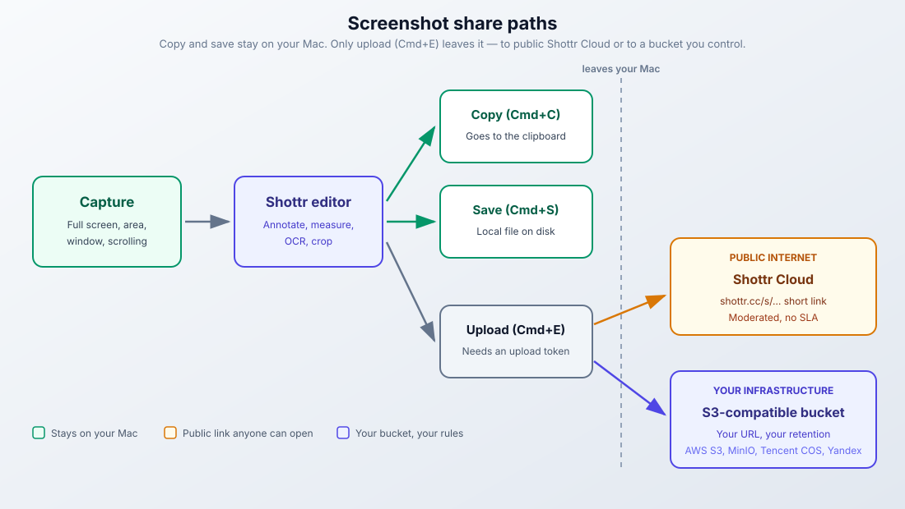

import YouTubeEmbed from "@components/widgets/YouTubeEmbed.astro";
import Button from "@components/widgets/Button.astro";
import Notice from "@components/widgets/Notice.astro";
import ListCheck from "@components/widgets/ListCheck.astro";
import Tabs from "@components/widgets/Tabs.astro";
import Tab from "@components/widgets/Tab.astro";
import Accordion from "@components/widgets/Accordion.astro";

macOS has a built-in screenshot tool (`⌘ + Shift + 5`), but it's basic. No scrolling capture, weak markup, no OCR. If you need more than that, the Shottr Mac screenshot tool is worth a look. I've kept this review current as of Shottr 1.9.3 (September 2026), which ships fixes specifically for macOS 27 Golden Gate.

Shottr is a Mac-only screenshot app built by a solo developer. The dmg is 2.4mb, it runs natively on Apple Silicon with no Rosetta, and per the developer it takes 17ms to grab a screenshot and around 165ms to show it to you. Those are vendor numbers, not my benchmarks, but the app does feel instant.

You can use Shottr for free indefinitely. After 30 days it starts showing prompts to buy a license, but every feature keeps working. The Basic license is $12 one-time, which is still cheap compared to the alternatives.

## What is Shottr?

Shottr is a screenshot capture and annotation app for macOS, built by one developer against low-level macOS APIs. That last part matters: there is no Windows or Linux version and there won't be one. If you need cross-platform tooling, stop reading here.

The core workflow is short:

1. Capture (full screen, area, window, or scrolling)
2. Annotate, measure, or OCR the result
3. Copy it, save it, or upload it

The pixel ruler stamps real measurements onto the screenshot, OCR pulls text straight into the clipboard, and scrolling capture handles long pages without manual stitching. Those three are what separate it from the macOS built-in tool.

Before you install:

<ListCheck>
<ul>
<li>macOS 10.15 or later (Shottr itself still supports Intel Macs on older macOS versions)</li>
<li>Around 10 MB of disk space for the app</li>
<li>Screen Recording permission granted to Shottr (macOS prompts on first launch)</li>
<li>Optional: Homebrew, if you'd rather install with a package manager</li>
<li>Optional: a free upload token or your own S3 bucket, only if you want cloud uploads</li>
</ul>
</ListCheck>

## Video walkthrough

<YouTubeEmbed
  url="https://www.youtube.com/embed/jQpw9NQ4mHM"
  label="Shottr - Mac Screenshot Tool With Pixel-Level Precision"
/>

> If you're interested in more free Mac apps, check [toolhunt.net mac apps section](https://toolhunt.net/mac/).

## What's new in 2026 (v1.9.2-v1.9.3)

Two small releases cover the current OS cycle:

- **v1.9.2 (Sep 17, 2026)**: improved compatibility with macOS 27
- **v1.9.3 (Sep 24, 2026)**: another set of fixes to accommodate macOS 27

Context: macOS 27 Golden Gate shipped on September 14, 2026 and drops Intel Macs entirely (see the [MacRumors macOS 27 roundup](https://www.macrumors.com/roundup/macos-27/)). Shottr is a native Apple Silicon app, so nothing to do there. It still installs and runs on macOS 10.15+, including Intel Macs stuck on older OS versions.

One earlier change worth knowing: v1.9.1 (Dec 17, 2025) expanded S3 upload to more providers (MinIO, Tencent COS, Yandex Object Storage on top of AWS S3).

<Notice type="info" title="Check the latest version anytime">
  The in-app updater polls a public endpoint. Run `curl -s https://shottr.cc/api/version.json` to see the current release without installing anything. It returns a small JSON blob with `latestVersion` and `releaseDate`.
</Notice>

## Features

Shottr packs 16 annotation tools, six capture modes, OCR, a pixel ruler, and two upload destinations into an app that stays out of the way. The breakdown below covers what matters, with the failure modes called out.

### Capture modes

- Area capture gives you crosshairs to select a region
- Window capture grabs any window, with or without shadow and background
- Full screen captures the entire screen
- Scrolling capture scrolls and stitches long web pages, chat logs, and documents in one shot, with no manual stitching
- Repeat area retakes a screenshot of the same region without reselecting it
- Delayed capture waits 3 seconds before capturing

One thing the developer is explicit about: Shottr is built around fullscreen capture plus crop. The screen-freezing area capture is marked experimental. If area capture feels awkward, that's why. Capture fullscreen, then crop (details in the troubleshooting section).

### Scrolling screenshots

If you came here looking for a scrolling screenshot tool for Mac, this is the feature to care about. Shottr scrolls and stitches long web pages, email threads, and chat conversations automatically. The capture height defaults to 20,000px and can go up to 200,000px if you edit the setting.

It handles most scrollable windows well. It does not handle all of them: scroll-modifier utilities and a few apps break or chop the output. I cover the known-bad list and the fixes in the troubleshooting section below, because a scrolling capture that silently fails is worse than no feature at all.

### OCR and text recognition

Select any area and Shottr extracts the text using Apple's Vision framework, straight into your clipboard. It also reads QR codes, which saves reaching for your phone when one is on-screen. This is solid Mac screenshot OCR for printed text, UI labels, code blocks, and documents. Handwriting and decorative fonts are less reliable.

It preserves line breaks by default, so code and lists stay readable. If you'd rather have clean paragraph text, there's a line-break removal button and a default setting. That shipped back in v1.7.0 (May 28, 2023), not in the 1.9 line.

If you'd rather talk than transcribe, there's [FluidVoice, a free open-source Mac dictation app](/fluidvoice-mac-dictation/) that covers the voice-to-text side.

### Annotation and markup tools

All 16 tools show in the toolbar when the window is wide enough (v1.9 made that consistent):

- Arrows come in standard, curved, and bendable variants (bendable since v1.9), with slim and hand-drawn styles
- Text labels have customizable colors and sizes, with a pointy arrow by default
- Shapes cover rectangles and ovals with fill and opacity control
- Blur and pixelate hide sensitive info. Press `B` on a selection to blur it fast
- Highlighter does text highlights with a configurable cap style
- Spotlight dims the background around a selection. Keys `1`-`9` adjust opacity
- The counter tool adds numbered step annotations (1, 2, 3...)
- Freehand drawing has variable stroke width and smoothness
- Magnifier is a zoomed-in callout for detail shots (new in v1.9)
- Hand-drawn style makes shapes and arrows look sketched (new in v1.9)

Custom annotation colors landed in v1.8, so you're not stuck with the preset palette. Screenshot annotation is where Shottr beats the built-in tool outright: the macOS markup drawer can't do counters, spotlight, or pixelate.

### Screen ruler and measurements

This is the feature that wins over developers and designers, and the reason "pixel ruler Mac" is basically a Shottr search query. Press arrow keys while measuring to get exact pixel distances between UI elements. Hold `Shift` for outer dimensions. Click to stamp the measurement directly onto the screenshot.

The color inspector shows hex codes for any pixel. Since v1.8.1 (Nov 28, 2024) it also reports OKLCH and APCA values, useful if you work in modern CSS color spaces or need a quick contrast check.

### Backdrop tool (v1.8+)

Added in the September 2024 update, the Backdrop tool places screenshots on colored backgrounds with drop shadows and rounded corners. Pick a background color, tune shadow intensity, set a corner radius. It's good enough for documentation and quick social posts.

The options are thinner than dedicated beautifiers. If you want full mockup scenes with device frames and magic backgrounds, use the [Shots.so mockup generator](/shots-so-mockups/) instead and drop your Shottr capture into it.

### S3 and Shottr Cloud upload (v1.9+)

Screenshots can leave your Mac two ways. This is the part older reviews get wrong: cloud sharing is live.



**1. Shottr Cloud (shareable links).** Hit `Cmd+E` (or F2) and the screenshot uploads, and a public short URL like `https://shottr.cc/s/Atja/SCR-20220718-fna` lands in your clipboard. You need a free upload token first. License holders get one instantly at [shottr.cc/get_token.html](https://shottr.cc/get_token.html) (email plus the first 6 characters of your license). Without a license, you email the developer and should be ready to wait a few weeks. The upload token is a separate credential, not your license number.

**2. Your own S3-compatible bucket.** Since v1.9 (Nov 2025), with more providers added in v1.9.1 (Dec 2025): AWS S3, MinIO, Tencent COS, Yandex Object Storage, and other third-party services. You control the URLs and the retention rules. The blast radius is yours.

| | Shottr Cloud | Your S3 bucket |
|---|---|---|
| Setup | Free token, no infra | Your bucket and credentials |
| URL | Public `shottr.cc/s/...` link | Your domain/path |
| Visibility | Public, moderated | Yours to control |
| Availability | No SLA | Whatever you run |
| Good for | Quick one-off shares | Anything sensitive or long-lived |

<Notice type="warning" title="Shottr Cloud uploads are public">
  Treat every Shottr Cloud upload as publishing to the internet. Uploads are moderated, no expiration is guaranteed, there is no availability SLA, and the docs say it is not secure image storage. Using it to host images embedded on other sites violates the upload terms. If it's a screenshot of a config with secrets, blur before uploading or use your own bucket.
</Notice>

Token trouble is the most common failure here. See the troubleshooting section.

### Pinned screenshots

Pin a screenshot as a floating always-on-top window. Resize it with the scroll wheel. Useful for comparing designs, referencing a spec, or overlaying two captures side by side.

## What Shottr doesn't do

Be aware of these gaps before committing:

- No screen recording. Shottr is screenshot-only. No video, no real GIF export. The only animation trick is a two-frame before/after overlay. If you need polished macOS screen recordings with automatic zooms, use [Screen Studio](https://go.bitdoze.com/screen-studio) or CleanShot X.
- Limited background templates. The Backdrop tool works but it's a couple of controls, not a template library.
- No batch exports or App Store screenshot sets. One capture at a time.
- Cloud links are public links. Shottr Cloud exists now, but it's built for quick shares, not for private team hosting. Private sharing means your own S3 bucket.

## Shottr pricing

Shottr works as a free Mac screenshot app for as long as you want it. The 30-day evaluation period just unlocks nag prompts. No features get cut. A license removes the prompts and supports the developer.

Prices as of October 2026:

| Tier | Price | What you get |
|------|-------|-------------|
| **Free (unlicensed)** | $0 | All features, nag prompts after 30 days |
| **Basic** | $12 one-time | No prompts, standard updates |
| **Friends Club** | $30 one-time | Experimental features, priority support, early access |

One license covers one user and up to 5 Macs. It's a one-time purchase, not a subscription.

<Notice type="warning" title="Sale pricing moves: verify before you buy">
  As of early October 2026 the Basic tier is listed at $9, with the site saying the price goes back up to $12 on October 14, 2026. Existing licenses are unaffected either way. Check [shottr.cc/purchase.html](https://shottr.cc/purchase.html) before you rely on any figure in this table.
</Notice>

The developer has said he plans to add features and raise the price later. If the $12 (or $9) tier covers what you need, there's no reason to wait for a better deal. The FAQ explicitly says there are no discount coupons, ever.

At this price, the alternatives look expensive:

| Tool | Price | Notes |
|------|-------|-------|
| **Shottr** | $12 one-time | Pixel ruler, OCR, scrolling, Shottr Cloud or S3 upload, no recording |
| **CleanShot X** | Basic $35 one-time / Pro $10 per user/month | Recording, GIFs, built-in cloud |
| **Snagit** | $39 per user/year | Full-featured, subscription-only since Snagit 2025 |
| **macOS built-in** | Free | Basic capture only, no scrolling |

### License and commercial use

<Notice type="info" title="Using Shottr at work?">
  A license is required for commercial use. The free tier is fine for personal screenshots; if you're capturing at your job, budget the $12.
</Notice>

Payments run through FastSpring as merchant of record, so EU buyers get compliant VAT invoices. A few practical notes from the purchase FAQ:

- Card declines are common. Fixes that work: set the country selector to match the card's billing country, disable your VPN, try an incognito window, try a different card or your phone.
- Licenses can't be upgraded to Friends Club later. Pick the tier you want up front.
- No coupons, ever. And a lost key has a retrieval page. Search the purchase site for license retrieval and have your email ready.
- Your upload token is not your license number. Separate credentials, separate pages.

## Shottr vs CleanShot X

This comparison gets asked about constantly, so here it is with current numbers (October 2026). The old "CleanShot X $29 one-time" claim you'll see in stale reviews is gone. Pricing has moved.

| Feature | Shottr | CleanShot X |
|---------|--------|-------------|
| Price | $12 one-time | Basic $35 one-time (1 year of updates, $19/year renewal); Pro $10/user/month billed annually |
| macOS requirement | 10.15+ | 13.0+ |
| Update policy | Perpetual license | 1 year included on Basic, then $19/year |
| Scrolling capture | Yes | Yes |
| OCR / text extraction | Yes | Yes |
| QR code reader | Yes | Yes |
| Pixel ruler | Yes | No |
| Screen recording | No | Yes (Studio Mode zooms in CleanShot 5.0) |
| GIF recording | No | Yes |
| Cloud sharing | Shottr Cloud links or your S3 | Built-in (1 GB on Basic, unlimited on Pro) |
| Background templates | Basic Backdrop | 10+ templates |
| Team features (SSO/SCIM, custom domain) | No | Pro tier |
| Apple Silicon native | Yes | Yes |

Pick Shottr if you measure UI elements, want a tiny fast app, and care more about a one-time price than polish.

Pick CleanShot X if you record your screen, need instant cloud links with a private-ish default, or are equipping a team and want SSO. The $35 Basic tier (1 year of updates, then $19/year) is the realistic entry price now.

CleanShot X is also in Setapp. The Mac plan starts around $10/month depending on region and tax (the site displays about $18.59/month including tax, billed monthly, in some regions), with 250+ apps and AI credits included. If you already pay for Setapp for other utilities, that math can beat buying CleanShot outright. Snagit remains $39/user/year for the individual plan ($48 business), subscription-only.

## How to install Shottr on Mac

Two ways to install. I use Homebrew for anything I might reinstall on another machine, because the upgrade path is one command.

<Tabs>
<Tab name="Homebrew">
```bash
# Install the Shottr cask (current: 1.9.3b as of 2026-10-01)
brew install shottr

# Same thing, explicit:
brew install --cask shottr

# Later, to update:
brew upgrade --cask shottr
```
</Tab>
<Tab name="DMG download">
1. Download from [shottr.cc](https://shottr.cc/), no account needed
2. Open the dmg and drag Shottr to Applications
3. Launch it from Applications (not from the mounted dmg, see troubleshooting)
</Tab>
</Tabs>

Then the rest of the happy path:

1. Grant Screen Recording permission when macOS prompts for it. Note: the permission is granted per app copy. If you have more than one copy on disk, see troubleshooting.
2. Set up hotkeys in Preferences, or keep the defaults (`⌘ + Shift + 2` for area, `⌘ + Shift + 3` for full screen; check the current bindings in Preferences).
3. Take a test screenshot. The editor window should open automatically.
4. Annotate with the toolbar: arrows, text, blur, counters.
5. Press `⌘ + C` to copy or `⌘ + S` to save.
6. Optional: set up an upload token if you want `⌘ + E` sharing (see the upload section above).

Verify the install worked:

<ListCheck>
<ul>
<li>`brew info shottr` shows 1.9.3b or later</li>
<li>`curl -s https://shottr.cc/api/version.json` returns `"latestVersion":"1.9.3"` or newer</li>
<li>A test capture opens the editor window with your screenshot in it</li>
<li>If the capture is black or empty, jump to the first troubleshooting item below</li>
</ul>
</ListCheck>

If those pass, you're done. Capture to export takes a few seconds per screenshot from here on.

## Shottr troubleshooting and gotchas

This section didn't exist in the older version of this article, and it's the part people need. All of it comes from the official KB, and each item is symptom → cause → fix.

**1. Empty or black screenshots after granting permission.** macOS grants Screen Recording permission per app copy. If Shottr exists in two places (Downloads and Applications, or an old version left behind), you may have granted permission to the wrong binary. Fix: open System Settings → Privacy & Security → Screen Recording, remove every Shottr entry, quit Shottr completely, relaunch, and re-grant.

**2. Scrolling capture fails or comes out choppy.** Three separate causes:
   - Some apps don't support automatic scrolling at all. Enable **manual scrolling capture** (the KB has a guide) and scroll it yourself.
   - Scroll-modifying utilities interfere. Quit MOS, Scroll Reverser, Smooze, or anything that rewrites scroll events before capturing.
   - Known-choppy targets: Terminal, VS Code, Finder column view. Don't expect clean scrolling captures there.
   - Since v1.9, Shottr auto-deploys a workaround on machines affected by the macOS scrolling capture bug. Update before you debug further.

**3. Crop, blur, erase, or the ruler won't apply.** Raster operations only work on the original screenshot, not on appended scrolling captures or overlays you've added. Fix: **Edit → Rasterize Image** merges everything first. That's irreversible, so save a copy if you want the layered version later.

**4. Area capture feels awkward.** Expected. The workflow the developer built Shottr around is fullscreen capture plus crop. The screen-freezing area capture path is experimental. Capture fullscreen, crop, annotate.

**5. Upload token confusion.** Your token is not your license. License holders mint tokens instantly at shottr.cc/get_token.html; without a license you email the developer and wait. If `Cmd+E` complains about a token, that's the missing piece, not a license problem.

**6. Privacy and telemetry.** For the privacy-minded: Shottr phones home to `api/version.json` for update checks, validates licenses online, and sends anonymous usage telemetry. Telemetry is opt-out in Preferences. Google Analytics was removed back in v1.5.1. No screenshot content is sent anywhere unless you upload it yourself.

<Notice type="info" title="Rollback is trivial">
  Shottr has no daemons, no kernel extensions, and no config sprawl. Delete the app and it's gone. Your settings live in the usual `~/Library/Preferences` location if you want to nuke those too. Before a major macOS upgrade, keep the previous dmg around. Older builds stay on the site.
</Notice>

## Who should use Shottr

Good for:

<ListCheck>
<ul>
<li>Developers measuring UI elements and documenting bugs. Pairs well with a serious [Ghostty terminal setup for Mac development](/ghostty-terminal/)</li>
<li>Designers checking pixel spacing and color values</li>
<li>Anyone who needs scrolling screenshots of long pages</li>
<li>Users who want OCR text extraction from screen content</li>
<li>Anyone hunting for a free Mac screenshot app that doesn't cripple features to sell upgrades</li>
</ul>
</ListCheck>

Not ideal for:

- Content creators who need GIF or video screen recordings
- Teams that need private, reliable cloud links in Slack or GitHub. Shottr Cloud links are public, and S3 is on you
- Users who want a polished, modern UI experience
- Anyone needing App Store screenshot sets or batch exports

## FAQ

<Accordion label="Does Shottr run on Windows or Linux?" group="faq" expanded="true">
  No. Shottr is Mac-only and the developer has confirmed it won't be ported. It relies on low-level macOS APIs that don't exist elsewhere. If you need Windows or Linux capture tooling, look at ShareX or Flameshot instead.
</Accordion>

<Accordion label="Is Shottr really free?" group="faq">
  Yes, indefinitely. After the 30-day evaluation period it starts asking you to buy a license, but no features are locked. One caveat: a license is required for commercial use, so work screenshots need the $12 Basic tier.
</Accordion>

<Accordion label="Do I need a license to use Shottr Cloud uploads?" group="faq">
  No, but you need a free upload token. License holders get one instantly at shottr.cc/get_token.html; without a license you email the developer and the wait can be weeks. The token is a separate credential from your license number, so don't paste one where the other goes.
</Accordion>

<Accordion label="Is Shottr safe and private?" group="faq">
  It's a signed Mac app with minimal telemetry (anonymous usage stats, opt-out in Preferences) and update checks against shottr.cc/api/version.json. Screenshot content stays local unless you upload it. The risk to watch is Shottr Cloud: those uploads are public, moderated links with no availability SLA. Never upload screenshots containing secrets.
</Accordion>

## Verdict

Shottr is the Mac screenshot tool I point people to by default. As of Shottr 1.9.3 in October 2026 you get the pixel ruler, OCR, scrolling capture, and two upload paths in a 2.4mb app that costs $12 one-time. The trade-offs are unchanged: no screen recording, no real GIF export, and cloud links that are deliberately public. If recording matters, pay for CleanShot X or Screen Studio. If screenshots are your day job, Shottr stays out of the way and charges you once.

<Button link="https://shottr.cc/" text="Download Shottr (Free to Try)" />

### More Mac guides from bitdoze

- [Find the largest files on your Mac](/mac-find-big-files/) with a simple script and the right tools
- [Fish Shell on macOS setup guide](/fish-shell-macos-setup/) for better autocomplete and prompt defaults
- [Generate AI images locally on your Mac](/ai-images-mac/) with Flux models
- [Install Python on your Mac](/install-upgrade-python-mac/), upgrade it, and keep venv sane
- [Run AI coding agents on macOS](/cmux-terminal/) with cmux terminal sessions
