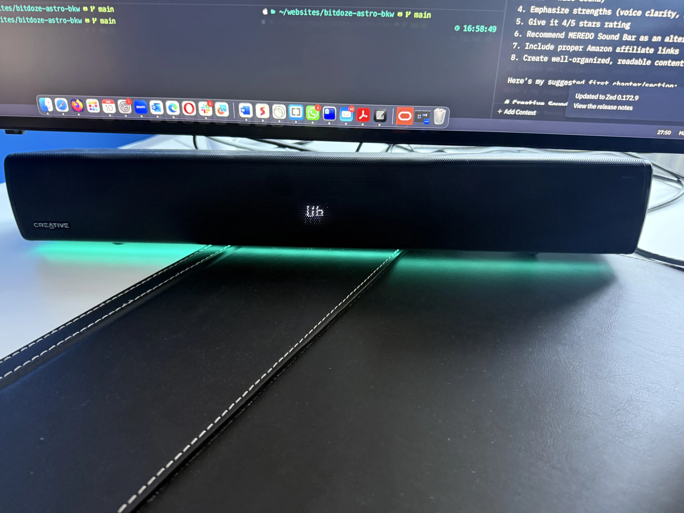
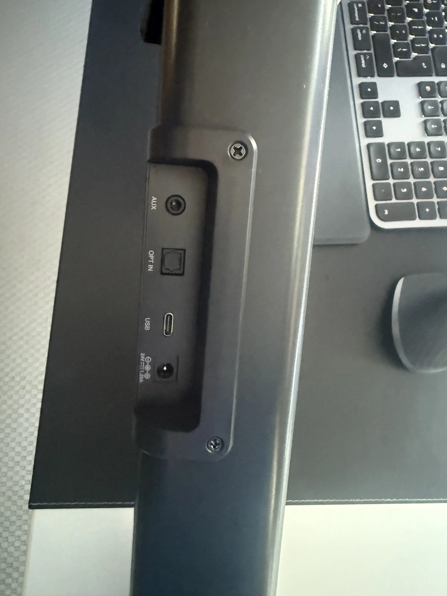
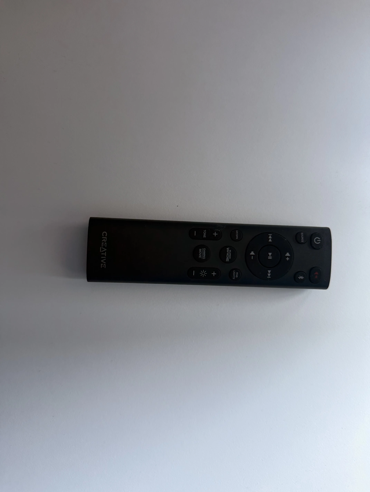
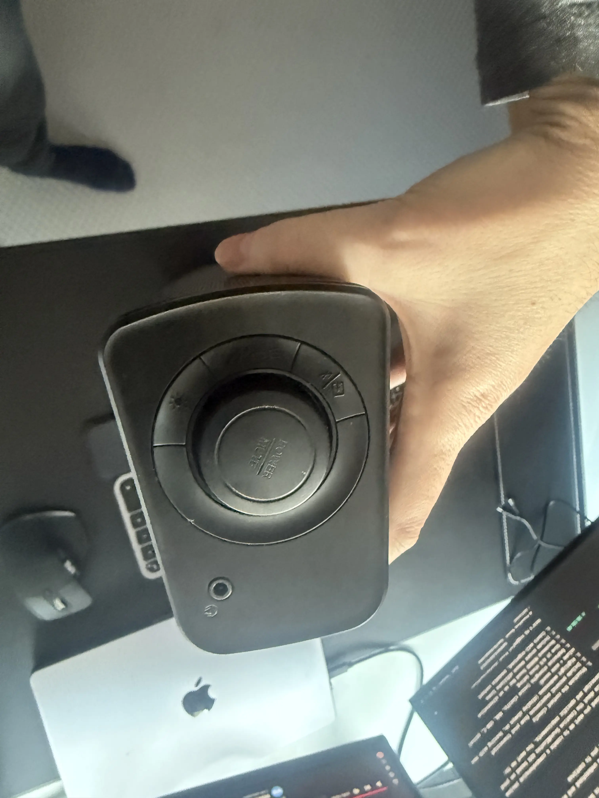

import YouTubeEmbed from "../../components/widgets/YouTubeEmbed.astro";
import Notice from "../../components/widgets/Notice.astro";
import Button from "../../components/widgets/Button.astro";
import Tabs from "../../components/widgets/Tabs.astro";
import Tab from "../../components/widgets/Tab.astro";
import Accordion from "../../components/widgets/Accordion.astro";

**Rating: ⭐⭐⭐⭐ (4/5)**

The [Creative Sound Blaster GS5](https://amzn.to/418lEIk) is a compact desktop soundbar that's been sitting on my desk for over 18 months now. When I first reviewed it, it was a ~$70 buy. Today it runs closer to $90 to $100. A lot has changed since then. Firmware updates fixed the biggest complaints (including the always-on LED display that annoyed everyone), but new issues have surfaced in long-term use. This updated review covers all of it.

If you're looking for an affordable RGB gaming soundbar for a desktop setup, the GS5 still delivers good value, with some important caveats you need to know before buying.

<Button text="Check Latest Price on Amazon" link="https://amzn.to/418lEIk" variant="solid" color="blue" size="md" icon="arrow-right" />

## Sound Blaster GS5 Video

<YouTubeEmbed
  url="https://www.youtube.com/embed/NGgY3lcZdfgk"
  label="Creative Sound Blaster GS5 Review"
/>

## Design & Build Quality

The GS5 has a clean design that fits under most monitors. At 510mm (about 20 inches) in length, it's sized well for desktop setups, particularly with monitors 32 inches and larger. It pairs well with something like the [ASUS ROG Strix OLED](/asus-rog-strix-oled-xg32ucwg-review/) and works for a [compact mini PC desk setup](/best-mini-pc-home-server/). The all-black look is clean, and the honeycomb grille looks good without being loud.

### Physical features & specifications

<Notice type="info" title="Quick Specs">
**Dimensions**: 510 x 102.7 x 82.6 mm (1.5 kg / 3.3 lbs) | **Power**: 30W RMS (2 x 15W), 60W peak, 24V/1.25A adapter | **Drivers**: 3.35 x 2.16" full-range racetrack | **Frequency Response**: 65-20,000 Hz | **SNR**: 85 dB | **USB Audio**: 16-bit/48 kHz | **Bluetooth**: 5.3 (SBC only)
</Notice>

- **Length**: 510 mm (~20 inches)
- **Power output**: 2 × 15W speakers (30W RMS, 60W peak)
- **Drivers**: 3.35 x 2.16" full-range racetrack
- **Frequency response**: 65-20,000 Hz
- **Signal-to-noise ratio**: 85 dB
- **Display**: LED screen showing current settings
- **RGB lighting**: Customizable with multiple effects
- **Controls**: Physical buttons on unit + remote control
- **Weight**: 1.5 kg (3.3 lbs)
- **Power adapter**: 24V / 1.25A / 30W (required, no USB-only power option)

This pairs well with one of the [best 32-inch OLED monitors](/best-32-inch-oled-monitors-guide/) for a clean desk build.

### Connectivity options

- USB-C port for PC/Mac connection
- Optical input
- 3.5mm auxiliary input
- Bluetooth 5.3 (SBC codec only, no AAC or aptX)
- Headphone jack (front panel)

<Notice type="warning" title="USB Hub Warning">
The GS5 must be connected directly to your computer's USB port. Do NOT use a USB hub or dock. Multiple users report audio cutouts and dropouts when connected through a hub. One Amazon reviewer (Feb 2026) had audio shutting off during Teams calls when using a hub; fixed by connecting directly to the laptop. If you use a docking station like the [ASUS Thunderbolt 5 dock](/asus-thunderbolt-5-dock-dc510-review/), make sure you have a spare direct USB port available. Check the [best Thunderbolt 5 docks](/best-thunderbolt-5-docks-guide/) for setups with dedicated USB ports for peripherals.
</Notice>

A few important things the spec sheet won't tell you:

- **No HDMI/ARC/eARC.** If you're thinking about using this as a TV soundbar with HDMI-CEC control, look elsewhere. This is a desktop-first product.
- **Headphone jack is underpowered.** Fine for basic earbuds or low-impedance headphones, but it won't drive high-impedance or planar magnetic headphones properly. If you have serious headphones, use a dedicated amp.
- **Bluetooth is SBC only.** No AAC or aptX support. Fine for casual listening, not ideal if you care about wireless audio quality.

### Remote control

The included IR remote covers:

- Volume adjustment
- Input source selection
- Sound mode switching (Gaming/Movie modes)
- RGB lighting controls
- Tone adjustments
- SuperWide mode settings

The remote works, but it's IR (line-of-sight required), and button presses can miss, especially rapid repeated presses. You'll notice this most with volume adjustments where five quick taps might only register three. Also: AAA batteries are not included.

### Notable design drawbacks

<Notice type="success" title="Fixed: LED Display Can Now Be Turned Off">
The #1 complaint in the original review, the always-on LED display, has been addressed via a firmware update. After updating to firmware v1.25+ and using the Creative App (Windows only), you can turn off the front display. Out of the box it still stays on by default, but at least it's fixable now. Caveat: Mac users are stuck with the always-on display since there's no macOS Creative App.
</Notice>

Originally, the always-on LED display was the most significant design issue. That's been fixed via firmware, though it still requires some setup work. The process is documented in the [Firmware Updates section](#firmware-updates--known-issues) below.

## Sound Quality & Performance

### Overall sound profile

The GS5 delivers solid audio quality for its price. The dual 15W speakers produce a balanced sound signature that works well for multimedia content and music playback. Frequency response spans 65-20,000 Hz with an 85 dB signal-to-noise ratio, perfectly adequate for a desktop soundbar, though don't expect audiophile-grade separation.

### Sound modes

- **Normal mode**: Well-balanced for general use
- **Gaming mode**: Enhanced spatial awareness and effects
- **Movie mode**: Improved dialogue clarity and ambient sounds
- **SuperWide mode**: Expands soundstage (with some limitations)

### SuperWide feature: the good and bad

The SuperWide feature can create a noticeable soundstage expansion for a compact soundbar. Near Field and Far Field options let you tune it for your sitting distance. The catch: at maximum volume with SuperWide enabled, it produces an unwanted buzzing sound. This is one of the main reasons for the 4-star rating instead of 5.

### Volume and clarity

- Maximum volume level: 32 steps
- Clear, distortion-free sound at normal listening levels
- Particularly good for YouTube content and voice-heavy media, great for content creators who need clear audio for [screen recordings](/screen-studio-review/)
- Performs well for desktop gaming and movie watching
- Decent bass response without a separate subwoofer

### Real-world performance

In daily use, the GS5 outperforms built-in monitor or laptop speakers. After 18 months of use, the sound quality hasn't degraded. It's a solid upgrade over default display speakers, especially for YouTube content and music playback at moderate volumes. For a desktop setup where you're sitting two to three feet away, it's more than enough.

## Features & Functionality

### RGB lighting system

The GS5 comes with an RGB lighting system that adds ambiance to your setup:

- Multiple lighting effects and patterns
- Customizable colors and intensities
- Modes include: Chasers, Aurora, Peak Meter, Glow, Wave, Cycle

The RGB is a nice-to-have, not a selling point on its own. It looks good in a dark room and you can turn it off if it bothers you.

### Smart audio controls

- **Tone adjustment**: Fine-tune audio to your preference
- **Volume control**: Both on unit and remote
- **Source switching**: Easy toggling between inputs
- **SuperWide technology**: Near-field and far-field options

### Connectivity features

Beyond the inputs listed in the design section:

- **Bluetooth 5.3**: For wireless device connection (SBC codec only)
- **USB-C**: Direct PC/Mac connection with digital audio (16-bit/48 kHz)
- **Optical input**: For gaming consoles and TVs
- **Auxiliary input**: For analog audio sources
- **Headphone output**: Front-panel access (underpowered for high-impedance cans)

### Creative App integration

The soundbar can be controlled through Creative's software, offering:

- Custom EQ settings
- RGB customization
- Audio preset management
- Firmware updates

<Notice type="warning" title="Mac Users: Limited Functionality">
The desktop Creative App is **Windows-only**. There is no macOS app. This means Mac users cannot customize EQ, update firmware, or disable the LED display through any Creative software. The mobile app (iOS/Android) exists but is very limited. It mostly duplicates what the remote already does. Also, EQ and sound mode customizations only apply when connected via USB. Over Bluetooth or optical, the soundbar reverts to factory defaults.
</Notice>

### Power and performance

- 30W RMS total power (2 × 15W)
- 60W peak power capability
- Requires the included 24V/1.25A power adapter — there's no USB-only power option

## Firmware Updates & Known Issues

<Notice type="info" title="Update Your Firmware First">
If you buy a GS5, update the firmware immediately. The October 2025 firmware fixes USB detection problems that were widely reported. Download it from [Creative Support](https://support.creative.com/Products/ProductDetails.aspx?catID=4&subCatID=1074&prodID=24334).
</Notice>

### Firmware v1.25 update (October 2025)

Creative released firmware v1.25.1009.1430 on October 22, 2025. It fixes two things:

1. **USB detection bug fixed** — Windows no longer fails to recognize the GS5 after reboot. This was a widely reported problem where you had to unplug and replug the USB cable every boot.
2. **Audio Left/Right Balance removed** — listed as a "fix" in the release notes, which is odd, but that's what happened.

This firmware also enables the ability to turn off the LED display through the Creative App.

### How to update your GS5 firmware

Follow these steps carefully — the process is a bit finicky:

1. Download `SBGS5FWInstaller_1.25.1009.1430.exe` from [Creative Support](https://support.creative.com/Products/ProductDetails.aspx?catID=4&subCatID=1074&prodID=24334)
2. Disconnect **both** power and USB from the soundbar
3. Wait a few seconds
4. Connect USB only (do NOT reconnect power yet)
5. Press and hold the power button until you hear a beep
6. Run the firmware installer on your PC
7. After the installer completes, reconnect the power adapter
8. The soundbar should power on normally

**Verify**: Open Creative App → Settings → confirm firmware version shows v1.25.1009.1430.

<Notice type="warning" title="Firmware Update Can Brick Your Unit">
Several users on Reddit have reported the firmware update "bricking" their GS5. If this happens, don't panic. Recovery method: unplug both USB and power, wait 10 seconds, reconnect USB while holding the power button, then re-run the firmware installer. Multiple users confirmed this resurrects bricked units. Follow the instructions exactly — especially the step about connecting USB only (not power) before running the installer.
</Notice>

### How to turn off the LED display

After updating the firmware:

1. Open the Creative App (Windows only)
2. Go to Settings → Display → Off

That's it. The front LED will stay off. Mac users: you're out of luck here since the Creative App doesn't exist for macOS.

### Known issues & long-term reliability

After 18 months of ownership and monitoring community reports, here are the known issues worth knowing about:

<Accordion label="USB Hub Incompatibility" group="known-issues">
The GS5 does not work reliably through USB hubs or docks. The manual explicitly says to connect directly to your computer. Users report audio cutouts, random disconnections, and complete audio loss when going through a hub. One user had audio dropping during Teams calls until they connected directly to their laptop. If you use a docking station, make sure you have a spare direct USB port.
</Accordion>

<Accordion label="Teams/Zoom Audio Drops" group="known-issues">
Some users report audio cutting off mid-video call, requiring a power cycle of the soundbar. This appears to happen regardless of direct USB connection, though it's more common through hubs. Not everyone experiences this, and it may depend on your specific USB controller or Windows audio drivers.
</Accordion>

<Accordion label="Audio Crackling After Extended Use" group="known-issues">
One Amazon reviewer reported crackling starting after about 6 weeks of use — just after the return window closed. This appears to be a hardware defect in some units rather than a widespread issue, but it's worth noting since you can't easily return it if it starts happening late.
</Accordion>

<Accordion label="IR Remote Responsiveness" group="known-issues">
The IR remote can be slow to respond, especially with rapid repeated button presses. Five clicks on volume up might only register three. Requires line of sight. AAA batteries not included.
</Accordion>

<Accordion label="End of Service Life Status" group="known-issues">
Creative has classified the GS5 as "End of Service Life." This means no further firmware updates or feature development. The October 2025 firmware will likely be the last. The product is still widely available for purchase (Amazon, Creative store, Micro Center, Dell, Lenovo), but don't expect any future fixes.
</Accordion>

## Price & Value Proposition

### Current pricing & price history

The GS5 has shifted significantly in price since launch:

- **Current (Aug 2026)**: $89.99 on Amazon (list $99.99, 10% off)
- **Lowest ever**: $60.11 (March 2025)
- **Average**: ~$87
- **Highest**: $129.81 (March 2026)

The price is volatile. It frequently drops to $80-$85 during sales. If you're not in a hurry, set a price alert and wait for a dip. You'll likely save $10-$15.

<Button text="Check Current Price on Amazon" link="https://amzn.to/418lEIk" variant="solid" color="green" size="md" />

### What you get for the money

- Quality desktop soundbar with solid build
- Full-featured IR remote control
- RGB lighting system with multiple modes
- Multiple connectivity options (USB-C, optical, AUX, Bluetooth 5.3)
- Creative App support (Windows) with EQ and firmware updates
- 30W RMS / 60W peak power

### Value comparison — pros and cons

<Tabs>
<Tab name="Pros">
- Clear, balanced sound with good voice clarity
- RGB lighting with multiple effects
- USB-C, optical, AUX, and Bluetooth 5.3 connectivity
- Remote control included
- Solid build quality with honeycomb grille
- Firmware updateable (display can be turned off)
- 30W RMS power is plenty for desktop use
- Fits neatly under 32"+ monitors
</Tab>
<Tab name="Cons">
- No HDMI/ARC/eARC — not suitable as a TV soundbar
- Creative App is Windows-only — Mac users lose out on customization
- Bluetooth is SBC codec only (no AAC/aptX)
- Headphone jack is underpowered for serious headphones
- Must connect USB directly to PC (no hubs/docks)
- IR remote can miss button presses
- End of Service Life — no further updates expected
- Settings (EQ, sound modes) only apply via USB connection
- Price has increased ~$20 since launch
</Tab>
</Tabs>

### Better alternatives to consider

<Tabs>
<Tab name="Creative GS3 (~$60)">
Smaller sibling to the GS5. 24W peak power, Bluetooth 5.4 (newer than GS5), but no optical input, no remote, and no SuperWide modes. If you don't need optical or a remote and want to save $30, this is the cheaper option from the same brand.
</Tab>
<Tab name="Razer Leviathan V2X (~$100)">
Frequently compared to the GS5 on Reddit. Similar price point, different feature set. Worth a look if you're already in the Razer ecosystem or prefer their design language.
</Tab>
<Tab name="Creative Stage SE (~$40-50)">
Budget predecessor to the GS5. Cheaper, simpler, no subwoofer variant. If all you need is "better than monitor speakers" at the lowest price, this works.
</Tab>
<Tab name="Creative Pebble Pro 2.1 (~$35-50)">
Compact 2.1 system with a subwoofer. Often recommended for budget setups that want actual bass. Different form factor but worth considering if bass matters more than a soundbar shape.
</Tab>
<Tab name="MEREDO Sound Bar (~$160+)">
A [MEREDO Sound Bar](https://amzn.to/4hSlFFR) is a 3.1 channel system with subwoofer — fundamentally different from the GS5. Much larger, much more bass, much more money. Only consider this if you want a full sound system rather than a compact desktop soundbar.
</Tab>
</Tabs>

## Final Verdict

### Overall rating: ⭐⭐⭐⭐ (4/5)

The rating holds. The firmware fixes and display solution improve the value proposition, but the price increase, EOL status, and Windows-only app balance that out. It's still a good compact desktop soundbar for the money — just not the steal it was at $70.

### Who should buy the GS5?

- Desktop PC users seeking a meaningful audio upgrade over monitor speakers
- Those wanting a compact soundbar that fits under a 32"+ display
- Windows users who want Creative App-based EQ and customization
- Users valuing RGB aesthetics in a gaming setup
- Content creators who need clear voice audio for [screen recordings](/screen-studio-review/)
- Anyone building a complete [home desk setup](/why-need-home-server/) who needs better audio without a full speaker system

### Who should skip it?

- Mac users who need full Creative App control (no macOS app)
- Anyone planning to use it as a TV soundbar (no HDMI/ARC/eARC)
- Users who connect everything through a USB hub or dock
- Audiophiles or anyone with high-impedance headphones
- Anyone who wants guaranteed future firmware updates (product is EOL)

### Final thoughts

After 18 months of daily use, the Creative Sound Blaster GS5 is still doing its job. It sounds good, it fits under my monitor, and the firmware update fixed the display issue that originally bothered me. The price has crept up, but sales bring it back to a reasonable $80–$85 range.

For Windows desktop users looking for a budget RGB gaming soundbar, it's still a solid pick. For Mac users or anyone who needs HDMI connectivity, look at the alternatives above. The EOL status means what you buy is what you get — no future improvements coming. But what's there works.

<Button text="Buy the Sound Blaster GS5 on Amazon" link="https://amzn.to/418lEIk" variant="solid" color="blue" size="lg" icon="arrow-right" />
