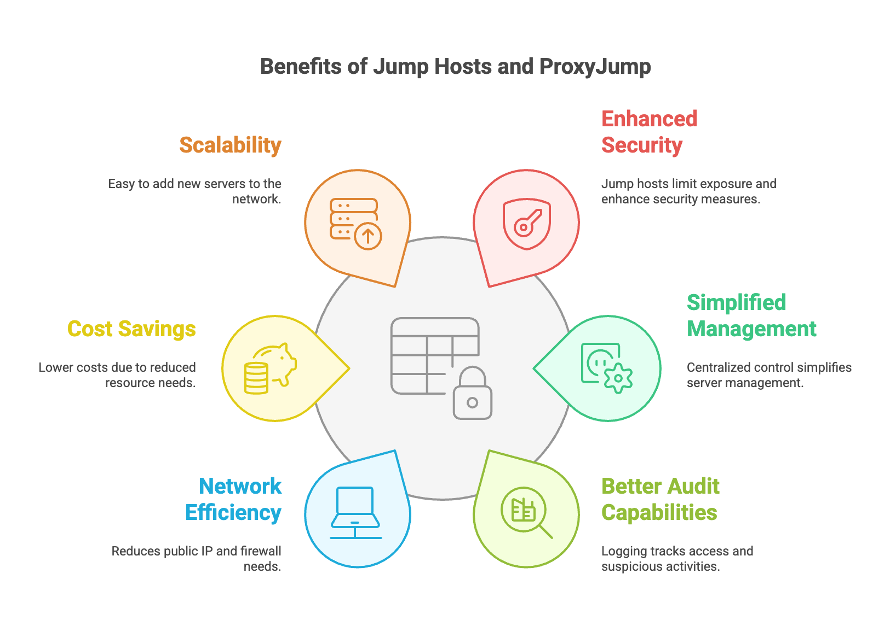
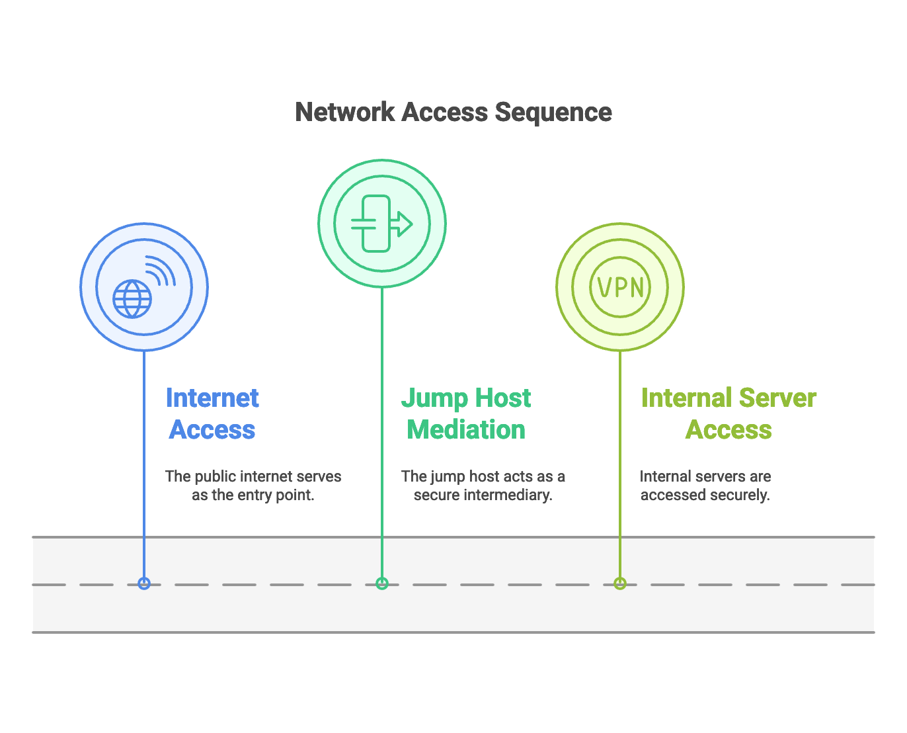
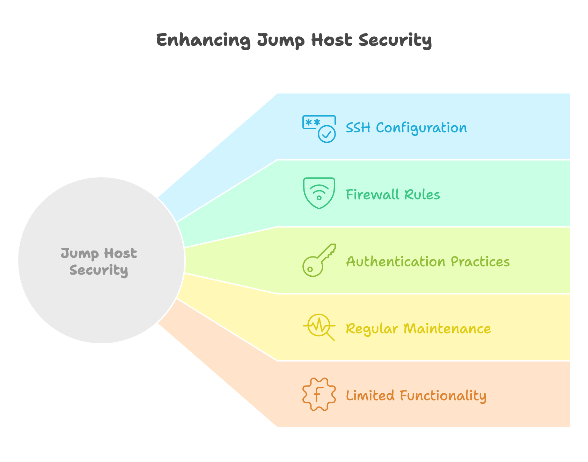

import Button from "@components/widgets/Button.astro";
import Notice from "@components/widgets/Notice.astro";
import ListCheck from "@components/widgets/ListCheck.astro";

Accessing servers tucked away in a private network shouldn't require a VPN appliance, a browser plugin, or three hours of firewall debugging. SSH jump hosts and the built-in ProxyJump feature solve this with one command and zero extra software.

A jump host is a single, hardened server exposed to the internet that acts as a relay to your internal machines. Instead of leaving every server reachable from the public internet (which is like leaving all your doors unlocked), you lock everything behind one well-guarded entrance. ProxyJump, built into OpenSSH since version 7.3, turns that two-step login into a single transparent connection. Before using jump hosts, I was relying on [basic SSH security measures](https://www.bitdoze.com/secure-ssh-server-linux/), which were not enough once servers span multiple private networks.

This guide covers the full picture: how jump hosts work, how to configure ProxyJump with SSH config files, port forwarding and multiplexing through jump hosts, security hardening for bastion servers, and troubleshooting the failures you'll actually hit.



## Prerequisites

Before you start, make sure you have the following:

<ListCheck>
<ul>
<li>A VPS or dedicated server to act as your jump host (1 vCPU, 512 MB RAM, 10 GB disk is enough, SSH traffic bandwidth is negligible)</li>
<li>OpenSSH 7.3+ on your client machine (for ProxyJump support; most modern distros qualify)</li>
<li>SSH key pair generated (ed25519 recommended: `ssh-keygen -t ed25519`)</li>
<li>Comfortable with <a href="https://www.bitdoze.com/linux-commands/">basic Linux commands</a></li>
<li>Root or sudo access on the jump host to edit sshd_config and firewall rules</li>
</ul>
</ListCheck>

<Notice type="info" title="Check your OpenSSH version">
Run `ssh -V` on your client. Anything from 7.3 (2016) onwards supports ProxyJump. Ubuntu 24.04 ships 9.6p1, Debian 12 ships 9.2p1, both are fine. On the server side, OpenSSH 9.8+ gives you built-in abuse protection (PerSourcePenalties), which is covered later in this guide.
</Notice>

A jump host needs almost no resources. A [Hetzner CX22](https://go.bitdoze.com/hetzner) at ~€4/month is more than enough. [Hostinger VPS](https://go.bitdoze.com/hostinger-vps) and [Vultr](https://go.bitdoze.com/vultr) are alternatives if you need a different region or billing model.

## Understanding the basics: what is SSH?

SSH (Secure Shell) is an encrypted protocol for running commands on a remote machine as if you were sitting in front of it. Every keystroke travels through an encrypted tunnel — nobody on the wire can read it.

Basic usage:

```bash
ssh username@remote-server
# For example:
ssh john@192.168.1.100
```

The connection follows a client-server model: your machine initiates, the remote machine authenticates, and from that point you have a shell. If you're new to server management, check out how to [secure your SSH server](https://www.bitdoze.com/secure-ssh-server-linux/) before exposing anything to the internet.

The straightforward connection works fine when the target has a public IP and you can reach port 22. What about servers in private subnets with no public address? That's where jump hosts come in.

## What is a jump host (or bastion host)?

A jump host (also called a bastion host) is a dedicated server that acts as the single gateway to your internal network. Think of it as the secure lobby in a building: everyone checks in through one well-guarded entrance instead of wandering in through random doors.

Here's a typical setup:

```
Internet -> Jump Host -> Internal Servers
(Public)    (Public)    (Private)
```



To reach an internal server through a jump host manually, you'd do:

```bash
# First, connect to the jump host
ssh jumpuser@jump-host.example.com

# Then, from the jump host, connect to the internal server
ssh internaluser@internal-server
```

This two-step process works, but it's clunky. You have to manage credentials on the jump host, sessions are nested, and file transfers require extra hops. The main reasons to use a jump host despite the friction:

1. **Single exposure point**: only the jump host has a public IP, reducing your attack surface to one machine
2. **Centralized access control**: all connections flow through one place, making it easier to grant and revoke access
3. **Audit trail**: you can track who connected to what and when, all from one log
4. **Simplified firewall rules**: only the jump host needs SSH open to the internet

## Introducing SSH ProxyJump: a simpler way to use jump hosts

ProxyJump was introduced in OpenSSH 7.3 (2016) and it eliminated the two-step dance. Instead of manually connecting to the jump host and then to your target, you do it all in one command:

```bash
# Old way (two separate connections):
ssh jumpuser@jumphost
ssh internaluser@internal-server

# With ProxyJump (one command):
ssh -J jumpuser@jumphost internaluser@internal-server
```

The `-J` flag tells SSH to tunnel through the jump host transparently. Your session connects directly to the target server, but the traffic is relayed through the bastion. From the user's perspective it feels like a normal SSH session.

You can chain multiple jump hosts with commas:

```bash
# Going through two jump hosts
ssh -J user1@jump1.com,user2@jump2.com target_user@final-server.com
```

<Notice type="info" title="scp and sftp also support -J">
Since OpenSSH 8.0 (2019), `scp` and `sftp` accept the `-J` flag too. Copy files through a jump host with:
`scp -J user@jump local-file.txt target-user@target:/path/`
</Notice>

<Notice type="info" title="ProxyCommand for older clients">
If you're stuck on a pre-7.3 client, the legacy equivalent is:
`ssh -o ProxyCommand="ssh -W %h:%p user@jump" user@target`
This is rarely needed today — even CentOS 7 ships OpenSSH 7.4.
</Notice>

<Notice type="warning" title="Avoid agent forwarding with jump hosts">
Do not use `ForwardAgent yes` with jump hosts. If the jump host is compromised, an attacker can hijack your forwarded agent and authenticate as you to other servers. ProxyJump is safer because your private keys never leave your local machine — the jump host only relays encrypted traffic.
</Notice>

OpenSSH is built into Windows 10 and 11 (Settings > Optional Features > OpenSSH Client). ProxyJump works the same way on Windows.

## SSH ProxyJump configuration with SSH config file

Typing `-J` every time gets old fast. The `~/.ssh/config` file makes ProxyJump persistent:

```bash
# Jump host configuration
Host jumphost
    HostName jump.example.com
    User admin
    IdentityFile ~/.ssh/jump_key
    IdentitiesOnly yes

# Target server using the jump host
Host internal-server
    HostName 192.168.1.100
    User ubuntu
    ProxyJump jumphost
    IdentityFile ~/.ssh/internal_key
    IdentitiesOnly yes
```

After this, connecting is just:

```bash
ssh internal-server
```

You can use wildcards for multiple internal servers:

```bash
# In ~/.ssh/config
Host *.internal
    ProxyJump jumphost
    IdentitiesOnly yes
```

Now `ssh server1.internal` and `ssh server2.internal` both route through the jump host automatically.

`IdentitiesOnly yes` is important here — it tells SSH to only use the explicitly configured key, not every key loaded in ssh-agent. Without this, SSH tries keys one by one and you'll hit the ["too many authentication failures"](https://www.bitdoze.com/fix-ssh-too-many-authentication-failures/) error once you accumulate enough keys in your agent.

Make sure your config file has the right permissions:

```bash
chmod 600 ~/.ssh/config
```

<Notice type="info" title="Safer host key checking for automated workflows">
For scripted or CI connections where you can't interactively accept host keys, use `StrictHostKeyChecking=accept-new` instead of `=no`. It automatically accepts new host keys but **rejects changed keys**, so you still get warned if a server's key changes (which could indicate a MITM attack). Available since OpenSSH 7.6.

`ssh -o StrictHostKeyChecking=accept-new -J user@jump target@server`
</Notice>

## Port forwarding through SSH jump hosts

ProxyJump works with SSH port forwarding flags, which lets you access internal services that aren't SSH — databases, web UIs, monitoring dashboards. If you want a deeper dive into tunneling, see [SSH port forwarding techniques](https://www.bitdoze.com/ssh-tunneling-linux/).

### Local port forwarding (-L)

Access a PostgreSQL database on an internal server from your local machine:

```bash
ssh -L 5432:db.internal:5432 -J user@jump target-user@target
```

This binds local port 5432 to the database port on `db.internal` (which the target can reach). Connect to `localhost:5432` with any PostgreSQL client and the traffic is tunneled through the jump host.

### Remote port forwarding (-R)

Expose a local service to the internal network:

```bash
ssh -R 8080:localhost:80 -J user@jump target-user@target
```

This makes your local port 80 accessible on the target's port 8080.

### SOCKS proxy (-D)

Browse the web through the internal network:

```bash
ssh -D 1080 -J user@jump target-user@target
```

Configure your browser to use `localhost:1080` as a SOCKS5 proxy and all traffic routes through the jump host and target server.

## Advanced: conditional ProxyJump with Match exec

If you work from multiple locations (office LAN, home, VPN), you might want different routing — direct connection from the office, jump host from everywhere else. `Match exec` handles this:

```ssh-config
Match host internal-* !exec "ip addr show en0 | grep -q 192.168.1."
    ProxyJump home-bastion

Host internal-*
    ProxyJump office-bastion
```

<Notice type="info" title="Match exec runs on every connection">
The `exec` command runs on your client before each SSH connection. It adapts automatically — no manual switching needed. Replace `en0` and `192.168.1.` with your actual interface and subnet. On Linux the interface is typically `eth0` or `wlan0`.
</Notice>

## Advanced: SSH multiplexing with jump hosts

If you connect through a jump host frequently (Ansible, rsync, multiple terminals), multiplexing saves a lot of time. SSH can reuse a single connection to the jump host instead of re-authenticating every time:

```ssh-config
Host jumphost
    HostName jump.example.com
    User admin
    ControlMaster auto
    ControlPath ~/.ssh/cm-%r@%h:%p
    ControlPersist 10m
```

`ControlMaster auto` tells SSH to create a persistent socket on the first connection and reuse it for subsequent connections. `ControlPersist 10m` keeps the socket open for 10 minutes after the last session closes.

You can also add multiplexing on the target side:

```ssh-config
Host *.internal
    ProxyJump jumphost
    ControlMaster auto
    ControlPath ~/.ssh/cm-%r@%h:%p
    ControlPersist 5m
```

The result: the first `ssh internal-server` authenticates normally. Any connection to `*.internal` within 5 minutes jumps straight through the already-open tunnel. This makes Ansible playbooks through jump hosts dramatically faster.

## Security hardening for SSH jump hosts

Your jump host is the front door to your infrastructure. If it's compromised, every internal server is potentially reachable. This section covers how to lock it down properly.



### sshd_config for bastion hosts

Drop this into `/etc/ssh/sshd_config.d/50-bastion.conf` on your jump host:

```bash
# /etc/ssh/sshd_config.d/50-bastion.conf

# Authentication
PermitRootLogin no
PasswordAuthentication no
KbdInteractiveAuthentication no
PubkeyAuthentication yes
AuthenticationMethods publickey

# Session limits
MaxSessions 2
MaxStartups 10:30:60
UnusedConnectionTimeout 2m

# Forwarding (allowed for jump users, restricted via Match blocks below)
AllowTcpForwarding yes
X11Forwarding no
PermitTunnel no
AllowAgentForwarding no
```

<Notice type="warning" title="Don't run Docker on your bastion">
Docker manipulates iptables directly and can punch holes through your carefully crafted firewall rules. Keep the jump host lean — SSH and nothing else. If you run Docker elsewhere on your network, read about [how Docker bypasses firewall rules](https://www.bitdoze.com/docker-bypasses-firewall/) so you understand the risk.
</Notice>

### PerSourcePenalties: built-in abuse protection

<Notice type="success" title="Built-in since OpenSSH 9.8">
Since OpenSSH 9.8 (July 2024), sshd has built-in IP penalties for repeated authentication failures, incomplete connections, and crash triggers. This is **enabled by default** — you don't need to configure anything. It reduces the need for fail2ban on bastion hosts, though they work well together for additional protection.
</Notice>

PerSourcePenalties temporarily blocks IPs that show attack patterns. The default thresholds work for most setups. You can tune them:

```bash
# In /etc/ssh/sshd_config.d/50-bastion.conf (optional)
PerSourcePenalties penalty=crash:2h,authfail:1h,noauth:1h
PerSourcePenaltyExemptList 10.0.0.0/8
```

### Dedicated jump users with Match blocks

Create a restricted group for jump users on the bastion:

```bash
# In /etc/ssh/sshd_config.d/50-bastion.conf
Match Group jumpusers
    AllowTcpForwarding yes
    X11Forwarding no
    PermitTunnel no
    MaxSessions 2
    AuthenticationMethods publickey
```

For non-jump service accounts (backups, monitoring), lock them down further:

```bash
Match User backup
    DisableForwarding yes
    PermitTTY no
    ForceCommand /usr/local/bin/authorized-backup
```

Create the group and user:

```bash
sudo groupadd jumpusers
sudo usermod -aG jumpusers your-jump-user
```

### Firewall configuration

UFW rules for the jump host — deny everything except SSH from known IPs:

```bash
sudo ufw default deny incoming
sudo ufw default allow outgoing
sudo ufw allow from 203.0.113.50/32 to any port 22
sudo ufw enable
sudo ufw status verbose
```

Replace `203.0.113.50` with your office/home IP. If your IP changes frequently, consider a VPN or dynamic DNS-based allow rule.

### Authentication best practices

Generate a strong ed25519 key:

```bash
ssh-keygen -t ed25519 -a 100
```

The `-a 100` flag increases KDF rounds, which slows brute-force attacks on the key file. Note: it only has effect when you set a passphrase on the key. Always set a passphrase.

For high-security bastions, consider FIDO2 hardware keys (`ed25519-sk` or `ecdsa-sk`):

```bash
ssh-keygen -t ed25519-sk -O resident
```

This requires a hardware security key (YubiKey, etc.) for every authentication. Private key material stays on the hardware token — even if the bastion is compromised, the key can't be extracted.

### Keep your bastion updated

- Run `sudo apt update && sudo apt upgrade -y` regularly (or set up `unattended-upgrades`)
- Monitor SSH logs: `journalctl -u sshd --since -1h`
- Review authorized keys periodically
- Keep the host lean — no extra packages, no extra services

For intrusion prevention beyond PerSourcePenalties, consider [securing your VPS with CrowdSec](https://www.bitdoze.com/crowdsec-secure-server/).

## Verification: testing your setup

Don't wait for production to find problems. Test your configuration before relying on it.

<Notice type="info" title="Always test sshd config before restarting">
Run `sudo sshd -t` before `sudo systemctl restart sshd`. A syntax error in your config can lock you out of your bastion host. If you're making changes over SSH itself, keep a second session open while editing.
</Notice>

```bash
# Check OpenSSH version (client and server)
ssh -V

# Dump the effective config for a host alias
ssh -G internal-server

# Test connection with verbose output
ssh -vv -J jumpuser@jump targetuser@target

# Verify jump host sshd settings
sudo sshd -T | grep -E 'AllowTcpForwarding|PermitTunnel|MaxSessions|PerSourcePenalties'

# Test config syntax without restarting
sudo sshd -t

# Check that the jump users group exists
getent group jumpusers
```

If `ssh -G internal-server` shows `proxyjump jumphost` in the output, your config is being read correctly. If it shows nothing, check your config file path and permissions.

## Troubleshooting SSH ProxyJump connections

### Connection refused

```bash
ssh: connect to host jump-host port 22: Connection refused
```

Check if sshd is running and the port is open:

```bash
sudo systemctl status sshd
sudo ufw status
# or
sudo iptables -L -n

# Test the port directly
nc -zv jump-host 22
```

If the port is open but connections are refused, check `/var/log/auth.log` for startup errors. For more on port checking, see [how to check remote ports](https://www.bitdoze.com/check-remote-port-in-linux-nc/).

### Authentication issues

```bash
Permission denied (publickey)
```

Verify key permissions and that the right key is being offered:

```bash
chmod 700 ~/.ssh
chmod 600 ~/.ssh/id_ed25519
chmod 644 ~/.ssh/id_ed25519.pub

# Check which keys SSH is trying
ssh -vv -J jumpuser@jumphost targetuser@target 2>&1 | grep "Offering\|Trying"
```

If you see too many keys being tried, add `IdentitiesOnly yes` to the relevant Host block in `~/.ssh/config`. This is the most common fix for the ["too many authentication failures"](https://www.bitdoze.com/fix-ssh-too-many-authentication-failures/) error.

### ProxyJump not working

```bash
# Check SSH version (needs 7.3+)
ssh -V

# Dump effective config for the host
ssh -G internal-server

# Test with full verbose output
ssh -vvv -J jumpuser@jumphost targetuser@target
```

Look for lines like `proxyconnect: establishing to jump.example.com:22` in the verbose output. If you don't see ProxyJump being invoked, your config syntax might be wrong.

Common config mistakes:

```bash
# Wrong keywords (case-sensitive):
Host jumphost
    Hostname jump.example.com   # WRONG — should be HostName
    Username admin              # WRONG — should be User
```

### Permission denied after host key change

If the jump host or target was reinstalled, you'll see a warning about the host key changing:

```bash
@@@@@@@@@@@@@@@@@@@@@@@@@@@@@@@@@@@@@@@@@@@@@@@@@@@@@@@@@@@
@    WARNING: REMOTE HOST IDENTIFICATION HAS CHANGED!     @
@@@@@@@@@@@@@@@@@@@@@@@@@@@@@@@@@@@@@@@@@@@@@@@@@@@@@@@@@@@
```

If the change is expected (server rebuild, migration), remove the old key:

```bash
ssh-keygen -R jump-host.example.com
```

Then reconnect and accept the new key. If the change was not expected, investigate before proceeding — it could indicate a man-in-the-middle attack.

### Network connectivity

```bash
# Basic connectivity
ping jump-host

# Port check
nc -zv jump-host 22

# Route trace
traceroute jump-host
```

If you can reach the jump host but not the internal target, the problem is likely on the jump host's side — check its firewall rules, `AllowTcpForwarding` setting, and that the internal server is reachable from the jump host's network.

## Conclusion

SSH jump hosts and ProxyJump are the standard way to access servers in private networks without exposing everything to the internet. Here's the quick reference:

```bash
# One-time connection
ssh -J jumpuser@jumphost targetuser@internal-server

# Persistent config (~/.ssh/config)
Host internal-server
    HostName internal-server
    User targetuser
    ProxyJump jumphost
    IdentitiesOnly yes
    IdentityFile ~/.ssh/internal_key
```

Key takeaways:

- One hardened entry point beats exposing every server
- ProxyJump makes the jump transparent — `ssh internal-server` and you're in
- `~/.ssh/config` with wildcards handles dozens of servers with one rule
- Lock down the bastion: no root login, no passwords, no Docker, minimal services
- OpenSSH 9.8+ gives you PerSourcePenalties for free — use it
- Test with `ssh -G` and `ssh -vv` before relying on the setup

If you're managing multiple servers, [best self-hosted panels](https://www.bitdoze.com/best-self-hosted-panels/) can help with the broader picture, and the [Linux commands reference](https://www.bitdoze.com/linux-commands/) covers the tools you'll use alongside SSH. For managing SSH connections from a GUI, [Nexterm](https://www.bitdoze.com/nexterm-docker-install/) is worth a look.

<Button text="SSH Tunneling Deep Dive" link="/ssh-tunneling-linux/" variant="outline" color="blue" size="md" icon="arrow-right" />
