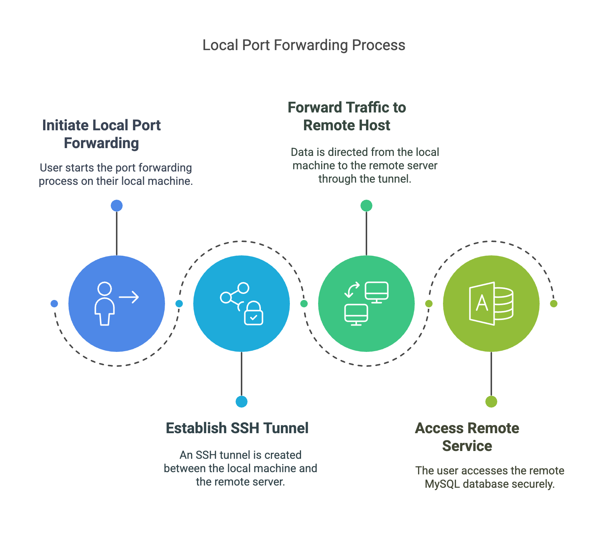
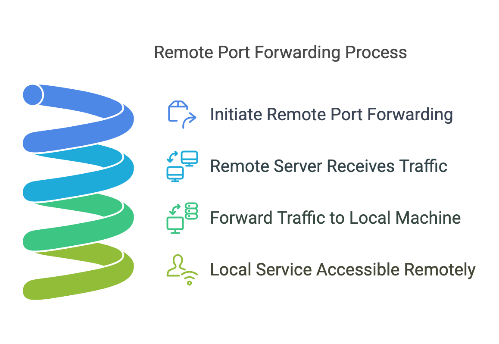
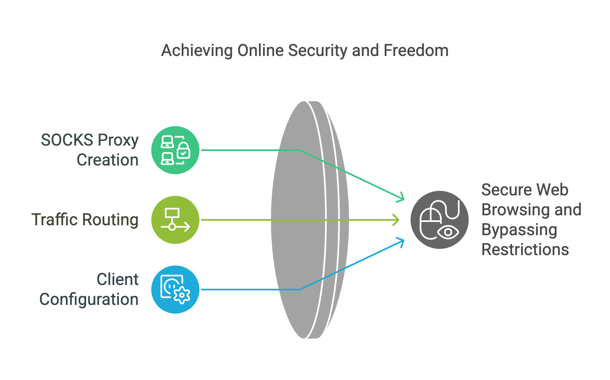

import Notice from "@components/widgets/Notice.astro";
import Accordion from "@components/widgets/Accordion.astro";
import Tabs from "@components/widgets/Tabs.astro";
import Tab from "@components/widgets/Tab.astro";

SSH port forwarding (also called SSH tunneling) lets you route network traffic through an encrypted SSH connection. It solves a common operator problem: accessing a private database on a VPS, exposing a local dev server temporarily, or browsing securely over untrusted Wi-Fi, all without opening extra ports to the public internet.

SSH port forwarding comes in three flavors (local, remote, and dynamic), each serving different scenarios. This guide covers all three, plus the operational bits that most tutorials skip: keeping tunnels alive with systemd, defining reusable tunnels in `~/.ssh/config`, chaining through jump hosts, and locking down forwarding permissions.


## Types of SSH port forwarding

SSH port forwarding comes in three types, each serving specific use cases. Understanding their differences helps you pick the right one.

### Local port forwarding



Local port forwarding lets you forward a port on your local machine to a specific port on a remote server. This is the most common type — use it to securely access services running on a remote server from your local machine.

- **How it works**: Your local machine forwards traffic to a remote host via an SSH tunnel.
- **Use case**: Securely accessing a remote MySQL database server from your local machine.

### Remote port forwarding



Remote port forwarding does the opposite. It forwards a port on the remote server back to a specific port on your local machine. This allows a remote user or server to access services running locally on your system.

- **How it works**: The remote server sends traffic back to the specified local machine and port via the SSH tunnel.
- **Use case**: Exposing a local development web server so that remote stakeholders can access it.

### Dynamic port forwarding (SOCKS proxy)



Dynamic port forwarding creates a SOCKS proxy server on your local machine that dynamically routes traffic to different destinations through the SSH tunnel. This is useful for secure web browsing or bypassing network restrictions.

- **How it works**: A single local port is opened as a SOCKS proxy. You configure client applications (e.g., web browsers) to route traffic through this proxy.
- **Use case**: Bypassing regional content restrictions or securing browsing on public Wi-Fi.


## Prerequisites

Before you start, make sure you have:

1. **SSH access to a remote server**. A valid username and password, or preferably an SSH key pair. If you don't have a VPS yet, [Hetzner](https://go.bitdoze.com/hetzner) offers affordable cloud servers starting at ~4 EUR/month. See our guide on [setting up a VPS for remote access](/vps-ai-coding-setup/) if you're starting from scratch.

2. **OpenSSH installed** — Most Linux distributions ship it. Verify with:
   ```bash
   ssh -V
   ```
   If not installed: `sudo apt install openssh-client` (Ubuntu/Debian) or `sudo yum install openssh` (CentOS).

3. **Network and firewall configuration** — Ensure the ports you plan to use aren't blocked. For remote port forwarding, the SSH server must allow it — check `AllowTcpForwarding` in `/etc/ssh/sshd_config`.

4. **Port knowledge** — Know which ports your services run on (MySQL: 3306, PostgreSQL: 5432, HTTP: 80, HTTPS: 443).

<Notice type="info" title="Key generation: use Ed25519, not RSA">
Ed25519 has been the OpenSSH default since version 9.5 (October 2023). It's faster and produces smaller keys than RSA. If you're setting up SSH keys for the first time:

```bash
ssh-keygen -t ed25519 -C "your-comment"
```

RSA-4096 still works for legacy systems. Use `ssh-keygen -t rsa -b 4096` only if your target server doesn't support Ed25519.

For a full hardening walkthrough, see [hardening your SSH server](/secure-ssh-server-linux/).
</Notice>


## How to perform SSH port forwarding

<Notice type="info" title="The -f and -N flags">
Every tunnel command below includes two flags you'll use every time:

- **`-N`**: Do not execute a remote command. Without this, SSH opens an interactive shell you don't need.
- **`-f`**: Fork to the background after authentication. Without this, the tunnel blocks your terminal.

For interactive exploration (testing), omit `-f` so you can see the output. For production use, always include both.
</Notice>

### Local port forwarding

Forward a local port to a service on a remote machine:

```bash
ssh -f -N -L [local_port]:[remote_host]:[remote_port] user@remote-server
```

- `[local_port]` — Port on your local machine (e.g., 3306).
- `[remote_host]` — Address of the remote host (usually `127.0.0.1` if the service runs on the remote server itself).
- `[remote_port]` — Port of the service on the remote host.
- `user@remote-server` — SSH user and remote server address.

**Example** — Forward remote MySQL (port 3306) to your local machine:

```bash
ssh -f -N -L 3306:127.0.0.1:3306 user@remote-server
```

**Verify the tunnel is working:**

```bash
# Confirm the port is listening locally
ss -tuln | grep 3306

# Test the connection
mysql -h 127.0.0.1 -P 3306 -u username -p
```

### Remote port forwarding

Expose a local service to a remote server:

```bash
ssh -f -N -R [remote_port]:[local_host]:[local_port] user@remote-server
```

- `[remote_port]` — Port on the remote server (e.g., 8080).
- `[local_host]` — Address of your local host (usually `127.0.0.1`).
- `[local_port]` — Port of the service on your local machine (e.g., 80 for a web server).

**Example** — Expose a local web server (port 80) on the remote server at port 8080:

```bash
ssh -f -N -R 8080:127.0.0.1:80 user@remote-server
```

**Verify** — On the remote server:

```bash
ss -tuln | grep 8080
curl http://localhost:8080
```

<Notice type="warning" title="Remote forwarding needs GatewayPorts configured">
For the forwarded port to be accessible from outside the remote server (not just localhost), the SSH server needs `GatewayPorts` configured. See the [SSH Tunnel Security Best Practices](#ssh-tunnel-security-best-practices) section for the safe way to set this up.
</Notice>

### Dynamic port forwarding (SOCKS proxy)

Set up a SOCKS proxy on your local machine:

```bash
ssh -f -N -D [local_port] user@remote-server
```

- `[local_port]` — Port on your local machine for the SOCKS proxy (e.g., 1080).

**Example:**

```bash
ssh -f -N -D 1080 user@remote-server
```

**Verify** — Configure your browser to use SOCKS5 proxy at `127.0.0.1:1080`, then visit `https://ifconfig.me` to confirm your traffic routes through the remote server.


## Using ~/.ssh/config for reusable tunnels

Typing long SSH commands every time gets old fast. Define your tunnels in `~/.ssh/config` and start them with a single short command.

<Tabs>
<Tab name="Local forward">
```ssh-config
# ~/.ssh/config

Host db-tunnel
    HostName remote-server.example.com
    User deploy
    LocalForward 5432 127.0.0.1:5432
    ServerAliveInterval 60
    ServerAliveCountMax 3
    ExitOnForwardFailure yes
    IdentityFile ~/.ssh/id_ed25519
```

Start the tunnel:
```bash
ssh -f -N db-tunnel
```

Now `localhost:5432` connects to the remote PostgreSQL server.
</Tab>
<Tab name="Remote forward">
```ssh-config
# ~/.ssh/config

Host expose-local-app
    HostName public-vps.example.com
    User deploy
    RemoteForward 8080 127.0.0.1:3000
    ServerAliveInterval 60
    ServerAliveCountMax 3
    ExitOnForwardFailure yes
```

Start the tunnel:
```bash
ssh -f -N expose-local-app
```

Your local app on port 3000 is now accessible at `public-vps.example.com:8080`.
</Tab>
<Tab name="Dynamic forward (SOCKS)">
```ssh-config
# ~/.ssh/config

Host vpn-tunnel
    HostName vps.example.com
    User deploy
    DynamicForward 1080
    ServerAliveInterval 60
    ServerAliveCountMax 3
    ExitOnForwardFailure yes
```

Start the tunnel:
```bash
ssh -f -N vpn-tunnel
```

Configure your browser with SOCKS5 proxy `127.0.0.1:1080`.
</Tab>
</Tabs>

**Verify your config resolves correctly:**

```bash
ssh -G db-tunnel
```

This dumps the resolved configuration — check that `localforward`, `hostname`, and `user` are correct.


## Persistent SSH tunnels

Tunnels die silently when NAT or firewall timeouts drop idle TCP connections. This is the number-one operational pain point with SSH tunnels. Here's how to make them survive.

### Keeping tunnels alive with ServerAliveInterval

The client-side directive `ServerAliveInterval` sends keepalive packets at regular intervals to prevent idle connection timeouts.

**Recommended values in `~/.ssh/config`:**

```ssh-config
ServerAliveInterval 60
ServerAliveCountMax 3
```

This sends a keepalive every 60 seconds. If three consecutive keepalives go unanswered (180 seconds total), SSH closes the connection.

You can also pass these as flags:

```bash
ssh -o ServerAliveInterval=60 -o ServerAliveCountMax=3 -f -N -L 5432:127.0.0.1:5432 user@host
```

<Notice type="warning" title="ClientAliveInterval vs ServerAliveInterval">
These are easy to mix up:

- **`ServerAliveInterval`**: Client-side. The **client** asks the server "are you alive?" This is what you want for tunnels. Goes in `~/.ssh/config` or as an `-o` flag.
- **`ClientAliveInterval`**: Server-side. The **server** asks the client "are you alive?" Goes in `/etc/ssh/sshd_config`. The original article showed this as a client option, which was incorrect.

For keeping SSH tunnels alive, use `ServerAliveInterval` on the client.
</Notice>

### ExitOnForwardFailure: don't silently fail

If a port forward fails to bind (port already in use, permission denied), SSH connects anyway **without the tunnel**. You think it's working, but traffic isn't being forwarded.

`ExitOnForwardFailure yes` makes SSH exit with an error instead of silently connecting without the tunnel.

```bash
ssh -o ExitOnForwardFailure=yes -f -N -L 8080:localhost:80 user@host
```

Or in `~/.ssh/config`:

```ssh-config
Host my-tunnel
    HostName host.example.com
    ExitOnForwardFailure yes
    LocalForward 8080 localhost:80
```

Always include this. It prevents the most common silent failure mode with SSH tunnels.

### Running SSH tunnels as systemd services

This is the boring-reliable way to keep a tunnel alive across reboots. No need for `autossh` — systemd's `Restart=always` handles restarts, and `ServerAliveInterval` handles dead connection detection.

**Create the service file:**

```ini
# /etc/systemd/system/ssh-tunnel-db.service

[Unit]
Description=SSH Tunnel to production database
After=network-online.target
Wants=network-online.target

[Service]
Type=simple
User=deploy
ExecStart=/usr/bin/ssh -N -o ExitOnForwardFailure=yes \
    -o ServerAliveInterval=60 -o ServerAliveCountMax=3 \
    -L 5432:127.0.0.1:5432 tunnel-user@db-host.example.com
Restart=always
RestartSec=15

[Install]
WantedBy=multi-user.target
```

**Enable and start:**

```bash
sudo systemctl daemon-reload
sudo systemctl enable --now ssh-tunnel-db
```

**Verify:**

```bash
systemctl status ssh-tunnel-db
ss -tuln | grep 5432
```

<Notice type="success" title="No autossh needed">
systemd's `Restart=always` combined with `ServerAliveInterval` handles reconnection. When SSH detects a dead connection (three missed keepalives), it exits. systemd restarts the service after 15 seconds. `autossh` still works but is often unnecessary on modern systems.
</Notice>

**Common failure mode:** The service user needs access to the SSH key. If the tunnel fails to start, check:

```bash
sudo journalctl -u ssh-tunnel-db -n 20
```

Make sure the key file has correct permissions:

```bash
sudo chmod 600 /home/deploy/.ssh/id_ed25519
sudo chown deploy:deploy /home/deploy/.ssh/id_ed25519
```


## Tunneling through jump hosts (ProxyJump)

A common setup: your database lives on a private server that's only accessible through a bastion/jump host. SSH can chain through the bastion with the `-J` flag (requires OpenSSH 7.3+, available on Ubuntu 18.04+, Debian 10+, and all current distros).

**Command:**

```bash
ssh -J jump-user@bastion.example.com \
    -f -N \
    -L 5432:127.0.0.1:5432 \
    db-user@private-db.internal
```

This connects to the bastion first, then opens a tunnel through it to the private database server.

**In `~/.ssh/config`:**

```ssh-config
Host db-via-bastion
    HostName private-db.internal
    User db-user
    ProxyJump jump-user@bastion.example.com
    LocalForward 5432 127.0.0.1:5432
    ServerAliveInterval 60
    ExitOnForwardFailure yes
```

Then just:

```bash
ssh -f -N db-via-bastion
```

<Notice type="info" title="ProxyJump replaces ProxyCommand">
`-J` (ProxyJump) is the modern approach. The older `ProxyCommand ssh jump-host nc %h %h` pattern still works but is harder to configure and less efficient. If you're on OpenSSH 7.3+, use `-J`.

For a deeper dive, see our guide on [SSH ProxyJump and jump hosts](/ssh-proxyjump-jumphost/).
</Notice>


## SSH tunnel security best practices

Tunnels forward traffic by design, which means misconfigured forwarding can expose private services to the internet. Here's how to lock things down.

### GatewayPorts: no vs clientspecified vs yes

The `GatewayPorts` directive in `/etc/ssh/sshd_config` controls whether remote port forwards are accessible from outside the server.

```ssh-config
# In /etc/ssh/sshd_config on the remote server:

# GatewayPorts no              # default: forwarded ports only on localhost (safest)
# GatewayPorts clientspecified # client chooses the bind address per connection
# GatewayPorts yes             # ⚠️ binds to ALL interfaces (0.0.0.0)
```

| Value | Behavior | When to use |
|-------|----------|-------------|
| `no` (default) | Forwarded ports only accessible from localhost on the remote server | Most cases — this is safe |
| `clientspecified` | Client decides the bind address per connection | **Recommended** when you need external access selectively |
| `yes` | Always binds to all interfaces (0.0.0.0) | Trusted networks only — never on a public VPS |

<Notice type="warning" title="GatewayPorts yes exposes ports to the internet">
On a public VPS, `GatewayPorts yes` binds forwarded ports to 0.0.0.0, making them accessible from anywhere on the internet. Use `clientspecified` instead, and bind to specific interfaces in your SSH command when needed.
</Notice>

After changing this, restart the SSH daemon:

```bash
sudo systemctl restart sshd
```

### SSH key authentication

Always use SSH key pairs over passwords. Generate an Ed25519 key:

```bash
ssh-keygen -t ed25519 -C "your-comment"
```

Copy the public key to the remote server:

```bash
ssh-copy-id user@remote-server
```

Disable password authentication in `/etc/ssh/sshd_config` on the server:

```ssh-config
PasswordAuthentication no
PubkeyAuthentication yes
```

### Restricting forwarding with PermitOpen and PermitListen

For dedicated tunnel accounts, restrict which ports can be forwarded:

```ssh-config
# In /etc/ssh/sshd_config

Match User tunnel-user
    PermitOpen 127.0.0.1:5432
    PermitListen 127.0.0.1:8080
    AllowTcpForwarding yes
```

- `PermitOpen` limits which hosts/ports the user can forward traffic **to** (for `-L`).
- `PermitListen` limits which hosts/ports the user can listen **on** (for `-R`). Available since OpenSSH 7.8.

This is critical when you create a user account specifically for database tunnels.

### AllowTcpForwarding granularity

The default `AllowTcpForwarding yes` (or `all`) allows both local and remote forwarding. You can restrict it:

| Value | Allowed |
|-------|---------|
| `yes` / `all` | Both `-L` and `-R` |
| `local` | Only `-L` (local forwarding) |
| `remote` | Only `-R` (remote forwarding) |
| `no` | Neither |

Available since OpenSSH 6.2.

### Creating a tunnel-only user with Match blocks

For production database tunnels, create a user that can only forward ports — no shell access:

```ssh-config
# In /etc/ssh/sshd_config

Match User tunnel-only
    AllowTcpForwarding remote
    PermitListen 127.0.0.1:8080
    PermitOpen 127.0.0.1:5432
    ForceCommand /bin/false
    X11Forwarding no
    PermitTunnel no
```

This user can set up remote forwards on port 8080 and open tunnels to 127.0.0.1:5432, and nothing else. Even if the SSH key is compromised, the blast radius is limited.

For broader server hardening, see [securing a VPS with CrowdSec](/crowdsec-secure-server/).

### Firewalls

Keep a properly configured firewall on both local and remote machines:

```bash
sudo ufw enable
sudo ufw allow ssh
```

<Notice type="warning" title="Docker bypasses UFW">
If you're running Docker on the remote server, be aware that [Docker bypasses your firewall](/docker-bypasses-firewall/) by inserting its own iptables rules. A port exposed via Docker Compose is open to the internet regardless of UFW rules. See [securing a Docker server with UFW](/bsi-security-report-docker-ufw/) for the fix.
</Notice>


## Troubleshooting SSH tunnels

### Verify the tunnel is listening

```bash
# Replace 5432 with your port
ss -tuln | grep 5432
```

Expected output — a line showing `LISTEN` on `127.0.0.1:5432`.

### Test connectivity

```bash
curl -v http://localhost:8080
# or for non-HTTP services:
telnet localhost 5432
```

For checking remote ports specifically, see [checking remote ports with nc](/check-remote-port-in-linux-nc/).

### Debug with verbose logging

Add `-v` for basic debug output, `-vvv` for maximum verbosity:

```bash
ssh -v -N -L 8080:localhost:80 user@host
```

This shows the SSH handshake, authentication details, and forwarding setup. If the tunnel fails to bind, you'll see the error here.

### Check SSH logs

```bash
# On the server
sudo journalctl -u ssh -f
# or
sudo tail -f /var/log/auth.log
```

### Common failure modes

| Symptom | Cause | Fix |
|---------|-------|-----|
| `bind: Address already in use` | Port is in use | `ss -tuln \| grep <port>`, kill the process or pick another port |
| `Permission denied` on low ports (&lt;1024) | Non-root user | Use a port >1024 or set up an iptables redirect |
| Tunnel connects but port not listening | Missing `-N` or forward failed silently | Add `ExitOnForwardFailure yes` |
| Tunnel dies after idle minutes | NAT/firewall timeout | Add `ServerAliveInterval 60` |
| `Connection refused` from remote | Firewall blocking, or `AllowTcpForwarding no` | Check `sshd_config`, check `ufw status` |
| `Warning: remote port forwarding failed` | `GatewayPorts` not configured, or port in use on remote | Check `GatewayPorts` in sshd_config, check port on remote |

<Accordion label="How do I kill a background SSH tunnel?" group="faq">

Find the tunnel process:

```bash
ps aux | grep 'ssh -f -N'
```

Kill it by PID:

```bash
kill <PID>
```

Or kill all matching tunnels at once:

```bash
pkill -f 'ssh -f -N -L 5432'
```

If the tunnel is running as a systemd service, stop it with:

```bash
sudo systemctl stop ssh-tunnel-db
```
</Accordion>

<Accordion label="Why restrict PermitOpen and PermitListen?" group="faq">

Without `PermitOpen` and `PermitListen`, a user with SSH access can forward **any** port to **any** host reachable from the server. If an attacker compromises the tunnel user's SSH key, they could reach internal services, databases, or management interfaces.

Restricting these directives limits the blast radius — the compromised key only grants access to the specific ports you've explicitly allowed. This is defense-in-depth: even if the key leaks, the damage is contained.
</Accordion>


## Conclusion

SSH port forwarding is a core tool for any Linux operator. The three types (local, remote, and dynamic) cover most network access scenarios without exposing extra ports publicly.

What this guide covered:

- The three types of SSH port forwarding and when to use each.
- Practical commands with `-f -N` flags for tunnel-only sessions.
- Reusable `~/.ssh/config` definitions so you don't retype commands.
- Persistent tunnels using systemd services and `ServerAliveInterval`, no `autossh` needed.
- Jump host chaining with ProxyJump for bastion-based access patterns.
- Security hardening: `GatewayPorts` nuance, `PermitOpen`/`PermitListen` restrictions, and tunnel-only users.
- Troubleshooting: verify commands, verbose logging, and common failure modes.

SSH tunnels are the quick-access tool in your networking kit. For permanent service exposure, look at dedicated reverse proxies or mesh VPNs. Start with the basics, get a tunnel working, verify it with `ss` and `curl`, then harden it with the security practices above.

> **Looking for more tunneling options?** SSH tunnels are great for quick access, but if you need persistent tunnels for exposing services, check out [Pangolin](/pangolin-cloudflare-tunnels-alternative/) (self-hosted tunnel alternative) or our [mesh VPN comparison](/netbird-vs-headscale-vs-tailscale/) for connecting entire networks with WireGuard. If you want to self-host your own Tailscale-compatible network, see [Headscale](/headscale-self-hosted-tailscale-setup/).
