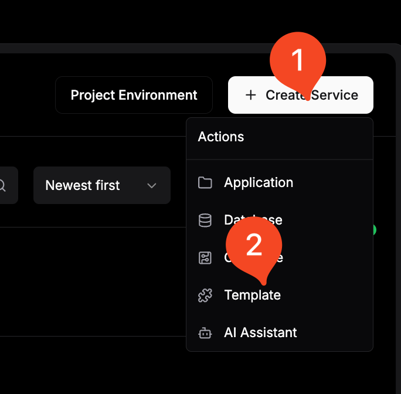
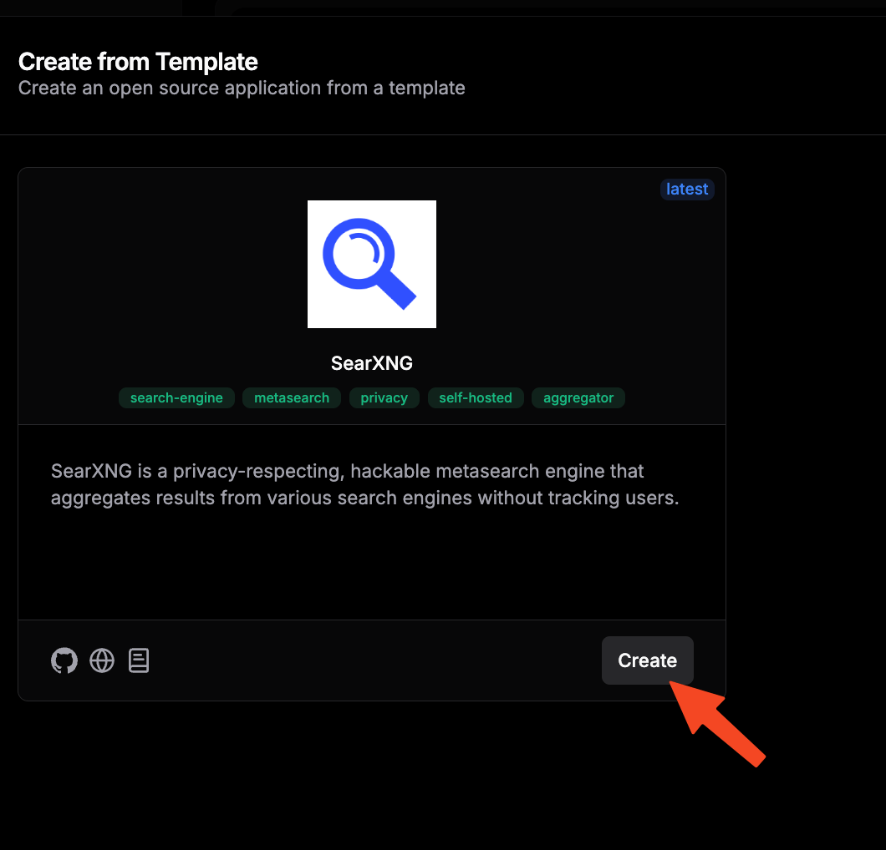
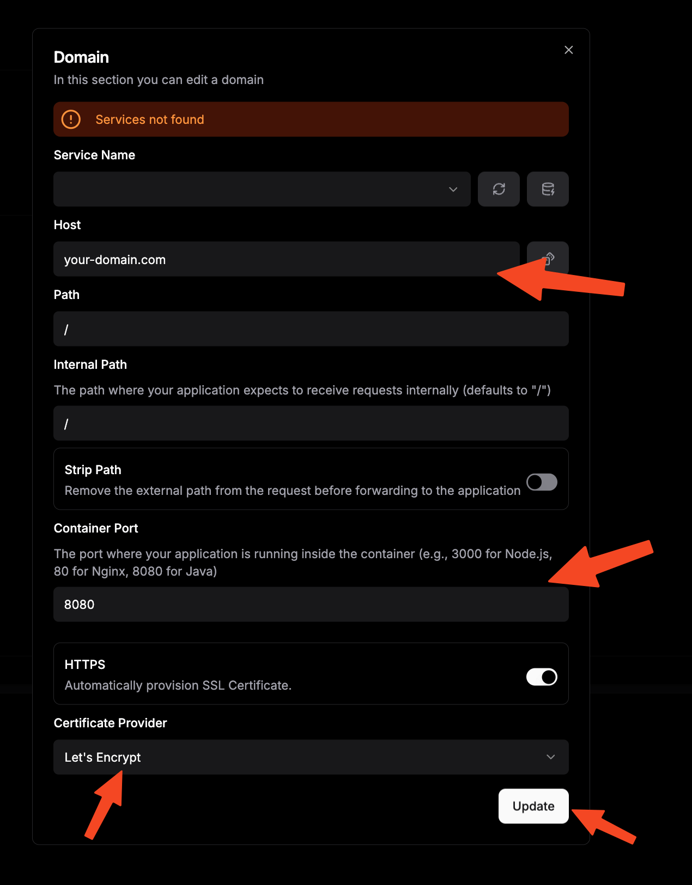
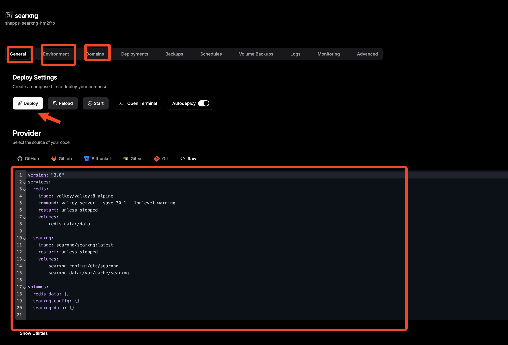

PDF documents are commonly used for professional communication, legal documentation, and information sharing. Manipulating these files often requires expensive software licenses or online services that may compromise document privacy and security.

**Stirling PDF** is a self-hosted application that processes, edits, and manages PDF documents. This solution provides PDF manipulation without software subscriptions while keeping documents on your own infrastructure.

## What is Stirling PDF?


**Stirling PDF** is an open-source web application for PDF manipulation tools. It provides an alternative to commercial software and online services.

### Key Capabilities of Stirling PDF

<ListCheck>

- Document Management: Merge, split, rotate, and reorganize PDF pages
- Format Conversion: Convert PDFs to/from images, Word documents, Excel files, and more
- Security Operations: Add or remove passwords, digital signatures, and encryption
- Compression & Optimization: Reduce file sizes while maintaining quality
- OCR Integration: Extract text from scanned documents and images
- Metadata Management: Clean, edit, or remove document metadata
- Batch Processing: Handle multiple documents simultaneously
- API Access: Integrate with automation workflows and other applications

</ListCheck>

### How Stirling PDF Works

| Component | Function | Benefit |
|-----------|----------|---------|
| Web Interface | Browser-based GUI | Access from any device |
| Processing Engine | Java-based PDF manipulation core | Reliable operations |
| API Layer | RESTful endpoints for automation | Integration with workflows |
| Storage System | Temporary file handling | Document processing |

Stirling PDF is an open-source project. View documentation and contribute at their [GitHub repository](https://github.com/Stirling-Tools/Stirling-PDF) and [project website](https://stirlingpdf.io/).

> For a comprehensive list of useful applications, check out our guide on [Docker containers for home servers](https://www.bitdoze.com/docker-containers-home-server/).

## Prerequisites

Before deploying your Stirling PDF instance, ensure you have the necessary infrastructure components configured:

<Notice type="info" title="Resource Requirements">

Stirling PDF performs intensive document processing operations. Adequate system resources ensure optimal performance, especially when handling large files or batch operations.

</Notice>


- **Server Infrastructure**: A reliable hosting platform for your Stirling PDF deployment:
  - **Minimum Specifications**: 2 CPU cores, 4GB RAM, 50GB storage
  - **Recommended Configuration**: 4+ CPU cores, 8GB+ RAM, 100GB+ SSD storage
  - **Cloud Provider**: [Hetzner VPS](https://go.bitdoze.com/hetzner) offers excellent performance-to-price ratio
  - **Local Alternative**: [Mini PC as Home Server](https://www.bitdoze.com/best-mini-pc-home-server/) for on-premise deployment

- **Reverse Proxy Configuration** (for secure HTTPS access):
  - **Traefik with Docker**: Follow our comprehensive guide: [How to Use Traefik as A Reverse Proxy in Docker](https://www.bitdoze.com/traefik-proxy-docker/)
  - **Advanced Setup**: Implement SSL with our tutorial: [Traefik FREE Let's Encrypt Wildcard Certificate With CloudFlare Provider](https://www.bitdoze.com/traefik-wildcard-certificate/)

- **Container Orchestration Tools**:
  - **Docker Engine**: Latest stable release with container runtime
  - **Docker Compose**: Multi-container application management
  - **Dockge** (recommended): Streamlined container management interface - see: [Dockge - Portainer Alternative for Docker Management](https://www.bitdoze.com/dockge-install/)

- **Network Configuration**:
  - **Domain Access**: Subdomain pointing to your server (e.g., `pdf.yourdomain.com`)
  - **Firewall Rules**: Appropriate port access and security configurations


## Setup Option 1: Docker & Docker Compose (Standalone)

This approach provides a straightforward deployment using Docker containers, ideal for users seeking a simple, self-contained Stirling PDF installation without external dependencies.

### Step 1: Create Project Structure

Establish a dedicated directory hierarchy for your Stirling PDF deployment:

```bash
mkdir -p ~/stirling-pdf && cd ~/stirling-pdf
```

### Step 2: Configure Docker Compose

Create a `docker-compose.yml` file:

```yaml
version: '3.8'

services:
  stirling-pdf:
    image: stirlingtools/stirling-pdf:latest
    container_name: stirling-pdf
    ports:
      - "8080:8080"
    volumes:
      - ./tessdata:/usr/share/tessdata    # OCR language data
      - ./configs:/configs                # Configuration files
      - ./logs:/logs                      # Application logs
      - ./custom-files:/customFiles       # Custom templates/files
    environment:
      - DOCKER_ENABLE_SECURITY=false     # Disable for standalone use
      - INSTALL_BOOK_AND_ADVANCED_HTML_OPS=true
      - LANGS=en_US                      # Set your preferred language
    restart: unless-stopped
    healthcheck:
      test: ["CMD", "curl", "-f", "http://localhost:8080/api/v1/info/status"]
      interval: 30s
      timeout: 10s
      retries: 3
      start_period: 40s
```

### Step 3: Initialize Directory Structure

Create the necessary directories for Stirling PDF operation:

```bash
mkdir -p tessdata configs logs custom-files
```

### Step 4: Configure OCR Support (Optional)

Download language packs for OCR:

```bash
# Download common language data for Tesseract OCR
wget -P tessdata/ https://github.com/tesseract-ocr/tessdata/raw/main/eng.traineddata
wget -P tessdata/ https://github.com/tesseract-ocr/tessdata/raw/main/fra.traineddata
wget -P tessdata/ https://github.com/tesseract-ocr/tessdata/raw/main/deu.traineddata
```

### Step 5: Deploy Stirling PDF

Launch your Stirling PDF instance using Docker Compose:

```bash
docker compose up -d
```

### Step 6: Verify Installation

Access your Stirling PDF instance and verify functionality:

- **Local Access**: Navigate to `http://localhost:8080`
- **Network Access**: Visit `http://your-server-ip:8080`
- **API Documentation**: Check `http://localhost:8080/swagger-ui/index.html`

<Notice type="success" title="Installation Complete">

Your Stirling PDF instance is operational. You can process PDF documents.

</Notice>

## Setup Option 2: Traefik & Dockge Integration

This setup integrates Stirling PDF with Traefik reverse proxy and Dockge management interface for HTTPS encryption and SSL certificates.

<Notice type="info" title="Prerequisites">

This configuration requires a properly configured Traefik and Dockge environment. Follow our [Traefik Wildcard Certificate guide](https://www.bitdoze.com/traefik-wildcard-certificate/) for setup instructions.

</Notice>

### Step 1: Verify Network Configuration

Ensure your Traefik network is properly configured:

```bash
# Verify existing network
docker network ls | grep traefik-net

# Create if necessary
docker network create traefik-net
```

### Step 2: Docker Compose Configuration

Create a `docker-compose.yml` with Traefik integration:

```yaml
version: '3.8'

networks:
  traefik-net:
    external: true

services:
  stirling-pdf:
    image: stirlingtools/stirling-pdf:latest
    container_name: stirling-pdf
    volumes:
      - ./tessdata:/usr/share/tessdata
      - ./configs:/configs
      - ./logs:/logs
      - ./custom-files:/customFiles
    environment:
      - DOCKER_ENABLE_SECURITY=true      # Enhanced security for public access
      - INSTALL_BOOK_AND_ADVANCED_HTML_OPS=true
      - LANGS=en_US,fr_FR,de_DE          # Multiple language support
      - SYSTEM_ROOTURIPATH=/              # Root path configuration
      - UI_APPNAME=Stirling PDF           # Custom application name
      - UI_HOMEDESCRIPTION=Your Private PDF Manipulation Suite
      - SECURITY_ENABLELOGIN=false       # Disable if using external auth
      - SYSTEM_MAXFILESIZE=2000          # Max file size in MB
    networks:
      - traefik-net
    restart: unless-stopped
    labels:
      - "traefik.enable=true"
      - "traefik.http.routers.stirling-pdf.rule=Host(`pdf.yourdomain.com`)"
      - "traefik.http.routers.stirling-pdf.entrypoints=https"
      - "traefik.http.routers.stirling-pdf.tls=true"
      - "traefik.http.routers.stirling-pdf.tls.certresolver=letsencrypt"
      - "traefik.http.services.stirling-pdf.loadbalancer.server.port=8080"
      # Security headers
      - "traefik.http.routers.stirling-pdf.middlewares=stirling-pdf-headers"
      - "traefik.http.middlewares.stirling-pdf-headers.headers.accesscontrolallowmethods=GET,OPTIONS,PUT,POST,DELETE,PATCH"
      - "traefik.http.middlewares.stirling-pdf-headers.headers.accesscontrolmaxage=100"
      - "traefik.http.middlewares.stirling-pdf-headers.headers.addvaryheader=true"
    healthcheck:
      test: ["CMD", "curl", "-f", "http://localhost:8080/api/v1/info/status"]
      interval: 30s
      timeout: 10s
      retries: 3
      start_period: 60s
```

### Step 3: Deploy via Dockge

1. **Access Dockge Interface**: Navigate to your Dockge dashboard (typically `https://dockge.yourdomain.com`)
2. **Create New Stack**: Click "New Stack" and name it "stirling-pdf"
3. **Configure Composition**: Paste the Docker Compose configuration
4. **Customize Settings**: Update the domain name in Traefik labels to match your setup
5. **Deploy Stack**: Click deploy and monitor the deployment logs

### Step 4: DNS Configuration

Configure your domain's DNS records to point to your server:

| Record Type | Name | Value | TTL |
|-------------|------|-------|-----|
| A | pdf | your-server-ip | 300 |
| CNAME | pdf | yourdomain.com | 300 |

### Step 5: Verify HTTPS Access

After DNS propagation (typically 5-15 minutes), verify secure access:

- **HTTPS Access**: `https://pdf.yourdomain.com`
- **SSL Certificate**: Verify the Let's Encrypt certificate is properly installed
- **API Documentation**: `https://pdf.yourdomain.com/swagger-ui/index.html`

<Notice type="warning" title="DNS Propagation Time">

DNS changes may take 5-15 minutes to propagate globally.

</Notice>

## Setup Option 3: Dokploy Deployment

Dokploy provides a graphical interface with pre-configured templates and automated SSL certificate management. This option works well for users who prefer graphical interfaces over command-line operations.

### Step 1: Dokploy Platform Setup

If not already installed, set up Dokploy on your server using our comprehensive guide: [Dokploy Installation and Configuration Tutorial](https://www.bitdoze.com/dokploy-install/).

### Step 2: Create Stirling PDF Project

1. **Access Dokploy Dashboard**: Navigate to your Dokploy interface
2. **Create New Project**: Click "New Project" and name it "stirling-pdf"
3. **Select Template**: Choose "StarlingPDF" from the available templates or create a custom compose application





### Step 3: Environment Variables Configuration

Configure the environment variables in Dokploy:

| Variable | Value | Description |
|----------|-------|-------------|
| `DOCKER_ENABLE_SECURITY` | `true` | Enable security features |
| `INSTALL_BOOK_AND_ADVANCED_HTML_OPS` | `true` | Install additional PDF operations |
| `LANGS` | `en_US,fr_FR,de_DE` | OCR and UI language support |
| `SYSTEM_MAXFILESIZE` | `2000` | Maximum file size in MB |
| `UI_APPNAME` | `Stirling PDF` | Application name |
| `UI_HOMEDESCRIPTION` | `Private PDF Suite` | Homepage description |
| `SECURITY_ENABLELOGIN` | `false` | Disable for external authentication |


Use this in Dokploy configuration:

```yaml
environment:
  - DOCKER_ENABLE_SECURITY=${DOCKER_ENABLE_SECURITY}
  - INSTALL_BOOK_AND_ADVANCED_HTML_OPS=${INSTALL_BOOK_AND_ADVANCED_HTML_OPS}
  - LANGS=${LANGS}
  - SYSTEM_MAXFILESIZE=${SYSTEM_MAXFILESIZE}
  - UI_APPNAME=${UI_APPNAME}
  - UI_HOMEDESCRIPTION=${UI_HOMEDESCRIPTION}
  - SECURITY_ENABLELOGIN=${SECURITY_ENABLELOGIN}
```

### Step 4: Domain and SSL Configuration

1. **Navigate to Domains**: Go to the "Domains" section in your Dokploy project
2. **Add Domain**: Enter your desired domain: `pdf.yourdomain.com`
3. **Enable SSL**: Toggle SSL/TLS certificate generation
4. **Configure Auto-Renewal**: Enable automatic certificate renewal
5. **Set Redirects**: Configure HTTP to HTTPS redirection



### Step 5: Deploy and Monitor

1. **Deploy Application**: Click the "Deploy" button in Dokploy
2. **Monitor Logs**: Watch the deployment process
3. **Verify Status**: Check application health
4. **Test Functionality**: Access your instance and test PDF operations



<Button text="Deploy with Dokploy" size="lg" color="green" variant="solid" icon="arrow-right" iconPosition="right" />

## Advanced Configuration and Feature Optimization

Once Stirling PDF is operational, you can enhance its capabilities through configuration options.

### Document Processing Configuration

Customize Stirling PDF through environment variables:

<ListCheck>

- File Size Limits: Configure maximum upload sizes
- OCR Languages: Install Tesseract language packs for multi-language support
- Security Settings: Enable authentication, rate limiting, and access controls
- UI Customization: Customize logos and descriptions
- Feature Toggles: Enable or disable specific functionality
- Performance Tuning: Adjust memory allocation and processing parameters

</ListCheck>

### OCR and Language Support

Enhance OCR capabilities by installing language data:

| Language | Code | Download Command |
|----------|------|------------------|
| **English** | eng | `wget -P tessdata/ https://github.com/tesseract-ocr/tessdata/raw/main/eng.traineddata` |
| **Spanish** | spa | `wget -P tessdata/ https://github.com/tesseract-ocr/tessdata/raw/main/spa.traineddata` |
| **French** | fra | `wget -P tessdata/ https://github.com/tesseract-ocr/tessdata/raw/main/fra.traineddata` |
| **German** | deu | `wget -P tessdata/ https://github.com/tesseract-ocr/tessdata/raw/main/deu.traineddata` |
| **Chinese Simplified** | chi_sim | `wget -P tessdata/ https://github.com/tesseract-ocr/tessdata/raw/main/chi_sim.traineddata` |

### Security and Access Control

Configure security measures for production deployments:

```yaml
environment:
  - DOCKER_ENABLE_SECURITY=true
  - SECURITY_ENABLELOGIN=true
  - SECURITY_LOGINATTEMPTSLIMIT=5
  - SECURITY_LOGINRESETTIMEDURATION=120  # minutes
  - SYSTEM_ROOTURIPATH=/
  - SECURITY_OAUTH2_AUTOCREATEUSER=true
```

### API Integration and Automation

Stirling PDF provides a comprehensive REST API for automation and integration:

**Common API Endpoints:**
- **Document Conversion**: `/api/v1/convert/pdf-to-img`
- **Security Operations**: `/api/v1/security/add-password`
- **Merge Operations**: `/api/v1/general/merge-pdfs`
- **Compression**: `/api/v1/general/compress-pdf`

**Example API Usage:**
```bash
# Convert PDF to images
curl -X POST "https://pdf.yourdomain.com/api/v1/convert/pdf-to-img" \
  -H "Content-Type: multipart/form-data" \
  -F "fileInput=@document.pdf" \
  -F "imageFormat=PNG" \
  -F "singleOrMultiple=multiple"
```

## Performance Optimization and Resource Management

### System Resource Configuration

Optimize Stirling PDF performance based on server specifications:

| Server Specs | Recommended Settings | Use Case |
|---------------|---------------------|----------|
| **2 CPU / 4GB RAM** | `SYSTEM_MAXFILESIZE=500` | Light personal use |
| **4 CPU / 8GB RAM** | `SYSTEM_MAXFILESIZE=1000` | Small team/office |
| **8+ CPU / 16GB+ RAM** | `SYSTEM_MAXFILESIZE=2000` | Heavy processing/enterprise |

### Docker Resource Limits

Configure container resource limits:

```yaml
services:
  stirling-pdf:
    # ... other configuration
    deploy:
      resources:
        limits:
          cpus: '2.0'
          memory: 4G
        reservations:
          cpus: '1.0'
          memory: 2G
```

### Monitoring and Health Checks

Implement monitoring for production environments:

```yaml
healthcheck:
  test: ["CMD-SHELL", "curl -f http://localhost:8080/api/v1/info/status || exit 1"]
  interval: 30s
  timeout: 10s
  retries: 3
  start_period: 60s
```

## Integration with Workflow Automation

### n8n Integration

Connect Stirling PDF with n8n for document processing workflows:

**Example Workflow:**
1. **Trigger**: Email attachment received
2. **Process**: Remove password protection via Stirling PDF API
3. **Convert**: Transform to searchable PDF with OCR
4. **Store**: Save to document management system

### API-First Architecture Benefits

<ListCheck>

- Automated Processing: Integrate with CI/CD pipelines for document automation
- Batch Operations: Process multiple documents programmatically
- Custom Applications: Build tools using Stirling PDF as backend
- Workflow Integration: Connect with tools like n8n, Zapier, or custom scripts
- Monitoring Integration: Track processing metrics

</ListCheck>

## Security Best Practices and Data Protection

### Access Control Implementation

<Notice type="warning" title="Security Considerations">

When exposing Stirling PDF to the internet, implement security measures to protect documents.

</Notice>

Implement security for production deployments:

| Security Layer | Implementation | Purpose |
|----------------|----------------|---------|
| Authentication | Built-in login system | User access control |
| Authorization | Role-based permissions | Feature-specific access |
| Network Security | Reverse proxy + SSL | Encrypted communication |
| Rate Limiting | Request throttling | Prevent abuse |
| File Validation | Content type checking | Malicious file protection |

### Data Privacy Measures

<ListCheck>

- Temporary File Cleanup: Automatic deletion of processed files after operations
- Memory Management: Secure handling of document content in memory
- Log Sanitization: Removal of sensitive information from application logs
- Network Isolation: Container networking restrictions for security
- Backup Encryption: Encrypted storage of configuration and temporary files

</ListCheck>

### Production Security Configuration

```yaml
environment:
  - DOCKER_ENABLE_SECURITY=true
  - SECURITY_ENABLELOGIN=true
  - SECURITY_LOGINATTEMPTSLIMIT=5
  - SECURITY_LOGINRESETTIMEDURATION=120
  - SYSTEM_MAXFILESIZE=1000
  - SYSTEM_MAXREQUESTSIZE=1000
  - UI_HOMEDESCRIPTION=Secure PDF Processing Suite
```

## Troubleshooting Common Issues

### Performance and Memory Issues

**Symptoms**: Slow processing, out-of-memory errors, or container crashes

**Solutions**:
1. **Increase Container Memory**: Adjust Docker memory limits
2. **Optimize File Sizes**: Reduce maximum file size limits
3. **Monitor Resource Usage**: Use `docker stats` to analyze consumption
4. **Process Queue Management**: Implement batch processing for large files

### OCR Processing Problems

**Symptoms**: OCR operations failing or producing poor results

**Solutions**:
1. **Verify Language Data**: Ensure proper Tesseract language files are installed
2. **Check Image Quality**: Higher resolution images produce better OCR results
3. **Language Configuration**: Verify correct language codes in environment variables
4. **Memory Allocation**: OCR operations require adequate RAM for processing

### API Integration Difficulties

**Symptoms**: API calls failing or returning unexpected results

**Solutions**:
1. **Authentication Check**: Verify API authentication if enabled
2. **Content-Type Headers**: Ensure correct multipart/form-data headers
3. **File Size Limits**: Check file size restrictions in API calls
4. **Error Response Analysis**: Review detailed error messages from API responses

### SSL Certificate Issues

**Symptoms**: HTTPS errors, certificate warnings, or connection failures

**Solutions**:
1. **DNS Verification**: Confirm domain points to correct server IP
2. **Certificate Renewal**: Check automatic certificate renewal configuration
3. **Traefik Logs**: Review Traefik logs for certificate generation errors
4. **Network Connectivity**: Verify Let's Encrypt can reach your server

<Notice type="info" title="Debugging">

Enable debug logging by setting `SYSTEM_LOGFILE=/logs/stirling.log` to capture detailed application behavior.

</Notice>

## Maintenance and Updates

### Regular Maintenance Tasks

<ListCheck>

- **Weekly**: Monitor disk usage and clean temporary files
- **Monthly**: Update Docker images for security patches and new features
- **Quarterly**: Review and optimize system performance settings
- **Annually**: Audit security configurations and access permissions

</ListCheck>

### Update Procedures

Keep your Stirling PDF instance current with regular updates:

```bash
# Update Docker images
cd ~/stirling-pdf
docker compose pull
docker compose up -d

# Clean up old images
docker image prune -f
```

### Backup Strategies

Protect your Stirling PDF configuration and data:

```bash
# Backup configuration and data
tar -czf stirling-pdf-backup-$(date +%Y%m%d).tar.gz \
  configs/ tessdata/ custom-files/ docker-compose.yml

# Automated backup script
#!/bin/bash
BACKUP_DIR="/backups/stirling-pdf"
mkdir -p $BACKUP_DIR
tar -czf "$BACKUP_DIR/stirling-pdf-$(date +%Y%m%d-%H%M%S).tar.gz" \
  configs/ tessdata/ custom-files/ docker-compose.yml
```

## Conclusion

Self-hosting Stirling PDF gives you control over document processing. By implementing your own PDF manipulation suite, you achieve:

<ListCheck>

- Complete Data Control: Your sensitive documents never leave your infrastructure
- Cost-Effective Solution: Eliminate expensive software licenses and subscription fees
- Unlimited Processing: No file size restrictions or usage limits imposed by third parties
- Custom Integration: API-first architecture enables workflow automation
- Enhanced Security: Multi-layered security controls protect your document processing
- Scalable Performance: Adjust resources based on your processing needs

</ListCheck>

Whether you choose the Docker deployment, the Traefik integration, or the Dokploy approach, Stirling PDF provides a foundation for private document processing. Self-hosting delivers benefits in privacy protection, cost savings, and processing flexibility.

As document security becomes increasingly important in professional environments, tools like Stirling PDF demonstrate that you can maintain full control without sacrificing functionality. Transform your document workflow and experience private PDF processing.

<Button text="Start Your Stirling PDF Journey" size="xl" color="red" variant="solid" icon="arrow-right" iconPosition="right" />

Explore our guides on [Docker container orchestration](https://www.bitdoze.com/dockge-install/), [Traefik reverse proxy configuration](https://www.bitdoze.com/traefik-proxy-docker/), and [Dokploy platform management](https://www.bitdoze.com/dokploy-install/).
