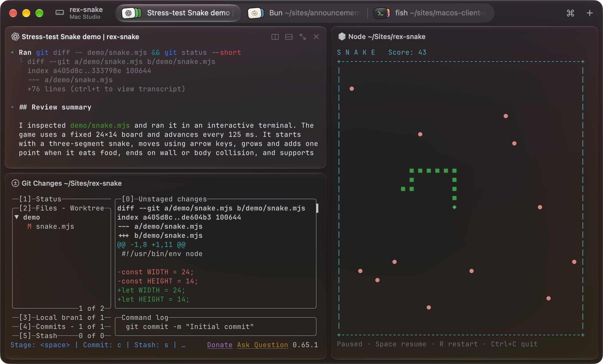
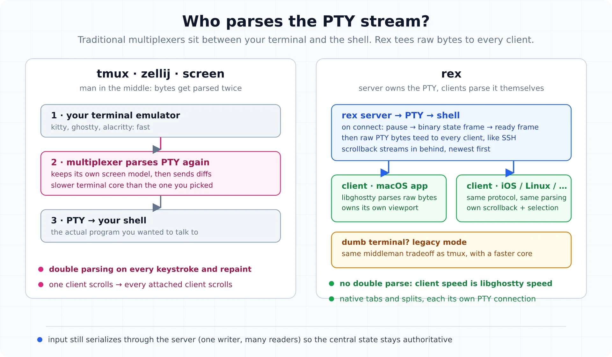

import Notice from "@components/widgets/Notice.astro";
import Accordion from "@components/widgets/Accordion.astro";
import ListCheck from "@components/widgets/ListCheck.astro";

Rex is the terminal multiplexer Mitchell Hashimoto has been building at Superlogical since HashiCorp and Ghostty. It is a terminal emulator and a multiplexer in one native application: you open the app, you are in a terminal, and sessions, splits and persistence are already there. As of October 5 it is in [public testing](https://www.superlogical.com/updates/public-testing-beginning) (mailing-list invites, macOS first), but the docs are already public and Hashimoto has published two long walkthroughs of how it works. There is enough real material to write a proper briefing, so here it is.



## What Rex is

You do not run Rex inside another terminal the way [tmux](/tmux-basics/) runs inside Kitty or [Ghostty](/ghostty-terminal/); it is the terminal. Superlogical's pitch is "a drop-in replacement for whichever terminal you use today," with persistent sessions, remote connections, and program activity status on top.

The vocabulary is four nouns, and they show up everywhere in the CLI and config:

- A **session** is a group of work, usually one project. The server keeps it alive whether or not anything is looking at it.
- A **window** is a tab inside a session. It holds a layout of blocks.
- A **block** is one application in a window. Today that means a terminal.
- A **client** is a program connected to the server, like the macOS app.

The server owns everything. Clients attach, render, detach. Close the app mid-build, reopen it, and you are back in the same session where you left it.

## Why the architecture is different (and why it matters)

This is the part worth understanding, because it is the reason Rex exists instead of being another tmux skin.

A traditional multiplexer sits between your terminal emulator and the PTY. Terminal → [tmux](/tmux-basics/) → shell. Every byte gets parsed twice: once by the multiplexer's internal terminal model, once by your emulator. And historically, the terminal cores inside tmux, screen and zellij are slow next to modern emulators. Hashimoto puts it bluntly in his architecture walkthrough: Ghostty, Kitty and Alacritty are sometimes 100x faster at terminal IO than the emulator inside a multiplexer, so bolting one in front of your fast terminal gives you, in his words, "that slow experience in a fast terminal."



Rex flips who does the parsing:

1. **The server owns the PTY.** When a client connects, the server pauses PTY processing for a moment and sends a custom binary frame carrying just enough state (dimensions, cursor, current screen) for the client to render. Then a ready frame: you can type, select and scroll while everything else loads.
2. **Raw bytes, not screen diffs.** Instead of tracking a shared screen model and shipping diffs, the server tees raw PTY bytes to every client, like SSH. Each client runs libghostty and parses independently. If the server ever parses slowly, your client does not care.
3. **Scrollback streams in behind.** Newest chunk first, with a loading state while history backfills. And because the client owns its viewport, two attached clients can scroll the same session independently, which fixes the famous tmux behavior where one person scrolling moves everyone's screen.

Two consequences worth knowing:

- **No in-window multiplexing.** Each split is its own PTY connection rendered as a native tab, split or window. That is what makes iOS and browser clients possible, and it is why a tmux-style pane tree is not the model. A legacy compatibility mode for dumb terminals (a libghostty layer in the middle, the same tradeoff tmux makes but with a faster core) is still being discussed.
- **Input stays centralized.** Keystrokes serialize through the server, one writer and many readers, so the authoritative state never forks even if a client drifts out of sync. A drifted client just re-runs the handshake.

Since the client is the terminal emulator, feature support follows libghostty. The Kitty graphics protocol gap that tmux never closed is the kind of thing that lands much faster here, because Superlogical ships the terminal engine.

## Remote hosts: quietly an SSH replacement

The second demo is the one that made me sit up. Rex is not just local persistence. From the command palette you add a remote host (Hashimoto demos against a VPS on his tailnet), and what opens looks like SSH but is not SSH:

- It does a **real system login**. The session shows up in `who`, your login shell loads, per-user limits are honored. Hashimoto says he does not run SSH on that machine at all; Rex is how he gets in, including as root. A server-side mapping controls which identities can act as which users, and existing SSH keys are respected.
- **`rex whoami` reports the identity chain.** In the demo it shows he connected as `mitchellh` via his Tailscale identity across a couple of hops. Remote auth rides on network identity you already have.
- **It feels local.** He describes borrowing architectural ideas from Mosh for responsiveness, without claiming full Mosh parity. Killing a remote session via `rex session kill` propagates before you can reopen the app.
- **Everything local works remote.** The `Cmd+Shift+G` go-to-directory jump works on remote hosts too. "Everything that works local should work remote" is a stated design rule.

Local sessions need no remote anything. Remote hosts are for when you want the same persistence on a VPS.

## The rex CLI is the control surface

Every terminal Rex opens gets `rex` on its PATH automatically, plus three environment variables that tell the CLI where it is:

| Variable | Holds |
|---|---|
| `REX_SESSION` | ID of the session the terminal belongs to |
| `REX_BLOCK` | ID of the terminal's own block |
| `REX_SERVER` | Address of the server running the terminal |

So `rex split` inside a pane splits that pane. To act somewhere else, target with `-s` (session), `-w` (window), `-b` (block), `-C` (client) or `-S` (server). Targets resolve in a fixed order: full ID, then label, then position, then a 4+ character ID suffix. An ambiguous target changes nothing: it lists the matches and exits with status 3.

```sh
rex ls                              # list sessions
rex session inspect                 # details of the session you're in
rex send -s build -w 2 'make test'  # type into window 2 of the "build" session
rex capture -b logs                 # print the screen of the block labeled "logs"
rex -S studio ls                    # sessions on the host labeled "studio"
```

Most commands take `--json` (stable output with full IDs, made for scripts) and return meaningful exit codes: `0` ok, `1` failed, `2` bad command line, `3` target missing or ambiguous, `4` server unreachable, `130` interrupted. `rex wait` and `rex run --wait` adopt the wrapped program's exit status, so scripts compose cleanly. This is the same "everything is automatable" philosophy as cmux, taken further.

## Configuration is Lua, and custom actions are real

Config lives in one file: `~/.config/rex/init.lua` on macOS and Linux, `%AppData%\rex\init.lua` on Windows, `REX_CONFIG` overrides both. Rex needs no config at all, and `require` lets you split a big one into files.

```lua
rex.bind("cmd+d", "pane.split", { direction = "right" })
rex.bind("ctrl+b>c", "window.new")  -- tmux-style prefix chords work
```

Two details the docs make clear that are easy to miss: the **server** reads the file, so `rex config reload` must run on the server machine and is refused over a remote connection. And there is no file watching; reload is manual. `rex config check` validates a file without applying it, a bad `rex.*` call is skipped with an error while the rest of the file still loads, and a hard Lua syntax error keeps the last good config.

Custom actions are named Lua functions defined with `rex.action`. Once defined they behave like built-ins: bindable to keys, searchable in the command palette, runnable from the CLI with `rex do`:

```lua
rex.action{
  name  = "scratch",
  title = "Open Scratch Window",
  run   = function(ctx, args)
    rex.session.new_window{
      layout = rex.layout.block{
        flavor = "com.superlogical.terminal.shell",
      },
    }
  end,
}
rex.bind("shift+cmd+n", "scratch")
```

Actions take typed `args` (or a full JSON Schema as a Lua table), receive a `ctx` (`session_id`, `block_id`, `client_id`, `origin`), call other actions through `rex.invoke`, and queue client-side actions with `rex.client.queue`. Two gates to know: the app only accepts actions from the CLI when **Remote Control** is on in settings, and `rex do ~/.config/rex/init.lua --action scratch` runs an action from a file against the live session without touching the running config. That last one is the fast iteration loop.

## Where you can run it, and what it costs

<ListCheck>
  <ul>
    <li>**macOS app first.** It self-hosts a Rex server locally and connects to other Rex servers, so Mac-to-Mac remoting already works.</li>
    <li>**Other platforms are built, not shipped.** Rex servers run on Linux and Windows internally, and iOS, Linux and Windows clients exist at "varying stages of readiness."</li>
    <li>**Free, no account, self-hostable.** Superlogical: "Rex is and will always be free," clients and servers "are not going to be directly monetized," no data sharing. The commercialization plan is promised before the stable release.</li>
    <li>**Access via the mailing list.** Invites go out in waves; about 50 people ran the private test for months, and the team wants to clear the whole list in under a month.</li>
  </ul>
</ListCheck>

To get a seat, join the mailing list on the [announcement page](https://www.superlogical.com/updates/public-testing-beginning). The [docs](https://www.superlogical.com/rex/docs/installation) are public and worth reading even without access; the CLI and Lua reference tell you most of what the product is.

## Rex vs tmux vs Herdr

| | Rex | tmux / zellij | Herdr |
|---|---|---|---|
| What it is | Terminal app + multiplexer | Multiplexer inside your terminal | Agent control plane |
| How it renders | Native tabs/splits, per-client libghostty | Internal screen model diffed to your terminal | TUI over a session server |
| Remote story | Built-in remoting, real system login, Mosh-style responsiveness | SSH in, then attach | SSH attach, web/mobile clients |
| Config | Lua (`init.lua`) | tmux.conf / KDL | `~/.config/herdr` |
| Scripting | `rex` CLI, Lua actions, `--json` | CLI + shell scripts | Socket API + CLI |
| Status | New, macOS only | Everywhere, decades mature | Open source, active |

Honest framing: these are different tools solving different problems. tmux is the incumbent with decades of muscle memory behind it. Rex bets that the multiplexer should be the terminal. Herdr is not a terminal at all, it is a control plane for AI coding agents (agent-state sidebar, socket API, marketplace plugins). If agents are your actual problem, start with my [Herdr review](/herdr-agent-multiplexer/) and the guides to the [best Herdr clients](/best-herdr-clients/) and [best Herdr plugins](/best-herdr-plugins/). If terminal ergonomics are the problem, Rex is the most interesting thing in this space since zellij.

## Rough edges to know about

- **macOS only for now.** No workaround, no sideload; the Linux and Windows pieces exist but aren't in testers' hands yet.
- **The tmux workflow does not port 1:1.** No in-window pane tree; splits are separate connections in native containers. Prefix chords like `ctrl+b>c` work in `rex.bind`, your `.tmux.conf` does not.
- **Config reload is manual.** No file watching yet; `rex config reload` on the server machine only.
- **The SSH replacement is real but early.** Demos show full logins and SSH-key respect, but the server-side identity mapping is not yet documented in depth.
- **Feature surface follows libghostty.** Fast adoption of terminal features, but the server still gates what a session can do.

## FAQ

<Accordion label="Is Rex free?" group="faq">
  Yes. Superlogical says "Rex is and will always be free," no account required, servers fully self-hostable, and they don't see or share your data. Whatever the eventual commercialization is, they have committed it will not be the client or server itself.
</Accordion>

<Accordion label="Can I run Rex on Linux or Windows today?" group="faq">
  Not yet. The shipping client is the macOS app. Rex servers already run on Linux and Windows internally, and iOS, Linux and Windows clients exist at varying readiness, but none are available to testers yet.
</Accordion>

<Accordion label="Does Rex replace tmux?" group="faq">
  It replaces the job tmux does (persistence, sessions, splits, remote attach) with a different model: raw PTY bytes to per-client terminal emulators instead of one shared screen model. What you lose is in-window pane nesting and decades of ecosystem plugins. What you gain is per-client scrollback, native UI, first-class remoting, and a scriptable Lua and CLI surface. Our [tmux basics guide](/tmux-basics/) shows what the incumbent workflow looks like.
</Accordion>

<Accordion label="Does Rex work with my Ghostty config or theme?" group="faq">
  Not documented yet. Rex is built on libghostty and demos show [Ghostty](/ghostty-terminal/)-style theme handling, so expect familiarity rather than a config import path today.
</Accordion>

## The short version

Rex is Mitchell Hashimoto arguing that a terminal multiplexer should not emulate a terminal in the middle of your terminal. The client parses, the server streams, sessions persist, remotes log in for real, and the whole thing is scriptable in Lua. It is macOS-only for now, but the docs are public and the architecture is genuinely different rather than a reskin. [Join the mailing list](https://www.superlogical.com/updates/public-testing-beginning) if you want in.

Also worth a look: my [Ghostty setup guide](/ghostty-terminal/) (the same engine sits under Rex's hood) and the [cmux guide](/cmux-terminal/), another libghostty-based terminal with an automation CLI that is already out for macOS.
