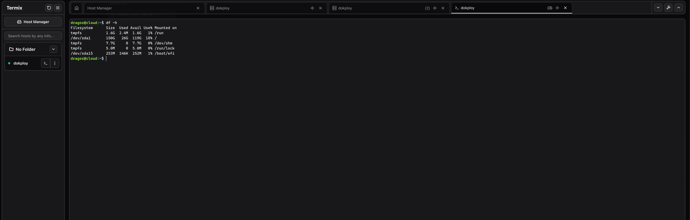
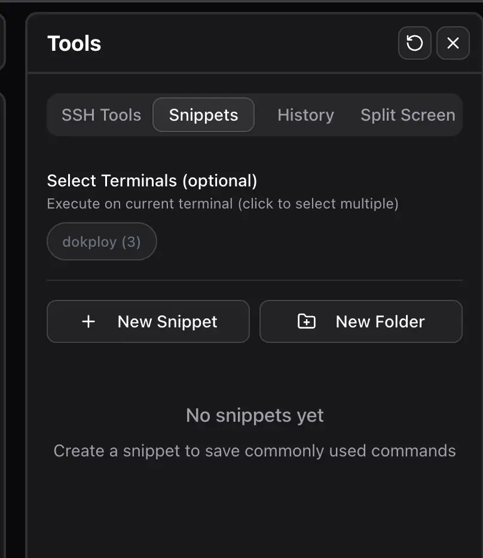
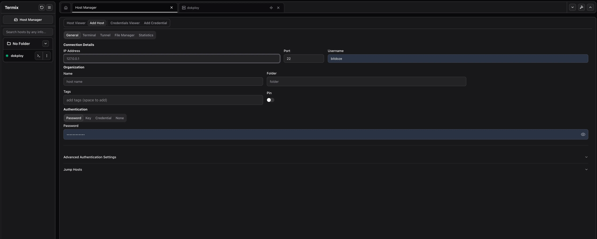
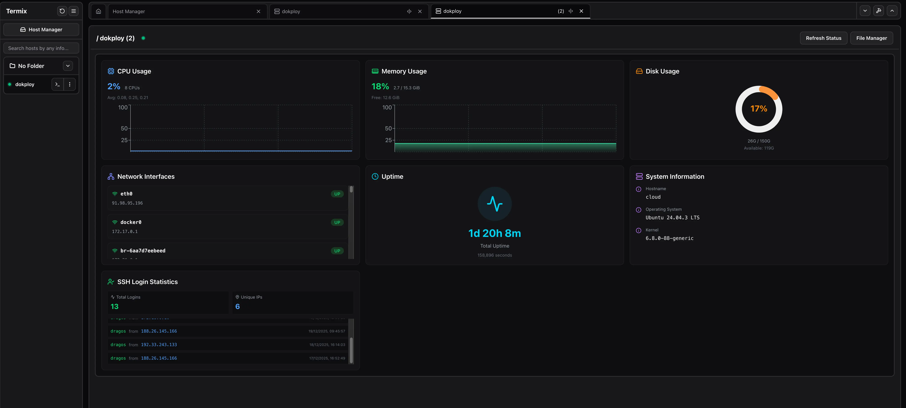
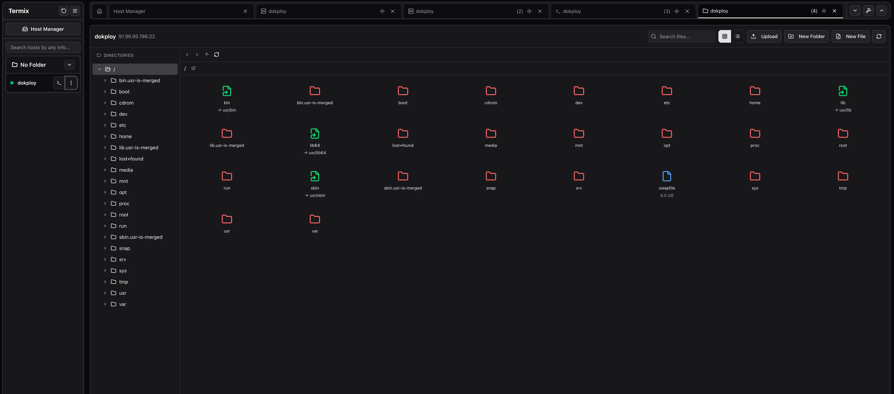

Self-hosting gives you freedom, but it also means you are responsible for access, security, and day-to-day operations. **Termix** is built for people who want that control without juggling five separate tools. It is open-source, forever free, and runs entirely on your infrastructure.

## What is Termix?

Termix is a self-hosted platform that brings SSH access, file management, monitoring, and Docker control into one web interface. Instead of hopping between a terminal app, SFTP, and dashboards, you get a single place to manage your servers.

<YouTubeEmbed url="https://www.youtube.com/watch?v=FtVMs7ba4QQ" label="Termix Self-Hosted SSH Manager Overview" />

## Termix core features

<ListCheck>
- SSH terminal with tabs and up to four split panels
- SSH tunnels with auto reconnect and health checks
- Jump host (bastion) support for private networks
- Session recording and playback
- Remote file editor with syntax highlighting
- Process manager (top-like view)
- Host manager with tags and folders
- Real-time CPU, memory, and disk stats
- User access with admin controls, OIDC, and 2FA
- Modern UI built with React, Tailwind, and Shadcn
- Languages: English and Chinese support included
- Platform support: web app today, desktop app in progress, mobile planned
</ListCheck>

<Notice type="info" title="All data stays on your server">
Termix is self-hosted with no external accounts or subscriptions. You control updates, access, and data retention.
</Notice>

## App overview

Here is a quick tour of the main areas you will use daily, plus the actions to reach them.

### Terminal workspace



The browser terminal supports multiple tabs and split panels. Click the `<|>` icon on a tab (next to the close button) to open a split screen and the SSH tool sidebar for that session.

### Tools, snippets, and command history



Click the hammer icon in the top right to open the tools sidebar. This is where you find SSH tools, command history, snippets, and split screen helpers.

### Add and manage hosts



Open **Host Manager** from the top left to add SSH hosts, set tags, and enable features like terminal, file manager, server stats, and tunnels. You can also configure a **Jump Host** here to access servers behind a private network. To deploy credentials, add a key in **Add Credential**, then return to **Credential Viewer** and click the green arrow on the credential to follow the deployment steps.

### Server details and tunnels



After connecting to a host from the left sidebar, open **Server Details** to view CPU, memory, disk, process list, and tunnel status. Server stats and tunnels show up only if they are enabled for that host in Host Manager.

### File manager and editor



The file manager lets you browse and edit files on Linux hosts directly in the UI. It supports file operations like upload, download, compress, and media playback. Enable **File Manager** on the host, then open **File Manager** from the left sidebar after connecting.

### Admin settings and identity

Admin users can open **Admin Settings** by clicking their username in the bottom left. This is where you configure:

- OIDC (must be created after a local account exists)
- Export/Import in the **Database** tab
- SSL certificate generation (see the SSL settings)

### SSH tunnel access

If a host has **Terminal** enabled, click the `>_` icon in the left sidebar to open a terminal session. If the host has tunnels configured, view them in **Server Details**.

### Command palette

Double tap **Left Shift** to open the command palette for quick navigation.


## Why Termix is useful in real life

The web interface is focused on daily ops: open a terminal in the browser, edit a config file, check CPU usage, and restart a container without leaving the dashboard. For small teams or solo operators, it removes friction without giving up ownership.

### How Termix compares to a tool stack

| Task | Typical stack | Termix |
| --- | --- | --- |
| SSH access | Terminal app | Built-in web terminal |
| File edits | SFTP + editor | Built-in file manager |
| Server stats | Separate monitor | Built-in stats |
| Tunnels | CLI or GUI tool | Built-in tunnels |
| Docker control | Portainer or CLI | Built-in Docker view |

## Accessing Private Networks

If you host Termix on a public VPS but need to manage your home lab, you have two solid options:

1.  **Jump Host**: Configure a Jump Host in the **Host Manager** to tunnel through a bastion server.
2.  **Mesh VPN**: Install tools like **Tailscale** or **Netbird** on your Termix server and home nodes. This puts them on the same private network, allowing direct connection without opening firewall ports.

## Option 1: Deploy with Dokploy

If you already use Dokploy, this is the fastest way to get Termix online with automatic HTTPS. If you do not have Dokploy yet, start here: [Dokploy install guide](https://www.bitdoze.com/dokploy-install/).

### Step 1: Create the service

1. Open your Dokploy project
2. Click **Add Service** and choose **Compose**
3. Name it `termix`

### Step 2: Paste the compose file

```yaml
services:
  termix:
    image: ghcr.io/lukegus/termix:latest
    networks:
      - dokploy-network
    restart: unless-stopped
    environment:
      - PORT=8080
    volumes:
      - termix-data:/app/data

networks:
  dokploy-network:
    external: true

volumes:
  termix-data:
```

### Step 3: Domain and port

Create a domain in Dokploy and map it to port **8080**. After deploy, open `https://your-domain.com` and complete the first-time setup.

**Notes about the compose file**

- `termix-data` stores users, SSH hosts, and settings. Keep it on local disk for best performance.
- Termix listens on port `8080` by default and Dokploy handles HTTPS for you.
- You can change the internal port by updating `PORT` and your domain mapping.

<Notice type="info" title="Private by design">
Termix does not require external accounts or cloud services. Everything stays on your server.
</Notice>

## Option 2: Docker Compose (standalone)

If you are new to Docker, start with our self-hosting guides to get Docker installed first.

```yaml
services:
  termix:
    image: ghcr.io/lukegus/termix:latest
    container_name: termix
    restart: unless-stopped
    ports:
      - "8080:8080"
    volumes:
      - termix-data:/app/data
    environment:
      PORT: "8080"

volumes:
  termix-data:
    driver: local
```

Start it:

```bash
docker compose up -d
```

Open `http://your-server-ip:8080` and finish the initial setup.

<Notice type="warning" title="Back up your data volume">
All Termix settings and credentials live in `/app/data`. Keep the `termix-data` volume backed up like any other critical service.
</Notice>

## Post-deploy checklist

<ListCheck>
- Create your admin account and enable 2FA
- Add SSH hosts with tags and folders
- Verify you can open a terminal and edit files
- Configure tunnels you need for internal services
- Confirm Docker visibility and container actions
</ListCheck>

## Security and access model

Termix focuses on access control. You can run local users or connect OIDC for centralized identity, then enforce 2FA for privileged accounts. It also supports encrypted storage for its database, which reduces risk if the data directory is ever copied.

## FAQ

<Accordion label="Does Termix replace SSH keys?" group="faq" expanded="true">
No. Termix uses standard SSH authentication under the hood. You still manage keys or credentials the same way you do today.
</Accordion>

<Accordion label="Where does Termix store its data?" group="faq">
All data is stored under `/app/data` inside the container. With Docker Compose, that maps to the `termix-data` volume.
</Accordion>

<Accordion label="Can I expose Termix with HTTPS?" group="faq">
Yes. Put it behind a reverse proxy like Nginx or Traefik, or use your platform's managed HTTPS.
</Accordion>

## Final thoughts

Termix is a strong choice if you want a self-hosted alternative to tools like Termius, without giving up control of your infrastructure. It is actively developed and already covers the core tasks most server admins deal with every day.

<Button text="View Termix on GitHub" link="https://github.com/Termix-SSH/Termix" variant="solid" color="blue" size="md" icon="arrow-right" />
