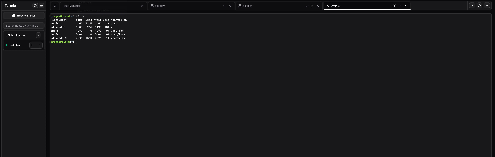
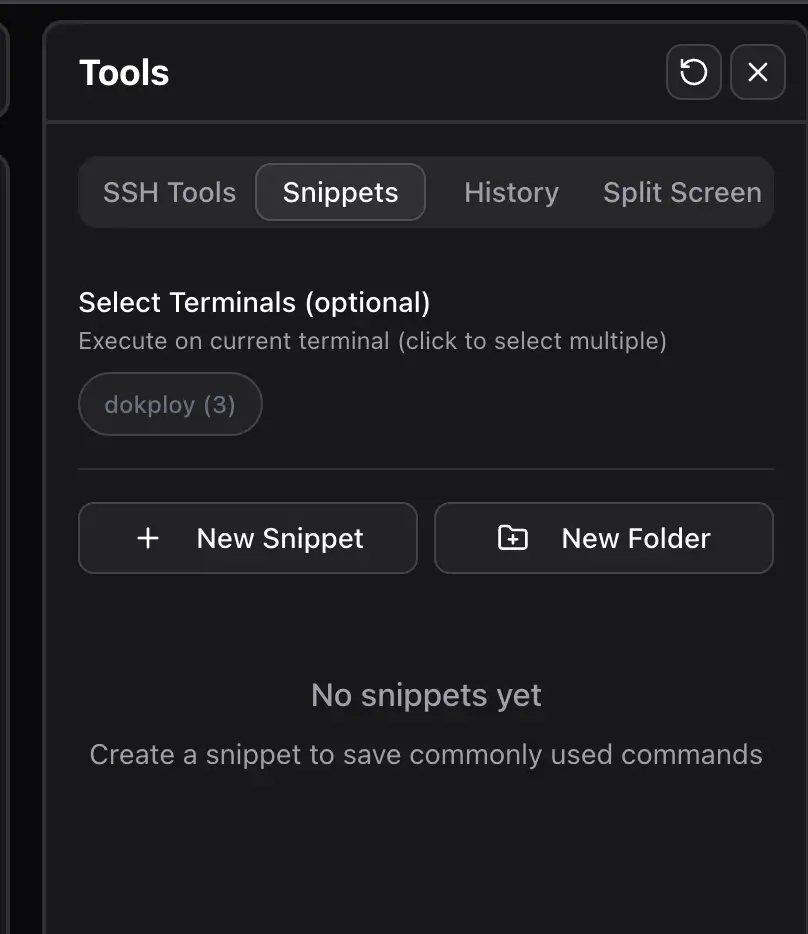
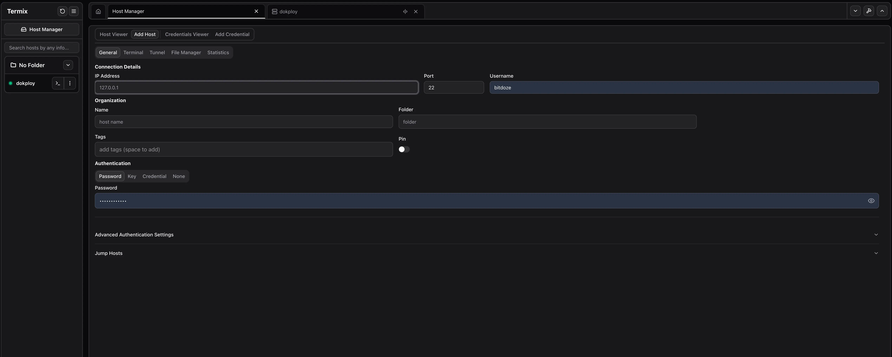
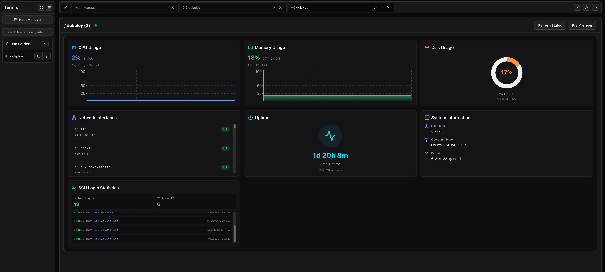
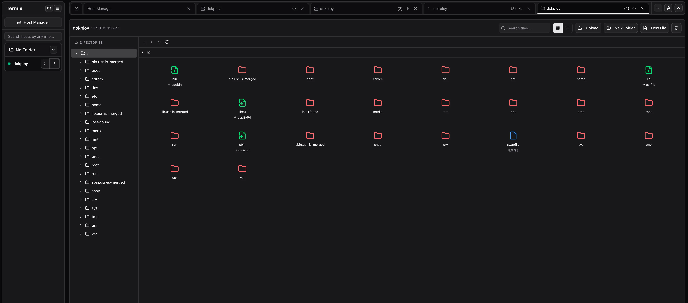
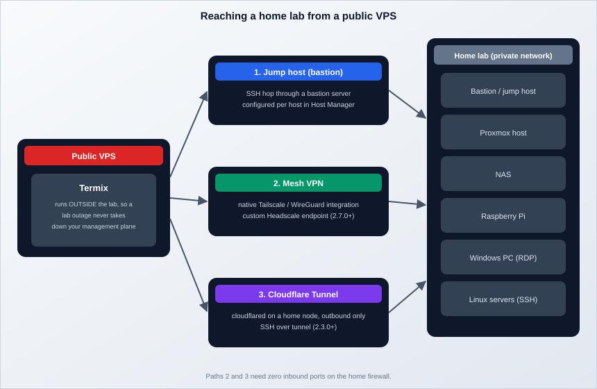
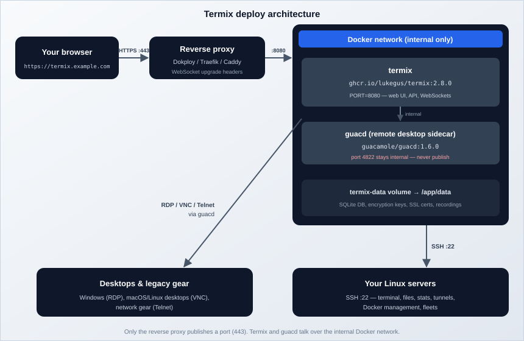

import Button from "@components/widgets/Button.astro";
import Notice from "@components/widgets/Notice.astro";
import ListCheck from "@components/widgets/ListCheck.astro";
import Accordion from "@components/widgets/Accordion.astro";
import Tabs from "@components/widgets/Tabs.astro";
import Tab from "@components/widgets/Tab.astro";
import YouTubeEmbed from "@components/widgets/YouTubeEmbed.astro";

Termix self-hosted puts a browser-based SSH manager, file manager, stats dashboard, and remote desktop gateway on your own server. It is an Apache-2.0 licensed project and a free Termius alternative: no external accounts and no paid tier. Since late 2025 it has grown from about 8,500 to over 15,000 GitHub stars, and the 2.x releases turned it from a terminal app into a full server hub. This guide covers the whole setup: deploy with Dokploy or Docker Compose, enable RDP/VNC remote desktop, and lock the deployment down.

## What is Termix?

Termix is a self-hosted SSH and remote desktop management platform. One web interface covers terminal sessions, SSH tunnels, file management, server stats, Docker containers, and browser-based RDP/VNC/Telnet. The project is Apache 2.0 licensed, donate-supported, and the README is explicit: it is a self-hosted alternative to Termius that stays free forever.

<YouTubeEmbed url="https://www.youtube.com/watch?v=FtVMs7ba4QQ" label="Termix Self-Hosted SSH Manager Overview" />

*Video shows the 1.x interface. Termix redesigned the UI (sidebar, host manager, navigation) in 2.3.0, so menus will look different on current versions.*

## What's new since late 2025

If you last looked at Termix when it was a 1.x terminal app, a lot has shipped since:

- **Remote desktop (2.0.0)**: RDP, VNC, and Telnet in the browser, powered by Guacamole's guacd
- **Desktop app** for Windows, macOS, and Linux, plus **Android and iOS apps**
- **Real Docker management** (1.10.0) with Podman support (2.5.0), not just a container list
- **RBAC roles, shared sessions, and API keys**
- **PostgreSQL and MySQL support** (2.7.0) alongside the SQLite default
- **Automations, fleet-wide commands, and alerts** (ntfy, Discord, webhook)
- **Termix AI** (2.7.0), optional and off by default
- **Telemetry is now on by default** (2.6.0). Opt-out is covered in the security section below

<Notice type="info" title="Deployed Termix before mid-2026?">
Check the security section before anything else. The minimum safe version is now 2.5.1 or newer; several critical CVEs were fixed in the 2.3.2 and 2.5.1 patch releases.
</Notice>

## Termix core features

The feature list that matters for daily ops:

<ListCheck>
<ul>
<li>SSH terminal with up to 6 split panels, persistent layouts, and workspaces</li>
<li>SSH tunnels with client, remote, and bridge modes, auto reconnect, and health checks</li>
<li>Remote desktop: RDP, VNC, and Telnet in the browser via guacd</li>
<li>Jump host (bastion) support for servers behind private networks</li>
<li>Session recording for terminal, RDP, and VNC, with downloadable plain-text logs</li>
<li>Remote file manager and editor with syntax highlighting and a cross-host clipboard</li>
<li>Docker and Podman management: start/stop/pause/remove, stats, and shell access</li>
<li>Automations, fleet-wide commands and file distribution, and metric alerts</li>
<li>Real-time CPU, memory, and disk stats with history graphs</li>
<li>SSO with OIDC, LDAP, GitHub, and Google, plus WebAuthn passkeys and TOTP 2FA</li>
<li>API keys, RBAC roles, and shareable live sessions</li>
<li>Serial connections and Proxmox discovery/import</li>
<li>Web app plus desktop (Windows/macOS/Linux) and mobile (Android/iOS) apps, around 30 languages</li>
</ul>
</ListCheck>

<Notice type="info" title="No accounts or subscriptions">
Termix requires no external account and has no paid plan. One caveat for privacy-minded operators: it sends opt-out telemetry by default since 2.6.0. How to turn that off is in the security section.
</Notice>

### SSH terminal, tunnels, and split screen

The terminal is the core of the app. Tabs, up to six split panels, sessions that survive a page refresh or a container restart, and per-host keepalive. Since 2.6.0 you can save split layouts, and 2.7.0 added workspaces so you can restore a whole set of sessions at once. Terminal session logging is built in if you need an audit trail of what was typed.

The tunnel story also grew up. On top of plain local tunnels with auto reconnect and health checks, 2.2.0 added remote and bridge tunnels with presets, and the desktop app has a dedicated port-forwarding tab since 2.8.0. That covers most cases where you would otherwise reach for an SSH config file full of `-L` and `-R` flags.

### Remote desktop: RDP, VNC, and Telnet in the browser

This is the 2.0.0 headline feature. Termix uses Apache Guacamole's guacd daemon to bring Windows RDP sessions, macOS/Linux VNC screens, and even Telnet gear into the same web UI as your SSH terminals. It is enabled per host, and it needs the guacd sidecar container (or an existing guacd you point to with `GUACD_URL`). The full setup is in the remote desktop section below.

### Docker and Podman management

Since 1.10.0 the Docker view is real container management: start, stop, pause, remove, live stats, and a shell into the container. 2.2.0 added a read-only mode for restricted users, and 2.5.0 added Podman support. The README is honest about scope: it "is not meant to replace Portainer or Dockge". For anything beyond quick ops, I still use [Dockge, a self-hosted Compose stack manager](https://www.bitdoze.com/dockge-install/). Termix Docker view is for "what is running and why is it failing", not for stack editing.

### Automations, fleets, and alerts

This is where the "server hub" pitch became real. Automations (2.7.0) chain triggers and steps: metric thresholds, host up/down events, schedules, or webhooks can fire commands and send notifications through ntfy, Discord, or generic webhooks. Fleets run one command, file push, package update, or inventory query across many hosts at once. Alerts arrived in 2.5.0. For a solo operator with a dozen servers, this replaces a pile of for-loops in bash.

One paragraph on Termix AI, because self-hosters will ask: it is off by default at both the admin and user level, propose-only (it suggests commands and runs them only after you approve, using your account's permissions), has no access to credentials, keys, or settings, and strips secrets before sending anything to the provider. You bring your own API key, and Ollama works for a fully local setup.

## App overview

Here is a quick tour of the main areas you will use daily. The screenshots show the 1.x interface, which was redesigned in Termix 2.3.0; the workflow is the same, the layout is not.

### Terminal workspace



*Screenshot shows the 1.x interface, redesigned in Termix 2.3.0.*

The browser terminal supports tabs and up to six split panels. Click the `<|>` icon on a tab (next to the close button) to open a split screen and the SSH tool sidebar for that session.

### Tools, snippets, and command history



*Screenshot shows the 1.x interface, redesigned in Termix 2.3.0.*

Click the hammer icon in the top right to open the tools sidebar. This is where you find SSH tools, command history, snippets, and split screen helpers.

### Add and manage hosts



*Screenshot shows the 1.x interface, redesigned in Termix 2.3.0.*

Open **Host Manager** to add SSH hosts, set tags and folders, and enable features per host: terminal, file manager, server stats, tunnels, remote desktop. You can also configure a **Jump Host** here to reach servers behind a private network.

To deploy credentials, add a key in **Add Credential**, then return to **Credential Viewer** and click the green arrow on the credential to follow the deployment steps. If the target rejects the key with "Too many authentication failures", the server is usually drowning in offered keys; here is how to [fix the SSH "Too many authentication failures" error](https://www.bitdoze.com/fix-ssh-too-many-authentication-failures/).

If you plan to use OIDC and the first login is refused, create the local admin account first, then connect your identity provider in admin settings. The 2.3.0 release added automatic OIDC provisioning, but local-first is the path of least resistance.

### Server details and tunnels



*Screenshot shows the 1.x interface, redesigned in Termix 2.3.0.*

After connecting to a host from the sidebar, open **Server Details** for CPU, memory, disk, process list, services, cron jobs, and tunnel status. Stats and tunnels only show up if they are enabled for that host in Host Manager. These are host-level snapshots, not a monitoring stack: for history, alerting, and multi-server dashboards, pair Termix with [Beszel and Uptime Kuma for dedicated server monitoring](https://www.bitdoze.com/beszel-uptime-kuma/).

### File manager and editor



*Screenshot shows the 1.x interface, redesigned in Termix 2.3.0.*

The file manager browses and edits files on Linux hosts directly in the UI: upload, download, compress, media playback, and since 2.7.0 a trash folder. A cross-host file clipboard (2.5.0) and server-to-server transfers (2.8.0) save you from scp round-trips. Enable **File Manager** on the host, then open it from the sidebar after connecting.

### Admin settings and identity

Admin users open **Admin Settings** from their username in the bottom left. This is where you configure:

- SSO (OIDC, LDAP, GitHub, Google) and registration rules
- Export/Import in the **Database** tab
- SSL certificate generation, if you want Termix to serve its own TLS
- The audit log (2.4.0+) and telemetry toggle (2.6.0+)

### SSH tunnel access

If a host has **Terminal** enabled, click the `>_` icon in the sidebar to open a session. Configured tunnels show their live status in **Server Details**.

### Command palette

Double tap **Left Shift** to open the command palette for quick navigation. That shortcut is still documented in the README, but worth a quick check in your build since the 2.3.0 UI redesign moved things around.

## How Termix compares to a tool stack

The honest framing: Termix replaces the daily-driver collection of small tools, not the specialized ones.

| Task | Typical stack | Termix |
| --- | --- | --- |
| SSH access | Terminal app | Built-in web terminal, up to 6 panels |
| File edits | SFTP + editor | Built-in file manager and editor |
| Server stats | Separate monitor | Built-in stats and history graphs |
| Tunnels | CLI or GUI tool | Built-in tunnels with reconnect |
| Docker control | Portainer or CLI | Real container management + Podman (not a Portainer/Dockge replacement) |
| Remote desktop | Apache Guacamole or jump box + VNC client | Built-in RDP/VNC/Telnet in the browser |
| Fleet commands | Ansible or for-loops in bash | Built-in fleets and automations |

Where it fits among the [best self-hosted server panels](https://www.bitdoze.com/best-self-hosted-panels/): panels like Casaos or Cosmos manage the server itself, Termix manages the servers you connect to. Running both is normal, not redundant.

## Accessing private networks: jump hosts, Tailscale, and Cloudflare Tunnel



If Termix runs on a public VPS but the interesting machines live in a home lab, you have three solid paths:

1. **Jump host**: configure a bastion in **Host Manager** and let Termix hop through it. The bastion is the one host you deliberately expose.
2. **Mesh VPN**: put Termix and your home nodes on the same overlay network. This is now native: Tailscale SSH authentication landed in 2.4.0, Tailscale/WireGuard host integration in 2.5.0, and 2.7.0 added a custom Headscale endpoint, so you can [self-host your own Tailscale control server with Headscale](https://www.bitdoze.com/headscale-self-hosted-tailscale-setup/) and point Termix at it.
3. **Cloudflare Tunnel**: 2.3.0 added SSH over Cloudflare Tunnel. cloudflared makes outbound connections only, so the home firewall stays closed.

One operational rule worth stealing from the project's own docs: run Termix outside the network it manages. If your management plane lives inside the lab and the lab goes down, you lose the tools you need to fix the lab.

For an always-on home node, a low-power box is the right tool; an N150 mini PC idles at 5-8W at the wall, next to nothing against an old desktop. I compared the current picks in [the mini PC home server guide](https://www.bitdoze.com/best-mini-pc-home-server/).

## What you need before you deploy

The "run this tonight" checklist:

<ListCheck>
<ul>
<li>A Linux x86_64 VPS or home server with Docker and Compose v2 (or an existing Dokploy instance)</li>
<li>A domain with a DNS record pointing at your server, if you want HTTPS through a reverse proxy or Dokploy</li>
<li>Ports 8080 (internal) and 443 (public) reachable on your network path</li>
<li>SSH key access to the hosts you plan to manage</li>
<li>A decision on remote desktop: it adds a guacd container and roughly 1 core + 1 GB RAM</li>
</ul>
</ListCheck>

## Termix requirements and sizing

Official benchmarks (Termix docs, tested on v2.7.0) make this one of the cheapest self-hosted services to justify:

| Resource | Official numbers |
| --- | --- |
| Idle RAM | ~118 MB |
| Small fleets | 1 core / 1 GB RAM covers up to 100 hosts |
| Remote desktop | Add ~1 core / 1 GB for the guacd sidecar |
| Disk | ~1 KB per host |
| Per monitored host | ~55 KB RAM; metrics history ~216 KB/host/day at 30s interval |
| Metrics retention | 7 days by default, ~150 MB at 100 hosts |
| Practical ceiling | ~20,000 monitored hosts (tune with `METRICS_POLL_CONCURRENCY`) |

Translation: the smallest VPS tier from any real provider is enough, which puts this in the few euros/dollars per month range. Benchmarks do not include remote desktop load, so if you plan long RDP sessions, use the guacd sizing row. If you are shopping, the [cheapest Hetzner Cloud plans](https://www.bitdoze.com/hetzner-cloud-cost-optimized-plans/) are a good baseline for EU latency, or [Vultr](https://go.bitdoze.com/vultr) if you need a global footprint.

_VPS prices jumped across the board in 2026 — if you're rethinking a rented box, see [what changed and when a mini PC wins](/vps-price-increases/)._

<Button text="Try Hetzner Cloud Now" link="https://go.bitdoze.com/hetzner" variant="solid" color="blue" size="lg" external={true} icon="rocket-launch" />
<Button text="Try Hostinger VPS" link="https://go.bitdoze.com/hostinger-vps" variant="solid" color="green" size="lg" external={true} icon="rocket-launch" />

Here is the target architecture before you deploy:



## Deploy Termix with Dokploy

If you already use Dokploy, this is the fastest path: automatic HTTPS, the `dokploy-network` wired up, and one-click redeploy. If you do not have Dokploy yet, start with the [Dokploy install guide](https://www.bitdoze.com/dokploy-install/).

### Step 1: Create the service

1. Open your Dokploy project
2. Click **Add Service** and choose **Compose**
3. Name it `termix`

### Step 2: Paste the compose file

The full walkthrough of service types is in [how to deploy a Docker Compose app in Dokploy](https://www.bitdoze.com/dokploy-docker-compose-app/). Use this compose, which pins the version and adds the guacd sidecar:

```yaml
services:
  termix:
    image: ghcr.io/lukegus/termix:2.8.0
    networks:
      - dokploy-network
    restart: unless-stopped
    environment:
      - PORT=8080
      - ENABLE_TELEMETRY=false   # optional, locks telemetry off
    volumes:
      - termix-data:/app/data
    depends_on:
      - guacd

  guacd:
    image: guacamole/guacd:1.6.0
    restart: unless-stopped
    networks:
      - dokploy-network
    # no ports: keep 4822 internal

networks:
  dokploy-network:
    external: true

volumes:
  termix-data:
```

<Notice type="info" title="Compose notes">
- `termix-data` stores the database, encryption keys, SSL certs, and session recordings. Keep it on local disk for performance and back it up.
- The pinned `2.8.0` tag beats `:latest` for an internet-facing credential vault. Patch releases (2.6.1, 2.7.1) arrive as separate tags.
- Dokploy maps your domain to port 8080 and terminates HTTPS for you, so neither container publishes a port directly.
</Notice>

### Step 3: Domain and port

Create a domain in Dokploy and map it to port **8080**. Deploy, then open `https://your-domain.com` and complete the first-run setup (create the admin account; the onboarding flow was reworked in 2.7.0, so it may differ from older screenshots).

### Step 4: Verify

- In Dokploy, both services show **Running**: `termix` and `guacd`
- Open the domain, log in, and confirm the version under **Admin Settings**
- If remote desktop errors later with "guacd unreachable", the fix is usually name resolution across the shared network: set `GUACD_URL=tcp://guacd:4822` explicitly on the termix service

## Deploy Termix with Docker Compose (standalone)

No Dokploy? Plain Compose works the same. This mirrors the official docs compose, with the version pinned and guacd kept internal:

```yaml
services:
  termix:
    image: ghcr.io/lukegus/termix:2.8.0
    container_name: termix
    restart: unless-stopped
    ports:
      - "8080:8080"
    environment:
      PORT: "8080"
      # ENABLE_TELEMETRY: "false"
    volumes:
      - termix-data:/app/data
    depends_on:
      - guacd
    networks:
      - termix-net

  guacd:
    image: guacamole/guacd:1.6.0
    container_name: guacd
    restart: unless-stopped
    networks:
      - termix-net
    # no ports: keep 4822 internal

volumes:
  termix-data:
    driver: local

networks:
  termix-net:
    driver: bridge
```

Start and verify:

```bash
docker compose up -d
docker compose ps                       # both containers Up
docker compose logs termix --tail 50    # watch startup/migrations
curl -fsS -o /dev/null -w '%{http_code}\n' http://localhost:8080   # expect 200
```

Then open `http://your-server-ip:8080` and finish the initial setup. After login, check **Admin Settings** for the version and the telemetry toggle.

If you plan to keep 8080 exposed on a LAN-only box, fine. On a public server, do not: put a reverse proxy in front (next section) and firewall the raw port.

Useful environment variables beyond `PORT` (full list in the [Termix docs](https://docs.termix.site/setup/environment-variables)):

| Variable | Example | Purpose |
| --- | --- | --- |
| `PORT` | `"8080"` | HTTP port. App default is 4090; avoid 30001-30005 (reserved) |
| `ENABLE_TELEMETRY` | `"false"` | Locks telemetry off for the instance |
| `DATABASE_DIALECT` / `DATABASE_URL` | `postgres://...` | External PostgreSQL/MySQL/MariaDB (2.7.0+) |
| `DATABASE_SSL` | `"require"` | TLS for an external DB over untrusted networks |
| `GUACD_URL` | `tcp://guacd:4822` | Point at an existing guacd instead of the sidecar (host:port works too) |
| `VITE_BASE_PATH` | `/termix/` | Sub-path deploys (1.11.1+) |

<Notice type="warning" title="Back up your data volume">
Everything lives in `/app/data`: the database, per-user encrypted credentials and keys, SSL certs, and session recordings. Keep the `termix-data` volume backed up like any other critical service, and test the restore. A backup without the encryption keys is a paperweight.
</Notice>

Two failure modes to expect on fresh installs: port 8080 already bound by another stack (change the host side of the mapping), and a stale `termix-data` volume from a pre-2.x install (check the logs for migration errors before assuming the image is broken).

## Post-deploy checklist

The first ten minutes after either deploy path:

<ListCheck>
<ul>
<li>Create the admin account, then enable 2FA or register a passkey</li>
<li>Disable open registration</li>
<li>Confirm the running version is at least 2.5.1, ideally pinned 2.8.0</li>
<li>Set the telemetry preference (Admin Settings, or the env var above)</li>
<li>Add SSH hosts with tags and folders; test terminal and file manager</li>
<li>Configure the tunnels you need for internal services</li>
<li>Confirm Docker visibility and that container actions work</li>
</ul>
</ListCheck>

Then harden it. The security section below is not optional reading for this particular app.

## Enable Termix remote desktop with guacd

Remote desktop arrived in 2.0.0 and is the feature that turns Termix from an SSH tool into a genuine all-in-one. Both compose files above already include the sidecar; this section explains the knobs.

**Enable per host.** In Host Manager, enable the remote desktop feature on the host, then set the protocol and connection details. Protocols and when to use them:

| Protocol | Typical targets |
| --- | --- |
| RDP | Windows machines with Remote Desktop enabled |
| VNC | macOS Screen Sharing, Linux desktops, VM consoles |
| Telnet | Legacy network gear (use only on trusted networks) |

**Capacity.** The official benchmarks add roughly 1 core and 1 GB RAM when guacd is in play. Long RDP sessions are CPU-bound on the guacd container, not on Termix itself.

**Keep guacd private.** Some docs examples publish `4822:4822`. That is a LAN pattern. On a VPS, do not publish 4822; keep both containers on the same compose or Dokploy network and let them talk internally. guacd has no authentication of its own, so anything that can reach 4822 can drive your desktop sessions.

**Point at an existing guacd.** Already running Guacamole? Skip the sidecar and set `GUACD_URL=tcp://your-guacd-host:4822` on the termix service.

Known pain points from the 2026 releases, now fixed: RDP through a jump host works since 2.6.0, and VNC to macOS Screen Sharing stopped showing black screens with the 2.7.0/2.8.0 fixes. If you see either symptom, you are on an old tag.

## Reverse proxy and HTTPS (Nginx, Traefik, Caddy)

The golden rule: never expose raw port 8080 to the internet. Termix holds SSH credentials, so it sits behind HTTPS and ideally an additional access layer.

Termix is WebSocket-heavy (terminals, RDP, live stats), so the one reverse-proxy mistake to avoid is missing upgrade headers. Symptoms: the UI loads, then terminals disconnect or never connect.

<Tabs>
<Tab name="Nginx">

```nginx
server {
    listen 443 ssl;
    server_name termix.example.com;

    location / {
        proxy_pass http://127.0.0.1:8080;
        proxy_http_version 1.1;
        proxy_set_header Upgrade $http_upgrade;
        proxy_set_header Connection "upgrade";
        proxy_set_header Host $host;
        proxy_set_header X-Real-IP $remote_addr;
        proxy_set_header X-Forwarded-For $proxy_add_x_forwarded_for;
        proxy_set_header X-Forwarded-Proto $scheme;
        proxy_read_timeout 3600s;
    }
}
```

The `Upgrade`/`Connection` pair and `proxy_http_version 1.1` are the lines that make terminals work; `proxy_read_timeout` keeps long sessions from dying at the 60-second default.

</Tab>
<Tab name="Traefik">

```yaml
labels:
  - "traefik.enable=true"
  - "traefik.http.routers.termix.rule=Host(`termix.example.com`)"
  - "traefik.http.routers.termix.entrypoints=websecure"
  - "traefik.http.routers.termix.tls.certresolver=myresolver"
  - "traefik.http.services.termix.loadbalancer.server.port=8080"
```

Traefik handles WebSockets without extra config; just make sure the service port is 8080.

</Tab>
<Tab name="Caddy">

```text
termix.example.com {
    reverse_proxy 127.0.0.1:8080
}
```

Caddy works out of the box, WebSockets included. This is my default when I am not already on Dokploy's Traefik.

</Tab>
</Tabs>

Two extras for special setups: sub-path deployments work with `VITE_BASE_PATH=/termix/` (1.11.1+), and 2.7.0 added trusted-proxy auth (`TRUSTED_PROXY_AUTH_*` env vars) if your proxy owns the login flow, for example behind Authelia or similar.

## Database options: SQLite, PostgreSQL, or MySQL

The default is SQLite in the `termix-data` volume, and for a solo operator that is the right answer: fewer moving parts, one file to back up.

PostgreSQL, MySQL, and MariaDB are supported since 2.7.0 for central backups or multi-instance setups:

```yaml
environment:
  DATABASE_DIALECT: "postgres"        # or mysql (MariaDB uses mysql + a mariadb:// URL)
  DATABASE_URL: "postgres://termix:password@db:5432/termix"
  # DATABASE_SSL: "require"           # for untrusted networks
```

<Notice type="warning" title="No automatic SQLite to Postgres migration">
Switching dialects does not carry your data over. You get an empty Termix. Use the Export/Import in Admin Settings first (hosts, credentials, snippets), or pgloader if you want the full database.
</Notice>

Keep the `termix-data` volume even on an external database. It still holds the encryption keys, SSL certificates, and session recordings, so the "just delete the volume" instinct after switching to Postgres will cost you your stored credentials.

Cost/ops note: an external DB is one more service to back up, patch, and connection-limit. Unless you have a concrete reason (shared cluster, centralized backups), SQLite plus volume backups is the boring, correct default.

## Termix security: updates, exposure, and telemetry

This section replaces the "it's self-hosted, so it's safe" hand-wave, because 2026 tested that assumption. Termix has published over 30 security advisories, several critical. An app that stores SSH credentials for all your servers deserves the same discipline as your VPN.

### Which version should you run?

<Notice type="error" title="Minimum safe version: 2.5.1">
The 2026 advisory wave included multiple criticals: file-manager and tunnel command-injection RCEs plus an IDOR that exposed other users' SSH passwords (fixed in 2.3.2), and critical tunnel/ACME handler injection bugs (fixed in 2.5.1). The same 2.5.1 release also fixed a hardcoded default encryption key, CVE-2026-79762, which allowed full offline decryption of stored SSH credentials for OIDC/WebAuthn users if the data directory leaked. Run 2.5.1 or newer; pin 2.8.0 today.
</Notice>

Three practical rules:

- **Pin the image tag** (`ghcr.io/lukegus/termix:2.8.0`), never `:latest` on an internet-facing credential vault. Updates become a deliberate `docker compose pull && docker compose up -d`, and on Dokploy that is covered by [how to update Docker Compose stacks in Dokploy](https://www.bitdoze.com/dokploy-update-docker-compose/).
- **Update faster if you run multi-user.** Much of the 2026 wave was cross-user (IDOR, credential theft). A single-admin box has a smaller blast radius; a team install does not.
- **Watch the advisories**, not just releases: the GitHub security tab is where criticals appear first.

Verify after updating: `docker compose ps` shows the pinned tag (or check the service in Dokploy), and the version in Admin Settings matches.

### Lock down access

- **Disable open registration.** Anyone who finds your URL should not be able to create an account.
- **If you use SSO, allow-list it.** `OIDC_ALLOWED_USERS` (and the admin-side allow-list setting) restricts which identities can get in. 2.7.0 added PKCE and trusted-proxy auth for stricter setups.
- **Enable the audit log** (Admin Settings, 2.4.0+). After your next login, check that entries appear; an audit log you never look at is decoration.
- **HTTPS always**, through the reverse proxy setup above. For an SSH-credential vault on a public IP, add IP allow-listing at the proxy or a VPN front door.
- **Firewall the host.** My baseline for a public Docker box is in [how I secured my Docker server with UFW](https://www.bitdoze.com/bsi-security-report-docker-ufw/), and [CrowdSec](https://www.bitdoze.com/crowdsec-secure-server/) adds brute-force protection worth having in front of any login page.
- **Be careful with session-share links.** 2.6.0 added sharing live terminal/RDP sessions via link with no account required. Convenient for pairing, risky by default. If you do not need it, disable it globally or per host.

### Telemetry and privacy

Since 2.6.0, Termix sends a daily ping to PostHog by default. Per the README it contains a random instance ID, user and host counts, version, and feature usage. No usernames, hostnames, or IPs. That is about as benign as telemetry gets. It is still your server making a daily call you did not ask for, so make the choice explicitly.

Opt out either way: **Admin Settings → General**, or set `ENABLE_TELEMETRY=false` in the environment, which locks the toggle off for the whole instance. My take: on a personal box the env var is the set-and-forget answer.

### Backups and recovery

What is in `termix-data` (the `/app/data` volume): the SQLite database, per-user encryption keys, generated SSL certs, and session recordings. Back it up like you would a database, not like a static site:

```bash
# find the exact volume name (compose prefixes it with the project name)
docker volume ls | grep termix

# tar it up
docker run --rm -v termix_termix-data:/data -v $(pwd):/backup alpine \
  tar czf /backup/termix-data-$(date +%F).tar.gz -C /data .
```

Ship the archive off-box (S3-compatible storage, restic, whatever you already use). The Export/Import in Admin Settings is a good supplement for hosts and credentials, but it is not a substitute for the volume backup.

<Notice type="warning" title="Test the restore">
Credentials in `/app/data` are encrypted per user (on patched versions; see the version note above). Restore into a fresh container at the same pinned version, log in, and open a host's credentials before you trust the backup. Do this once now, not during an outage.
</Notice>

## Troubleshooting common Termix issues

| Symptom | Likely cause | Fix |
| --- | --- | --- |
| `docker compose up` fails with "port is already allocated" | 8080 bound by another stack | Change the host side of the port mapping, or stop the other service |
| Terminals (and RDP) disconnect after ~60s behind a proxy | Missing WebSocket upgrade headers | Add `Upgrade`/`Connection` headers and raise `proxy_read_timeout` (Nginx tab above) |
| Remote desktop errors: guacd unreachable | guacd not on the same network, or name resolution failed | Put both containers on one compose network; set `GUACD_URL=tcp://guacd:4822` explicitly |
| Login or registration loop after a restore | Stale `termix-data` from an older version vs newer image | Check logs for migration errors; restore into the matching version, then upgrade |
| No CPU/memory stats for a host | Server stats not enabled per host | Enable **Server Stats** for that host in Host Manager |
| Container OOM-killed on a tiny VPS | Metrics polling + guacd on a 512 MB box | Size per the benchmarks: 1 GB base plus 1 GB with guacd |
| "Too many authentication failures" when connecting | SSH client offers too many keys | Fix the key offer on the client side; see the linked guide in the host manager section |

## FAQ

<Accordion label="Does Termix replace SSH keys?" group="faq" expanded="true">
No. Termix uses standard SSH authentication under the hood. You still manage keys and credentials the same way you do today; Termix just stores and deploys them for you, encrypted per user on patched versions (2.5.1+).
</Accordion>

<Accordion label="Where does Termix store its data?" group="faq">
All data lives under `/app/data` inside the container, which maps to the `termix-data` volume in both compose files above. That volume holds the database, encryption keys, SSL certs, and session recordings, even if you switch to an external database.
</Accordion>

<Accordion label="Can I expose Termix with HTTPS?" group="faq">
Yes, and you should. Put it behind Nginx, Traefik, or Caddy with WebSocket support, or use Dokploy's domain mapping. Never expose raw port 8080 on a public server; for an app holding your SSH credentials, add IP allow-listing or a VPN front door on top.
</Accordion>

<Accordion label="Is Termix a good free Termius alternative?" group="faq">
For self-hosters, yes, and that is the project's own positioning. You get the synced host library, snippets, and SFTP-style file management that paid Termius plans sell, but the sync server is your own and there is no subscription. What you give up is polish on mobile and someone else running the infrastructure.
</Accordion>

<Accordion label="Does Termix support remote desktop (RDP/VNC)?" group="faq">
Yes, since 2.0.0. It uses Apache Guacamole's guacd to render RDP, VNC, and Telnet sessions in the browser. You need the guacd sidecar container (or an existing guacd via `GUACD_URL`), and it is enabled per host in the Host Manager.
</Accordion>

<Accordion label="Does Termix phone home?" group="faq">
It sends opt-out telemetry by default since 2.6.0: a daily PostHog ping with a random instance ID, user/host counts, version, and feature usage. No usernames, hostnames, or IPs. Turn it off in Admin Settings, or set `ENABLE_TELEMETRY=false` to lock it off for the instance.
</Accordion>

<Accordion label="Can I use PostgreSQL with Termix?" group="faq">
Yes, since 2.7.0, via `DATABASE_DIALECT` and `DATABASE_URL` (MySQL and MariaDB too). Two gotchas: there is no automatic SQLite-to-Postgres migration, so export/import first, and keep the `termix-data` volume regardless because it holds encryption keys and certificates.
</Accordion>

<Accordion label="How much RAM does Termix need?" group="faq">
Very little. Official benchmarks show about 118 MB idle, and 1 GB total covers up to 100 hosts. Add roughly 1 GB if you use the guacd remote desktop sidecar. The smallest VPS tier you can buy is enough.
</Accordion>

<Accordion label="Do I need guacd?" group="faq">
Only for remote desktop. If you just want SSH terminals, tunnels, files, stats, and Docker, omit the guacd service and the network wiring. Termix detects it and simply hides the remote desktop features.
</Accordion>

<Accordion label="Is there a desktop or mobile app?" group="faq">
Yes, all shipped. The desktop app (Connector) runs on Windows, macOS, and Linux, standalone-first with optional server sync. Mobile apps are on Android 7.0+ (Play Store and APK) and iOS 15.1+ (App Store as "Termix SSH Companion").
</Accordion>

<Accordion label="Which version should I run?" group="faq">
At least 2.5.1, which fixed a wave of critical CVEs including a hardcoded encryption key. Today that means pinning `ghcr.io/lukegus/termix:2.8.0`. If you run multi-user with RBAC, treat updates as urgent rather than routine; much of the 2026 advisory wave was cross-user.
</Accordion>

## Final thoughts

Termix self-hosted has outgrown the "nice SSH web client" label. With remote desktop, fleet commands, and real container management in one Apache-2.0 package, it covers most of what a solo operator opens five tabs for, and the release cadence through 2026 shows a project that is very much alive. The trade-off is update discipline: run 2.5.1 or newer, pin the tag, and treat it with the respect you would give any credential vault.

If you are starting from a bare server, the [Dokploy install guide](https://www.bitdoze.com/dokploy-install/) gets you the deployment layer first, and the [self-hosted Tailscale with Headscale](https://www.bitdoze.com/headscale-self-hosted-tailscale-setup/) setup pairs perfectly with Termix 2.7.0's native Headscale support for reaching home labs.

<Button text="View Termix on GitHub" link="https://github.com/Termix-SSH/Termix" variant="solid" color="blue" size="md" icon="arrow-right" />
