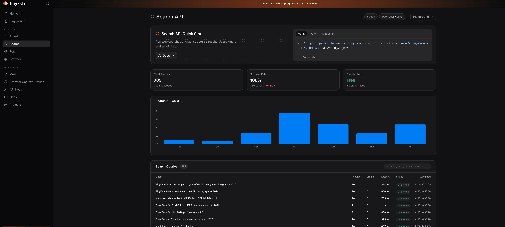
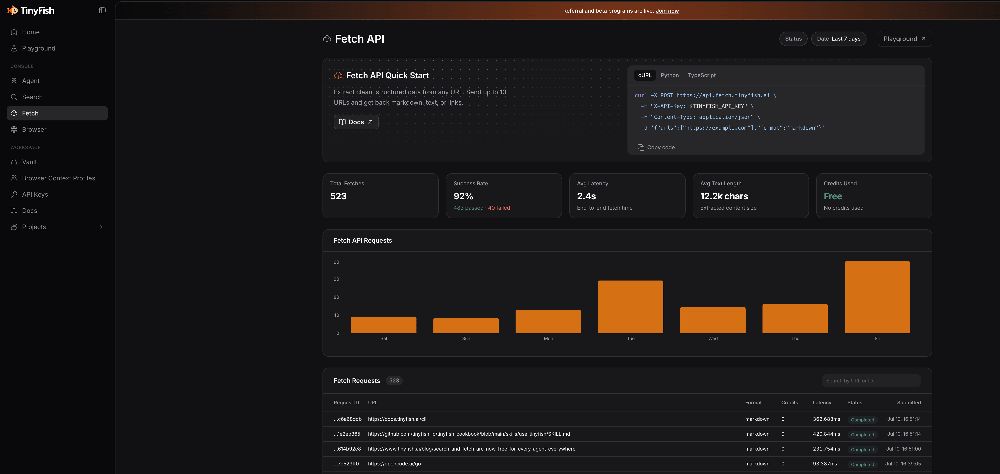

import Button from "@components/widgets/Button.astro";
import Notice from "@components/widgets/Notice.astro";
import ListCheck from "@components/widgets/ListCheck.astro";
import Accordion from "@components/widgets/Accordion.astro";
import Tabs from "@components/widgets/Tabs.astro";
import Tab from "@components/widgets/Tab.astro";

Every AI coding agent hits the same wall eventually. You ask it something about a library's latest API, a Docker image that changed its tagging scheme, or a config format that got updated last week. The model's training data stops in 2025 (or earlier), and it either hallucinates or tells you to check the docs yourself. Not helpful.

The fix is giving your agent access to the live web. And that is where [TinyFish](https://tinyfish.ai/) comes in. TinyFish provides structured web search and clean page fetching through a single API key. Search and Fetch are free — no credit card, no trial period, just sign up and go.

I have been using TinyFish through the [pi-tinyfish](https://github.com/x1any/pi-tinyfish) package in [Pi coding agent](/pi-coding-agent-setup-guide/) and in [Mastra](/build-ai-agent-mastra/) for months now. It works well enough that I want to lay out what it does, how to set it up, and why it matters for agents like [Hermes](/hermes-agent-setup-guide/), [OpenClaw](/clawdbot-setup-guide/), and [OpenCode](/opencode-setup-guide/) too.

<Button text="Get a free TinyFish API key" link="https://go.bitdoze.com/tinyfish" variant="solid" color="blue" size="md" icon="arrow-right" />

<Notice type="info" title="What this guide covers">
<ListCheck>
<ul>
<li>What TinyFish is and how Search + Fetch work</li>
<li>Setting up TinyFish with Pi coding agent via pi-tinyfish</li>
<li>Using TinyFish with Hermes Agent, OpenClaw, and other coding agents</li>
<li>The TinyFish Cookbook: ready-made recipes for common automation tasks</li>
<li>Pricing tiers and rate limits</li>
</ul>
</ListCheck>
</Notice>

## What TinyFish actually does


<YouTubeEmbed
  url="https://www.youtube.com/embed/Hu_OGbBEW3M"
  label="FREE TinyFish Makes AI Agents Actually Useful"
/>

TinyFish has four endpoints, but you really only need two of them to start:

**Search** takes a query and returns structured JSON results. Not a list of blue links meant for human eyes — rank-stable, clean data that an LLM can parse without guessing. Response times sit under 500ms. You can pass location and language hints for geo-targeted results.

**Fetch** takes one or more URLs and returns clean content. The page gets rendered in a real Chromium browser (JavaScript, SPAs, the works), then all the navigation bars, cookie banners, ads, and scripts get stripped out. You get markdown, HTML, or JSON back. Your model stops paying tokens for junk HTML.

The two heavier endpoints — Agent (natural-language browser automation) and Browser (raw CDP sessions) — are metered and cost credits. For coding agent use, Search and Fetch cover 95% of what you need.

### Real usage stats

Here's what the TinyFish dashboard looks like in practice. These are actual stats from coding agents using the free tier:

**Search API** — 40.6K total requests with 360ms average response time. Top users include Codex CLI, OpenCode, Claude Code, and Gemini CLI:



**Fetch API** — 65.6K total requests. The Skills integration is the biggest user, followed by Gemini CLI, OpenCode, and Claude Code:



### Why this matters for coding agents

Most coding agents rely on the model's training data for anything outside your codebase. That works for stable patterns and well-documented APIs. It falls apart for:

- **Recent releases** — a library that shipped breaking changes last week
- **Version-specific quirks** — "does this Docker image still support ARM64 in v3?"
- **Community solutions** — the GitHub issue where someone already solved your exact problem
- **Documentation lookups** — reading the actual docs instead of guessing from memory

Giving your agent a search+fetch pipeline turns it from "I think this is how it works" to "here is the current documentation, and here are three GitHub issues confirming this behavior."

## Setting up TinyFish with Pi coding agent

Pi already has TinyFish support through the [pi-tinyfish](https://github.com/x1any/pi-tinyfish) package. It adds two tools to your agent: `tinyfish_search` and `tinyfish_fetch`. Install takes one command.

### Step 1: Get your API key

Sign up at [agent.tinyfish.ai](https://agent.tinyfish.ai/). No credit card. Copy the API key from the dashboard.

### Step 2: Install pi-tinyfish

<Tabs>
<Tab name="npm">
```bash
pi install npm:pi-tinyfish
```
</Tab>
<Tab name="git">
```bash
pi install git:github.com/x1any/pi-tinyfish
```
</Tab>
</Tabs>

### Step 3: Set the API key

```bash
export TINYFISH_API_KEY="your_api_key_here"
```

Add that to your shell profile (`~/.bashrc`, `~/.zshrc`, or `~/.config/fish/config.fish`) so it persists across sessions.

### Step 4: Use it

That is it. Next time you start Pi in a project, the agent can call `tinyfish_search` and `tinyfish_fetch` as tools. When it needs to look up something about a library, check docs, or verify a config format, it will search the web and fetch the relevant pages automatically.

The search latency is typically 1-3 seconds. Fetch can take a few seconds longer depending on the page. Both tools default to sensible timeouts (10s for search, 150s for fetch).

<Notice type="success" title="Token savings">
TinyFish Fetch strips navigation, scripts, and boilerplate from pages before returning content. Your model processes the actual article content, not three kilobytes of cookie consent banners and footer links. This cuts token usage per fetch significantly.
</Notice>

## Using TinyFish with Hermes Agent

[Hermes Agent](/hermes-agent-setup-guide/) from Nous Research has a built-in web search tool, but TinyFish gives you more control over the search results and adds clean page fetching that Hermes does not have out of the box.

There are three ways to wire TinyFish into Hermes:

### Option 1: MCP Server

TinyFish runs an MCP server at `https://mcp.tinyfish.ai`. Add it to your Hermes MCP config:

```json
{
  "mcpServers": {
    "tinyfish": {
      "url": "https://mcp.tinyfish.ai"
    }
  }
}
```

This gives Hermes access to both Search and Fetch through the standard MCP protocol. The agent sees them as native tools.

### Option 2: Agent Skill

Install the TinyFish skill from the cookbook:

```bash
npx skills add github.com/tinyfish-io/tinyfish-cookbook --skill use-tinyfish
```

This teaches Hermes when to reach for Search vs Fetch vs Agent, and how to call them correctly. The skill includes decision logic — use search for finding URLs, fetch for reading known pages, and escalate to agent only when interactive browser automation is needed.

### Option 3: CLI wrapper

If you prefer shell-based integration, install the CLI:

```bash
npm install -g @tiny-fish/cli
tinyfish auth login
```

Then Hermes can call `tinyfish search query "..."` and `tinyfish fetch content get <urls>` through its terminal access. The CLI writes results to the filesystem instead of piping through the model's context, which keeps token usage low.

### Which approach to pick

MCP is the cleanest if your Hermes version supports it. The skill approach works well if you want the agent to understand the tool hierarchy (search first, fetch second, agent last). CLI is the fallback that works everywhere.

## Using TinyFish with Claude Code

Claude Code has a one-shot helper to wire TinyFish as the web search/fetch backend:

```bash
tinyfish config-claude            # install
tinyfish config-claude --remove   # uninstall
```

This installs the MCP server configuration automatically. No manual config editing needed.

## Using TinyFish with OpenCode, OpenClaw, and others

The same patterns apply to [OpenClaw](/clawdbot-setup-guide/), [OpenCode](/opencode-setup-guide/), [Mastra](/build-ai-agent-mastra/), Cursor, Codex, and any other coding agent that supports MCP, skills, or shell access.

### MCP for any agent

The MCP server URL is the same regardless of which agent you use:

```json
{
  "mcpServers": {
    "tinyfish": {
      "url": "https://mcp.tinyfish.ai"
    }
  }
}
```

This works with Claude Code, Cursor, Codex, ChatGPT desktop, and any MCP-aware client. Drop it in your config and restart.

### CLI setup (works everywhere)

The CLI is the most portable option. It works with any agent that can run shell commands:

```bash
npm install -g @tiny-fish/cli@latest
tinyfish auth login
```

For CI/CD or non-interactive setups:

```bash
echo $TINYFISH_API_KEY | tinyfish auth set
```

Verify it works:

```bash
tinyfish --version
tinyfish auth status --pretty
```

### Install the skill

The TinyFish skill teaches your agent when to reach for search vs fetch vs agent:

```bash
npx skills add github.com/tinyfish-io/tinyfish-cookbook --skill use-tinyfish
```

The skill covers the escalation ladder: search for finding URLs, fetch for reading pages, agent for interactive browser tasks, and browser for raw CDP control.

### REST API for custom integrations

If you are building something custom or your agent does not support MCP, use the REST endpoints directly:

```bash
# Search
curl "https://api.search.tinyfish.ai?query=docker+compose+healthcheck" \
  -H "X-API-Key: $TINYFISH_API_KEY"

# Fetch
curl -X POST https://api.fetch.tinyfish.ai \
  -H "X-API-Key: $TINYFISH_API_KEY" \
  -H "Content-Type: application/json" \
  -d '{"urls": ["https://docs.docker.com/compose/how-tos/startup-order/"]}'
```

Both endpoints return JSON. Search gives you ranked results with titles, snippets, and URLs. Fetch gives you the cleaned page content plus metadata (title, language, author, published date).

### SDKs for programmatic use

<Tabs>
<Tab name="Python">
```bash
pip install tinyfish
```
```python
from tinyfish import TinyFish

client = TinyFish()  # reads TINYFISH_API_KEY from env

# Search
results = client.search.query("best React state management 2026")

# Fetch
content = client.fetch.content.get(
    urls=["https://tanstack.com/query/latest"],
    format="markdown"
)
```
</Tab>
<Tab name="TypeScript">
```bash
npm install @tiny-fish/sdk
```
```typescript
import { TinyFish } from "@tiny-fish/sdk";

const client = new TinyFish(); // reads TINYFISH_API_KEY from env

// Search
const results = await client.search.query("best React state management 2026");

// Fetch
const content = await client.fetch.content.get({
  urls: ["https://tanstack.com/query/latest"],
  format: "markdown",
});
```
</Tab>
</Tabs>

## The TinyFish Cookbook

The [TinyFish Cookbook](https://github.com/tinyfish-io/tinyfish-cookbook) is a collection of ready-made projects built on top of TinyFish. Some of them are genuinely useful:

| Project | What it does |
|---------|-------------|
| [viet-bike-scout](https://github.com/tinyfish-io/tinyfish-cookbook/tree/main/viet-bike-scout) | Motorbike rental price comparison across Vietnamese cities |
| [openbox-deals](https://github.com/tinyfish-io/tinyfish-cookbook/tree/main/openbox-deals) | Open-box and refurbished deal aggregator across 8 retailers |
| [competitor-scout-cli](https://github.com/tinyfish-io/tinyfish-cookbook/tree/main/competitor-scout-cli) | Natural-language CLI for researching competitor pricing |
| [silicon-signal](https://github.com/tinyfish-io/tinyfish-cookbook/tree/main/silicon-signal) | Semiconductor supply chain tracker |
| [code-reference-finder](https://github.com/tinyfish-io/tinyfish-cookbook/tree/main/code-reference-finder) | Find real-world usage examples for code snippets on GitHub and Stack Overflow |
| [tinyskills](https://github.com/tinyfish-io/tinyfish-cookbook/tree/main/tinyskills) | Generates SKILL.md guides from docs, GitHub, and developer blogs |

The code-reference-finder is the one I keep coming back to. Paste a function signature, and it searches GitHub and Stack Overflow for real usage examples. Saves a lot of "how does anyone actually use this API" time.

The cookbook also includes the [use-tinyfish skill](https://github.com/tinyfish-io/tinyfish-cookbook/blob/main/skills/use-tinyfish/SKILL.md) that teaches any coding agent the right tool to reach for. It covers the escalation ladder: search for finding URLs, fetch for reading pages, agent for interactive browser tasks, and browser for raw CDP control.

<Button text="Browse the TinyFish Cookbook" link="https://github.com/tinyfish-io/tinyfish-cookbook" variant="solid" color="blue" size="md" icon="github" />

## Pricing and rate limits

The free tier covers Search and Fetch with generous limits:

| Endpoint | Cost | Free tier rate limit |
|----------|------|---------------------|
| **Search** | Free | 30 requests/min |
| **Fetch** | Free | 150 URLs/min |
| **Agent** | 1 credit/step | 2 concurrent runs |
| **Browser** | 1 credit/4 min | 5 concurrent sessions |

The Agent and Browser endpoints consume credits. You get 500 free credits on signup, and paid plans start at $13/month for 1,650 credits. For coding agent use, Search and Fetch are all you need, and those are free.

Failed fetches do not count against your quota. If a URL returns an error, you do not pay for it.

<Accordion label="Comparison with alternatives" group="alternatives">

TinyFish is not the only option for giving agents web access. Here is how it stacks up:

| Feature | TinyFish Fetch | Firecrawl | Native LLM fetch | Hand-rolled Playwright |
|---------|---------------|-----------|-------------------|----------------------|
| **JavaScript rendering** | Yes (real Chromium) | Yes | No (static HTML only) | Yes |
| **Clean content extraction** | Yes | Yes | Raw HTML | Manual |
| **Stealth/anti-bot** | Built-in | Varies | No | Manual setup |
| **Free tier** | Yes (Search + Fetch) | Limited free | Depends on provider | You pay for compute |
| **Token optimization** | Strips boilerplate | Strips boilerplate | Full HTML | Manual |
| **Multi-URL batching** | Up to 10 URLs/call | Varies | No | Manual |

The main advantage of TinyFish over hand-rolling Playwright is that you do not manage browser instances, proxy rotation, or anti-bot detection. The main advantage over native LLM fetch is JavaScript rendering — most modern docs sites are SPAs that return empty shells without it.

</Accordion>

## What I like and what I do not

I have been using TinyFish through Pi and Mastra for months. Here is the honest take.

**What works well:** The search results are clean and fast. Fetch renders SPAs properly, which matters for React-based docs sites. The free tier covers daily coding agent use without issues. Token savings from clean content are noticeable. The CLI + skill combo works across every agent I have tried.

**What could be better:** Fetch can be slow on heavy pages (5-10 seconds for JavaScript-heavy sites). Search occasionally returns stale results for very recent events. And the Agent/Browser endpoints get expensive fast if you need interactive automation.

**Bottom line:** For giving your coding agent the ability to read current documentation and search the web, the free Search + Fetch tier works well. I have it wired into Pi through pi-tinyfish, into Mastra through the SDK, and use the CLI for everything else. It has become a standard part of my agent setup.

## Related articles

- [Free Web Search for AI Coding Agents: TinyFish Setup Guide](/tinyfish-free-search-coding-agents/) — focused setup guide for coding agents
- [Build Your Own AI Agent with Mastra](/build-ai-agent-mastra/) — full guide using TinyFish with Mastra
- [Pi coding agent setup guide](/pi-coding-agent-setup-guide/) — install and configure Pi
- [Hermes Agent setup guide](/hermes-agent-setup-guide/) — install and configure Hermes
- [OpenCode Go: 12 AI Coding Models for $10/Month](/opencode-go-plan/) — cheap models for your agent

## Next steps

- [Get a free TinyFish API key](https://go.bitdoze.com/tinyfish) — no credit card required
- [Install the CLI](https://docs.tinyfish.ai/cli) — `npm install -g @tiny-fish/cli@latest`
- [Install pi-tinyfish](https://github.com/x1any/pi-tinyfish) for Pi coding agent
- [Read the TinyFish Cookbook](https://github.com/tinyfish-io/tinyfish-cookbook) for project ideas and the agent skill
- [TinyFish documentation](https://docs.tinyfish.ai/) for the full API reference
