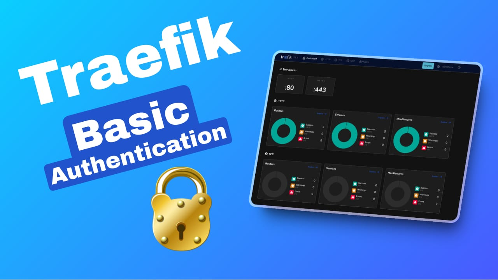

import Notice from "@components/widgets/Notice.astro";
import ListCheck from "@components/widgets/ListCheck.astro";
import Accordion from "@components/widgets/Accordion.astro";
import Tabs from "@components/widgets/Tabs.astro";
import Tab from "@components/widgets/Tab.astro";

If you're running self-hosted Docker services through Traefik, you probably have a few endpoints that don't have their own authentication: the Traefik dashboard, a whoami container, maybe some internal dev tools. Exposing those to the internet without any access control is a risk you don't need to take.

Traefik's Basic Authentication middleware adds a username/password prompt in front of any service with just a couple of Docker labels. It's not a replacement for proper app-level auth, but for dev tools and internal services it's a quick first layer.

This guide covers the full setup: generating secure bcrypt passwords, adding auth labels in Docker Compose, using `usersFile` for multi-service setups, customizing the login prompt, chaining middlewares for defense in depth, and protecting the Traefik dashboard itself. Everything targets Traefik v3.x (the current stable line).

If you're looking for more Docker containers to protect, check the [best self-hosted Docker containers for home server](/docker-containers-home-server/).



## Understanding Traefik basic authentication middleware

Traefik middleware sits between the client and your backend service. When a request arrives, Traefik routes it through the middleware chain before forwarding it to the backend. Basic Authentication is one of many middleware types. It intercepts the request, checks for valid credentials, and either passes the request through or returns a `401 Unauthorized` response.

The flow looks like this:

1. **Client sends request** to `https://myapp.example.com`
2. **Traefik checks middleware:** finds Basic Auth middleware on this route
3. **No credentials?** Traefik returns `401 Unauthorized` with a `WWW-Authenticate` header
4. **Browser shows login prompt:** the user enters username and password
5. **Client resends request** with `Authorization: Basic <base64-encoded>` header
6. **Traefik verifies the hash** against the configured `htpasswd` entries
7. **Valid credentials?** Traefik forwards the request to the backend
8. **Invalid credentials?** Traefik returns `401` again

Basic Auth credentials are Base64-encoded, not encrypted. That means anyone intercepting the traffic (without HTTPS) can decode them trivially. Always use Basic Auth over HTTPS. You should already have TLS configured if your services are behind Traefik.

<Notice type="info" title="When NOT to use basic auth">
If your app has its own authentication (Grafana, Portainer, Nextcloud), prefer the app's native auth instead of double-wrapping with Traefik Basic Auth. Basic Auth is best for dev tools without built-in auth: the Traefik dashboard, whoami containers, simple internal utilities. There's no logout mechanism. The browser caches credentials until you close the tab.
</Notice>

## How to set up Traefik basic auth in Docker Compose

This assumes Traefik is already running in Docker with the Docker provider enabled. If you haven't set that up yet, see the [Traefik reverse proxy in Docker](/traefik-proxy-docker/) guide first.

### Prerequisites

<ListCheck>
<ul>
<li>Traefik v3.x running in Docker with the Docker provider enabled</li>
<li>Docker Compose v2 installed</li>
<li>A service already exposed via Traefik with a working HTTPS route</li>
<li>A domain name with DNS pointing to your VPS</li>
<li>Let's Encrypt or Cloudflare certificates configured. See [Traefik wildcard certificates](/traefik-wildcard-certificate/)</li>
<li>HTTP to HTTPS redirect configured. See [Traefik HTTP to HTTPS redirect](/traefik-redirect-http-https/)</li>
<li><code>apache2-utils</code> (Debian/Ubuntu) or <code>httpd-tools</code> (RHEL/Fedora) installed for <code>htpasswd</code></li>
</ul>
</ListCheck>

### Step 1: Generate bcrypt passwords with htpasswd

<Notice type="warning" title="Use bcrypt, not MD5">
The older approach used `htpasswd -nb` which generates APR1/MD5 hashes. These are cryptographically weak. Always use `htpasswd -nB` for bcrypt (`$2y$` prefix). The official Traefik docs now recommend bcrypt.
</Notice>

Install the `htpasswd` utility:

```sh
# Debian/Ubuntu
sudo apt update && sudo apt install apache2-utils

# RHEL/Fedora
# sudo dnf install httpd-tools
```

Generate a bcrypt hash:

<Tabs>
<Tab name="Interactive (recommended)">
```sh
# The interactive prompt keeps the password out of your shell history
echo $(htpasswd -nB admin) | sed -e 's/\$/\$\$/g'
```

You'll be prompted to type the password. Output looks like:

```
admin:$$2y$$05$$...
```
</Tab>
<Tab name="Quick one-liner">
```sh
# Fine for testing. Avoid in production, password ends up in shell history.
echo $(htpasswd -nBC 12 admin MySecurePass) | sed -e 's/\$/\$\$/g'
```
</Tab>
</Tabs>

What's happening here:

- **`-nB`:** `-n` outputs to stdout instead of a file, `-B` uses bcrypt
- **`-C 12`:** optional cost factor (2^12 rounds). Default is usually 5. Higher means slower but more resistant to brute force. 12 is a reasonable default for production.
- **`sed -e 's/\$/\$\$/g'`:** doubles every `$` because Docker Compose interprets `$VAR` as environment variable substitution. Without this, the hash gets mangled at startup.

<Notice type="info" title="When you don't need the $$ escaping">
The `$$` doubling is only needed inside `docker-compose.yml` labels. If you use a `usersFile` (plain text file, covered in Step 4), you write the hash with single `$` because the file isn't YAML-evaluated. Tools like Ansible's `docker_container` module also don't need the doubling. See [environment variables in Docker Compose](/docker-env-vars/) for more on this.
</Notice>

### Step 2: Add basic auth labels to your Docker service

You need two labels per service: one to reference the middleware, and one to define it.

```yaml
services:
  nginx:
    image: nginx:latest
    restart: unless-stopped
    env_file: .env
    networks:
      - traefik-net
    labels:
      - traefik.enable=true
      - traefik.http.routers.nginx.rule=Host(`nginx.example.com`)
      - traefik.http.routers.nginx.entrypoints=https
      - traefik.http.services.nginx.loadbalancer.server.port=80
      # Basic auth middleware
      - traefik.http.routers.nginx.middlewares=nginx-auth
      - traefik.http.middlewares.nginx-auth.basicauth.users=${TRAEFIK_USER_PASS}
      - traefik.http.middlewares.nginx-auth.basicauth.realm=Restricted Area
      - traefik.http.middlewares.nginx-auth.basicauth.removeheader=true
networks:
  traefik-net:
    external: true
```

Key points:

- **Middleware name must match** between the router reference (`nginx-auth`) and the middleware definition (`nginx-auth`). This is the #1 source of "auth doesn't work" bugs. A typo here means Traefik silently ignores the middleware.
- **Use unique middleware names per service.** If two services use the same middleware name with different user lists, one will silently override the other.
- **Quote the label values.** Without quotes, YAML can choke on special characters.

**Verify it works:**

```sh
# Should return 401 Unauthorized
curl -I https://nginx.example.com

# Should return 200 with correct credentials
curl -I -u admin:yourpassword https://nginx.example.com
```

### Step 3: Store credentials in an .env file

Hardcoding the hashed password directly in `docker-compose.yml` works, but it puts credentials into version control and makes rotation painful. Move them to a `.env` file instead.

<Notice type="info" title="Why .env over hardcoded?">
Keeps credentials out of version control, makes rotation easier, and separates config from secrets. For production environments, consider [Docker Compose secrets](/docker-compose-secrets/) or a vault for even tighter control.
</Notice>

```sh
# .env (in the same directory as docker-compose.yml)
TRAEFIK_USER_PASS=admin:$$2y$$05$$KJ3RixvQ.Zabc123...rest_of_hash
```

Note the `$$` doubling. This file is still evaluated by Docker Compose as environment variable substitution. Your `docker-compose.yml` references it with `${TRAEFIK_USER_PASS}` as shown in Step 2.

### Step 4: Using usersFile for multiple services

When you have several services sharing the same credentials, inline `users` labels get repetitive. The `usersFile` approach lets you maintain one plain-text file that Traefik reads at startup.

Create the users file:

```sh
# ./traefik-data/users.txt
# Each line is username:hash, standard htpasswd format
# NO $$ doubling needed here, this is a plain text file, not YAML
admin:$2y$05$KJ3RixvQ.Zabc123...
viewer:$2y$05$AnotherHash...
```

Mount it into the **Traefik** container (not the service container):

```yaml
# In Traefik's docker-compose.yml
services:
  traefik:
    image: traefik:v3.3
    volumes:
      - ./traefik-data/users.txt:/etc/traefik/users.txt:ro
      # ... other volumes
```

Reference it in service labels:

```yaml
# In any service's docker-compose.yml
labels:
  - traefik.http.routers.myapp.middlewares=myapp-auth
  - traefik.http.middlewares.myapp-auth.basicauth.usersfile=/etc/traefik/users.txt
  - traefik.http.middlewares.myapp-auth.basicauth.realm=My App
```

<Notice type="warning" title="Mount into the Traefik container">
The #1 community gotcha: `usersFile` must be readable by the **Traefik** container, not your service container. Traefik reads the file at startup. If you mount it into the wrong container, you'll get a silent config error and auth won't be applied.

Verify the file is mounted correctly:

```sh
docker exec traefik cat /etc/traefik/users.txt
```
</Notice>

**Precedence note:** If you set both `users` and `usersFile` on the same middleware, the values in `users` take precedence over `usersFile` in current Traefik v3.x. In v3.1 through v3.3, `usersFile` had priority — the flip happened in a later v3.x release, so the behavior depends on your version.

### Step 5: Customizing the login prompt with `realm`

By default, the browser's basic auth dialog shows "traefik" as the realm name. You can customize it with the `realm` option:

```yaml
labels:
  - "traefik.http.middlewares.my-auth.basicauth.realm=My App - Restricted Access"
```

This is a small UX improvement, but it makes the prompt look intentional rather than default. Users see "My App - Restricted Access" instead of "traefik" in the login dialog.

### Step 6: Remove the Authorization header for security

By default, Traefik forwards the `Authorization` header (containing the Base64-encoded credentials) to your backend service. If your backend doesn't need it, strip it:

```yaml
labels:
  - "traefik.http.middlewares.my-auth.basicauth.removeheader=true"
```

Why this matters: if your backend service logs request headers (and most do), you don't want credentials sitting in those logs. Defense in depth — strip what you don't need.

### Step 7: Pass the authenticated username to backends

If your backend needs to know who authenticated, use `headerField` to set a custom header with the username:

```yaml
labels:
  - "traefik.http.middlewares.my-auth.basicauth.headerField=X-WebAuth-User"
```

This sets `X-WebAuth-User: <username>` on proxied requests. Useful for logging, per-user behavior, or simple access control in apps that don't have their own auth.

## Chaining Traefik middlewares for defense in depth

Basic auth alone is a single layer. For services exposed to the internet, chain it with rate limiting and IP allowlisting.

<Notice type="info" title="Middleware chaining syntax">
Use comma-separated middleware references: `my-auth@docker,rate-limit@docker`. Order matters. Traefik applies them left to right. Put the fastest-failing middleware first (rate limit, IP allowlist) before the more expensive ones (auth).
</Notice>

### Basic auth + rate limiting

```yaml
labels:
  - traefik.enable=true
  - traefik.http.routers.myapp.rule=Host(`myapp.example.com`)
  - traefik.http.routers.myapp.entrypoints=https
  - traefik.http.routers.myapp.middlewares=rate-limit@docker,my-auth@docker
  # Rate limiting
  - traefik.http.middlewares.rate-limit.ratelimit.average=100
  - traefik.http.middlewares.rate-limit.ratelimit.burst=50
  # Basic auth
  - traefik.http.middlewares.my-auth.basicauth.users=${TRAEFIK_USER_PASS}
  - traefik.http.middlewares.my-auth.basicauth.removeheader=true
  - traefik.http.middlewares.my-auth.basicauth.realm=My App
```

This limits the service to 100 requests/second average with bursts up to 50, and requires authentication.

### Basic auth + IP allowlist

```yaml
labels:
  - traefik.http.routers.myapp.middlewares=local-only@docker,my-auth@docker
  # Allow only private networks
  - traefik.http.middlewares.local-only.ipallowlist.sourcerange=10.0.0.0/8,192.168.0.0/16
  # Basic auth
  - traefik.http.middlewares.my-auth.basicauth.users=${TRAEFIK_USER_PASS}
```

Note: `ipWhiteList` was renamed to `ipAllowList` in Traefik v3. If you're migrating from v2, update your label names.

For broader server security including CrowdSec integration, see [how to secure a VPS with CrowdSec](/crowdsec-secure-server/).

### Protecting specific paths only

Use case: protect `/admin` but leave `/public` open. Define two routers on the same host:

```yaml
labels:
  # Public router — no auth
  - traefik.http.routers.myapp.rule=Host(`myapp.example.com`)
  - traefik.http.routers.myapp.entrypoints=https
  # Admin router — with auth, higher priority
  - traefik.http.routers.myapp-admin.rule=Host(`myapp.example.com`) && PathPrefix(`/admin`)
  - traefik.http.routers.myapp-admin.entrypoints=https
  - traefik.http.routers.myapp-admin.priority=10
  - traefik.http.routers.myapp-admin.middlewares=admin-auth
  - traefik.http.middlewares.admin-auth.basicauth.users=${TRAEFIK_USER_PASS}
```

The more specific router (`/admin`) needs a higher priority value to match first. Traefik's default priority is calculated from rule length, but explicit values are more reliable.

## Protecting the Traefik dashboard with basic auth

One of the most common use cases — securing the Traefik dashboard itself. Add these labels to the **Traefik** container:

```yaml
services:
  traefik:
    image: traefik:v3.3
    command:
      - --api.dashboard=true
      - --providers.docker=true
      # ... other args
    labels:
      - traefik.enable=true
      - traefik.http.routers.dashboard.rule=Host(`traefik.example.com`)
      - traefik.http.routers.dashboard.service=api@internal
      - traefik.http.routers.dashboard.entrypoints=https
      - traefik.http.routers.dashboard.middlewares=dashboard-auth
      - traefik.http.middlewares.dashboard-auth.basicauth.users=${TRAEFIK_DASHBOARD_USERS}
      - traefik.http.middlewares.dashboard-auth.basicauth.realm=Traefik Dashboard
      - traefik.http.middlewares.dashboard-auth.basicauth.removeheader=true
    networks:
      - traefik-net
```

Use a separate env variable for the dashboard credentials (`TRAEFIK_DASHBOARD_USERS`) — don't share the same password across all your services.

**Verify:** Navigate to `https://traefik.example.com` in your browser. You should see a login prompt. After entering credentials, the Traefik dashboard should load.

## Common issues and troubleshooting

<Accordion label="401 Unauthorized — credentials not working" group="faq" expanded="false">
**Symptom:** Login prompt appears but credentials are always rejected.

**Common causes:**
- Hash generated with `htpasswd -nb` (MD5) instead of `htpasswd -nB` (bcrypt). Regenerate with bcrypt.
- Password mismatch — the hash in `.env` doesn't match what you're typing.
- `$$` not doubled in `.env` file — Docker Compose stripped the `$` characters from the hash.
- Wrong hash format — Traefik expects `username:hash`, not just the hash.

**Fix:** Regenerate and verify:

```sh
# Generate a fresh bcrypt hash
echo $(htpasswd -nBC 12 admin) | sed -e 's/\$/\$\$/g'

# Test with curl (should return 200)
curl -I -u admin:yourpassword https://myapp.example.com
```
</Accordion>

<Accordion label="404 Not Found — auth prompt doesn't appear" group="faq" expanded="false">
**Symptom:** No login prompt, just a 404.

**Common causes:**
- Middleware name mismatch between the router reference and middleware definition. This is the most common error.

```yaml
# WRONG — names don't match:
- "traefik.http.routers.myapp.middlewares=traefik-auth"
- "traefik.http.middlewares.traefiknas-auth.basicauth.users=..."

# RIGHT — names match exactly:
- "traefik.http.routers.myapp.middlewares=myapp-auth"
- "traefik.http.middlewares.myapp-auth.basicauth.users=..."
```

- Labels on the wrong container — the labels must be on the service container, not the Traefik container (unless you're configuring dashboard auth).
- The router isn't matching the request — check `Host()` rule and `entrypoints`.
</Accordion>

<Accordion label="usersFile not loading" group="faq" expanded="false">
**Symptom:** Auth doesn't work when using `usersFile`, but works with inline `users`.

**Cause:** The file is mounted into the service container instead of the Traefik container. Traefik reads the file, not your backend.

**Fix:** Verify the file is readable inside Traefik:

```sh
docker exec traefik cat /etc/traefik/users.txt
```

If the file isn't there, mount it in Traefik's `docker-compose.yml`:

```yaml
volumes:
  - ./traefik-data/users.txt:/etc/traefik/users.txt:ro
```
</Accordion>

<Accordion label="Configuration errors — middleware not applied" group="faq" expanded="false">
**Symptom:** Auth works on one service but not another, or middleware seems ignored.

**Common causes:**
- Duplicate middleware names across services — if two services define a middleware called `auth`, one silently overrides the other. Use unique names: `nginx-auth`, `grafana-auth`, etc.
- Labels on the wrong container — labels must be on the service that needs auth, not on a shared proxy container.
- Typos in label keys — `basicauth` not `basicAuth`, `usersfile` not `usersFile` (case-insensitive in labels but be consistent).

**Verify:** Check Traefik's discovered configuration:

```sh
docker logs traefik 2>&1 | grep -i "middleware"
```

Or check the dashboard (once you can access it) under the Middleware tab.
</Accordion>

<Accordion label="bcrypt hash incompatible — auth always fails" group="faq" expanded="false">
**Symptom:** Hash looks correct but auth always rejects.

**Cause:** The `httpd:alpine` Docker image can produce incompatible bcrypt hashes in some versions.

**Fix:** Generate the hash using `apache2-utils` on the host or a full Alpine container:

```sh
# On the host (Debian/Ubuntu)
sudo apt install apache2-utils
echo $(htpasswd -nBC 12 admin) | sed -e 's/\$/\$\$/g'

# Or via Docker
docker run --rm -it alpine:latest sh -c "apk add --no-cache apache2-utils && htpasswd -nBC 12 admin"
```
</Accordion>

### Quick verification checklist

After setting up auth, run these commands to confirm everything works:

```sh
# Should return 401 Unauthorized (no credentials)
curl -I https://myapp.example.com

# Should return 200 OK (with correct credentials)
curl -I -u admin:yourpassword https://myapp.example.com

# Check Traefik logs for auth-related entries
docker logs traefik 2>&1 | grep -i "authentication"
```

## Limitations of basic authentication

<Notice type="warning" title="Basic auth is a first layer, not a complete solution">
Basic Auth has real limitations. Know them before relying on it for anything sensitive:

- **No logout mechanism** — the browser caches credentials until you close the tab
- **No MFA support** — single-factor password only
- **No session management** — credentials are sent on every request
- **No granular permissions** — it's all-or-nothing access
- **Credentials are Base64-encoded, not encrypted** — without HTTPS, they're trivially readable

For anything truly sensitive (production dashboards, user-facing apps), use a proper auth proxy like Authelia or Authentik, or the app's native authentication. Basic Auth is a good first layer for dev tools, internal utilities, and services without their own auth.
</Notice>

## Conclusion

Traefik's Basic Authentication middleware is a quick way to add access control to Docker services that don't have their own auth. With bcrypt password hashing, the `usersFile` approach for shared credentials, and middleware chaining with rate limiting or IP allowlisting, you get a solid first layer of protection.

Here's what we covered:

- Generating secure bcrypt passwords with `htpasswd -nB`
- Adding auth labels to Docker Compose services
- Using `.env` files and `usersFile` for credential management
- Customizing the login prompt with `realm`
- Stripping the `Authorization` header with `removeHeader`
- Passing the authenticated username to backends with `headerField`
- Chaining middlewares for defense in depth
- Protecting the Traefik dashboard

If you're still setting up Traefik, start with the [Traefik reverse proxy in Docker](/traefik-proxy-docker/) guide and [configure wildcard certificates](/traefik-wildcard-certificate/). For more services to protect behind auth, see the [best Docker containers for home server](/docker-containers-home-server/). If you want a managed deployment platform, check out [self-hosting with Dokploy](/dokploy-install/).

Need a reliable VPS to run all this on? [Hetzner](https://go.bitdoze.com/hetzner) offers affordable VPS hosting with solid performance for self-hosted Docker stacks.
