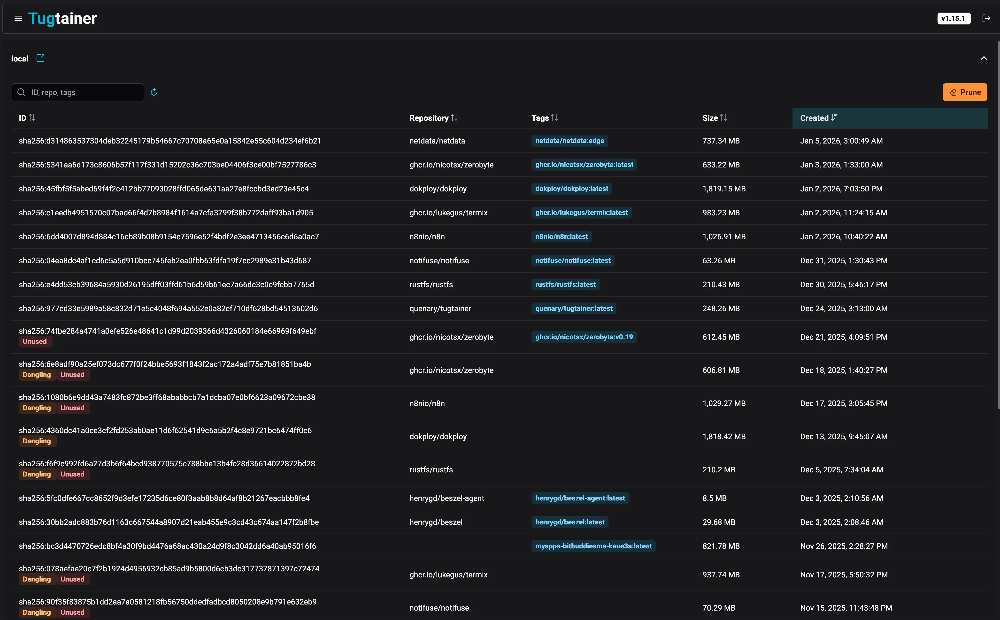
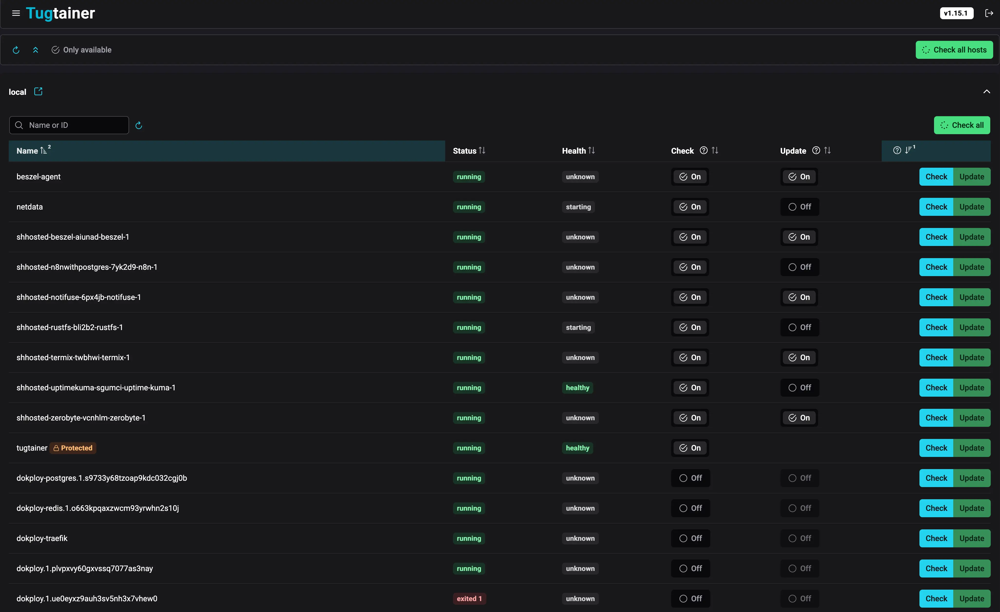
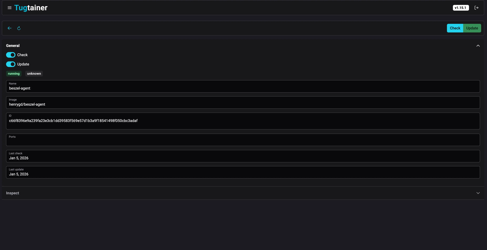

Keeping Docker containers updated manually can be a tedious task, especially when managing multiple hosts. **Tugtainer** offers a robust, self-hosted solution to automate this process, giving you control over which containers to update and when - essential for **devops** workflows. If you're new to Docker, check out our guide on [essential Docker commands](https://www.bitdoze.com/docker-commands/) to get familiar with the basics.

## What is Tugtainer?

Tugtainer is a self-hosted application designed to automate the checking and updating of Docker containers. Unlike some alternatives, it provides a dedicated Web UI to manage your update strategies, view container status, and configure notifications. It supports multiple hosts via agents, making it a centralized hub for your container lifecycle management.

<Notice type="warning" title="Production Use">
The application is distributed "as is" and the developers do not recommend it for critical production environments without testing. Always ensure you have backups of important data before enabling auto-updates.
</Notice>

## Tugtainer vs Alternatives

There are several Docker auto-update solutions available. Here's how Tugtainer compares to popular alternatives:

| Feature | Tugtainer | Watchtower | Ouroboros |
|---------|-----------|------------|-----------|
| **Web UI** | ✓ (with authentication) | ✗ | ✗ |
| **Multi-Host Support** | ✓ (via agents) | ✗ | ✗ |
| **Notifications** | ✓ (Apprise - 80+ services) | ✓ | ✓ |
| **Auto-Update Groups** | ✓ (dependency-aware) | ✗ | ✗ |
| **Configuration** | GUI | Environment variables | Environment variables |
| **Private Registries** | ✓ | ✓ | ✓ |
| **Granular Control** | ✓ (per-container) | ✓ (per-container) | ✓ (per-container) |
| **Dependency Handling** | ✓ (automatic) | ✗ | ✗ |
| **Self-Update** | Manual only | ✓ | ✓ |
| **Pruning** | ✓ (auto/manual) | ✓ | ✓ |

<Notice type="info" title="Key Terms">
- **Dependency-Aware**: Automatically detects container dependencies (like databases) and updates them in the correct order - stops dependent services first, then updates dependencies
- **Socket-Proxy**: A security container that mediates access to the Docker socket; Tugtainer cannot update itself or the proxy from within
</Notice>

**Key Differences:**
- **Tugtainer** excels with its Web UI and multi-host management, making it ideal for teams and complex setups
- **Watchtower** is lightweight and mature, perfect for simple single-host setups
- **Ouroboros** is minimal and easy to configure via environment variables

Choose Tugtainer if you need a visual interface, manage multiple servers, or require sophisticated dependency management. For simpler setups, Watchtower or Ouroboros might be sufficient.

## Main Features

Tugtainer comes packed with features to make container management easier:

<ListCheck>
- **Web UI**: A clean interface with authentication to manage all your containers.
- **Multi-Host Support**: Manage containers across different servers using the Tugtainer Agent, ideal for **devops** teams managing multiple servers.
- **Granular Control**: Configure each container for "check only" or "auto-update".
- **Notifications**: Integrate with a wide range of services via Apprise.
- **Private Registries**: Support for pulling images from private Docker registries.
- **Dependency Handling**: Updates linked containers in the correct order (stopping dependents first).
- **Pruning**: Automatic or manual cleanup of old images.
</ListCheck>

## How to Deploy Tugtainer

Deploying Tugtainer is straightforward. You can use Dokploy for an easy, managed deployment, or standard Docker Compose.

### Option 1: Deploy with Dokploy

If you are using Dokploy to manage your server, deploying Tugtainer is simple. Dokploy handles the SSL generation and reverse proxy configuration automatically. If you haven't installed Dokploy yet, follow our [complete Dokploy installation guide](https://www.bitdoze.com/dokploy-install/) to get started.

1.  **Create a Service**: In your Dokploy project, click "Add Service" and select "Compose".
2.  **Name It**: Give it a name like `tugtainer`.
3.  **Add Configuration**: Paste the following configuration into the Compose editor:

```yaml
services:
  tugtainer:
    image: quenary/tugtainer:latest
    container_name: tugtainer
    restart: unless-stopped
    environment:
      - PORT=80
    volumes:
      - tugtainer_data:/tugtainer
      - /var/run/docker.sock:/var/run/docker.sock:ro

volumes:
  tugtainer_data:
```

4.  **Configure Domain**: In the "Domains" tab, add your domain (e.g., `updates.yourdomain.com`) and map it to port **80**.
5.  **Deploy**: Click "Deploy". Dokploy will start the container and issue an SSL certificate.

<Notice type="info" title="Dokploy Integration">
Using Dokploy allows you to keep Tugtainer behind a secure HTTPS connection easily, which is recommended for accessing the Web UI.
</Notice>

### Option 2: Deploy with Docker Compose

To get the main instance running manually, you can use the following `docker-compose.yml` configuration. This sets up the Tugtainer server and gives it access to the Docker socket to manage containers.

```yaml
services:
  tugtainer:
    image: quenary/tugtainer:latest
    container_name: tugtainer
    restart: unless-stopped
    ports:
      - 9412:80
    volumes:
      - tugtainer_data:/tugtainer
      - /var/run/docker.sock:/var/run/docker.sock:ro

volumes:
  tugtainer_data:
```

<Notice type="info" title="Self-Update Limitation">
Tugtainer cannot update itself or the socket-proxy from within the app. You should exclude these from auto-updates to prevent errors. Update them manually or via another tool like Portainer.
</Notice>

### Managing Remote Hosts

If you have containers on other servers, you don't need a full Tugtainer instance on each. Instead, deploy the **Tugtainer Agent**:

```yaml
services:
  tugtainer-agent:
    image: quenary/tugtainer-agent:latest
    container_name: tugtainer-agent
    restart: unless-stopped
    ports:
      - 9413:8001
    environment:
      - AGENT_SECRET=CHANGE_ME!
    volumes:
      - /var/run/docker.sock:/var/run/docker.sock:ro
```

You can also deploy the agent via **Dokploy** by using the same compose file (removing the `ports` section if you want to expose it via a domain, though usually agents communicate internally or via exposed ports if properly secured).

After deploying the agent, go to the Tugtainer Web UI, navigate to **Menu -> Hosts**, and add the new host using its IP and the `AGENT_SECRET` you defined.

## Tugtainer Web UI

Once you've deployed Tugtainer and accessed the web interface, you'll see a clean, intuitive dashboard that makes container management simple. Here's what to expect:



The main dashboard provides an at-a-glance view of all your containers, their current versions, and update status. You can quickly see which containers need updates, which are set to auto-update, and which are protected.



From the containers view, you can:
- View detailed information about each container
- Toggle between "check only" and "auto-update" modes
- See update history and logs
- Manually trigger updates for specific containers or groups
- Configure custom labels and dependencies



The individual container view lets you configure specific settings including:
- Update schedule configuration
- Notification preferences
- Dependency management
- Custom labels for advanced control

The interface is designed to be intuitive while providing powerful configuration options for advanced users.

### Initial Login

On your first visit to the Tugtainer Web UI after deployment, you'll be prompted to set up an administrator account.

1.  **Create Password**: You'll be asked to set a secure password for your account during the initial setup.
2.  **Login**: Use the password you just created to access the dashboard.
3.  **Change Password**: You can change your password later in the settings if needed.

Note: Unlike some Docker tools, Tugtainer doesn't generate a random password that you need to extract from logs - you set it yourself during the initial setup wizard.

## Check and Update Process

Tugtainer organizes containers into **Groups** for safe updating. A group consists of containers that are linked, such as those in the same Docker Compose project or manually linked via labels.

When an update is triggered (either by schedule or manually):
1.  **Image Pull**: Tugtainer checks for and pulls new images.
2.  **Stop Order**: If an update is available and enabled, containers in the group are stopped starting from the most dependent ones.
3.  **Update & Start**: Containers are recreated with the new image and started in reverse order (dependencies first).

### Custom Labels

You can control Tugtainer's behavior using Docker labels on your containers:

-   `dev.quenary.tugtainer.protected=true`: Protects a container from being stopped or updated by Tugtainer. Useful for the agent itself.
-   `dev.quenary.tugtainer.depends_on="db,redis"`: Manually declare dependencies for containers not in the same compose file.

## Monitoring Your Containers

When running auto-update systems, it's important to monitor your server resources. You can use tools like [server monitoring dashboards](https://www.bitdoze.com/sever-monitoring/) to track CPU, memory, and disk usage, ensuring that auto-updates don't cause resource issues.

## Notifications

Tugtainer uses **Apprise** for notifications, allowing you to send alerts to Discord, Telegram, Slack, Email, and many others. You can customize the notification messages using Jinja2 templates.

Notifications report on:
-   **Available**: New image found.
-   **Updated**: Container successfully updated.
-   **Rolled Back**: Update failed, reverted to old image.
-   **Failed**: Update failed.

## Frequently Asked Questions

<Accordion label="How does Tugtainer handle container dependencies?" group="faq" expanded="false">
Tugtainer automatically detects dependencies between containers in the same Docker Compose project. During updates, it stops containers starting from the most dependent ones (leaves first) and starts them in reverse order (roots first). This ensures that databases and other dependencies are running before dependent services are restarted. For containers not in the same compose file, you can manually declare dependencies using the `dev.quenary.tugtainer.depends_on` label.
</Accordion>

<Accordion label="Can I exclude specific containers from auto-updates?" group="faq" expanded="false">
Yes! You can exclude containers in several ways:
- Use the `dev.quenary.tugtainer.protected=true` label to prevent Tugtainer from stopping or updating a container
- Configure individual containers in the Web UI for "check only" mode instead of "auto-update"
- Manually manage certain containers while letting Tugtainer handle the rest
</Accordion>

<Accordion label="What happens if an update fails?" group="faq" expanded="false">
Tugtainer includes rollback capabilities. If an update fails or causes issues:
- The container is rolled back to the previous working image
- You'll receive a notification about the rollback via your configured Apprise services
- The old image remains available so you can manually restore if needed
- This safety mechanism helps prevent downtime from failed updates
</Accordion>

<Accordion label="Is Tugtainer safe for production environments?" group="faq" expanded="false">
While Tugtainer is a powerful tool, the developers explicitly recommend against using it in critical production environments without thorough testing. Always:
- Test updates in a staging environment first
- Maintain regular backups of your data
- Monitor your applications after auto-updates
- Consider using "check only" mode for critical services initially
- Have a rollback plan in place before enabling auto-updates
</Accordion>

<Accordion label="How do I manage Docker disk space with Tugtainer?" group="faq" expanded="false">
Tugtainer includes automatic or manual pruning of old images. However, if you need to do a complete cleanup, you can follow our guide on [how to clean all Docker images, containers, and volumes](https://www.bitdoze.com/cleanup-all-docker-things/). This is useful when switching from another auto-update solution or starting fresh.
</Accordion>

<Accordion label="Can Tugtainer update itself?" group="faq" expanded="false">
No, Tugtainer cannot update itself or the socket-proxy from within the app. You should exclude Tugtainer from auto-updates to prevent errors. Update it manually via Docker Compose or use another management tool like Portainer. The same applies to the Tugtainer Agent - protect it with the `dev.quenary.tugtainer.protected=true` label.
</Accordion>

<Accordion label="How does Tugtainer compare to manual Docker Compose updates?" group="faq" expanded="false">
While you can update containers manually using `docker compose pull` and `docker compose up -d` (as shown in our [Docker Compose update guide](https://www.bitdoze.com/updating-container-docker-compose/)), Tugtainer automates this process:
- Checks for updates automatically on a schedule
- Handles dependencies intelligently
- Sends notifications about available updates
- Provides a centralized Web UI for managing multiple containers
- Supports multiple hosts from a single interface
</Accordion>

## Authentication and Security

By default, Tugtainer uses password authentication stored in an encrypted file. For advanced users, starting with v1.6.0, you can configure an **OpenID Connect (OIDC)** provider to handle login, integrating with your existing identity management infrastructure.

### Setting Up OIDC Authentication

To enable OIDC authentication, you'll need:

1. **OIDC Provider**: Configure your provider (Auth0, Keycloak, Azure AD, Google, etc.) with:
   - Client ID
   - Client Secret
   - Issuer URL
   - Redirect URL (your Tugtainer domain + `/auth/callback`)

2. **Environment Variables**: Add these to your Tugtainer container:

```yaml
environment:
  - OIDC_ENABLED=true
  - OIDC_CLIENT_ID=your_client_id
  - OIDC_CLIENT_SECRET=your_client_secret
  - OIDC_ISSUER=https://your-provider.com
  - OIDC_REDIRECT_URI=https://tugtainer.yourdomain.com/auth/callback
  - OIDC_SCOPES=openid email profile
```

3. **Restart Container**: Apply the changes by recreating the container.

Once configured, users can log in using their OIDC credentials instead of the default password system.

## Related Articles

- [Best Self-Hosted Panels: A Comparison](https://www.bitdoze.com/best-self-hosted-panels/) - Compare Tugtainer with other self-hosted management solutions
- [Top 50+ Docker Commands You MUST Know](https://www.bitdoze.com/docker-commands/) - Essential Docker commands for container management
- [Dokploy Install - Self-Host Your SaaS](https://www.bitdoze.com/dokploy-install/) - Complete Dokploy installation guide
- [How To Update Containers With Docker Compose](https://www.bitdoze.com/updating-container-docker-compose/) - Manual container update guide
- [How To Clean All Docker Things](https://www.bitdoze.com/cleanup-all-docker-things/) - Complete Docker cleanup guide
- [Monitor Server Resources](https://www.bitdoze.com/sever-monitoring/) - Server and Docker resource monitoring

<Button text="View Tugtainer on GitHub" link="https://github.com/quenary/tugtainer" variant="solid" color="blue" size="md" icon="arrow-right" />
