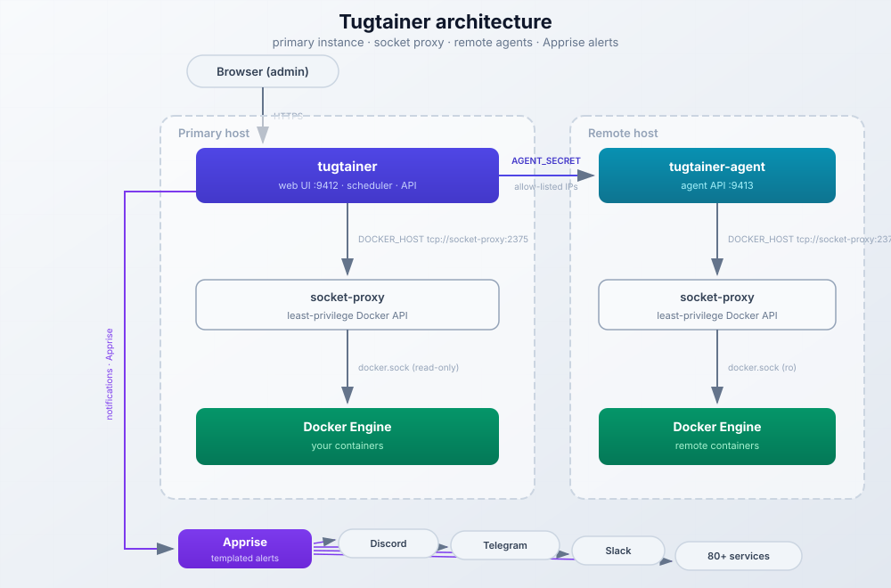
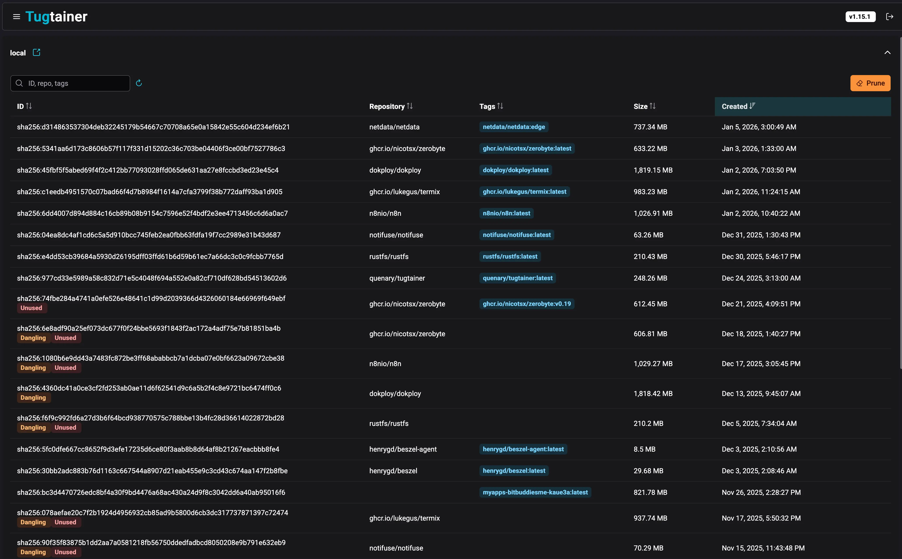
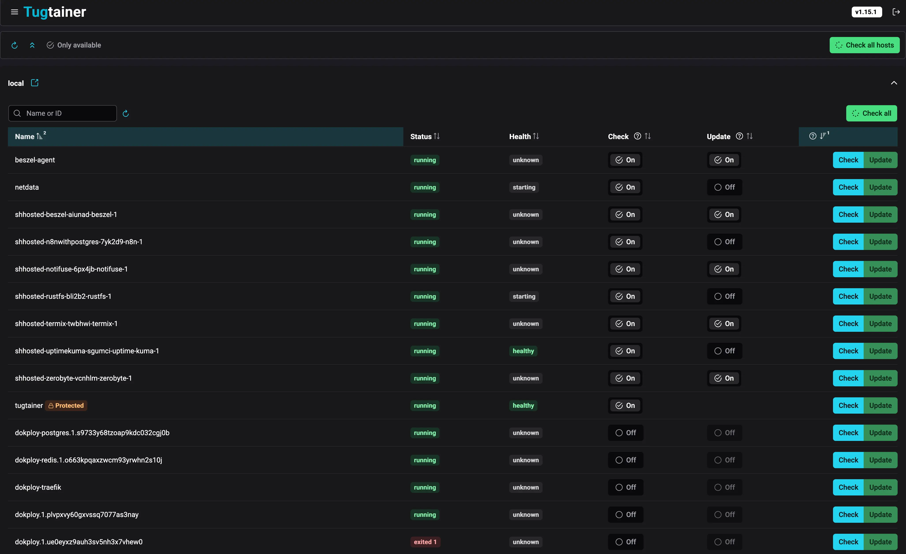
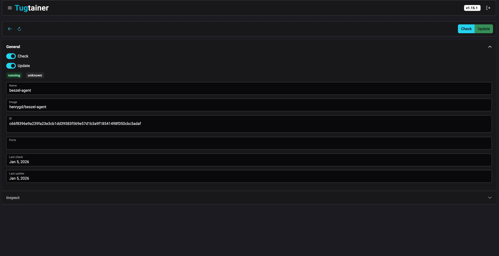
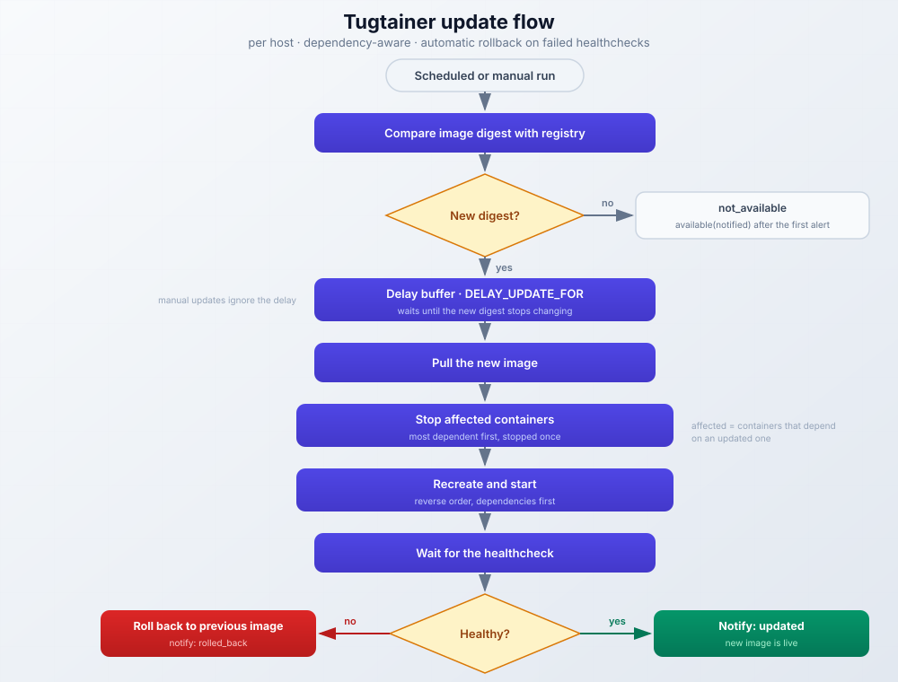

import Button from "@components/widgets/Button.astro";
import Notice from "@components/widgets/Notice.astro";
import ListCheck from "@components/widgets/ListCheck.astro";
import Accordion from "@components/widgets/Accordion.astro";
import Tabs from "@components/widgets/Tabs.astro";
import Tab from "@components/widgets/Tab.astro";

Auto-update Docker containers without babysitting `docker compose pull` on every server. Tugtainer is a self-hosted tool that checks registries for new images, recreates containers in dependency order, rolls back failed updates, and tells you what happened. It gives you a web UI, multi-host agents, and per-container control, so you decide exactly what updates and when. This guide covers deployment with Dokploy or Docker Compose, the agent setup for remote hosts, and everything added through v1.41.0 (September 2026). If you're new to Docker, start with our guide on [essential Docker commands](https://www.bitdoze.com/docker-commands/).

## What is Tugtainer?

Tugtainer is a self-hosted app that keeps your Docker containers current. It compares the image digest each container runs against the registry, flags containers with newer images, and recreates them on a schedule you control. Updates happen in dependency order, and if a new image fails its healthcheck, Tugtainer rolls the container back to the previous image automatically.

Everything runs on your infrastructure. No SaaS account, no per-host fee, and automatic updates are off by default, so you opt containers in one at a time. A web UI with authentication sits on top of the whole thing, and each extra server runs a lightweight agent so a single instance can manage all of them.

Here's how the pieces fit together:



The main instance talks to Docker through a socket-proxy instead of mounting the Docker socket directly, which limits what a compromised Tugtainer could do. On remote hosts, the agent does the same job locally and exposes a small API for the primary instance. Notifications fan out through Apprise to Discord, Telegram, Slack, email, and dozens of other services.

<Button text="Try Hetzner Cloud Now" link="https://go.bitdoze.com/hetzner" variant="solid" color="blue" size="lg" external={true} icon="rocket-launch" />
<Button text="Try Hostinger VPS" link="https://go.bitdoze.com/hostinger-vps" variant="solid" color="green" size="lg" external={true} icon="rocket-launch" />

<Notice type="warning" title="Production Use">
The application is distributed "as is" and the developers do not recommend it for critical production environments without testing. Auto-updates move your containers between image versions without a human in the loop, so backups of important data are non-negotiable before you enable them.
</Notice>

## What you need before you start

<ListCheck>
- A Linux host or VPS with Docker and the Compose plugin installed
- Port 9412 free for the Tugtainer web UI, plus 9413 for each agent host (skip both if you expose the UI through Dokploy)
- A DNS record pointing at your server if you want the UI behind HTTPS
- A strong, unique `AGENT_SECRET` if you plan to manage remote hosts
- Backups of any stateful containers (databases, uploads) taken before you enable auto-updates
- Credentials for your notification service: a Discord webhook URL, Telegram bot token, SMTP details, whatever you use
</ListCheck>

Tugtainer is free and open source. It runs comfortably on an entry-level VPS in the €4-5/month class (2 vCPU, 4 GB RAM is plenty) or alongside your existing Dokploy stack. State lives in the `tugtainer_data` volume, so there's no separate database to babysit. If you'd rather run it at home on hardware you own, a [compact ASUS mini PC home server](https://go.bitdoze.com/asus-dc510) has plenty of headroom for it.

## Tugtainer vs Watchtower and Ouroboros

Several tools can automatically update your Docker containers. Here's how Tugtainer compares to Watchtower and Ouroboros:

| Feature | Tugtainer | Watchtower | Ouroboros |
|---------|-----------|------------|-----------|
| **Web UI** | Yes (with authentication) | No | No |
| **Multi-Host Support** | Yes (via agents) | No | No |
| **Notifications** | Yes (Apprise - 80+ services) | Yes | Yes |
| **Dependency-Aware Updates** | Yes (automatic) | No | No |
| **Configuration** | GUI | Environment variables | Environment variables |
| **Private Registries** | Yes | Yes | Yes |
| **Granular Control** | Yes (per-container) | Yes (per-container) | Yes (per-container) |
| **Healthcheck Monitoring** | Yes (auto-restart, v1.41+) | No | No |
| **Socket-Proxy Support** | Yes (default setup) | No | No |
| **Self-Update** | Manual only | Yes | Yes |
| **Pruning** | Yes (auto/manual) | Yes | Yes |

Worth knowing: Watchtower's development has largely stalled, with few releases since 2023. It still works, but check the repo before you commit to it.

<Notice type="info" title="Key terms">
- **Dependency-aware**: Tugtainer builds a dependency graph per host and updates in the right order. Dependent services (like the app in front of a database) are stopped first, then everything restarts with dependencies coming up before the things that need them.
- **Socket-proxy**: A security container that exposes only whitelisted Docker API calls. Tugtainer uses it by default instead of a raw socket mount. Tugtainer can't update itself, the agent, or the socket-proxy from within.
</Notice>

My recommendation: pick Tugtainer if you want a web interface instead of configuring environment variables, if you manage containers across multiple servers, or if you need dependency handling, update delays, and rollback. Watchtower still makes sense for a simple single-host setup where you want the bare minimum. Ouroboros fits if you'd rather do minimal configuration through environment variables.

If your actual problem is broader container management (deploying stacks, not just updating them), look at [Arcane, a self-hosted Docker container manager](https://www.bitdoze.com/arcane-docker-install/). Tugtainer is narrower on purpose: it does updates well and stays out of the way.

## Main features

Everything current as of v1.41.0:

<ListCheck>
- **Web UI with authentication**: Manage every container from one dashboard
- **Multi-host support**: The Tugtainer Agent connects remote servers to one primary instance
- **Socket-proxy by default**: Least-privilege access to the Docker API instead of a raw socket mount
- **Granular control**: Set each container to "check only" or "auto-update" mode
- **Dependency-aware updates**: Builds a graph from Compose files and labels, updates in the right order
- **Automatic rollback**: Failed healthchecks after an update trigger a return to the previous image
- **Update delay buffer**: Wait N seconds after a new digest appears before applying scheduled updates
- **Healthcheck monitoring with auto-restart**: Detects unhealthy containers, restarts with backoff, and keeps history (new in v1.41.0)
- **Real-time job progress**: Watch checks and updates stream live over WebSockets (v1.39.0)
- **Notifications**: Discord, Telegram, Slack, email, and more via Apprise, with Jinja2 templates
- **Lifecycle hooks**: Optional pre/post update commands inside containers (opt-in)
- **Private registries, crontab scheduling, and image pruning** round it out
</ListCheck>

## How to deploy Tugtainer

Two paths: Dokploy if you already run it, plain Docker Compose if you don't. Either way you get the same containers.

### Option 1: Deploy with Dokploy

Dokploy handles the SSL certificate and reverse proxy for you, which is what I'd recommend for the web UI. If you don't have Dokploy yet, follow our [Dokploy installation guide](https://www.bitdoze.com/dokploy-install/), and read how to [deploy a Docker Compose app in Dokploy](https://www.bitdoze.com/dokploy-docker-compose-app/) for the deeper compose-specific details.

1.  **Create a Service**: In your Dokploy project, click "Add Service" and select "Compose"
2.  **Name It**: Give it a name like `tugtainer`
3.  **Add Configuration**: Paste this into the Compose editor (adapted from the official compose file, with the port mapping removed since Dokploy routes the domain):

```yaml
networks:
  tugtainer:
    driver: bridge
volumes:
  tugtainer_data:
services:
  socket-proxy:
    image: lscr.io/linuxserver/socket-proxy:latest
    container_name: socket-proxy
    environment:
      CONTAINERS: 1
      EVENTS: 1
      IMAGES: 1
      INFO: 1
      LOG_LEVEL: warning
      PING: 1
      NETWORKS: 1
      POST: 1
      VERSION: 1
      ALLOW_LOGS: 1
      ALLOW_START: 1
      ALLOW_STOP: 1
      ALLOW_RESTARTS: 1
      ALLOW_PAUSE: 1
      ALLOW_UNPAUSE: 1
    volumes:
      - /var/run/docker.sock:/var/run/docker.sock:ro
    restart: unless-stopped
    read_only: true
    tmpfs:
      - /run
    networks:
      - tugtainer
    labels:
      dev.quenary.tugtainer.protected: True
  tugtainer:
    depends_on:
      - socket-proxy
    container_name: tugtainer
    image: ghcr.io/quenary/tugtainer:1
    volumes:
      - tugtainer_data:/tugtainer
    restart: unless-stopped
    environment:
      DOCKER_HOST: tcp://socket-proxy:2375
      # Required once you add remote agents:
      # AGENT_SECRET: set-a-long-random-string
    networks:
      - tugtainer
    labels:
      dev.quenary.tugtainer.protected: True
```

4.  **Configure Domain**: In the "Domains" tab, add your domain (like `updates.yourdomain.com`) and map it to port **80**
5.  **Deploy**: Click "Deploy". Dokploy starts both containers and issues the certificate

**Verify it worked:**

- `docker ps` on the server shows `tugtainer` and `socket-proxy` running
- Open `https://updates.yourdomain.com/api/public/health` and expect an ok response (HTTP 200)
- `https://updates.yourdomain.com/api/public/version` shows the running version
- First visit to the UI shows the admin password setup wizard

If the health endpoint never comes up, check Dokploy's deploy logs. The usual causes are the domain tab pointing at the wrong container port (it should be 80), or the socket-proxy container crash-looping because the Docker socket path is wrong.

### Option 2: Deploy with Docker Compose

The official compose file ships two services: the socket-proxy and the app. Pick the variant that matches your risk tolerance:

<Tabs>
<Tab name="Socket proxy (recommended)">

```yaml
networks:
  tugtainer:
    driver: bridge
volumes:
  tugtainer_data:
services:
  socket-proxy:
    image: lscr.io/linuxserver/socket-proxy:latest
    container_name: socket-proxy
    environment:
      CONTAINERS: 1
      EVENTS: 1
      IMAGES: 1
      INFO: 1
      LOG_LEVEL: warning
      PING: 1
      NETWORKS: 1
      POST: 1
      VERSION: 1
      ALLOW_LOGS: 1
      ALLOW_START: 1
      ALLOW_STOP: 1
      ALLOW_RESTARTS: 1
      ALLOW_PAUSE: 1
      ALLOW_UNPAUSE: 1
    volumes:
      - /var/run/docker.sock:/var/run/docker.sock:ro
    restart: unless-stopped
    read_only: true
    tmpfs:
      - /run
    networks:
      - tugtainer
    labels:
      dev.quenary.tugtainer.protected: True
  tugtainer:
    depends_on:
      - socket-proxy
    container_name: tugtainer
    image: ghcr.io/quenary/tugtainer:1
    volumes:
      - tugtainer_data:/tugtainer
    restart: unless-stopped
    environment:
      DOCKER_HOST: tcp://socket-proxy:2375
      # Required once you add remote agents:
      # AGENT_SECRET: set-a-long-random-string
      # Allow LAN/Docker-network agents (default only allows 127.0.0.1:8001):
      # AGENT_ALLOW_NETWORKS: 192.168.0.0/24
      # AGENT_ALLOW_ENDPOINTS: 10.0.0.5:9413
    networks:
      - tugtainer
    ports:
      - '9412:80'
    labels:
      dev.quenary.tugtainer.protected: True
```

The `ALLOW_*` list is the least-privilege set Tugtainer needs. The start/stop/restarts/pause/unpause permissions became required for container controls and `NETWORKS` for updates in v1.37.0. If you run a socket-proxy config copied from an older guide, updates fail with cryptic permission errors until you add them.

</Tab>
<Tab name="Direct socket mount (simpler, less secure)">

```yaml
services:
  tugtainer:
    image: ghcr.io/quenary/tugtainer:1
    container_name: tugtainer
    restart: unless-stopped
    ports:
      - '9412:80'
    volumes:
      - tugtainer_data:/tugtainer
      - /var/run/docker.sock:/var/run/docker.sock:ro

volumes:
  tugtainer_data:
```

One container, one volume, one mount. It works, but anything that compromises the Tugtainer process gets the full Docker API. I'd only use this on a single-purpose homelab box.

</Tab>
</Tabs>

Bring the stack up and verify:

```bash
docker compose up -d
curl http://localhost:9412/api/public/health
```

Expect a 200 from the health endpoint, then log in at `http://server-ip:9412` and set the admin password. What broken looks like:

- **Port 9412 already in use**: change the host side of the mapping, e.g. `'8412:80'`, or free the port with `ss -tlnp | grep 9412`
- **Permission denied on docker.sock** (direct mount variant): your user isn't in the docker group or the socket path differs. `ls -l /var/run/docker.sock` to check
- **Update jobs fail with permission errors**: your socket-proxy is missing the newer `ALLOW_*` variables

<Notice type="warning" title="Self-Update Limitation">
Tugtainer cannot update itself, the agent, or the socket-proxy from within the app. All three carry the `dev.quenary.tugtainer.protected` label for exactly this reason. Update them manually with `docker compose pull && docker compose up -d`, through Dokploy's redeploy (see how to [update Docker Compose stacks in Dokploy](https://www.bitdoze.com/dokploy-update-docker-compose/)), or with another tool like Portainer.
</Notice>

### Managing remote hosts with the Tugtainer Agent

You don't need a full Tugtainer instance on each server. Deploy the agent, which runs the same socket-proxy pattern locally and exposes an API for the primary instance:

```yaml
networks:
  tugtainer_agent:
    driver: bridge
services:
  socket-proxy:
    image: lscr.io/linuxserver/socket-proxy:latest
    container_name: socket-proxy
    environment:
      CONTAINERS: 1
      EVENTS: 1
      IMAGES: 1
      INFO: 1
      LOG_LEVEL: warning
      PING: 1
      NETWORKS: 1
      POST: 1
      VERSION: 1
      ALLOW_LOGS: 1
      ALLOW_START: 1
      ALLOW_STOP: 1
      ALLOW_RESTARTS: 1
      ALLOW_PAUSE: 1
      ALLOW_UNPAUSE: 1
    volumes:
      - /var/run/docker.sock:/var/run/docker.sock:ro
    restart: unless-stopped
    read_only: true
    tmpfs:
      - /run
    networks:
      - tugtainer_agent
    labels:
      dev.quenary.tugtainer.protected: True
  agent:
    depends_on:
      - socket-proxy
    container_name: tugtainer-agent
    image: ghcr.io/quenary/tugtainer-agent:1
    restart: unless-stopped
    read_only: true
    tmpfs:
      - /run
    environment:
      AGENT_SECRET: set-a-long-random-string
      DOCKER_HOST: tcp://socket-proxy:2375
    networks:
      - tugtainer_agent
    ports:
      - '9413:8001'
    labels:
      dev.quenary.tugtainer.protected: True
```

Set the same `AGENT_SECRET` value on the primary instance and the agent. Generate one with `openssl rand -hex 32` and treat it like any other credential. Compose supports proper secrets too; see [Docker Compose secrets and secure alternatives](https://www.bitdoze.com/docker-compose-secrets/) for the options.

<Notice type="warning" title="Agent secrets and private networks">
Use a long, unique `AGENT_SECRET` per fleet, not the example value. Also know that the primary instance blocks agent URLs resolving to private or reserved networks by default. Only the built-in `127.0.0.1:8001` endpoint is allowed out of the box, so a LAN agent will fail to connect until you allow-list it.
</Notice>

Allow-listing happens on the **primary instance**, not the agent. Add one or both to the Tugtainer container's environment:

```yaml
environment:
  # Allow a whole subnet (LAN or Docker network)
  - AGENT_ALLOW_NETWORKS=192.168.0.0/24
  # Or pin exact agent endpoints (IP:port)
  - AGENT_ALLOW_ENDPOINTS=10.0.0.5:9413
```

### TLS options for the agent connection

Backend and agent speak plain HTTP by default:

- **Public CA (Let's Encrypt, etc.)**: put a reverse proxy in front of the agent and set the host URL to `https://...` in the UI. Traefik works well; see our [Traefik reverse proxy setup for Docker](https://www.bitdoze.com/traefik-proxy-docker/)
- **Private CA or self-signed**: paste the CA PEM into the "Custom CA" field on the host settings (supported since v1.36.0). The certificate hostname must match the URL
- **Native TLS without a proxy**: mount cert/key into the agent and extend the command with `--ssl-certfile` / `--ssl-keyfile`. Caveat: the agent's own healthcheck calls `http://localhost:8001` and may report unhealthy when uvicorn serves HTTPS only

After deploying the agent, go to **Menu → Hosts** in the web UI, add the host with its IP (or domain) and the `AGENT_SECRET`. **Verify**: the host shows online in the hosts list, then run a manual "Check all" against it and watch the live job journal stream the results.

## Tugtainer web UI

Once deployed, the dashboard shows all containers and their update status.



The dashboard shows all your containers, their current versions, and whether updates are available. You can quickly see which containers are set to auto-update and which are protected. (Screenshots are from early 2026; later versions look slightly different.)



From this view, you can:
- View detailed information about each container
- Toggle between "check only" and "auto-update" modes
- Filter the table by status (added in v1.33.0)
- Select several containers and check or update them as a batch
- See the running version pulled from image labels (v1.38.0) and a source-code link on the card (v1.36.0)



The individual container view lets you configure:
- Update schedule and per-container update delay
- Notification preferences
- Dependency management
- Custom labels and a healthcheck timeout override (v1.40.0)

Since v1.39.0 there's also a jobs progress dialog: when you run a check or update, it streams a live journal over WebSockets, so you can watch each container's pull, stop, recreate, and start steps as they happen instead of staring at a spinner.

### Initial login

When you first visit the Tugtainer web UI, you'll set up an administrator account.

1.  **Create Password**: Set a secure password during the initial setup
2.  **Login**: Use the password you created to access the dashboard
3.  **Change Password**: You can change your password later in the settings

Tugtainer doesn't generate a random password like some Docker tools. You set it yourself during the setup wizard, so pick something long.

## Check and update process

Tugtainer processes each host as a single set. It builds a dependency graph from Compose metadata (`depends_on` between containers of the same compose project) and from the custom `depends_on` label for cross-project links. Protected containers and stopped containers are skipped.

When an update runs (by schedule or manually):

1.  **Digest check**: Tugtainer compares each container's image digest against the registry and marks containers with a newer image as "available"
2.  **Pull**: New images are pulled for the updatable set
3.  **Stop order**: All involved containers stop once, starting from the most dependent ones
4.  **Recreate and start**: Updatable containers are recreated with the new image, and everything starts in reverse order, dependencies first
5.  **Healthcheck wait**: After start, Tugtainer waits on healthchecks. If an updated container goes unhealthy, it rolls back to the previous image

Jobs on the same host serialize (a check of A and B can't overlap an update of C and D), while different hosts run in parallel. Each host keeps a job history you can inspect from the UI.



### Update delay (a safety buffer)

New releases sometimes get yanked within hours of publishing. The delay feature makes scheduled updates wait until a new digest has been stable for a while:

- `DELAY_UPDATE_FOR` is the global setting in seconds, default `0` (no delay)
- A per-container `delay_update_for` override wins when set
- The check still runs and still notifies you immediately; only the scheduled update waits
- Manual updates ignore the delay entirely

For services that matter but aren't security-critical, I'd set 24-48 hours. For your reverse proxy or VPN, update fast instead. One footgun: the manual "Update all" button bypasses the delay, so don't use it as your hotfix path for delayed containers unless you've read the changelog.

### Rolling back to the previous image

Since v1.34.0, every successful update records what the container was running before:

- `previous_image_digests`: the repo digests, like `nginx@sha256:...`. This is the only value that pins the exact image again
- `previous_image_tags`: the local tags the old image had (less useful when tracking `latest`)
- `previous_image_version`: a hint from the image labels, not a guaranteed tag

All three show on the container card. The **automatic** path: if a recreated container fails its healthcheck after an update, Tugtainer rolls it back to the previous image on its own and marks the result `rolled_back`. The **manual** path: copy the digest from the card into your compose file and recreate:

```yaml
services:
  nginx:
    image: nginx@sha256:abc123...  # paste previous_image_digests here
```

Pin the digest, not the version label. Values are recorded only after *successful* updates, since after a rollback the previous image is the current one.

### Lifecycle hooks (opt-in)

Hooks let you run shell commands inside a container at points of the update lifecycle: `pre_update`, `post_update`, `pre_stop`, `pre_rollback`, and `post_rollback`. Each runs as `sh -c "<command>"` inside the target container.

This is how you snapshot a database before updates, e.g. a `pre_update` hook that runs `pg_dump`. Tugtainer ships no built-in backup logic; you write the command and manage where the output goes.

Failure semantics are sane:

- A failing `pre_update` or `pre_stop` hook aborts that container's update, leaving it running as-is
- `post_update`, `pre_rollback`, and `post_rollback` failures are logged and never block anything

<Notice type="warning" title="Hooks execute arbitrary commands">
Hooks are remote code execution by design. They require two switches at once: `ALLOW_HOOKS=true` on the Tugtainer backend and `ALLOW_EXEC=true` on the agent for the specific host. Leave both off unless you have a specific reason, and never enable `ALLOW_EXEC` on hosts that run untrusted workloads.
</Notice>

## Monitoring your containers

Auto-update systems fail quietly when a new image crashes on boot. The healthcheck monitoring feature (new in v1.41.0) addresses that: Tugtainer periodically inspects Docker healthchecks across all enabled hosts and tracks status transitions over time.

How it works:

1.  **Detection**: Runs on a crontab schedule (`HEALTH_MONITOR_CRON_EXPR`, default every 3 minutes). Containers without a Docker healthcheck are skipped, so this only covers containers that define one
2.  **Failure tracking**: Consecutive unhealthy checks are counted per container
3.  **Automatic restarts with backoff**: When failures reach `(restart_attempts + 1) * HEALTH_MONITOR_N_TO_RESTART`, the container gets restarted. Restarts cap out at `HEALTH_MONITOR_RESTART_ATTEMPTS`. **Disabled by default**; set `HEALTH_MONITOR_N_TO_RESTART` to a positive number (e.g. `3`) to enable
4.  **Notifications**: Sent after `HEALTH_MONITOR_N_TO_NTFY` consecutive failures (default 3), with a recovery notice when the container turns healthy again
5.  **History**: Every status event lands in a history table, cleaned up after `HEALTH_MONITOR_HISTORY_DAYS` (default 7)

All settings live in **Menu → Settings**:

| Setting | Default | What it does |
|---|---|---|
| `HEALTH_MONITOR_CRON_EXPR` | `*/3 * * * *` | How often the health job runs |
| `HEALTH_MONITOR_N_TO_RESTART` | `-1` (off) | Consecutive failures before a restart |
| `HEALTH_MONITOR_N_TO_NTFY` | `3` | Consecutive failures before a notification |
| `HEALTH_MONITOR_RESTART_ATTEMPTS` | `3` | Max restart attempts per container |
| `HEALTH_MONITOR_HISTORY_DAYS` | `7` | Days of history to keep (below 0 keeps forever) |
| `HEALTH_MONITOR_NTFY_BODY_TMPL` | built-in | Jinja2 template for the notification body |

When waiting for a container to become healthy after a restart, the timeout comes from, in order: the per-container override (container card, since v1.40.0), the host's `CONTAINER_HC_TIMEOUT` setting, then a 60-second fallback.

**Verify it works**: open the Healthcheck Monitoring tile on the dashboard, which leads to `/hosts/:id/health` and the history table. To generate events on purpose, run a test container with a failing healthcheck:

```bash
docker run -d --name hc-test --health-cmd "false" busybox sleep 300
```

Within a few cycles the container shows unhealthy in the history. Clean up with `docker rm -f hc-test`.

This complements outside-in monitoring rather than replacing it. Tugtainer restarts unhealthy containers from the inside; tools like [Beszel and Uptime Kuma monitoring on Dokploy](https://www.bitdoze.com/beszel-uptime-kuma/) tell you about host resources and service uptime from a user's perspective. I run both. For host-level CPU, memory, and disk trends, see our [server monitoring dashboards](https://www.bitdoze.com/sever-monitoring/) guide, and for alerting on endpoints specifically, the [Uptime Kuma self-hosted monitoring tool](https://www.bitdoze.com/uptime-kuma-tool/) is the boring reliable choice.

## Notifications

Tugtainer uses [Apprise](https://github.com/caronc/apprise) for delivery and Jinja2 for message content, so you get Discord, Telegram, Slack, email, and roughly 80 other services from one configuration.

Each container in a check or update job gets one of these results:

- `not_available`: no new image
- `available`: new image found
- `available(notified)`: new image, but you were already told about it. Tugtainer remembers digests it has notified on, so repeat checks don't spam you
- `updated`: recreated with the new image successfully
- `rolled_back`: recreate failed, previous image restored
- `failed`: recreate failed, no rollback

One subtlety: a notification is only sent when the rendered body is non-empty. If every container comes back `available(notified)`, the default template produces nothing and no message goes out. That's dedupe working as intended, not a broken webhook.

The health monitor has its own template and context (`HEALTH_MONITOR_NTFY_BODY_TMPL`), so unhealthy/recovery alerts render separately from update results. There's also an `any_worthy` Jinja2 filter if you customize templates: it's true when at least one container is `available`, `updated`, `rolled_back`, or `failed`.

One catch for self-hosters: notification URLs resolving to private or reserved networks are blocked by a best-effort SSRF check. If you run ntfy or another webhook receiver on the same private network, it may be blocked. The stricter option is `NOTIFICATION_ALLOW_SCHEMES` (e.g. `tgram,discord,ntfy`), which locks delivery to the schemes you use.

**Verify**: configure your Discord webhook in the notification settings, hit "Check all" manually, and confirm the message lands in the channel.

## Authentication and security

By default, Tugtainer uses password authentication stored in an encrypted file. Starting with v1.6.0, you can configure an **OpenID Connect (OIDC)** provider to handle login with your existing identity management system.

### Setting up OIDC authentication

To enable OIDC authentication, you need:

1. **OIDC Provider**: Configure your provider (Auth0, Keycloak, Authentik, Azure AD, Google, etc.) with:
   - Client ID
   - Client Secret
   - Issuer URL
   - Redirect URL (your Tugtainer domain + `/auth/callback`)

2. **Environment Variables**: Add these to your Tugtainer container:

```yaml
environment:
  - OIDC_ENABLED=true
  - OIDC_CLIENT_ID=your_client_id
  - OIDC_CLIENT_SECRET=your_client_secret
  - OIDC_ISSUER=https://your-provider.com
  - OIDC_REDIRECT_URI=https://tugtainer.yourdomain.com/auth/callback
  - OIDC_SCOPES=openid email profile
  # Optional allowlists:
  # - OIDC_ALLOWED_EMAILS=you@example.com
  # - OIDC_ALLOWED_SUBJECTS=auth0|12345
```

3. **Restart Container**: Apply the changes by recreating the container

Things tightened up in 2026 releases worth knowing before you debug a login that "used to work": since v1.31.3, ID tokens are verified server-side, which means your provider must sign with an asymmetric key (RS*/ES*, not HS256), the `iss` claim must exactly match the discovery document's issuer, and `openid` must be in the scopes so an `id_token` comes back. Refresh-token support landed in v1.30.3. The optional `OIDC_ALLOWED_EMAILS` / `OIDC_ALLOWED_SUBJECTS` lists restrict which identities can log in.

### Securing the Docker socket and agents

The socket-proxy is the default pattern for a reason: it exposes only the API calls Tugtainer needs, with a read-only socket mount inside the proxy container. Keep the `ALLOW_*` list minimal; every permission you add widens the blast radius if Tugtainer is ever compromised.

Agent-side hardening also improved through 2026: `AGENT_ALLOW_NETWORKS` / `AGENT_ALLOW_ENDPOINTS` give you a default-deny posture for agent endpoints, and v1.34.2 added DNS-rebinding protections so validated agent IPs are pinned for the connection.

<Notice type="info" title="Default-deny posture">
Out of the box, agent endpoints on private networks are blocked until you allow-list them, and notification URLs pointing at private networks are blocked as well. Both open up only when you explicitly configure them, which is the right default for an internet-facing box.
</Notice>

Be honest about the threat model though. This is a single-operator tool with one privilege level: an authenticated admin can already do everything to Docker through the UI. It's built for a trusted network you control, not for multi-tenant exposure. Keep it off the public internet, or behind SSO and reverse-proxy auth at minimum. Before exposing any Docker-adjacent service, it's worth following our guide to [secure your Docker server based on the BSI hardening report](https://www.bitdoze.com/bsi-security-report-docker-ufw/).

My short hardening checklist for a Tugtainer box:

- HTTPS via Dokploy or Traefik; never expose 9412 raw to the internet
- Strong unique `AGENT_SECRET`, stored with your other secrets
- Socket-proxy over raw socket mounts, everywhere
- OIDC or a long random admin password, not `password123`
- Hooks off unless a workload genuinely needs them
- `NOTIFICATION_ALLOW_SCHEMES` tightened if you self-host webhook receivers
- Patch the host itself; Tugtainer updates containers, not your OS

## Operating Tugtainer day to day

### Backups

What matters is your containers' data, not Tugtainer's state. Auto-updates are exactly when you want fresh backups: snapshot volumes before scheduled update windows, and use `pre_update` hooks for database dumps if a container holds data you can't regenerate. Tugtainer's own `tugtainer_data` volume holds config and history. Losing it is annoying, not catastrophic.

### Keeping Tugtainer itself updated

It can't update itself, the agent, or the socket-proxy. I'd do a monthly manual pass:

```bash
cd /path/to/tugtainer-stack
docker compose pull && docker compose up -d
```

That covers all protected containers in the stack. Same on the agent hosts.

### Pruning

Old images pile up after every update cycle. Tugtainer can prune automatically or on demand from the settings. For deeper cleanups, see how to [clean all Docker images, containers, and volumes](https://www.bitdoze.com/cleanup-all-docker-things/), and if disk usage is still climbing, our guide on how to [reclaim disk space from /var/lib/docker/overlay2](https://www.bitdoze.com/clean-docker-overlay2-dir/) goes after the stuff pruning misses.

### Turning it off

Flip containers back to "check only" if you want to keep the visibility without the automation, or remove the stacks entirely:

```bash
docker compose down          # keeps the tugtainer_data volume
docker compose down -v       # also wipes Tugtainer's state
```

Either way, your workloads keep running untouched. Removing Tugtainer only removes the automation, never the containers it was managing.

## Troubleshooting common problems

- **Agent host shows unreachable** → `AGENT_SECRET` mismatch between primary and agent, or the agent's private IP is blocked. Set `AGENT_ALLOW_NETWORKS` or `AGENT_ALLOW_ENDPOINTS` on the primary instance
- **Updates fail with socket-proxy permission errors** → the proxy is missing required `ALLOW_*` variables, especially `ALLOW_START` / `ALLOW_STOP` / `ALLOW_RESTARTS` and `NETWORKS` (requirements changed in v1.37.0)
- **"Cannot update" errors on tugtainer, the agent, or socket-proxy** → they carry the `protected` label by design. Update them manually
- **Port 9412 or 9413 already in use** → change the host side of the port mapping in compose. Also note the agent stack expects its own host; running the full agent compose on the same box as the primary instance collides on the `socket-proxy` container name
- **Agent container unhealthy after enabling native TLS** → its healthcheck calls `http://localhost:8001`, which fails when uvicorn serves HTTPS only. Prefer reverse-proxy TLS
- **No notifications arriving** → either every result was `available(notified)` (empty body, nothing sent) or your webhook URL is blocked by the private-network SSRF check
- **Container stuck in a rollback loop after a bad image** → pin `previous_image_digests` from the container card in your compose file, disable auto-update for that container, and wait for a fixed release
- **OIDC login redirect errors** → `OIDC_REDIRECT_URI` must match your domain plus `/auth/callback` exactly, and since v1.31.3 the provider must return an asymmetrically signed ID token with a matching issuer

## Frequently asked questions

<Accordion label="How does Tugtainer handle container dependencies?" group="faq" expanded="false">
Tugtainer builds a dependency graph per host from Compose `depends_on` metadata (for containers in the same compose project) and from the `dev.quenary.tugtainer.depends_on` label for cross-project links. During updates it stops all involved containers once, starting from the most dependent ones, then recreates and starts everything in reverse order so databases are up before the services that need them. Containers with no dependencies are treated as independent.
</Accordion>

<Accordion label="Can I exclude specific containers from auto-updates?" group="faq" expanded="false">
Yes, several ways:
- Use the `dev.quenary.tugtainer.protected=true` label to prevent Tugtainer from stopping or updating a container at all
- Set individual containers to "check only" mode in the web UI, so you get notified but nothing updates automatically
- Set a per-container update delay if you want updates eventually, just not on day one
</Accordion>

<Accordion label="What happens if an update fails?" group="faq" expanded="false">
Two layers of protection. If the recreated container fails its healthcheck after starting, Tugtainer automatically rolls back to the previous image and marks the result `rolled_back`. If recreation itself fails, the result is `failed`. Either way you get a notification through your configured Apprise services, the old image stays available locally, and the container card records `previous_image_digests` so you can pin the last known-good version manually.
</Accordion>

<Accordion label="Is Tugtainer safe for production environments?" group="faq" expanded="false">
The developers don't recommend it for critical production environments without testing. If you do run it in prod-adjacent territory:
- Test updates in staging first
- Keep regular backups and snapshot before update windows
- Start critical services in "check only" mode and watch for a few cycles
- Use the update delay so bad releases age out before reaching you
- Have the rollback path (healthcheck-based or manual digest pinning) confirmed before enabling auto-update
</Accordion>

<Accordion label="How do I manage Docker disk space with Tugtainer?" group="faq" expanded="false">
Tugtainer includes automatic or manual pruning of old images, which covers most of the growth from frequent updates. For a complete cleanup, follow our guide on [how to clean all Docker images, containers, and volumes](https://www.bitdoze.com/cleanup-all-docker-things/). If disk usage still creeps up, see how to [reclaim disk space from /var/lib/docker/overlay2](https://www.bitdoze.com/clean-docker-overlay2-dir/).
</Accordion>

<Accordion label="Can Tugtainer update itself?" group="faq" expanded="false">
No. Tugtainer, the Tugtainer Agent, and the socket-proxy all carry the `dev.quenary.tugtainer.protected=true` label and can't be updated from within the app. Update them manually with `docker compose pull && docker compose up -d` in each stack directory, or through Dokploy's redeploy. The same limitation applies to any container you protect yourself.
</Accordion>

<Accordion label="Does Tugtainer restart unhealthy containers?" group="faq" expanded="false">
Yes, but it's opt-in. Healthcheck monitoring (v1.41.0) tracks consecutive unhealthy checks, and restarts kick in when you set `HEALTH_MONITOR_N_TO_RESTART` to a positive number (it defaults to -1, off). Restarts use backoff, cap out at `HEALTH_MONITOR_RESTART_ATTEMPTS` (default 3), and every failure and recovery is logged to the health history table. Containers without a Docker healthcheck are never touched.
</Accordion>

<Accordion label="Can I delay updates so bad releases don't hit my server?" group="faq" expanded="false">
Yes. Set `DELAY_UPDATE_FOR` (seconds) globally or per container. Scheduled updates only apply after a new image digest has been stable for the delay period, so releases that get yanked or hotfixed within hours never reach you. Check notifications still fire immediately, and manual updates bypass the delay.
</Accordion>

<Accordion label="How do I go back to an older container image after a bad update?" group="faq" expanded="false">
If the container has a healthcheck, rollback is automatic when the new version goes unhealthy. Otherwise, open the container card in the Tugtainer UI and copy `previous_image_digests`, then put that digest in your compose file's `image:` field and recreate the container. Pin the digest rather than the version label; the label is only a hint from the publisher and isn't guaranteed to exist as a registry tag.
</Accordion>

<Accordion label="How does Tugtainer compare to manual Docker Compose updates?" group="faq" expanded="false">
You can always update manually with `docker compose pull` and `docker compose up -d`, as shown in our [Docker Compose update guide](https://www.bitdoze.com/updating-container-docker-compose/), and Dokploy users have their own flow for [updating Docker Compose stacks in Dokploy](https://www.bitdoze.com/dokploy-update-docker-compose/). Tugtainer automates that loop:
- Checks for updates on a schedule and notifies you
- Handles dependency order across the whole host
- Adds a delay buffer and automatic rollback on failed healthchecks
- Gives you one UI across multiple hosts
</Accordion>

## Related articles

- [Best Self-Hosted Panels: A Comparison](https://www.bitdoze.com/best-self-hosted-panels/) - Compare Tugtainer with other self-hosted management solutions
- [Top 60+ Docker Commands Every Developer MUST Know](https://www.bitdoze.com/docker-commands/) - Essential Docker commands for container management
- [Dokploy Install - Self-Host Your SaaS](https://www.bitdoze.com/dokploy-install/) - Complete Dokploy installation guide
- [How To Update Containers With Docker Compose](https://www.bitdoze.com/updating-container-docker-compose/) - Manual container update guide
- [How To Clean All Docker Things](https://www.bitdoze.com/cleanup-all-docker-things/) - Complete Docker cleanup guide
- [Monitor Server Resources](https://www.bitdoze.com/sever-monitoring/) - Server and Docker resource monitoring
- [Arcane Docker Install: Self-Hosted Container Manager](https://www.bitdoze.com/arcane-docker-install/) - Broader container management if updates aren't your only problem
- [Arcane vs Dockhand comparison](https://www.bitdoze.com/arcane-vs-dockhand/) - Which Docker manager fits your setup

<Button text="View Tugtainer on GitHub" link="https://github.com/quenary/tugtainer" variant="solid" color="blue" size="md" icon="arrow-right" />
<Button text="Release Notes and Changelog" link="https://github.com/quenary/tugtainer/releases" variant="outline" color="gray" size="md" icon="arrow-right" />
