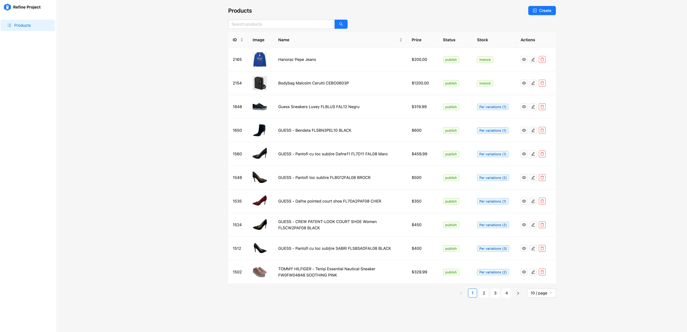

import Accordion from "../../layouts/components/widgets/Accordion.astro";
import Notice from "../../layouts/components/widgets/Notice.astro";
import ListCheck from "../../layouts/components/widgets/ListCheck.astro";
import Button from "../../layouts/components/widgets/Button.astro";

A client of mine runs [bigsales.ro](https://bigsales.ro/), a WooCommerce store with a large product catalog. They kept telling me the same thing: managing products in the default WooCommerce admin is painful. Slow page loads, too many clicks to change a price, no proper mobile view, and the bulk editor barely qualifies as "bulk."

I looked at the existing options, found none of them great for what we needed, and ended up building a custom dashboard from scratch. It is now open source and you can use it for your own store.

<Button text="Woo Admin on GitHub" link="https://github.com/bitdoze/woo-admin" variant="solid" color="purple" size="md" icon="arrow-right" />

## The problem with WooCommerce product management

If you have managed more than a handful of products in WooCommerce, you already know. The WordPress admin was designed for blog posts, and WooCommerce bolted product management on top of that. It works, but it does not work well.

Specific pain points my client kept running into:

- Editing a single product means loading the full WordPress editor, waiting for all those metaboxes, saving, and waiting again. On a shared hosting plan, that can take 5-10 seconds per page load.
- The bulk edit feature lets you change a few fields at once, but it is buried in a dropdown, the UI is cramped, and it chokes on large selections.
- No usable mobile interface. If you need to update stock from your phone while at a warehouse, good luck with the WP admin on a small screen.
- Searching and filtering products is basic. You cannot sort by stock status or quickly find products missing images.
- Every plugin you add to improve the admin adds more load to an already heavy page.

## What exists out there already

Before building something custom, I went through the existing options. There are a few categories:

### WordPress plugins for bulk editing

Plugins like **Smart Manager by StoreApps**, **WooCommerce Bulk Edit by iThemeland**, and **YITH Bulk Product Editing** add spreadsheet-style editing inside the WordPress admin. They work, and for simple price or stock updates they can be enough.

The downsides: they still run inside WordPress, so you inherit all the bloat. They add more PHP processing to already heavy admin pages. Some are free for basic features but lock useful stuff (like scheduled edits or variation management) behind paid tiers. And they still do not give you a fast, standalone interface.

### Hosted platforms

Shopify, BigCommerce, and similar platforms have better admin dashboards out of the box. But if you are already on WooCommerce, switching your entire e-commerce platform is not a quick fix. You picked WooCommerce for a reason (flexibility, no monthly fees, WordPress ecosystem), and those reasons probably still apply.

### Custom admin panels

A few developers have built custom React or Vue frontends that talk to the WooCommerce REST API. Most of them are abandoned or half-finished, and the ones that work are proprietary. I could not find a maintained open-source option that did the basics well.

That is what pushed me to build [Woo Admin](https://github.com/bitdoze/woo-admin).

## What Woo Admin does

Woo Admin is a standalone React app that connects to your WooCommerce store through the REST API. It runs in its own Docker container, completely separate from WordPress, so your store does not get any heavier.

The current feature set:

<ListCheck>
<ul>
<li>Browse products with server-side pagination and search</li>
<li>Desktop table view with sorting, plus a card layout on mobile</li>
<li>Create, edit, and delete products</li>
<li>Manage pricing (regular and sale prices) with flexible decimal input</li>
<li>Stock management: toggle tracking, set quantity, update status</li>
<li>Product type support: simple, variable, and external products</li>
<li>Image upload to WordPress and URL-based image management</li>
<li>Category assignment with hierarchical display</li>
<li>Global attribute management and term creation</li>
<li>Full variation CRUD for variable products</li>
<li>Product status control (published, draft, pending, private)</li>
<li>Mobile-friendly interface that actually works on a phone</li>
</ul>
</ListCheck>

## The tech stack

The frontend is React 18 with TypeScript and Vite. I went with Ant Design for the UI components because it has solid table, form, and layout components that I did not want to build myself. On top of that, I used Refine (`@refinedev/core` + `@refinedev/antd`), which is a framework specifically for admin panels. It gives you data provider patterns and CRUD hooks, so I spent my time on WooCommerce-specific logic instead of wiring up pagination and form state for the hundredth time.

For HTTP requests I used Axios. In production, the app compiles down to static files served by Nginx, which also handles the reverse proxy to the WooCommerce API. The whole thing ships as a Docker image with a multi-stage build: Node compiles the TypeScript, then the output gets copied into a small Nginx Alpine image.

## How it connects to WooCommerce

The app talks to the WooCommerce REST API (v3) and the WordPress REST API (for media uploads). There are two connection modes:

### Proxy mode (recommended)

In proxy mode, the frontend makes requests to relative paths like `/api/wc` and `/api/wp`. The Nginx container sitting in front of the app proxies those to your WooCommerce site and injects authentication headers.

This is the setup I recommend because:

- Your WooCommerce API credentials never appear in browser requests
- You do not need to configure CORS on your WordPress site
- It works behind any reverse proxy (Traefik, Caddy, another Nginx)

The proxy routes look like this:

```
/api/wc/*  →  https://your-store.com/wp-json/wc/v3/*
/api/wp/*  →  https://your-store.com/wp-json/wp/v2/*
```

### Direct API mode

If you do not want to use the built-in proxy, the frontend can call the WooCommerce API directly. Set `VITE_WC_API_BASE` to your store's full API URL and provide the consumer key and secret. This requires CORS to be properly configured on your WordPress installation.

## Project structure

The codebase is small and focused:

```
src/
├── components/
│   ├── ProductAttributesInput.tsx    # Global attribute selector
│   ├── ProductCategoriesInput.tsx    # Hierarchical category picker
│   ├── ProductImagesInput.tsx        # Upload + URL image manager
│   ├── ProductVariationsManager.tsx  # Variation CRUD
│   └── ProductVariationsTable.tsx    # Variation display
├── pages/products/
│   ├── list.tsx     # Product listing with table/card views
│   ├── create.tsx   # New product form
│   ├── edit.tsx     # Edit form with variation support
│   └── show.tsx     # Product detail view
├── providers/
│   └── wooDataProvider.ts   # Custom Refine data provider
├── App.tsx          # Routing and Refine config
└── main.tsx         # React entry point
```

The custom data provider (`wooDataProvider.ts`) is where the WooCommerce-specific logic lives: normalizing payloads, formatting prices, cleaning up image objects, and mapping between how Refine expects data and how the WooCommerce API actually works.

### Price normalization

One thing that tripped me up early: WooCommerce is picky about price formats in the API, and users type prices in all kinds of ways. The data provider normalizes prices before sending them:

- Accepts both `.` and `,` as decimal separators
- Strips currency symbols and whitespace
- Rounds to two decimal places
- If someone fills in only the sale price, it gets promoted to the regular price (a common mistake)

## How to deploy it

### Prerequisites

You need:

- A WooCommerce store with the REST API enabled
- WooCommerce API keys (go to WooCommerce → Settings → Advanced → REST API)
- Docker and Docker Compose on your server
- Optionally, a WordPress application password for media uploads

### Step 1: Clone the repo

```bash
git clone https://github.com/bitdoze/woo-admin.git
cd woo-admin
```

### Step 2: Create your .env file

```env
VITE_WC_API_BASE=/api/wc
VITE_WC_URL=https://your-store.com
VITE_WC_CONSUMER_KEY=ck_your_key_here
VITE_WC_CONSUMER_SECRET=cs_your_secret_here
VITE_WP_USERNAME=your_wp_user
VITE_WP_APP_PASSWORD=your_app_password
ACCESS_PASS=pick_a_strong_password
```

<Notice type="warning" title="Protect your dashboard">
  Always set `ACCESS_PASS`. Without it, anyone who finds the URL can manage your products. The dashboard uses HTTP Basic Auth with username `admin` and whatever password you set here.
</Notice>

### Step 3: Create the Docker network and start the container

```bash
docker network create web
docker compose up -d --build
```

That builds the frontend, packages it into an Nginx container, and starts serving. The entrypoint script generates the runtime configuration and Nginx proxy config automatically from your environment variables.

### Step 4: Set up a reverse proxy

The container exposes port 80 internally. Put it behind your existing reverse proxy (Traefik, Caddy, Nginx) with SSL termination. If you are running Docker apps with a panel, you can check my guide on [deploying Docker Compose apps with Dokploy](https://www.bitdoze.com/dokploy-docker-compose-app/).

If you have WordPress running in Docker too, check out my [WordPress Docker installation guide](https://www.bitdoze.com/install-wordpress-docker/) for the full setup.

## Local development

If you want to contribute or customize it for your store:

```bash
npm ci
npm run dev
```

The dev server starts on port 3000. Create a `.env` file with your store credentials and the app connects directly to your WooCommerce API. Make sure your store has CORS headers configured for `localhost:3000`, or use proxy mode.

```bash
npm run build      # Production build
npm run preview    # Preview the production build locally
```

## What the dashboard looks like in practice





My client's main complaint was "I just want to see my products and change a price without waiting 10 seconds." So the product list is the first thing you see. On desktop it is a sortable table with image thumbnails, stock badges, and action buttons. On a phone it switches to cards, which was the part my client actually uses most since they check stock from their warehouse.

The edit form groups related fields together instead of scattering them across metaboxes like WooCommerce does. Pricing is near the top, then stock, then categories and attributes, then images, then variations. Each section fetches data on demand, so the form does not choke even with thousands of products in the catalog.

One detail I am happy with: category assignment shows the full path (like "Electronics > Phones > Smartphones") so you immediately know where a product sits. In the default WooCommerce editor, nested categories are just indented checkboxes that get confusing past two levels.

## Frequently asked questions

<Accordion label="Does this replace the WordPress admin entirely?" group="faq" expanded="true">
  No. Woo Admin focuses on product management only. You still need the WordPress admin for orders, customers, settings, shipping, taxes, and everything else WooCommerce does. Think of it as a dedicated tool for the one task that the default admin handles poorly.
</Accordion>

<Accordion label="Can multiple people use the dashboard at the same time?" group="faq">
  Yes. Each user session talks to the WooCommerce API independently. There is no server-side session state. Just be aware that if two people edit the same product simultaneously, the last save wins.
</Accordion>

<Accordion label="Will this slow down my WooCommerce store?" group="faq">
  No. The dashboard runs in its own container and only talks to the WooCommerce REST API. It does not add any PHP code, plugins, or database queries to your store. The REST API calls are the same ones any external integration would make.
</Accordion>

<Accordion label="Can I run this without Docker?" group="faq">
  You can build the static files with `npm run build` and serve the `dist/` folder from any web server. You will need to configure the proxy yourself (or use direct API mode). Docker just makes the deployment and proxy setup turnkey.
</Accordion>

<Accordion label="Is it secure?" group="faq">
  In proxy mode, WooCommerce API credentials stay on the server. They never reach the browser. The optional `ACCESS_PASS` adds HTTP Basic Auth to the dashboard itself, so random people cannot stumble into it. For production, always run it behind HTTPS.
</Accordion>

<Accordion label="What about orders and customers?" group="faq">
  Not yet. The current version is product-focused. Orders and customer management might come later, but the priority was solving the product editing pain point first. If you want to contribute, the repo is open.
</Accordion>

## What is next

The repo is at [github.com/bitdoze/woo-admin](https://github.com/bitdoze/woo-admin) under the MIT license. I am running it in production for [bigsales.ro](https://bigsales.ro/) and my client stopped complaining about product management, which I consider a success. I will keep adding features as actual needs come up rather than guessing what people might want.

If your WooCommerce admin experience is as frustrating as mine was, clone the repo and try it. Takes about five minutes to get running with Docker. Issues and pull requests are welcome.
