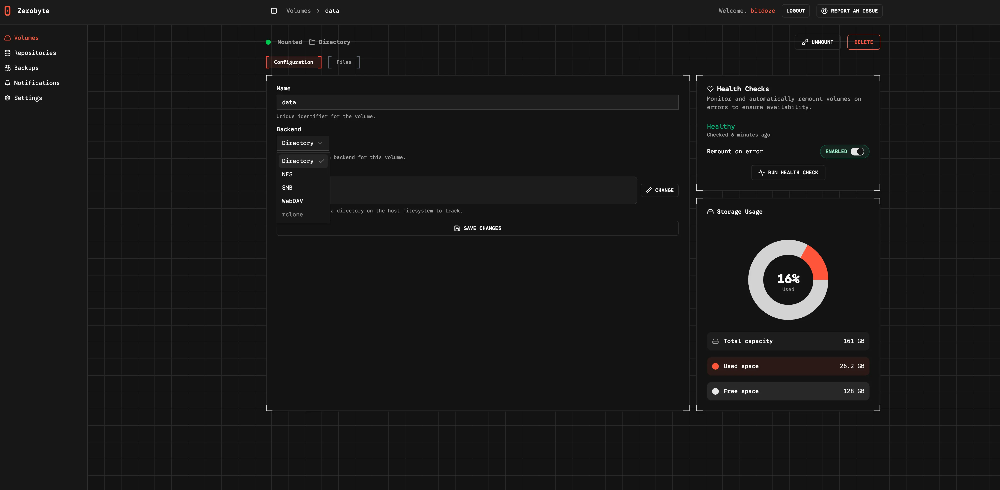
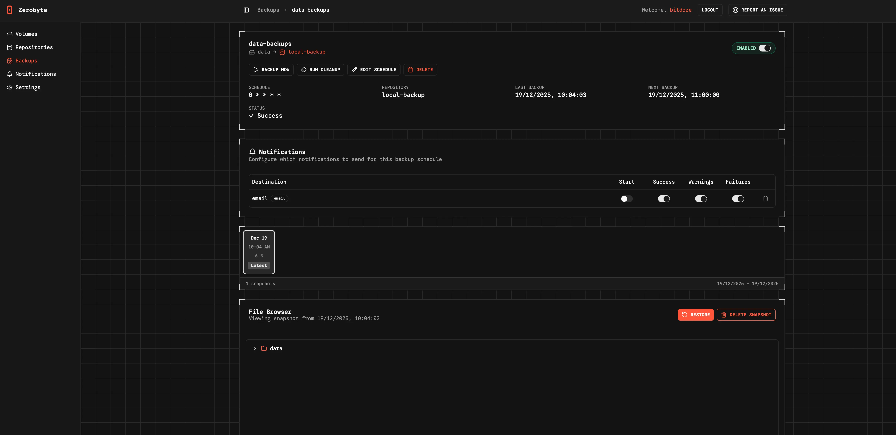
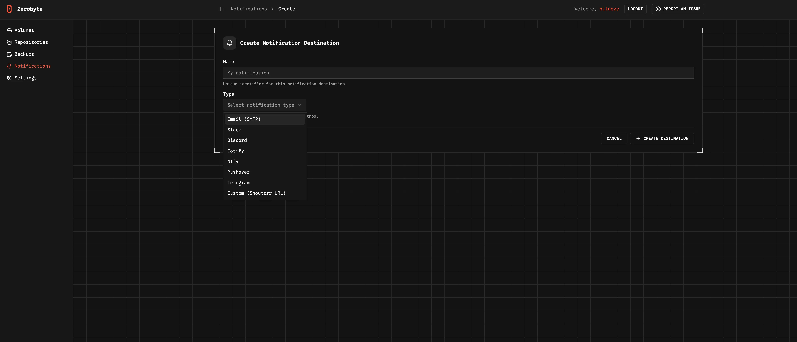

import Button from "@components/widgets/Button.astro";
import Notice from "@components/widgets/Notice.astro";
import ListCheck from "@components/widgets/ListCheck.astro";
import Accordion from "@components/widgets/Accordion.astro";

If you run a VPS, homelab, or any Linux server, backups are the only insurance that matters. Disks fail, updates break, and mistakes happen. Zerobyte gives you the reliability of [Restic](https://restic.net/) with a clean web UI, so you can automate backups without living in the terminal.

## What is Zerobyte?

[Zerobyte](https://github.com/nicotsx/zerobyte) is an open-source backup automation platform that wraps the Restic engine with a modern dashboard. It lets you create repositories, schedule jobs, and monitor snapshots from a web interface instead of managing everything by hand.

### Why Restic plus Zerobyte works

| Layer | Responsibility | What you get |
| --- | --- | --- |
| Restic | Encryption, deduplication, compression, repo format | Secure and efficient backups |
| Zerobyte | Web UI, scheduling, retention, logs | A usable control plane |

Together they deliver fast, encrypted backups with a workflow you can revisit months later and still understand.

### Key features

<ListCheck>
- Automated backups with retention policies powered by Restic
- End-to-end encryption by default
- Flexible schedules for daily, weekly, or custom jobs
- Multi-backend repositories: local, S3, GCS, Azure, rclone remotes
- Source volumes from local directories, NFS, SMB, or WebDAV
- Clear job logs and snapshot visibility in the UI
</ListCheck>

<Notice type="warning" title="Early-stage project">
Zerobyte is still in the 0.x series. Expect breaking changes between versions and keep a close eye on release notes.
</Notice>


<YouTubeEmbed
  url="https://www.youtube.com/embed/menR-JtmgLI"
  label="ZeroByte: The Most Powerful Open-Source Backup UI"
/>


## Zerobyte UI tour

The UI is straightforward and task-focused. Here's what the main sections look like and how to use them.

### Volumes: connect data sources



Volumes define the data you want to back up. Add local directories, NFS, SMB, or WebDAV sources, then reference them when creating backup jobs.

### Repositories: choose storage backends


Repositories are the encrypted destinations for your snapshots. Configure local paths, S3-compatible storage, or rclone remotes depending on where you want backups to live.

### Backups: monitor jobs and snapshots



This is your operational view. Track job status, verify recent runs, and confirm snapshots are being created on schedule.

### Notifications: avoid silent failures



Notifications let you control how Zerobyte reports job events. Set them up early so failed backups never go unnoticed.

## Prerequisites

<ListCheck>
- Linux server or VPS with Docker and Docker Compose installed
- At least 2 GB RAM recommended for smooth UI and backup jobs
- Local disk space for `/var/lib/zerobyte` (avoid network shares)
- Optional: rclone if you want cloud storage backends
</ListCheck>

<Button text="Try Hetzner Cloud Now" link="https://go.bitdoze.com/hetzner" variant="solid" color="blue" size="lg" external={true} icon="rocket-launch" />

## Option 1: Deploy with Dokploy

Dokploy is a straightforward way to deploy Docker apps with managed domains and SSL. If you don't have it yet, start here: [Dokploy install guide](https://www.bitdoze.com/dokploy-install/).

### Step 1: Create the service

1. Open your Dokploy project
2. Click Add Service and choose Compose
3. Name it `zerobyte`

### Step 2: Paste the compose file

```yaml
services:
  zerobyte:
    image: ghcr.io/nicotsx/zerobyte:v0.19
    networks:
      - dokploy-network
    restart: unless-stopped
    cap_add:
      - SYS_ADMIN
    devices:
      - /dev/fuse:/dev/fuse
    environment:
      - TZ=UTC
    volumes:
      - /etc/localtime:/etc/localtime:ro
      - zerobyte-data:/var/lib/zerobyte
      - /srv/backups:/backups
      - /srv/data:/data:ro
      - /etc/rclone:/root/.config/rclone:ro

networks:
  dokploy-network:
    external: true

volumes:
  zerobyte-data:
```

### Step 3: Domain and port

Create a domain in Dokploy and map it to port 4096. After deploy, open `https://your-domain.com` to access the UI.

**Notes about the compose file**

- `/srv/backups` is a sample local repository path. Change it to your storage location.
- `/srv/data` is the source data to back up. Mount it read-only when possible.
- `/etc/rclone` is optional. Remove it if you don't use rclone remotes.
- The UI listens on port `4096` by default.

<Notice type="info" title="Storage warning">
Keep `/var/lib/zerobyte` on local disk. Pointing it to a network share often causes permission issues and poor performance.
</Notice>

## Option 2: Docker Compose (standalone)

### Full setup (remote mounts enabled)

Use this if you need Zerobyte to mount NFS, SMB, or WebDAV shares inside the container.

```yaml
services:
  zerobyte:
    image: ghcr.io/nicotsx/zerobyte:v0.19
    container_name: zerobyte
    restart: unless-stopped
    cap_add:
      - SYS_ADMIN
    ports:
      - "4096:4096"
    devices:
      - /dev/fuse:/dev/fuse
    environment:
      - TZ=UTC
    volumes:
      - /etc/localtime:/etc/localtime:ro
      - /var/lib/zerobyte:/var/lib/zerobyte
```

Start it:

```bash
docker compose up -d
```

### Simplified setup (local folders only)

If you only back up local directories, drop the FUSE device and extra capabilities:

```yaml
services:
  zerobyte:
    image: ghcr.io/nicotsx/zerobyte:v0.19
    container_name: zerobyte
    restart: unless-stopped
    ports:
      - "4096:4096"
    environment:
      - TZ=UTC
    volumes:
      - /etc/localtime:/etc/localtime:ro
      - /var/lib/zerobyte:/var/lib/zerobyte
      - /srv/data:/data:ro
```

**Trade-offs**

- Better security with fewer privileges
- Works for local directories
- No direct NFS, SMB, or WebDAV mounts

## Add your first volume

Zerobyte backs up data from volumes (source locations). To back up a local directory, mount it into the container and then pick it from the UI.

Example host path:

```diff
services:
  zerobyte:
    volumes:
      - /var/lib/zerobyte:/var/lib/zerobyte
+     - /srv/projects:/projects:ro
```

Then go to Volumes in Zerobyte and create a new "Directory" volume that points to `/projects`.

## Create a repository

Repositories are where your encrypted backups live. Zerobyte supports multiple backends:

| Repository type | Example |
| --- | --- |
| Local directory | `/var/lib/zerobyte/repositories/myrepo` |
| S3 compatible | AWS S3, MinIO, Wasabi, Backblaze |
| Google Cloud Storage | GCS buckets |
| Azure Blob Storage | Azure containers |
| rclone remotes | Google Drive, Dropbox, OneDrive, etc |

### Using rclone for cloud storage

1. Install rclone on your host: `curl https://rclone.org/install.sh | sudo bash`
2. Configure a remote: `rclone config`
3. Mount the config into the container:

```diff
services:
  zerobyte:
    volumes:
      - /var/lib/zerobyte:/var/lib/zerobyte
+     - ~/.config/rclone:/root/.config/rclone
```

After restarting the container, choose rclone as the repository type and select your remote.

## Create your first backup job

1. Pick a source volume and a repository
2. Set a schedule (daily, weekly, or custom)
3. Add include and exclude paths
4. Configure retention (keep daily, weekly, monthly, yearly)
5. Run the job once manually to verify credentials and performance

## Restore data

Open Backups, select a snapshot, and restore files back to their original paths. For partial restores, pick only the files you need and Zerobyte will pull them from Restic.

## Post-deploy checklist

<ListCheck>
- Create at least one repository and test a manual backup
- Validate restores with a small file set
- Schedule jobs during low-usage windows for the first run
- Keep Zerobyte updated and review logs for failures
</ListCheck>

## Restic CLI commands you should know

```bash
# initialize a local repo
export RESTIC_REPOSITORY=/srv/backups/restic-repo
export RESTIC_PASSWORD="strong-password"
restic init

# create a backup
restic -r $RESTIC_REPOSITORY backup /home /etc

# list snapshots
restic -r $RESTIC_REPOSITORY snapshots

# forget and prune with a retention policy
restic -r $RESTIC_REPOSITORY forget --prune \
  --keep-daily 7 --keep-weekly 4 --keep-monthly 12 --keep-yearly 3
```

## Practical retention tips

- Test restores regularly. A backup you cannot restore is useless.
- Keep Zerobyte metadata on local disk for performance and permissions.
- Expect the first backup to be heavy on I/O and bandwidth.
- Keep at least one independent offline copy for critical data.
- Use `restic check` and inspect logs when a job fails.

## FAQ

<Accordion label="Do I need SYS_ADMIN and /dev/fuse?" group="faq" expanded="true">
Only if you want Zerobyte to mount NFS, SMB, or WebDAV shares inside the container. For local folders, remove the capability and device for a safer setup.
</Accordion>

<Accordion label="Where does Zerobyte store repositories?" group="faq">
Local repositories live under `/var/lib/zerobyte/repositories` by default. Cloud repositories are stored in the backend you configure.
</Accordion>

## Final thoughts

Restic gives you trustworthy, encrypted backups. Zerobyte adds the convenience of a modern dashboard and scheduling layer. If you want a low-maintenance, self-hosted backup system, this combo is hard to beat.

<Button text="View Zerobyte on GitHub" link="https://github.com/nicotsx/zerobyte" variant="solid" color="blue" size="md" icon="arrow-right" />
