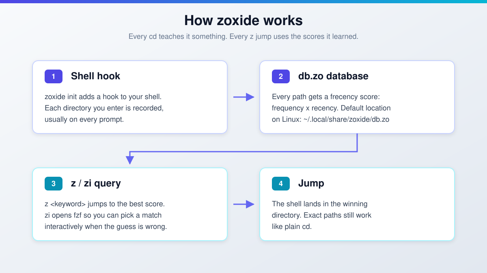

import Button from "@components/widgets/Button.astro";
import Notice from "@components/widgets/Notice.astro";
import ListCheck from "@components/widgets/ListCheck.astro";
import Accordion from "@components/widgets/Accordion.astro";
import Tabs from "@components/widgets/Tabs.astro";
import Tab from "@components/widgets/Tab.astro";
import { Picture } from "astro:assets";
import imag1 from "../../assets/images/24/02/zoxide-tutorial.gif";

Zoxide replaces `cd` with a jump command that learns which directories you use. This zoxide tutorial covers v0.10.0 (released 2026-07-04): how to install it, the one `zoxide init` line for your shell, and the `z` and `zi` commands that make terminal navigation faster. It also fixes the commands older tutorials get wrong. The interactive picker is `zi`, not `z -i`. Listing is `zoxide query -l`, not `z -l`. And `zoxide import` no longer takes `--from`. Everything below is written so you can run it tonight and verify each step.

## The problem with `cd`

`cd` is one of the [essential Linux commands](/linux-commands/) you type all day, and it works fine until your directory tree gets deep. Then you start retyping long paths, tab-completing three levels, or keeping a second terminal open just to avoid going back. The command is not the problem. Having to remember and type exact paths is.

A smarter `cd` alternative exists. It takes about five minutes to set up and costs nothing.

## What is Zoxide?

<Picture formats={["webp"]} fallbackFormat="webp" src={imag1} alt="Terminal recording of zoxide in use: typing z plus a partial directory name jumps straight to the best frecency match" />

[Zoxide](https://github.com/ajeetdsouza/zoxide) is a command-line tool that replaces `cd` for directory navigation. It's inspired by tools like `z` and `autojump`, written in Rust, MIT licensed, and sitting at roughly 40,000 GitHub stars as of 2026-10-07. It runs on Linux, macOS, Windows, and BSD, and it supports Bash, Zsh, Fish, PowerShell, Nushell (v0.106.0+), Elvish (v0.18.0+), Tcsh, Xonsh, and any POSIX shell (ksh included, via `zoxide init posix`).

Zoxide is a directory tracker. A shell hook records the directories you visit and assigns each one a "frecency" score, a blend of frequency and recency. The more often and the more recently you visit a directory, the higher it ranks in the database.



The database is small and local, but it is reusable. File managers such as yazi, lf, nnn, ranger, felix, and superfile read it natively, Neovim users get it through telescope-zoxide and zoxide.vim, and tmux session pickers like tmux-sessionx, sesh, and zesh jump straight to your scored directories. That's the sign of a tool that stuck: other tools build on its data. It also slots into whatever terminal you already run. See my [Ghostty terminal setup guide](/ghostty-terminal/) if your dotfiles are due for a refresh, or [Integrating Wezterm, Zoxide, and Tmux for the Perfect Mac Terminal](https://www.bitdoze.com/install-wezterm-mac/) for a full Mac stack.

### How Zoxide differs from `cd`

Unlike `cd`, zoxide learns from your behavior. It doesn't need exact path names. It predicts where you want to go from partial inputs and your usage history. Type `z proj` instead of `cd /home/user/code/work/clients/acme/project-api`, and if `project-api` is the directory that matches "proj" most often and most recently, that's where you land.

### Benefits of Zoxide

The advantages are real but small: one short command to any directory, partial keywords instead of full paths, and no mental map of deep trees to maintain.

| What you get      | `cd` Command | `zoxide`              |
| ----------------- | ------------ | --------------------- |
| Path input        | Exact path   | Partial keyword       |
| Learns from usage | No           | Yes (frecency)        |
| Setup             | Nothing      | One init line         |
| Extra data kept   | None         | Local `db.zo`         |

<Notice type="info" title="Zero cost, zero cloud">
Zoxide is free, MIT licensed, and fully local. No account, no daemon, no telemetry, no API key. It's a zero-cost addition to any workstation or VPS. Handy when you live in SSH sessions on a cheap box like [Hetzner Cloud](https://go.bitdoze.com/hetzner) (the EUR 4-5/mo class is plenty). The only real cost is the minute it takes to add the init line.
</Notice>

## How to install Zoxide

Installing zoxide takes a few minutes end to end: install the binary, add one init line to your shell config, then verify with a test jump.

**What you need:**

<ListCheck>
<ul>
<li>Linux, macOS, Windows, or BSD. Zoxide ships prebuilt binaries for all of them</li>
<li>One supported shell: Bash, Zsh, Fish, PowerShell, Nushell (v0.106.0+), Elvish (v0.18.0+), Tcsh, Xonsh, or any POSIX shell</li>
<li>fzf v0.51.0+ if you want `zi`, `zoxide edit`, and Space-Tab completions (current fzf is v0.74.4, released 2026-09-12)</li>
<li>About 5 minutes, and a new shell session to test in</li>
</ul>
</ListCheck>

Install fzf alongside zoxide if you want the interactive picker. On macOS that's `brew install fzf`; on Linux, use your distro package or the fzf release binaries. The minimum supported fzf version is v0.51.0.

<Notice type="warning" title="Skip apt on Debian/Ubuntu">
Do not `sudo apt install zoxide` on Debian or Ubuntu. The official README strikes those distros for a reason: their packages update very slowly. Ubuntu 24.04 (noble) still ships zoxide 0.9.3-1 as of 2026-10-07: no startup doctor, no Tcsh support, no 0.9.8 database-corruption fix, nothing from 0.10.0. Ubuntu 25.10 ships 0.9.7-1, still two minor versions behind. Use the install script below.
</Notice>

### Installation instructions

| Operating System      | Shell      | Installation Command                             |
| --------------------- | ---------- | ------------------------------------------------ |
| macOS                 | bash/zsh   | `brew install zoxide`                            |
| Linux (Debian/Ubuntu) | any        | `curl -sSfL https://raw.githubusercontent.com/ajeetdsouza/zoxide/main/install.sh \| sh` |
| Linux (Arch)          | bash/zsh   | `sudo pacman -S zoxide`                          |
| Windows               | PowerShell | `winget install ajeetdsouza.zoxide`              |
| Any                   | Any        | `curl -sSfL https://raw.githubusercontent.com/ajeetdsouza/zoxide/main/install.sh \| sh` |

On Windows, `scoop install zoxide` and `choco install zoxide` still work if you already use those managers. `winget` is just the first recommendation in the README now. To build from source: `cargo install zoxide --locked`.

After install, check the version before going further:

```bash
zoxide --version
```

Expect `zoxide 0.10.x`. If you see 0.9.3 or 0.9.7, you got the distro package. Remove it and rerun the install script.

### Add Zoxide to your shell (`zoxide init`)

The init line must go at the **very end** of your shell's rc file. The startup doctor checks hook placement, and putting zoxide last is what makes it see every directory change. Pick your shell:

<Tabs>
<Tab name="Bash">
Add to the end of `~/.bashrc`:

```bash
eval "$(zoxide init bash)"
```
</Tab>
<Tab name="Zsh">
Add to the end of `~/.zshrc`:

```bash
eval "$(zoxide init zsh)"
```

Zoxide works out of the box with Oh My Zsh. Just add the init line. If you're building out a Zsh setup, see the [best Oh My Zsh plugins](/best-oh-my-zsh-plugins/) for what else is worth enabling in 2026.
</Tab>
<Tab name="Fish">
Add to `~/.config/fish/config.fish`:

```fish
zoxide init fish | source
```
</Tab>
<Tab name="Other shells">
PowerShell, end of `$profile`:

```powershell
Invoke-Expression (& { (zoxide init powershell | Out-String) })
```

Nushell (minimum v0.106.0 as of zoxide 0.10.0), then source it in your config:

```nu
zoxide init nushell | save -f ~/.zoxide.nu
```

Tcsh (`~/.tcshrc`), two lines instead of an eval one-liner:

```tcsh
zoxide init tcsh > ~/.zoxide.tcsh
source ~/.zoxide.tcsh
```

Xonsh (`~/.xonshrc`):

```python
execx($(zoxide init xonsh), 'exec', __xonsh__.ctx, filename='zoxide')
```

Any POSIX shell (dash, ksh):

```sh
eval "$(zoxide init posix --hook prompt)"
```
</Tab>
</Tabs>

That's the whole configuration. The database starts empty and fills in as you `cd` around. Expect the first day or two to feel unremarkable. Zoxide has nothing to rank yet. After that the jumps get noticeably better.

### Verifying the installation

Open a **new** shell first (init lines don't affect the session you added them in), then run this:

```bash
zoxide --version        # expect 0.10.x
type z                  # z is a shell function after init, which proves the hook loaded
mkdir -p ~/tmp/demo && cd ~/tmp/demo
cd ~ && z demo          # should land back in ~/tmp/demo
zoxide query -l         # the entry appears, sorted by frecency
pwd                     # confirm you are in ~/tmp/demo
```

If `type z` reports "not found", the init line isn't being sourced. Check it's at the end of the right rc file and that you opened a new shell. If `z demo` prints `zoxide: no match found`, walk one `cd` into the directory first so it gets recorded, then retry.

<Notice type="success" title="Verified on zoxide 0.10.0">
These exact commands were run against the 0.10.0 binary on 2026-10-07. `type z` returns a shell function, `z demo` jumps to a freshly visited directory, and `zoxide query -l` lists it. Zsh users: if completions misbehave after install, `rm ~/.zcompdump*` and rerun `compinit`.
</Notice>

## Using Zoxide

Once zoxide is installed and configured, the day-to-day surface is small: `z`, `zi`, and a handful of `zoxide` subcommands.

### Jumping with `z`

The primary command is `z`. It jumps to a directory using only part of the path. If you frequently visit `/home/user/projects/my_project`:

```bash
z my_project
```

zoxide takes you there, assuming `my_project` scores highest for that keyword.

It's smarter than a plain name match. Suppose you have two directories:

- `/home/user/projects/my_project`
- `/home/user/documents/my_project_report`

If you've been working mostly in the projects directory, `z my_project` goes there. If you start working more in the report directory, `z my_project` will usually start favoring it instead, because frecency tracks what you did recently.

One behavior worth knowing: if the query is an exact, `cd`-able path, the `z` wrapper just `cd`s there and skips the database entirely. `z ~/tmp/demo` is a plain `cd`, not a search.

### Interactive selection with `zi` (fzf)

When you're not sure which directory you want, or several match, use `zi`. It opens fzf on the matching directories and jumps to whatever you pick.

```bash
zi proj
```

<Notice type="warning" title="There is no z -i">
Older tutorials show `z -i` for interactive mode. That command does not exist. `z -i` passes `-i` to the search as a keyword, so you get `zoxide: no match found`. The interactive command is `zi`, a wrapper for `zoxide query --interactive`. Same story for `z -l`: use `zoxide query -l`.
</Notice>

`zi` needs fzf v0.51.0 or newer. Tune the picker with `_ZO_FZF_OPTS`. In Fish, Space-Tab completions (new in 0.10.0) display and run the selected command. If you use Fish and want interactive selection built into the shell itself, see [Fish Shell autocomplete and suggestions](/fish-shell-autocomplete-suggestions/). One caveat: the Warp terminal doesn't support zoxide's Space-Tab completions. Warp ships its own completion system.

### Zoxide command reference

This is the corrected table. The old `z -l` / `z -i` rows you'll find on other sites are wrong.

| Command                              | Description                                                                  |
| ------------------------------------ | ---------------------------------------------------------------------------- |
| `z <query>`                          | Jump to the highest-frecency directory matching the query                    |
| `zi <query>`                         | Interactively select a directory with fzf (requires fzf)                     |
| `zoxide query -l`                    | List all matching directories, sorted by frecency                            |
| `zoxide query -s`                    | Print the frecency score alongside each result                               |
| `zoxide query --base-dir <path>`     | Restrict the search to one directory tree                                    |
| `zoxide query --exclude <path>`      | Exclude a path from the match                                                |
| `zoxide remove <path>`               | Remove a directory from the database                                         |
| `zoxide remove -i`                   | Interactively pick entries to remove                                         |
| `zoxide edit`                        | Interactive fzf-based database editor (requires fzf)                         |

`zoxide edit` is not a score-tweaking CLI flag. It opens fzf on the database so you can prune entries interactively. If fzf isn't installed, it errors out with `zoxide: could not find fzf, is it installed?`.

### Tips for mastery

- Use `zoxide query -l` (not `z -l`) to see where `z` might take you, sorted by frecency.
- Use `zoxide query -s` when you want to see *why* a directory ranks where it does.
- Exclude noisy trees with `_ZO_EXCLUDE_DIRS` so they never become jump targets.
- Prune stale entries with `zoxide edit` (or `zoxide remove -i` if you prefer picking from a list).
- Pair with fzf v0.51.0+ for `zi` and Space-Tab completions.

<Notice type="info" title="About zoxide doctor">
`zoxide doctor` is not a subcommand. Running it prints `error: unrecognized subcommand 'doctor'`. The doctor is a shell function that `zoxide init` defines, and it runs automatically at your first prompt (Bash and Zsh since v0.9.7, POSIX shells since v0.9.8). If your init line isn't at the end of your rc file, it warns: *"Please ensure that zoxide is initialized right at the end of your shell configuration file (usually ~/.bashrc). Disable this message by setting `_ZO_DOCTOR=0`."* Fix the placement, or take the hint and set `_ZO_DOCTOR=0`.
</Notice>

## Coming from z, Autojump, or Atuin (`zoxide import`)

If another jump tool already built up a history, don't throw it away. `zoxide import` pulls databases from the usual suspects:

```bash
zoxide import z          # from z.sh
zoxide import zsh-z      # zsh-z support, new in 0.10.0
zoxide import autojump
zoxide import fasd
zoxide import z.lua
zoxide import atuin      # new in 0.10.0, pulls directories out of atuin shell history
zoxide import z --merge  # merge into the existing db instead of replacing
```

Database files are auto-detected. Since 0.10.0 the import also respects `_ZO_EXCLUDE_DIRS`, so excluded trees stay excluded.

<Notice type="warning" title="Breaking syntax change in 0.10.0">
`zoxide import` now takes a subcommand, not a `--from` flag. The old `zoxide import --from z` is gone. If you have old snippets in your dotfiles or bootstrap scripts, update them to `zoxide import z` before you upgrade.
</Notice>

## Configuring Zoxide (environment variables and custom commands)

Everything tunable lives in `_ZO_*` environment variables and `zoxide init` flags. Set the variables in the same rc file, *above* the init line.

| Variable               | Default                                                                                                                     | Effect                                                          |
| ---------------------- | --------------------------------------------------------------------------------------------------------------------------- | --------------------------------------------------------------- |
| `_ZO_DATA_DIR`         | Linux/BSD: `$XDG_DATA_HOME/zoxide` or `~/.local/share/zoxide`; macOS: `~/Library/Application Support/zoxide`; Windows: `%LOCALAPPDATA%\zoxide` | Where the database lives                                  |
| `_ZO_EXCLUDE_DIRS`     | `$HOME`                                                                                                                     | Glob list of directories to never rank (`:`-separated on Linux/macOS) |
| `_ZO_MAXAGE`           | `10000`                                                                                                                     | Aging cap on database entries                                   |
| `_ZO_RESOLVE_SYMLINKS` | off                                                                                                                         | Store canonical paths instead of symlinked ones (works on Windows since 0.10.0) |
| `_ZO_ECHO`             | off                                                                                                                         | Print the matched directory before jumping                      |
| `_ZO_FZF_OPTS`         | none                                                                                                                        | Extra fzf options for `zi`                                      |
| `_ZO_DOCTOR`           | `1`                                                                                                                         | Set `0` to silence the startup doctor                           |

Two of these surprise people. `_ZO_EXCLUDE_DIRS` defaults to `$HOME`: home itself is never a jump target, which is intentional (you don't need a fuzzy tool to get to `~`). And on Linux/macOS the exclude list is `:`-separated, not space-separated.

For the command names themselves, `zoxide init` takes flags:

- `--cmd j`: rename the commands (`j` / `ji` instead of `z` / `zi`)
- `--cmd cd`: replace `cd` entirely
- `--no-cmd`: define your own functions from `__zoxide_z` and `__zoxide_zi`
- `--hook pwd` (default) / `--hook prompt` / `--hook none`: when the database gets updated (on every directory change, once per prompt, or never, with manual `zoxide add` only)

Example, a `j`/`ji` setup on Bash:

```bash
eval "$(zoxide init bash --cmd j)"
```

## Zoxide database location and backup

On Linux the database is a single file: `~/.local/share/zoxide/db.zo`. It's tiny. A few entries is a handful of bytes, and even years of use stays in the low KB. There's no service, no lock file to babysit, nothing to migrate except that one file.

<Notice type="info" title="Backup tip">
Add `db.zo` to whatever you already use for dotfiles or backups: a git repo, restic, or an S3 sync job. Copying the file to a new machine carries your frecency history with you, so `z` works on day one instead of relearning for a week.
</Notice>

Per-OS defaults (override with `_ZO_DATA_DIR` if you want everything under `~/.config`):

| OS          | Default location                                  |
| ----------- | ------------------------------------------------- |
| Linux / BSD | `~/.local/share/zoxide/db.zo` (or `$XDG_DATA_HOME/zoxide`) |
| macOS       | `~/Library/Application Support/zoxide/db.zo`      |
| Windows     | `%LOCALAPPDATA%\zoxide\db.zo`                      |

One version note worth knowing: before v0.9.8 (2025-05-26), zoxide could corrupt its database if the filesystem was 100% full. That's fixed. It's also the practical argument against running Ubuntu 24.04's 0.9.3 package on anything you care about.

## Troubleshooting Zoxide

**`zoxide: no match found`** means the database is empty (learning phase) or your keyword never matched. Check `zoxide query -l` to see what's recorded. Remember that exact paths bypass the database by design, `_ZO_EXCLUDE_DIRS` defaults to `$HOME`, and `_ZO_MAXAGE` (10000) ages old entries out.

**`zoxide: could not find fzf`** means `zi`, `zoxide edit`, and Space-Tab completions all lack their dependency. Install fzf v0.51.0+ and make sure it's on your `PATH`.

**A doctor warning at every prompt** means your init line isn't the last thing in your rc file. Move it to the end. If you know what you're doing and want silence: `_ZO_DOCTOR=0`.

**Zsh completions acting up** is usually a stale compdump. `rm ~/.zcompdump*` then start a new shell (or rerun `compinit`).

**Space-Tab completions in the Warp terminal** are unsupported; Warp runs its own completion system. `z` and `zi` still work.

**Symlinked directories behaving oddly** should stop after v0.10.0, which fixed relative-path handling through symlinks. If you want canonical paths in the database, set `_ZO_RESOLVE_SYMLINKS=1`.

**`zoxide import --from z` failing** is expected: the `--from` flag was removed in 0.10.0. Use `zoxide import z`.

**The Ubuntu package is ancient** and there is no nicer way to say it. Remove it and reinstall with the [install script](#installation-instructions).

**Rolling back** is simple. To drop a bad entry, run `zoxide remove <path>` or `zoxide remove -i`. To remove zoxide entirely: delete the init line from your rc file, `brew uninstall zoxide` (or your platform's equivalent), and delete the data dir (`~/.local/share/zoxide` on Linux). Nothing else on the system is touched.

<Button text="zoxide releases on GitHub" link="https://github.com/ajeetdsouza/zoxide/releases" variant="outline" size="sm" />

## Zoxide and zsh-autocomplete

Pairing zoxide with `zsh-autocomplete` gives you directory jumping and real-time auto-completion together. zsh-autocomplete is a Zsh plugin that suggests files, directories, and command options as you type, so you memorize less and type less.

zsh-autocomplete is listed as natively supported in zoxide's own integrations table. No glue code required. zoxide works by default with Oh My Zsh: install it, add the init line at the end of `~/.zshrc`, done. For the completion side, follow [How to Enable Command Autocomplete in ZSH](https://www.bitdoze.com/enable-command-autocomplete-in-zsh/) and you'll have both working.

## Alternatives to Zoxide

zoxide is the default recommendation for a reason, but the alternatives are real and some of them are one-liners away from importing into zoxide later.

**z (Jump Around)** is the tool that inspired zoxide. It jumps to the most 'frecent' directory matching your regexes. Pure shell script, no binary. Maintenance has been quiet for years.

**Autojump** is an older Python-based jumper using partial names and a self-learning algorithm. It works, but development slowed long ago.

**fzf** is not a jumper but a fuzzy finder. It solves a different problem (picking from any list), which is why zoxide uses it for `zi` rather than competing with it.

**z.lua** is a Lua port focused on speed, with several matching modes. Interesting if you're already deep in a Lua config stack.

**fasd** gives quick access to both files and directories, inspired by `autojump` and `v`. Largely unmaintained at this point.

**zsh-z** is a pure-Zsh reimplementation of `z`, popular with people who want zero dependencies. zoxide can import its database (`zoxide import zsh-z`).

**atuin** is a shell history tool, not a jumper, but its data now feeds zoxide directly (`zoxide import atuin`). Useful if your history already knows where you've been.

| Tool     | Description                                       | What it does best          |
| -------- | ------------------------------------------------- | --------------------------- |
| z        | Navigate using 'frecent' directories with regexes | Regex pattern matching      |
| autojump | Jump to frequently visited directories            | Self-learning algorithm     |
| fzf      | Fuzzy finder for files and directories            | Customizable search tool    |
| z.lua    | Fast directory jumping                            | Speed and flexible matching |
| fasd     | Quick access to files and directories             | Frequency-based list        |
| zsh-z    | Pure-Zsh `z` reimplementation                     | Zero dependencies           |
| atuin    | Shell history with sync                           | Importable directory data   |

My default is zoxide: single static binary, every shell I use is supported, and the database format is useful to other tools. If you refuse to install a binary, zsh-z is the fallback.

## FAQ

<Accordion label="Is zoxide free?" group="faq" expanded="true">
Yes. zoxide is MIT licensed and completely free. No account, no cloud sync, no telemetry, no paid tier. The database lives in one local file and you can delete it whenever you want.
</Accordion>

<Accordion label="Can zoxide replace `cd`?" group="faq">
Yes. Run `zoxide init --cmd cd` and zoxide's wrapper takes over `cd`: exact paths behave like normal `cd`, while partial keywords use the frecency database. See the Configuring section for the flag list.
</Accordion>

<Accordion label="Does zoxide work with Oh My Zsh and on Windows?" group="faq">
Both yes. Oh My Zsh needs no plugin wiring. Just the `eval "$(zoxide init zsh)"` line at the end of `~/.zshrc`. On Windows, `winget install ajeetdsouza.zoxide` is the recommended install, and the PowerShell init goes at the end of `$profile`.
</Accordion>

<Accordion label="What is `zi`?" group="faq">
`zi` is zoxide's interactive command. It runs `zoxide query --interactive`, which opens fzf on the matching directories so you pick one instead of trusting the top score. It needs fzf v0.51.0+. There is no `z -i`. That's a common error in older tutorials.
</Accordion>

## Conclusion

Zoxide 0.10.0 (released 2026-07-04) makes terminal navigation faster by scoring the directories you use and jumping to them from a partial keyword. The version history is worth knowing when you read other guides: the automatic startup doctor landed in 0.9.7 (2025-02-09), Tcsh support, `zoxide add --score`, and the database-corruption fix landed in 0.9.8 (2025-05-26), and 0.10.0 added atuin import, `$CDPATH` handling in `z`, and RISC-V Linux binaries. It runs on Bash, Zsh, Fish, PowerShell, Nushell (v0.106.0+), Elvish (v0.18.0+), Tcsh, Xonsh, and any POSIX shell.

The setup is three steps: install via the script (or brew/pacman/winget), put the `zoxide init` line at the very end of your rc file, and verify with `type z` plus a test jump. Then stop typing long paths.

Zoxide also works with [Fish Shell](/install-fish-shell-ubuntu/). If you're interested in trying Fish, check out the [best Fish Shell plugins](/best-fish-shell-plugins/) (zoxide is included) or my [Fish Shell vs Bash vs Zsh](/fish-shell-vs-bash-vs-zsh/) comparison.

<Button text="Get zoxide on GitHub" link="https://github.com/ajeetdsouza/zoxide" variant="solid" color="blue" size="md" />
